# Pantheon: Bloodlines — game experience and art direction

**Accepted visual direction.** A moonlit sanctuary, a dark stone table, and a hand of luminous painted cards. The player should feel seated inside a Greek myth, with an empire taking shape beneath their hands.

These are **generated game concept paintings**, guided by our approved card faces, illustrations and backs. They replace the earlier web-layout mockups entirely. Their purpose is to establish the look, spatial composition and emotional quality of a finished game. They are not screenshots of a working implementation. Desktop and portrait mobile are designed as distinct compositions of the same game.

Implementation follows [IMPLEMENTATION_PLAN.md](IMPLEMENTATION_PLAN.md), with a visual and E2E review at each milestone.

The [rules](MVP_CARDSET.md) and [approved catalog](docs/ASSETS.md) remain authoritative. Generated lettering, thumbnail symbols and incidental pile numbers are illustrative; implementation must place the unchanged catalog faces and exact game values into the approved composition. Do not reproduce a generated typo, altered cost, invented label or simplified card face as a new rule or asset.

## The visual promise

**The table is the interface.** Opponents sit across from you. Your hand belongs at the near edge. Cards move between recognizable places. The next useful action is a clear, tactile object within reach. A divine blessing changes the light around its altar; it does not navigate to a form.

Dark indigo stone gives the cards room to glow. Antique bronze and restrained laurel ornament connect the controls to the approved frames. Athena’s indigo, Poseidon’s turquoise, Demeter’s olive and Ares’s oxblood identify affiliations without recoloring the common deck back. Painted sanctuary light provides atmosphere at the edges; the playing field stays calm enough to read. Avoid an equal border around every object, ornamental noise behind small text, and controls that resemble website panels.

Use the cards as precious physical objects: slight elevation, grounded shadows, a crisp selected edge and deliberate movement. Deck cards retain their portrait 5:7 proportions; gods retain landscape 7:5; leaders retain their larger landscape 8:5. A small portrait medallion may stand for a leader at a seat, but opening it reveals the actual leader card. All three approved back families remain distinct; every hidden deck card uses the same common back.

The imagery is aspirational. The measurable interaction contract below prevents the atmosphere from compromising legibility, speed or privacy.

## One table, two compositions

### Desktop

The far edge holds the other seats and their hidden hands. Supply occupies the upper field, with compact basics and an expandable Action selection. Shared god cards sit in landscape recesses at the flanks. The center is open play space. Your hand, deck, discard and leader anchor the near edge. A resource rail separates hand from play, with the current phase and its advance control beside it.

Keep useful context visible together. Buying should feel like reaching toward a pile; Worship should feel like turning toward a god. Inspection lifts a card over the table and dims competing detail. Chronicle and public piles open as trays over the same space. No persistent website header, navigation sidebar or dashboard grid.

### Portrait mobile

Do not shrink the desktop board. Compress opponents into portrait medallions and counts at the far edge; show one focal play group in the center. The hand occupies the lower portion, with titles exposed and the selected card raised. Supply and Worship are recognizable edge tokens; opening one temporarily occupies the central arena. Put the committing action in the lower thumb zone, above the device safe area.

A hand may look fanned, but its interactive regions must not overlap. Use exposed title tabs with disjoint hit regions; selecting a tab raises that card and exposes an explicit Play/Inspect action. Large hands slide between groups with visible continuation and Previous/Next alternatives. A long press can inspect, but is never the only route. Do not crop a title, resource number or confirmation to fit ornamental framing.

## Screen paintings

Each wide concept plate places **desktop on the left and mobile on the right**. The main table has separate full-size images. Open an image to examine the artwork. These are the complete screen families; the variants table later defines the states that reuse them rather than adding more navigation.

### 01 · Enter the sanctuary

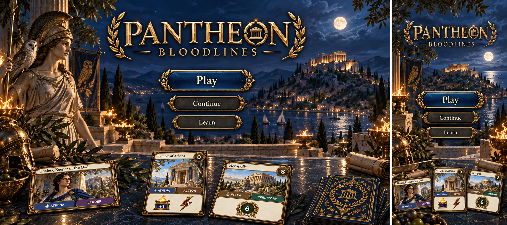

**Play:** Play opens a gathering; Continue returns to the current table; Learn opens the illustrated codex.

**Signifiers and affordances:** Three clearly separated sculpted choices; Continue appears only when there is a table to return to. The sanctuary and title lead, not explanatory copy.

**Motion and transition:** A slow camera approach settles at the table. Reduced motion cuts directly. Return from a game never reveals a hand on a public screen.

**E2E stories:** 002, 018.

### 02 · Gather your players

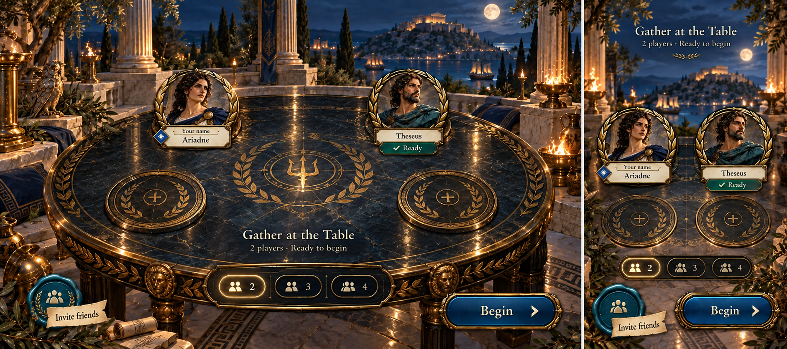

**Play:** Choose a name and 2–4 seats, invite friends or join an invitation. Host begins when every seat is occupied. Guests wait at their named seats.

**Signifiers and affordances:** Occupied portrait medallions, empty seat rings and a lit seat-count choice. Copy: Invite friends, Waiting for Theseus, Begin. Invalid name: Choose a name. Full invitation: This table is full; Find another table.

**Motion and transition:** A new seat lights once and receives its name. Begin settles the first-player marker, then moves into reverse-order leader selection. No cards are dealt during gathering.

**E2E stories:** 002, 003.

### 03 · Choose your bloodline

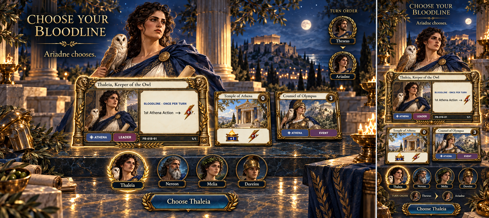

**Play:** Inspect unused leaders, see the linked god and Temple, and confirm one unique leader on your draft turn.

**Signifiers and affordances:** Large selected character, actual landscape leader card, smaller linked Temple and god. Taken portraits carry the owner's name. Copy: Ariadne chooses; Choose Thaleia; Waiting for Theseus.

**Motion and transition:** Chosen leader moves to its seat; corresponding event enters the shared altar area. After the last choice, ten starting cards form each deck and five are dealt. Only their owner sees faces. No extra ready-up screen is needed.

**E2E stories:** 003, 004.

### 04 · Your turn at the table

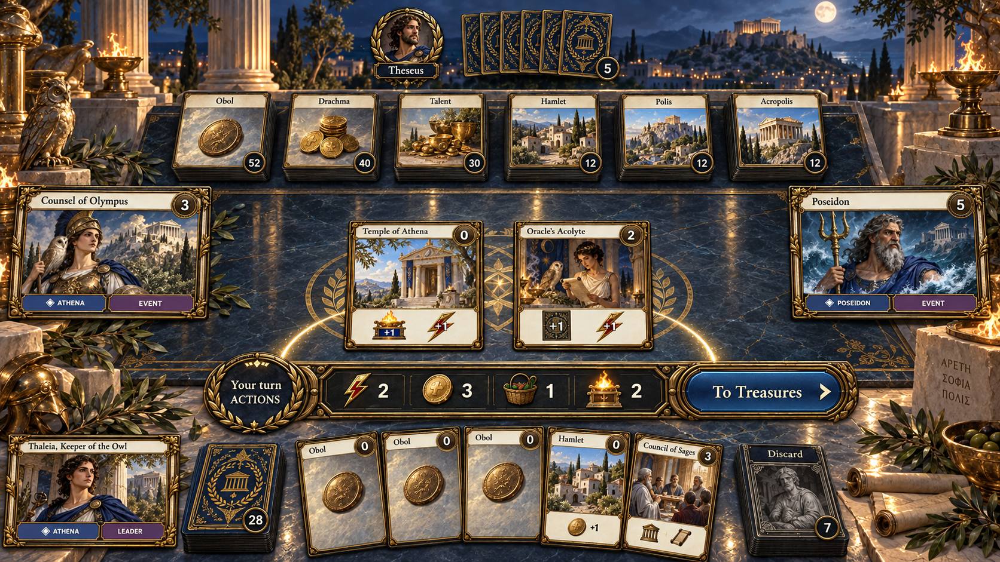

[Open the full portrait mobile composition](docs/ux/concepts/04-table-mobile.png).

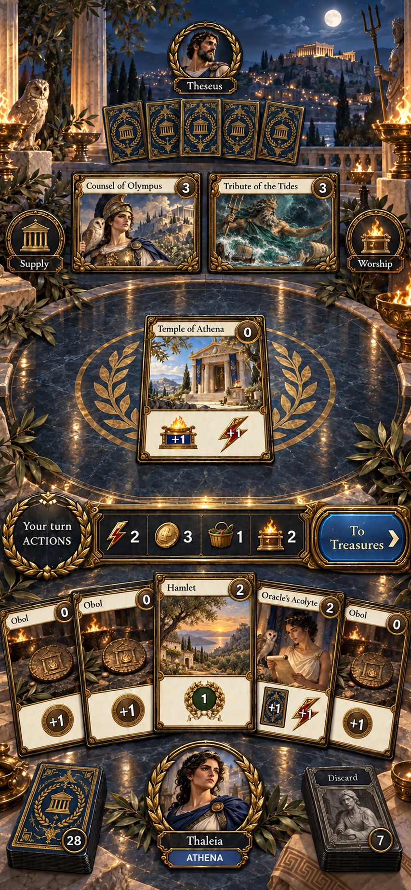

**Play:** Select a hand card, inspect or explicitly Play it; advance with To Treasures. Reach Supply, Worship, leader, public piles and Chronicle without leaving the table.

**Signifiers and affordances:** Raised selection, a legal-play edge light plus Play label, phase medallion, resource rail and clear destination zones. Territories have no Play action. Other seats are visually quieter than the active seat.

**Motion and transition:** Played card travels hand → play, resource deltas settle, then a matching leader responds. Required choices take focus; automatic effects finish without an extra Continue click. The table remains the spatial anchor.

**E2E stories:** 004, 005, 014.

### 05 · Play your wealth

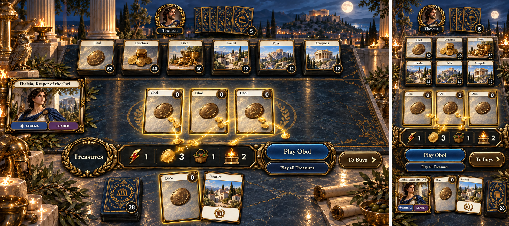

**Play:** Play one Treasure at a time, or choose Play all Treasures. Keep a Treasure in hand if desired. To Buys advances the phase.

**Signifiers and affordances:** Coins flow from the actual played card to its counter. Selected Obol is raised. Bulk play is visibly secondary to the individual card choice. Phase confirmation names what will be left: Leave these Treasures unplayed?

**Motion and transition:** Cards move into the same play row in order. Worship remains available between individual fully resolved plays. To Buys changes the phase medallion without changing the table.

**E2E stories:** 006.

### 06 · Build your empire

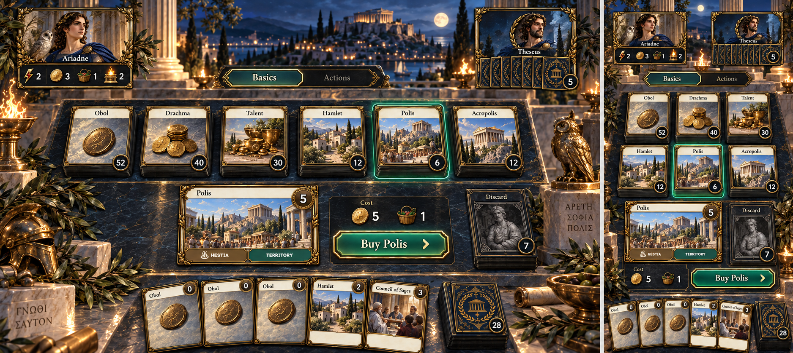

**Play:** Browse Basics and Actions; inspect a pile, then confirm Buy. Filters change the view, never the game supply.

**Signifiers and affordances:** Actual framed cards, cost wells and separate remaining-stock beads. Selected pile lifts and illuminates the destination discard. Disabled reasons: Need 2 more Coins, No Buys left, Empty pile. End turn remains available even when buying is impossible.

**Motion and transition:** One purchased face moves pile → discard; stock, Coins and Buys change together. Stay on this pile for additional buys. An emptying pile darkens; game-end evaluation still waits for cleanup.

**E2E stories:** 007, 012.

### 07 · Read a card and commit

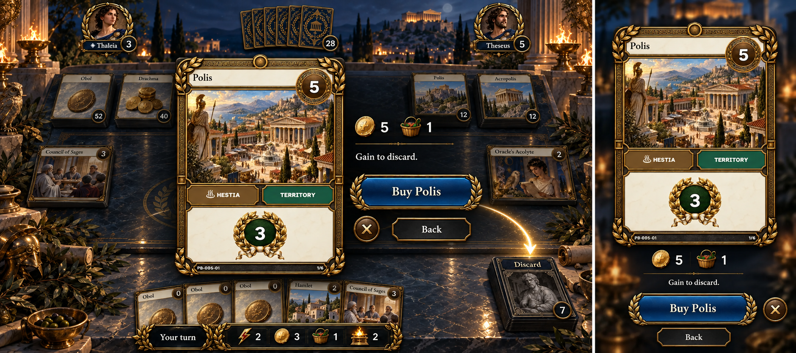

**Play:** Open a full-sized card from hand, supply, event, leader or public pile. Read the full effect, then take the context's one legal action or return.

**Signifiers and affordances:** The actual card is the focal object. A small decision rail names payment and destination. Buy Polis differs clearly from free Gain Polis. Landscape events and leaders retain their shape, never reformatted into deck cards.

**Motion and transition:** The card lifts above a dimmed table, with source/destination still recognizable. Back/Escape restores focus and view. No purchase occurs merely by inspecting. Selecting a hidden opponent deck shows only its count.

**E2E stories:** 007, 014.

### 08 · Worship the gods

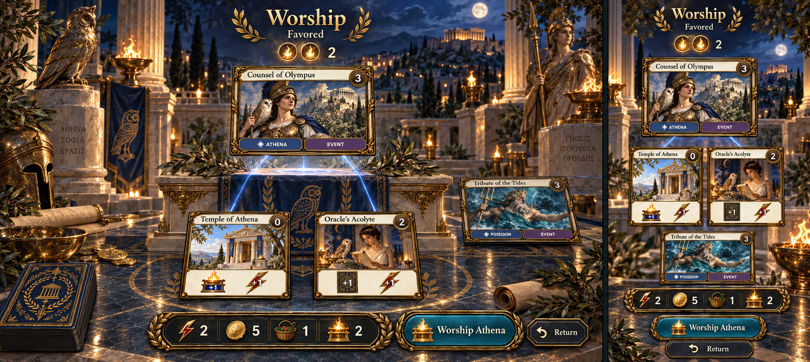

**Play:** Choose any shared god, review Standard or Favored, and Worship. Pay one Worship and the event's Coins, never a Buy.

**Signifiers and affordances:** Actual landscape event, named active effect, two lit Devotion pips and threads from matching Actions in play. Leaders contribute no pip. Short copy: Favored, Worship Athena, Finish this effect first, Need 1 more Coin.

**Motion and transition:** The altar brightens; payment settles before choices or gains. Event stays on the table. Return to the same phase; another Worship remains possible if affordable. Light and threads supplement explicit numbers and labels.

**E2E stories:** 008, 010.

### 09 · Choose what to let go

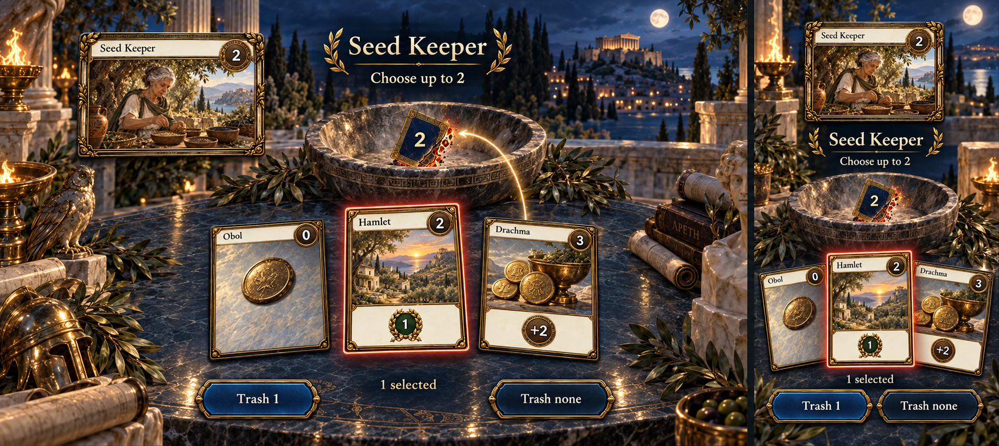

**Play:** Select hand cards and confirm Trash N, or Trash none for an optional effect. The mandatory discard variant uses the same composition with the distinct Discard icon and Discard N button.

**Signifiers and affordances:** Selected cards rise with a checkmark and count; trash has a restrained red edge, discard uses its own destination. Copy: Choose up to 2; 1 selected. Mandatory discard says Choose 1, with no skip while a target exists.

**Motion and transition:** Confirmed cards reveal publicly and travel to the named destination. Follow printed order, including draw before Harvest Feast's discard. Doreios's opportunity is consumed even when skipped. An already committed effect cannot be canceled by closing its choice tray.

**E2E stories:** 005, 009.

### 10 · Claim a new card

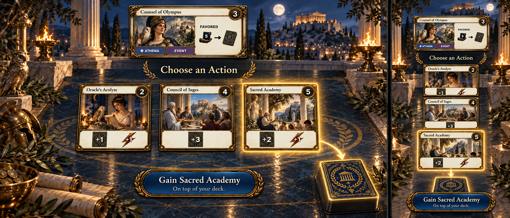

**Play:** Select an eligible nonempty pile, inspect if needed and confirm Gain. Optional Demeter gain offers Gain nothing. No Coins or Buys are charged by the choice itself.

**Signifiers and affordances:** Gain value sits inside the approved gain icon; Topdeck appears only for that destination. The source card and type restriction remain visible. No redundant coin cost or inequality symbol. No eligible choice says No cards available and continues the remaining effect.

**Motion and transition:** Reveal the gained face publicly, reduce stock, then move to discard or deck. Topdeck closes under the common back, ready for the next draw; it is not automatically drawn or played.

**E2E stories:** 010.

### 11 · Watch a reveal resolve

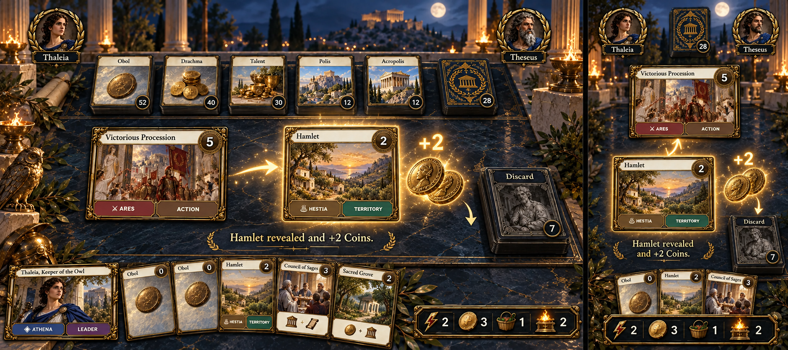

**Play:** Watch the revealed card and its result; inspect the Chronicle afterward. There is no invented choice or confirmation for Victorious Procession's automatic branch.

**Signifiers and affordances:** One readable face emerges from the deck. Hamlet revealed, the extra Coin amount and Discard destination make the branch explicit. Non-Territory uses Topdeck; no available card says No card to reveal.

**Motion and transition:** Back → public face → correct zone. Initial rewards resolve first. The revealed card stays outside all shuffle zones until settled. Reduced motion retains the result in the Chronicle.

**E2E stories:** 011.

### 12 · Follow the other player

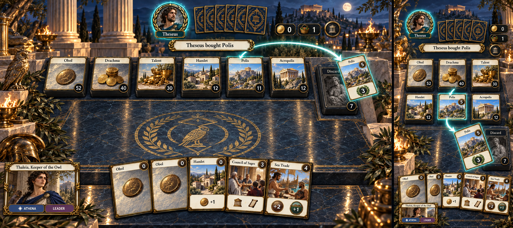

**Play:** Watch public moves; inspect public zones and your own hand while waiting. Do not queue a move out of turn.

**Signifiers and affordances:** Active portrait ring, Theseus's turn, and an actor/card/destination ribbon. Their private cards remain common backs. Your hand is visible but has no legal-play highlight. Counters clearly belong to the named active player.

**Motion and transition:** A gain or purchase visibly follows its public source and destination. Private draws animate as backs. New activity never tears open a tray over the viewer's current inspection.

**E2E stories:** 013.

### 13 · Inspect the public table

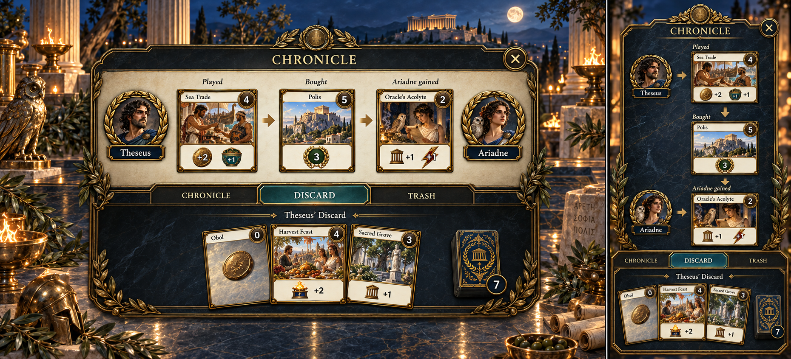

**Play:** Switch Chronicle, Discard and Trash; choose a public owner; inspect faces or earlier moves. Count a deck without seeing its order.

**Signifiers and affordances:** Named source and destination, card miniature and resource delta; no clocks or technical identifiers. Public pile counts and the owner are explicit. Empty pile: No cards here. New activity produces a New moves seal while reading history.

**Motion and transition:** Tray slides over the table and closes to the same position. Incoming moves update the table behind it. Piles remain read-only: no reorder handles or drag target in an inspection view.

**E2E stories:** 013, 014.

### 14 · Your empire endures

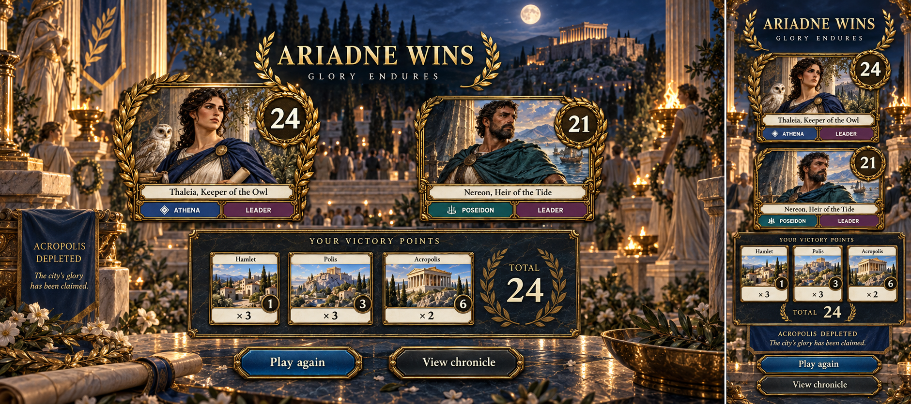

**Play:** Read the final score breakdown, review the Chronicle or Play again, which creates a new table while retaining the finished one.

**Signifiers and affordances:** Winner portrait and laurel, every player's VP and turns, Territory arithmetic and concise end reason. Tie copy: Fewer turns wins or Shared victory. No invented rewards or progression currencies.

**Motion and transition:** Finish the current turn and cleanup before revealing results. A quiet light change and laurel fade replace the turn rail; no extra final round. Completed table remains inspectable.

**E2E stories:** 015.

### 15 · Return to play

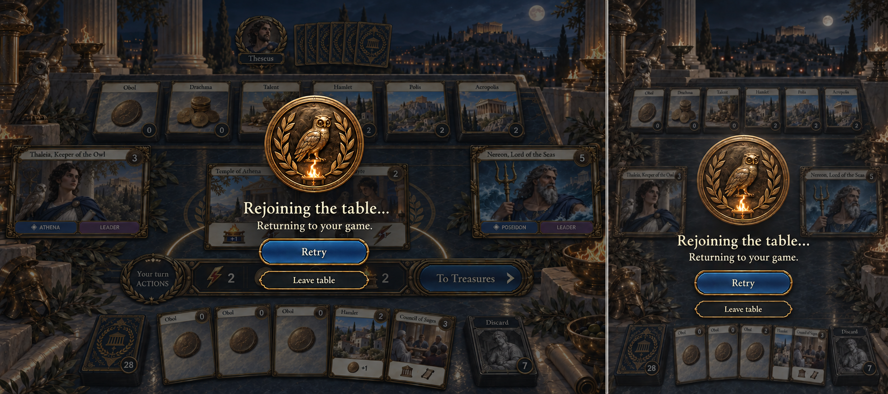

**Play:** Retry a lost connection or leave the view. For an unavailable table, choose another table; do not silently replace a seat.

**Signifiers and affordances:** The current table stays recognizable beneath a quiet seal. Copy: Rejoining the table…; Retry; This table is full; That invitation is no longer available. A rejected move says The table changed. Choose again.

**Motion and transition:** Restore the current turn or pending choice after recovery. An acknowledged move never repeats because its response was lost. Catch up directly, without replaying a backlog of card flights. Game commands stay unavailable while their outcome is uncertain.

**E2E stories:** 016.

### 16 · Play together at one table

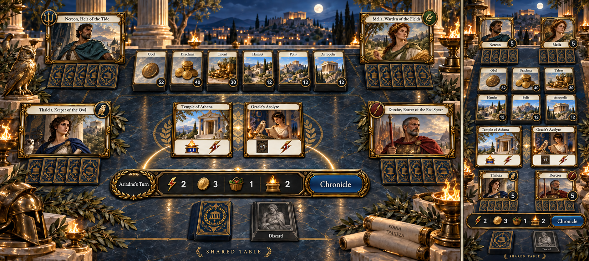

**Play:** Show the public table on the shared screen; inspect supply, gods and Chronicle. Each player controls their own private hand using the normal table composition on a personal screen.

**Signifiers and affordances:** All hands on the shared display are backs. Shared table is a persistent label; no Show hand toggle exists. Personal view is anchored by its seat name, not a second player identity.

**Motion and transition:** A personal action becomes a public card movement where the rules reveal it. Private draw faces never appear on the shared display. Viewing and player invitations are distinct; removing public access does not remove a player's seat.

**E2E stories:** 017.

### 17 · Learn at the table

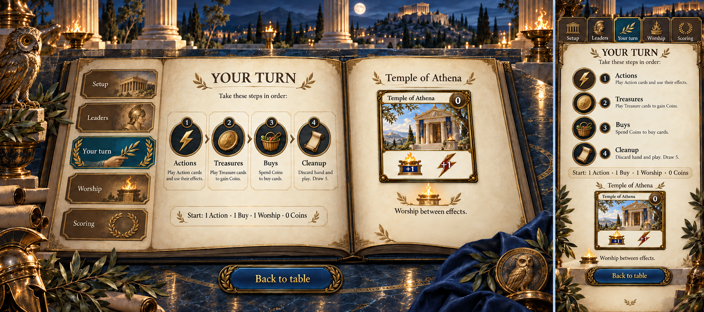

**Play:** Open an illustrated chapter, inspect an example card and return to the current table. The game continues while a player reads.

**Signifiers and affordances:** An in-world codex with short chapter tabs, real cards and concise rules. A chapter underline and text indicate selection. The codex can use ordinary readable text and scrolling where that serves reading better than a decorative imitation.

**Motion and transition:** Codex opens above a dimmed table; Back to table restores context or announces whose turn it now is. Never reset an active choice when opening help.

**E2E stories:** 018.

### 18 · Explore the collection

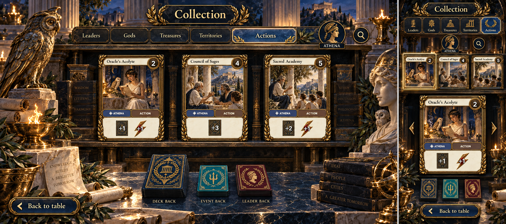

**Play:** Browse leaders, gods, treasures, territories, actions and all cards; search/filter; inspect full text, physical copies and front/back. Printing remains available from collection options.

**Signifiers and affordances:** Sculpted shelf presentation, actual faces and three distinct backs. Collection counts are inventory, not remaining supply. No Buy action appears here.

**Motion and transition:** Selected card lifts into the shared inspector. Return restores shelf position, then the game. On mobile favor readable selection and expanded detail over an entire tiny shelf grid.

**E2E stories:** 018.

### 19 · Open the table menu

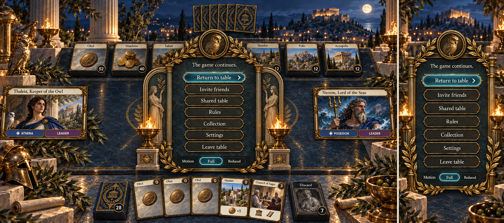

**Play:** Return, invite, open a shared view, read rules, browse cards, adjust motion or leave the view. There is no surrender, restart, kick or seat-transfer command in v0.1.

**Signifiers and affordances:** A small game-native menu with one clear Return to table action. The game continues avoids suggesting a multiplayer pause. Full/Reduced motion is local presentation, not a game rule.

**Motion and transition:** A short focus fade quiets the table. Returning restores selection; leaving never resets the game. Focus trapping, Escape and visible keyboard selection match the inspector.

**E2E stories:** 016, 017, 018.

### 20 · Choose a discard

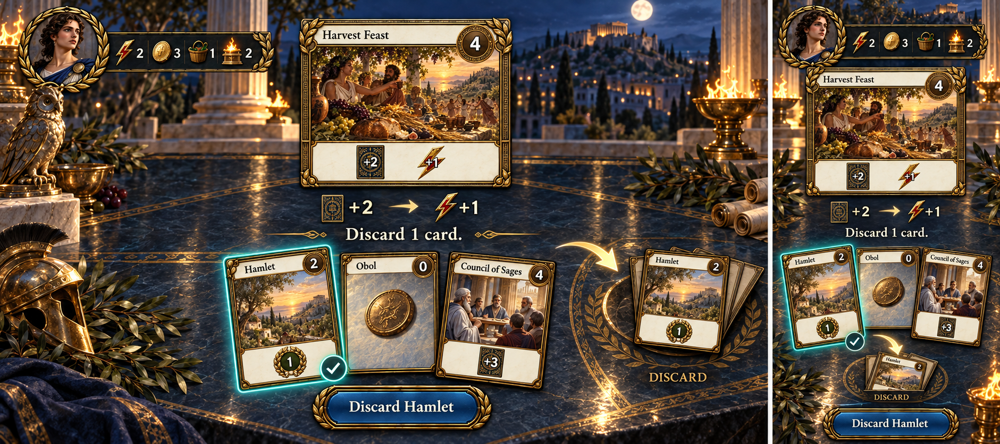

**Play:** After Harvest Feast draws two and grants an Action, choose a card from the resulting hand and confirm Discard. Newly drawn cards are valid; no skip while a target exists.

**Signifiers and affordances:** The face-up discard fan and destination distinguish this from the broken-card Trash icon. The selected card lifts with a checkmark. “Discard 1 card” states a requirement; “Discard Hamlet” names the commitment.

**Motion and transition:** Hand → own discard, then any leader trigger and the original phase. An empty hand settles with “No cards to discard.” **E2E:** 009.

### 21 · Finish the turn

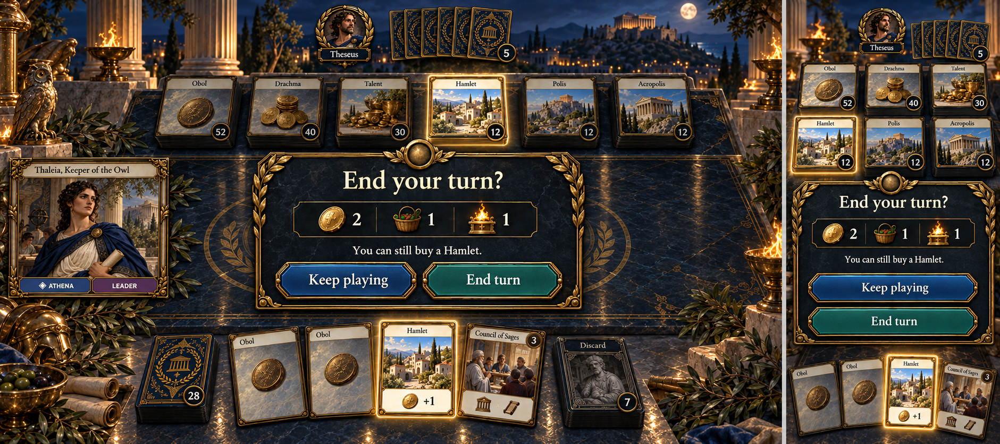

**Play:** Review a useful remaining option, then Keep playing or End turn. The confirmation appears when advancing would give up a meaningful legal action.

**Signifiers and affordances:** Keep the actual hand and counters visible beneath a quiet decision seal. “You can still buy a Hamlet” is more useful than a generic warning. The two buttons have separate touch targets.

**Motion and transition:** Declining leaves state untouched. Confirming discards hand/play, clears counters, draws five, then checks ending. No Worship can interrupt cleanup. **E2E:** 012.

### 22 · Find another table

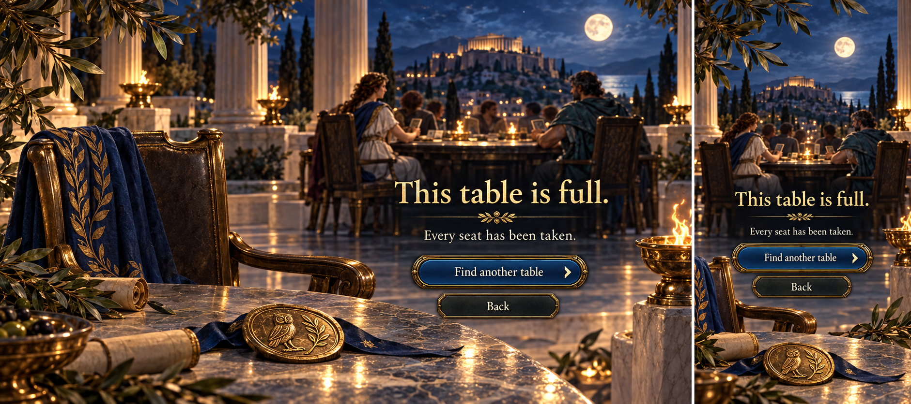

**Play:** Choose another table or return. Missing invitations and unavailable seats use this same composition with a specific reason and appropriate recovery.

**Signifiers and affordances:** “This table is full” and “Every seat has been taken” explain the gameplay situation. No diagnostics, blame or promise that someone else's seat can be reclaimed.

**Motion and transition:** A quiet sanctuary view provides a way onward; returning players with a valid existing seat bypass this rejection and return to their game. **E2E:** 002, 016.

## Variants that share these compositions

There are no separate pages for each resource value or card effect. These state families are part of the screen contract and need real implementation screenshots when built.

| Family | Required variants |
| --- | --- |
| Gathering / draft | New table, invited seat, occupied/full/invalid invitation, host waiting, guest waiting, 2/3/4 seats, active drafter, waiting drafter, already-chosen leader. Random first player once; unique leaders drafted in reverse turn order. Chosen gods are shared with everyone. |
| Turn rail | Start at 1 Action / 1 Buy / 1 Worship / 0 Coins; no playable Action; extra Actions; no Treasure; intentionally retained Treasure; multiple Buys; cost-0 purchase; empty pile; unaffordable action. View changes never change phase. No returning to an earlier phase. |
| Phase/end confirmation | Use a small decision seal over the unchanged table: “Leave these Actions unplayed?” / “Leave these Treasures unplayed?” / “End your turn?” with named remaining options. “Keep playing” returns unchanged. No automatic end at zero Buys: Worship may remain useful. |
| Leaders | First matching Action resolves, then the leader: Thaleia +Action, Nereon +Coin, Melia +Card, Doreios optional trash. A no-effect Action still triggers. Once per turn, including a skipped Doreios opportunity. Temple adds Worship then Action, then leader; leaders add no Devotion. |
| Worship | Standard at 0/1 Devotion; Favored instead at 2+. Devotion counts matching Actions currently in play, including Temple. Repeat same god if affordable; any selected god regardless of bloodline. Spend Worship + Coins, no Buy; preserve phase; no interruption of effects or cleanup; no refund for an effect without eligible targets. |
| Trash/discard | Optional zero/one/two trash, exact mandatory discard or as many as possible, targets only in hand, newly drawn cards eligible for Harvest Feast. Destination and source are always named. Required choices can be minimized for inspection, but a “Finish [card]” seal remains and no next command bypasses them. |
| Gain | Grove: any type up to 4, discard. Forge: actual trash → cost +2, discard. Trial: actual trash → +1/+3, discard; zero trash gives no gain. Athena: Action up to 3/5, topdeck. Poseidon: Drachma discard/topdeck, Favored +Buy even if its pile is empty. Demeter Favored: optional trash, optional gain at summed costs, +Buy regardless; zero trash permits a cost-0 Obol. No Temple/leader/event is gainable. |
| Draw / reveal | Shuffle discard only when a draw/reveal needs an empty deck. Stop if deck and discard are empty. Never shuffle hand, play, trash or an unresolved revealed card. Procession keeps its initial rewards: Territory → discard and extra Coins; otherwise topdeck; no card → no reveal bonus. |
| Cleanup / ending | Discard hand and play, clear resources, draw five, then check Acropolis empty or three supply piles empty. Finish the whole turn, no final round. Score all owned Territories including starting Hamlets, exclude trash. Tie → fewer turns → shared victory. |
| Public inspection | Empty and large discard/trash/play areas; public ownership and counts; private deck count only; new activity while reading earlier moves. No public access to hidden card faces through alternate views. |
| Recovery | Joining, pending command, temporary interruption, lost acknowledgement, stale move, expired invitation, full table, unavailable table, lost seat access. Return to confirmed state or a specific recovery choice; do not silently make a new game. |
| Reference | All rules chapters; all thirty catalog definitions; filters and no matches; full card text; copy N/M; deck/event/leader backs; printable tabletop cards. Reference contains no purchase control. |

The generic rule for ordering multiple cards placed on top together has no reachable effect in this v0.1 set. Do not add an artificial gameplay screen or new card just to demonstrate it. When such an effect exists, use numbered “Draw first” slots in the choice tray with Move earlier/later controls.

## Player language

Speak about the game and the next useful action. Keep labels concrete: **Play Temple**, **Buy Polis**, **Worship Athena**, **Trash none**, **Gain Sacred Academy**, **End turn**. A status names its actor: **Theseus bought Polis**. A constraint names its remedy: **Need 2 more Coins**. A result names its destination: **On top of your deck**.

UI copy must never explain where a seat or data lives, how authentication works, or how to refresh a page. It must not mention browsers, reloading, Firestore, sync, events, revisions, clients, sessions or persistence. Technical diagnostics belong outside the player experience. The words “Action”, “event card” and “leader” retain their game meanings.

Keep error copy honest. “Rejoining the table…” means an attempt is underway, not a promise that a move succeeded. “The table changed. Choose again.” restores a legal decision. “That seat is unavailable” offers another table without implying that someone else's seat can be taken. Multiplayer menus say “The game continues”; opening them never claims to pause opponents.

Card iconography remains the approved system: Trash N is up to N; Gain N embeds a cost limit; default gain goes to discard; Topdeck appears only when needed; cost/condition → result uses an arrow. Do not restore redundant inequality signs or resource words on card faces. Short explanatory text can accompany a decision without being baked into the art.

## Choreography

Motion should explain who acted, what moved and what changed. A persistent Chronicle entry carries the same information after the flourish ends. Camera movement is a transition between views, never compulsory motion during a decision.

| Moment | Normal motion | Reduced motion / lasting evidence |
| --- | --- | --- |
| Enter sanctuary / table | 450 ms shallow camera approach, atmosphere restrained | Immediate composition, same focus. |
| Seat joins / draft claim | 220 ms medallion light; 350 ms leader-to-seat movement | Seat name, ownership and god appear immediately. |
| Play card | 320 ms lift and hand → play; 180 ms resource delta | Face in play, exact counters, actor/card result in Chronicle. |
| Leader ability | 240 ms portrait rim pulse **after** printed effect | Bloodline used indicator and explicit reward. |
| Worship | 240 ms altar light and devotion threads, then ordinary effect resolution | Active Standard/Favored label, payment and result. |
| Purchase / gain / discard / trash | 350 ms source → destination; at most 60 ms stagger | Counts and destination settle; approved operation icon and public named face. |
| Shuffle / draw | 280 ms discard backs → deck, then 260 ms backs → hand | Counts settle; only owner sees new faces. Never expose order through an animation. |
| Reveal | 180 ms face reveal, 500 ms readable hold, 300 ms destination | Public face and exact branch remain in Chronicle. |
| Inspect / tray / menu | 160 ms lift/fade; background quiets | Same focus trap and selection without movement. |
| Turn changes | 220 ms active-seat ring and phase seal change | Named player and phase remain visible. |
| Victory | 300 ms laurel fade and sanctuary light change | All scores immediately readable. |

Resolve printed instructions, then leader, then accept the next command. Automatic steps do not require repetitive acknowledgements. Pending commands have restrained pressed-state feedback, not optimistic card movement. Repeated input cannot spend twice. A failed command returns the card and exposes the legal choice without pretending it succeeded.

A card outside the current view moves from its named zone anchor; never invent a visible card identity for an unknown hand. Catch-up restores the latest table without replaying every old animation. New activity raises a small seal instead of forcing navigation. Reduced motion removes translation, flips and particles completely; it preserves source/destination labels and final state.

## Readability and control contract

- Full-screen composition at every supported size. No accidental document scrolling, clipped committing control or offscreen resource rail. Intentional hand/pile/Chronicle/codex movement stays within named bounded regions, with visible continuation.
- Touch targets at least 44 × 44 CSS pixels; artwork may overlap decoratively, interactive hit regions may not. Hand-fan selection must work without pixel-precise tapping. The primary action stays reachable above safe-area insets.
- Selection, legality, active player and Favored status use text/symbols as well as light and color. Focusing a card provides full readable rules. Do not ask players to read tiny text on a tilted miniature.
- Keyboard and touch offer equivalent actions. Visible keyboard focus, Enter/Space selection, Escape to close inspection, and previous/next alternatives to swiping. No hover-only facts or drag-only choices.
- Inspection and choice focus is contained and restored. Closing a required choice for reference does not skip it. Public activity is announced politely; a private draw never announces faces to other seats.
- Preserve card layers, frames, cost wells, windows, icons and physical copy identifiers. Live pile stock is a separate bead. The generated art's compressed thumbnails are not authorization to redesign the approved card faces.

## E2E stories: the real game must embody this design

The concept paintings are review artifacts, **not** screenshot baselines or evidence of implemented gameplay. The current app still stops at shared setup. Future stories follow the numbered illustrated-story and shared-step-helper approach in Jaipur/Roborally and [Pantheon's existing tests](tests/e2e/README.md).

### Exact visual acceptance

Use [TestStepHelper](tests/e2e/helpers/test-step-helper.ts) for every documented player outcome. Extend it for named scroll regions and expected connection states rather than bypassing its assertions. The existing setup helper requires a non-scrolling, synced screen; gameplay needs the same discipline plus explicit bounded trays, hand paging and interruption states.

**`maxDiffPixels: 0`, `threshold: 0`, retries 0.** No masks, tolerance exceptions, screenshot normalization, per-test overrides or baseline updates during verification. Test the actual finished UI, not a scaled concept painting.

Run phone **393×852**, desktop **1440×1000** and tabletop **3840×2160**, DPR 1, pinned browser/fonts, fixed locale/timezone. Keep platform-specific reviewed macOS/Linux baselines. Deterministic emulator fixtures fix names, seating, first player, deck order, supply and command outcomes without exposing test details to players. The fixture interface must not be enabled in hosted play.

Each helper step checks named behavioral outcomes, acknowledged state, loaded fonts, decoded images and settled finite animations before capture. No sleeps and no randomly visible IDs or timestamps. Assert exact counters, phase, owner, source/destination counts, eligible choices and replayed state; matching pixels alone is not sufficient. Use real anonymous auth and Firestore emulators, with distinct authenticated contexts for players and a separate public viewer.

Geometry checks have zero overflow and zero overlapping active hit regions. The fan's painted silhouettes can overlap; its actual selection targets cannot. Audit bounded scroll/paging regions at their beginning/end and with focus on every item. Do not exempt a whole subtree to conceal clipping. Keep the existing card-content overflow audit and deliberate overflow-detection test. Check full-size inspectors at all supported sizes.

Stable screenshots use reduced motion. Separate normal-motion scenarios observe source → destination, ordered effect/leader rewards, private draw backs and one animation per committed move. Freeze a controlled animation clock for a reveal-flight snapshot; do not race a timeout. Normal and reduced-motion runs must settle to the same game state with no residual transform.

Every story directory contains its spec, generated illustrated README and platform/project screenshots. Generate baselines explicitly, inspect them, commit them and rerun comparison mode. Link the concept screen family and named verification to each step. Also assert that player-facing text and accessible labels do not contain implementation terminology.

### User-story inventory

Each arrow below is a photographed helper step on all three viewports, with additional scenarios for the listed branches. IDs extend the existing 001 setup story; retain current gallery/rules coverage.

| Story | Player journey / screen families | Required verifications |
| --- | --- | --- |
| **002 · Gather friends** | Sanctuary → gathering → joined seats → return to table (01–02) | 2/3/4 seats, name validation, invite/copy fallback, host/guest start, one winner for final seat, returning identity has same seat. Supply scales 6/9/12 Territories and 8/12/16 Actions; starting cards are separate. |
| **003 · Choose a bloodline** | Waiting → selected leader → claimed leader (03) | Random first player persisted once; reverse draft order; unique claims, taken-owner display, stale/duplicate/out-of-turn rejection; each god event shared with everyone; unused gods absent. |
| **004 · Receive my hand** | Final leader → deal → private table (03–04) | Exactly 6 Obols, 3 Hamlets, matching Temple; draw five, deck five, no discard; first seat starts 1/1/1/0. Return never redeals. Opponents/viewers cannot read faces/order in DOM, accessibility tree or network data. |
| **005 · Play Actions and bloodline** | Select → play → effect → leader → next choice (04,09) | All four Temples and leaders, spent Action then printed instructions then leader, once/reset, no-effect trigger, Doreios skip consumes opportunity, no leader Devotion. Zero Actions/wrong type/wrong player/interrupt rejected. Large hand remains readable and selectable. |
| **006 · Spend my wealth deliberately** | Treasure → individual play → Worship between plays → batch play → Buys (05,08) | No Action cost, exact Coins, retained Treasure target, phase confirmation/no backward phase. Bulk play explicit, double input idempotent, no invented batch interruption. |
| **007 · Buy an empire** | Supply → Action piles → inspect → buy → empty/disabled pile (06–07) | All 18 piles reachable; inspect does not buy; exact cost +1 Buy, including cost-0 Obol; discard destination; multiple buys; no overspend/empty buy; no Temple/event/leader purchase. Live stock separate from physical N/M. |
| **008 · Worship a shared god** | Standard → Favored → payment → effect → repeat (08,10) | 0/1/2+ Devotion from matching in-play Actions only; any selected god; Worship + Coins and unchanged Buys; repeat same god; original phase; no refund/no-target, no mid-effect/leader/cleanup Worship. |
| **009 · Let cards go** | Trash none → choose trash → mandatory discard → settled hand (09) | Seed Keeper 0/1/2, Doreios 0/1, hand-only targets, territory allowed, Harvest draws before discard and drawn targets allowed; empty hand does as much as possible. Selection counts and confirm legality; trash removes ownership/VP, discard does not. |
| **010 · Gain correctly** | Eligible choices → inspect → gain → destination / no choice (10) | Parameterize every Grove/Forge/Trial/Athena/Poseidon/Demeter branch from the variants table. Include cheaper cards, depleted piles, zero trash, optional skip, restricted type, favored bonus despite empty Drachma, sum cost and cost-0 gain. No resource charge by gain choice; no auto-play of gained card. |
| **011 · Draw and reveal** | Empty deck → shuffle/draw → Territory reveal → other reveal → no reveal (11) | Exact partial draws; correct shuffle zones; Procession initial rewards always, extra reward only Territory, correct discard/topdeck and public face; no leaked private order. Defer multiple-topdeck ordering until reachable. |
| **012 · Finish my turn** | Remaining options → keep playing → confirm end → cleanup → next player (04–06) | Worship remains possible with zero Buys; no premature end. Hand/play discard, resources zero, draw five, ending check then turn/leader reset once; no cleanup commands or double draw after interruption. |
| **013 · Understand the other player** | Public play → leader → Worship/gain → purchase → Chronicle (12–13) | Two clients see ordered actors/destinations/deltas, private draws as backs, no forced navigation, one motion per commit, persistent messages, reader position and New moves, no historical animation burst after recovery. |
| **014 · Inspect safely** | Own hand → public discard → trash → deck count → return (07,13) | Full public contents, count-only hidden decks, empty/large piles, no mutation/reorder, focus trap/restore, Escape, paginated target access; other player can continue while inspection is open. |
| **015 · See the winner** | Last required pile → finish turn → score → return to results (14) | Both ending conditions after cleanup, no final round, all owned Territories/starting Hamlets, trash excluded; points winner, fewer-turn tie, shared tie for 2/3/4 players. New table leaves final history intact. |
| **016 · Return without losing a move** | Pending move → interruption → retry → current choice; unavailable reasons (15,19) | Lost response before/after commit, interrupted choice, stale/illegal command, missing/full/started invitation, lost seat access. No double spend or duplicate effect; restore canonical state. Copy names the gameplay consequence and recovery, never implementation details. |
| **017 · Share a table privately** | Open shared view → public table → private controller → public move → end viewing access (16,19) | Separate player/viewer contexts, 4K/portrait fit, no private payload to viewer, viewer denied moves/private reads, common backs, no seat transferred by invitation, revocation enforced. Private controller is normal 04, not another seat. |
| **018 · Learn and return** | Codex chapter → card example → collection → inspect/flip → return (17–19) | All rules including leaders, all 30 definitions, all three backs, copy selection/search/filter/print, readable scrolling and focus, unchanged live card assets, no buying in collection; return to current legal game state. |

Keep one complete multi-player game exercised through real commands in addition to focused fixtures. Cover all twelve Action effects and four Temples across 005/009/010/011; generic choice-dialog tests alone are insufficient.

### Engineering boundaries behind the experience

These are implementation requirements, never UI copy. The existing public setup event stream cannot carry hidden hands or deck order. Gameplay requires authoritative legal-command validation and separately authorized private projections. Public events contain only public information; no hidden seeds or private draws. A shared display requires a revocable read-only capability with no private access and no move authority. An invitation does not transfer player identity.

Commands carry stable identities so retry cannot duplicate a move. State changes are independent of animation completion. Reconnect reconstructs confirmed public/private views and resumes a pending choice. Authorization, concurrent seat/leader/last-card claims and replay equivalence need emulator/backend assertions in addition to screenshots.

Build in reviewable milestones: draft/private deal; Actions/Treasures/Buys; all effects and Worship; endings/recovery/motion; shared table and reference integration. Review real mobile, desktop and 4K screenshots at each milestone. The visual target is this game-world composition, not a return to generic web panels.
