# Pantheon: Bloodlines — gameplay UX design

**Status: proposed for review.** This describes the complete v0.1 web and tabletop experience. The current application implements the catalog, rules, anonymous sign-in and shared setup room; drafting, private decks, turns, scoring and public display sessions below are future work. This PR changes documentation and design artifacts only.

The [v0.1 rules](MVP_CARDSET.md) define game behavior. This document defines how players see it, act on it and understand other players’ moves. It does not change those rules. The [vision](VISION.md) remains the high-level direction.

## Review the mockups

There are **28 screen/state designs, each at mobile 393 × 852 and desktop 1440 × 1000**, embedded below. These are independent, legal illustrative states, not consecutive turns of one recorded game. Buttons in the images are design affordances, not a working game. The numbered top-level inventory is exhaustive for this proposed release; alternate copy, loading and conditional branches use the stated screen shell. Screen 16 is a deliberately dormant generic rules state, not a new v0.1 card effect.

The images use actual catalog faces captured from `CardFace.svelte`, including its approved art, transparent frames, colored god/type windows, symbols and copy metadata. No replacement artwork was generated. [Asset provenance](docs/ASSETS.md), [design sources and regeneration](docs/ux/README.md), [machine-readable screen manifest](docs/ux/manifest.json).

Small faces are recognition/selection targets, not the only way to read rules. Every face opens a large inspector with the complete written effect. The screenshots show the initial position of each bounded content pane; visible continuation at the bottom indicates more content. The shipped implementation must also test the scrolled positions and selected detail states.

## Experience and navigation

A player opens an invitation or creates a table, chooses a unique bloodline, builds a deck and watches the other empires grow. The interface should always answer: **whose turn, which phase, what can I do, what will it cost, and where will the card go?**

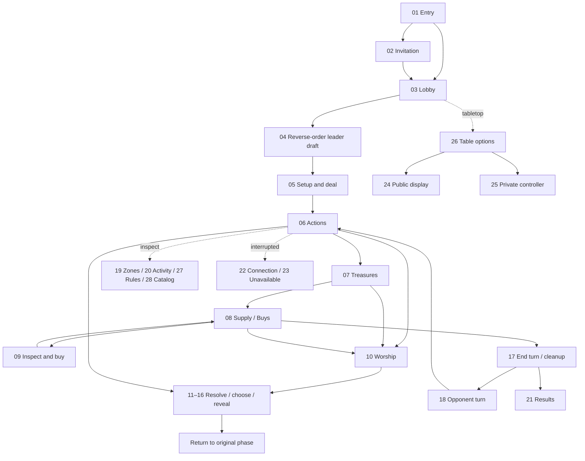
```mermaid
flowchart TD
  Entry[01 Entry] --> Invite[02 Invitation]
  Entry --> Lobby[03 Lobby]
  Invite --> Lobby
  Lobby --> Draft[04 Reverse-order leader draft]
  Draft --> Deal[05 Setup and deal]
  Deal --> Action[06 Actions]
  Action --> Treasure[07 Treasures]
  Treasure --> Buy[08 Supply / Buys]
  Buy --> Inspect[09 Inspect and buy]
  Inspect --> Buy
  Action --> Worship[10 Worship]
  Treasure --> Worship
  Buy --> Worship
  Worship --> Resolve[11–16 Resolve / choose / reveal]
  Action --> Resolve
  Resolve --> Return[Return to original phase]
  Buy --> Cleanup[17 End turn / cleanup]
  Cleanup --> Opponent[18 Opponent turn]
  Opponent --> Action
  Cleanup --> Results[21 Results]
  Action -. inspect .-> Reference[19 Zones / 20 Activity / 27 Rules / 28 Catalog]
  Action -. interrupted .-> Recovery[22 Connection / 23 Unavailable]
  Lobby -. tabletop .-> Options[26 Table options]
  Options --> Display[24 Public display]
  Options --> Controller[25 Private controller]
```

“Hand / Supply / Gods / More” changes the view, **not** the phase. “Go to Treasures” and “Go to Buys” are explicit irreversible phase commands. More opens the options panel, public zones, activity, rules and catalog. Before play the navigation is Table / Rules / Cards. Selected view uses the existing gold underline style, `aria-current` and a visible label. The existing `StickyNav` stays shared between catalog and rules.

Desktop uses two-column panels for hand/leader, event comparison and details, with a persistent navigation/status frame. Mobile uses the same information order in one column, paginated hand/choice cards and a persistent bottom navigation with safe-area padding. Lists and long content scroll **inside** a named pane; the game shell never scrolls horizontally or vertically. Do not shrink all cards to fit an arbitrarily large hand. Preserve selection while paging; show “Cards 1–3 of N” and explicit Previous/Next buttons. Supply uses all six basics and twelve Actions, with a Basics/Actions switch and optional god filter. Filtering never removes piles from the game.

Rules and the full catalog remain scrolling documents outside the game shell, with their existing sticky section navigation. Reference opened from a game retains a return destination and does not pause anyone’s turn. On return, refresh legality from current state; never resurrect an expired choice.

### Input, hierarchy and accessibility

- A tap/click selects or inspects; an explicitly labeled button commits Play, Buy, Worship, Trash, Discard or Gain. No double-click shortcut, hover-only command, mandatory drag, or single-tap destructive trash.
- Hit targets are at least 44 × 44 CSS pixels with no overlapping active controls. Focus rings are visible. Tab/Shift-Tab, Enter/Space and Escape support the same flow as touch; numbered reorder buttons replace drag when needed.
- A selected card has a gold border, checkmark and selected count. Legality has text as well as color. Disabled controls explain the missing resource, wrong phase, pending effect or empty pile; they are not merely dimmed.
- Use the approved resource/operation art and numeric overlays. In cards, Trash N means up to N, Gain N embeds the cost limit, default gain means discard, and Topdeck is shown only for that destination. Do not add `≤`, redundant Coin icons or extra rules text to approved faces. Outside cards, short confirmation sentences make decisions clear.
- Deck, event and leader formats remain 5:7, 7:5 and 8:5 respectively. Leaders are physically larger than events in tabletop/print. One common deck back hides all types, gods and serials; event and leader backs are distinct. UI counters do not alter the approved face typography.
- Face `N/M` is physical inventory metadata, including starting decks. Live “6 left” stock is a separate pile badge; do not rewrite the printed denominator as cards are bought.
- Dialogs trap focus, name their source, scroll their own body and restore focus to their origin. Escape closes inspection; it does not cancel an already committed effect. A required choice can be minimized to reference the table, but cannot be bypassed; a persistent “Finish [effect]” affordance reopens it.
- Public activity is a polite live region with actor and result. Own draws are announced privately to the owner; shared announcements say only “drew 2 cards”. Motion, glow and god colors never carry information alone. Device reduced-motion preference is the default, with a local override in Options.
- Player-facing messages use table, seat, hand and reconnect language. They do not expose event sequence IDs, auth UIDs, seeds, Firestore errors or replay diagnostics.

## Screen catalog

Each pair opens at full resolution. The actions and transitions below are the behavior contract for that screen, including its mobile sheet and desktop panel equivalents.

### 01-entry · Take a seat

| Desktop | Mobile |
| --- | --- |
| [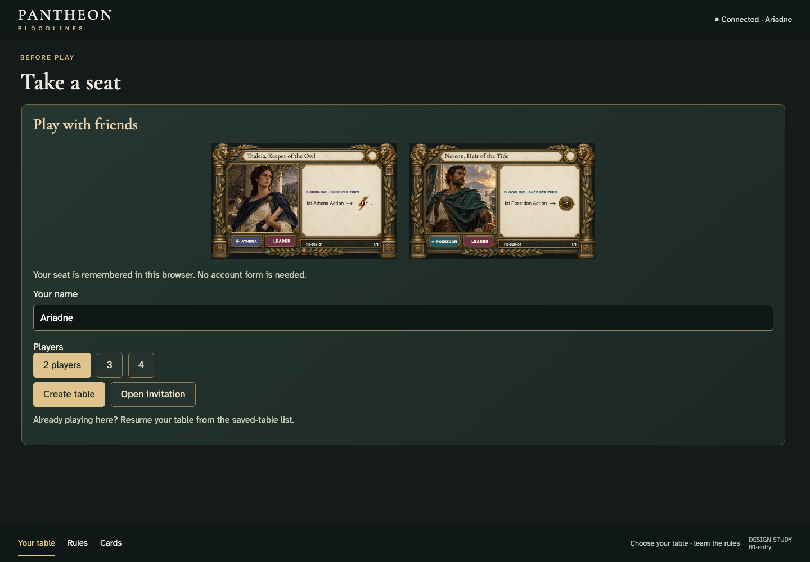](docs/ux/mockups/01-entry-desktop.png) | [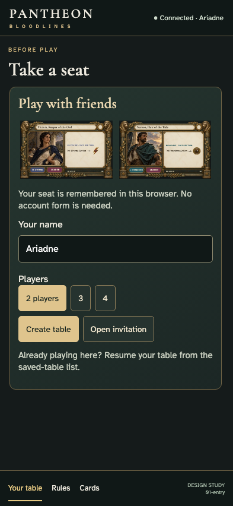](docs/ux/mockups/01-entry-mobile.png) |

**User actions:** Enter a name, select 2–4 seats and create; follow an invitation to join; resume an existing seat. Anonymous sign-in happens before mutation.

**Signifiers and affordances:** Selected player count has a gold outline and text. Create is disabled while signing in; inline validation names the field.

**Animation and transition:** Create → 03; invitation → 02; resume → latest legal state. Sign-in failure → 23.

**E2E story:** 002.

### 02-invitation · Join Ariadne’s table

| Desktop | Mobile |
| --- | --- |
| [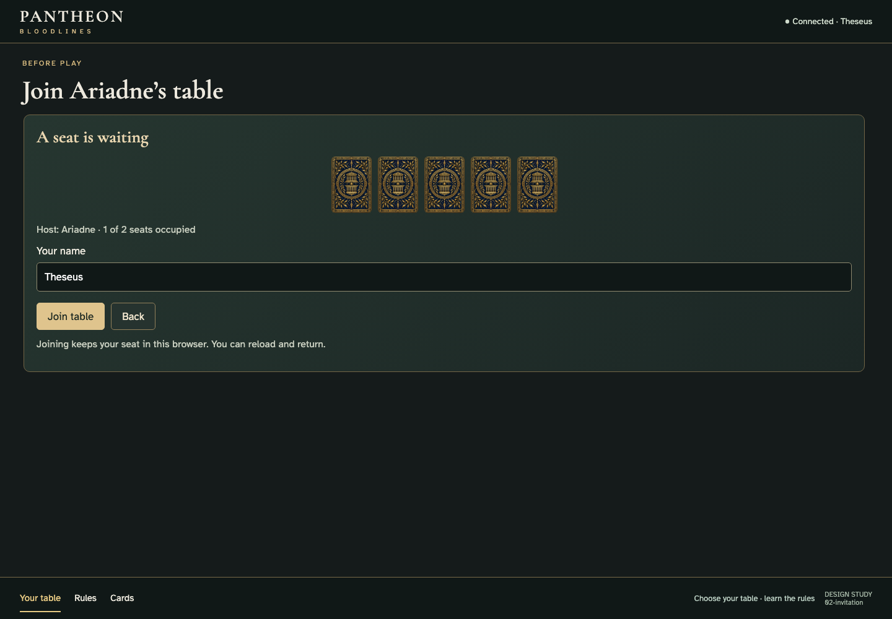](docs/ux/mockups/02-invitation-desktop.png) | [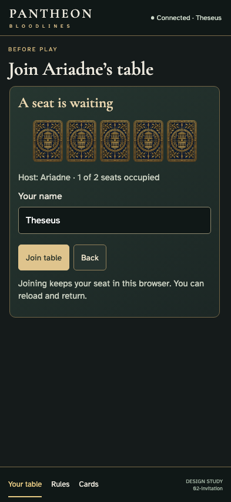](docs/ux/mockups/02-invitation-mobile.png) |

**User actions:** Review host and capacity, enter your name, then Join table once. An existing member resumes instead of taking a second seat.

**Signifiers and affordances:** Capacity is explicit; joining shows one pending state and disables resubmission.

**Animation and transition:** Acknowledged join → 03. Full, missing or started table → 23. The last-seat race has one winner.

**E2E story:** 002.

### 03-lobby · Your table

| Desktop | Mobile |
| --- | --- |
| [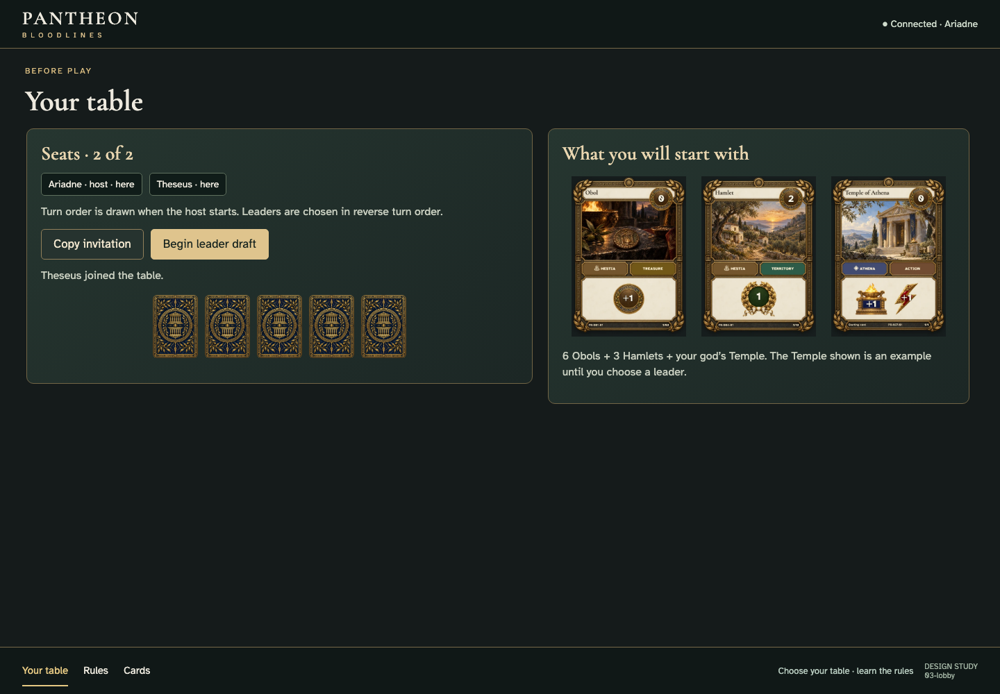](docs/ux/mockups/03-lobby-desktop.png) | [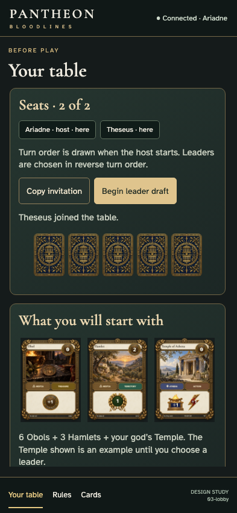](docs/ux/mockups/03-lobby-mobile.png) |

**User actions:** Copy the invitation. Host starts once every seat is occupied; guests see “Waiting for Ariadne to start.”

**Signifiers and affordances:** Each occupied seat names its player and connection state. Start has a visible reason when disabled.

**Animation and transition:** Join animates seat entrance once. Start commits first player and draft order → 04; no cards are dealt yet.

**E2E story:** 002.

### 04-draft · Choose your bloodline

| Desktop | Mobile |
| --- | --- |
| [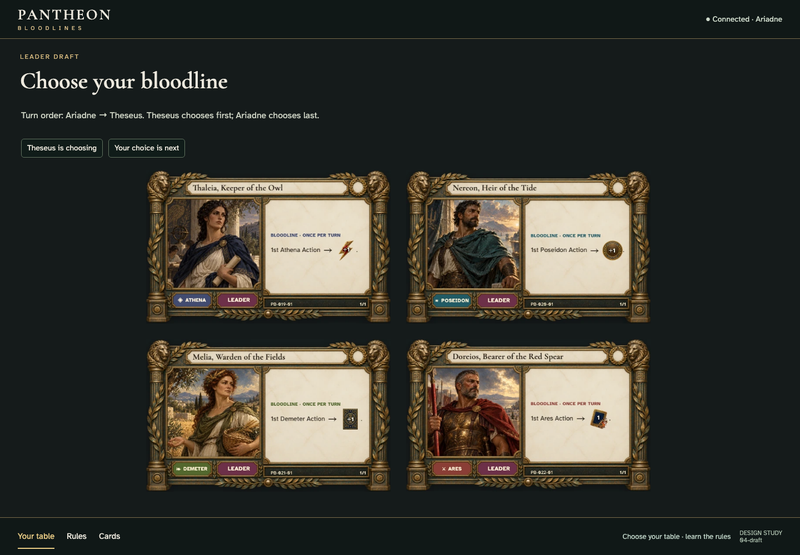](docs/ux/mockups/04-draft-desktop.png) | [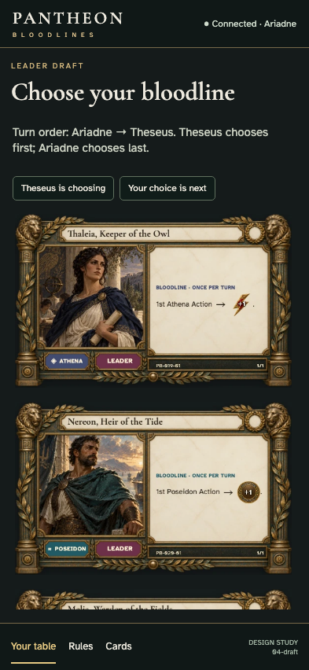](docs/ux/mockups/04-draft-mobile.png) |

**User actions:** Active drafter inspects an unused leader and confirms Choose [name]. Other players browse but cannot claim.

**Signifiers and affordances:** Current drafter is named; chosen leaders show owner and are unavailable. Landscape leaders retain their larger form factor.

**Animation and transition:** Claim travels to its seat; matching event and Temple preview appear. Advance backward in turn order. Last claim → 05.

**E2E story:** 003.

### 05-ready · Your empire begins

| Desktop | Mobile |
| --- | --- |
| [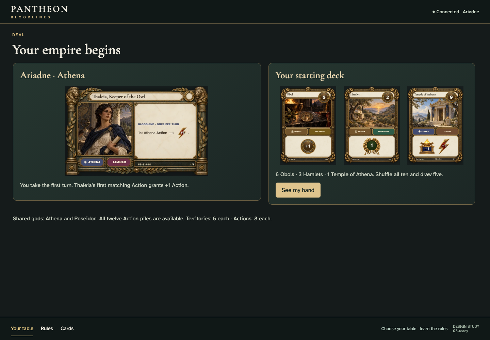](docs/ux/mockups/05-ready-desktop.png) | [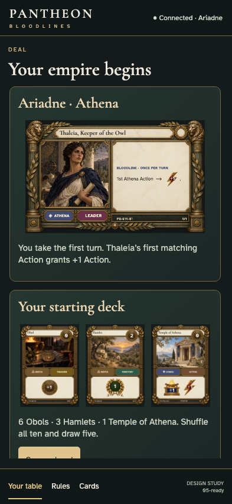](docs/ux/mockups/05-ready-mobile.png) |

**User actions:** See my hand dismisses the setup explanation locally; no readiness vote or extra game rule is introduced.

**Signifiers and affordances:** Your actual leader, god and Temple are shown together. The first player and supply scale are explicit.

**Animation and transition:** Authoritative setup commits once after the last draft. Deal five backs into each seat; only the owner sees faces → 06.

**E2E story:** 004.

### 06-actions · Your turn · Actions

| Desktop | Mobile |
| --- | --- |
| [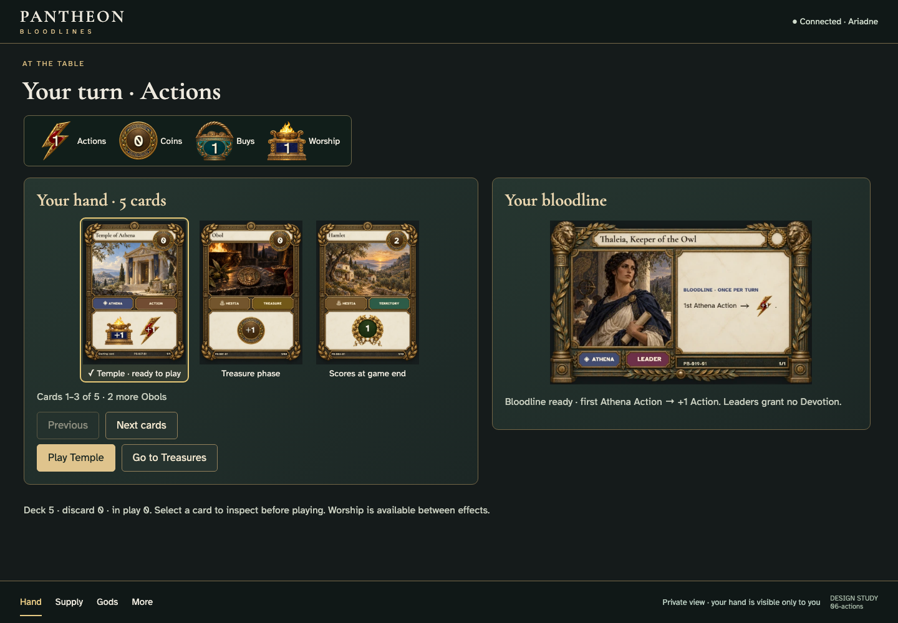](docs/ux/mockups/06-actions-desktop.png) | [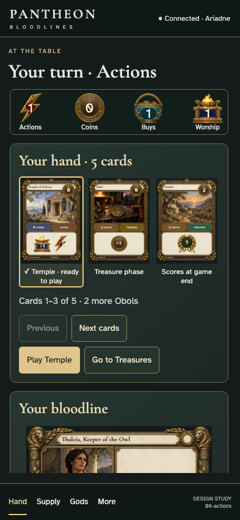](docs/ux/mockups/06-actions-mobile.png) |

**User actions:** Select a hand card; Play spends an Action and resolves all effects plus its leader trigger. Inspect is always separate from committing. Advance to Treasures voluntarily.

**Signifiers and affordances:** Legal cards have a gold outline and “Ready to play”; selected cards have a checkmark. Territories explain that they score at game end.

**Animation and transition:** Hand → play motion and counter changes, then leader pulse. Choices → 12/13/14. Phase advance → 07. Worship → 10.

**E2E story:** 005.

### 07-treasures · Your turn · Treasures

| Desktop | Mobile |
| --- | --- |
| [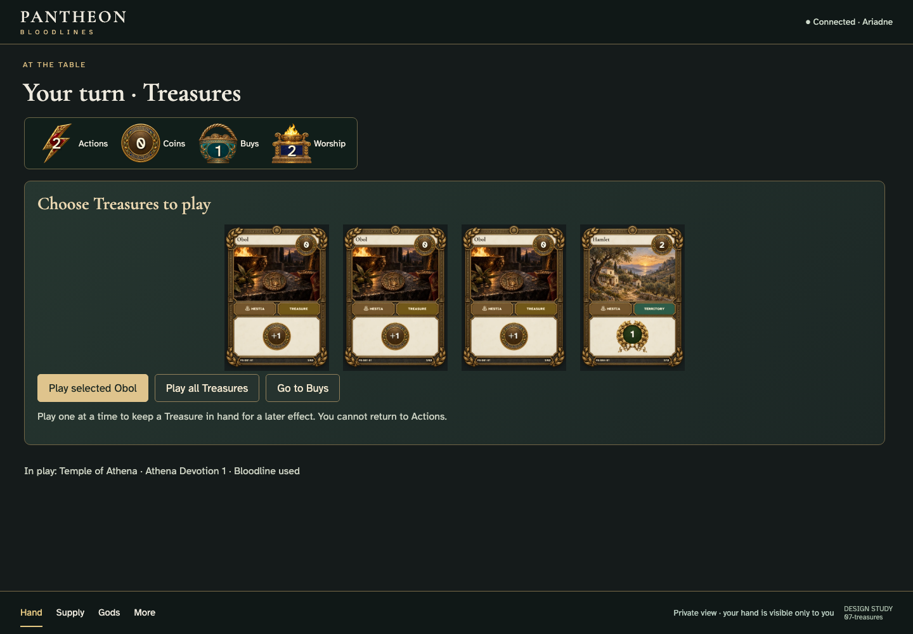](docs/ux/mockups/07-treasures-desktop.png) | [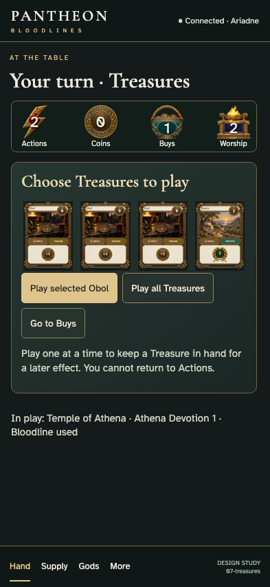](docs/ux/mockups/07-treasures-mobile.png) |

**User actions:** Play individual Treasures or use explicit Play all Treasures. Continue to Buys; confirmation is required only if playable Treasures would be left behind.

**Signifiers and affordances:** Coins update as each committed Treasure enters play. Hand cards remain targetable for later trash effects if left unplayed.

**Animation and transition:** Each played card moves to the play area; batch playback remains ordered. Between individual plays Worship remains available → 10. Advance → 08.

**E2E story:** 006.

### 08-supply · Your turn · Buys

| Desktop | Mobile |
| --- | --- |
| [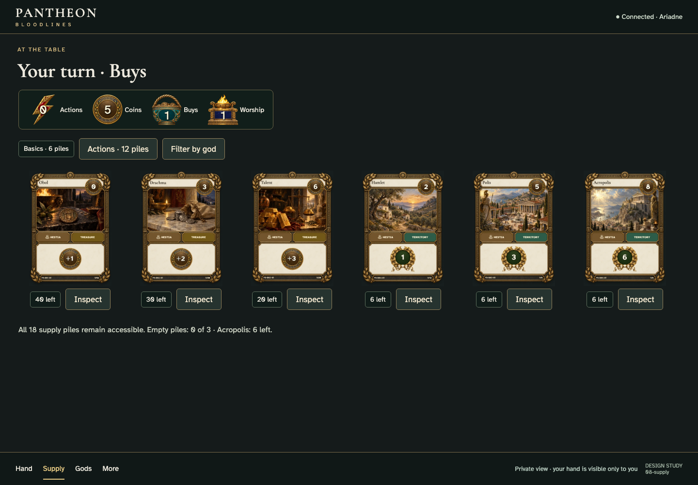](docs/ux/mockups/08-supply-desktop.png) | [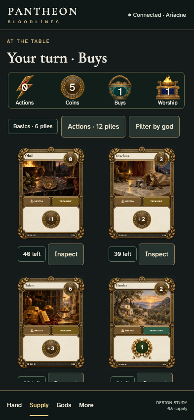](docs/ux/mockups/08-supply-mobile.png) |

**User actions:** Switch Basics/Actions, filter only the view, inspect a pile, and confirm Buy in its detail panel. Buy a cost-0 card still spends one Buy.

**Signifiers and affordances:** Each pile has a separate remaining count, independent of the face’s physical N/M. Affordable piles gain a Buy affordance; others state “Need 3 more Coins”, “No Buys” or “Empty”.

**Animation and transition:** Pile selection → 09. Purchase moves one face to discard; count and counters settle atomically. Additional buys stay here. End turn → 17.

**E2E story:** 007.

### 09-inspect · Polis

| Desktop | Mobile |
| --- | --- |
| [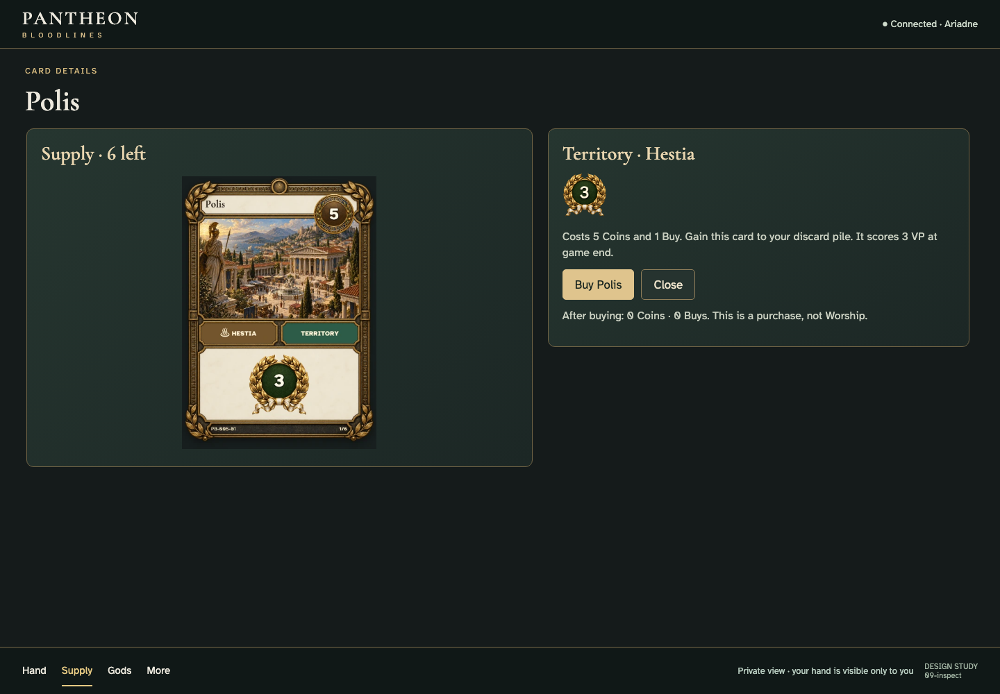](docs/ux/mockups/09-inspect-desktop.png) | [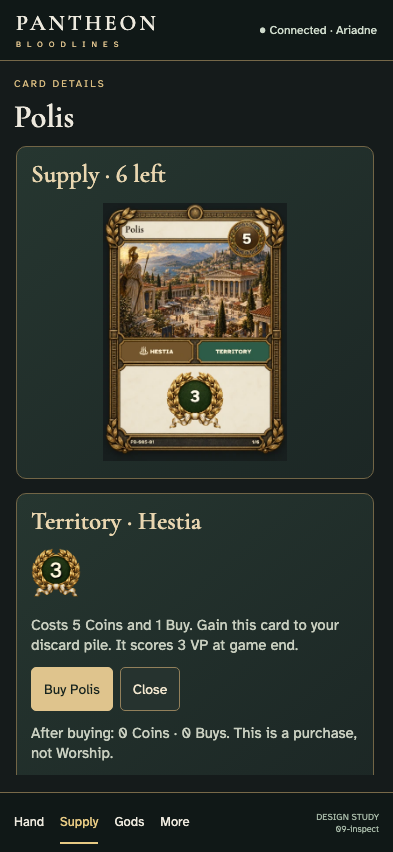](docs/ux/mockups/09-inspect-mobile.png) |

**User actions:** Read the full rules and inspect the unchanged card; confirm one context-specific action or close without a mutation. In-hand details offer Play only when legal.

**Signifiers and affordances:** Destination, payment and resulting counters appear beside the committing button. Copy serial stays separate from supply stock.

**Animation and transition:** Desktop modal, mobile full-height sheet; focus is trapped and restored on Close/Escape. Buy → 08, keeping the selected pile in view.

**E2E story:** 007.

### 10-worship · Worship

| Desktop | Mobile |
| --- | --- |
| [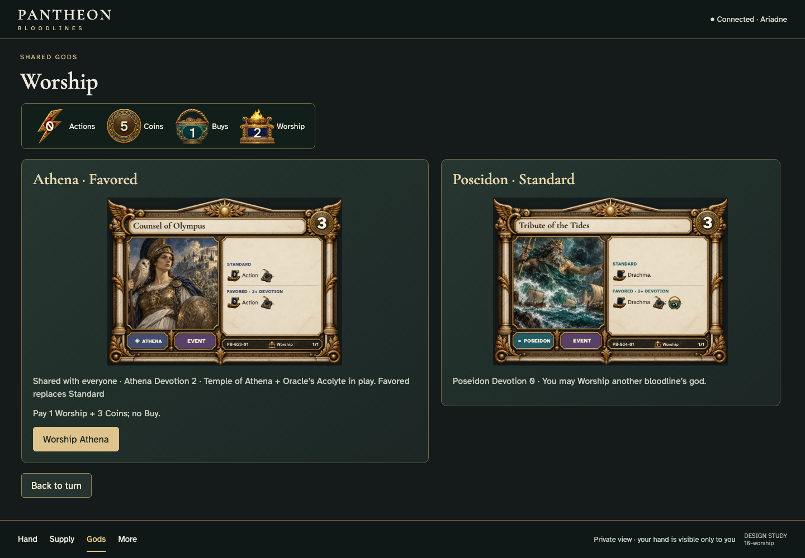](docs/ux/mockups/10-worship-desktop.png) | [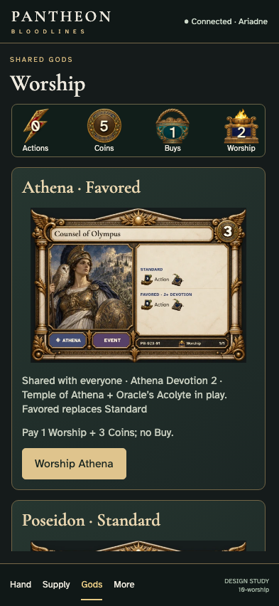](docs/ux/mockups/10-worship-mobile.png) |

**User actions:** Inspect any god selected at setup. Review automatically selected Standard/Favored effect and confirm Worship; no toggle can override Devotion.

**Signifiers and affordances:** Matching in-play Actions are named as the Devotion source. Favored is labeled, not color alone; both printed effects remain visible.

**Animation and transition:** Payment commits before resolution. Event stays in the shared area and never depletes. Resolve choices → 12/14; return to the original phase. Repeated Worship is legal if affordable.

**E2E story:** 008.

### 11-resolving · Resolving Temple of Athena

| Desktop | Mobile |
| --- | --- |
| [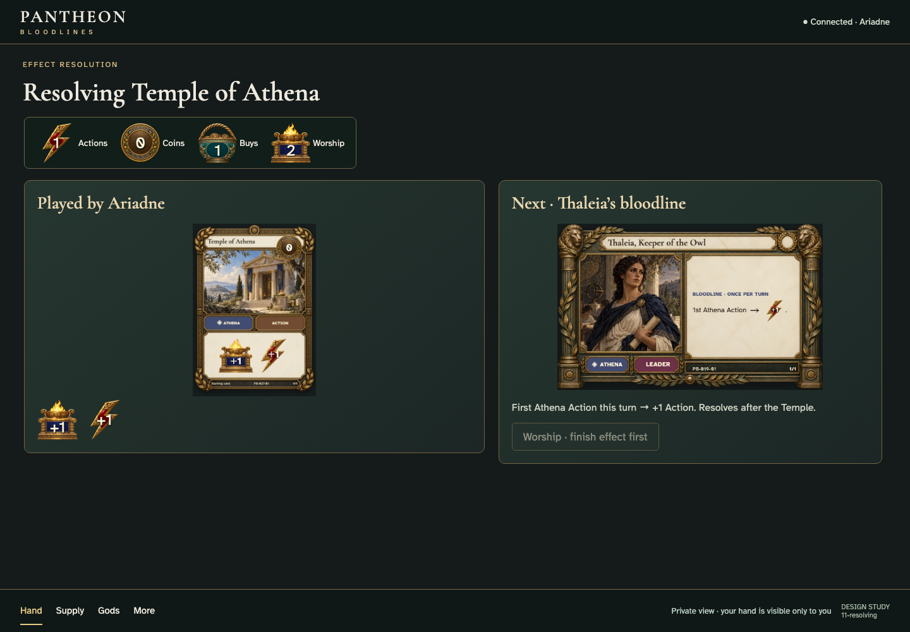](docs/ux/mockups/11-resolving-desktop.png) | [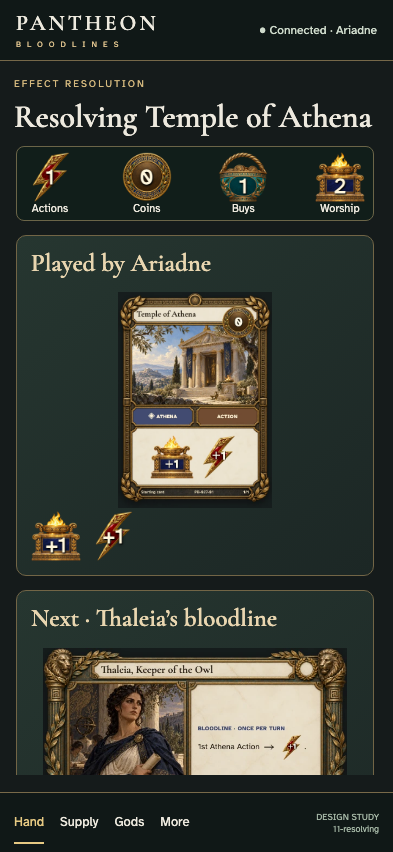](docs/ux/mockups/11-resolving-mobile.png) |

**User actions:** Wait for automatic instructions; make a choice only when the effect requests it. Do not allow another command to interrupt a card or leader.

**Signifiers and affordances:** Source card, instruction and upcoming leader are visible. Disabled actions name the reason; progress is finite, not an indefinite spinner.

**Animation and transition:** Resolve printed instructions in order, then leader. This is a transient state; assert it using a controlled animation clock, not a timing race. Settle → prior phase.

**E2E story:** 005.

### 12-trash · Seed Keeper · choose cards

| Desktop | Mobile |
| --- | --- |
| [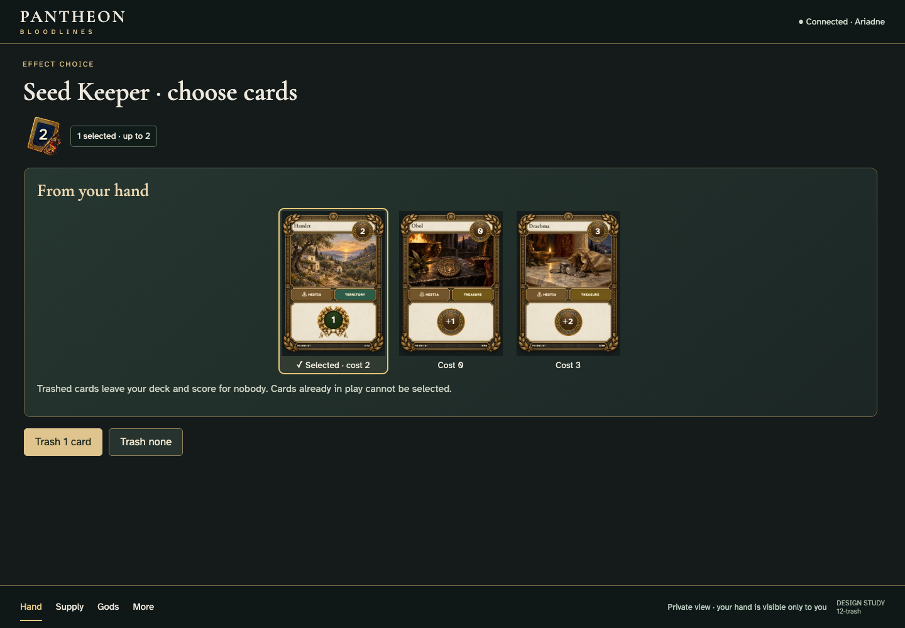](docs/ux/mockups/12-trash-desktop.png) | [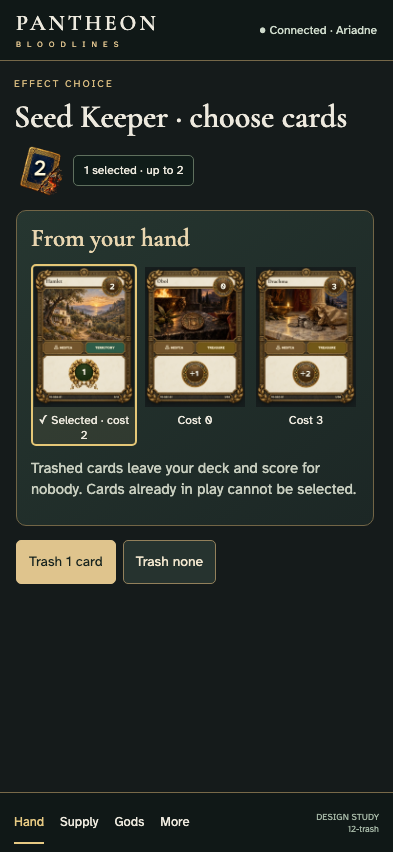](docs/ux/mockups/12-trash-mobile.png) |

**User actions:** Toggle zero to the permitted maximum from your hand; confirm exact selected count. Trash none is always available for optional trash, including Doreios.

**Signifiers and affordances:** Selected cards have a checkmark and a running count. The red-tinted destination uses the approved broken-card icon and text.

**Animation and transition:** Confirmed cards reveal publicly and move to shared trash. Continue the effect; for Forge/Trial zero means no gain. Doreios consumes the trigger even when skipped.

**E2E story:** 009.

### 13-discard · Harvest Feast · discard 1

| Desktop | Mobile |
| --- | --- |
| [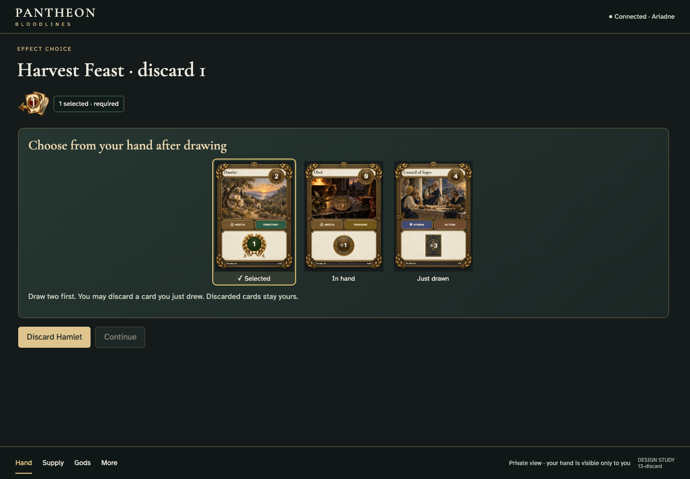](docs/ux/mockups/13-discard-desktop.png) | [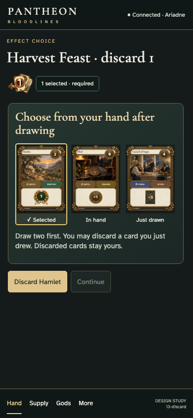](docs/ux/mockups/13-discard-mobile.png) |

**User actions:** Choose the required number from the post-draw hand. No skip while an eligible card exists; do as much as possible if the hand is smaller.

**Signifiers and affordances:** Required count and destination distinguish this from optional trash and topdeck. Newly drawn cards are labeled without excluding them.

**Animation and transition:** Hand → own discard, then the leader trigger and prior phase. An empty hand auto-completes with a named “No cards to discard” message.

**E2E story:** 009.

### 14-gain · Counsel of Olympus · gain

| Desktop | Mobile |
| --- | --- |
| [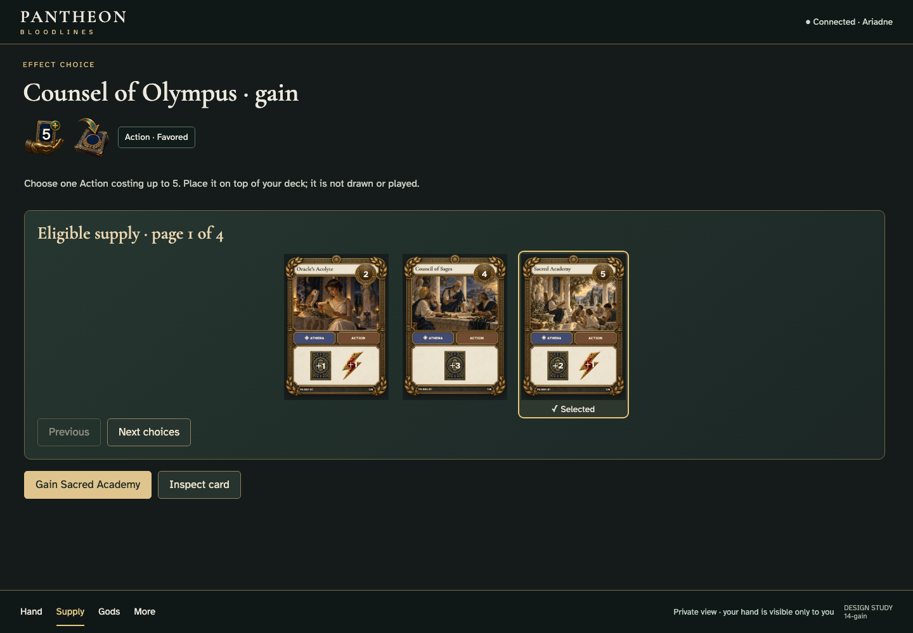](docs/ux/mockups/14-gain-desktop.png) | [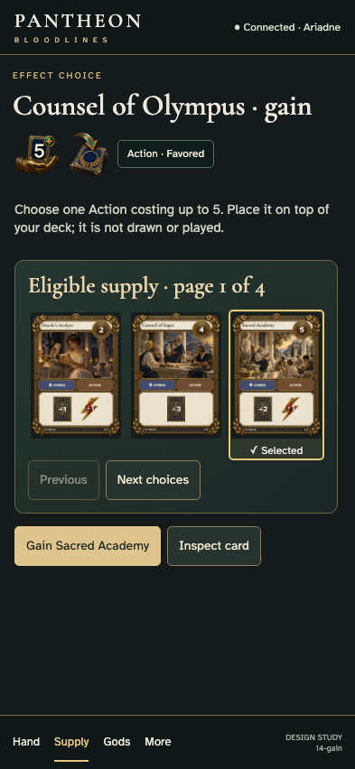](docs/ux/mockups/14-gain-mobile.png) |

**User actions:** Select one eligible nonempty supply pile, inspect if needed, and confirm Gain. No Coins or Buys are charged by the choice itself. Optional Demeter gain offers Gain nothing.

**Signifiers and affordances:** One gain icon contains the cost limit; topdeck appears only when required. Source effect, type restriction and destination are explicit; no ≤ or redundant Coin icon.

**Animation and transition:** Reveal the gained face publicly, decrement stock and move to discard or topdeck. No eligible pile auto-skips gain, explains why, and still resolves later instructions.

**E2E story:** 010.

### 15-reveal · Victorious Procession

| Desktop | Mobile |
| --- | --- |
| [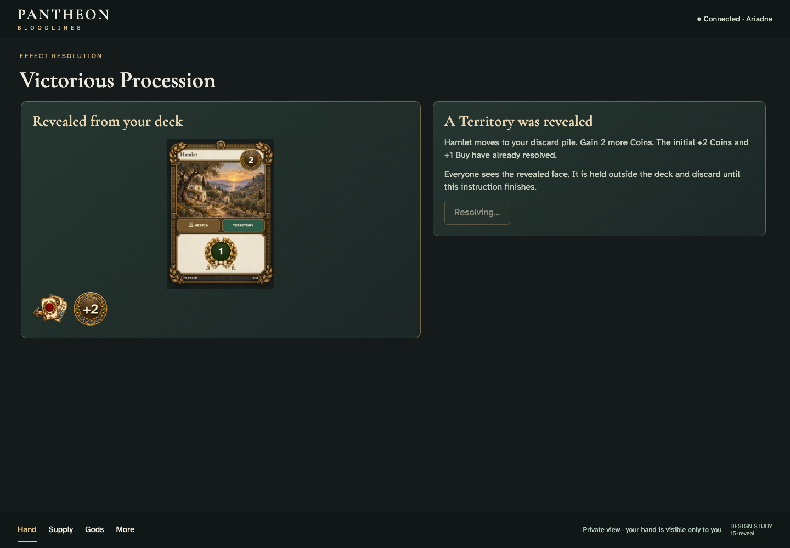](docs/ux/mockups/15-reveal-desktop.png) | [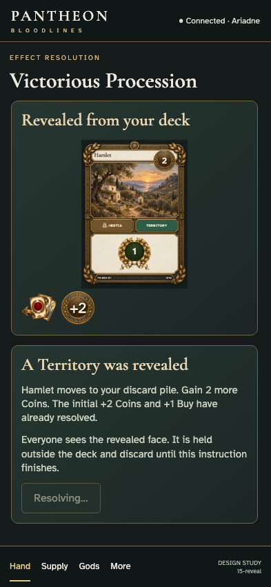](docs/ux/mockups/15-reveal-mobile.png) |

**User actions:** No choice is invented for a conditional reveal. Resolve automatically; open the activity record afterward to inspect what happened.

**Signifiers and affordances:** Show the revealed face and the exact branch/destination. A non-Territory shows Topdeck instead, without the bonus Coins.

**Animation and transition:** Deck back → public face → discard or deck. If deck empty, shuffle discard first; if both empty, report no reveal but keep initial rewards.

**E2E story:** 011.

### 16-order · Choose the next card drawn

| Desktop | Mobile |
| --- | --- |
| [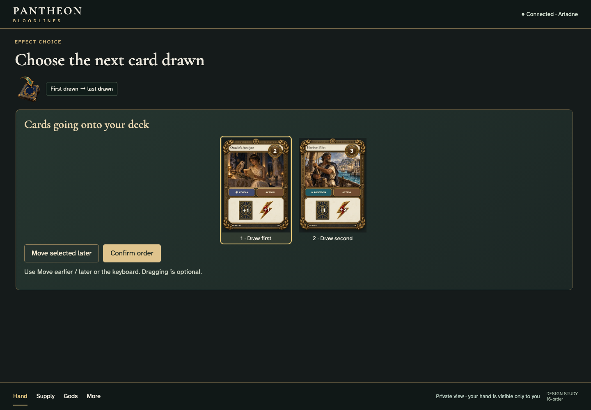](docs/ux/mockups/16-order-desktop.png) | [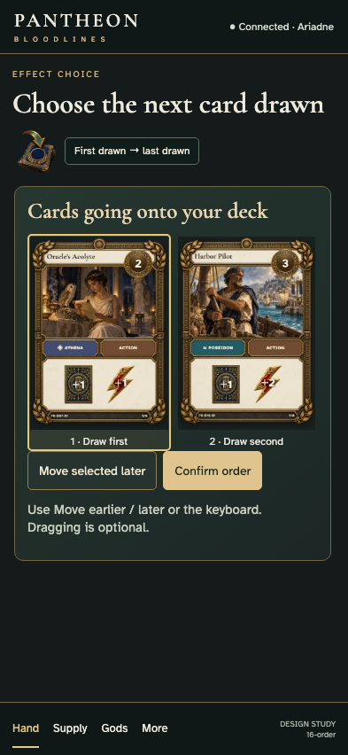](docs/ux/mockups/16-order-mobile.png) |

**User actions:** When a future effect puts multiple cards on top together, set first-to-last draw order and confirm. This generic rules state is not reachable with the current card set.

**Signifiers and affordances:** Numbered order and a “Draw first” label avoid ambiguous stack direction; move buttons are equivalent to drag.

**Animation and transition:** Commit one order and return to the effect. Keep this screen dormant in v0.1; do not invent a card effect to expose it.

**E2E story:** 011.

### 17-end-turn · Finish your turn?

| Desktop | Mobile |
| --- | --- |
| [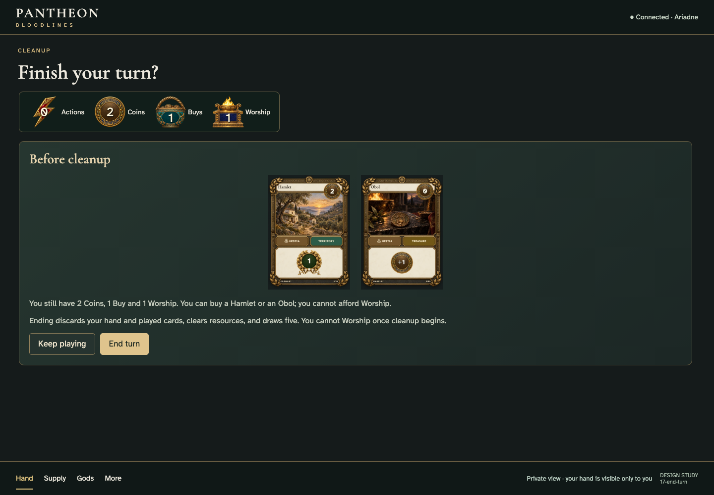](docs/ux/mockups/17-end-turn-desktop.png) | [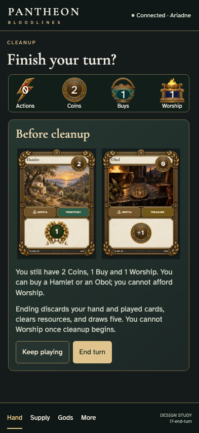](docs/ux/mockups/17-end-turn-mobile.png) |

**User actions:** Confirm cleanup when useful resources or legal actions remain; otherwise the explicit End turn command can proceed directly. Decline returns unchanged.

**Signifiers and affordances:** Name actual remaining legal options, not just nonzero counters. No automatic end when Buys run out: Worship may still be possible.

**Animation and transition:** Hand/play → discard, counters → zero, shuffle only as needed, draw five; check end condition after cleanup → 18 or 21.

**E2E story:** 012.

### 18-opponent · Theseus’s turn · Buys

| Desktop | Mobile |
| --- | --- |
| [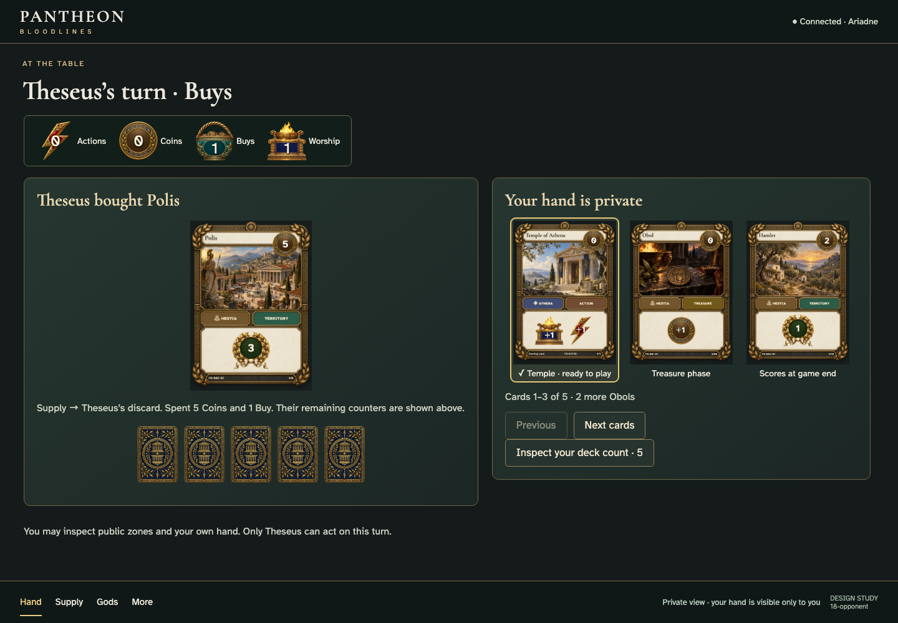](docs/ux/mockups/18-opponent-desktop.png) | [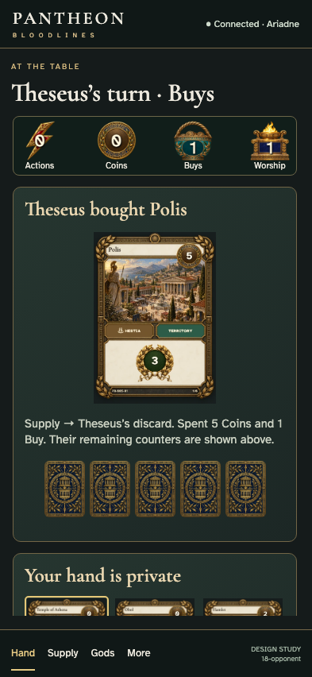](docs/ux/mockups/18-opponent-mobile.png) |

**User actions:** Follow the active player’s public moves; inspect your own hand and public piles while waiting. Do not queue out-of-turn game commands.

**Signifiers and affordances:** Active player’s name stays next to resource counters. A persistent actor/card/destination sentence remains after animation.

**Animation and transition:** Committed public actions animate once in event order. Private draws use backs. If another tab is open, show an activity badge without forcing navigation.

**E2E story:** 013.

### 19-zones · Public piles

| Desktop | Mobile |
| --- | --- |
| [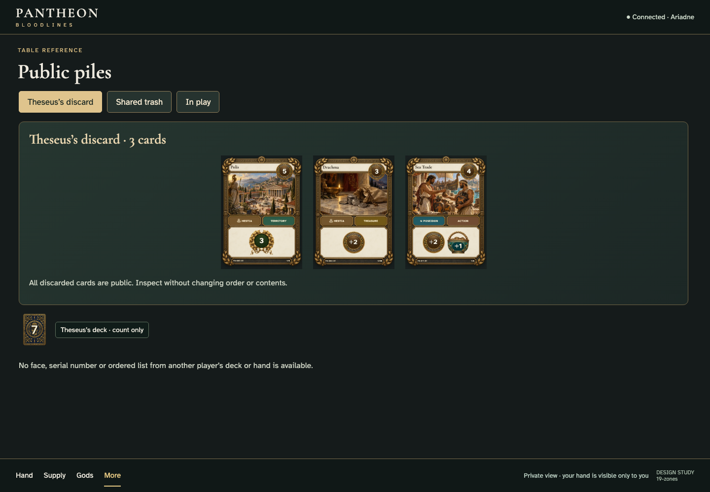](docs/ux/mockups/19-zones-desktop.png) | [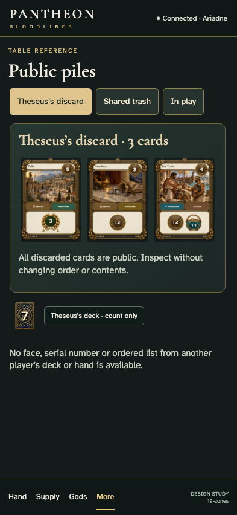](docs/ux/mockups/19-zones-mobile.png) |

**User actions:** Switch public owner/zone, page through all cards and inspect faces. Deck inspection returns only the count; your own hand remains privately accessible.

**Signifiers and affordances:** Zone heading includes owner and count; shared trash has a distinct broken-card icon. No reorder handles on read-only piles.

**Animation and transition:** Open as desktop side panel or mobile full-height sheet. Close restores prior phase/tab/scroll/focus; state continues updating behind it.

**E2E story:** 014.

### 20-activity · What happened

| Desktop | Mobile |
| --- | --- |
| [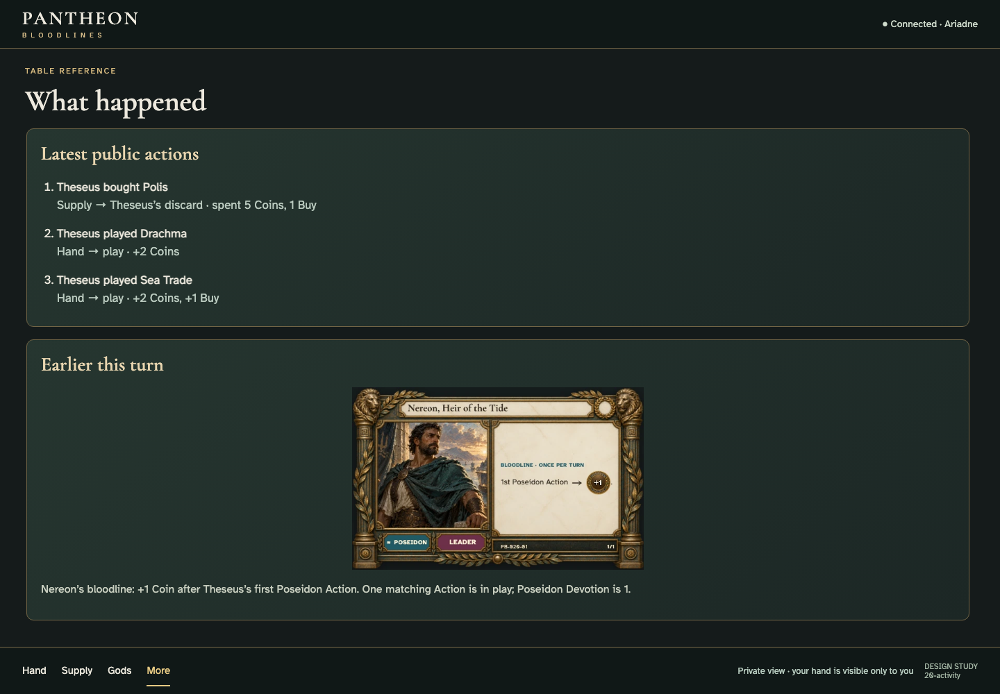](docs/ux/mockups/20-activity-desktop.png) | [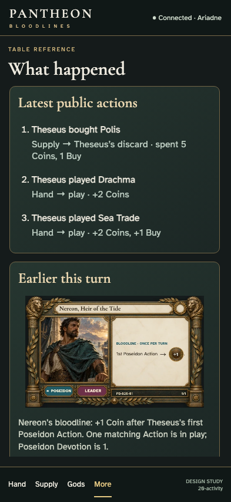](docs/ux/mockups/20-activity-mobile.png) |

**User actions:** Read public events in order, inspect referenced cards and load earlier history. No rewind, undo or replay-as-command action.

**Signifiers and affordances:** Names, source → destination and resource deltas explain each event. Turn grouping replaces unstable wall-clock timestamps.

**Animation and transition:** Append new activity with a small entrance; preserve the reader’s position and offer “New actions”. Reconnect catches up without replaying the entire animation queue.

**E2E story:** 013.

### 21-results · Ariadne’s victory

| Desktop | Mobile |
| --- | --- |
| [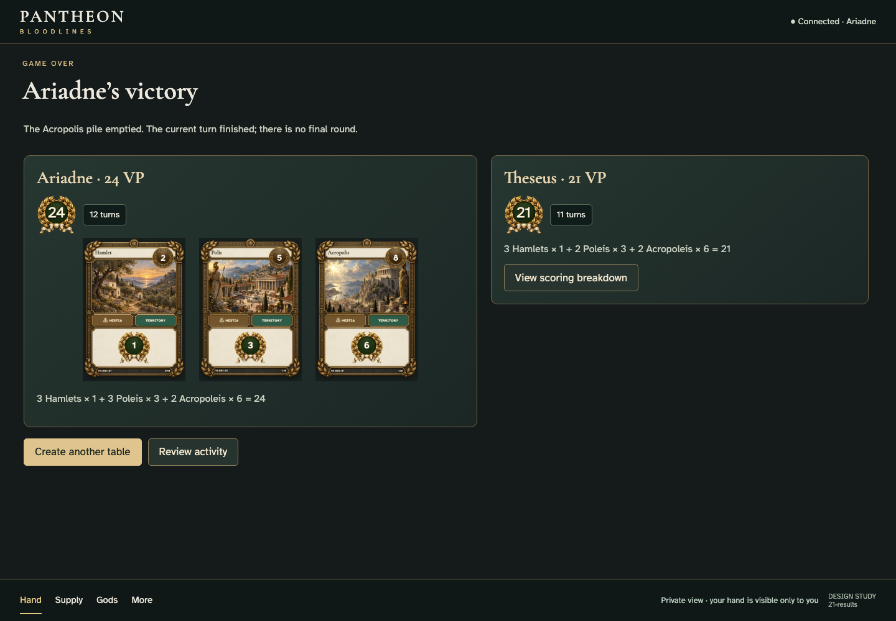](docs/ux/mockups/21-results-desktop.png) | [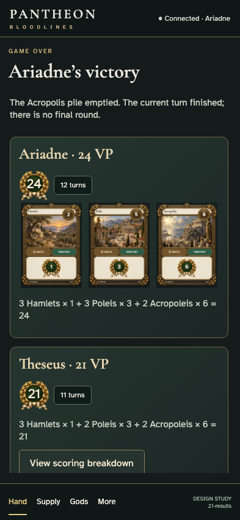](docs/ux/mockups/21-results-mobile.png) |

**User actions:** Review final territory totals across all owned zones and turns taken. Create another table returns to setup with the name remembered; it never resets this game.

**Signifiers and affordances:** State the end reason, exact VP arithmetic and tie resolution. For equal points use fewer turns, then “Shared victory”.

**Animation and transition:** After cleanup/check, final counters settle and results appear with a modest laurel fade. The completed table stays read-only and reloadable.

**E2E story:** 015.

### 22-connection · Reconnecting to your table

| Desktop | Mobile |
| --- | --- |
| [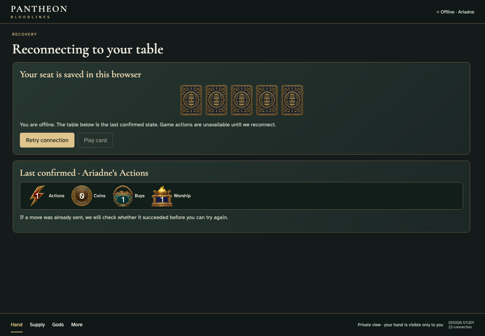](docs/ux/mockups/22-connection-desktop.png) | [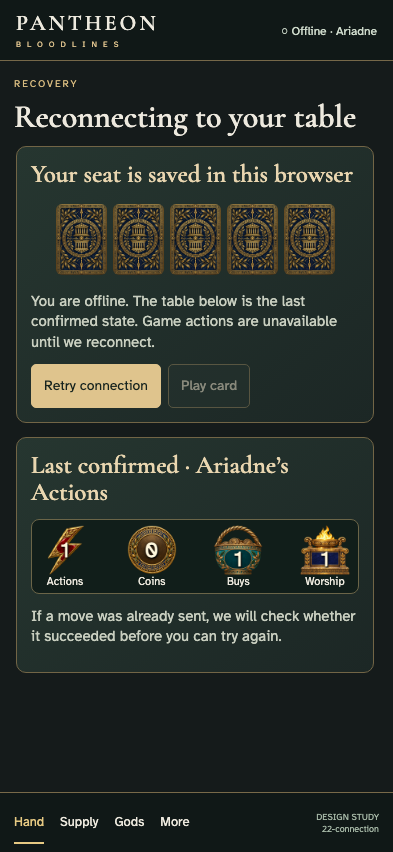](docs/ux/mockups/22-connection-mobile.png) |

**User actions:** Retry connection; continue reading confirmed public information. Never optimistically queue purchases or privately reshuffle offline.

**Signifiers and affordances:** Text + connection indicator distinguishes connecting, sending, synced, offline and failed; “Sending…” is not success.

**Animation and transition:** On recovery restore canonical state/private view and reconcile command ID. No duplicate effect, no animation backlog. Restore pending choice or show whose turn it now is.

**E2E story:** 016.

### 23-unavailable · This table is full

| Desktop | Mobile |
| --- | --- |
| [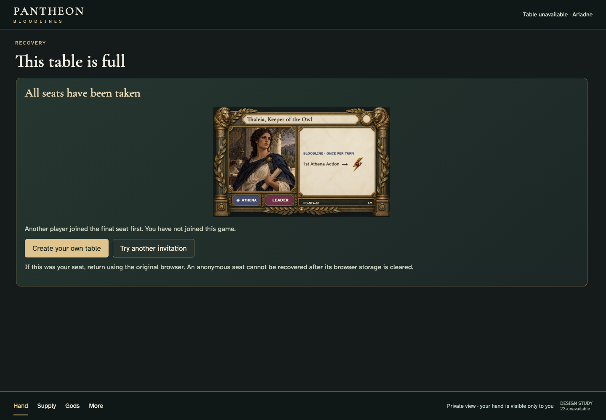](docs/ux/mockups/23-unavailable-desktop.png) | [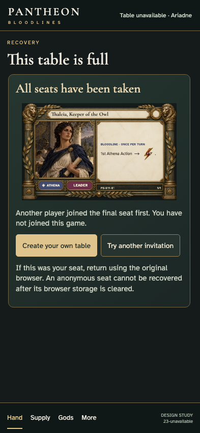](docs/ux/mockups/23-unavailable-mobile.png) |

**User actions:** Recover using the original browser or return to setup. Missing/invalid invitation, already-started nonmember, sign-in failure and unsupported history use this same shell with specific copy and safe actions.

**Signifiers and affordances:** Plain-language reason; no raw Firebase error, game document ID, stack trace or disabled spinner trap.

**Animation and transition:** Retry only recoverable failures. Lost identity never silently replaces another seat. Existing members may resume a full or started game.

**E2E story:** 016.

### 24-table-display · Shared table

| Desktop | Mobile |
| --- | --- |
| [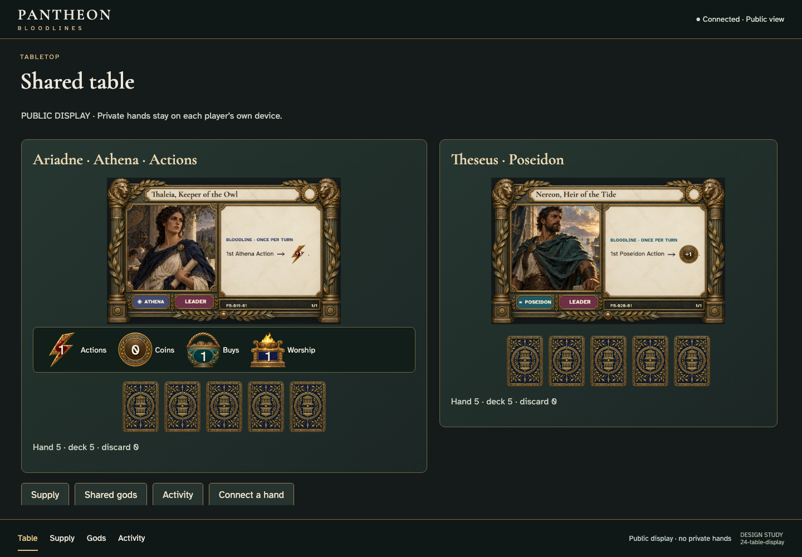](docs/ux/mockups/24-table-display-desktop.png) | [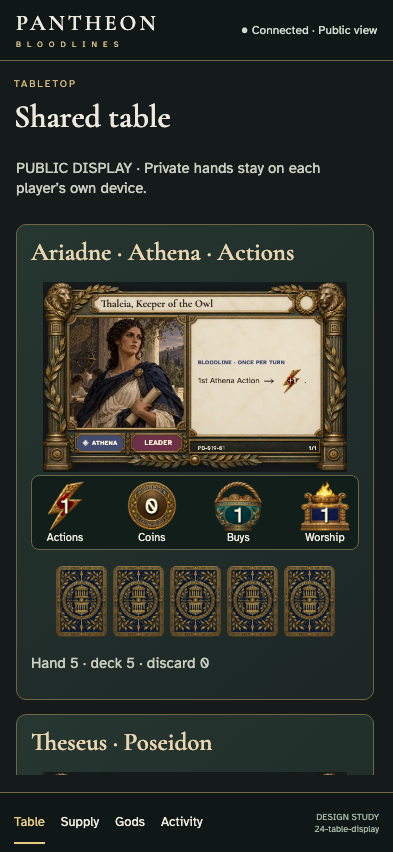](docs/ux/mockups/24-table-display-mobile.png) |

**User actions:** Open a read-only public-display session using a short-lived host-authorized display link; inspect supply, gods and activity. Each seated player uses their existing browser/controller.

**Signifiers and affordances:** PUBLIC DISPLAY label is persistent. Only deck backs/counts appear for hands; no “show hand” button exists on this surface.

**Animation and transition:** Same committed event stream, public projection only. Rotation/4K layout changes presentation, never turn order. A display capability cannot read private documents or submit player commands.

**E2E story:** 017.

### 25-controller · Your private controller

| Desktop | Mobile |
| --- | --- |
| [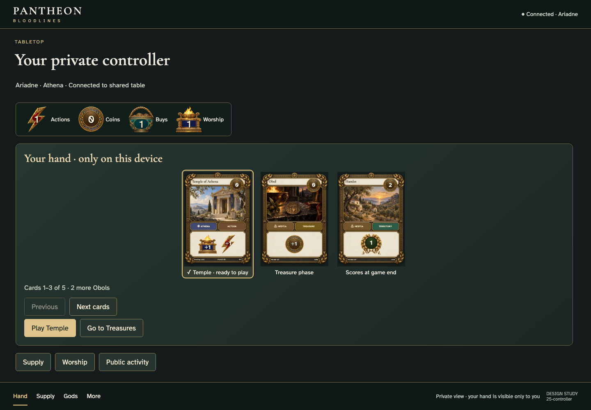](docs/ux/mockups/25-controller-desktop.png) | [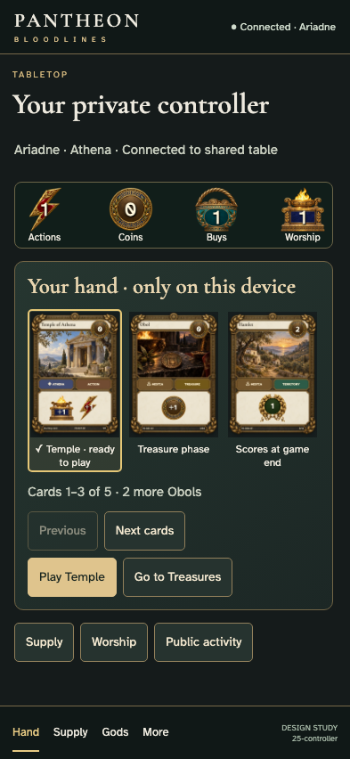](docs/ux/mockups/25-controller-mobile.png) |

**User actions:** Use all normal turn/choice controls from a private seat session. Open display link separately; do not move the anonymous identity to another device through a room link.

**Signifiers and affordances:** Seat name and whose turn it is remain visible. Controller is the normal private gameplay view, not a second participant.

**Animation and transition:** Controller command acknowledges → public display receives public movement. Private new cards only reach the owner. Disconnect follows 22.

**E2E story:** 017.

### 26-table-options · Table options

| Desktop | Mobile |
| --- | --- |
| [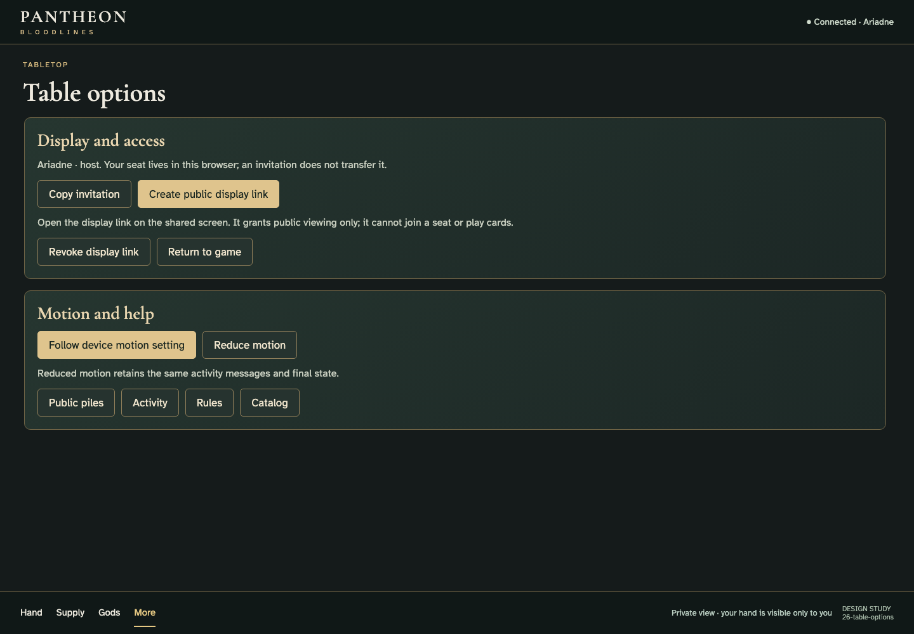](docs/ux/mockups/26-table-options-desktop.png) | [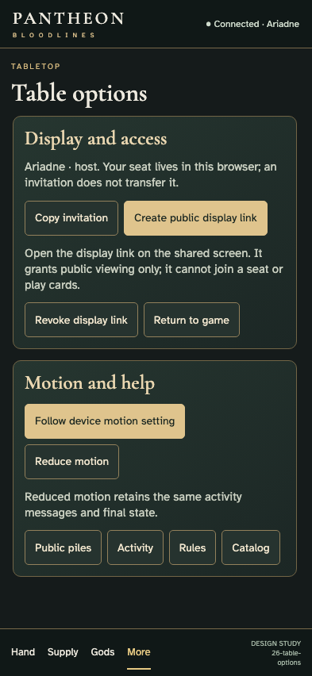](docs/ux/mockups/26-table-options-mobile.png) |

**User actions:** Copy lobby invite, issue/revoke a public-display capability as host, or set reduced motion locally. No restart, kick, surrender, transfer-seat or speed setting is implied for v0.1.

**Signifiers and affordances:** Player invite and public display link are explicitly different controls. Copy provides textual success/failure; a selectable URL is the fallback.

**Animation and transition:** Options overlay returns to prior view. Leaving the page keeps the seat; untrusted display links expire/revoke and return to 23. Capability support is future backend work.

**E2E story:** 017.

### 27-rules · How to play

| Desktop | Mobile |
| --- | --- |
| [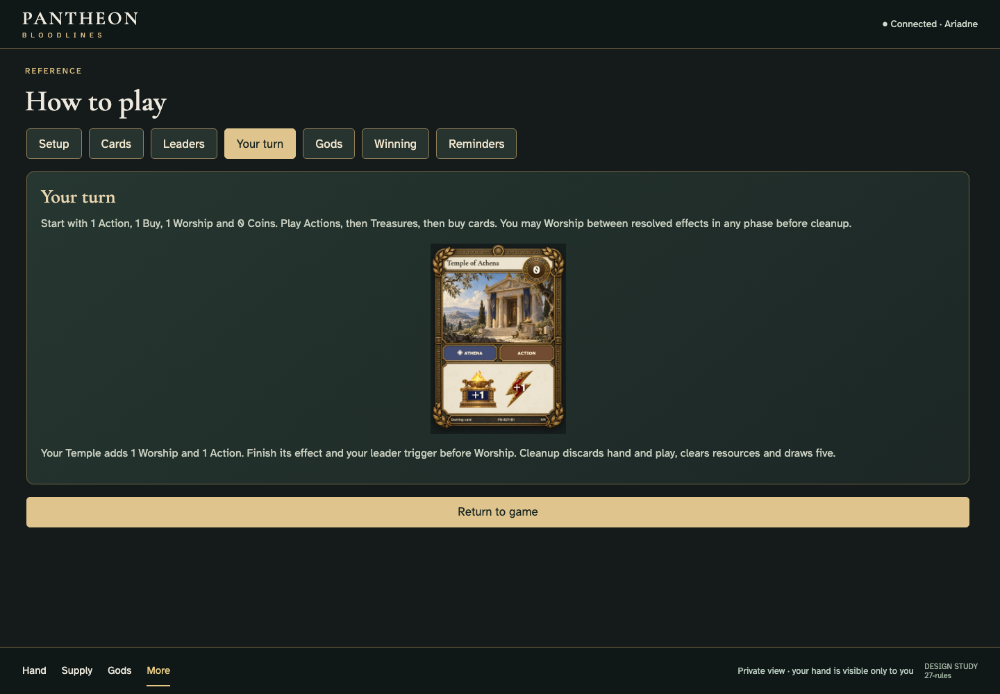](docs/ux/mockups/27-rules-desktop.png) | [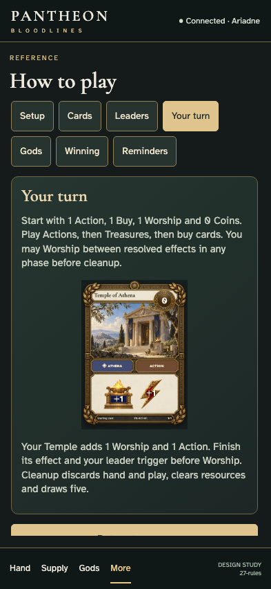](docs/ux/mockups/27-rules-mobile.png) |

**User actions:** Open contextual rules, use the shared sticky section navigation, read actual card examples and return without losing the pending game choice.

**Signifiers and affordances:** Concise document prose and familiar card imagery; current section has an underline and aria-current. A game badge indicates ongoing activity.

**Animation and transition:** Rules scroll as a document; they do not pause the game. Return restores the prior view, unless acknowledged state has advanced. Existing /rules remains the canonical summary.

**E2E story:** 018.

### 28-catalog · Card reference

| Desktop | Mobile |
| --- | --- |
| [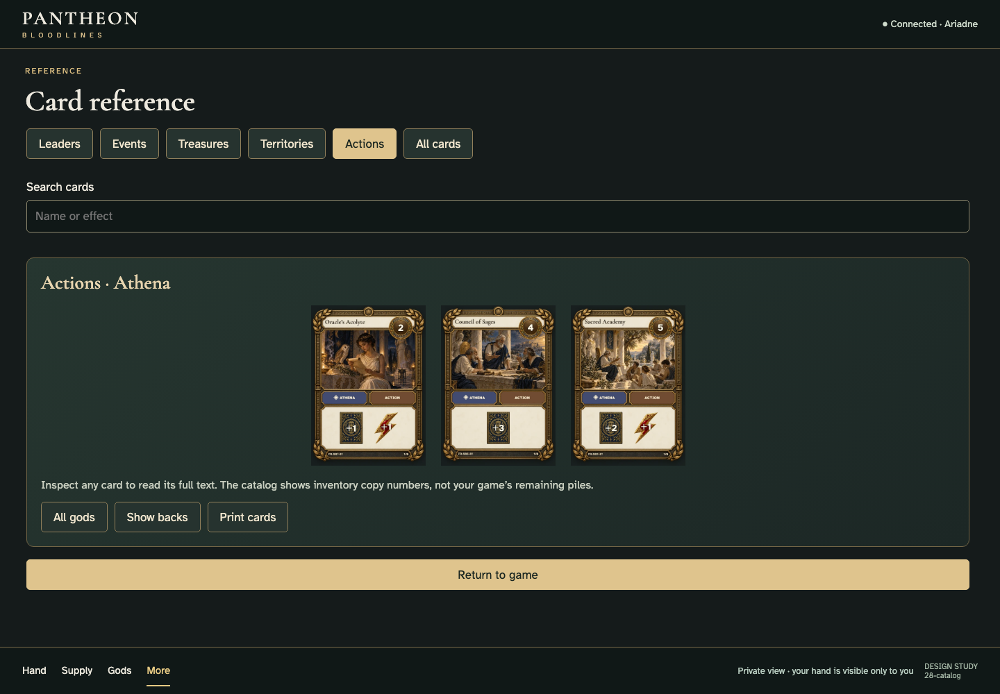](docs/ux/mockups/28-catalog-desktop.png) | [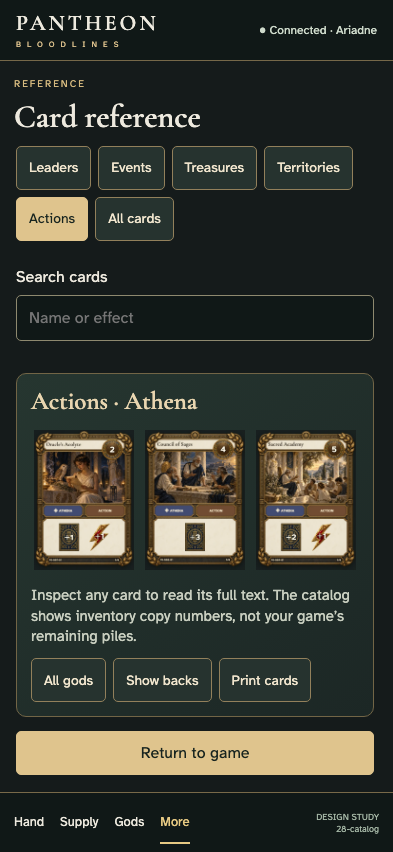](docs/ux/mockups/28-catalog-mobile.png) |

**User actions:** Search/filter all thirty definitions, inspect any physical copy/front/back and print using the established gallery. No catalog button purchases a card.

**Signifiers and affordances:** Same StickyNav as the rules; clear “Card reference” scope. Deck/event/leader backs remain distinct.

**Animation and transition:** Reference opens without replacing the seat. The full existing gallery remains a scrolling document; return restores the game context.

**E2E story:** 018.

## State variants and rule fidelity

These branches are part of the screens above, not additional undisclosed routes. Implementation stories must photograph each materially different choice or error state, not only the happy-path mockup.

| Screen family | Required variants and behavior |
| --- | --- |
| 01–03 access/setup | Signing in, signed in, sending create/join, host/guest waiting, 2/3/4 occupied seats, empty/overlong name, copy success and clipboard failure fallback. Capacity cannot change after creation in v0.1. Start is host-only with all seats filled. No kick/replacement-seat flow is defined. |
| 04–05 draft/deal | Each drafter’s own selectable view and everyone else’s waiting view; taken leaders name their owner. Choose a random first player once, persist order, draft in reverse order. Chosen gods’ events are shared with everyone. Give exactly 6 Obols + 3 Hamlets + matching Temple; draw 5. Temples, leaders and events never become supply piles. |
| 06–08 phases | Hand with no legal Action, zero Actions, extra Actions, large hands, no Treasures, intentionally unplayed Treasures, multiple Buys, cost-0 buys, unaffordable and depleted piles. Start every turn at 1 Action / 1 Buy / 1 Worship / 0 Coins. Never auto-play Treasures or automatically end a turn because a resource reaches zero. Leaving a phase with playable cards asks a specific confirmation using screen 17’s shell. |
| 09 details | Supply/hand/public pile/event/leader context, full effect transcript, unknown deck count only, unavailable command reason. Full-sized card is readable without hiding its frame/serial. In-game public inspectors cannot flip an opponent’s hidden card. Catalog “Show back” is a reference function only. |
| 10 Worship | 0/1 Devotion Standard; 2+ Favored **instead of** Standard. Show contributing in-play cards; no leader, hand, discard or deck contribution. Starting Worship plus Temple additions, repeated same-god Worship, any selected god regardless of owner, payment with zero Buys, insufficient Coins/Worship and resolving/cleanup lockouts. Keep original phase throughout. Payment is not refunded when an effect cannot complete. |
| 11 leader/effect | Apply printed instructions in order, then first-matching leader. Temple grants Worship then Action, then leader. Thaleia +Action, Nereon +Coin, Melia +Card, Doreios optional trash. A matching card that accomplishes nothing still triggers. The trigger is once each turn; a skipped Doreios opportunity is consumed. Leader availability is public. |
| 12–14 choices | Optional trash zero/one/two, exact mandatory discard (or as many as possible), source hand only, required/optional gain, no eligible pile, depleted selected pile and destination changes. Forge uses trashed cost +2; Trial uses +1 / +3. Skipping their trash skips their gain. Demeter Favored allows optional trash and optional gain at summed cost, including zero-cost Obol after trashing none; +1 Buy occurs regardless. |
| 14 god gains | Athena Standard gain Action cost 3 / Favored 5, both topdeck; Poseidon Standard Drachma to discard / Favored topdeck plus Buy. Drachma empty skips only that gain, preserving the Favored Buy. Sacred Grove gains any type up to 4 to discard. Temples are never eligible gains. |
| 15–16 deck operations | Shuffle discard only when a draw/reveal needs an empty deck, continue partial draws, stop if both empty. Revealed cards stay outside shuffle zones. Procession Territory → discard +2 Coins; other card → topdeck; nothing → no reveal benefit. All keep initial +2 Coins/+1 Buy. Multiple simultaneous topdeck ordering is defined by the rules but currently unreachable; screen 16 and its future story are explicitly deferred. |
| 17–18 cleanup | Confirm useful remaining options; discard hand and play, zero resources, draw five, then check ending. No Worship during cleanup. Opponents see backs for private draws, faces for plays/gains/trashes/reveals, public discard contents and counts. Their counters are clearly labeled with their name. |
| 19–20 inspection | Empty/one/many cards in public piles, hand/deck count, large log, new events while reading older ones. No pile reordering or hidden information through alt text, accessibility tree, activity payloads or network documents. |
| 21 results | Acropolis empty or any three supply piles empty, detected after cleanup. Finish the current turn without a final round. Count all owned Territories, including starting Hamlets, excluding trash. Tie → fewer turns → shared victory. Results persist on reload; “Create another table” creates a new game, never resets history. |
| 22–23 recovery | Initial connecting, command sending, offline, retrying, rejected stale/illegal command, no configuration, sign-in failure, missing/invalid invitation, full table, started table for nonmember, lost anonymous identity, unsupported/corrupt history. Keep a pending choice or last confirmed state where possible; explain failure rather than silently starting over. |
| 24–26 tabletop | Public display on desktop/4K or phone, private controller on either size, live public updates, capability expiration/revocation, controller disconnect. No pass-and-play on an exposed shared screen. Existing print/card-tabletop tools remain available; the shared live display is an additional proposed surface. |
| 27–28 reference | All sticky sections and catalog filters, all thirty faces, all three backs, copy selection, no results, print/tabletop view, context-preserving return. Full document scrolling is intentional; game turn controls must not appear inside catalog inspection. |

## Motion and synchronized play

Animations explain **committed** events. A command first shows pending feedback and disables duplicate submission; it does not optimistically spend a resource or expose a card. On acknowledgement, apply the authoritative state and play a bounded visual explanation. Never derive game state or unlock a rule transition from animation completion.

| Change | Normal motion | Persistent / reduced-motion equivalent |
| --- | --- | --- |
| Seat joins | 220 ms opacity/8 px entrance | Seat appears and “[name] joined” remains in activity. |
| Leader chosen | 350 ms face moves to the named seat; 180 ms event/Temple reveal | Owner badge and chosen god/Temple appear immediately. |
| Play a card | 320 ms hand → play; 180 ms resource delta pulse | Face appears in play, counters update, actor/effect message remains. Opponent origin is a back until public play. |
| Leader triggers | 240 ms border pulse after card instructions | “Bloodline used” badge and named reward, once per turn. |
| Worship | 240 ms event highlight, then normal effect movements | Payment, Standard/Favored label and result message; event stays put. |
| Buy/gain/trash/discard | 350 ms face follows source → destination; at most 60 ms stagger in a batch | Destination count and source count update; distinct approved operation icon plus named card. Public gain-to-deck briefly exposes the gained face before becoming a common back. |
| Draw/shuffle | 280 ms backs discard → deck when needed, then 260 ms backs to hand | Counts settle; owner sees faces only in private view. Shuffle order is never visualized or transmitted publicly. |
| Reveal | 180 ms back-to-face crossfade; 500 ms readable hold; 300 ms destination movement | Face and branch persist in activity. No input prompt for an automatic branch. |
| Modal/sheet | 160 ms fade / 12 px slide | Immediate open/close with identical focus movement. |
| Turn handoff | 220 ms active-seat underline change | “[name]’s turn · Actions” remains visible. No full-screen blocking toast. |
| Results | 300 ms laurel/header fade | Full score table immediately readable; no confetti obscuring numbers. |

Reduced motion uses zero-duration layout changes, not transforms of duration zero; no looping shimmer or essential timed disappearance. Animations may batch multiple resource deltas but must preserve card/leader/effect order. A missing visible origin (another tab, paginated hand, closed inspector) animates from a labeled zone anchor, not an invented card position. Offscreen events update a badge and persistent activity; they do not navigate the viewer away from a choice.

A reconnect renders the latest confirmed state without replaying historical motion. If an acknowledgement was lost, reconcile a stable command ID before permitting retry; an accepted purchase cannot become two purchases. Out-of-date controls refresh with “The table changed; choose again.” Simultaneous commands must never claim the same seat, leader or last supply card twice.

### Private state and tabletop boundaries

The existing setup event stream contains public setup information only. Gameplay needs an authoritative command processor or equivalently enforced transitions, plus authorized per-player private projections. Do **not** publish hand contents, deck order, shuffle seeds or private draws in the shared stream and hide them with CSS. Unknown cards use the common deck back with no revealing metadata. Gains, trash and reveals are public as the rules require.

The proposed shared display is read-only and receives a public projection under a revocable, scoped viewing capability. A player invitation does not transfer identity, and a display link does not grant a seat. A host creates the display link in Options; it may be opened on a TV or a separate browser profile. The shared screen must never be a hidden-hand toggle over a host-authenticated private payload. This capability and its authorization tests are prerequisites for screen 24, not functionality supplied by the current setup backend. Public display sessions are not extra players and cannot delay a turn.

## E2E user stories and visual acceptance

Follow the numbered, illustrated user-story organization already used by [001-game-setup](tests/e2e/001-game-setup/README.md), the shared [TestStepHelper](tests/e2e/helpers/test-step-helper.ts), and the neighboring Jaipur/Roborally pattern: an explicit player outcome, named behavioral verifications at each step, and a screenshot documenting the result. **The following are implementation acceptance stories, not tests claimed to exist or pass today.** Keep the current setup/gallery/rules regression suite.

### Zero-pixel contract

1. Every new story step goes through `TestStepHelper`; no direct screenshot assertions scattered through tests. Extend its API for expected connecting/offline/error statuses instead of bypassing status checks. The current helper assumes `synced` and a non-scrolling setup; it needs an explicit named-scroll-region contract for the game panes described here.
2. Use global `maxDiffPixels: 0` **and** `threshold: 0`, retries 0, no masks, no per-story tolerance, no image normalization and no baseline updates during ordinary verification. Do not inherit any tolerance exceptions from reference projects.
3. Run phone 393 × 852, desktop 1440 × 1000 and tabletop 3840 × 2160 at DPR 1 with the pinned browser, bundled fonts, fixed locale/timezone and existing rendering flags. Maintain separately reviewed macOS/Linux baselines. The desktop mockups specify composition; tabletop needs its own 4K runtime snapshots, not enlarged desktop baselines.
4. Use real anonymous auth and Firestore emulators with isolated deterministic fixtures. Fix visible names, seating, leader order, deck order, supply and command IDs through a test-only trusted fixture interface that cannot ship enabled in previews. Randomized games remain random outside tests. Assert server acknowledgement, fonts ready, every image decoded and finite animations settled; no sleeps or random visible URLs/timestamps.
5. A helper step verifies observable state and authorization outcomes before its screenshot: resources, legal controls, source/destination counts, active seat/phase and pending choice. Assert exact game projection/replay equality separately; matching pixels alone is insufficient.
6. Game shell/root: **zero** geometric overflow and zero overlapping interactive hit boxes. Named scroll panes are the only exception to full containment: verify their bounding boxes stay inside the shell, their scrollable extent is intentional, and scroll positions/page changes expose every item. Hidden offscreen children must not remain active hit targets. Test first/last item, focused-item scrolling and sticky chrome. Do not broadly exempt all descendants or use clipping to hide broken layout. Rules/catalog use their existing document-scroll audits.
7. Preserve the existing card-fit audit, assert no card reports overflow at every displayed size, and verify readable inspector text. Deliberately injected card overflow must still be detected. Game-shell geometry strictness does not relax the existing card audit or global screenshot thresholds.
8. Stable screenshot stories use reduced motion. Separate normal-motion tests observe actor/source/destination and ordered animation start/finish, then compare the same settled state. Freeze a known animation time through a controlled clock to capture a transient reveal/resolution if needed; never race a millisecond delay. Test reduced-motion paths explicitly, including no transform residue.
9. Generate baselines intentionally, inspect all changed images, commit them, then run comparison mode. Each story directory has its spec, generated illustrated README and platform/project screenshots. Link this design’s screen IDs in the story metadata; mockup PNGs are **not** executable app baselines.

### Story inventory

For every row, the listed arrows are documented `TestStepHelper` steps with screenshots on all three viewports. Negative and conditional branches get additional named steps/scenarios. Use separate browser contexts for different players, not repeated logouts in one context.

| ID / user outcome | Photographed steps | Required behavioral verifications |
| --- | --- | --- |
| **002 — Take and retain a seat** | Entry → invitation → lobby → resumed lobby (01–03) | Create/join/resume 2, 3 and 4 players; name validation; own/guest start controls; capacity and supply scaling 6/9/12 Territories, 8/12/16 Actions; copy fallback; two clients see joins once; reload retains identity; last-seat race has one winner. Keep 001’s existing coverage rather than deleting it. |
| **003 — Choose my bloodline** | Waiting drafter → inspect leader → own choice → leader claimed (04) | Persist random first player once; reverse draft order for 2/3/4; every leader unique; reject out-of-order/duplicate claims and concurrent stale claim; spectators see owner; reload mid-draft preserves order; chosen events available to everyone and unused gods absent. |
| **004 — Receive a private starting deck** | Last claim → setup explanation → first private hand (05–06) | Ten exact starting cards, unique matching Temple, shuffle/draw five, deck five, no discard; starting inventory does not reduce supply. First seat starts with 1/1/1/0; others wait. Another context, public stream, DOM and accessibility tree cannot see private faces/order. Reconnect does not redeal. |
| **005 — Play Actions and use my leader** | Select Temple → resolving → leader result → next legal Action (06,11) | Spend before resolving, +Worship/+Action order, first-match reward for all four leaders, once only/reset next turn; no leader Devotion; no-effect Action still triggers; Doreios skip consumes trigger. Illegal type, zero Actions, other player and mid-effect Worship reject. Draw/action chains and paginated large hands remain usable. |
| **006 — Play Treasures deliberately** | Treasure phase → one Treasure → Worship between plays → play all → Buys (07,10) | Exact Coin totals, no Action payment, retained Treasure can be trashed later, explicit phase confirmation, no return to earlier phases, double submission does not play twice. Individual plays allow Worship between effects; Play all commits an ordered batch without an invented interrupt. |
| **007 — Buy and inspect cards** | Basics → Actions filter → detail → purchase result → depleted/disabled pile (08–09) | All 18 piles reachable; inspect does not buy; cost +1 Buy; gain to discard; cost-0 buy still costs Buy; multiple buys; cannot buy Temple/leader/event; no overspend/empty purchase; physical N/M unchanged; end-condition warning updates without ending mid-turn. |
| **008 — Worship a shared god** | Standard → Favored → payment → result → repeat (10–11,14) | 0/1/2+ matching Actions, exact cost and 1 Worship, no Buy, other leader’s god, repeat same god, original phase retained. Standard/favored are alternatives; paid effect with no target is not refunded. Reject unselected god, insufficient resources, mid-effect/leader and cleanup Worship. |
| **009 — Choose trash or discard targets** | Optional trash none → trash selected → mandatory post-draw discard → resolved leader (12–13) | Seed Keeper 0/1/2; Doreios 0/1; no target in play; territory valid; discard can use newly drawn cards; no skip if mandatory target exists; empty hand does as much as possible. Selection survives paging; confirm disabled above limit. Trash removes ownership/VP; discard does not. |
| **010 — Gain to the correct destination** | Eligible choices → inspect → gain → destination → no eligible choices (14) | Grove any type ≤4; Forge +2 after actual trash; Trial +1/+3, skip→no gain; Athena Action-only 3/5 topdeck; Poseidon Drachma discard/topdeck and favored Buy even if empty; Demeter summed costs, optional gain, zero-trash→Obol, +Buy regardless. UI uses embedded Gain value, no printed ≤. No free resource deduction or gained-card auto-play. |
| **011 — Draw, shuffle and reveal** | Draw across empty deck → reveal Territory → reveal non-Territory → empty both (15) | Shuffle discard only; no hand/play/trash/revealed card included; partial draw exact; Procession initial rewards always, conditional destination/bonus exact; observer sees only public reveal. Future simultaneous topdeck-order scenario (16) is deferred until reachable, not forced into v0.1 via an invented effect. |
| **012 — Finish a turn** | Remaining-options confirmation → decline → cleanup → next player (17–18) | No automatic end at zero Buys; Worship opportunity retained; confirmation describes actual legal options; discard hand/play, clear counters, draw five, check end, advance/reset leader once. No command during cleanup; interrupted/retried cleanup never draws twice. |
| **013 — Understand another player’s actions** | Remote play → leader → Worship/gain → buy → activity history (18,20) | Two synchronized clients observe ordered public events, named actor/resources/destinations, private draws as backs; unobserved view gets badge, not navigation. One animation per committed event; normal/reduced motion same projection; reconnect no historical animation burst; reader position preserved. |
| **014 — Inspect without changing the game** | Public discard → trash → deck count → own hand detail (09,19) | Full public contents, count-only private decks, empty/large zones, no reorder mutation. Inspecting an opponent’s play never grants an action. Keyboard/modal focus, Escape and scrolled-item return; other client continues taking turns while inspector is open. |
| **015 — See the correct winner** | Last pile card gained → finish turn → final totals → reload results (21) | Separate Acropolis/three-empty endings; no early finish/no final round; all owned zones and starting Hamlets score, trash excluded. Unequal points, points tie/fewer turns, full shared tie; 2/3/4-player cases; read-only final state and new-table action leave history intact. |
| **016 — Recover safely** | Sending → offline → reconnect → restored choice; each unavailable reason (22–23) | Lost acknowledgement before/after commit, refresh during choice, stale revision, rejected command, unavailable config/auth, full/missing/started invite, lost identity. Resume same seat, idempotent retry, no optimistic double-spend, no hidden secrets/errors in copy. Status-aware helper must still photograph offline/error states. |
| **017 — Play at a shared table privately** | Options → issue display link → public display → private controller → remote action → revoke (24–26) | Different seat/viewer contexts; 4K and phone display containment; no hidden faces even in network responses or accessibility tree; viewer denied commands/private reads; owner-only hand; no seat transfer through invite. Expired/revoked link rejected, viewer disconnect does not consume seat or block play. |
| **018 — Learn without losing my place** | Contextual rules → sticky sections → catalog filter/inspect/back → return (27–28) | Same nav component/styles/order; all rules/leader explanations and catalog definitions; all three backs; full keyboard flow, scroll containment, no overflow, print. No purchase in catalog; return retains current valid selection or announces table advanced. Existing rules/gallery tests remain the source of detailed card rendering assertions. |

For 010, parameterize every effect branch above rather than exercising just a generic gain dialog. For 005, include all twelve Actions and four Temples across the effect stories, with all four leader triggers. For 015, fixture both game-ending causes and tie outcomes without playing hundreds of setup moves; also retain one real multi-client start-to-finish command-driven game to catch integration gaps.

A test story step should read like this (illustrative future API, not a new helper implementation in this PR):

```ts
await story.step('favored-athena-paid', {
  description: 'I Worship Athena and choose an Action for my deck.',
  status: 'synced',
  verifications: [
    { spec: 'One Worship and three Coins are spent; my Buy is unchanged.', check: assertPayment },
    { spec: 'My two Athena Actions enable Favored; my leader adds no Devotion.', check: assertDevotion },
    { spec: 'Only nonempty Action piles costing up to five can be gained.', check: assertEligiblePiles },
    { spec: 'Topdeck is the destination, and the original phase is retained.', check: assertDestinationAndPhase }
  ]
});
```

### Implementation sequence and review gates

1. **Draft and private setup:** stories 002–004 plus private projection authorization. Review real phone/desktop/4K setup screenshots before proceeding.
2. **Turn engine and basic economy:** stories 005–007, 012 and public activity primitives. Commit/replay correctness before cosmetic motion.
3. **All effects and Worship:** stories 008–011, every branch in the card set and all leaders. Review choice usability and resource/destination clarity.
4. **Completion and resilience:** stories 013–016, full game, race/reconnect cases, normal/reduced motion.
5. **Tabletop and reference integration:** stories 017–018, display capability authorization, controller privacy, 4K presentation and contextual return.

Each milestone requires behavioral/emulator checks, exact screenshot comparisons and reviewed new baselines. A design mockup is an approval artifact; it does not demonstrate implemented rules or substitute for the future E2E stories.
