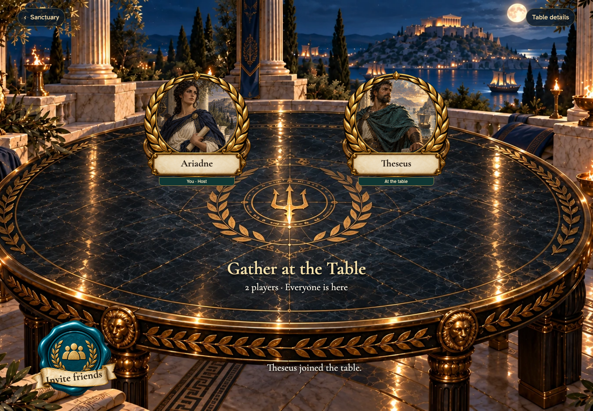
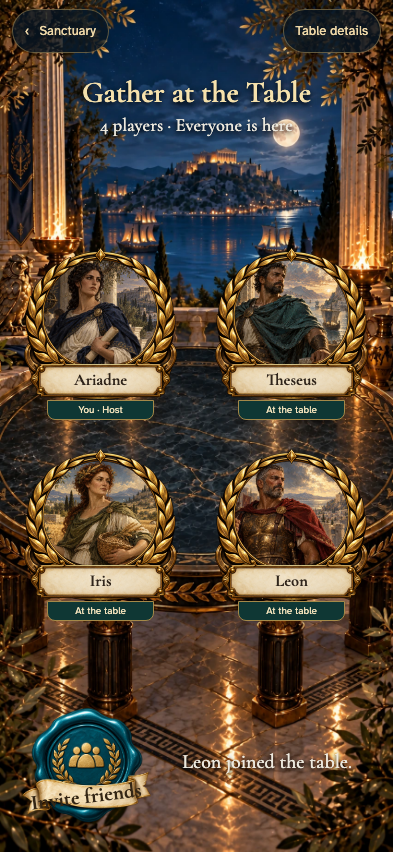

# Gathering fidelity review

Implementation step 2 follows [Gather your players](../../../docs/ux/concepts/02-gather.png), [unavailable invitations](../../../docs/ux/concepts/22-unavailable.png) and the connection-recovery behavior of [screen 15](../../../docs/ux/concepts/15-interruption.png). The sanctuary from step 1 is accepted; this gathering implementation is submitted for visual review.

| View | Gathering | Unavailable invitation |
| --- | --- | --- |
| Phone | [Four players](screenshots/000-four-player-phone-darwin.png) | [Full table](screenshots/000-full-phone-darwin.png) |
| Desktop | [Two players](screenshots/004-joined-desktop-darwin.png) | [Full table](screenshots/000-full-desktop-darwin.png) |
| 4K | [Four players](screenshots/000-four-player-tabletop-4k-darwin.png) | [Full table](screenshots/000-full-tabletop-4k-darwin.png) |

The implementation retains the elliptical obsidian table, sculpted gold rim, laurel portrait medallions, parchment nameplates, teal invitation seal, torchlight and distant Acropolis. Desktop places the heading on the near table; portrait moves it above the seats. All names, seat counts and statuses are live. The separate medallion frame exposes the approved portrait artwork through its alpha window. Arrivals illuminate the named seat through a finite 450 ms movement, then retain a readable activity line; reduced motion goes directly to the same state.

The number of visible seats reflects the actual chosen capacity. The concept's two-player illustration also showed two spare rings; the implementation avoids suggesting that a two-player table can accept four players. Count seals are selectable before creation and become fixed capacity afterward. Portraits are decorative seating art, not leader selections. The Begin action belongs to step 3's complete draft transition, as specified in the plan, and is not presented as an inert control here.

The nameplate itself accepts a name. A small Sanctuary control and Table details control provide real navigation and supply information. Supply details and invitation sharing use readable, focused overlays; the gathering stays free of dashboard panels or undealt cards. The missing/full invitation scene preserves the painting's empty chair, distant occupied table and gold owl coin, with live recovery links.

The E2E stories cover 2/3/4 seats; whitespace validation and a long name; keyboard submission, dialogs, Escape and focus restoration; actual invitation copying and selectable manual copying; remote arrivals and exact motion counts; restoration without a remembered name; competing guests for the last seat; full/missing/invalid invitations; failed initial sign-in retry; and interrupted table recovery. Public game events and membership are real emulator data. Clipboard failure and transport interruptions are the only injected platform failures.

Exact screenshot comparisons use zero pixel/color tolerance on macOS and Linux, with no masks or retries. Each capture waits for loaded art/fonts and finished motion. The concept paintings remain human fidelity targets; baselines record the actual implementation rather than approximating the paintings pixel-for-pixel. See [the illustrated primary story](README.md) and [the complete scenarios](setup.spec.ts).
