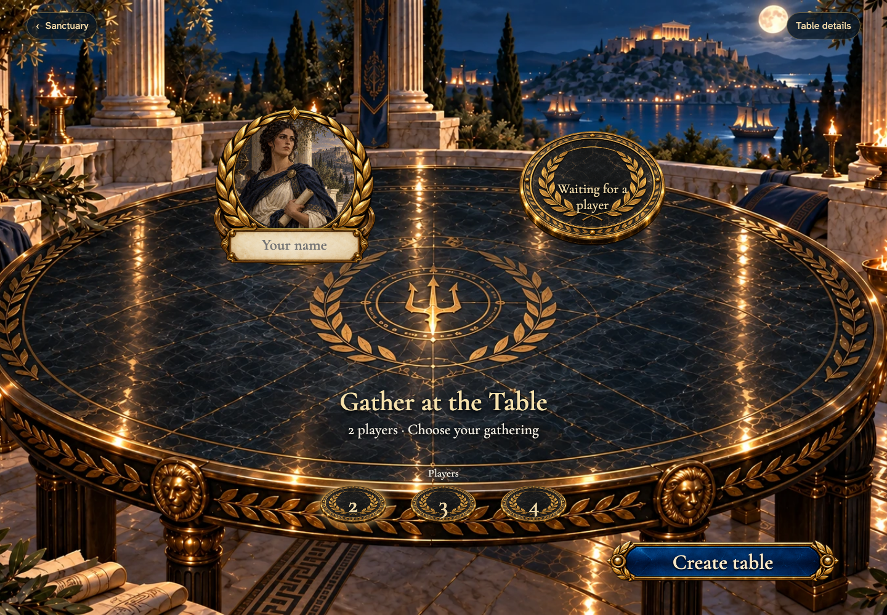
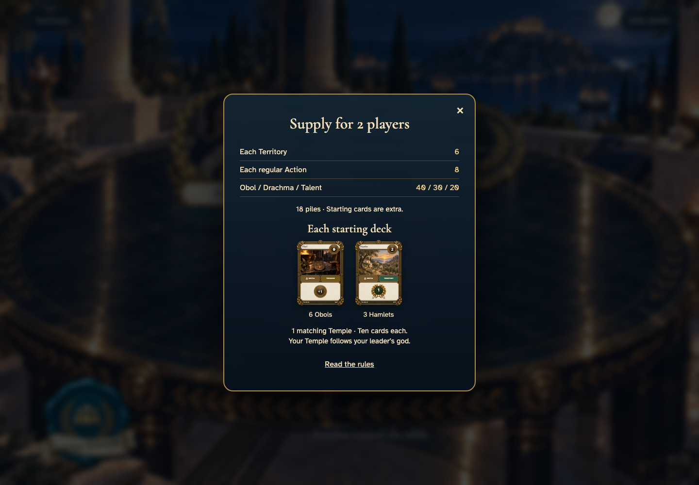

# Gather at the Table

## Choose your gathering

- [x] Two seats are selected, and the name plate is ready.
- [x] The screen speaks to the player and shows no undealt cards.

## Take your seat at a two-player table

- [x] The creator occupies the host seat and one seat remains.

## Inspect the gathering’s supply

- [x] Two-player supply and the ten-card starting inventory match the rules.

## Invite friends with the wax seal

- [x] The invitation opens a focused, dismissible sharing control.

## Welcome another player to the table

- [x] The remote arrival fills the second seat and names the action once.
