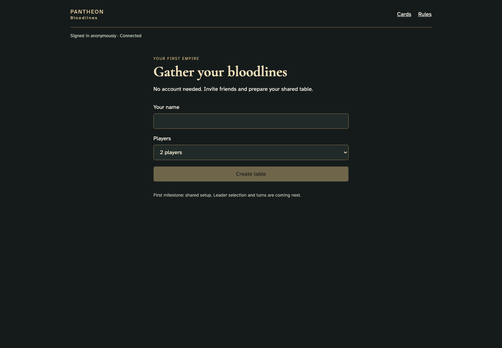
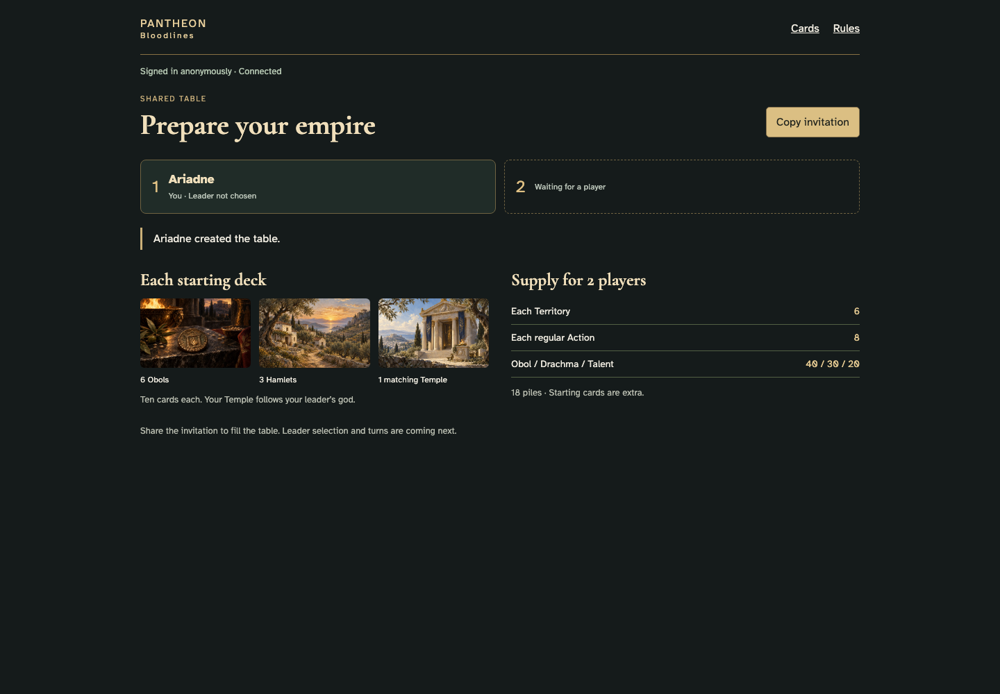
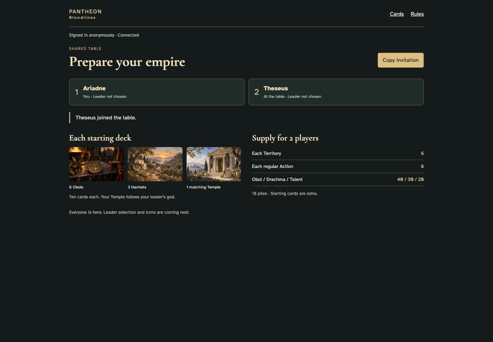

# Anonymous sign-in and shared game setup

## Sign in without an account

- [x] Anonymous authentication is ready before creating a table.
- [x] A name is required.

## Create a two-player table

- [x] The creator occupies one seat with another available.
- [x] The initial supply and ten-card starting deck are explained.

## See another player arrive

- [x] The remote join appears without reloading.
- [x] Activity names the player and action.

## Restore the same table after reload

- [x] The anonymous identity retains its seat without appending another join.
