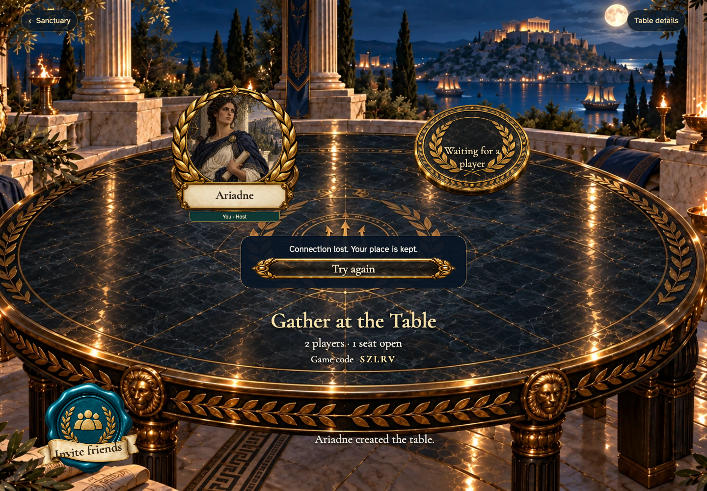
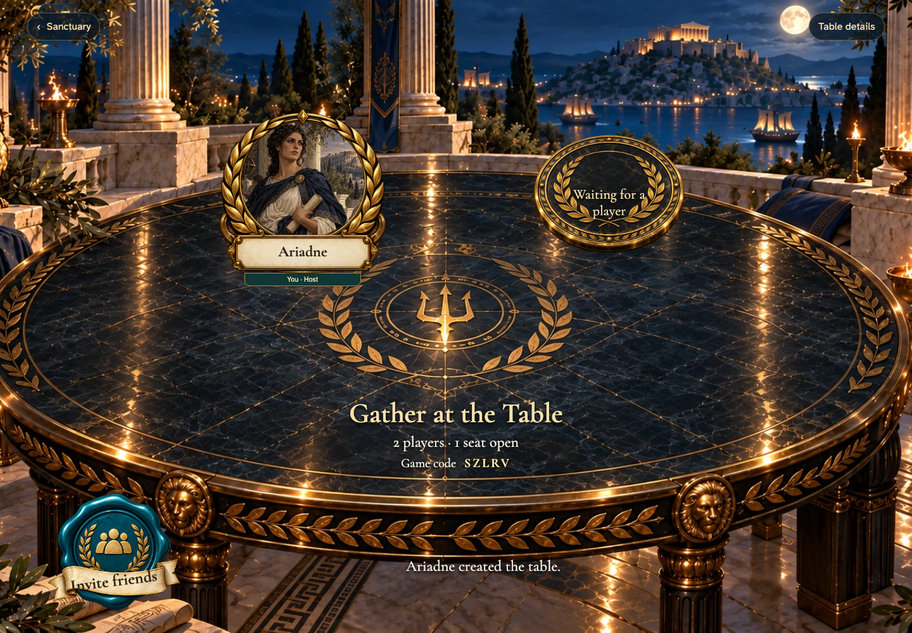

# a gathering retains its seats across an interruption

## Keep your seat while the connection returns

[phone](../../screenshots/a-gathering-retains-its-seats-across-an-interruption/000-interrupted-phone-darwin.png) · [desktop](../../screenshots/a-gathering-retains-its-seats-across-an-interruption/000-interrupted-desktop-darwin.png) · [tabletop-4k](../../screenshots/a-gathering-retains-its-seats-across-an-interruption/000-interrupted-tabletop-4k-darwin.png)

- [x] The table stays recognizable and a real retry is available.

## Ariadne returns to her gathering

[phone](../../screenshots/a-gathering-retains-its-seats-across-an-interruption/001-connection-restored-phone-darwin.png) · [desktop](../../screenshots/a-gathering-retains-its-seats-across-an-interruption/001-connection-restored-desktop-darwin.png) · [tabletop-4k](../../screenshots/a-gathering-retains-its-seats-across-an-interruption/001-connection-restored-tabletop-4k-darwin.png)

- [x] Recovery preserves her one seat.
