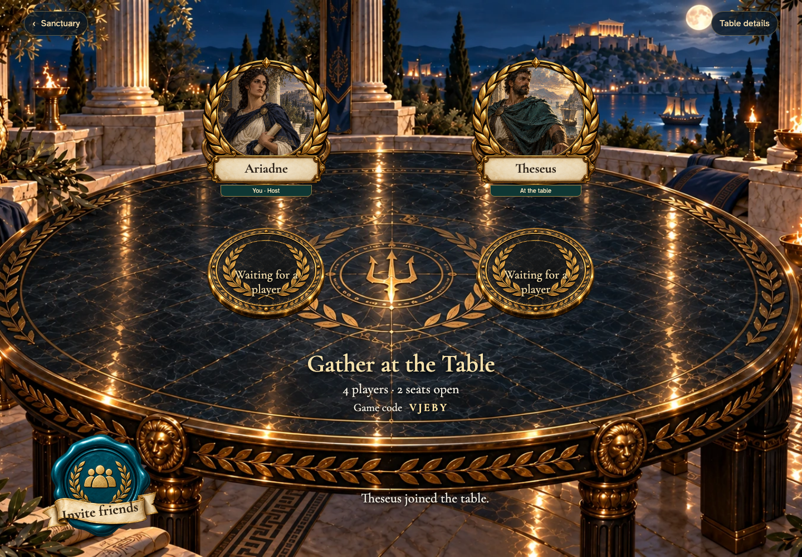
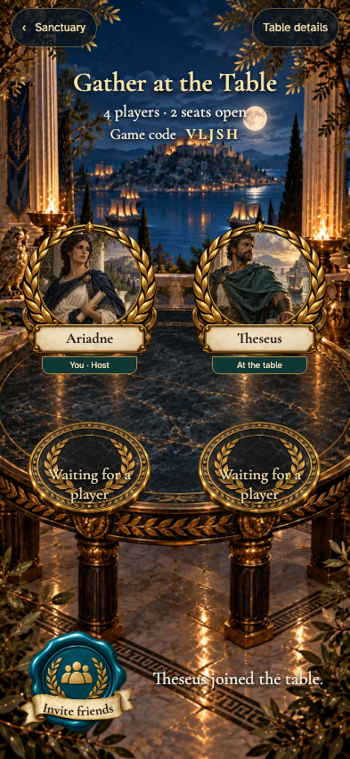
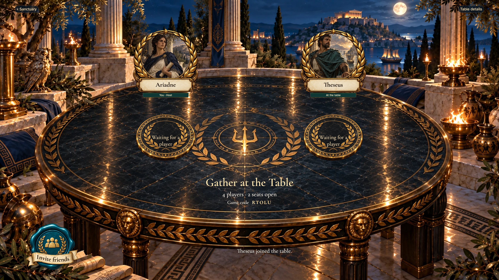
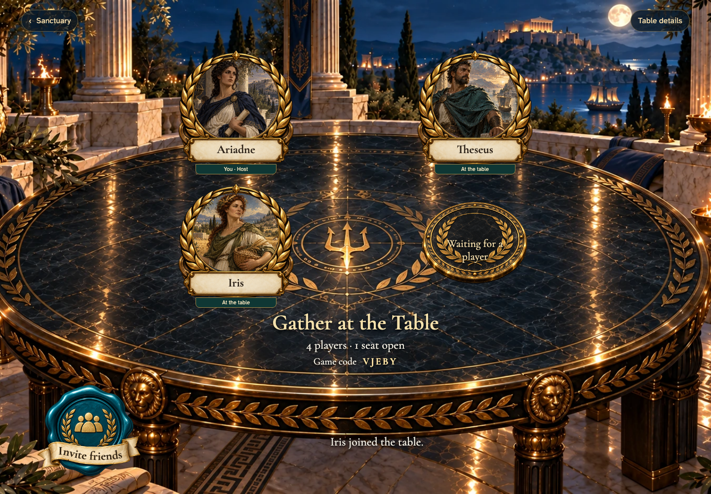
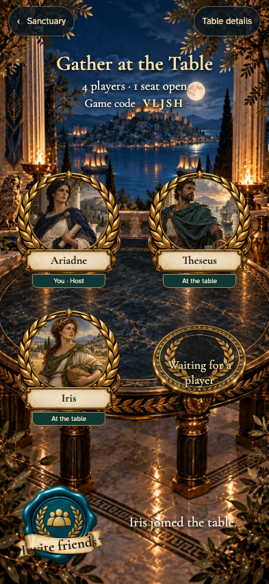
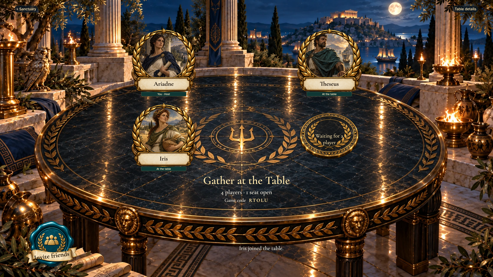
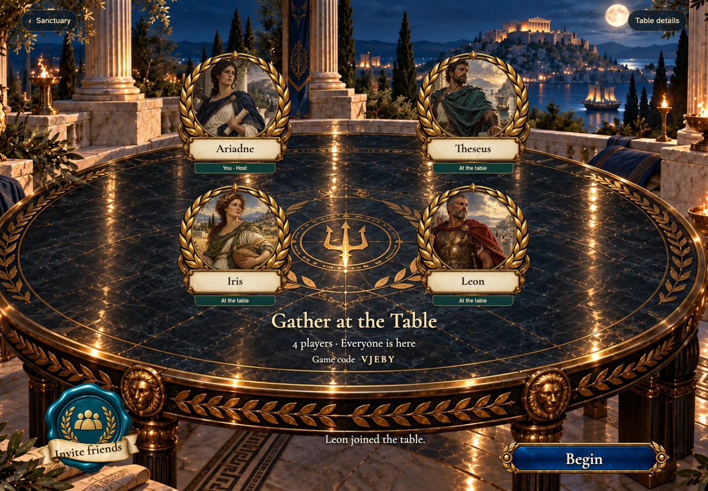
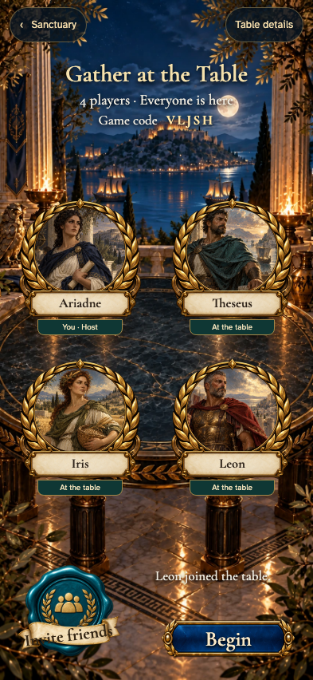
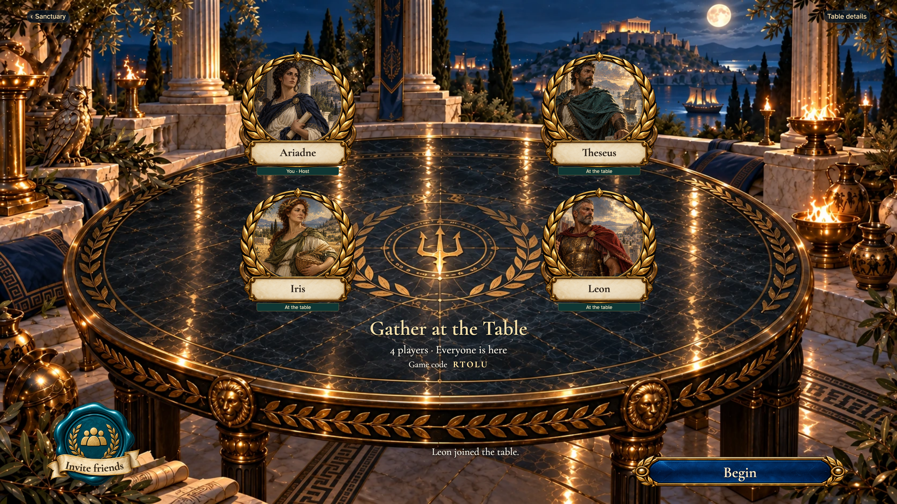

# four seats fill through ordered remote arrivals and respect reduced motion

## Theseus arrives at the table

Viewpoint: **Ariadne**.

<table>
<tr><th>Desktop · 1440 × 1000</th><th>Phone · 393 × 852</th></tr>
<tr>
<td valign="top"></td>
<td valign="top"></td>
</tr>
</table>

Tabletop · 3840 × 2160 — expand screenshot

- [x] The new seat and named arrival are visible.

## Iris arrives at the table

Viewpoint: **Ariadne**.

<table>
<tr><th>Desktop · 1440 × 1000</th><th>Phone · 393 × 852</th></tr>
<tr>
<td valign="top"></td>
<td valign="top"></td>
</tr>
</table>

Tabletop · 3840 × 2160 — expand screenshot

- [x] The new seat and named arrival are visible.

## Leon arrives at the table

Viewpoint: **Ariadne**.

<table>
<tr><th>Desktop · 1440 × 1000</th><th>Phone · 393 × 852</th></tr>
<tr>
<td valign="top"></td>
<td valign="top"></td>
</tr>
</table>

Tabletop · 3840 × 2160 — expand screenshot

- [x] The new seat and named arrival are visible.

## Gather all four players

<table>
<tr><th>Desktop · 1440 × 1000</th><th>Phone · 393 × 852</th></tr>
<tr>
<td valign="top"></td>
<td valign="top"></td>
</tr>
</table>

Tabletop · 3840 × 2160 — expand screenshot

- [x] Every player has a named medallion, and all seats are filled.
