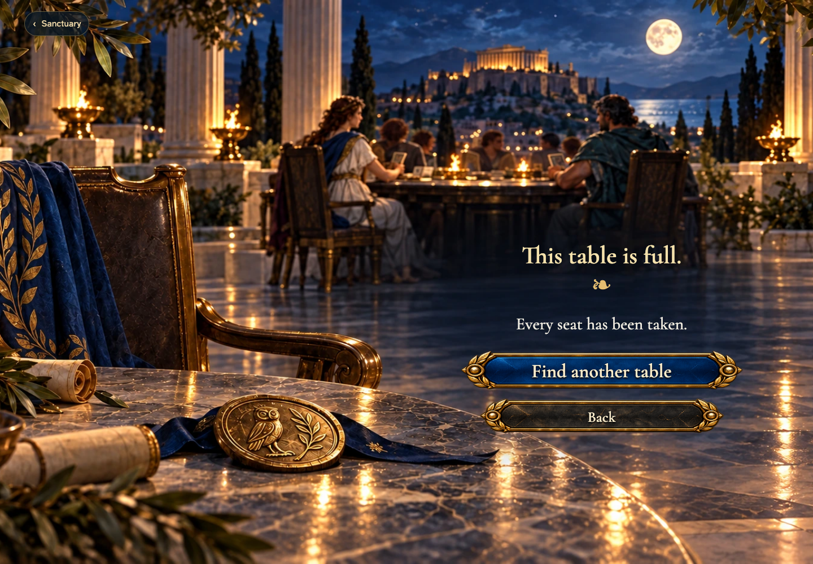
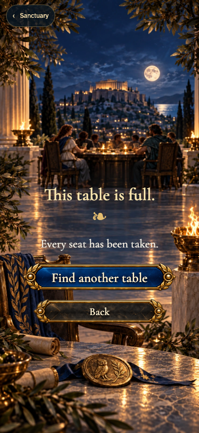
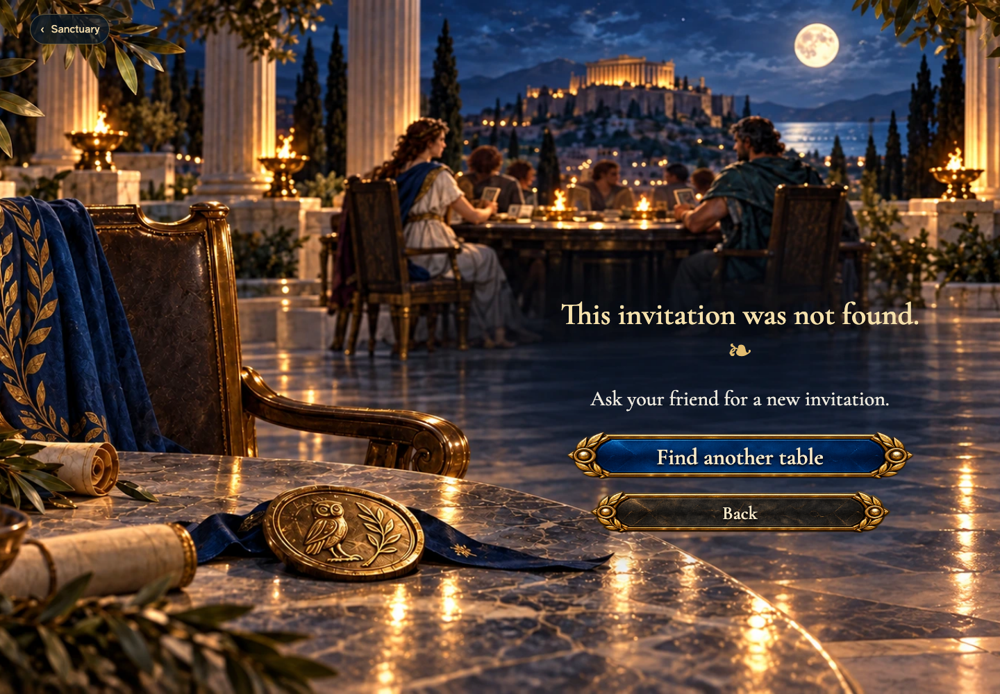
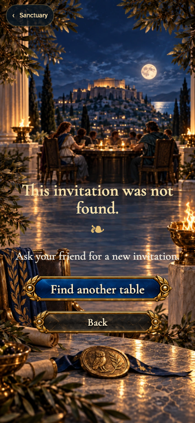

# full and missing invitations offer working recovery paths

## Find a new gathering when every seat is taken

<table>
<tr><th>Desktop · 1440 × 1000</th><th>Phone · 393 × 852</th></tr>
<tr>
<td valign="top"></td>
<td valign="top"></td>
</tr>
</table>

Tabletop · 3840 × 2160 — expand screenshot

- [x] The full invitation is explained without exposing service details.

## Recover from a missing invitation

<table>
<tr><th>Desktop · 1440 × 1000</th><th>Phone · 393 × 852</th></tr>
<tr>
<td valign="top"></td>
<td valign="top"></td>
</tr>
</table>

Tabletop · 3840 × 2160 — expand screenshot

- [x] The player can request a new invitation or return to the sanctuary.
