# gather two players, share an invitation and return to the same seats

## Choose your gathering

<table>
<tr><th>Desktop · 1440 × 1000</th><th>Phone · 393 × 852</th></tr>
<tr>
<td valign="top"></td>
<td valign="top"><a href="../../screenshots/gather-two-players-share-an-invitation-and-return-to-the-same-seats/000-choose-gathering-phone-darwin.png">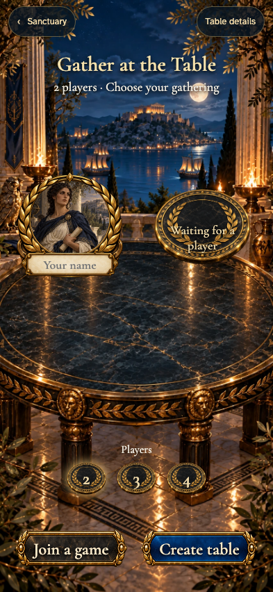</a></td>
</tr>
</table>

Tabletop · 3840 × 2160 — expand screenshot

- [x] Two seats are selected, and the name plate is ready.
- [x] The screen speaks to the player and shows no undealt cards.

## Ariadne is prompted to choose a name

<table>
<tr><th>Desktop · 1440 × 1000</th><th>Phone · 393 × 852</th></tr>
<tr>
<td valign="top"></td>
<td valign="top"><a href="../../screenshots/gather-two-players-share-an-invitation-and-return-to-the-same-seats/001-name-required-phone-darwin.png">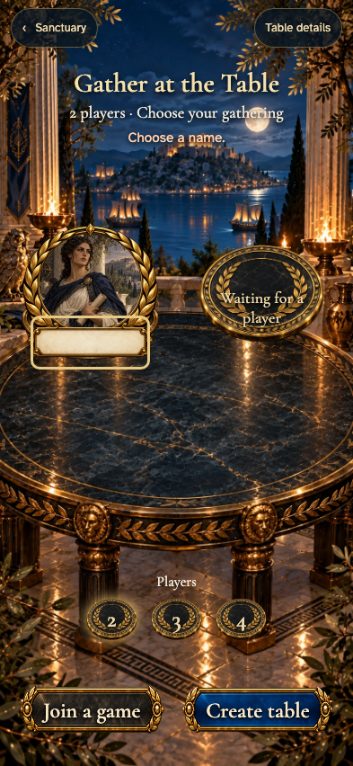</a></td>
</tr>
</table>

Tabletop · 3840 × 2160 — expand screenshot

<a href="../../screenshots/gather-two-players-share-an-invitation-and-return-to-the-same-seats/001-name-required-tabletop-4k-darwin.png">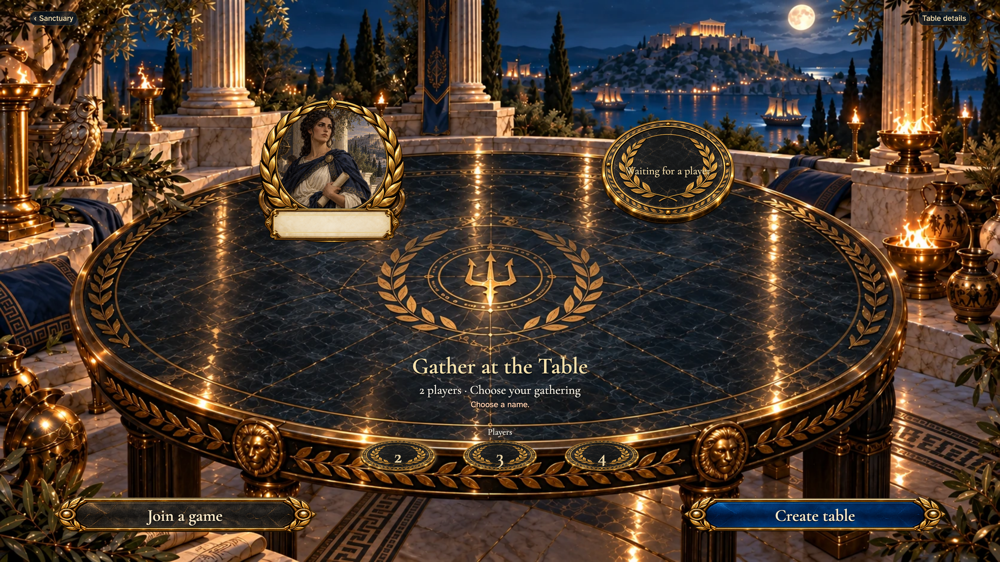</a>

- [x] The empty name keeps her at the gathering.

## Take your seat at a two-player table

<table>
<tr><th>Desktop · 1440 × 1000</th><th>Phone · 393 × 852</th></tr>
<tr>
<td valign="top"></td>
<td valign="top"><a href="../../screenshots/gather-two-players-share-an-invitation-and-return-to-the-same-seats/002-created-phone-darwin.png">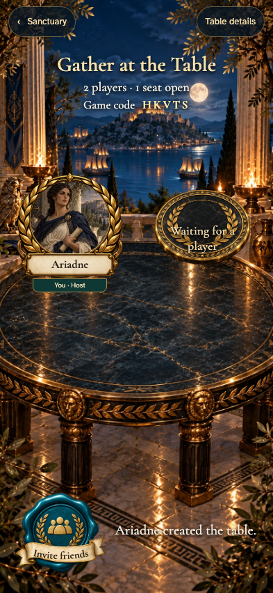</a></td>
</tr>
</table>

Tabletop · 3840 × 2160 — expand screenshot

<a href="../../screenshots/gather-two-players-share-an-invitation-and-return-to-the-same-seats/002-created-tabletop-4k-darwin.png">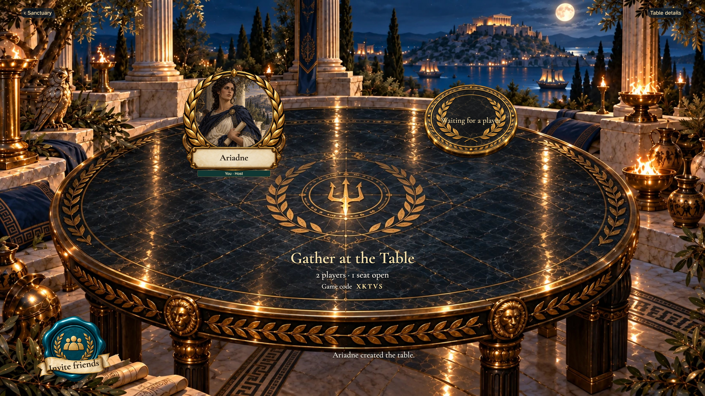</a>

- [x] The creator occupies the host seat and one seat remains.

## Inspect the gathering’s supply

<table>
<tr><th>Desktop · 1440 × 1000</th><th>Phone · 393 × 852</th></tr>
<tr>
<td valign="top"></td>
<td valign="top"><a href="../../screenshots/gather-two-players-share-an-invitation-and-return-to-the-same-seats/003-details-phone-darwin.png">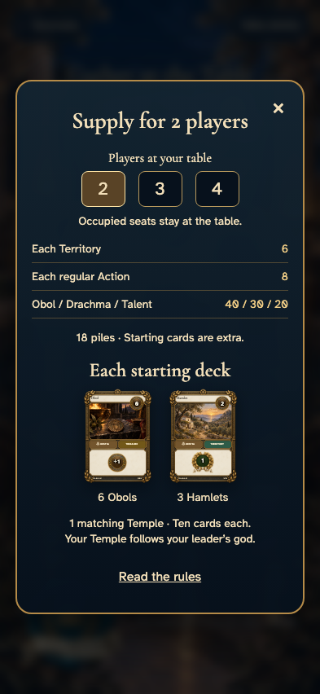</a></td>
</tr>
</table>

Tabletop · 3840 × 2160 — expand screenshot

<a href="../../screenshots/gather-two-players-share-an-invitation-and-return-to-the-same-seats/003-details-tabletop-4k-darwin.png">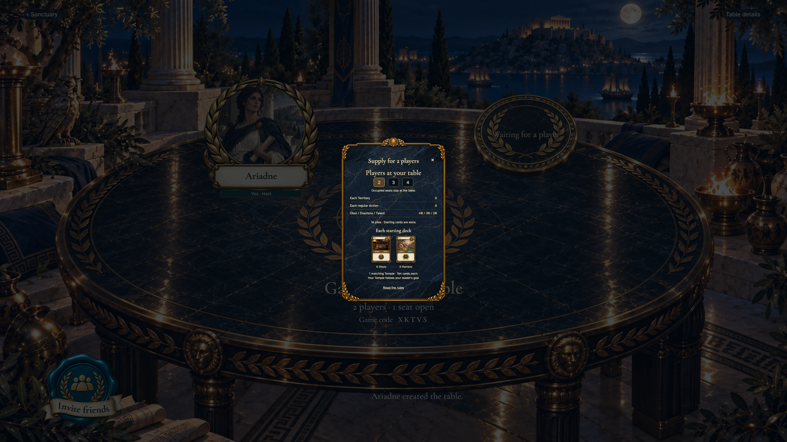</a>

- [x] Two-player supply and the ten-card starting inventory match the rules.

## Invite friends with the wax seal

<table>
<tr><th>Desktop · 1440 × 1000</th><th>Phone · 393 × 852</th></tr>
<tr>
<td valign="top"></td>
<td valign="top"><a href="../../screenshots/gather-two-players-share-an-invitation-and-return-to-the-same-seats/004-invitation-phone-darwin.png">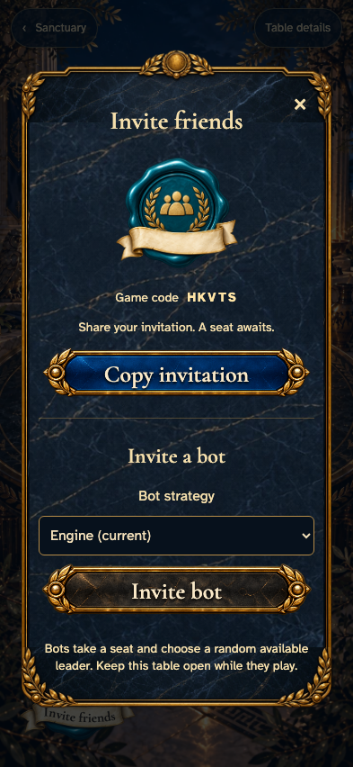</a></td>
</tr>
</table>

Tabletop · 3840 × 2160 — expand screenshot

<a href="../../screenshots/gather-two-players-share-an-invitation-and-return-to-the-same-seats/004-invitation-tabletop-4k-darwin.png">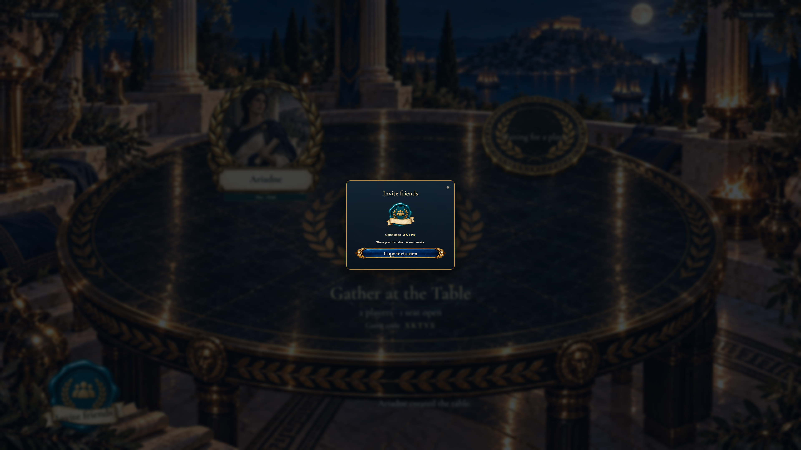</a>

- [x] The invitation opens a focused, dismissible sharing control.

## Ariadne has copied the invitation

<table>
<tr><th>Desktop · 1440 × 1000</th><th>Phone · 393 × 852</th></tr>
<tr>
<td valign="top"></td>
<td valign="top"><a href="../../screenshots/gather-two-players-share-an-invitation-and-return-to-the-same-seats/005-invitation-copied-phone-darwin.png">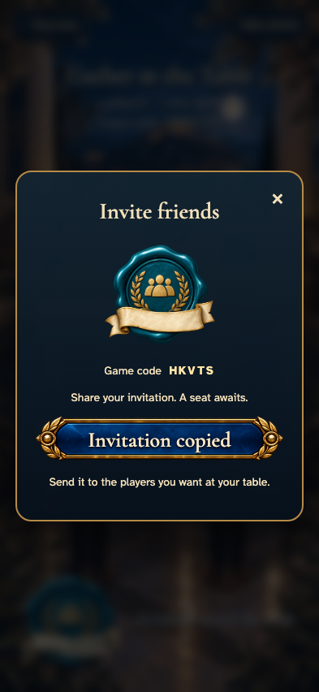</a></td>
</tr>
</table>

Tabletop · 3840 × 2160 — expand screenshot

- [x] Copying has a visible confirmation.

## Theseus opens the invitation before joining

Viewpoint: **Theseus**.

<table>
<tr><th>Desktop · 1440 × 1000</th><th>Phone · 393 × 852</th></tr>
<tr>
<td valign="top"></td>
<td valign="top"><a href="../../screenshots/gather-two-players-share-an-invitation-and-return-to-the-same-seats/006-guest-invitation-phone-darwin.png">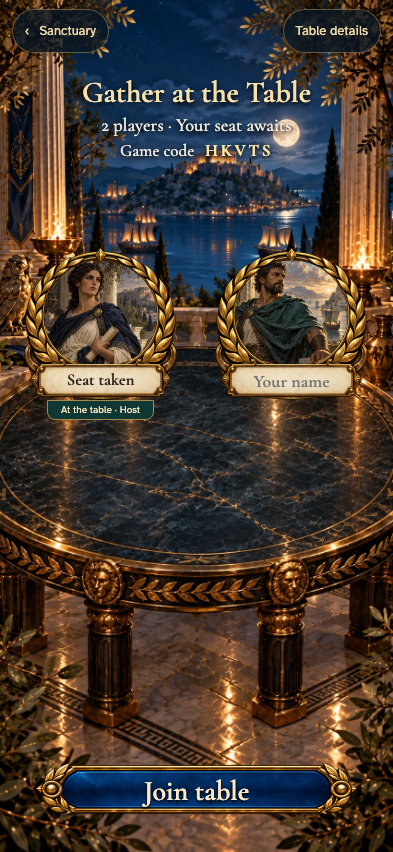</a></td>
</tr>
</table>

Tabletop · 3840 × 2160 — expand screenshot

<a href="../../screenshots/gather-two-players-share-an-invitation-and-return-to-the-same-seats/006-guest-invitation-tabletop-4k-darwin.png">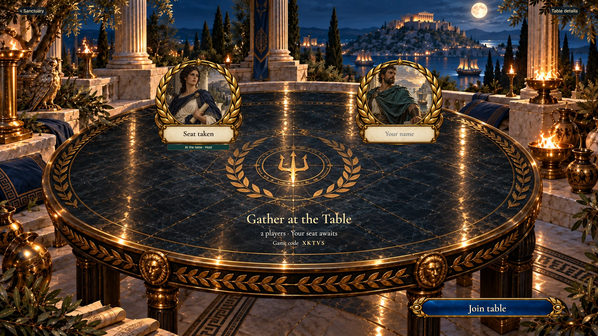</a>

- [x] The invitation offers a name and Join table.

## Theseus recognizes his own seat

Viewpoint: **Theseus**.

<table>
<tr><th>Desktop · 1440 × 1000</th><th>Phone · 393 × 852</th></tr>
<tr>
<td valign="top"></td>
<td valign="top"></td>
</tr>
</table>

Tabletop · 3840 × 2160 — expand screenshot

- [x] The guest sees both players and his own identity.

## Welcome another player to the table

<table>
<tr><th>Desktop · 1440 × 1000</th><th>Phone · 393 × 852</th></tr>
<tr>
<td valign="top"></td>
<td valign="top"><a href="../../screenshots/gather-two-players-share-an-invitation-and-return-to-the-same-seats/008-joined-phone-darwin.png">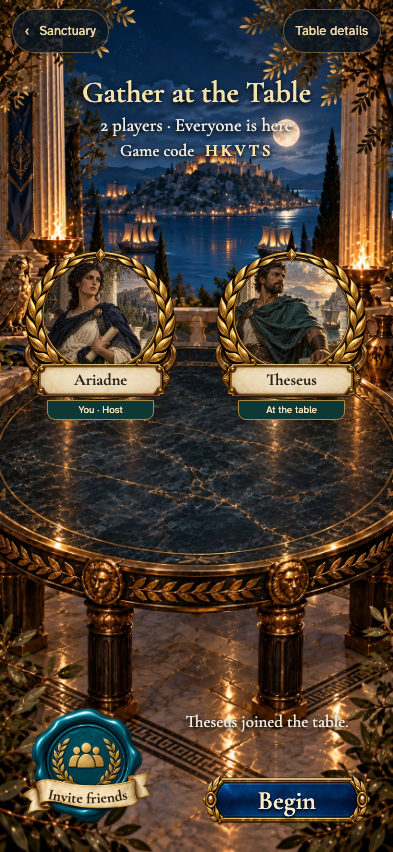</a></td>
</tr>
</table>

Tabletop · 3840 × 2160 — expand screenshot

- [x] The remote arrival fills the second seat and names the action once.

## Theseus returns to the same seat

Viewpoint: **Theseus**.

<table>
<tr><th>Desktop · 1440 × 1000</th><th>Phone · 393 × 852</th></tr>
<tr>
<td valign="top"></td>
<td valign="top"><a href="../../screenshots/gather-two-players-share-an-invitation-and-return-to-the-same-seats/009-guest-restored-phone-darwin.png">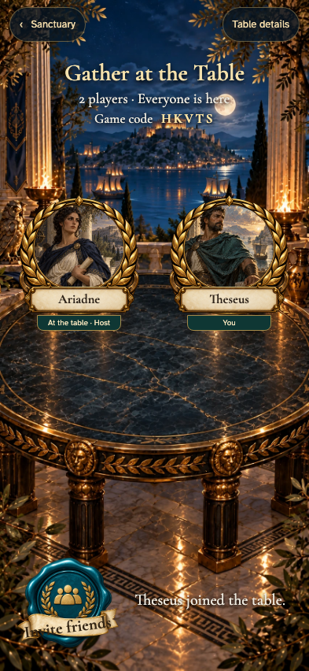</a></td>
</tr>
</table>

Tabletop · 3840 × 2160 — expand screenshot

<a href="../../screenshots/gather-two-players-share-an-invitation-and-return-to-the-same-seats/009-guest-restored-tabletop-4k-darwin.png">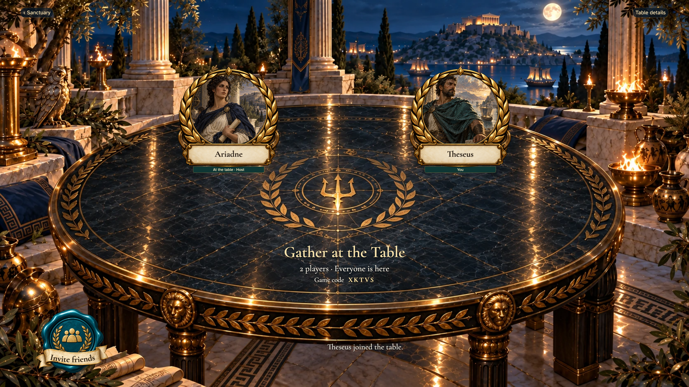</a>

- [x] Returning restores membership without joining again.
