# join by a displayed game code and let only the owner adjust occupied capacity

## Find your friends from Play

<table>
<tr><th>Desktop · 1440 × 1000</th><th>Phone · 393 × 852</th></tr>
<tr>
<td valign="top"><a href="../../screenshots/join-by-a-displayed-game-code-and-let-only-the-owner-adjust-occupied-capacity/000-enter-code-desktop-darwin.png">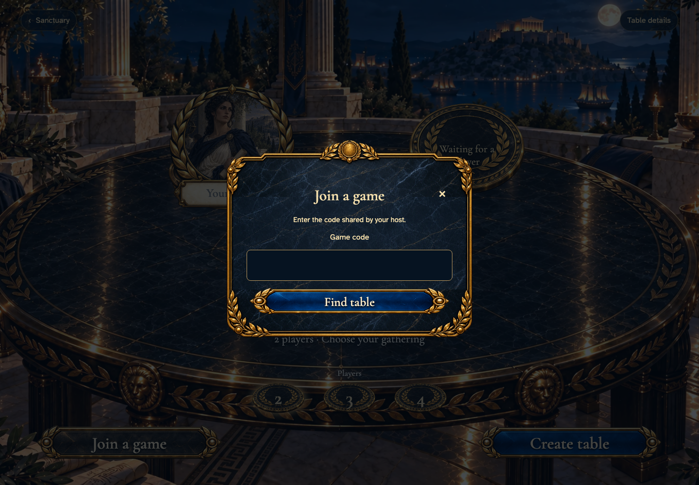</a></td>
<td valign="top"></td>
</tr>
</table>

Tabletop · 3840 × 2160 — expand screenshot

<a href="../../screenshots/join-by-a-displayed-game-code-and-let-only-the-owner-adjust-occupied-capacity/000-enter-code-tabletop-4k-darwin.png">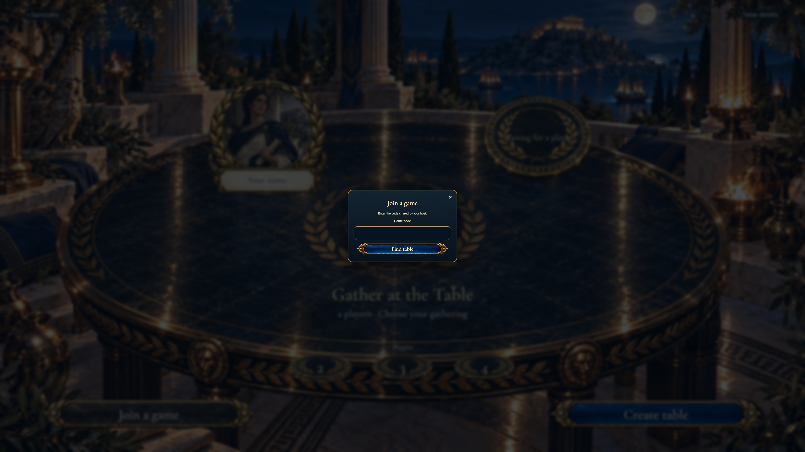</a>

- [x] Joining is offered without creating a table first.

## Theseus sees how to correct the game code

Viewpoint: **Theseus**.

<table>
<tr><th>Desktop · 1440 × 1000</th><th>Phone · 393 × 852</th></tr>
<tr>
<td valign="top"></td>
<td valign="top"><a href="../../screenshots/join-by-a-displayed-game-code-and-let-only-the-owner-adjust-occupied-capacity/001-invalid-code-phone-darwin.png">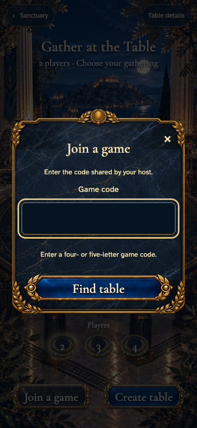</a></td>
</tr>
</table>

Tabletop · 3840 × 2160 — expand screenshot

<a href="../../screenshots/join-by-a-displayed-game-code-and-let-only-the-owner-adjust-occupied-capacity/001-invalid-code-tabletop-4k-darwin.png">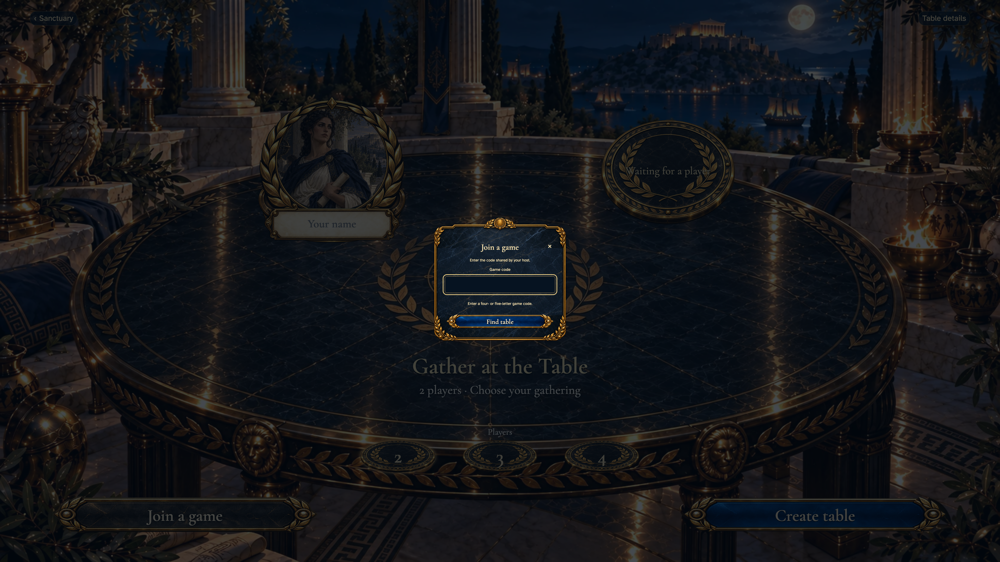</a>

- [x] The dialog explains the required code.

## Theseus finds the named gathering

Viewpoint: **Theseus**.

<table>
<tr><th>Desktop · 1440 × 1000</th><th>Phone · 393 × 852</th></tr>
<tr>
<td valign="top"><a href="../../screenshots/join-by-a-displayed-game-code-and-let-only-the-owner-adjust-occupied-capacity/002-found-table-desktop-darwin.png">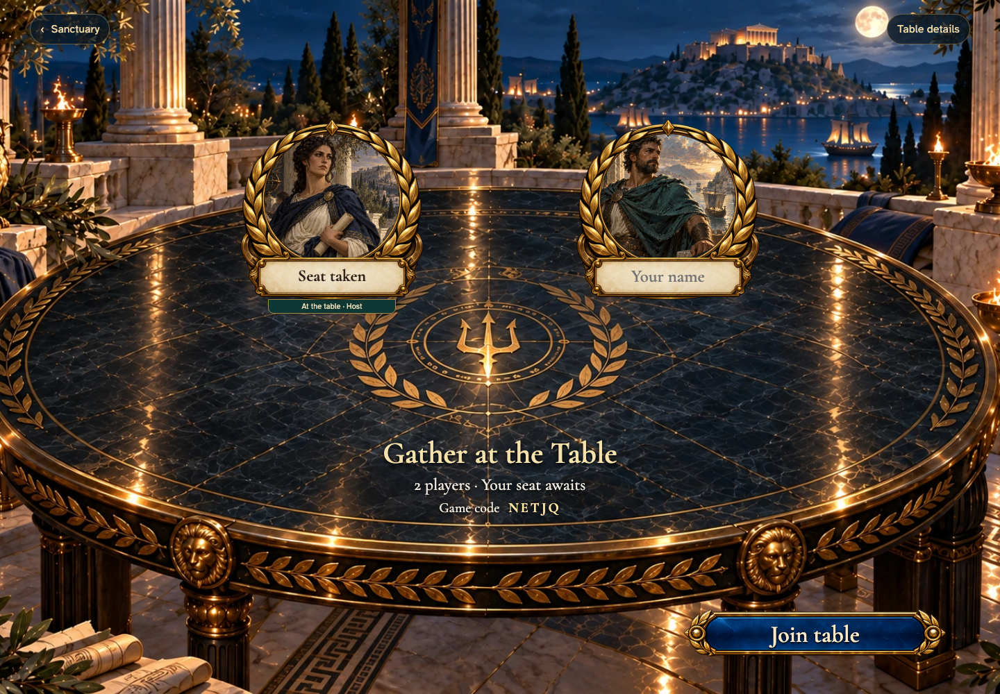</a></td>
<td valign="top"><a href="../../screenshots/join-by-a-displayed-game-code-and-let-only-the-owner-adjust-occupied-capacity/002-found-table-phone-darwin.png">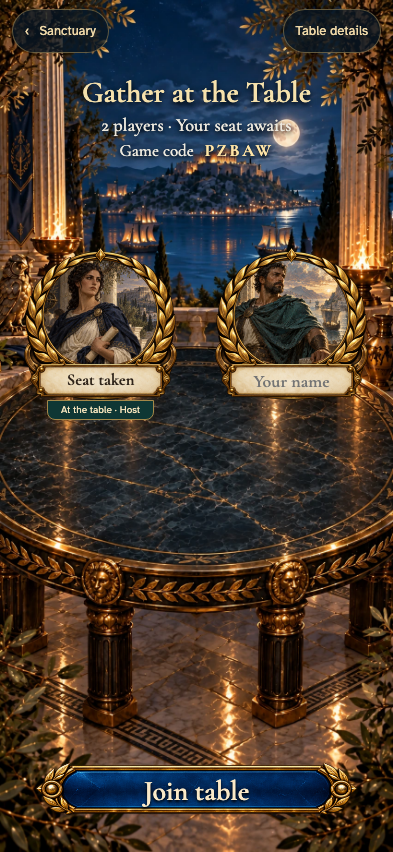</a></td>
</tr>
</table>

Tabletop · 3840 × 2160 — expand screenshot

<a href="../../screenshots/join-by-a-displayed-game-code-and-let-only-the-owner-adjust-occupied-capacity/002-found-table-tabletop-4k-darwin.png">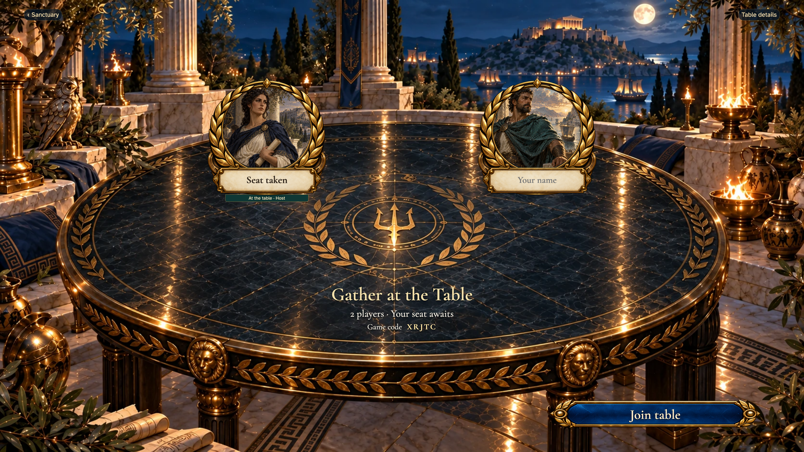</a>

- [x] The displayed code matches the host’s invitation.

## Guests can read the supply but cannot change capacity

Viewpoint: **Theseus**.

<table>
<tr><th>Desktop · 1440 × 1000</th><th>Phone · 393 × 852</th></tr>
<tr>
<td valign="top"><a href="../../screenshots/join-by-a-displayed-game-code-and-let-only-the-owner-adjust-occupied-capacity/003-guest-details-desktop-darwin.png">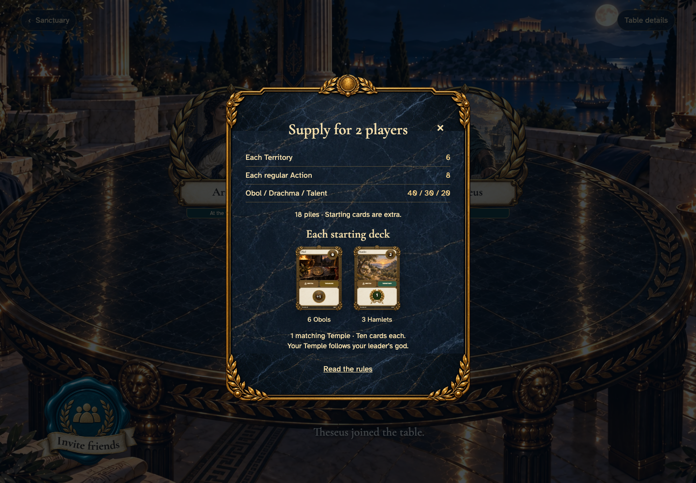</a></td>
<td valign="top"><a href="../../screenshots/join-by-a-displayed-game-code-and-let-only-the-owner-adjust-occupied-capacity/003-guest-details-phone-darwin.png">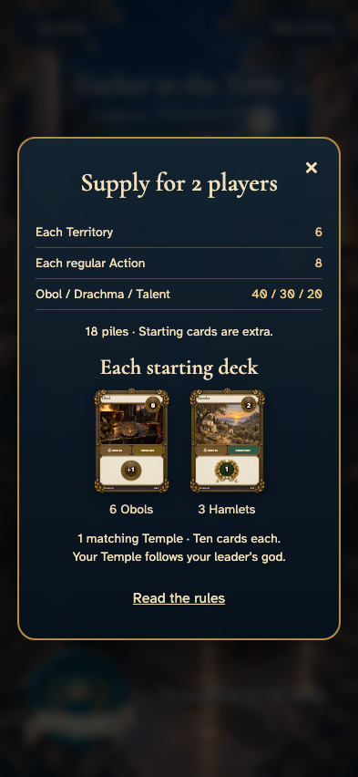</a></td>
</tr>
</table>

Tabletop · 3840 × 2160 — expand screenshot

<a href="../../screenshots/join-by-a-displayed-game-code-and-let-only-the-owner-adjust-occupied-capacity/003-guest-details-tabletop-4k-darwin.png">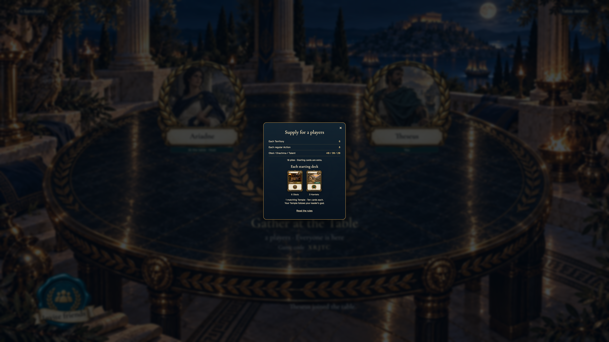</a>

- [x] The guest details contain no capacity controls.

## Open more seats at the table

<table>
<tr><th>Desktop · 1440 × 1000</th><th>Phone · 393 × 852</th></tr>
<tr>
<td valign="top"><a href="../../screenshots/join-by-a-displayed-game-code-and-let-only-the-owner-adjust-occupied-capacity/004-host-capacity-desktop-darwin.png">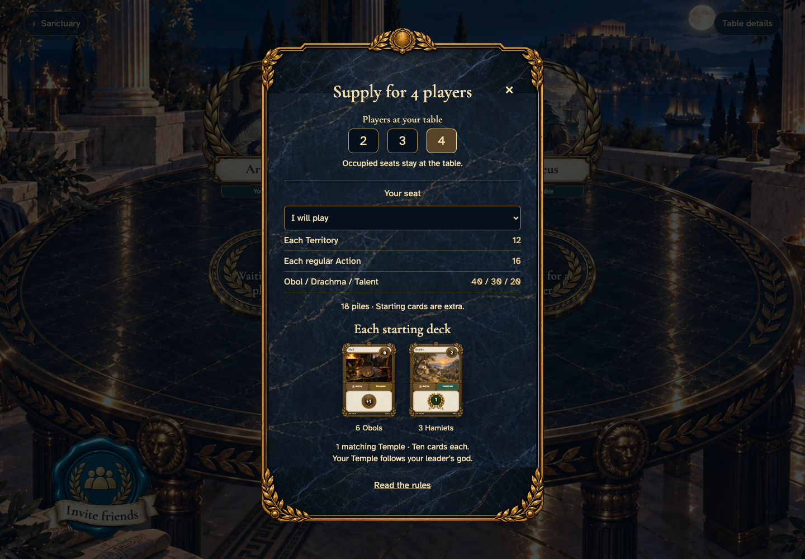</a></td>
<td valign="top"><a href="../../screenshots/join-by-a-displayed-game-code-and-let-only-the-owner-adjust-occupied-capacity/004-host-capacity-phone-darwin.png">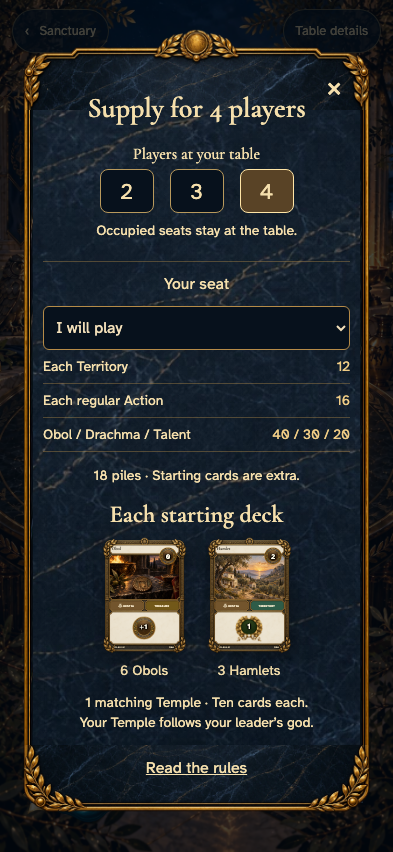</a></td>
</tr>
</table>

Tabletop · 3840 × 2160 — expand screenshot

<a href="../../screenshots/join-by-a-displayed-game-code-and-let-only-the-owner-adjust-occupied-capacity/004-host-capacity-tabletop-4k-darwin.png">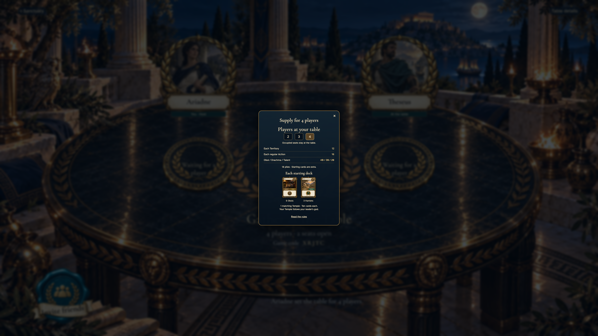</a>

- [x] The owner changes the supply and seats for everyone.

## Theseus sees the two new open seats

Viewpoint: **Theseus**.

<table>
<tr><th>Desktop · 1440 × 1000</th><th>Phone · 393 × 852</th></tr>
<tr>
<td valign="top"><a href="../../screenshots/join-by-a-displayed-game-code-and-let-only-the-owner-adjust-occupied-capacity/005-remote-capacity-desktop-darwin.png">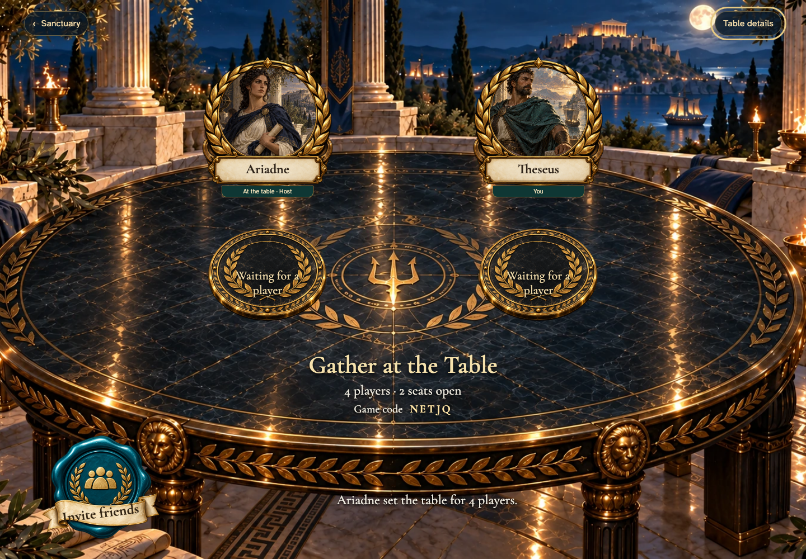</a></td>
<td valign="top"><a href="../../screenshots/join-by-a-displayed-game-code-and-let-only-the-owner-adjust-occupied-capacity/005-remote-capacity-phone-darwin.png">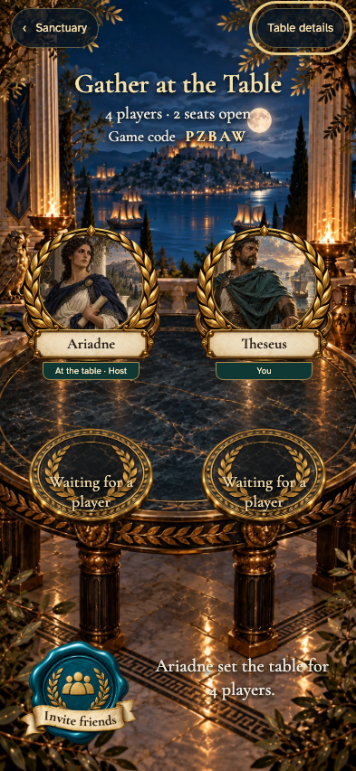</a></td>
</tr>
</table>

Tabletop · 3840 × 2160 — expand screenshot

<a href="../../screenshots/join-by-a-displayed-game-code-and-let-only-the-owner-adjust-occupied-capacity/005-remote-capacity-tabletop-4k-darwin.png">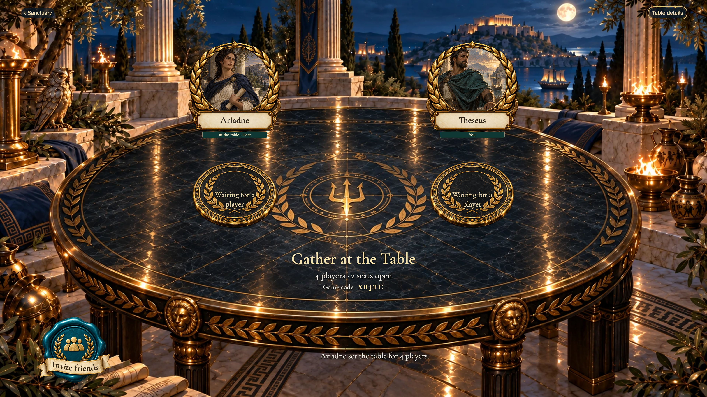</a>

- [x] The owner’s change reaches the other player.
