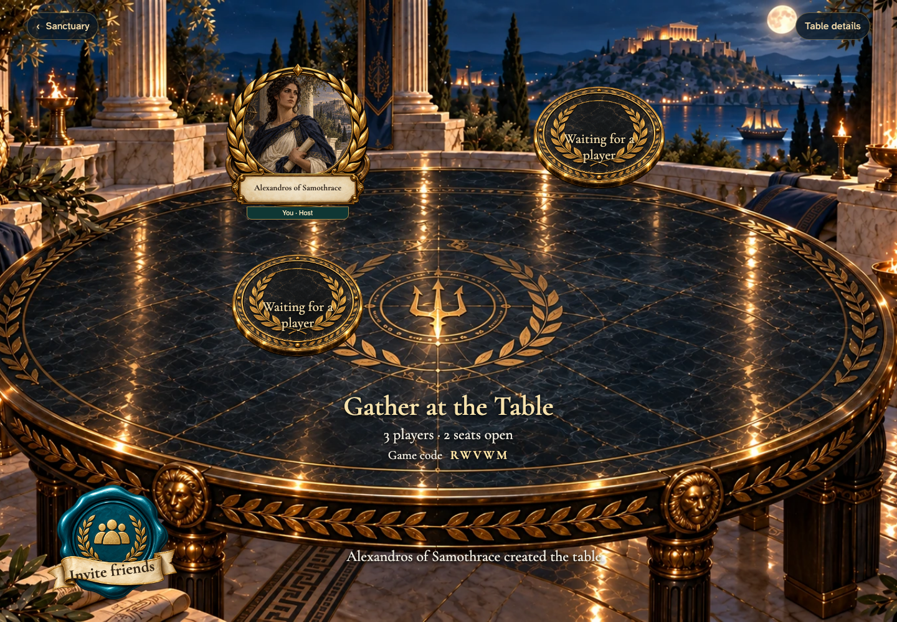
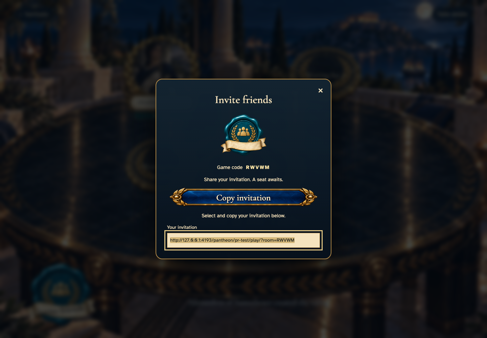

# three-player gathering provides a selectable invitation when copying is unavailable

## Keep a long player name inside its nameplate

[phone](../../screenshots/three-player-gathering-provides-a-selectable-invitation-when-copying-is-unavailable/000-three-player-phone-darwin.png) · [desktop](../../screenshots/three-player-gathering-provides-a-selectable-invitation-when-copying-is-unavailable/000-three-player-desktop-darwin.png) · [tabletop-4k](../../screenshots/three-player-gathering-provides-a-selectable-invitation-when-copying-is-unavailable/000-three-player-tabletop-4k-darwin.png)

- [x] The complete name fits the plate without clipping or truncation.

## Select the invitation when copying is unavailable

[phone](../../screenshots/three-player-gathering-provides-a-selectable-invitation-when-copying-is-unavailable/001-selectable-invitation-phone-darwin.png) · [desktop](../../screenshots/three-player-gathering-provides-a-selectable-invitation-when-copying-is-unavailable/001-selectable-invitation-desktop-darwin.png) · [tabletop-4k](../../screenshots/three-player-gathering-provides-a-selectable-invitation-when-copying-is-unavailable/001-selectable-invitation-tabletop-4k-darwin.png)

- [x] The full invitation remains selectable and focused.
