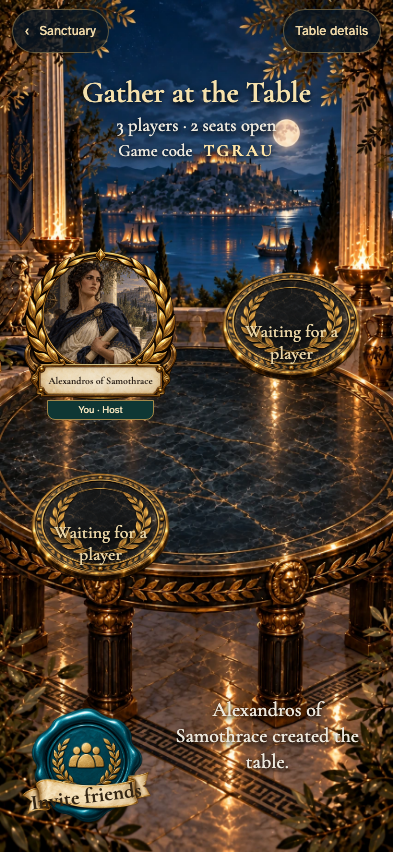
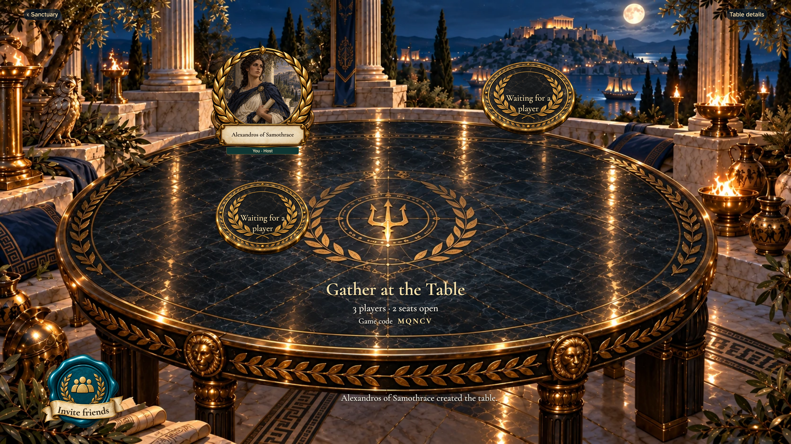
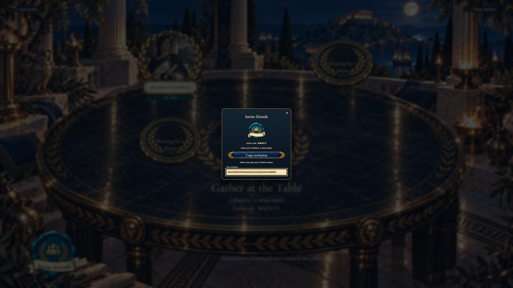

# three-player gathering provides a selectable invitation when copying is unavailable

## Keep a long player name inside its nameplate

<table>
<tr><th>Desktop · 1440 × 1000</th><th>Phone · 393 × 852</th></tr>
<tr>
<td valign="top"></td>
<td valign="top"></td>
</tr>
</table>

Tabletop · 3840 × 2160 — expand screenshot

- [x] The complete name fits the plate without clipping or truncation.

## Select the invitation when copying is unavailable

<table>
<tr><th>Desktop · 1440 × 1000</th><th>Phone · 393 × 852</th></tr>
<tr>
<td valign="top"></td>
<td valign="top"></td>
</tr>
</table>

Tabletop · 3840 × 2160 — expand screenshot

- [x] The full invitation remains selectable and focused.
