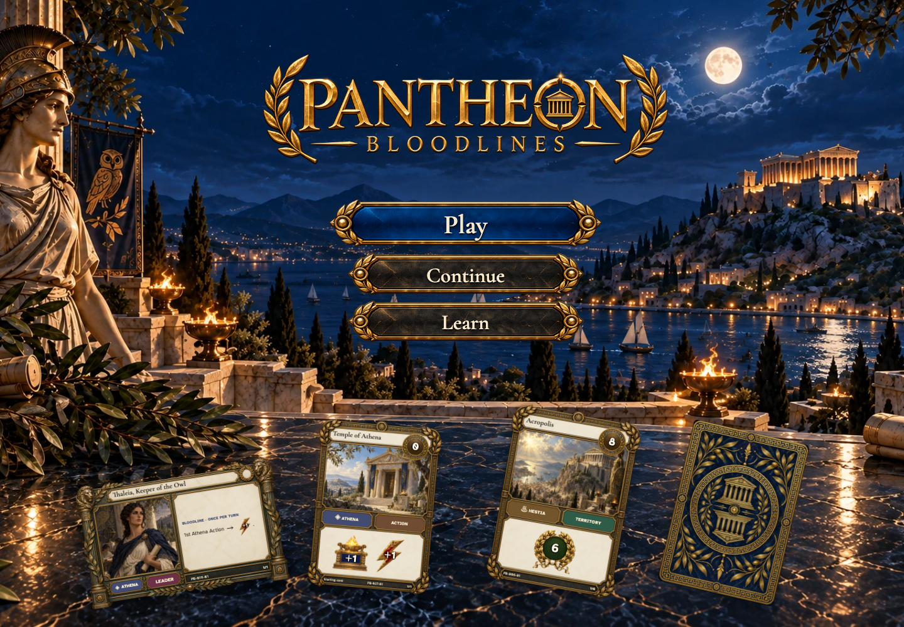
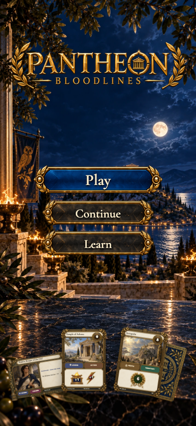

# Sanctuary fidelity review

Target: [accepted sanctuary painting](../../../docs/ux/concepts/01-sanctuary.png), screen 01 in [UX_DESIGN](../../../UX_DESIGN.md). This is implementation step 1; visual acceptance is pending PR review.

| View | Actual implementation with a waiting table |
| --- | --- |
| Phone, 393 × 852 | [Screenshot](screenshots/002-returning-phone-darwin.png) |
| Desktop, 1440 × 1000 | [Screenshot](screenshots/002-returning-desktop-darwin.png) |
| Tabletop, 3840 × 2160 | [Screenshot](screenshots/002-returning-tabletop-4k-darwin.png) |

The scene retains the painting's navy night, torchlight, distant Acropolis, gold wordmark, blue primary plaque, smaller charcoal secondary plaques and cards on the near marble table. Portrait uses its own environment composition. Controls are real links with live labels and visible keyboard focus. The arrival settles after 450 ms; reduced motion removes it.

Deliberate differences: the approved landscape leader includes its actual rules panel; the painting simplified that card. All three faces use the existing layered renderer and authoritative values. The deck back uses the approved catalog asset. The scene framing and wordmark details vary slightly from the painting because these are separate production assets. The cards stay within the viewport. A fresh visitor has no Continue button; a returning member sees all three controls.

The story verifies Learn and Play destinations, real creation and re-entry without a duplicate seat, verified membership, foreign/missing/invalid pointer rejection, offline retry, card layout, image loading, screen containment and disjoint controls. It captures fresh entry, keyboard focus, returning entry and unreachable-table states at all three sizes. Exact app baselines use zero pixel/color tolerance; the generated painting is the human fidelity target rather than a pixel baseline.

The existing gathering and rules destinations remain functional and have their own later design milestones. This PR does not claim that those screens have been redesigned or that full turns are playable.
