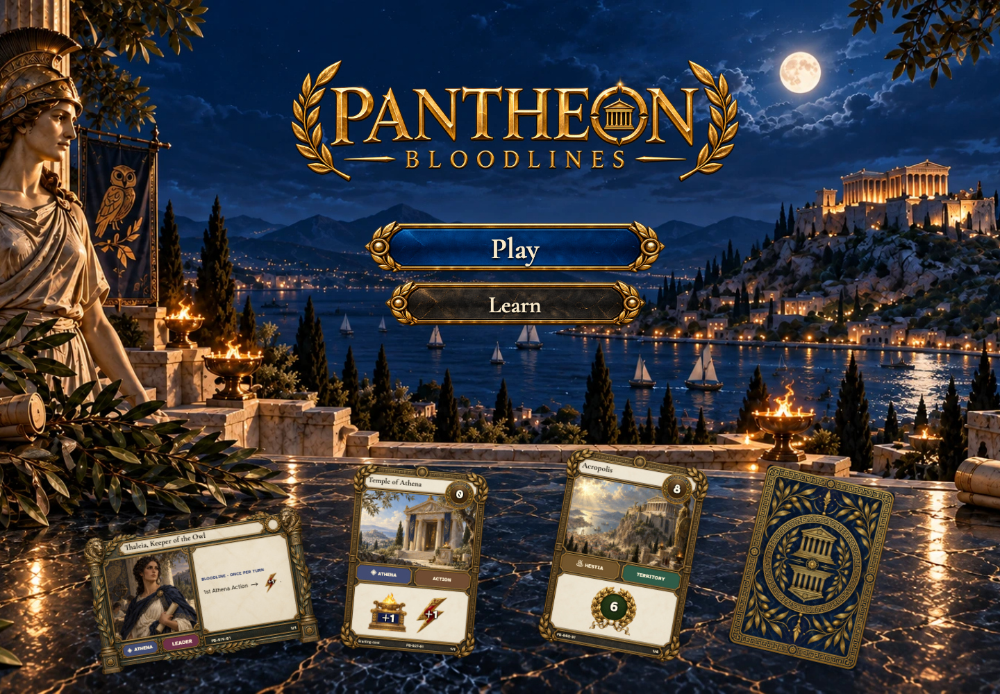
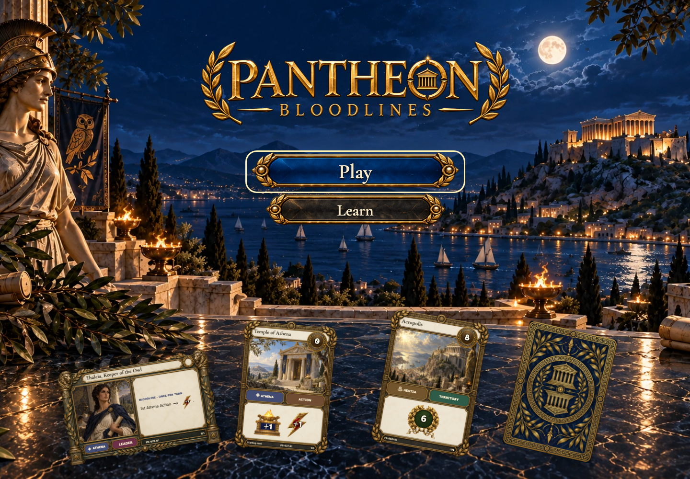

# Enter the sanctuary and return to your table

## Enter the moonlit sanctuary

- [x] Play and Learn are available; Continue requires an existing seat.
- [x] The approved cards retain live metadata, illustrations, frames and icons.

## Choose Play with the keyboard

- [x] The primary control has a visible keyboard focus indicator.

## Return to the sanctuary with a table waiting

- [x] Continue appears only after the server confirms membership.
- [x] Play, Continue and Learn retain their visual hierarchy.
