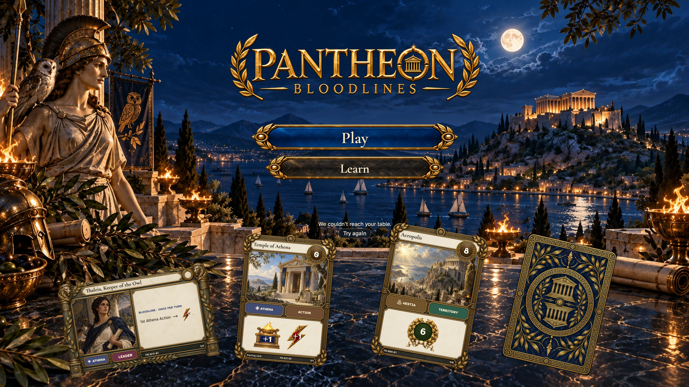
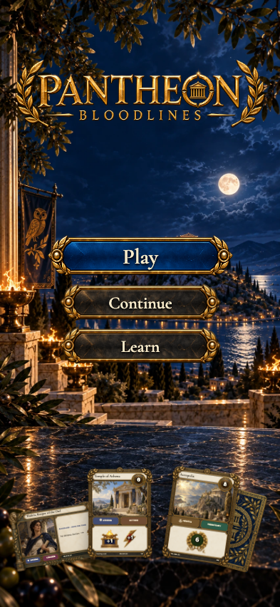

# a connection interruption retains the return target and offers a real retry

## Keep your place when the table cannot be reached

<table>
<tr><th>Desktop · 1440 × 1000</th><th>Phone · 393 × 852</th></tr>
<tr>
<td valign="top"></td>
<td valign="top"></td>
</tr>
</table>

Tabletop · 3840 × 2160 — expand screenshot

- [x] A friendly message offers a retry without inventing a new table.

## Ariadne can continue after reconnecting

<table>
<tr><th>Desktop · 1440 × 1000</th><th>Phone · 393 × 852</th></tr>
<tr>
<td valign="top"></td>
<td valign="top"></td>
</tr>
</table>

Tabletop · 3840 × 2160 — expand screenshot

- [x] Recovery restores Continue for the same table.
