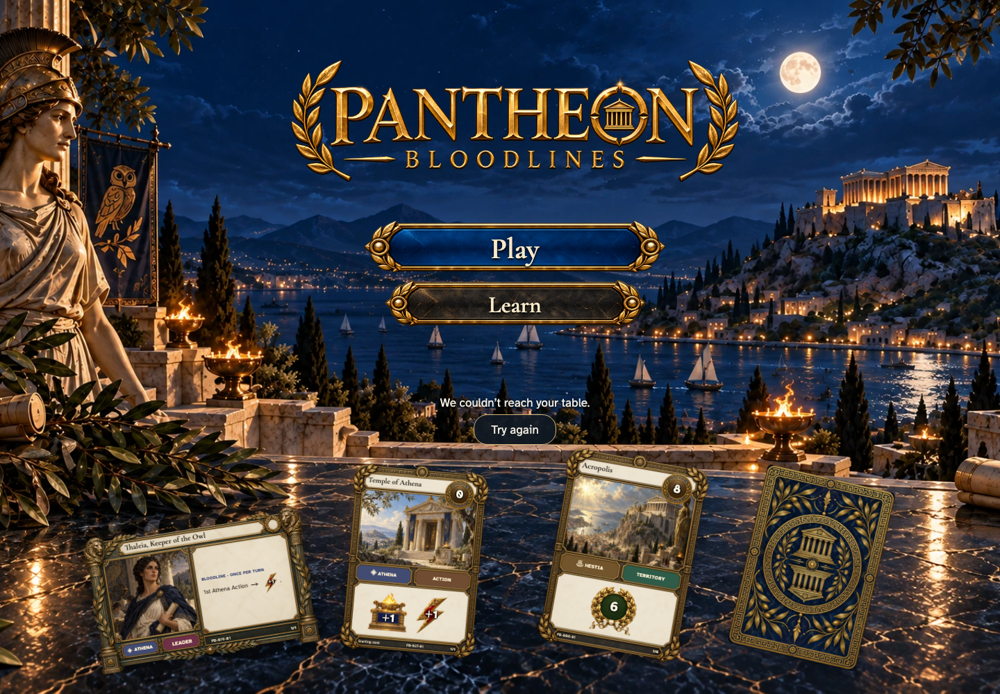
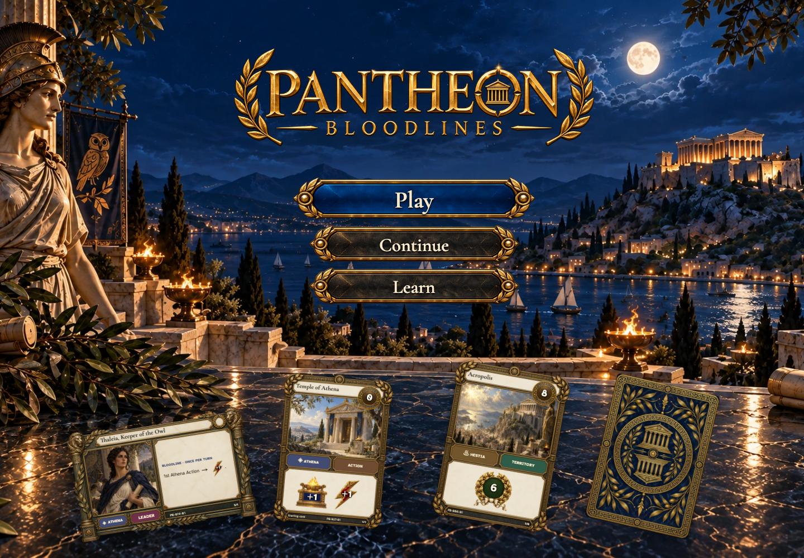

# a connection interruption retains the return target and offers a real retry

## Keep your place when the table cannot be reached

[phone](../../screenshots/a-connection-interruption-retains-the-return-target-and-offers-a-real-retry/000-unreachable-phone-darwin.png) · [desktop](../../screenshots/a-connection-interruption-retains-the-return-target-and-offers-a-real-retry/000-unreachable-desktop-darwin.png) · [tabletop-4k](../../screenshots/a-connection-interruption-retains-the-return-target-and-offers-a-real-retry/000-unreachable-tabletop-4k-darwin.png)

- [x] A friendly message offers a retry without inventing a new table.

## Ariadne can continue after reconnecting

[phone](../../screenshots/a-connection-interruption-retains-the-return-target-and-offers-a-real-retry/001-recovered-phone-darwin.png) · [desktop](../../screenshots/a-connection-interruption-retains-the-return-target-and-offers-a-real-retry/001-recovered-desktop-darwin.png) · [tabletop-4k](../../screenshots/a-connection-interruption-retains-the-return-target-and-offers-a-real-retry/001-recovered-tabletop-4k-darwin.png)

- [x] Recovery restores Continue for the same table.
