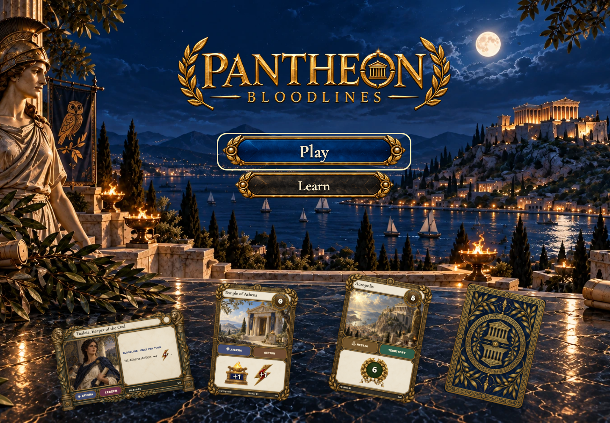
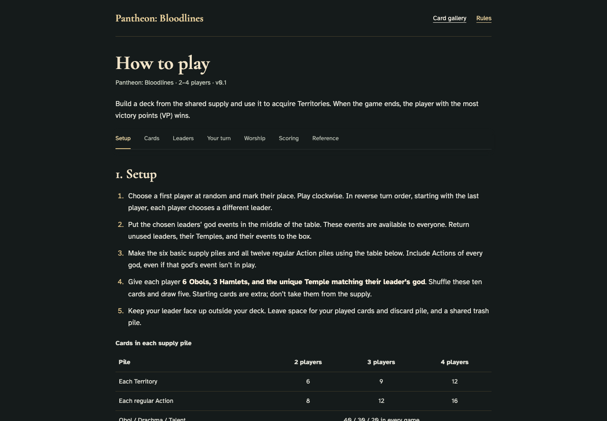
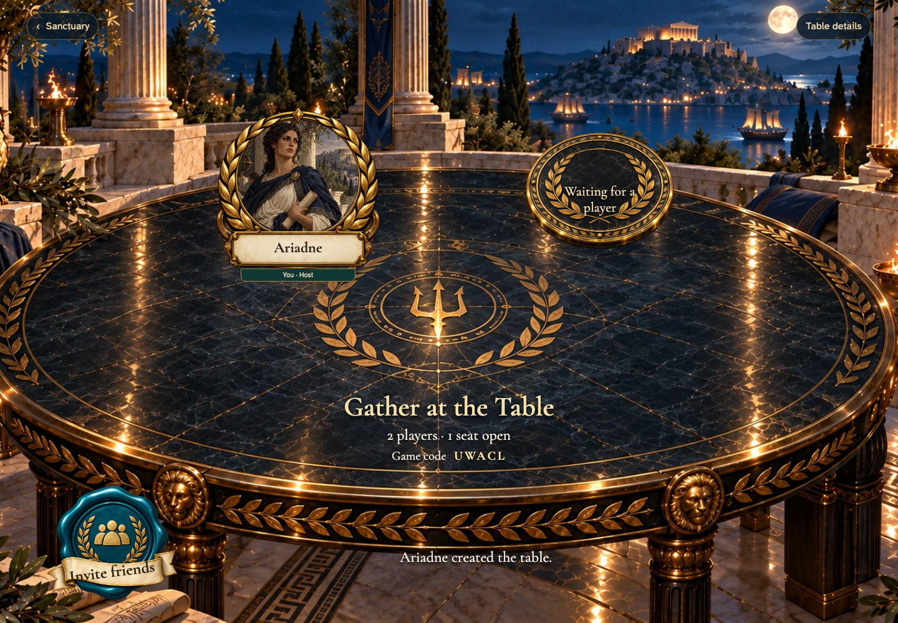

# enter the sanctuary, learn, create and continue a real table

## Enter the moonlit sanctuary

[phone](../../screenshots/enter-the-sanctuary-learn-create-and-continue-a-real-table/000-sanctuary-phone-darwin.png) · [desktop](../../screenshots/enter-the-sanctuary-learn-create-and-continue-a-real-table/000-sanctuary-desktop-darwin.png) · [tabletop-4k](../../screenshots/enter-the-sanctuary-learn-create-and-continue-a-real-table/000-sanctuary-tabletop-4k-darwin.png)

- [x] Play and Learn are available; Continue requires an existing seat.
- [x] The approved cards retain live metadata, illustrations, frames and icons.

## Choose Play with the keyboard

[phone](../../screenshots/enter-the-sanctuary-learn-create-and-continue-a-real-table/001-keyboard-phone-darwin.png) · [desktop](../../screenshots/enter-the-sanctuary-learn-create-and-continue-a-real-table/001-keyboard-desktop-darwin.png) · [tabletop-4k](../../screenshots/enter-the-sanctuary-learn-create-and-continue-a-real-table/001-keyboard-tabletop-4k-darwin.png)

- [x] The primary control has a visible keyboard focus indicator.

## Open the illustrated rules

Viewpoint: **Ariadne**.

[phone](../../screenshots/enter-the-sanctuary-learn-create-and-continue-a-real-table/002-learn-phone-darwin.png) · [desktop](../../screenshots/enter-the-sanctuary-learn-create-and-continue-a-real-table/002-learn-desktop-darwin.png) · [tabletop-4k](../../screenshots/enter-the-sanctuary-learn-create-and-continue-a-real-table/002-learn-tabletop-4k-darwin.png)

- [x] Learn opens the actual rules document.

## Return from reading to the sanctuary

[phone](../../screenshots/enter-the-sanctuary-learn-create-and-continue-a-real-table/003-back-to-sanctuary-phone-darwin.png) · [desktop](../../screenshots/enter-the-sanctuary-learn-create-and-continue-a-real-table/003-back-to-sanctuary-desktop-darwin.png) · [tabletop-4k](../../screenshots/enter-the-sanctuary-learn-create-and-continue-a-real-table/003-back-to-sanctuary-tabletop-4k-darwin.png)

- [x] Play remains available.

## Play opens the gathering choices

[phone](../../screenshots/enter-the-sanctuary-learn-create-and-continue-a-real-table/004-gathering-phone-darwin.png) · [desktop](../../screenshots/enter-the-sanctuary-learn-create-and-continue-a-real-table/004-gathering-desktop-darwin.png) · [tabletop-4k](../../screenshots/enter-the-sanctuary-learn-create-and-continue-a-real-table/004-gathering-tabletop-4k-darwin.png)

- [x] Create and join are both available.

## Ariadne takes her seat at a new table

[phone](../../screenshots/enter-the-sanctuary-learn-create-and-continue-a-real-table/005-created-phone-darwin.png) · [desktop](../../screenshots/enter-the-sanctuary-learn-create-and-continue-a-real-table/005-created-desktop-darwin.png) · [tabletop-4k](../../screenshots/enter-the-sanctuary-learn-create-and-continue-a-real-table/005-created-tabletop-4k-darwin.png)

- [x] The new table shows the named host.

## Return to the sanctuary with a table waiting

[phone](../../screenshots/enter-the-sanctuary-learn-create-and-continue-a-real-table/006-returning-phone-darwin.png) · [desktop](../../screenshots/enter-the-sanctuary-learn-create-and-continue-a-real-table/006-returning-desktop-darwin.png) · [tabletop-4k](../../screenshots/enter-the-sanctuary-learn-create-and-continue-a-real-table/006-returning-tabletop-4k-darwin.png)

- [x] Continue appears only after membership is confirmed.
- [x] Play, Continue and Learn retain their visual hierarchy.

## Continue restores Ariadne’s existing seat

[phone](../../screenshots/enter-the-sanctuary-learn-create-and-continue-a-real-table/007-continued-phone-darwin.png) · [desktop](../../screenshots/enter-the-sanctuary-learn-create-and-continue-a-real-table/007-continued-desktop-darwin.png) · [tabletop-4k](../../screenshots/enter-the-sanctuary-learn-create-and-continue-a-real-table/007-continued-tabletop-4k-darwin.png)

- [x] The same table has one seat, without another creation.
