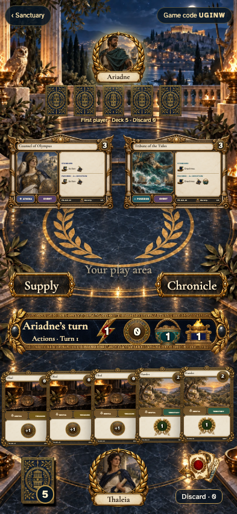

# Bloodline draft and first hand

Step 3 follows [Choose your bloodline](../../../docs/ux/concepts/03-bloodline.png), [desktop table](../../../docs/ux/concepts/04-table-desktop.png), and [portrait table](../../../docs/ux/concepts/04-table-mobile.png).

| View | Draft | First hand |
| --- | --- | --- |
| Phone | [Two-player choice](screenshots/000-draft-2-phone-darwin.png) | [Two players](screenshots/002-dealt-2-phone-darwin.png) · [Four players](screenshots/001-dealt-4-phone-darwin.png) |
| Desktop | [Two-player choice](screenshots/000-draft-2-desktop-darwin.png) | [Two players](screenshots/002-dealt-2-desktop-darwin.png) · [Four players](screenshots/001-dealt-4-desktop-darwin.png) |
| 4K | [Four-player choice](screenshots/000-draft-4-tabletop-4k-darwin.png) | [Four players](screenshots/001-dealt-4-tabletop-4k-darwin.png) |

The draft uses a large transparent hero, the actual landscape leader and event faces, linked Temple, sculpted portrait choices and visible draft order. Portrait mode keeps the same hierarchy, with order below the four choices. Confirming a leader sends the selected portrait toward its seat; other clients see its owner and cannot select it again. [The claimed/waiting state](screenshots/000-claimed-phone-darwin.png) is captured separately.

The dealt table retains the obsidian surface, laurel inlay, distant Acropolis, gold resource frame, landscape altars, near-hand placement and common card backs. Mobile exposes the full supply through an actual inspection overlay; desktop also lays out the six basics. The mobile hand visually overlaps, with separate non-overlapping tap targets and full-sized card inspection. Each player's view displays their own cards and other players' backs/counts. Source catalog faces, serial numbers and starting-copy identities remain intact.

The concept shows a later turn; this milestone ends at the opening hand. Supply starts at 40/30/20 Treasures and 6/9/12 Territories, independent of starting inventory. Resources start at one Action, zero Coins, one Buy and one Worship. The play area and discard are empty. No purchased Actions, played cards, or inactive Play/To Treasures controls are inserted to imitate incidental concept content. Those commands arrive in the next complete milestones.

The implementation uses trusted clients, a shared seed and complete client replay. Face concealment is a rendering rule, not a server secrecy guarantee. Every participant reconstructs identical decks and hands. The event stream contains the seed and choices, without storing redundant hands or shuffled-order payloads.

Stories cover 2/3/4 players, all four heroes and linked cards, reverse draft order, unique claims, waiting, long names, card and supply inspection, late visitor recovery, and interrupted connections. A lost Begin acknowledgement commits once. Backend scenarios cover simultaneous claims, out-of-turn and taken-leader rejection, locked seats after start, actor authentication, version rejection, stable PRNG vectors, exact inventories, unique copy IDs and replay equality from every participant.

Normal-motion checks observe one 450 ms claim transfer and five 550 ms deal flights. Reduced motion settles immediately; restoring an already dealt game creates no deal animation and no event. Zero-pixel/color screenshot comparisons have no masks or retries and cover phone, desktop and 4K on macOS and Linux. The shared helper also checks viewport containment and non-overlapping controls.

See [the illustrated primary story](README.md) and [all scenarios](bloodline.spec.ts). Generated production layers and exact prompts are documented in [the asset manifest](../../../docs/ux/bloodline-assets.json).
