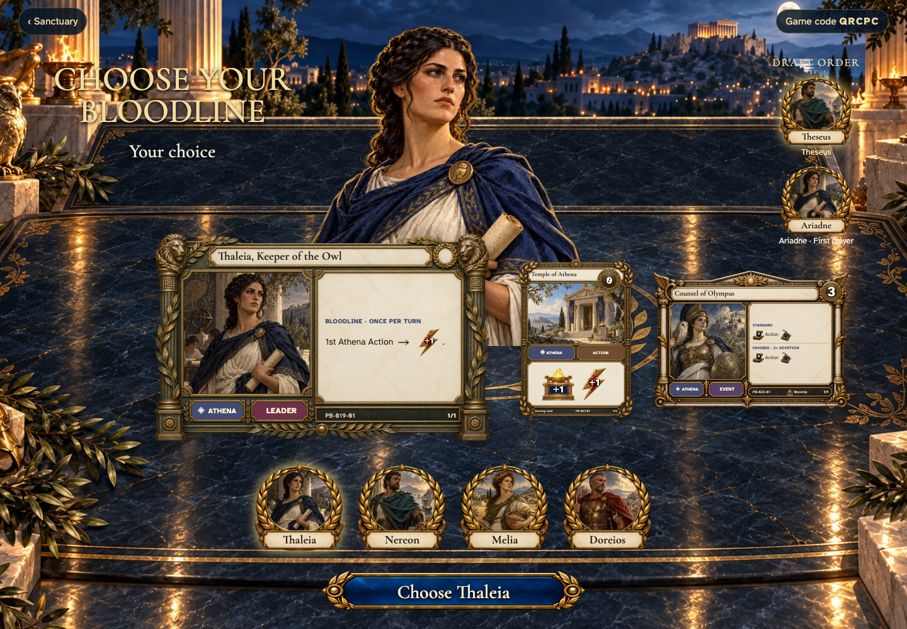
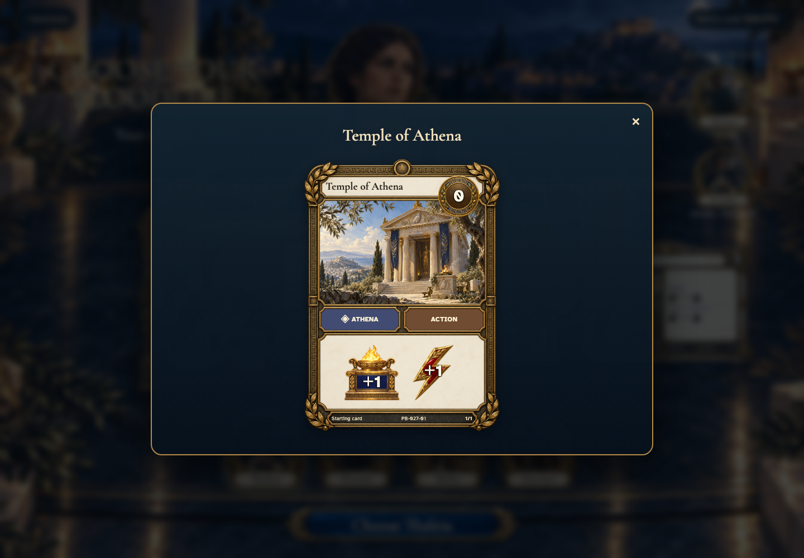
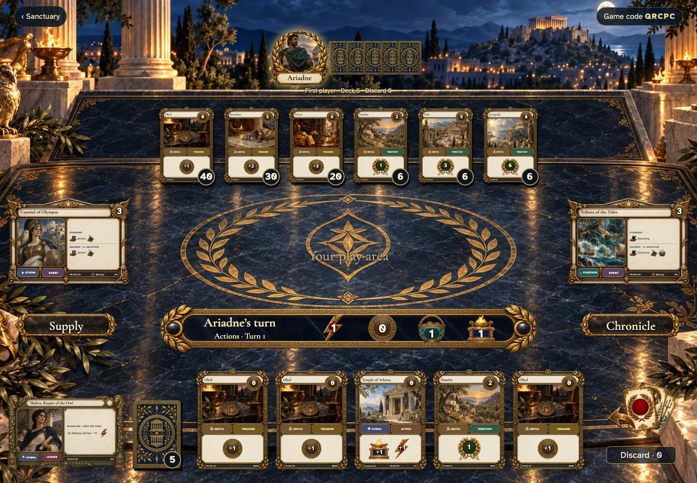
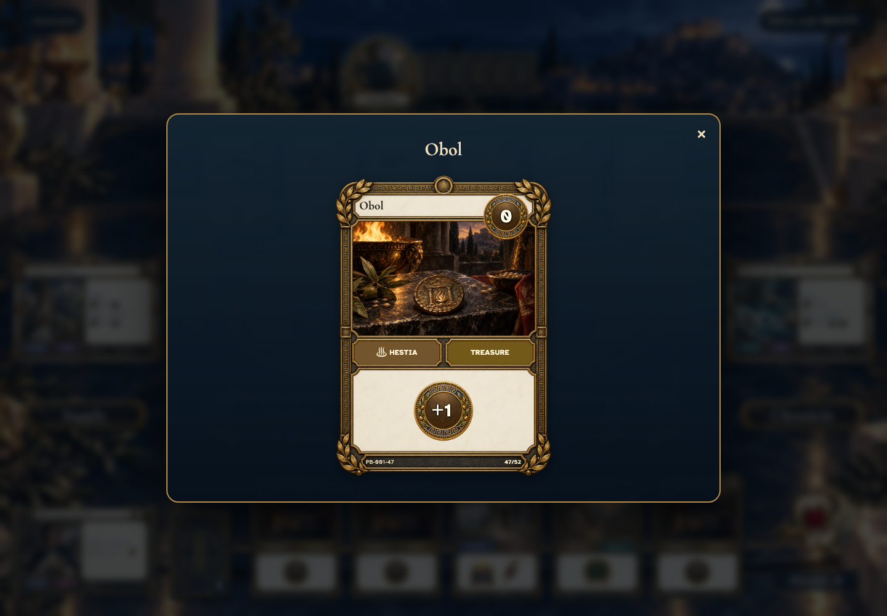
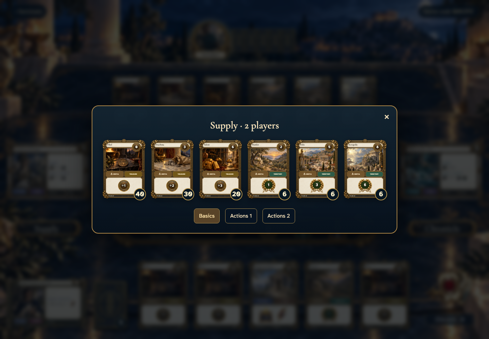

# Choose a bloodline and receive your hand

## Choose from the unused bloodlines

- [x] The first player is drawn once, and the draft runs in reverse order.
- [x] Actual leader, Temple and event cards accompany the selected hero.

## Read the Temple linked to your bloodline

- [x] Inspection uses the complete live card and can be dismissed with Escape.

## Receive five cards at the shared table

- [x] Your own hand shows faces; other players have common backs and public counts.
- [x] Turn one begins with 1 Action, 0 Coins, 1 Buy and 1 Worship.

## Read a card in your hand

- [x] Inspection preserves the physical copy identifier.

## Inspect supply without disturbing the deal

- [x] The six basics show the unchanged stock, separate from starting cards.
