# 2 players draft unique bloodlines and replay the same starting hands

## Choose from the unused bloodlines

[phone](../../screenshots/2-players-draft-unique-bloodlines-and-replay-the-same-starting-hands/000-draft-2-phone-darwin.png) · [desktop](../../screenshots/2-players-draft-unique-bloodlines-and-replay-the-same-starting-hands/000-draft-2-desktop-darwin.png) · [tabletop-4k](../../screenshots/2-players-draft-unique-bloodlines-and-replay-the-same-starting-hands/000-draft-2-tabletop-4k-darwin.png)

- [x] The first player is drawn once, and the draft runs in reverse order.
- [x] Actual leader, Temple and event cards accompany the selected hero.

## Consider Thaleia and the linked cards

Viewpoint: **Theseus**.

[phone](../../screenshots/2-players-draft-unique-bloodlines-and-replay-the-same-starting-hands/001-consider-thaleia-phone-darwin.png) · [desktop](../../screenshots/2-players-draft-unique-bloodlines-and-replay-the-same-starting-hands/001-consider-thaleia-desktop-darwin.png) · [tabletop-4k](../../screenshots/2-players-draft-unique-bloodlines-and-replay-the-same-starting-hands/001-consider-thaleia-tabletop-4k-darwin.png)

- [x] Leader, Temple, and shared god belong to the selected bloodline.

## Consider Nereon and the linked cards

Viewpoint: **Theseus**.

[phone](../../screenshots/2-players-draft-unique-bloodlines-and-replay-the-same-starting-hands/002-consider-nereon-phone-darwin.png) · [desktop](../../screenshots/2-players-draft-unique-bloodlines-and-replay-the-same-starting-hands/002-consider-nereon-desktop-darwin.png) · [tabletop-4k](../../screenshots/2-players-draft-unique-bloodlines-and-replay-the-same-starting-hands/002-consider-nereon-tabletop-4k-darwin.png)

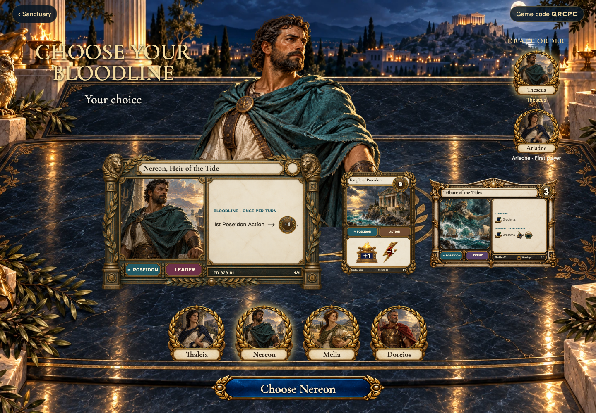

- [x] Leader, Temple, and shared god belong to the selected bloodline.

## Consider Melia and the linked cards

Viewpoint: **Theseus**.

[phone](../../screenshots/2-players-draft-unique-bloodlines-and-replay-the-same-starting-hands/003-consider-melia-phone-darwin.png) · [desktop](../../screenshots/2-players-draft-unique-bloodlines-and-replay-the-same-starting-hands/003-consider-melia-desktop-darwin.png) · [tabletop-4k](../../screenshots/2-players-draft-unique-bloodlines-and-replay-the-same-starting-hands/003-consider-melia-tabletop-4k-darwin.png)

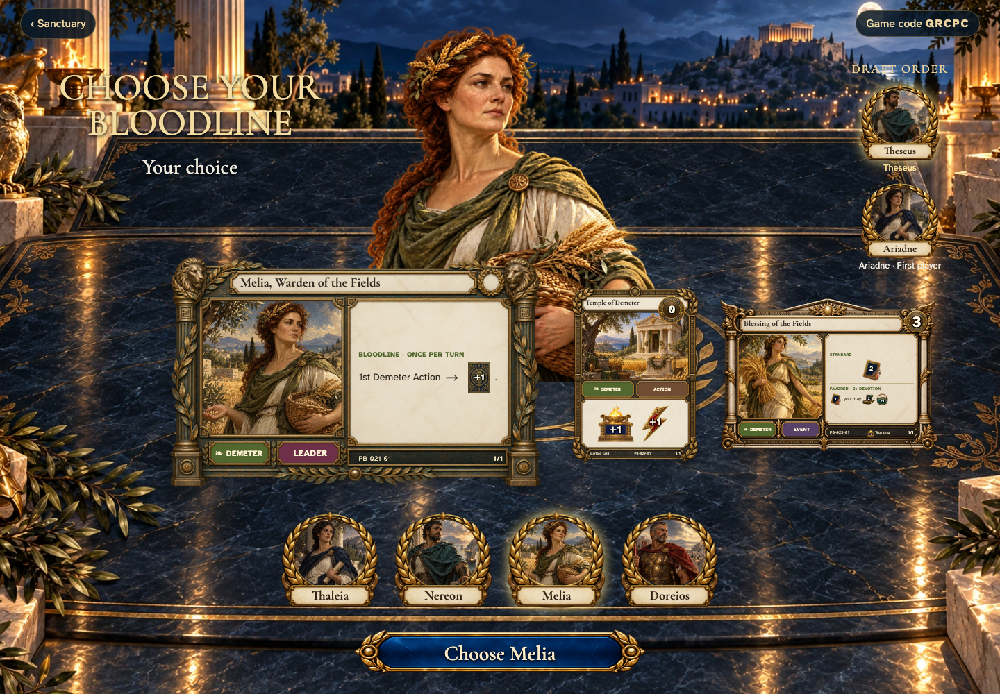

- [x] Leader, Temple, and shared god belong to the selected bloodline.

## Consider Doreios and the linked cards

Viewpoint: **Theseus**.

[phone](../../screenshots/2-players-draft-unique-bloodlines-and-replay-the-same-starting-hands/004-consider-doreios-phone-darwin.png) · [desktop](../../screenshots/2-players-draft-unique-bloodlines-and-replay-the-same-starting-hands/004-consider-doreios-desktop-darwin.png) · [tabletop-4k](../../screenshots/2-players-draft-unique-bloodlines-and-replay-the-same-starting-hands/004-consider-doreios-tabletop-4k-darwin.png)

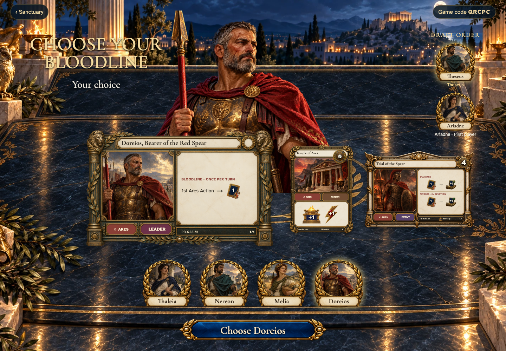

- [x] Leader, Temple, and shared god belong to the selected bloodline.

## Read the Temple linked to your bloodline

[phone](../../screenshots/2-players-draft-unique-bloodlines-and-replay-the-same-starting-hands/005-temple-phone-darwin.png) · [desktop](../../screenshots/2-players-draft-unique-bloodlines-and-replay-the-same-starting-hands/005-temple-desktop-darwin.png) · [tabletop-4k](../../screenshots/2-players-draft-unique-bloodlines-and-replay-the-same-starting-hands/005-temple-tabletop-4k-darwin.png)

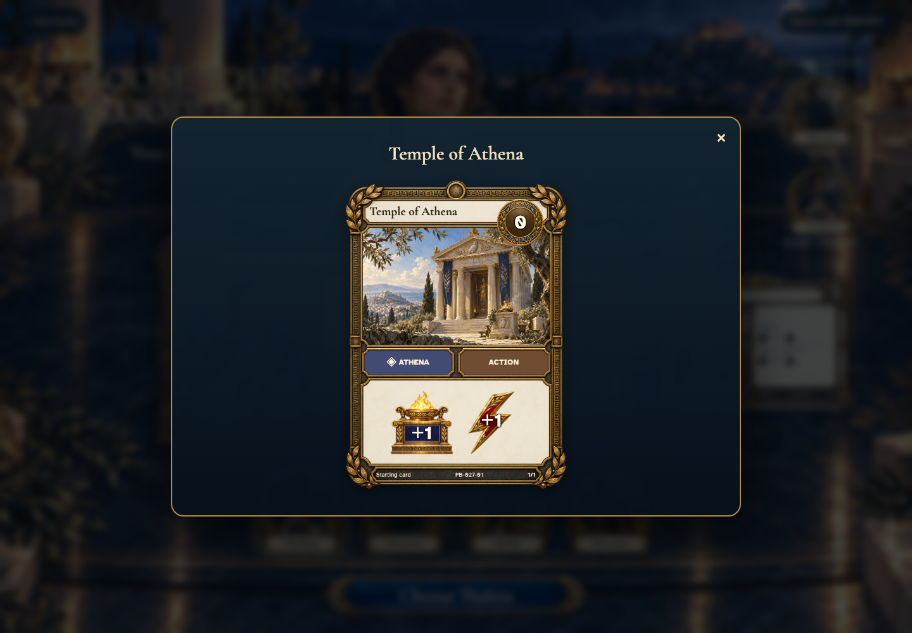

- [x] Inspection uses the complete live card and can be dismissed with Escape.

## Theseus reviews Thaleia

Viewpoint: **Theseus**.

[phone](../../screenshots/2-players-draft-unique-bloodlines-and-replay-the-same-starting-hands/006-choose-0-phone-darwin.png) · [desktop](../../screenshots/2-players-draft-unique-bloodlines-and-replay-the-same-starting-hands/006-choose-0-desktop-darwin.png) · [tabletop-4k](../../screenshots/2-players-draft-unique-bloodlines-and-replay-the-same-starting-hands/006-choose-0-tabletop-4k-darwin.png)

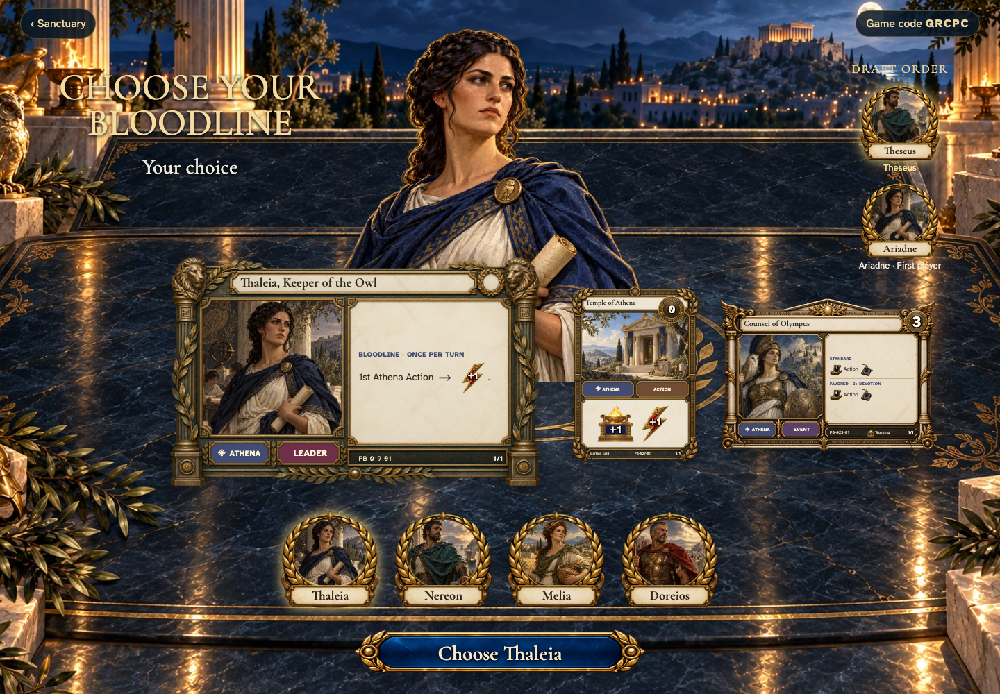

- [x] The current player can claim this unchosen bloodline.

## Wait while the next player chooses

[phone](../../screenshots/2-players-draft-unique-bloodlines-and-replay-the-same-starting-hands/007-claimed-phone-darwin.png) · [desktop](../../screenshots/2-players-draft-unique-bloodlines-and-replay-the-same-starting-hands/007-claimed-desktop-darwin.png) · [tabletop-4k](../../screenshots/2-players-draft-unique-bloodlines-and-replay-the-same-starting-hands/007-claimed-tabletop-4k-darwin.png)

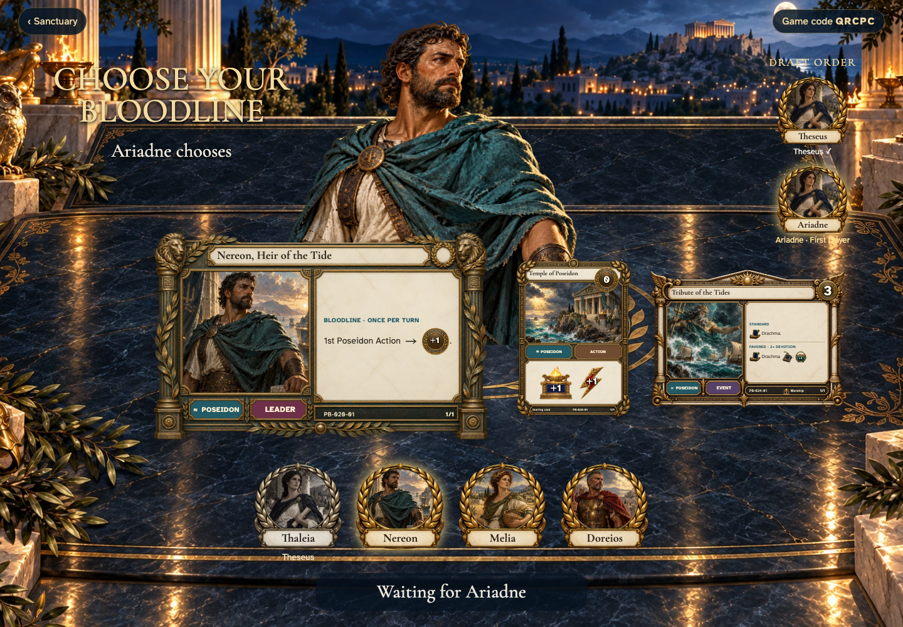

- [x] The chosen portrait belongs to its named seat and cannot be chosen again.

## Ariadne reviews Nereon

Viewpoint: **Ariadne**.

[phone](../../screenshots/2-players-draft-unique-bloodlines-and-replay-the-same-starting-hands/008-choose-1-phone-darwin.png) · [desktop](../../screenshots/2-players-draft-unique-bloodlines-and-replay-the-same-starting-hands/008-choose-1-desktop-darwin.png) · [tabletop-4k](../../screenshots/2-players-draft-unique-bloodlines-and-replay-the-same-starting-hands/008-choose-1-tabletop-4k-darwin.png)

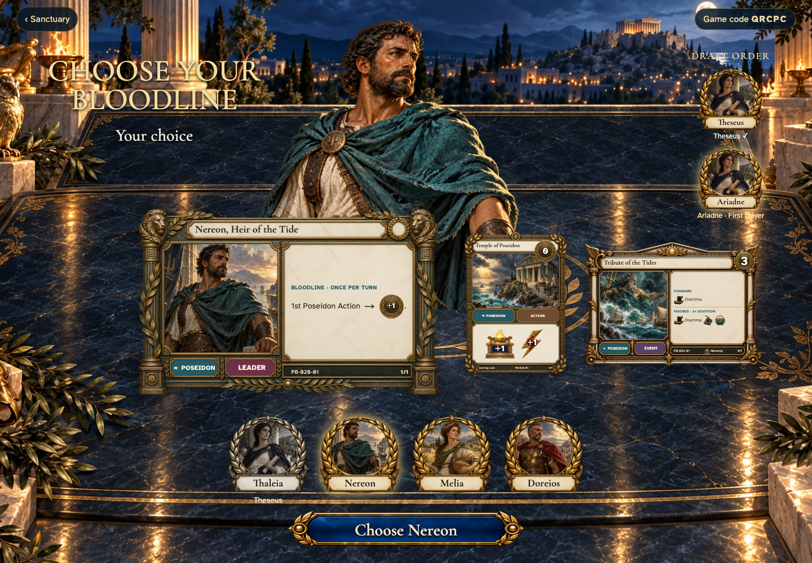

- [x] The current player can claim this unchosen bloodline.

## Ariadne receives a private hand

Viewpoint: **Ariadne**.

[phone](../../screenshots/2-players-draft-unique-bloodlines-and-replay-the-same-starting-hands/009-hand-ariadne-phone-darwin.png) · [desktop](../../screenshots/2-players-draft-unique-bloodlines-and-replay-the-same-starting-hands/009-hand-ariadne-desktop-darwin.png) · [tabletop-4k](../../screenshots/2-players-draft-unique-bloodlines-and-replay-the-same-starting-hands/009-hand-ariadne-tabletop-4k-darwin.png)

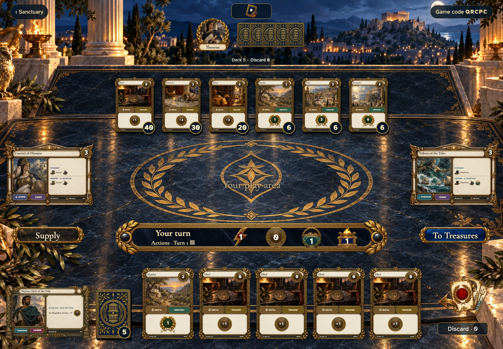

- [x] Only this player’s five faces are rendered; opponents have backs.

## Theseus receives a private hand

Viewpoint: **Theseus**.

[phone](../../screenshots/2-players-draft-unique-bloodlines-and-replay-the-same-starting-hands/010-hand-theseus-phone-darwin.png) · [desktop](../../screenshots/2-players-draft-unique-bloodlines-and-replay-the-same-starting-hands/010-hand-theseus-desktop-darwin.png) · [tabletop-4k](../../screenshots/2-players-draft-unique-bloodlines-and-replay-the-same-starting-hands/010-hand-theseus-tabletop-4k-darwin.png)

- [x] Only this player’s five faces are rendered; opponents have backs.

## Receive five cards at the shared table

[phone](../../screenshots/2-players-draft-unique-bloodlines-and-replay-the-same-starting-hands/011-dealt-2-phone-darwin.png) · [desktop](../../screenshots/2-players-draft-unique-bloodlines-and-replay-the-same-starting-hands/011-dealt-2-desktop-darwin.png) · [tabletop-4k](../../screenshots/2-players-draft-unique-bloodlines-and-replay-the-same-starting-hands/011-dealt-2-tabletop-4k-darwin.png)

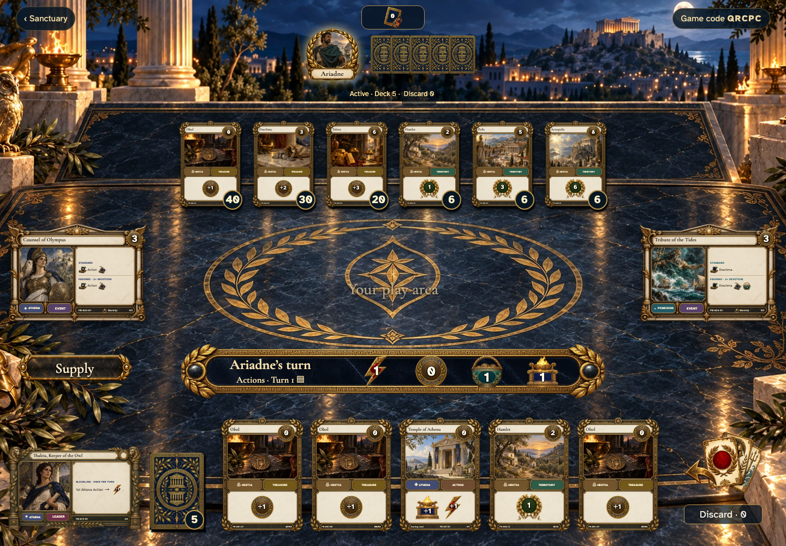

- [x] Your own hand shows faces; other players have common backs and public counts.
- [x] Turn one begins with 1 Action, 0 Coins, 1 Buy and 1 Worship.

## Return to the same hand without another deal

Viewpoint: **Theseus**.

[phone](../../screenshots/2-players-draft-unique-bloodlines-and-replay-the-same-starting-hands/012-restored-hand-phone-darwin.png) · [desktop](../../screenshots/2-players-draft-unique-bloodlines-and-replay-the-same-starting-hands/012-restored-hand-desktop-darwin.png) · [tabletop-4k](../../screenshots/2-players-draft-unique-bloodlines-and-replay-the-same-starting-hands/012-restored-hand-tabletop-4k-darwin.png)

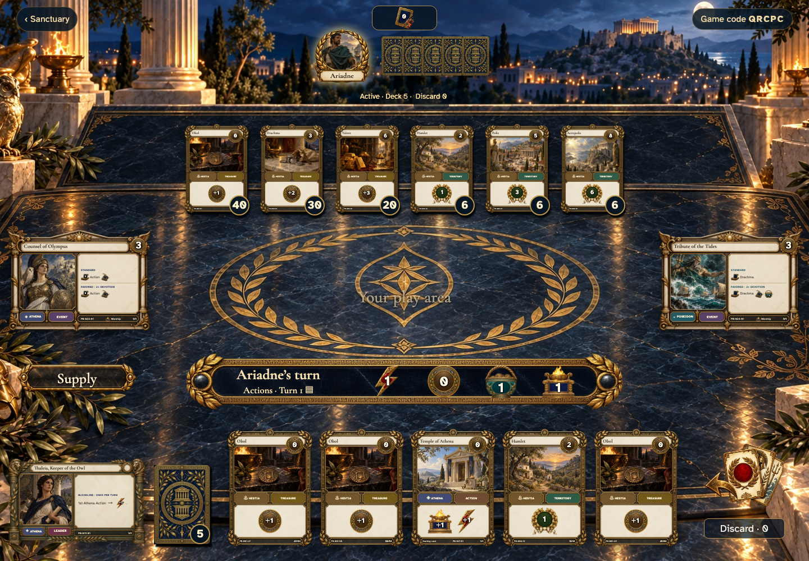

- [x] The physical copies remain unchanged.

## Read a card in your hand

[phone](../../screenshots/2-players-draft-unique-bloodlines-and-replay-the-same-starting-hands/013-hand-inspection-phone-darwin.png) · [desktop](../../screenshots/2-players-draft-unique-bloodlines-and-replay-the-same-starting-hands/013-hand-inspection-desktop-darwin.png) · [tabletop-4k](../../screenshots/2-players-draft-unique-bloodlines-and-replay-the-same-starting-hands/013-hand-inspection-tabletop-4k-darwin.png)

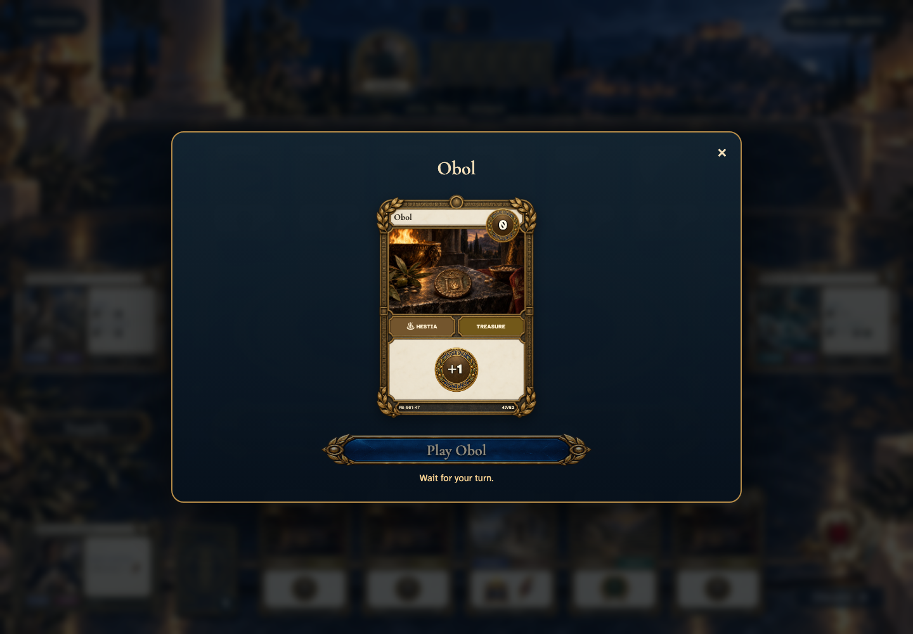

- [x] Inspection preserves the physical copy identifier.

## Inspect supply without disturbing the deal

[phone](../../screenshots/2-players-draft-unique-bloodlines-and-replay-the-same-starting-hands/014-supply-phone-darwin.png) · [desktop](../../screenshots/2-players-draft-unique-bloodlines-and-replay-the-same-starting-hands/014-supply-desktop-darwin.png) · [tabletop-4k](../../screenshots/2-players-draft-unique-bloodlines-and-replay-the-same-starting-hands/014-supply-tabletop-4k-darwin.png)

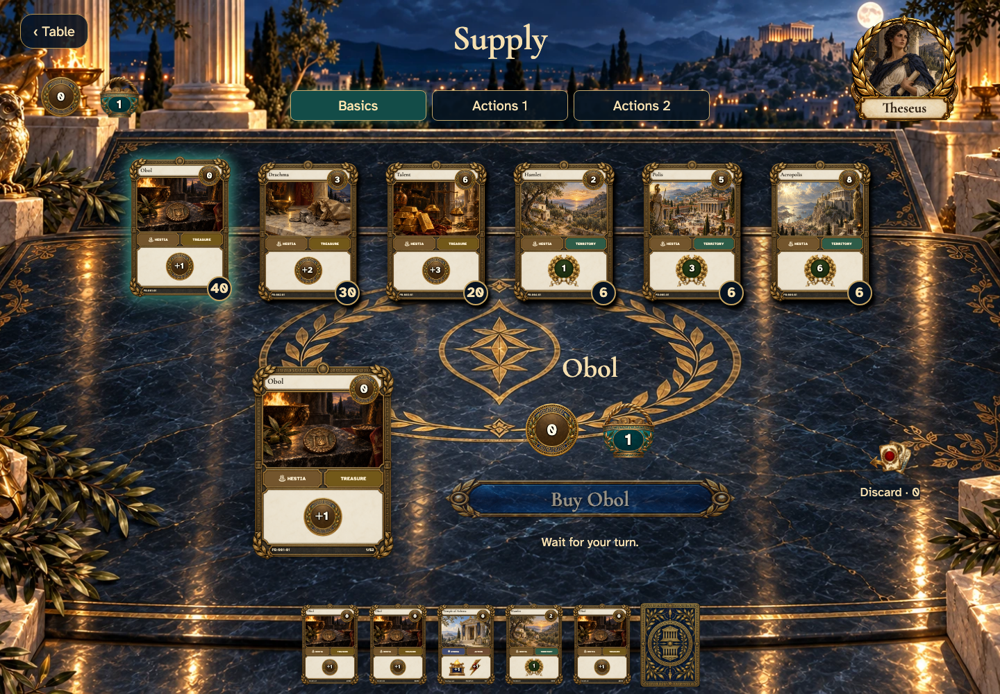

- [x] The six basics show the unchanged stock, separate from starting cards.

## Explain why a late visitor cannot join

[phone](../../screenshots/2-players-draft-unique-bloodlines-and-replay-the-same-starting-hands/015-started-phone-darwin.png) · [desktop](../../screenshots/2-players-draft-unique-bloodlines-and-replay-the-same-starting-hands/015-started-desktop-darwin.png) · [tabletop-4k](../../screenshots/2-players-draft-unique-bloodlines-and-replay-the-same-starting-hands/015-started-tabletop-4k-darwin.png)

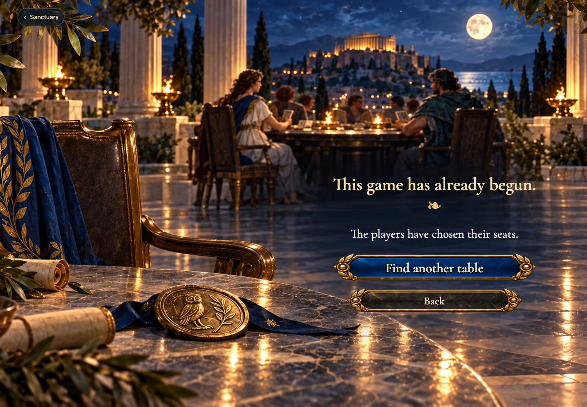

- [x] The invitation names the begun game and offers another table.
