# 4 players draft unique bloodlines and replay the same starting hands

## Choose from the unused bloodlines

<table>
<tr><th>Desktop · 1440 × 1000</th><th>Phone · 393 × 852</th></tr>
<tr>
<td valign="top"></td>
<td valign="top"></td>
</tr>
</table>

Tabletop · 3840 × 2160 — expand screenshot

- [x] The first player is drawn once, and the draft runs in reverse order.
- [x] Actual leader, Temple and event cards accompany the selected hero.

## Consider Thaleia and the linked cards

Viewpoint: **Leon**.

<table>
<tr><th>Desktop · 1440 × 1000</th><th>Phone · 393 × 852</th></tr>
<tr>
<td valign="top"></td>
<td valign="top"><a href="../../screenshots/4-players-draft-unique-bloodlines-and-replay-the-same-starting-hands/001-consider-thaleia-phone-darwin.png">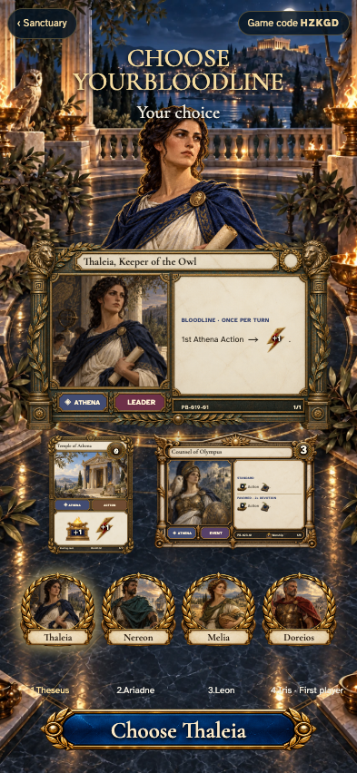</a></td>
</tr>
</table>

Tabletop · 3840 × 2160 — expand screenshot

- [x] Leader, Temple, and shared god belong to the selected bloodline.

## Consider Nereon and the linked cards

Viewpoint: **Leon**.

<table>
<tr><th>Desktop · 1440 × 1000</th><th>Phone · 393 × 852</th></tr>
<tr>
<td valign="top"></td>
<td valign="top"><a href="../../screenshots/4-players-draft-unique-bloodlines-and-replay-the-same-starting-hands/002-consider-nereon-phone-darwin.png">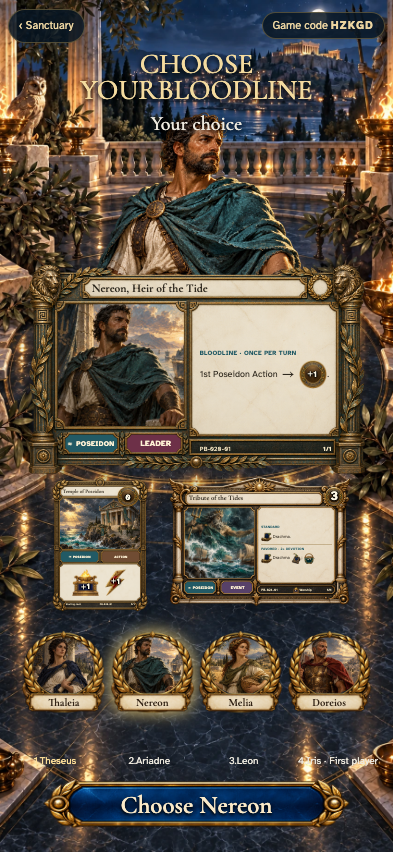</a></td>
</tr>
</table>

Tabletop · 3840 × 2160 — expand screenshot

<a href="../../screenshots/4-players-draft-unique-bloodlines-and-replay-the-same-starting-hands/002-consider-nereon-tabletop-4k-darwin.png">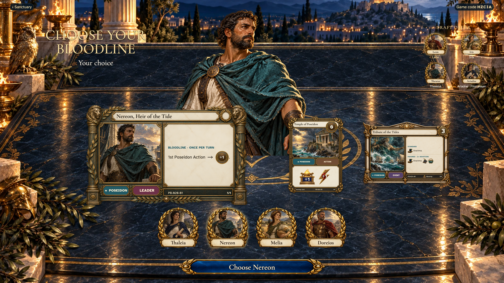</a>

- [x] Leader, Temple, and shared god belong to the selected bloodline.

## Consider Melia and the linked cards

Viewpoint: **Leon**.

<table>
<tr><th>Desktop · 1440 × 1000</th><th>Phone · 393 × 852</th></tr>
<tr>
<td valign="top"></td>
<td valign="top"><a href="../../screenshots/4-players-draft-unique-bloodlines-and-replay-the-same-starting-hands/003-consider-melia-phone-darwin.png">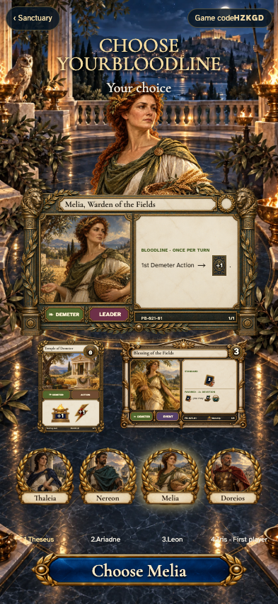</a></td>
</tr>
</table>

Tabletop · 3840 × 2160 — expand screenshot

- [x] Leader, Temple, and shared god belong to the selected bloodline.

## Consider Doreios and the linked cards

Viewpoint: **Leon**.

<table>
<tr><th>Desktop · 1440 × 1000</th><th>Phone · 393 × 852</th></tr>
<tr>
<td valign="top"></td>
<td valign="top"><a href="../../screenshots/4-players-draft-unique-bloodlines-and-replay-the-same-starting-hands/004-consider-doreios-phone-darwin.png">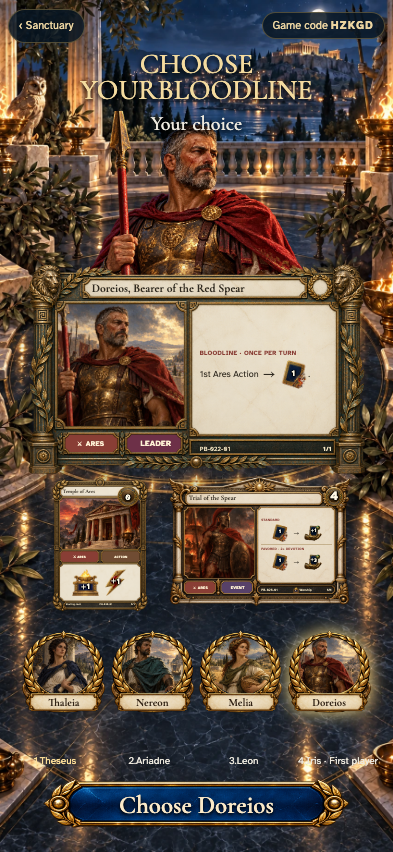</a></td>
</tr>
</table>

Tabletop · 3840 × 2160 — expand screenshot

<a href="../../screenshots/4-players-draft-unique-bloodlines-and-replay-the-same-starting-hands/004-consider-doreios-tabletop-4k-darwin.png">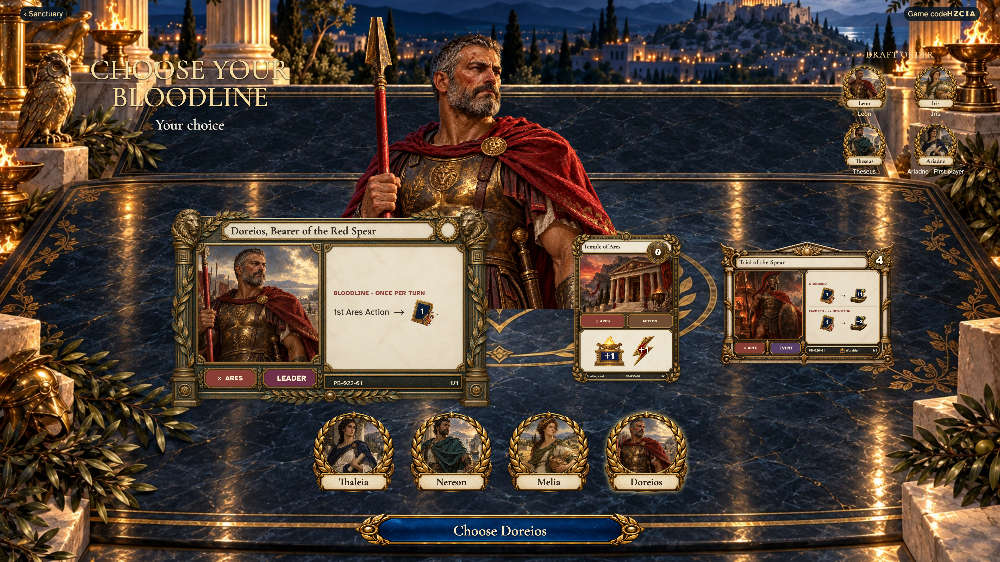</a>

- [x] Leader, Temple, and shared god belong to the selected bloodline.

## Leon reviews Thaleia

Viewpoint: **Leon**.

<table>
<tr><th>Desktop · 1440 × 1000</th><th>Phone · 393 × 852</th></tr>
<tr>
<td valign="top"></td>
<td valign="top"></td>
</tr>
</table>

Tabletop · 3840 × 2160 — expand screenshot

<a href="../../screenshots/4-players-draft-unique-bloodlines-and-replay-the-same-starting-hands/005-choose-0-tabletop-4k-darwin.png">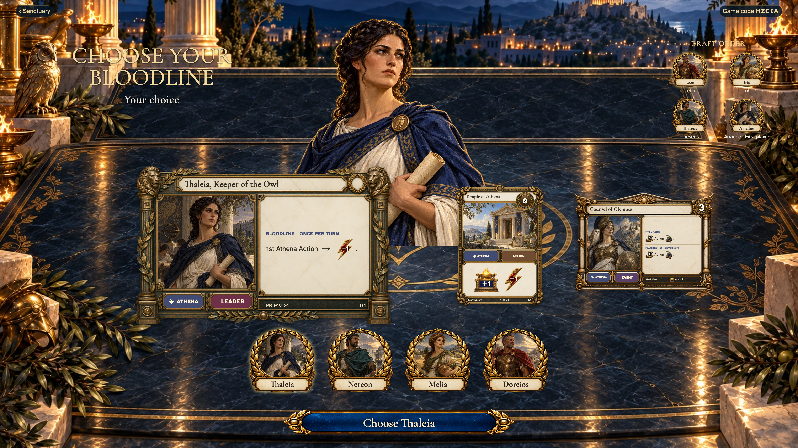</a>

- [x] The current player can claim this unchosen bloodline.

## Iris reviews Nereon

Viewpoint: **Iris**.

<table>
<tr><th>Desktop · 1440 × 1000</th><th>Phone · 393 × 852</th></tr>
<tr>
<td valign="top"></td>
<td valign="top"><a href="../../screenshots/4-players-draft-unique-bloodlines-and-replay-the-same-starting-hands/006-choose-1-phone-darwin.png">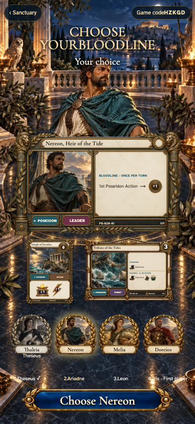</a></td>
</tr>
</table>

Tabletop · 3840 × 2160 — expand screenshot

<a href="../../screenshots/4-players-draft-unique-bloodlines-and-replay-the-same-starting-hands/006-choose-1-tabletop-4k-darwin.png">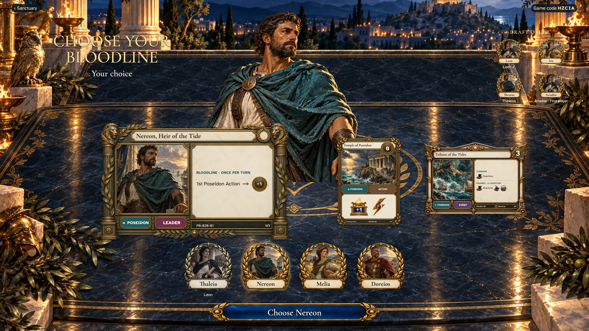</a>

- [x] The current player can claim this unchosen bloodline.

## Theseus reviews Melia

Viewpoint: **Theseus**.

<table>
<tr><th>Desktop · 1440 × 1000</th><th>Phone · 393 × 852</th></tr>
<tr>
<td valign="top"></td>
<td valign="top"><a href="../../screenshots/4-players-draft-unique-bloodlines-and-replay-the-same-starting-hands/007-choose-2-phone-darwin.png">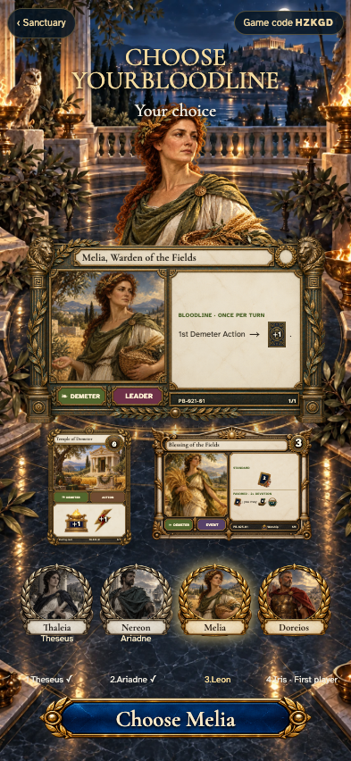</a></td>
</tr>
</table>

Tabletop · 3840 × 2160 — expand screenshot

<a href="../../screenshots/4-players-draft-unique-bloodlines-and-replay-the-same-starting-hands/007-choose-2-tabletop-4k-darwin.png">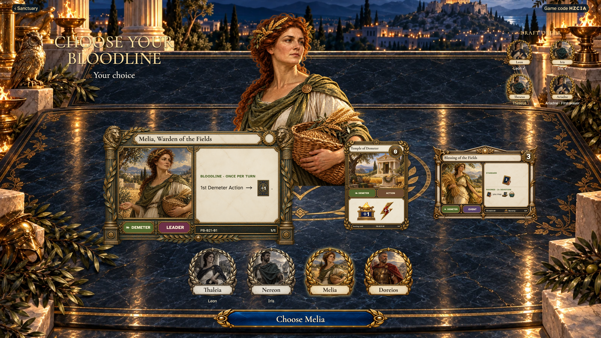</a>

- [x] The current player can claim this unchosen bloodline.

## Ariadne reviews Doreios

Viewpoint: **Ariadne**.

<table>
<tr><th>Desktop · 1440 × 1000</th><th>Phone · 393 × 852</th></tr>
<tr>
<td valign="top"></td>
<td valign="top"></td>
</tr>
</table>

Tabletop · 3840 × 2160 — expand screenshot

<a href="../../screenshots/4-players-draft-unique-bloodlines-and-replay-the-same-starting-hands/008-choose-3-tabletop-4k-darwin.png">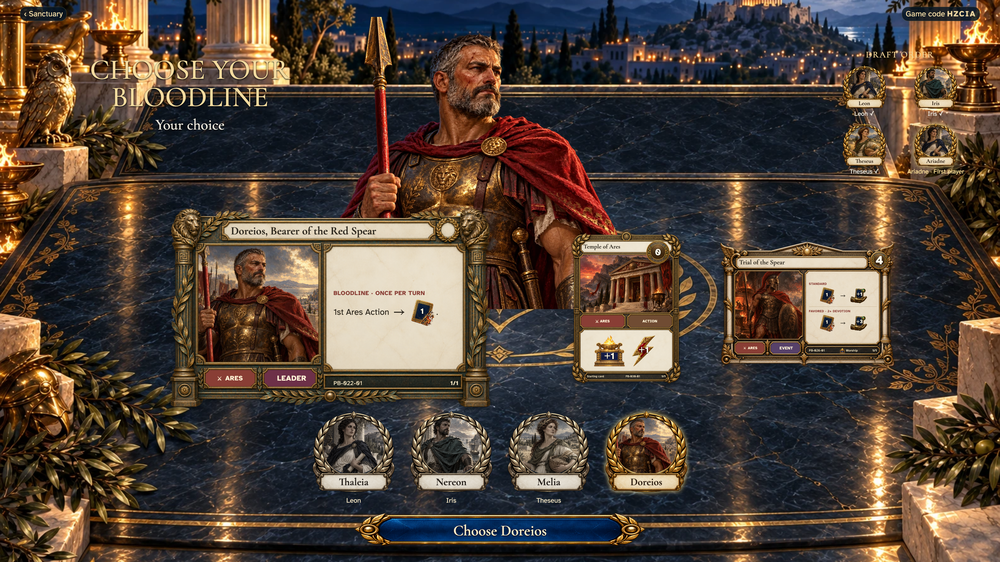</a>

- [x] The current player can claim this unchosen bloodline.

## Ariadne receives a private hand

Viewpoint: **Ariadne**.

<table>
<tr><th>Desktop · 1440 × 1000</th><th>Phone · 393 × 852</th></tr>
<tr>
<td valign="top"></td>
<td valign="top"><a href="../../screenshots/4-players-draft-unique-bloodlines-and-replay-the-same-starting-hands/009-hand-ariadne-phone-darwin.png">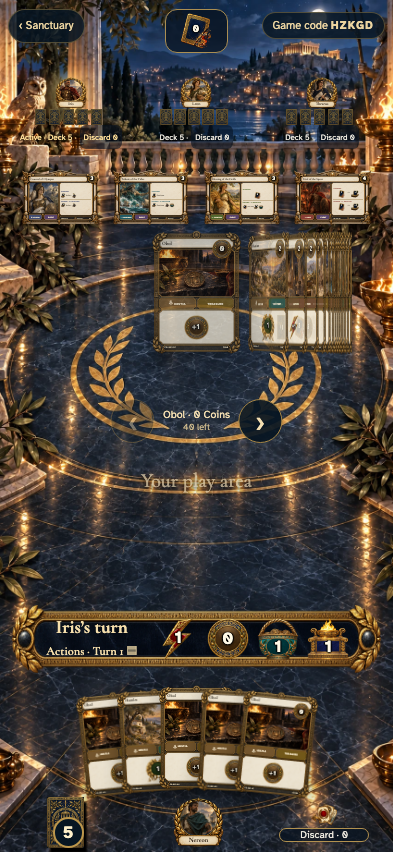</a></td>
</tr>
</table>

Tabletop · 3840 × 2160 — expand screenshot

<a href="../../screenshots/4-players-draft-unique-bloodlines-and-replay-the-same-starting-hands/009-hand-ariadne-tabletop-4k-darwin.png">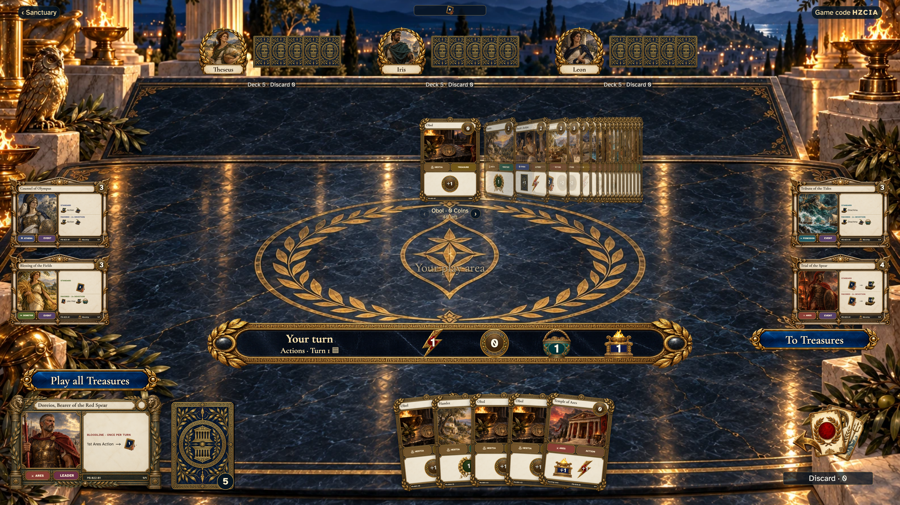</a>

- [x] Only this player’s five faces are rendered; opponents have backs.

## Theseus receives a private hand

Viewpoint: **Theseus**.

<table>
<tr><th>Desktop · 1440 × 1000</th><th>Phone · 393 × 852</th></tr>
<tr>
<td valign="top"></td>
<td valign="top"><a href="../../screenshots/4-players-draft-unique-bloodlines-and-replay-the-same-starting-hands/010-hand-theseus-phone-darwin.png">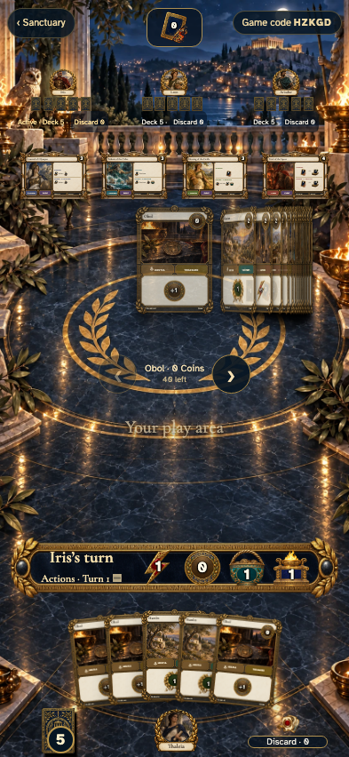</a></td>
</tr>
</table>

Tabletop · 3840 × 2160 — expand screenshot

<a href="../../screenshots/4-players-draft-unique-bloodlines-and-replay-the-same-starting-hands/010-hand-theseus-tabletop-4k-darwin.png">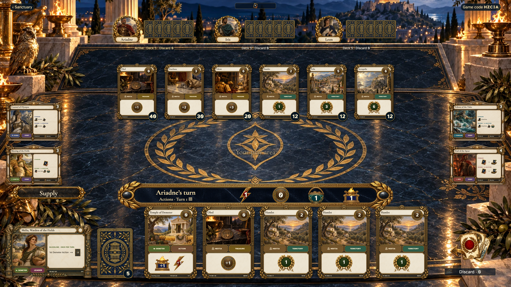</a>

- [x] Only this player’s five faces are rendered; opponents have backs.

## Iris receives a private hand

Viewpoint: **Iris**.

<table>
<tr><th>Desktop · 1440 × 1000</th><th>Phone · 393 × 852</th></tr>
<tr>
<td valign="top"></td>
<td valign="top"><a href="../../screenshots/4-players-draft-unique-bloodlines-and-replay-the-same-starting-hands/011-hand-iris-phone-darwin.png">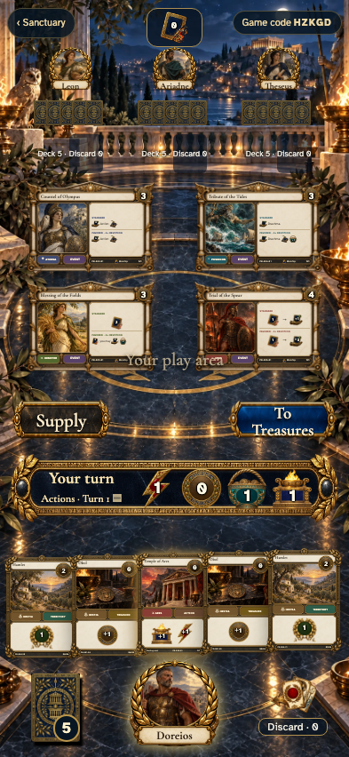</a></td>
</tr>
</table>

Tabletop · 3840 × 2160 — expand screenshot

<a href="../../screenshots/4-players-draft-unique-bloodlines-and-replay-the-same-starting-hands/011-hand-iris-tabletop-4k-darwin.png">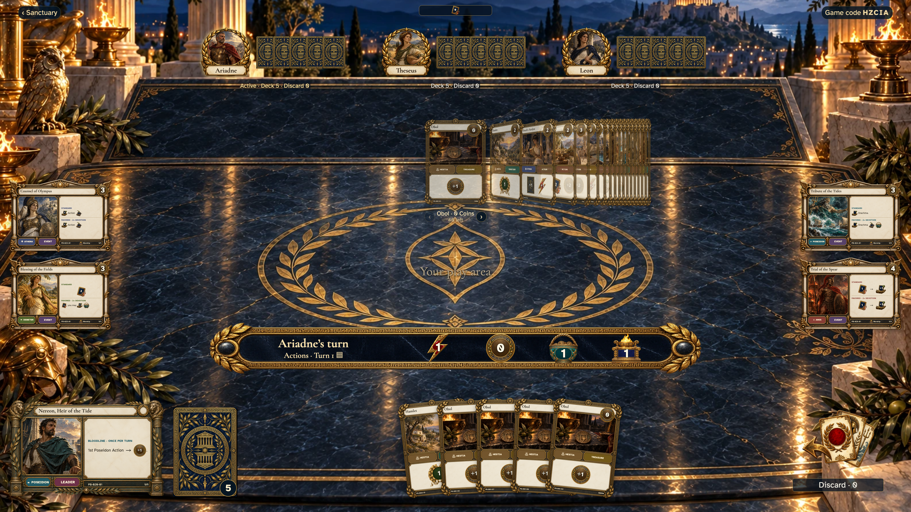</a>

- [x] Only this player’s five faces are rendered; opponents have backs.

## Leon receives a private hand

Viewpoint: **Leon**.

<table>
<tr><th>Desktop · 1440 × 1000</th><th>Phone · 393 × 852</th></tr>
<tr>
<td valign="top"></td>
<td valign="top"><a href="../../screenshots/4-players-draft-unique-bloodlines-and-replay-the-same-starting-hands/012-hand-leon-phone-darwin.png">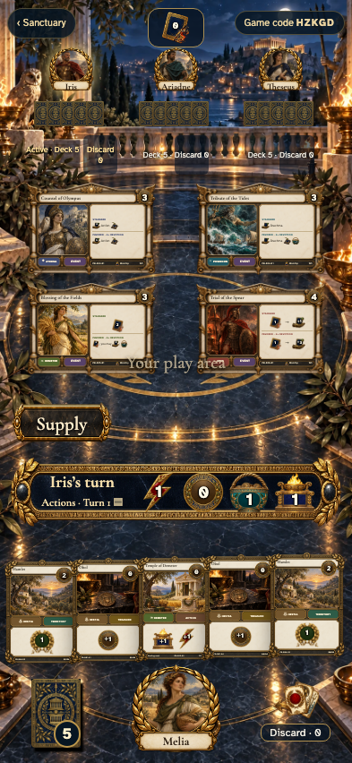</a></td>
</tr>
</table>

Tabletop · 3840 × 2160 — expand screenshot

- [x] Only this player’s five faces are rendered; opponents have backs.

## Receive five cards at the shared table

<table>
<tr><th>Desktop · 1440 × 1000</th><th>Phone · 393 × 852</th></tr>
<tr>
<td valign="top"></td>
<td valign="top"></td>
</tr>
</table>

Tabletop · 3840 × 2160 — expand screenshot

- [x] Your own hand shows faces; other players have common backs and public counts.
- [x] Turn one begins with 1 Action, 0 Coins, 1 Buy and 1 Worship.

## Return to the same hand without another deal

Viewpoint: **Leon**.

<table>
<tr><th>Desktop · 1440 × 1000</th><th>Phone · 393 × 852</th></tr>
<tr>
<td valign="top"></td>
<td valign="top"><a href="../../screenshots/4-players-draft-unique-bloodlines-and-replay-the-same-starting-hands/014-restored-hand-phone-darwin.png">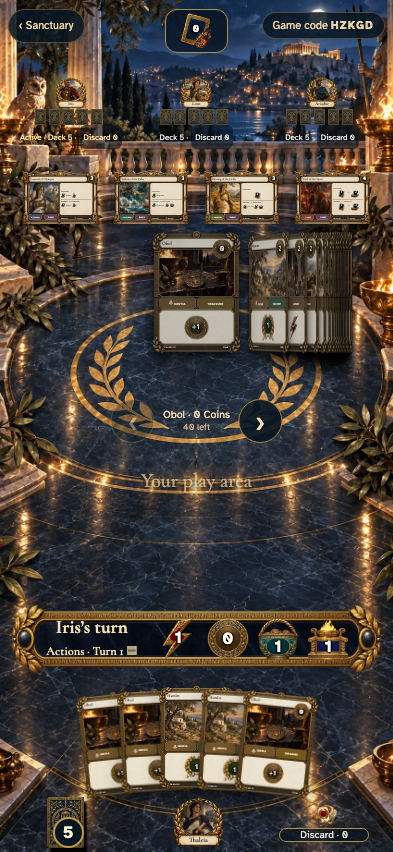</a></td>
</tr>
</table>

Tabletop · 3840 × 2160 — expand screenshot

- [x] The physical copies remain unchanged.
