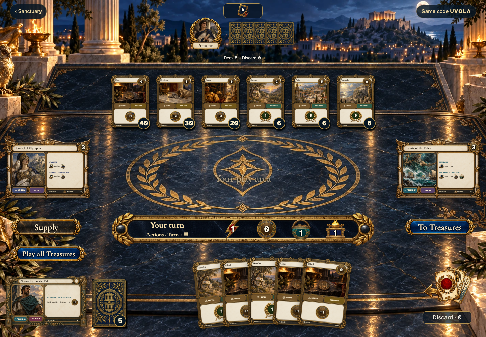
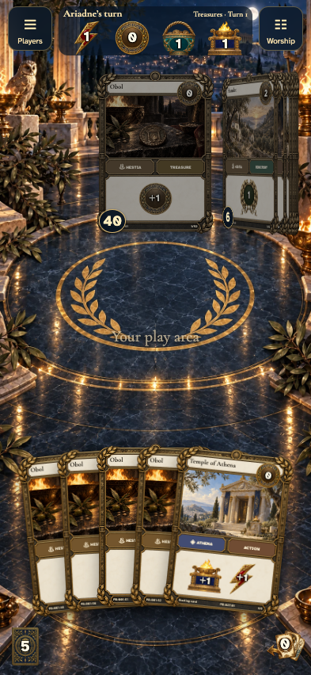
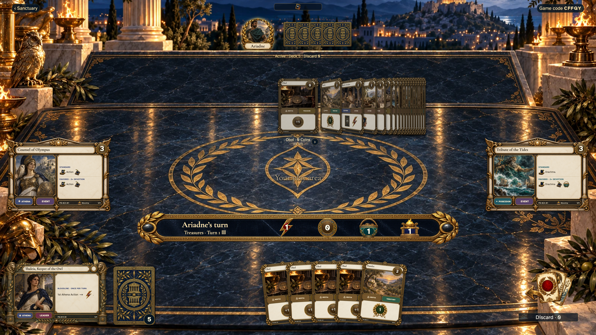

# a lost Begin acknowledgement starts one draft and deals each hand once

## Receive five cards after a recovered Begin

Viewpoint: **Theseus**.

<table>
<tr><th>Desktop · 1440 × 1000</th><th>Phone · 393 × 852</th></tr>
<tr>
<td valign="top"></td>
<td valign="top"></td>
</tr>
</table>

Tabletop · 3840 × 2160 — expand screenshot

- [x] The other player sees five cards and a normal turn after animations finish.
