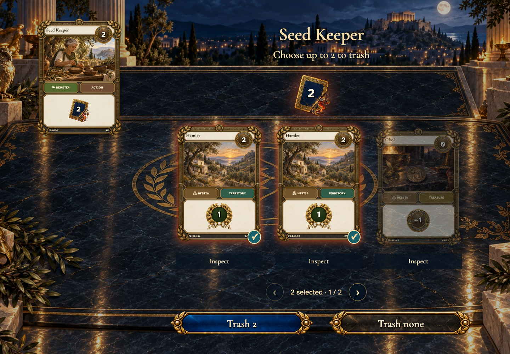
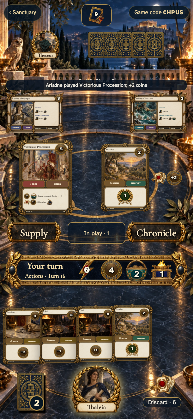

# Action phase: implementation and visual review

This milestone implements [step 4](../../../IMPLEMENTATION_PLAN.md), using the accepted [table](../../../docs/ux/concepts/04-table-desktop.png), [inspection](../../../docs/ux/concepts/07-card-detail.png), [trash](../../../docs/ux/concepts/09-card-choice.png), [gain](../../../docs/ux/concepts/10-gain.png), [reveal](../../../docs/ux/concepts/11-reveal.png), and [discard](../../../docs/ux/concepts/20-discard.png) paintings.

| Interaction | Phone | Desktop | 4K |
| --- | --- | --- | --- |
| Inspect and play | [Card](screenshots/000-play-action-phone-darwin.png) | [Card](screenshots/000-play-action-desktop-darwin.png) | [Card](screenshots/000-play-action-tabletop-4k-darwin.png) |
| Optional trash | [Selection](screenshots/002-trash-selected-phone-darwin.png) | [Selection](screenshots/002-trash-selected-desktop-darwin.png) | [Selection](screenshots/002-trash-selected-tabletop-4k-darwin.png) |
| Gain | [Selection](screenshots/001-gain-selected-phone-darwin.png) | [Selection](screenshots/001-gain-selected-desktop-darwin.png) | [Selection](screenshots/001-gain-selected-tabletop-4k-darwin.png) |
| Leader choice | [Doreios](screenshots/002-leader-choice-phone-darwin.png) | [Doreios](screenshots/002-leader-choice-desktop-darwin.png) | [Doreios](screenshots/002-leader-choice-tabletop-4k-darwin.png) |
| Mandatory discard | [Selection](screenshots/001-discard-selected-phone-darwin.png) | [Selection](screenshots/001-discard-selected-desktop-darwin.png) | [Selection](screenshots/001-discard-selected-tabletop-4k-darwin.png) |
| Reveal | [Result](screenshots/000-reveal-territory-phone-darwin.png) | [Result](screenshots/000-reveal-territory-desktop-darwin.png) | [Result](screenshots/000-reveal-territory-tabletop-4k-darwin.png) |
| Four players | [Result](screenshots/000-reveal-4-phone-darwin.png) | [Result](screenshots/000-reveal-4-desktop-darwin.png) | [Result](screenshots/000-reveal-4-tabletop-4k-darwin.png) |

## Fidelity and interaction

The full-screen choice scenes retain the obsidian table, distant Acropolis, real source card, prominent operation icon, raised/glowing selected cards, and sculpted confirmation controls. Mobile recomposes vertically; desktop puts the source at the left and the choices across the near table. The approved portrait card frames and complete rules are retained instead of copying the paintings’ incidental cropped card faces. The catalog trash icon supplies the burning-card motif; no new illustrations or simulated controls were introduced. A lossless icon-sized derivative of the existing card back makes small Cards symbols render consistently.

Three cards per choice page keep tap targets separate, allow inspecting each physical copy, and preserve selection when paging. Trash has a deliberate “Trash none” action; mandatory discard has neither Skip nor Cancel. Gain shows only nonempty legal piles and always names the discard destination. Doreios gets his own source board and decision after the Action has completely resolved. Pending choices survive reconnects with the same source and limits.

On the table, playable Actions glow and open a full card with a real Play control. Acknowledged plays move toward the play area; draws move from the deck, and public results show their actual cards and destination icons. A leader blessing lights the corresponding portrait. The resource rail remains visible and separate from hand paging. Public discard, play and trash trays retain physical identifiers and offer full-sized inspection. Opponents’ hand faces never enter the DOM or accessibility tree.

The public result remains beside its played source until the next command, so reduced motion conveys the same information. On narrow three-/four-player tables, altars become a single inspection row to leave the result readable. Larger hands use five-card pages rather than shrinking cards indefinitely. Compared with the paintings, count/inspection controls remain explicit and optional choices are never inferred from a decorative arrow.

## Verification

The illustrated [primary story](README.md) and [browser scenarios](actions.spec.ts) cover all twelve supply Actions and four Temples, all leaders, optional trash, mandatory discard of a just-drawn card, cost-limited cheaper gains, both Procession destinations, 2/3/4-player views, paging, keyboard choice, actual card inspection, observer privacy, reconnect, lost acknowledgement, and one-time remote/draw motion. Reduced-motion and normal-motion clients share the same event results.

[Reducer tests](../../backend/actions.test.ts) additionally cover no eligible supply, zero/partial/empty draws, shuffle boundaries, no-op leader triggers, duplicate/non-hand/self targets, zero-cost Temple conversion, and first-trigger consumption. [Repository tests](../../backend/setup.test.ts) verify authenticated Action/choice appends, out-of-turn rejection, idempotency, stale payload rejection, and full replay equality.

Later-turn browser fixtures are complete legal event histories: real initial decks, seeded shuffles, ordinary Treasure plays, purchases and cleanup. They are written to the isolated Firestore emulator before entering the table; player actions then use the production authenticated repository and rules. No test mode, replacement reducer, alternate renderer, or injected state projection ships in the game. Fixture reads/reset paginate the whole event collection.

The shared story helper waits for reactive layout, fonts, images, and finite animations before auditing viewport containment and non-overlapping controls. All photographed steps use `maxDiffPixels: 0`, `threshold: 0`, with no masks or retries. Reviewed macOS and Linux captures are committed separately. Economy/Worship/complete-turn controls remain the following milestones.
