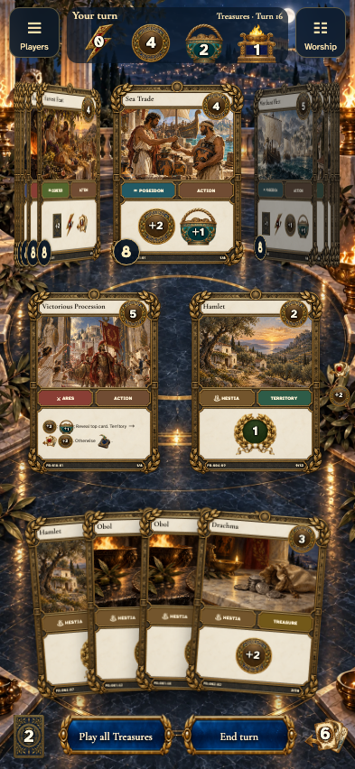

# Action phase: implementation and visual review

This milestone implements [step 4](../../../IMPLEMENTATION_PLAN.md), using the accepted [table](../../../docs/ux/concepts/04-table-desktop.png), [inspection](../../../docs/ux/concepts/07-card-detail.png), [trash](../../../docs/ux/concepts/09-card-choice.png), [gain](../../../docs/ux/concepts/10-gain.png), [reveal](../../../docs/ux/concepts/11-reveal.png), and [discard](../../../docs/ux/concepts/20-discard.png) paintings.

| Interaction | Phone | Desktop | 4K |
| --- | --- | --- | --- |
| Inspect and play | [Card](screenshots/play-choose-optional-trash-reconnect-and-show-the-public-result/001-inspect-phone-darwin.png) | [Card](screenshots/play-choose-optional-trash-reconnect-and-show-the-public-result/001-inspect-desktop-darwin.png) | [Card](screenshots/play-choose-optional-trash-reconnect-and-show-the-public-result/001-inspect-tabletop-4k-darwin.png) |
| Optional trash | [Selection](screenshots/play-choose-optional-trash-reconnect-and-show-the-public-result/004-trash-selected-phone-darwin.png) | [Selection](screenshots/play-choose-optional-trash-reconnect-and-show-the-public-result/004-trash-selected-desktop-darwin.png) | [Selection](screenshots/play-choose-optional-trash-reconnect-and-show-the-public-result/004-trash-selected-tabletop-4k-darwin.png) |
| Gain | [Selection](screenshots/forge-gains-a-cheaper-card-before-doreios-offers-his-separate-choice/002-gain-choice-phone-darwin.png) | [Selection](screenshots/forge-gains-a-cheaper-card-before-doreios-offers-his-separate-choice/002-gain-choice-desktop-darwin.png) | [Selection](screenshots/forge-gains-a-cheaper-card-before-doreios-offers-his-separate-choice/002-gain-choice-tabletop-4k-darwin.png) |
| Leader choice | [Doreios](screenshots/forge-gains-a-cheaper-card-before-doreios-offers-his-separate-choice/004-leader-choice-phone-darwin.png) | [Doreios](screenshots/forge-gains-a-cheaper-card-before-doreios-offers-his-separate-choice/004-leader-choice-desktop-darwin.png) | [Doreios](screenshots/forge-gains-a-cheaper-card-before-doreios-offers-his-separate-choice/004-leader-choice-tabletop-4k-darwin.png) |
| Mandatory discard | [Selection](screenshots/harvest-feast-requires-a-discard-after-drawing-and-fits-the-expanded-hand-in-a-fan/001-mandatory-discard-phone-darwin.png) | [Selection](screenshots/harvest-feast-requires-a-discard-after-drawing-and-fits-the-expanded-hand-in-a-fan/001-mandatory-discard-desktop-darwin.png) | [Selection](screenshots/harvest-feast-requires-a-discard-after-drawing-and-fits-the-expanded-hand-in-a-fan/001-mandatory-discard-tabletop-4k-darwin.png) |
| Reveal | [Result](screenshots/procession-reveals-territory-and-preserves-its-proper-destination/000-reveal-territory-phone-darwin.png) | [Result](screenshots/procession-reveals-territory-and-preserves-its-proper-destination/000-reveal-territory-desktop-darwin.png) | [Result](screenshots/procession-reveals-territory-and-preserves-its-proper-destination/000-reveal-territory-tabletop-4k-darwin.png) |
| Four players | [Result](screenshots/4-players-can-follow-a-public-reveal/000-reveal-4-phone-darwin.png) | [Result](screenshots/4-players-can-follow-a-public-reveal/000-reveal-4-desktop-darwin.png) | [Result](screenshots/4-players-can-follow-a-public-reveal/000-reveal-4-tabletop-4k-darwin.png) |

## Fidelity and interaction

The latest table iteration replaces the original separate choice scenes with a component on the play area. The existing trash or discard icon arrives beside an instruction; the player selects from the same hand fan. Staged trash cards remain face up beside “Done trashing”, which permits zero or fewer than the maximum. Mandatory discard resolves on selection. The market handles gains directly and initially exposes the most valuable eligible pile. Doreios receives a separate inline decision after the Action resolves.

The ornate card frames, operation icons, table artwork, and sculpted buttons remain consistent with the accepted paintings. The user's later request deliberately supersedes their full-screen paging layouts. Phone screenshots of Seed Keeper's staged card and Forge's gain prompt, plus the desktop trash and 4K gain views, were visually reviewed on macOS and Linux: cards stay within the viewport, controls do not cover the hand, and the market remains legible. The staged-card area reserves the actual card width rather than compressing it to an arbitrary percentage.

The compact Chronicle shows complete recent entries, with older history available in its expanded view. Phone drawers make underlying table controls inert while open. Choice controls similarly make the covered play area and public-result inspectors inert. These are production interaction rules, not screenshot exceptions.

## Verification

The illustrated [primary story](README.md) and [browser scenarios](effects.integration.spec.ts) cover all twelve supply Actions and four Temples, all leaders, optional trash, mandatory discard of a just-drawn card, cost-limited cheaper gains, both Procession destinations, 2/3/4-player views, keyboard choice, actual card inspection, observer privacy, reconnect, lost acknowledgement, and one-time remote/draw motion. Reduced-motion and normal-motion clients share the same event results.

[Reducer tests](../../backend/actions.test.ts) additionally cover no eligible supply, zero/partial/empty draws, shuffle boundaries, no-op leader triggers, duplicate/non-hand/self targets, zero-cost Temple conversion, and first-trigger consumption. [Repository tests](../../backend/setup.test.ts) verify authenticated Action/choice appends, out-of-turn rejection, idempotency, stale payload rejection, and full replay equality.

Later-turn browser fixtures are complete legal event histories: real initial decks, seeded shuffles, ordinary Treasure plays, purchases and cleanup. They are written to the isolated Firestore emulator before entering the table; player actions then use the production authenticated repository and rules. No test mode, replacement reducer, alternate renderer, or injected state projection ships in the game. Fixture reads/reset paginate the whole event collection.

The shared story helper waits for reactive layout, fonts, images, and finite animations before auditing viewport containment and non-overlapping controls. All photographed steps use `maxDiffPixels: 0`, `threshold: 0`, with no masks or retries. Reviewed macOS and Linux captures are committed separately. The [economy extension](../005-economy/FIDELITY.md) adds Treasure/purchase controls and turn progression; Worship and complete-match acceptance remain subsequent milestones.
