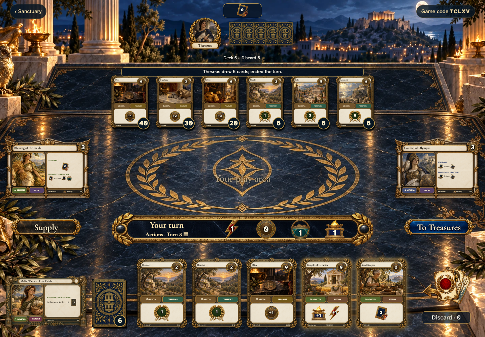
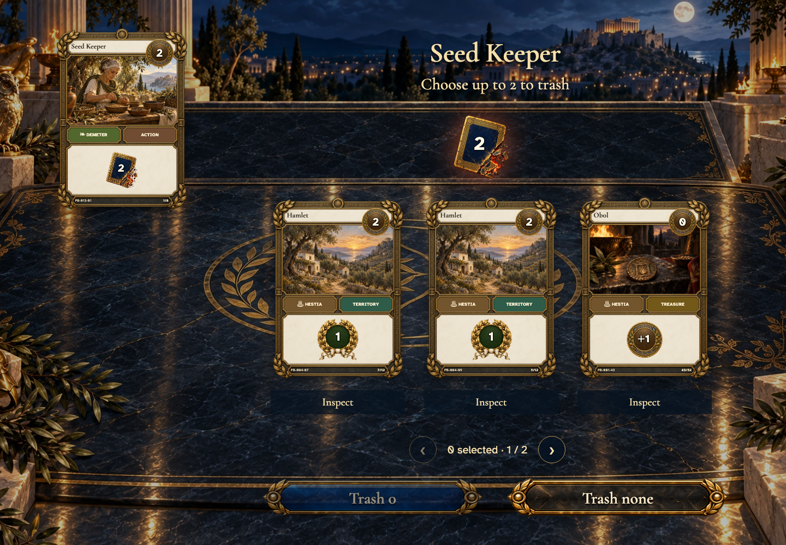
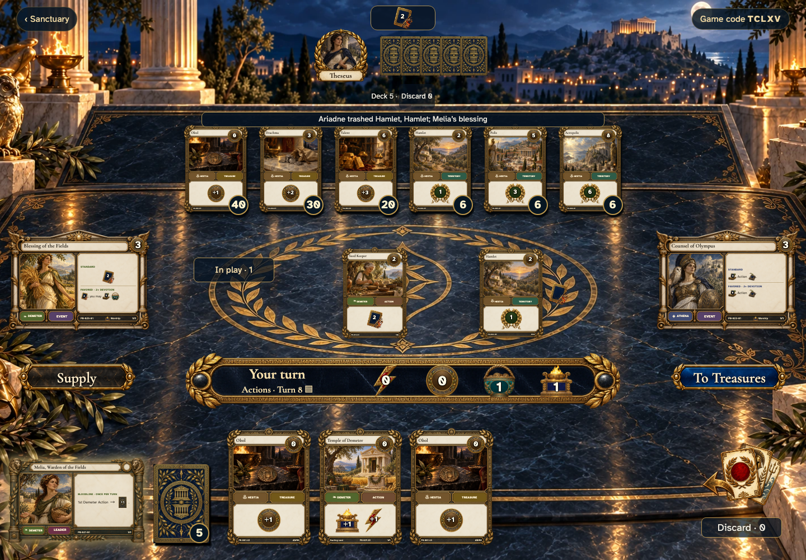
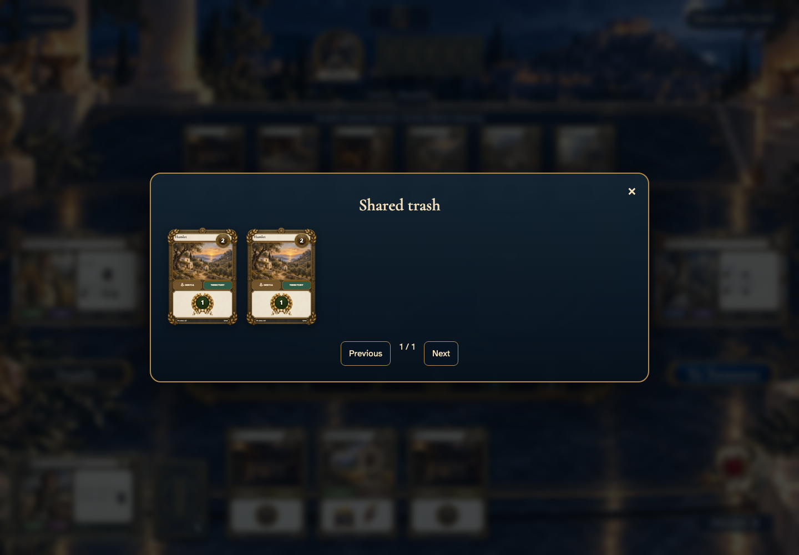

# Play Actions and shape your deck

## Find a playable Action in your hand

- [x] Your hand marks playable Actions and keeps the counters in view.

## Choose cards for Seed Keeper

- [x] Only cards remaining in hand can be selected; trashing is optional.

## Review the selected cards

- [x] The selection glows and the confirmation gives the exact count.

## The chosen cards leave your deck

- [x] Trash is public and Melia draws only after Seed Keeper finishes.

## Inspect the shared trash

- [x] Trashed copies are visible and remain outside every player’s deck.
