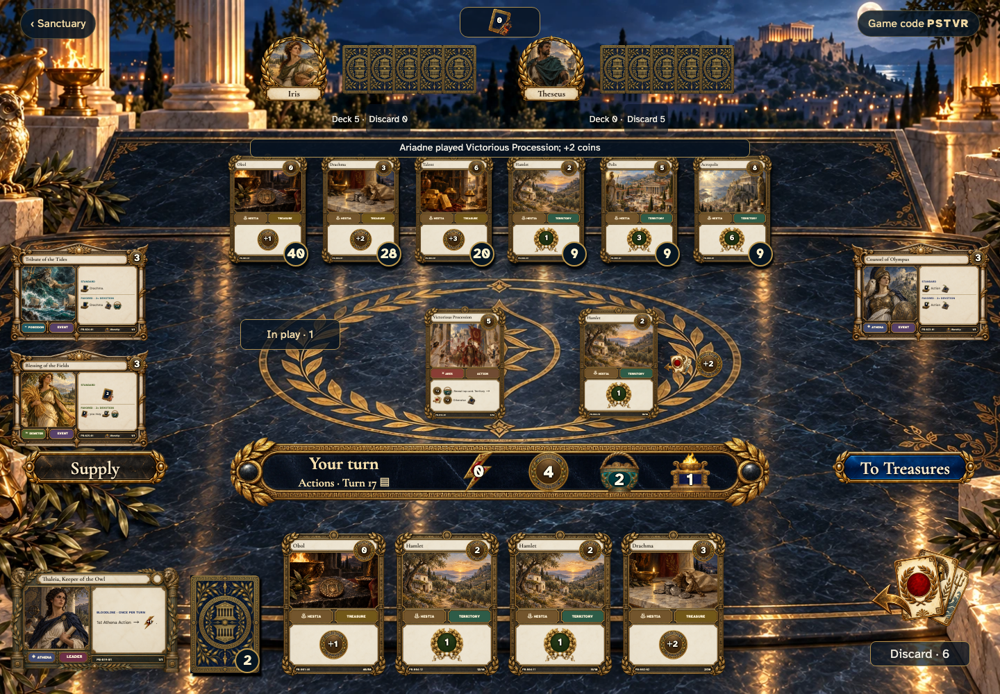

# 3 players can follow a public reveal

Recorded-history integration scenario. A legal event history prepares the starting position directly in the emulator. This verifies the illustrated effect from that position; it does not demonstrate the player journey to reach it.

## Read the effect without covering the other seats

[phone](../../screenshots/3-players-can-follow-a-public-reveal/000-reveal-3-phone-darwin.png) · [desktop](../../screenshots/3-players-can-follow-a-public-reveal/000-reveal-3-desktop-darwin.png) · [tabletop-4k](../../screenshots/3-players-can-follow-a-public-reveal/000-reveal-3-tabletop-4k-darwin.png)

- [x] Every opponent and chosen altar remains visible beside the public result.
