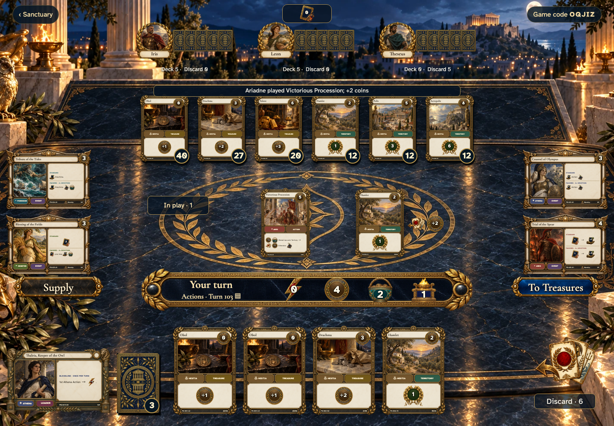
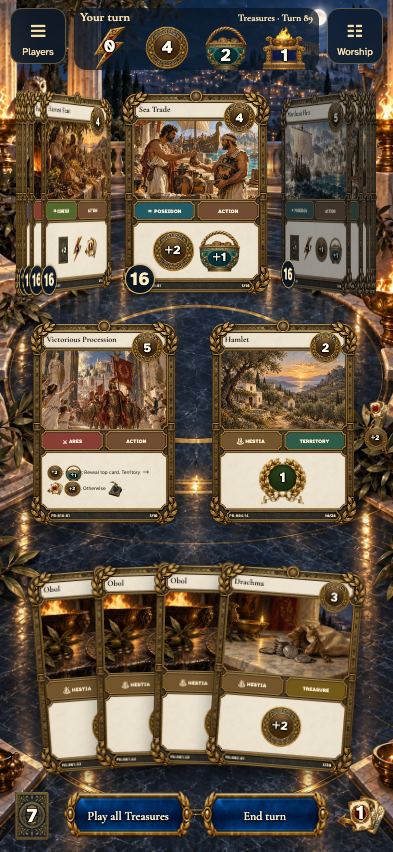
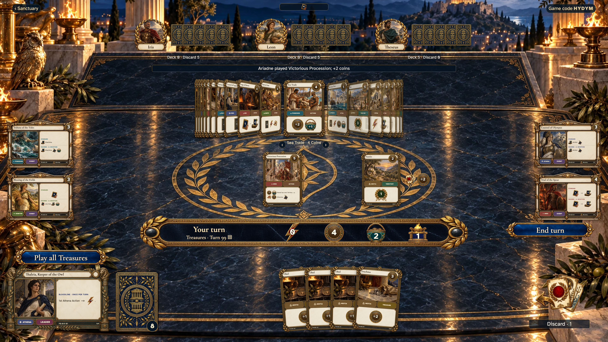

# 4 players can follow a public reveal

Recorded-history integration scenario. A legal event history prepares the starting position directly in the emulator. This verifies the illustrated effect from that position; it does not demonstrate the player journey to reach it.

## Read the effect without covering the other seats

<table>
<tr><th>Desktop · 1440 × 1000</th><th>Phone · 393 × 852</th></tr>
<tr>
<td valign="top"></td>
<td valign="top"></td>
</tr>
</table>

Tabletop · 3840 × 2160 — expand screenshot

- [x] Every opponent and chosen altar remains visible beside the public result.
