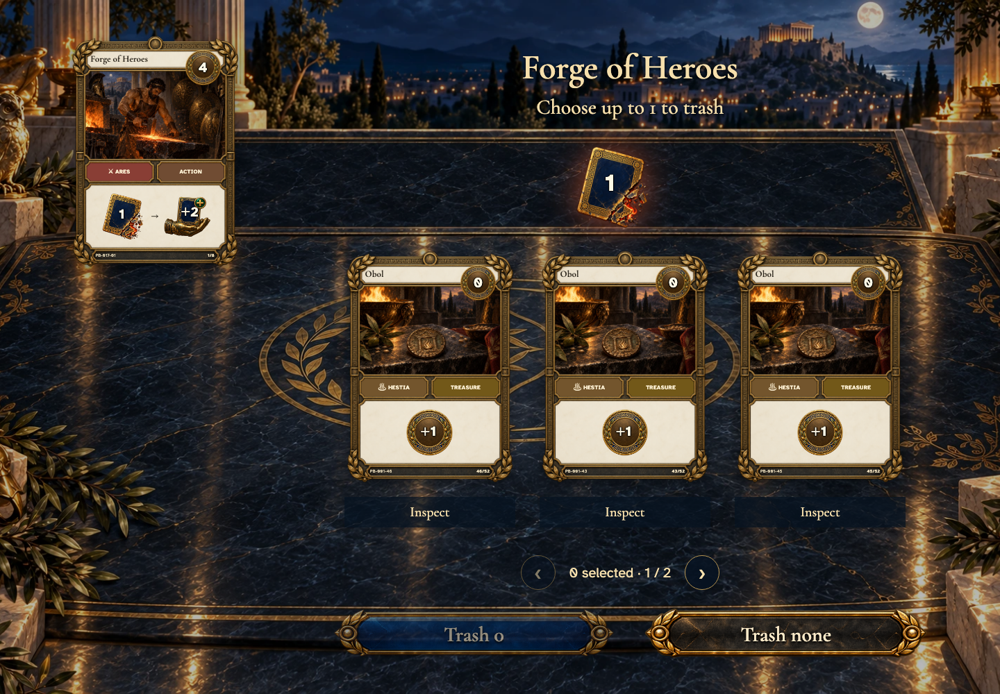
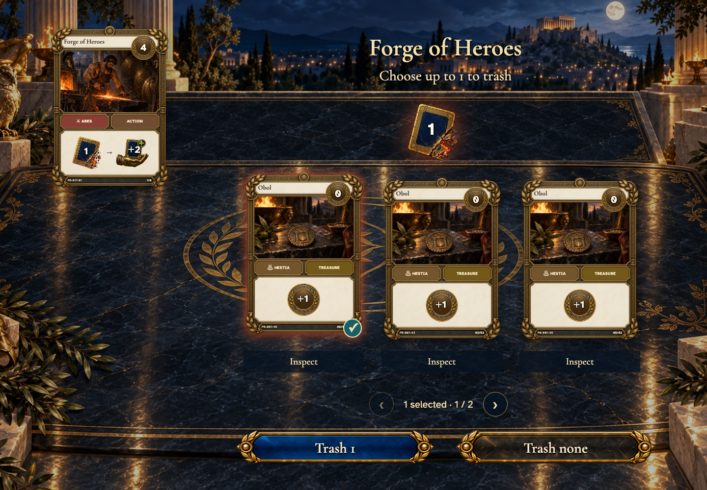
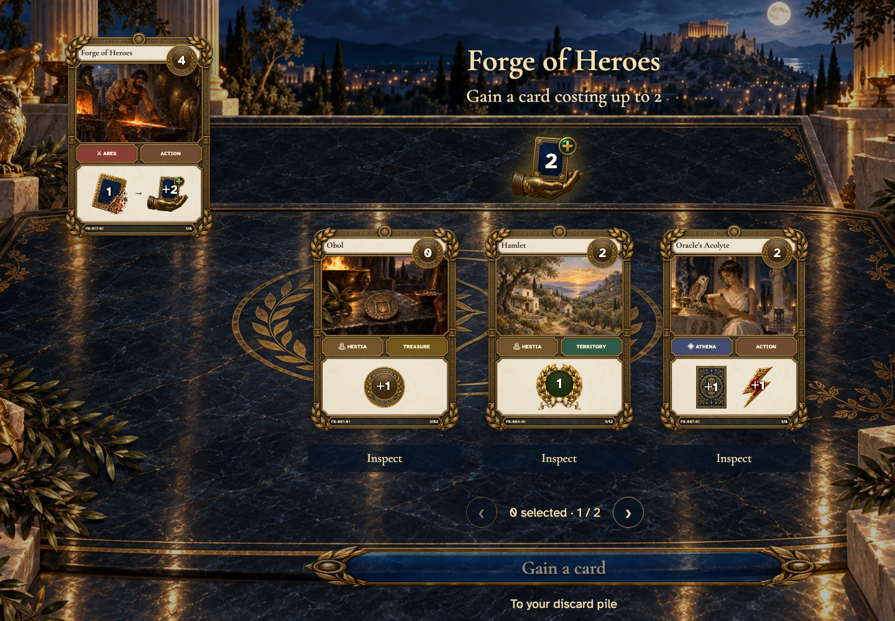
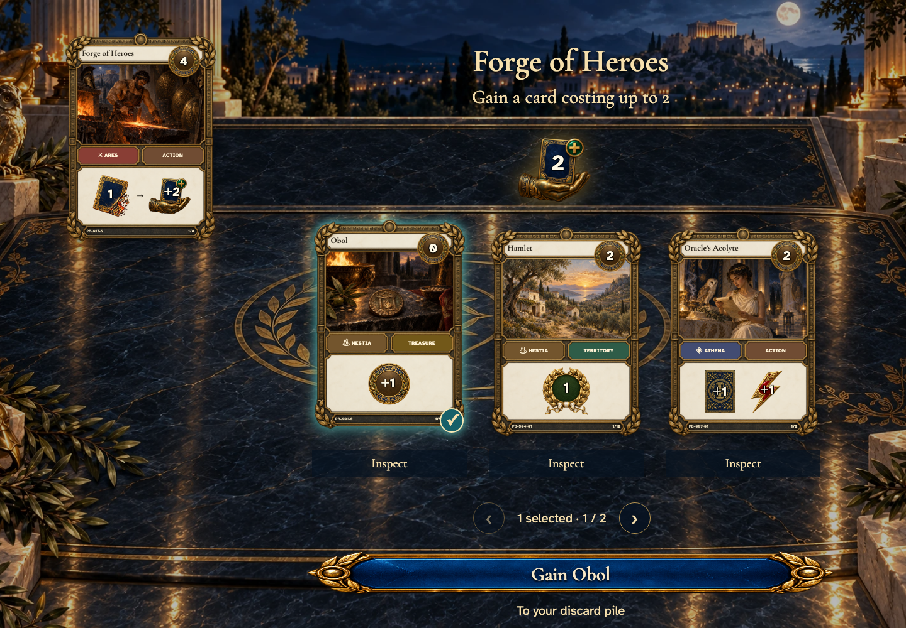
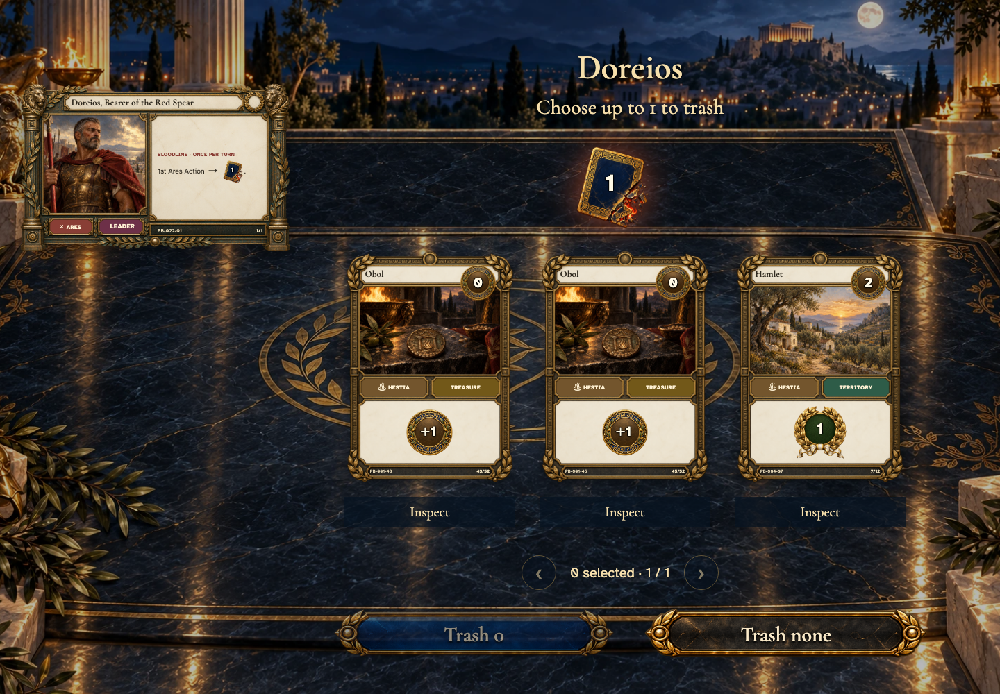
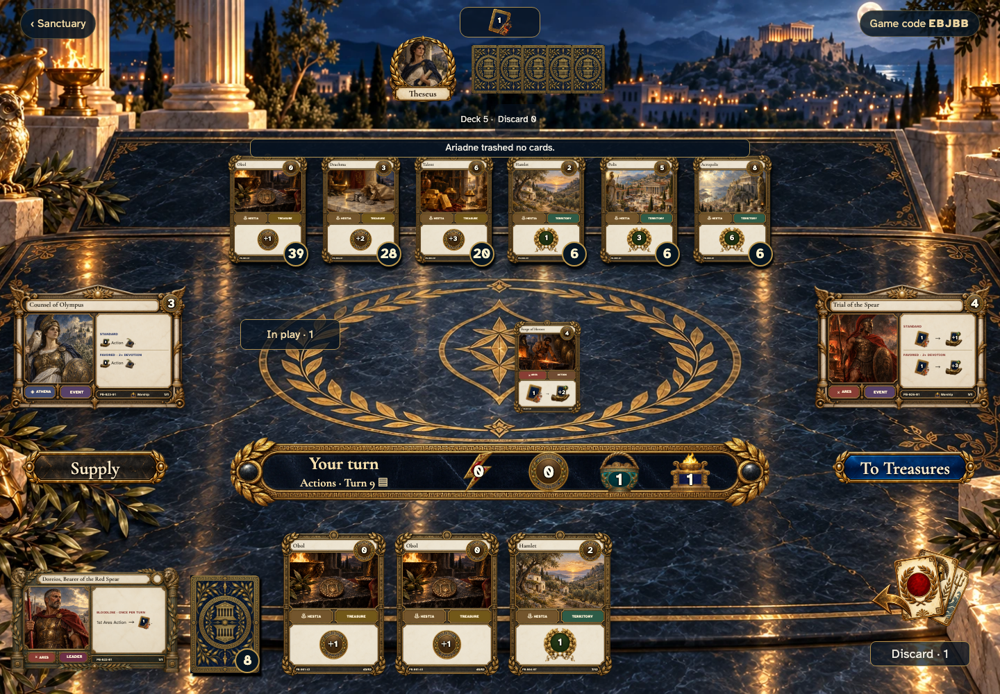

# Forge gains a cheaper card before Doreios offers his separate choice

Recorded-history integration scenario. A legal event history prepares the starting position directly in the emulator. This verifies the illustrated effect from that position; it does not demonstrate the player journey to reach it.

## Choose what to forge

[phone](../../screenshots/forge-gains-a-cheaper-card-before-doreios-offers-his-separate-choice/000-forge-trash-phone-darwin.png) · [desktop](../../screenshots/forge-gains-a-cheaper-card-before-doreios-offers-his-separate-choice/000-forge-trash-desktop-darwin.png) · [tabletop-4k](../../screenshots/forge-gains-a-cheaper-card-before-doreios-offers-his-separate-choice/000-forge-trash-tabletop-4k-darwin.png)

- [x] Trashing is optional before choosing a replacement.

## Review the card being replaced

[phone](../../screenshots/forge-gains-a-cheaper-card-before-doreios-offers-his-separate-choice/001-forge-selected-phone-darwin.png) · [desktop](../../screenshots/forge-gains-a-cheaper-card-before-doreios-offers-his-separate-choice/001-forge-selected-desktop-darwin.png) · [tabletop-4k](../../screenshots/forge-gains-a-cheaper-card-before-doreios-offers-his-separate-choice/001-forge-selected-tabletop-4k-darwin.png)

- [x] One selected card enables the trash confirmation.

## Choose a replacement within the cost limit

[phone](../../screenshots/forge-gains-a-cheaper-card-before-doreios-offers-his-separate-choice/002-gain-choice-phone-darwin.png) · [desktop](../../screenshots/forge-gains-a-cheaper-card-before-doreios-offers-his-separate-choice/002-gain-choice-desktop-darwin.png) · [tabletop-4k](../../screenshots/forge-gains-a-cheaper-card-before-doreios-offers-his-separate-choice/002-gain-choice-tabletop-4k-darwin.png)

- [x] The gain uses actual nonempty supply piles and sends the card to discard.

## A cheaper card is a legal gain

[phone](../../screenshots/forge-gains-a-cheaper-card-before-doreios-offers-his-separate-choice/003-gain-selected-phone-darwin.png) · [desktop](../../screenshots/forge-gains-a-cheaper-card-before-doreios-offers-his-separate-choice/003-gain-selected-desktop-darwin.png) · [tabletop-4k](../../screenshots/forge-gains-a-cheaper-card-before-doreios-offers-his-separate-choice/003-gain-selected-tabletop-4k-darwin.png)

- [x] A cost-zero Obol can replace the trashed card without spending a Buy.

## Finish Doreios’s blessing

[phone](../../screenshots/forge-gains-a-cheaper-card-before-doreios-offers-his-separate-choice/004-leader-choice-phone-darwin.png) · [desktop](../../screenshots/forge-gains-a-cheaper-card-before-doreios-offers-his-separate-choice/004-leader-choice-desktop-darwin.png) · [tabletop-4k](../../screenshots/forge-gains-a-cheaper-card-before-doreios-offers-his-separate-choice/004-leader-choice-tabletop-4k-darwin.png)

- [x] The leader offers a separate optional trash only after the gain.

## Return to the table with the replacement

[phone](../../screenshots/forge-gains-a-cheaper-card-before-doreios-offers-his-separate-choice/005-forge-finished-phone-darwin.png) · [desktop](../../screenshots/forge-gains-a-cheaper-card-before-doreios-offers-his-separate-choice/005-forge-finished-desktop-darwin.png) · [tabletop-4k](../../screenshots/forge-gains-a-cheaper-card-before-doreios-offers-his-separate-choice/005-forge-finished-tabletop-4k-darwin.png)

- [x] Both choices are complete and the Action turn continues.
