# Forge gains a cheaper card before Doreios offers his separate choice

Recorded-history integration scenario. A legal event history prepares the starting position directly in the emulator. This verifies the illustrated effect from that position; it does not demonstrate the player journey to reach it.

## Choose what to forge

<table>
<tr><th>Desktop · 1440 × 1000</th><th>Phone · 393 × 852</th></tr>
<tr>
<td valign="top"></td>
<td valign="top"><a href="../../screenshots/forge-gains-a-cheaper-card-before-doreios-offers-his-separate-choice/000-forge-trash-phone-darwin.png">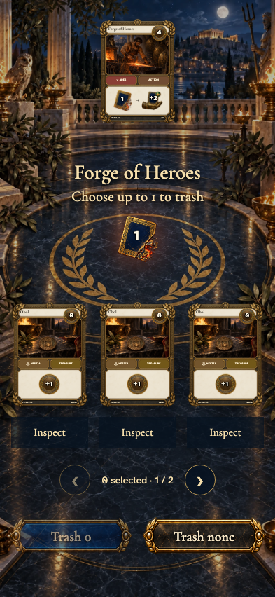</a></td>
</tr>
</table>

Tabletop · 3840 × 2160 — expand screenshot

<a href="../../screenshots/forge-gains-a-cheaper-card-before-doreios-offers-his-separate-choice/000-forge-trash-tabletop-4k-darwin.png">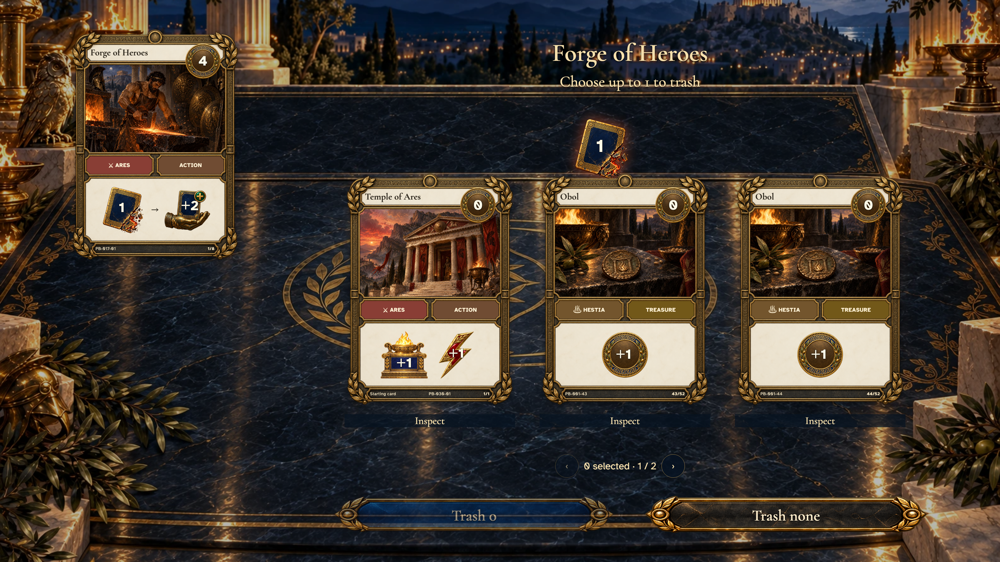</a>

- [x] Trashing is optional before choosing a replacement.

## Review the card being replaced

<table>
<tr><th>Desktop · 1440 × 1000</th><th>Phone · 393 × 852</th></tr>
<tr>
<td valign="top"></td>
<td valign="top"><a href="../../screenshots/forge-gains-a-cheaper-card-before-doreios-offers-his-separate-choice/001-forge-selected-phone-darwin.png">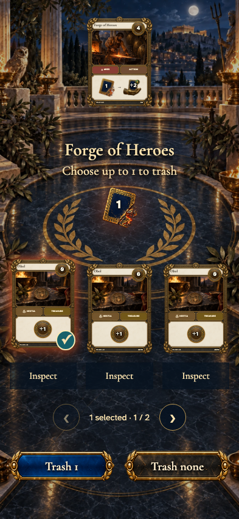</a></td>
</tr>
</table>

Tabletop · 3840 × 2160 — expand screenshot

<a href="../../screenshots/forge-gains-a-cheaper-card-before-doreios-offers-his-separate-choice/001-forge-selected-tabletop-4k-darwin.png">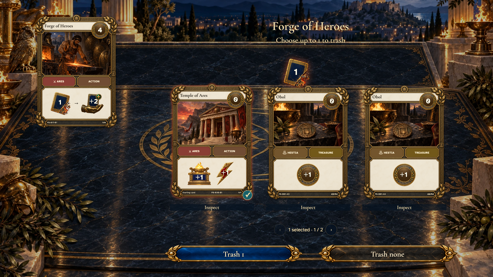</a>

- [x] One selected card enables the trash confirmation.

## Choose a replacement within the cost limit

<table>
<tr><th>Desktop · 1440 × 1000</th><th>Phone · 393 × 852</th></tr>
<tr>
<td valign="top"></td>
<td valign="top"><a href="../../screenshots/forge-gains-a-cheaper-card-before-doreios-offers-his-separate-choice/002-gain-choice-phone-darwin.png">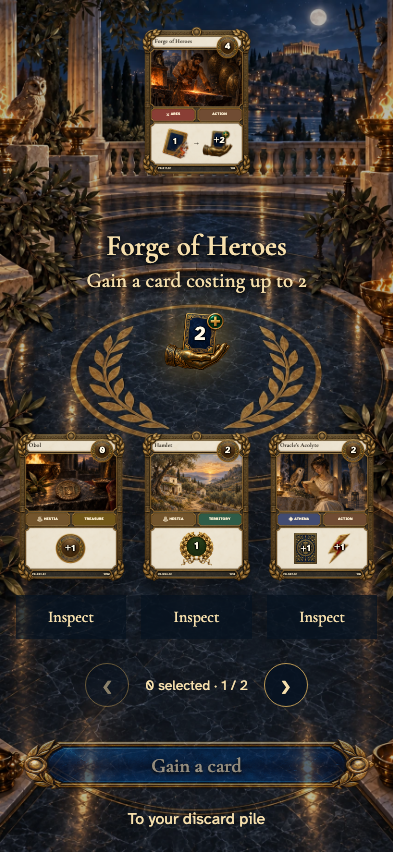</a></td>
</tr>
</table>

Tabletop · 3840 × 2160 — expand screenshot

- [x] The gain uses actual nonempty supply piles and sends the card to discard.

## A cheaper card is a legal gain

<table>
<tr><th>Desktop · 1440 × 1000</th><th>Phone · 393 × 852</th></tr>
<tr>
<td valign="top"></td>
<td valign="top"><a href="../../screenshots/forge-gains-a-cheaper-card-before-doreios-offers-his-separate-choice/003-gain-selected-phone-darwin.png">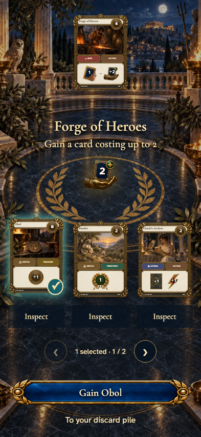</a></td>
</tr>
</table>

Tabletop · 3840 × 2160 — expand screenshot

<a href="../../screenshots/forge-gains-a-cheaper-card-before-doreios-offers-his-separate-choice/003-gain-selected-tabletop-4k-darwin.png">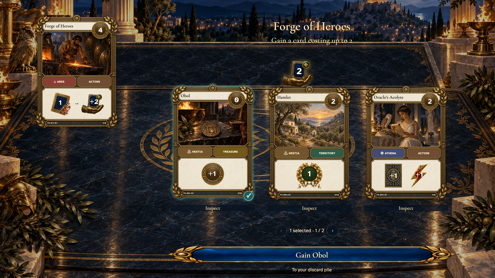</a>

- [x] A cost-zero Obol can replace the trashed card without spending a Buy.

## Finish Doreios’s blessing

<table>
<tr><th>Desktop · 1440 × 1000</th><th>Phone · 393 × 852</th></tr>
<tr>
<td valign="top"></td>
<td valign="top"><a href="../../screenshots/forge-gains-a-cheaper-card-before-doreios-offers-his-separate-choice/004-leader-choice-phone-darwin.png">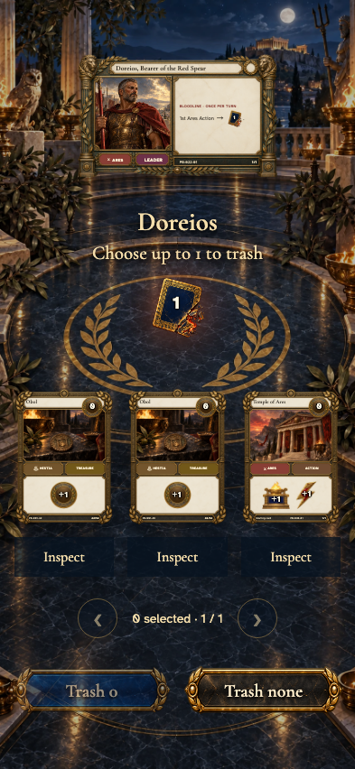</a></td>
</tr>
</table>

Tabletop · 3840 × 2160 — expand screenshot

<a href="../../screenshots/forge-gains-a-cheaper-card-before-doreios-offers-his-separate-choice/004-leader-choice-tabletop-4k-darwin.png">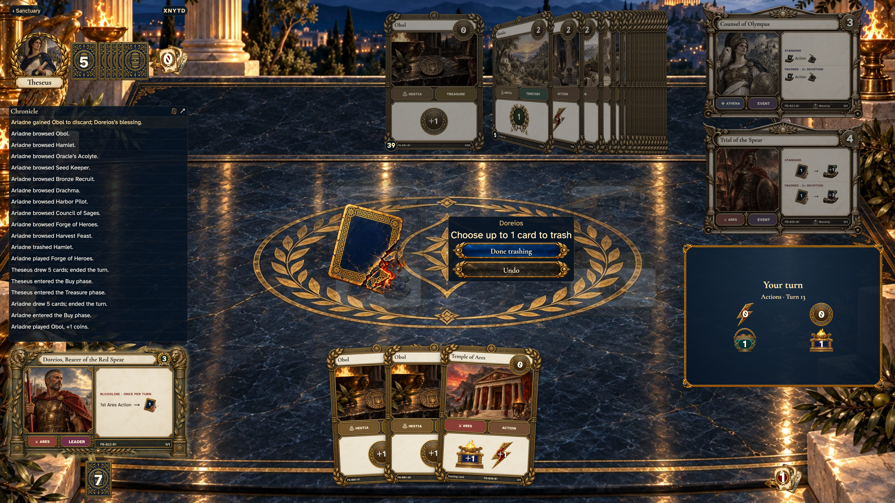</a>

- [x] The leader offers a separate optional trash only after the gain.

## Return to the table with the replacement

<table>
<tr><th>Desktop · 1440 × 1000</th><th>Phone · 393 × 852</th></tr>
<tr>
<td valign="top"></td>
<td valign="top"><a href="../../screenshots/forge-gains-a-cheaper-card-before-doreios-offers-his-separate-choice/005-forge-finished-phone-darwin.png">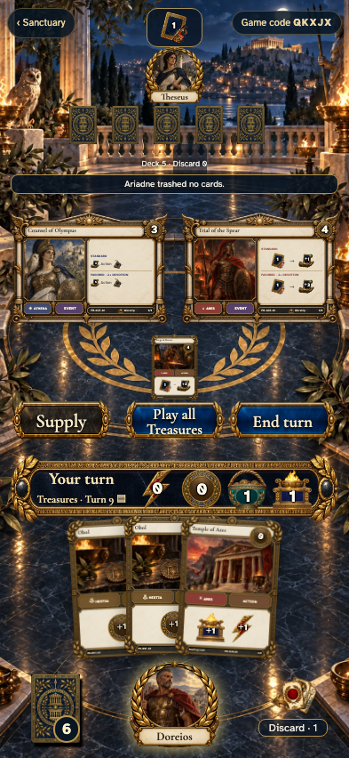</a></td>
</tr>
</table>

Tabletop · 3840 × 2160 — expand screenshot

<a href="../../screenshots/forge-gains-a-cheaper-card-before-doreios-offers-his-separate-choice/005-forge-finished-tabletop-4k-darwin.png">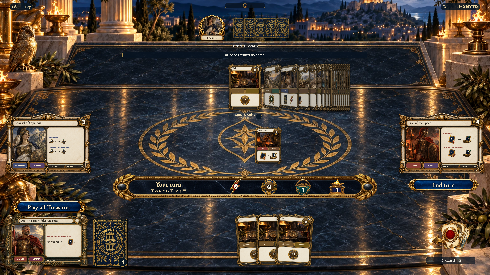</a>

- [x] Both choices are complete and control returns to the table.
