# Forge gains a cheaper card before Doreios offers his separate choice

Recorded-history integration scenario. A legal event history prepares the starting position directly in the emulator. This verifies the illustrated effect from that position; it does not demonstrate the player journey to reach it.

## Ariadne holds Forge and a Hamlet to replace

<table>
<tr><th>Desktop · 1440 × 1000</th><th>Phone · 393 × 852</th></tr>
<tr>
<td valign="top"><a href="../../screenshots/forge-gains-a-cheaper-card-before-doreios-offers-his-separate-choice/000-opening-desktop-darwin.png">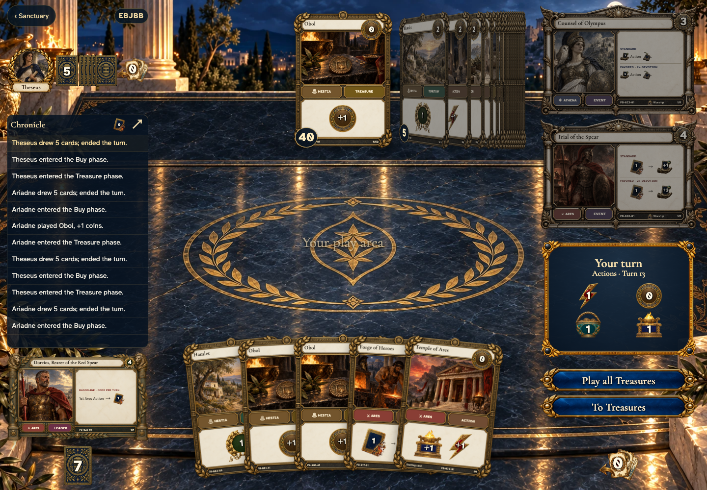</a></td>
<td valign="top"><a href="../../screenshots/forge-gains-a-cheaper-card-before-doreios-offers-his-separate-choice/000-opening-phone-darwin.png">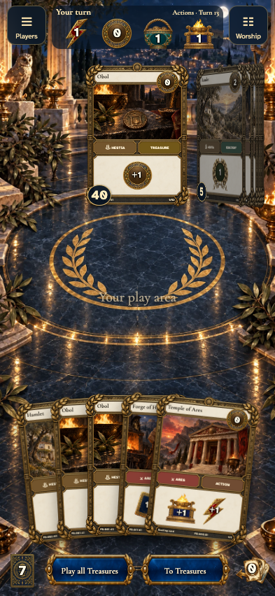</a></td>
</tr>
</table>

Tabletop · 3840 × 2160 — expand screenshot

<a href="../../screenshots/forge-gains-a-cheaper-card-before-doreios-offers-his-separate-choice/000-opening-tabletop-4k-darwin.png">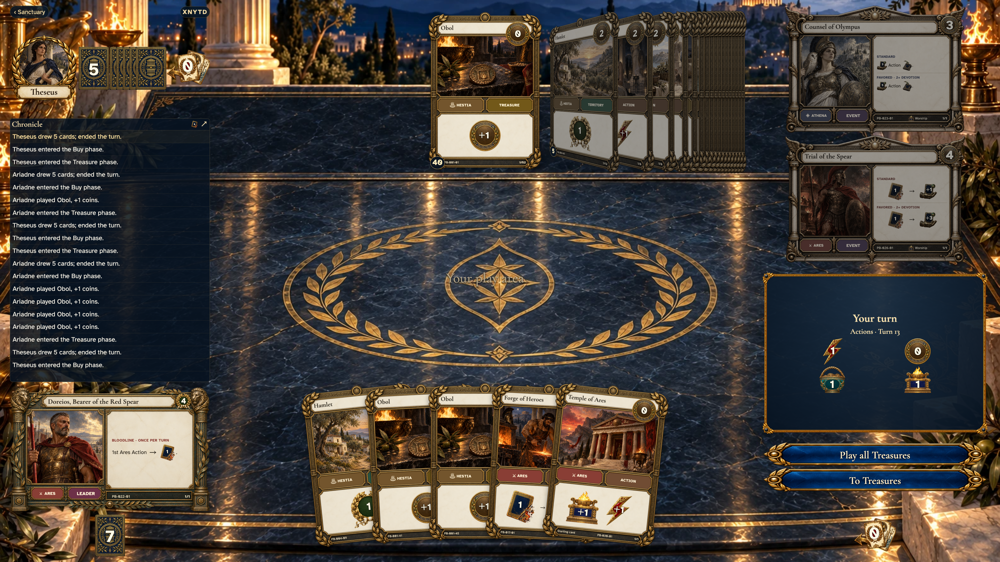</a>

- [x] Ariadne holds Forge and a Hamlet to replace

## Choose a card from the hand or stop without trashing

<table>
<tr><th>Desktop · 1440 × 1000</th><th>Phone · 393 × 852</th></tr>
<tr>
<td valign="top"><a href="../../screenshots/forge-gains-a-cheaper-card-before-doreios-offers-his-separate-choice/001-forge-trash-desktop-darwin.png">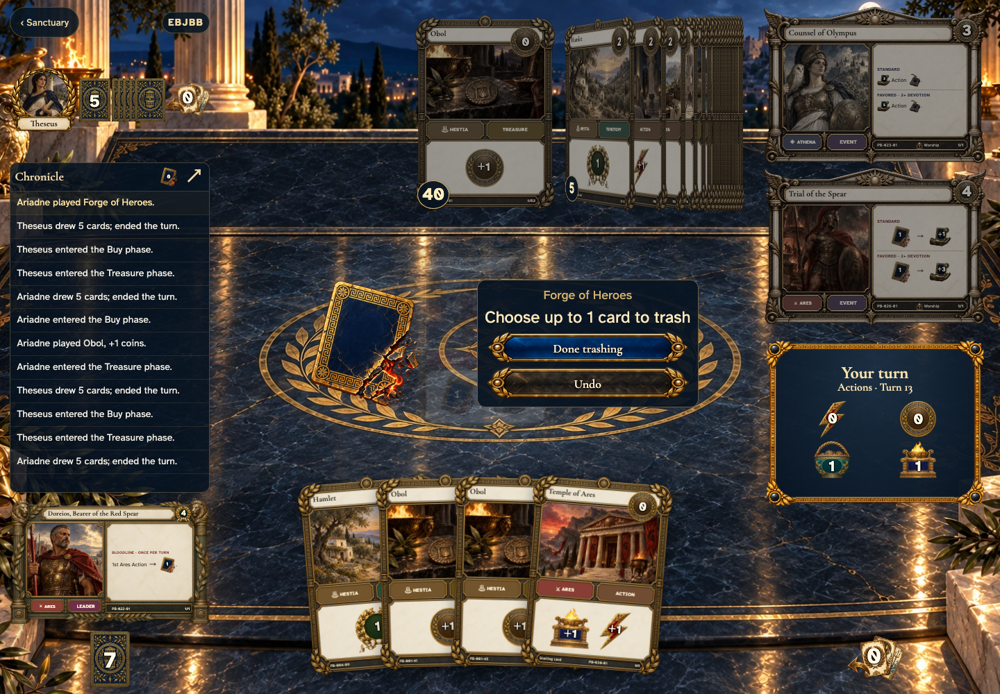</a></td>
<td valign="top"><a href="../../screenshots/forge-gains-a-cheaper-card-before-doreios-offers-his-separate-choice/001-forge-trash-phone-darwin.png">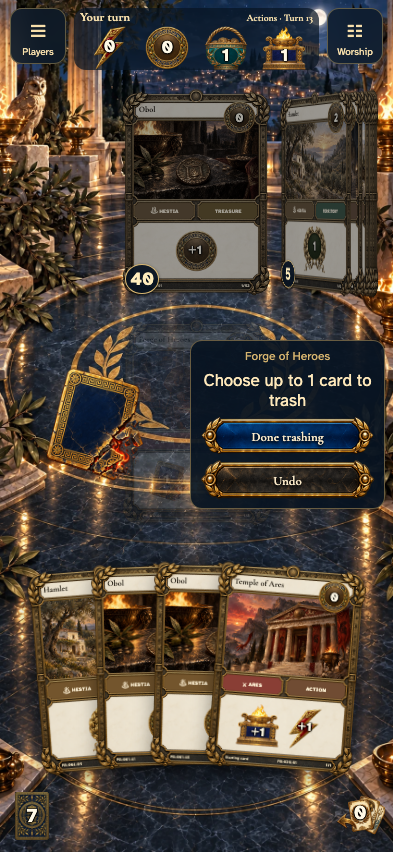</a></td>
</tr>
</table>

Tabletop · 3840 × 2160 — expand screenshot

<a href="../../screenshots/forge-gains-a-cheaper-card-before-doreios-offers-his-separate-choice/001-forge-trash-tabletop-4k-darwin.png">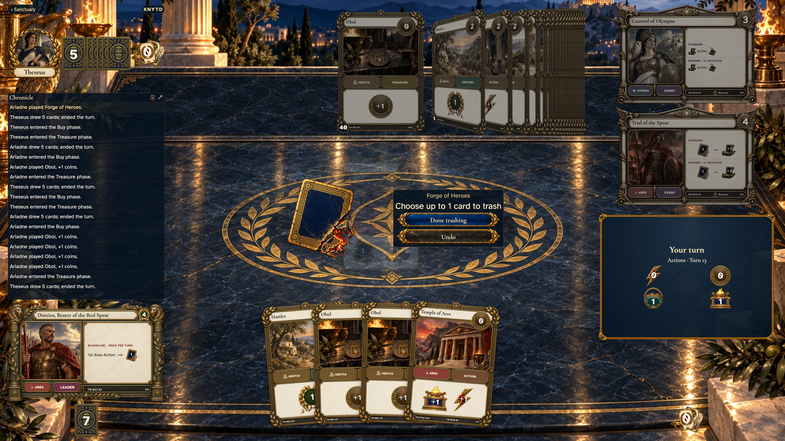</a>

- [x] Choose a card from the hand or stop without trashing

## Trashing the Hamlet opens the market at its most valuable legal gain

<table>
<tr><th>Desktop · 1440 × 1000</th><th>Phone · 393 × 852</th></tr>
<tr>
<td valign="top"></td>
<td valign="top"></td>
</tr>
</table>

Tabletop · 3840 × 2160 — expand screenshot

- [x] Trashing the Hamlet opens the market at its most valuable legal gain

## A cheaper Obol is also available without spending a Buy

<table>
<tr><th>Desktop · 1440 × 1000</th><th>Phone · 393 × 852</th></tr>
<tr>
<td valign="top"><a href="../../screenshots/forge-gains-a-cheaper-card-before-doreios-offers-his-separate-choice/003-cheaper-desktop-darwin.png">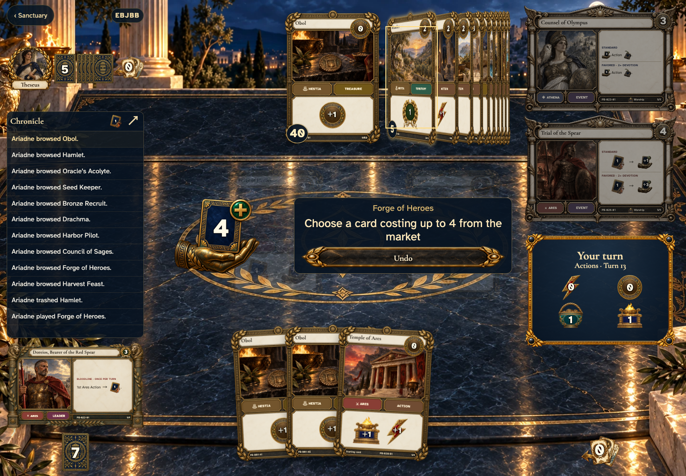</a></td>
<td valign="top"><a href="../../screenshots/forge-gains-a-cheaper-card-before-doreios-offers-his-separate-choice/003-cheaper-phone-darwin.png">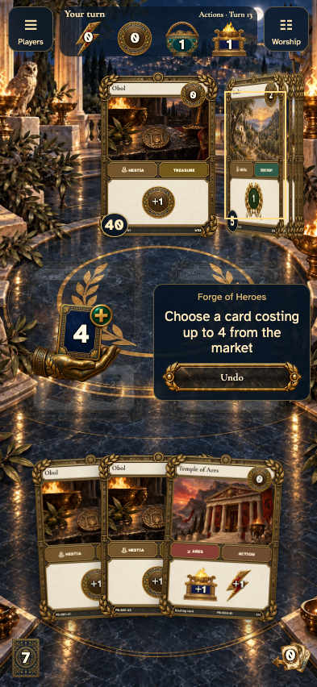</a></td>
</tr>
</table>

Tabletop · 3840 × 2160 — expand screenshot

<a href="../../screenshots/forge-gains-a-cheaper-card-before-doreios-offers-his-separate-choice/003-cheaper-tabletop-4k-darwin.png">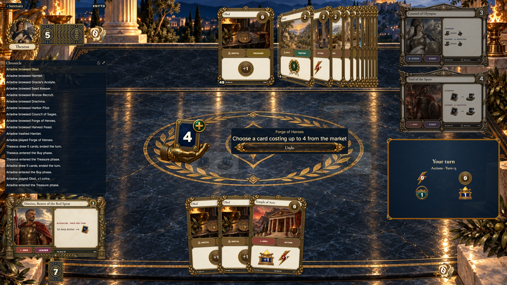</a>

- [x] A cheaper Obol is also available without spending a Buy

## Doreios offers his separate optional trash after the gain

<table>
<tr><th>Desktop · 1440 × 1000</th><th>Phone · 393 × 852</th></tr>
<tr>
<td valign="top"></td>
<td valign="top"></td>
</tr>
</table>

Tabletop · 3840 × 2160 — expand screenshot

- [x] Doreios offers his separate optional trash after the gain

## The Forge and blessing finish on the same table

<table>
<tr><th>Desktop · 1440 × 1000</th><th>Phone · 393 × 852</th></tr>
<tr>
<td valign="top"><a href="../../screenshots/forge-gains-a-cheaper-card-before-doreios-offers-his-separate-choice/005-finished-desktop-darwin.png">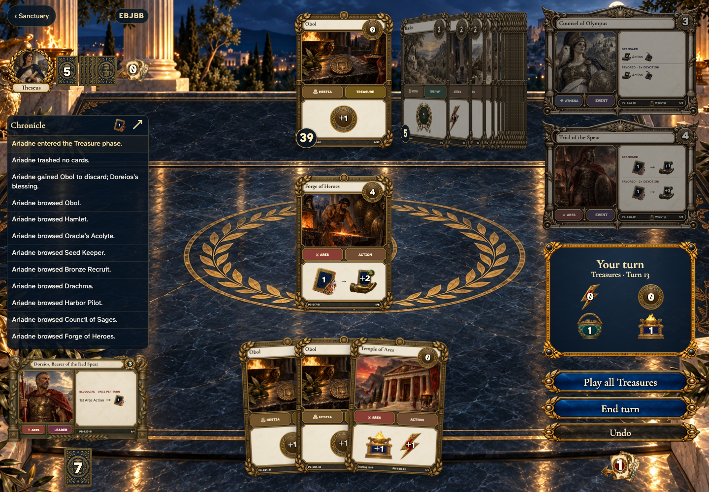</a></td>
<td valign="top"><a href="../../screenshots/forge-gains-a-cheaper-card-before-doreios-offers-his-separate-choice/005-finished-phone-darwin.png">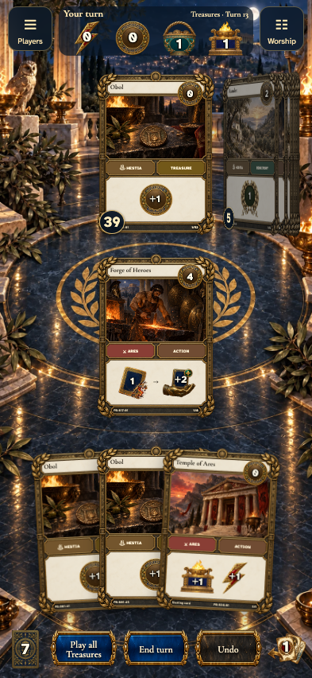</a></td>
</tr>
</table>

Tabletop · 3840 × 2160 — expand screenshot

<a href="../../screenshots/forge-gains-a-cheaper-card-before-doreios-offers-his-separate-choice/005-finished-tabletop-4k-darwin.png">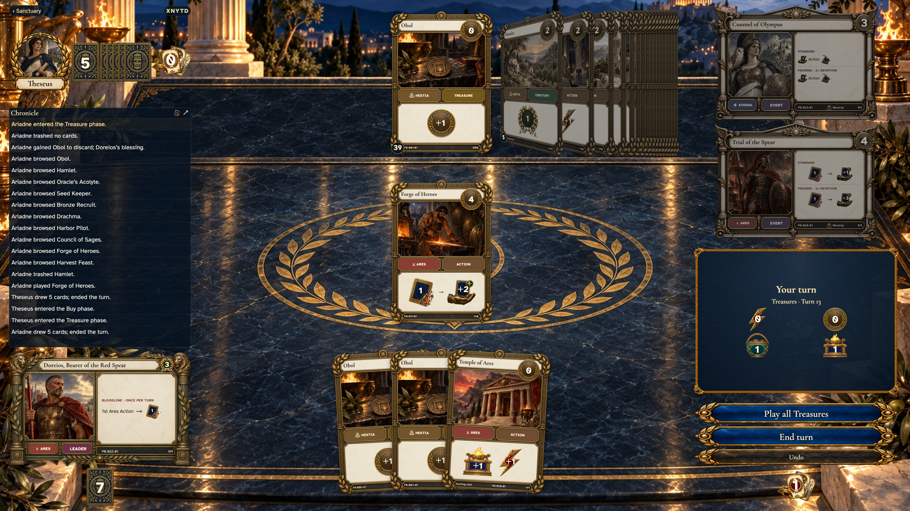</a>

- [x] The Forge and blessing finish on the same table
