# Harvest Feast requires a discard after drawing and fits the expanded hand in a fan

Recorded-history integration scenario. A legal event history prepares the starting position directly in the emulator. This verifies the illustrated effect from that position; it does not demonstrate the player journey to reach it.

## Play Harvest Feast from the existing hand

<table>
<tr><th>Desktop · 1440 × 1000</th><th>Phone · 393 × 852</th></tr>
<tr>
<td valign="top"><a href="../../screenshots/harvest-feast-requires-a-discard-after-drawing-and-fits-the-expanded-hand-in-a-fan/000-opening-desktop-darwin.png">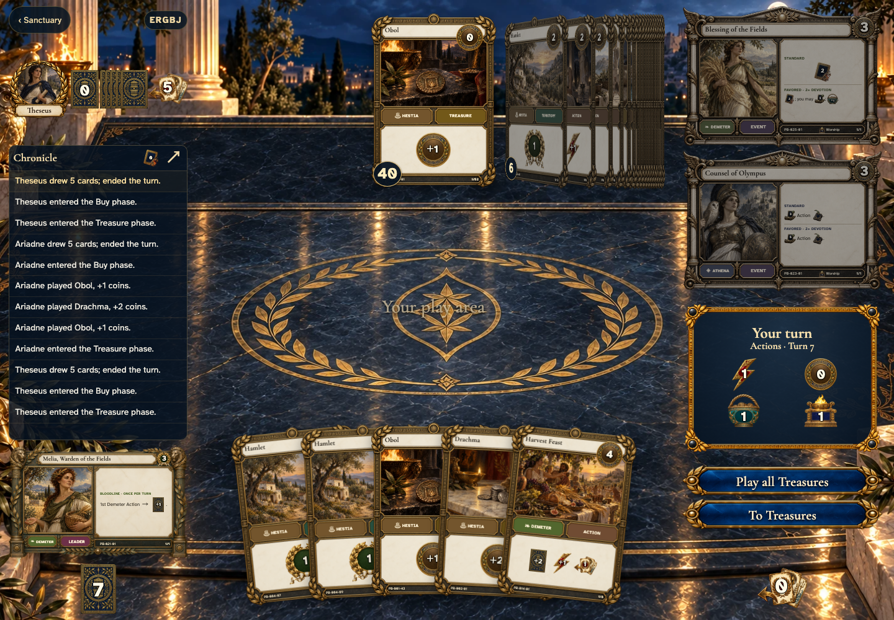</a></td>
<td valign="top"><a href="../../screenshots/harvest-feast-requires-a-discard-after-drawing-and-fits-the-expanded-hand-in-a-fan/000-opening-phone-darwin.png">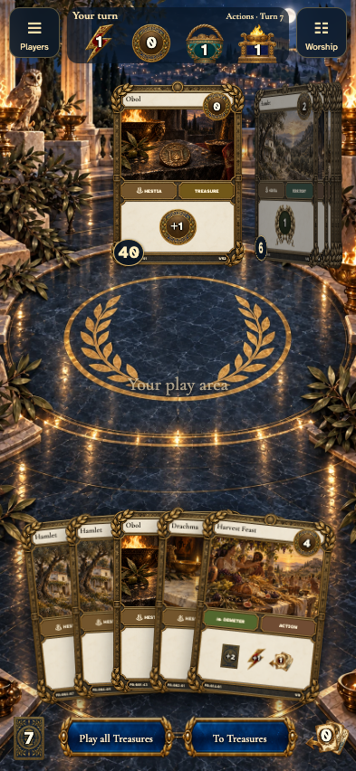</a></td>
</tr>
</table>

Tabletop · 3840 × 2160 — expand screenshot

<a href="../../screenshots/harvest-feast-requires-a-discard-after-drawing-and-fits-the-expanded-hand-in-a-fan/000-opening-tabletop-4k-darwin.png">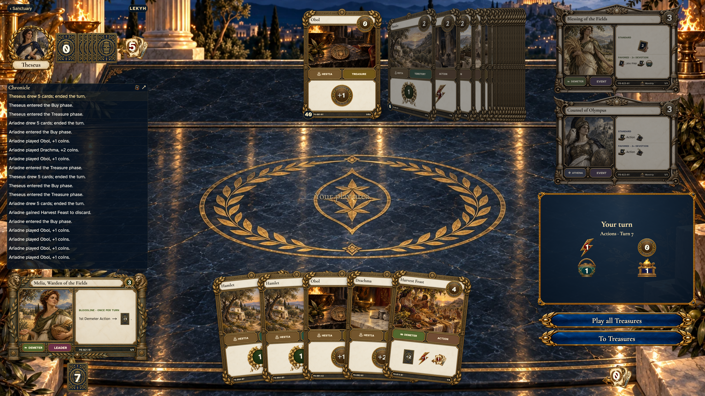</a>

- [x] Harvest Feast is playable.

## Draw two cards and choose a discard directly from the fan

<table>
<tr><th>Desktop · 1440 × 1000</th><th>Phone · 393 × 852</th></tr>
<tr>
<td valign="top"><a href="../../screenshots/harvest-feast-requires-a-discard-after-drawing-and-fits-the-expanded-hand-in-a-fan/001-mandatory-discard-desktop-darwin.png">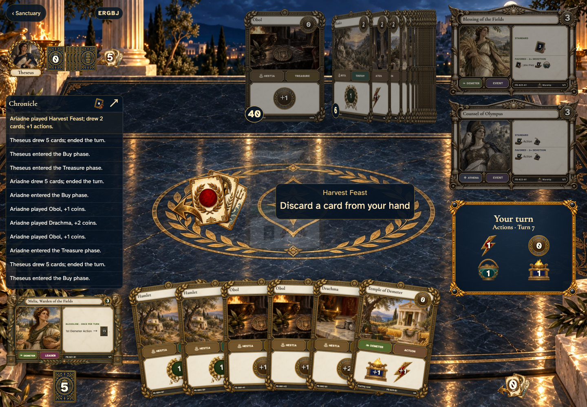</a></td>
<td valign="top"><a href="../../screenshots/harvest-feast-requires-a-discard-after-drawing-and-fits-the-expanded-hand-in-a-fan/001-mandatory-discard-phone-darwin.png">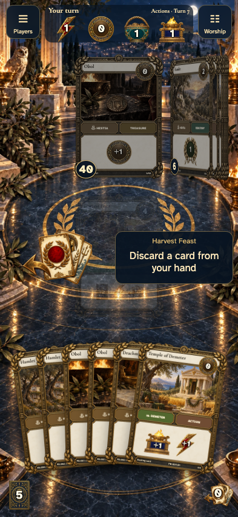</a></td>
</tr>
</table>

Tabletop · 3840 × 2160 — expand screenshot

<a href="../../screenshots/harvest-feast-requires-a-discard-after-drawing-and-fits-the-expanded-hand-in-a-fan/001-mandatory-discard-tabletop-4k-darwin.png">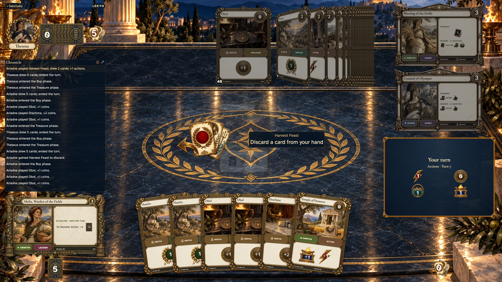</a>

- [x] Six hand cards remain visible beside the discard target, with no skip or modal.

## The selected card is discarded and Melia draws afterward

<table>
<tr><th>Desktop · 1440 × 1000</th><th>Phone · 393 × 852</th></tr>
<tr>
<td valign="top"><a href="../../screenshots/harvest-feast-requires-a-discard-after-drawing-and-fits-the-expanded-hand-in-a-fan/002-expanded-hand-desktop-darwin.png">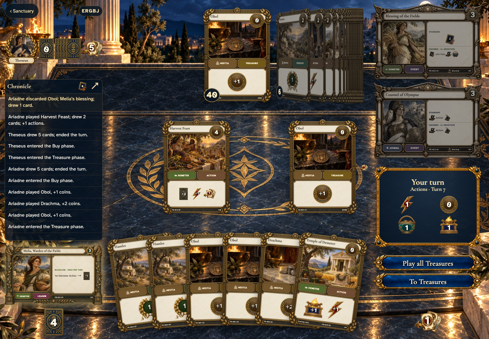</a></td>
<td valign="top"><a href="../../screenshots/harvest-feast-requires-a-discard-after-drawing-and-fits-the-expanded-hand-in-a-fan/002-expanded-hand-phone-darwin.png">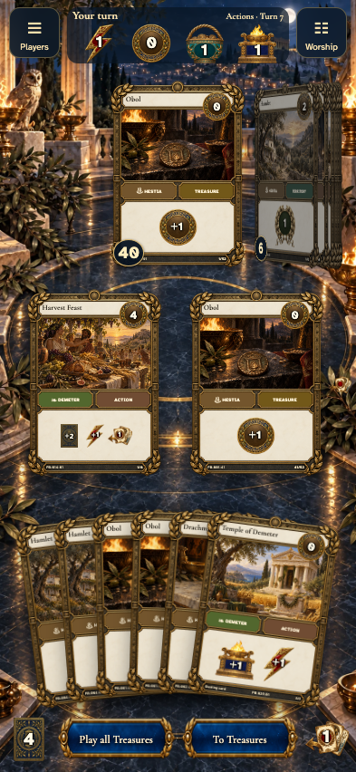</a></td>
</tr>
</table>

Tabletop · 3840 × 2160 — expand screenshot

<a href="../../screenshots/harvest-feast-requires-a-discard-after-drawing-and-fits-the-expanded-hand-in-a-fan/002-expanded-hand-tabletop-4k-darwin.png">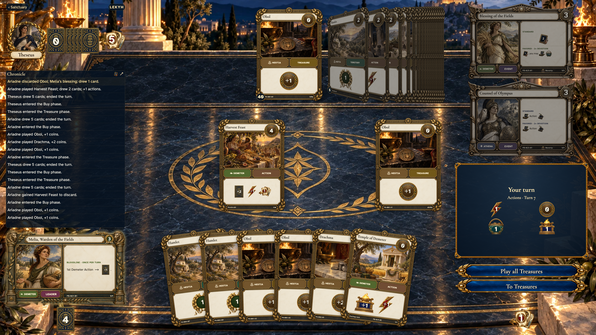</a>

- [x] The six-card fan remains usable without a separate choice screen.

## Read the last card in the expanded fan

<table>
<tr><th>Desktop · 1440 × 1000</th><th>Phone · 393 × 852</th></tr>
<tr>
<td valign="top"><a href="../../screenshots/harvest-feast-requires-a-discard-after-drawing-and-fits-the-expanded-hand-in-a-fan/003-last-card-desktop-darwin.png">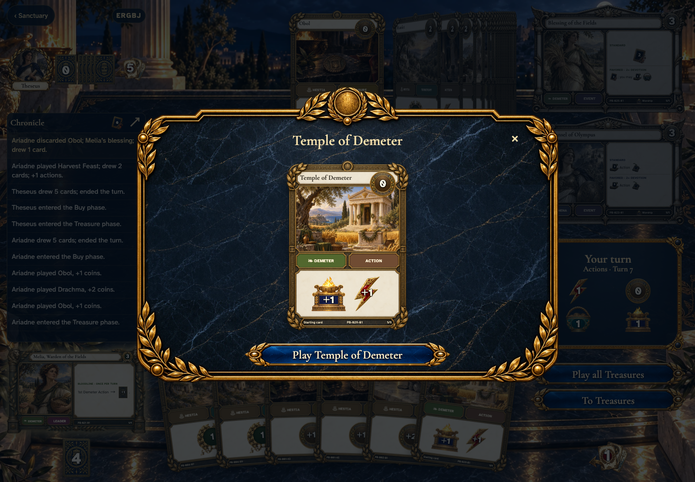</a></td>
<td valign="top"><a href="../../screenshots/harvest-feast-requires-a-discard-after-drawing-and-fits-the-expanded-hand-in-a-fan/003-last-card-phone-darwin.png">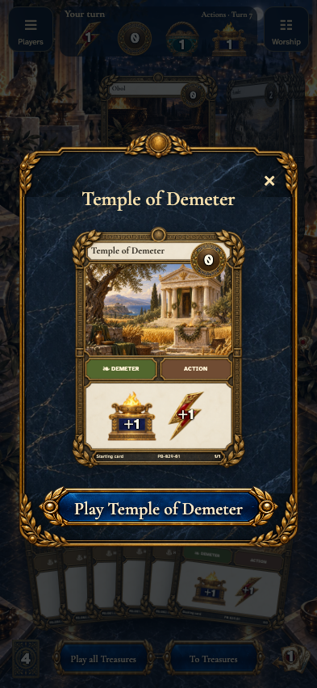</a></td>
</tr>
</table>

Tabletop · 3840 × 2160 — expand screenshot

<a href="../../screenshots/harvest-feast-requires-a-discard-after-drawing-and-fits-the-expanded-hand-in-a-fan/003-last-card-tabletop-4k-darwin.png">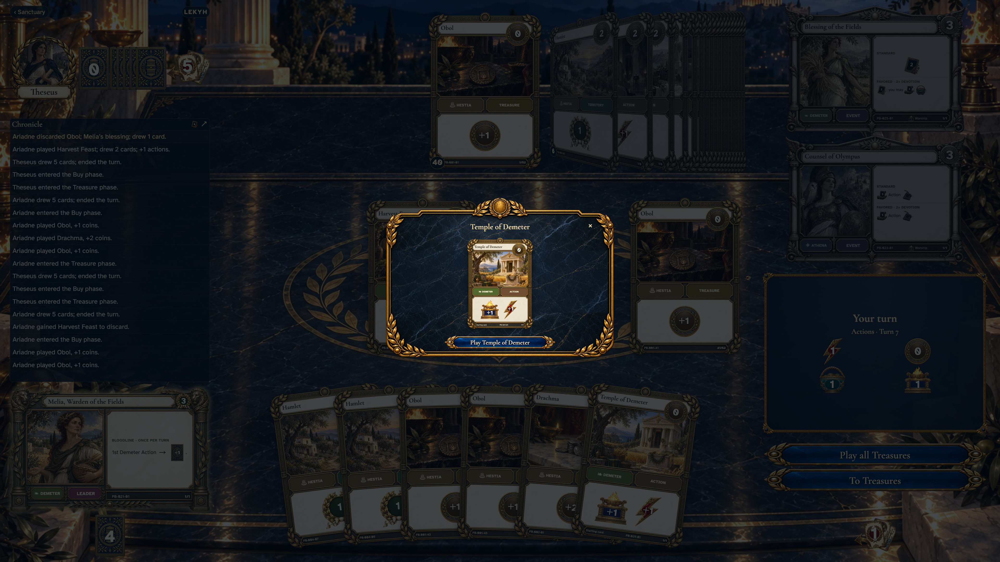</a>

- [x] The card inspector displays the actual card.
