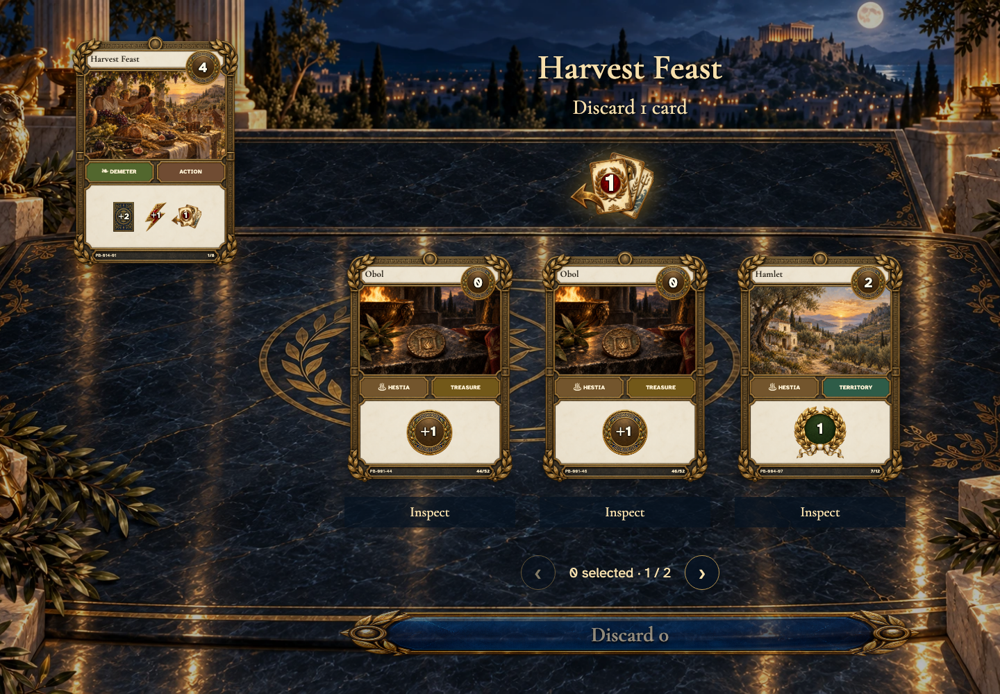
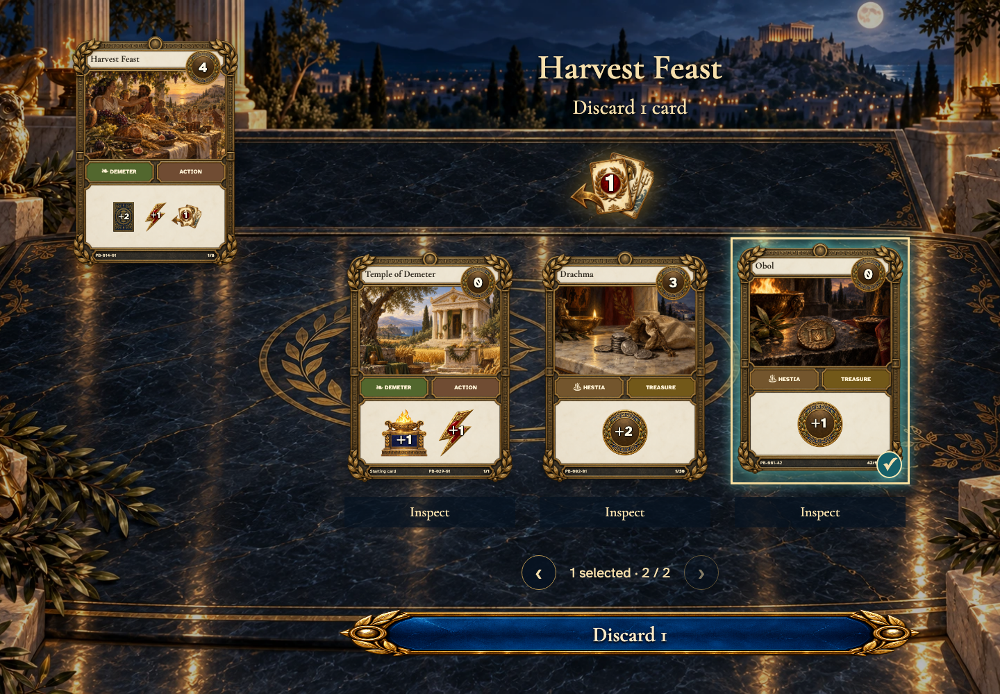
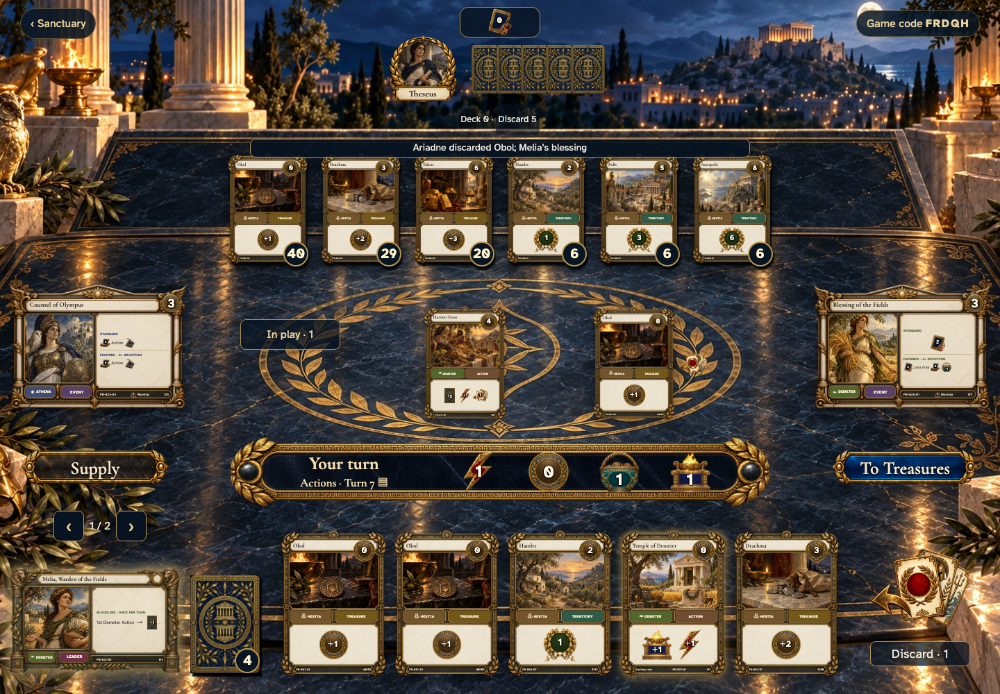
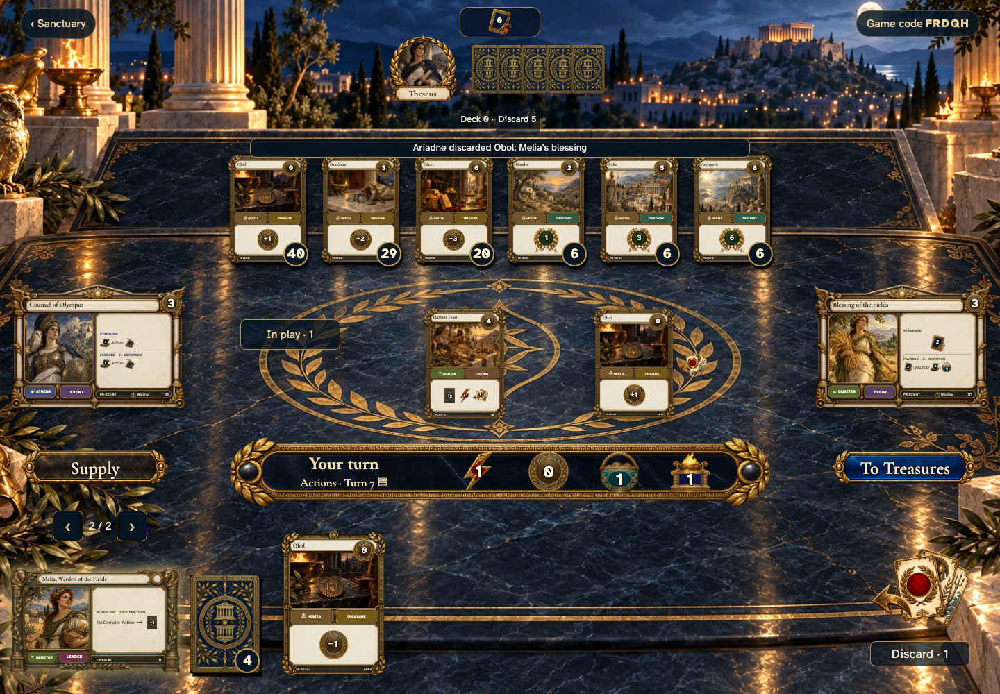

# Harvest Feast requires a discard after drawing and supports hand paging

Recorded-history integration scenario. A legal event history prepares the starting position directly in the emulator. This verifies the illustrated effect from that position; it does not demonstrate the player journey to reach it.

## Draw first, then choose a discard

[phone](../../screenshots/harvest-feast-requires-a-discard-after-drawing-and-supports-hand-paging/000-mandatory-discard-phone-darwin.png) · [desktop](../../screenshots/harvest-feast-requires-a-discard-after-drawing-and-supports-hand-paging/000-mandatory-discard-desktop-darwin.png) · [tabletop-4k](../../screenshots/harvest-feast-requires-a-discard-after-drawing-and-supports-hand-paging/000-mandatory-discard-tabletop-4k-darwin.png)

- [x] Discarding one card is required; there is no skip or cancel command.

## A just-drawn card can be discarded

[phone](../../screenshots/harvest-feast-requires-a-discard-after-drawing-and-supports-hand-paging/001-discard-selected-phone-darwin.png) · [desktop](../../screenshots/harvest-feast-requires-a-discard-after-drawing-and-supports-hand-paging/001-discard-selected-desktop-darwin.png) · [tabletop-4k](../../screenshots/harvest-feast-requires-a-discard-after-drawing-and-supports-hand-paging/001-discard-selected-tabletop-4k-darwin.png)

- [x] Keyboard selection marks the card and enables the mandatory discard.

## Melia’s draw follows the discard

[phone](../../screenshots/harvest-feast-requires-a-discard-after-drawing-and-supports-hand-paging/002-expanded-hand-phone-darwin.png) · [desktop](../../screenshots/harvest-feast-requires-a-discard-after-drawing-and-supports-hand-paging/002-expanded-hand-desktop-darwin.png) · [tabletop-4k](../../screenshots/harvest-feast-requires-a-discard-after-drawing-and-supports-hand-paging/002-expanded-hand-tabletop-4k-darwin.png)

- [x] A hand larger than five has reachable pages with no overlapping controls.

## Inspect the end of the expanded hand

[phone](../../screenshots/harvest-feast-requires-a-discard-after-drawing-and-supports-hand-paging/003-hand-last-page-phone-darwin.png) · [desktop](../../screenshots/harvest-feast-requires-a-discard-after-drawing-and-supports-hand-paging/003-hand-last-page-desktop-darwin.png) · [tabletop-4k](../../screenshots/harvest-feast-requires-a-discard-after-drawing-and-supports-hand-paging/003-hand-last-page-tabletop-4k-darwin.png)

- [x] The last page is bounded, and the first page remains reachable.
