# play, choose optional trash, reconnect, and show the public result

Recorded-history integration scenario. A legal event history prepares the starting position directly in the emulator. This verifies the illustrated effect from that position; it does not demonstrate the player journey to reach it.

## Find a playable Action in your hand

<table>
<tr><th>Desktop · 1440 × 1000</th><th>Phone · 393 × 852</th></tr>
<tr>
<td valign="top"><a href="../../screenshots/play-choose-optional-trash-reconnect-and-show-the-public-result/000-action-table-desktop-darwin.png">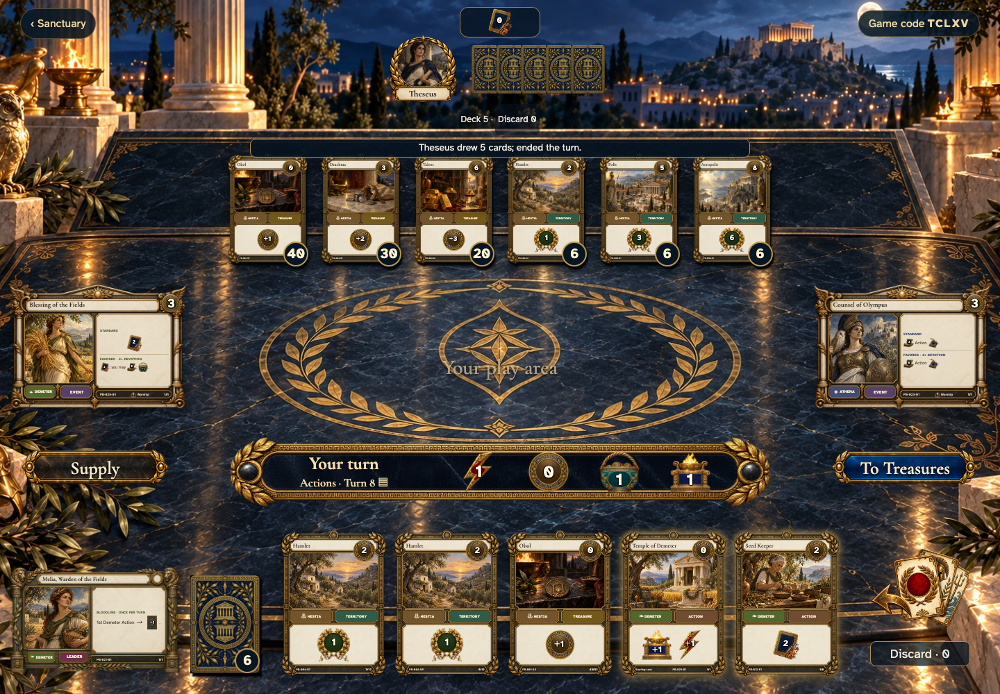</a></td>
<td valign="top"><a href="../../screenshots/play-choose-optional-trash-reconnect-and-show-the-public-result/000-action-table-phone-darwin.png">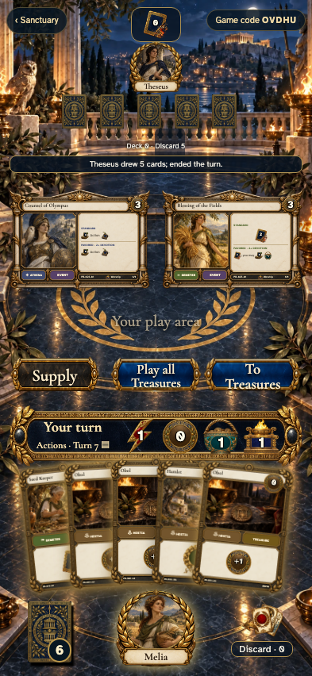</a></td>
</tr>
</table>

Tabletop · 3840 × 2160 — expand screenshot

<a href="../../screenshots/play-choose-optional-trash-reconnect-and-show-the-public-result/000-action-table-tabletop-4k-darwin.png">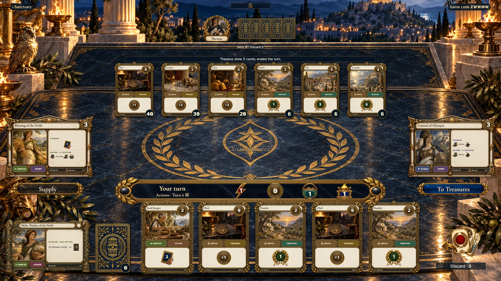</a>

- [x] Your hand marks playable Actions and keeps the counters in view.

## Inspect before playing

<table>
<tr><th>Desktop · 1440 × 1000</th><th>Phone · 393 × 852</th></tr>
<tr>
<td valign="top"><a href="../../screenshots/play-choose-optional-trash-reconnect-and-show-the-public-result/001-play-action-desktop-darwin.png">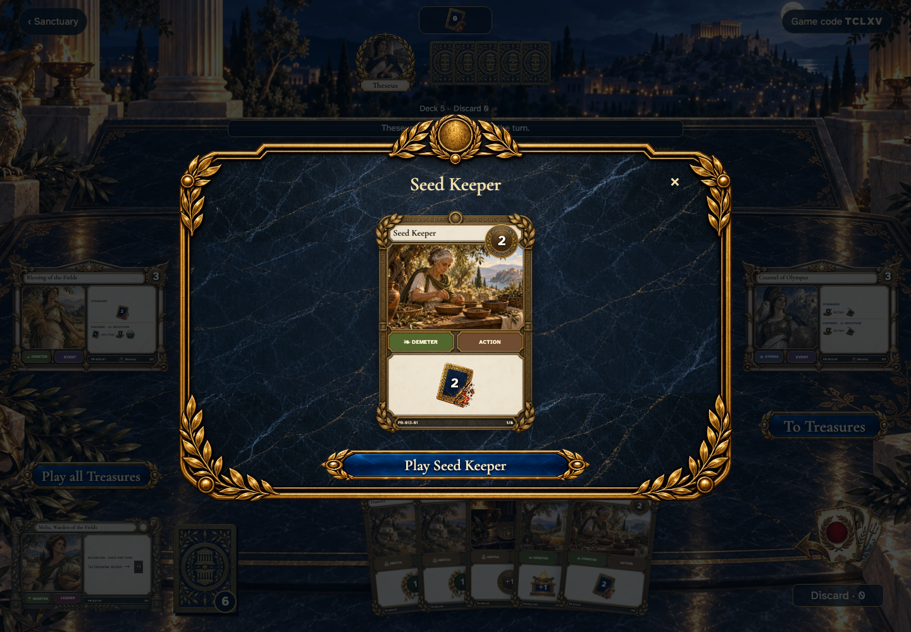</a></td>
<td valign="top"><a href="../../screenshots/play-choose-optional-trash-reconnect-and-show-the-public-result/001-play-action-phone-darwin.png">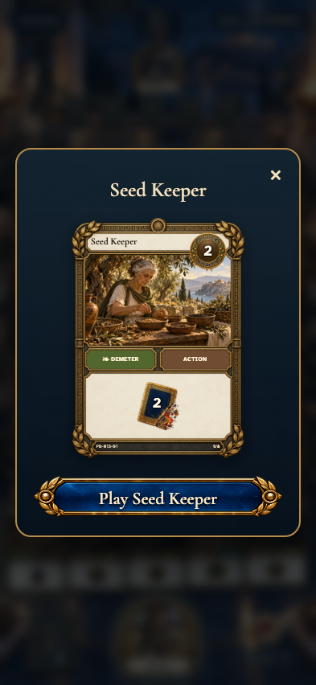</a></td>
</tr>
</table>

Tabletop · 3840 × 2160 — expand screenshot

<a href="../../screenshots/play-choose-optional-trash-reconnect-and-show-the-public-result/001-play-action-tabletop-4k-darwin.png">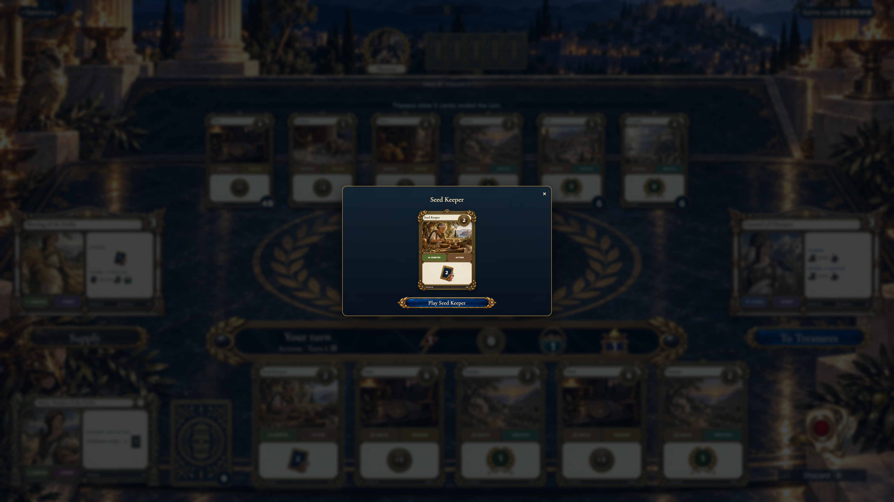</a>

- [x] The actual card has a working Play control, with its physical copy preserved.

## Choose cards for Seed Keeper

<table>
<tr><th>Desktop · 1440 × 1000</th><th>Phone · 393 × 852</th></tr>
<tr>
<td valign="top"><a href="../../screenshots/play-choose-optional-trash-reconnect-and-show-the-public-result/002-trash-choice-desktop-darwin.png">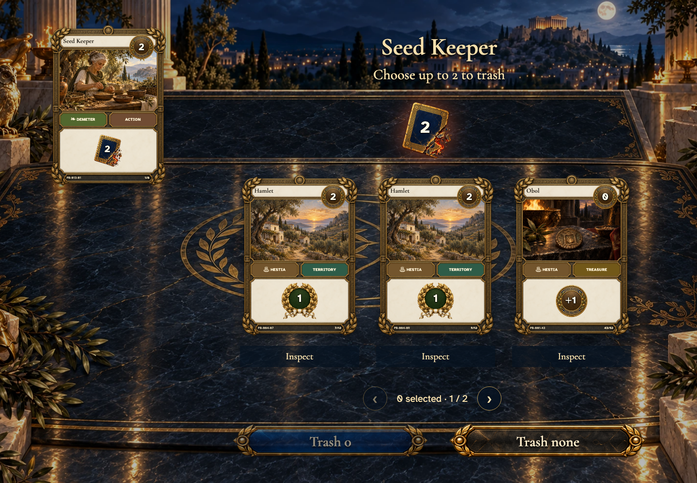</a></td>
<td valign="top"><a href="../../screenshots/play-choose-optional-trash-reconnect-and-show-the-public-result/002-trash-choice-phone-darwin.png">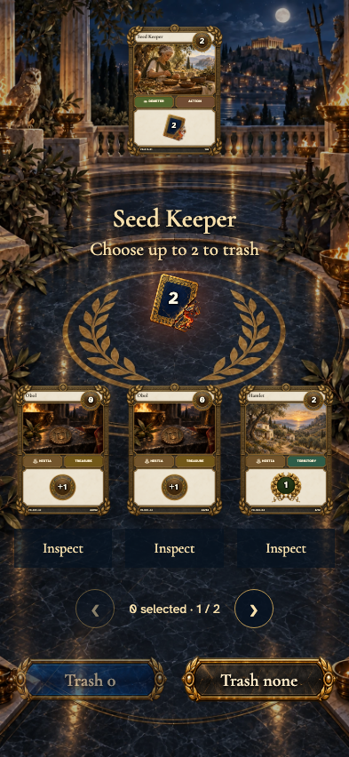</a></td>
</tr>
</table>

Tabletop · 3840 × 2160 — expand screenshot

<a href="../../screenshots/play-choose-optional-trash-reconnect-and-show-the-public-result/002-trash-choice-tabletop-4k-darwin.png">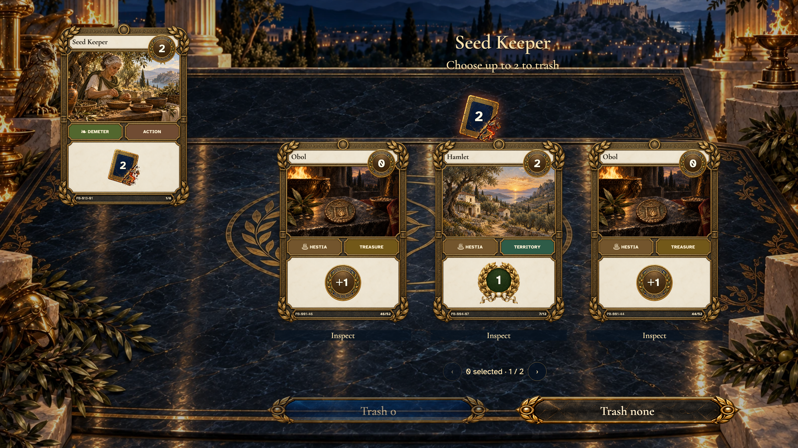</a>

- [x] Only cards remaining in hand can be selected; trashing is optional.

## Review the selected cards

<table>
<tr><th>Desktop · 1440 × 1000</th><th>Phone · 393 × 852</th></tr>
<tr>
<td valign="top"><a href="../../screenshots/play-choose-optional-trash-reconnect-and-show-the-public-result/003-trash-selected-desktop-darwin.png">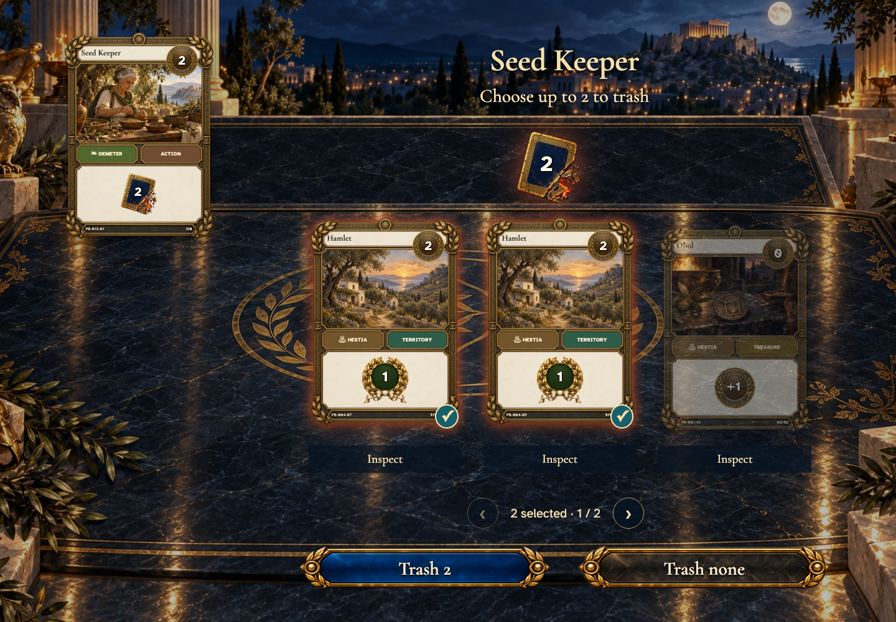</a></td>
<td valign="top"><a href="../../screenshots/play-choose-optional-trash-reconnect-and-show-the-public-result/003-trash-selected-phone-darwin.png">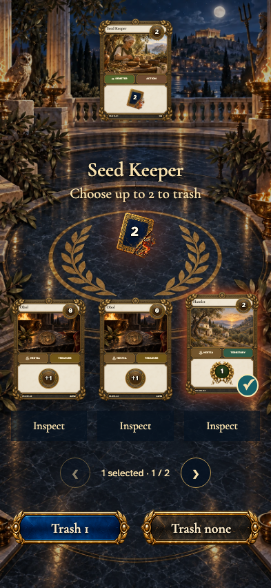</a></td>
</tr>
</table>

Tabletop · 3840 × 2160 — expand screenshot

<a href="../../screenshots/play-choose-optional-trash-reconnect-and-show-the-public-result/003-trash-selected-tabletop-4k-darwin.png">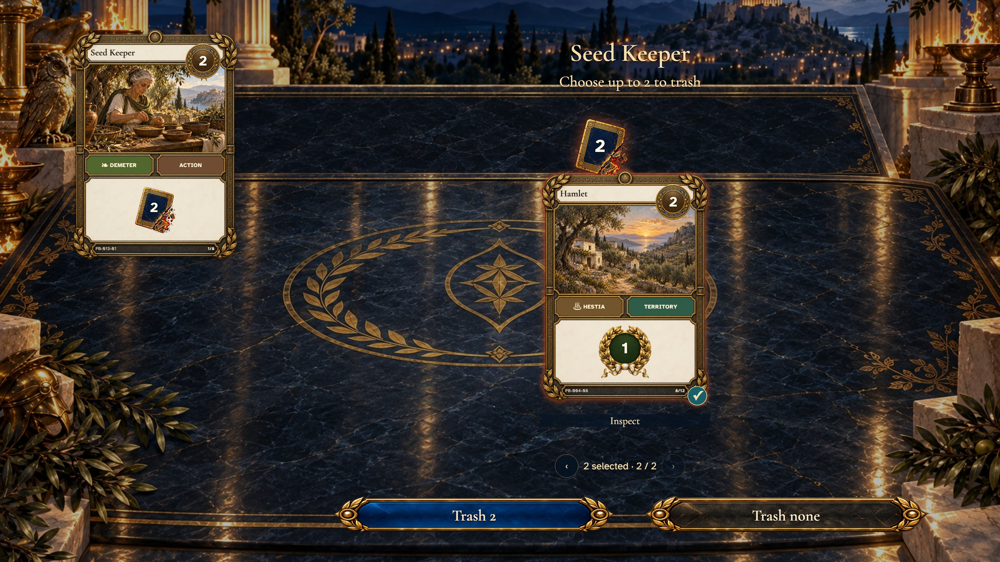</a>

- [x] The selection glows and the confirmation gives the exact count.

## The chosen cards leave your deck

<table>
<tr><th>Desktop · 1440 × 1000</th><th>Phone · 393 × 852</th></tr>
<tr>
<td valign="top"><a href="../../screenshots/play-choose-optional-trash-reconnect-and-show-the-public-result/004-trash-result-desktop-darwin.png">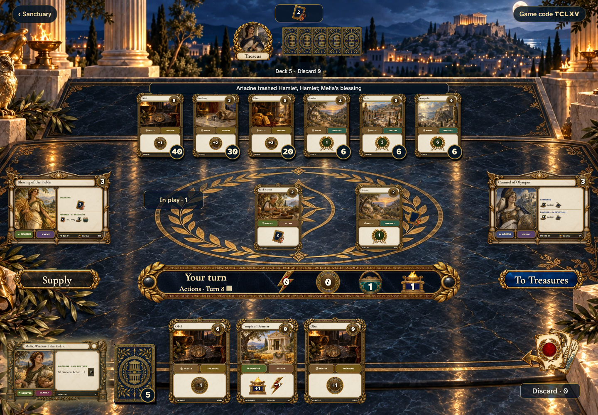</a></td>
<td valign="top"><a href="../../screenshots/play-choose-optional-trash-reconnect-and-show-the-public-result/004-trash-result-phone-darwin.png">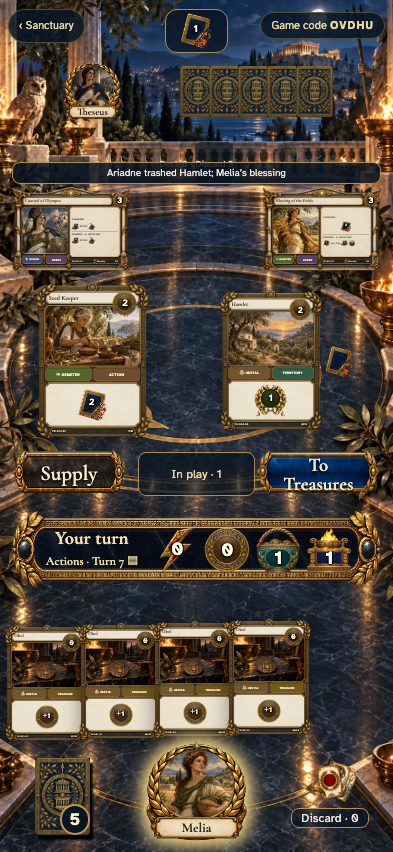</a></td>
</tr>
</table>

Tabletop · 3840 × 2160 — expand screenshot

<a href="../../screenshots/play-choose-optional-trash-reconnect-and-show-the-public-result/004-trash-result-tabletop-4k-darwin.png">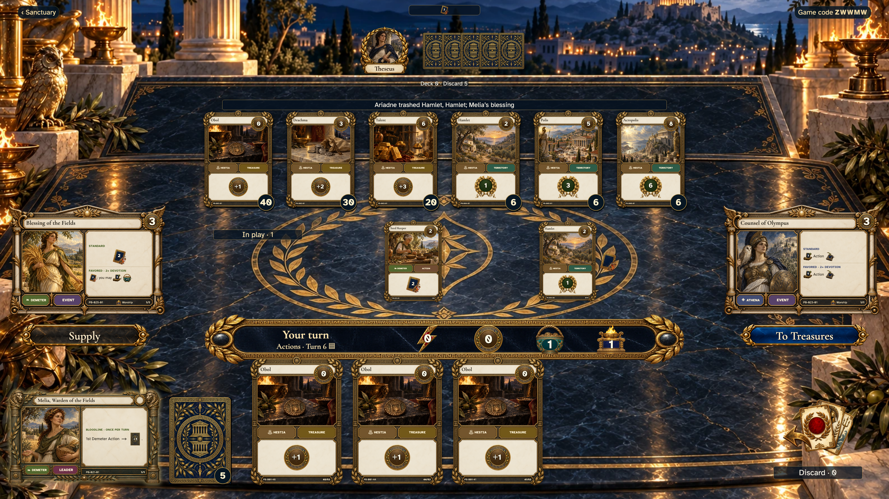</a>

- [x] Trash is public and Melia draws only after Seed Keeper finishes.

## Inspect the shared trash

<table>
<tr><th>Desktop · 1440 × 1000</th><th>Phone · 393 × 852</th></tr>
<tr>
<td valign="top"><a href="../../screenshots/play-choose-optional-trash-reconnect-and-show-the-public-result/005-public-trash-desktop-darwin.png">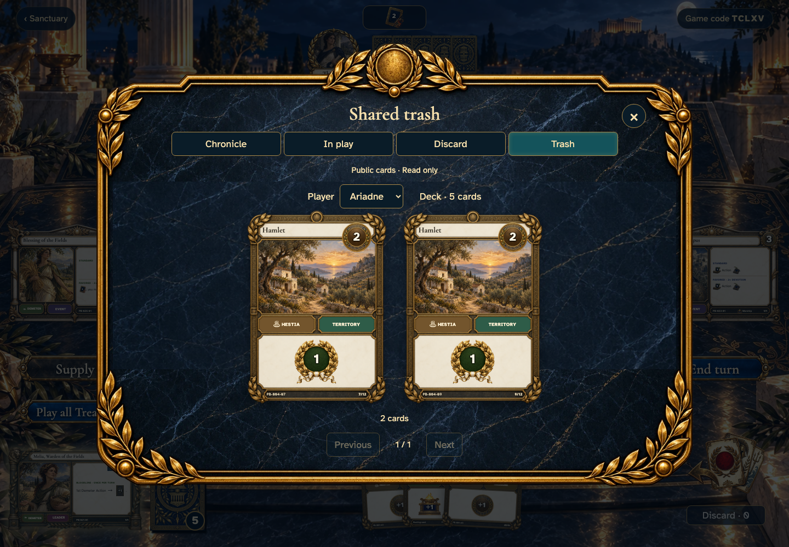</a></td>
<td valign="top"><a href="../../screenshots/play-choose-optional-trash-reconnect-and-show-the-public-result/005-public-trash-phone-darwin.png">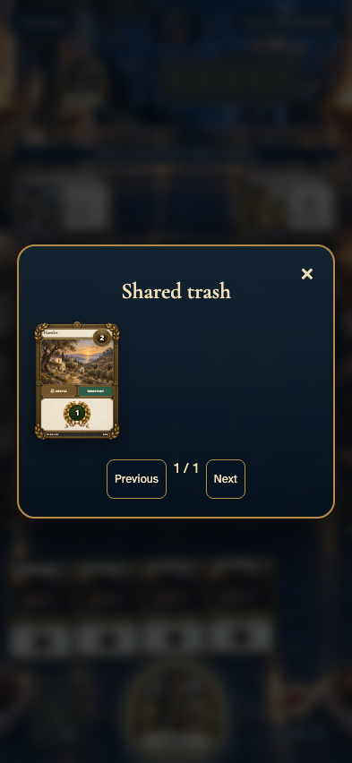</a></td>
</tr>
</table>

Tabletop · 3840 × 2160 — expand screenshot

<a href="../../screenshots/play-choose-optional-trash-reconnect-and-show-the-public-result/005-public-trash-tabletop-4k-darwin.png">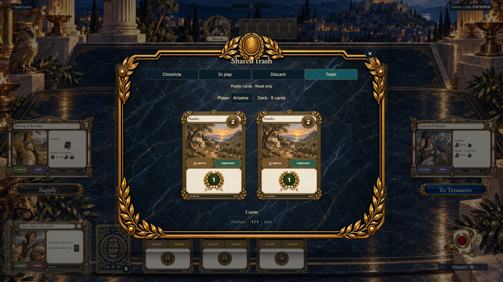</a>

- [x] Trashed copies are visible and remain outside every player’s deck.
