# play, choose optional trash, reconnect, and show the public result

Recorded-history integration scenario. A legal event history prepares the starting position directly in the emulator. This verifies the illustrated effect from that position; it does not demonstrate the player journey to reach it.

## Find Seed Keeper in the playable hand

<table>
<tr><th>Desktop · 1440 × 1000</th><th>Phone · 393 × 852</th></tr>
<tr>
<td valign="top"></td>
<td valign="top"></td>
</tr>
</table>

Tabletop · 3840 × 2160 — expand screenshot

- [x] Find Seed Keeper in the playable hand

## Read Seed Keeper before playing it

<table>
<tr><th>Desktop · 1440 × 1000</th><th>Phone · 393 × 852</th></tr>
<tr>
<td valign="top"><a href="../../screenshots/play-choose-optional-trash-reconnect-and-show-the-public-result/001-inspect-desktop-darwin.png">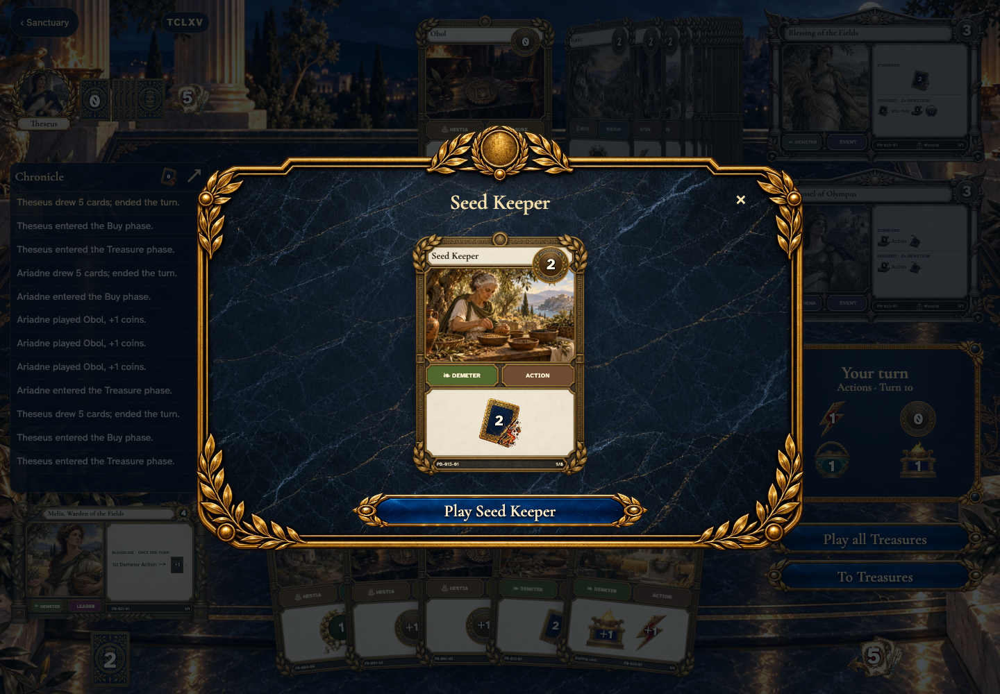</a></td>
<td valign="top"><a href="../../screenshots/play-choose-optional-trash-reconnect-and-show-the-public-result/001-inspect-phone-darwin.png">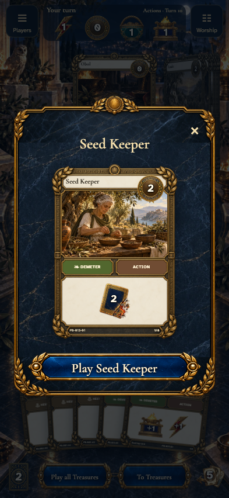</a></td>
</tr>
</table>

Tabletop · 3840 × 2160 — expand screenshot

<a href="../../screenshots/play-choose-optional-trash-reconnect-and-show-the-public-result/001-inspect-tabletop-4k-darwin.png">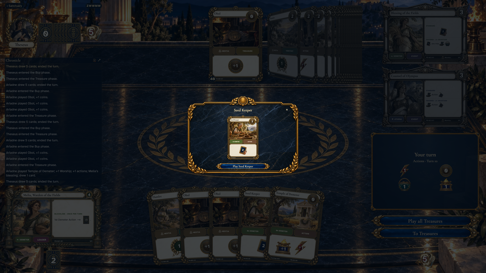</a>

- [x] Read Seed Keeper before playing it

## A trash target arrives while the hand stays on the table

<table>
<tr><th>Desktop · 1440 × 1000</th><th>Phone · 393 × 852</th></tr>
<tr>
<td valign="top"></td>
<td valign="top"></td>
</tr>
</table>

Tabletop · 3840 × 2160 — expand screenshot

- [x] A trash target arrives while the hand stays on the table

## Return to the same unfinished trash choice

<table>
<tr><th>Desktop · 1440 × 1000</th><th>Phone · 393 × 852</th></tr>
<tr>
<td valign="top"><a href="../../screenshots/play-choose-optional-trash-reconnect-and-show-the-public-result/003-restored-desktop-darwin.png">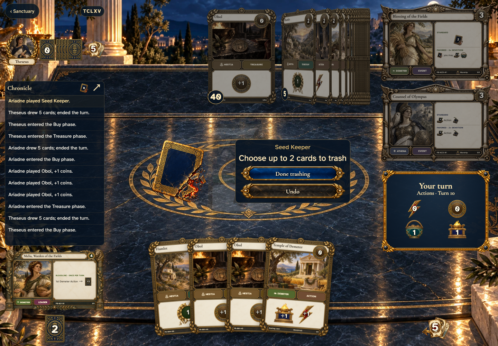</a></td>
<td valign="top"><a href="../../screenshots/play-choose-optional-trash-reconnect-and-show-the-public-result/003-restored-phone-darwin.png">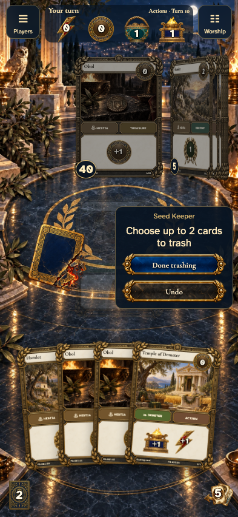</a></td>
</tr>
</table>

Tabletop · 3840 × 2160 — expand screenshot

<a href="../../screenshots/play-choose-optional-trash-reconnect-and-show-the-public-result/003-restored-tabletop-4k-darwin.png">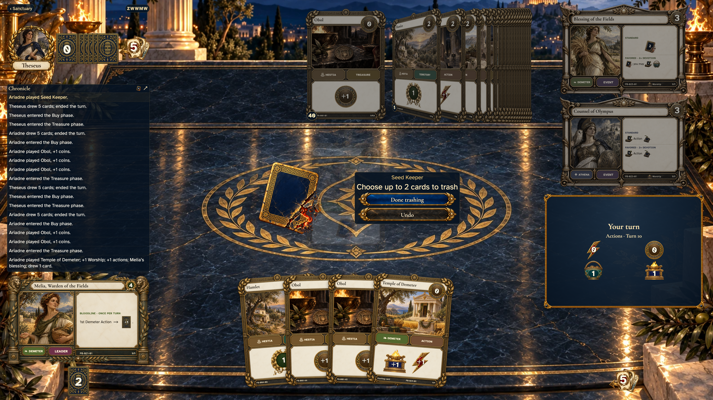</a>

- [x] Return to the same unfinished trash choice

## One Hamlet rests at the trash target; Ariadne may stop early

<table>
<tr><th>Desktop · 1440 × 1000</th><th>Phone · 393 × 852</th></tr>
<tr>
<td valign="top"></td>
<td valign="top"><a href="../../screenshots/play-choose-optional-trash-reconnect-and-show-the-public-result/004-trash-selected-phone-darwin.png">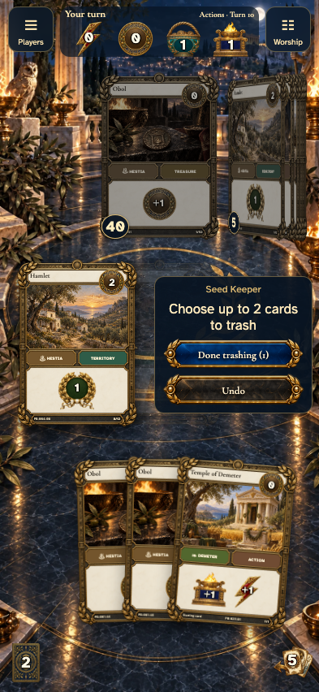</a></td>
</tr>
</table>

Tabletop · 3840 × 2160 — expand screenshot

- [x] One Hamlet rests at the trash target; Ariadne may stop early

## An interrupted connection keeps the staged choice

<table>
<tr><th>Desktop · 1440 × 1000</th><th>Phone · 393 × 852</th></tr>
<tr>
<td valign="top"><a href="../../screenshots/play-choose-optional-trash-reconnect-and-show-the-public-result/005-interrupted-desktop-darwin.png">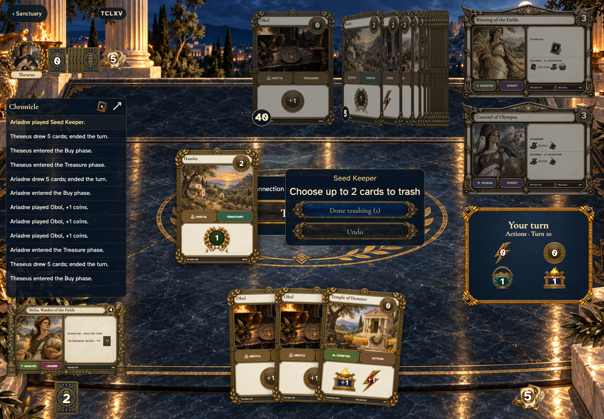</a></td>
<td valign="top"><a href="../../screenshots/play-choose-optional-trash-reconnect-and-show-the-public-result/005-interrupted-phone-darwin.png">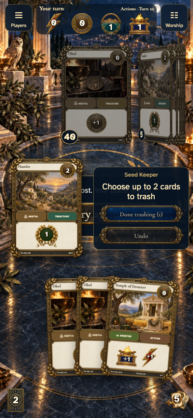</a></td>
</tr>
</table>

Tabletop · 3840 × 2160 — expand screenshot

<a href="../../screenshots/play-choose-optional-trash-reconnect-and-show-the-public-result/005-interrupted-tabletop-4k-darwin.png">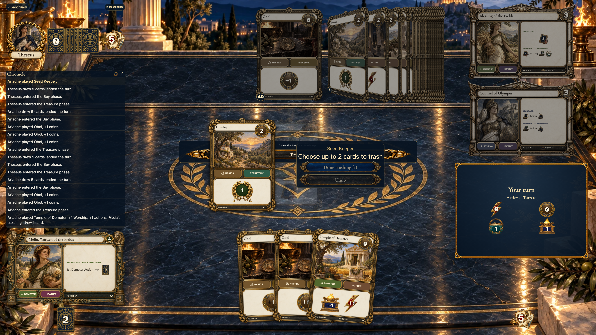</a>

- [x] The reconnect message is visible and no trash is committed.

## Reconnect with the same staged Hamlet

<table>
<tr><th>Desktop · 1440 × 1000</th><th>Phone · 393 × 852</th></tr>
<tr>
<td valign="top"><a href="../../screenshots/play-choose-optional-trash-reconnect-and-show-the-public-result/006-reconnected-desktop-darwin.png">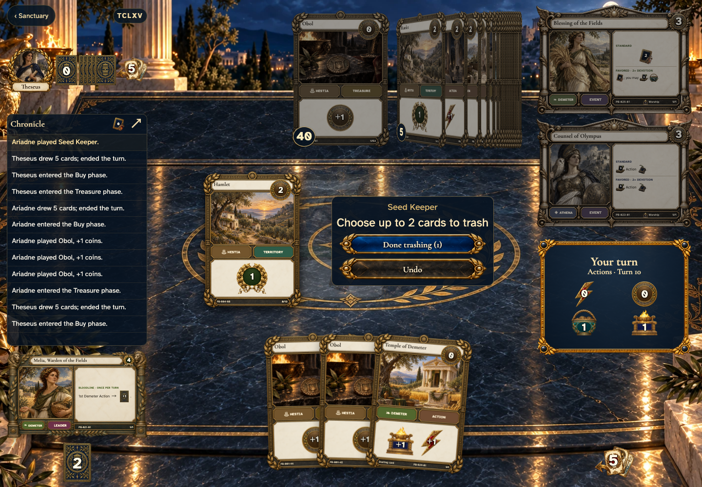</a></td>
<td valign="top"></td>
</tr>
</table>

Tabletop · 3840 × 2160 — expand screenshot

<a href="../../screenshots/play-choose-optional-trash-reconnect-and-show-the-public-result/006-reconnected-tabletop-4k-darwin.png">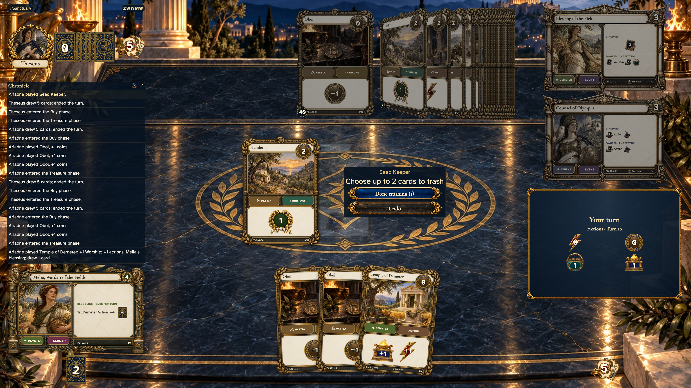</a>

- [x] Reconnect with the same staged Hamlet

## The Hamlet enters the trash and Melia draws after the choice

<table>
<tr><th>Desktop · 1440 × 1000</th><th>Phone · 393 × 852</th></tr>
<tr>
<td valign="top"><a href="../../screenshots/play-choose-optional-trash-reconnect-and-show-the-public-result/007-trash-result-desktop-darwin.png">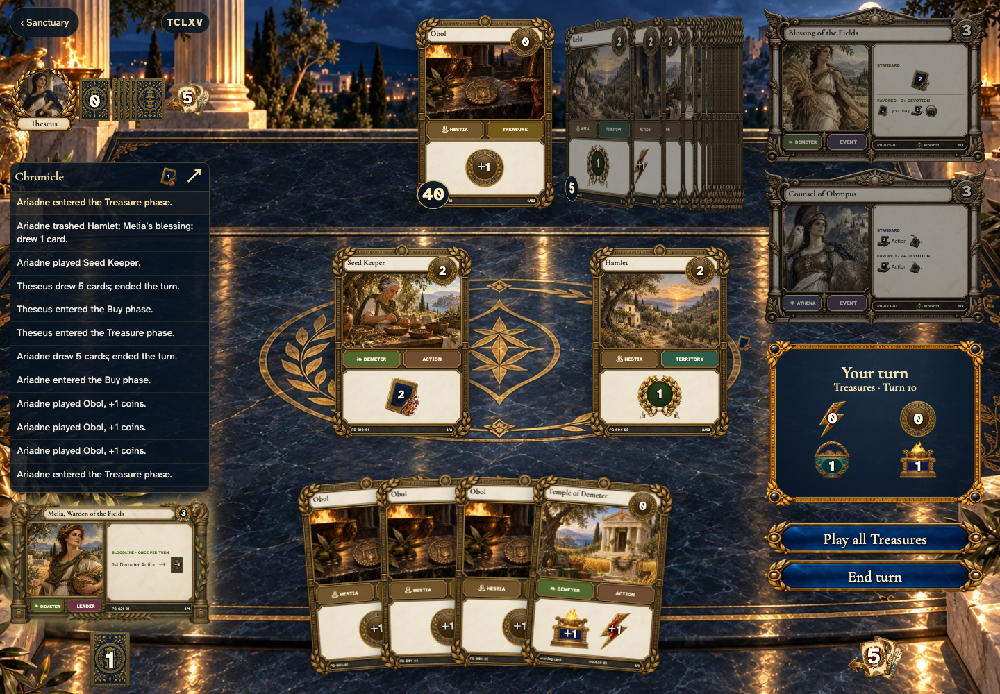</a></td>
<td valign="top"><a href="../../screenshots/play-choose-optional-trash-reconnect-and-show-the-public-result/007-trash-result-phone-darwin.png">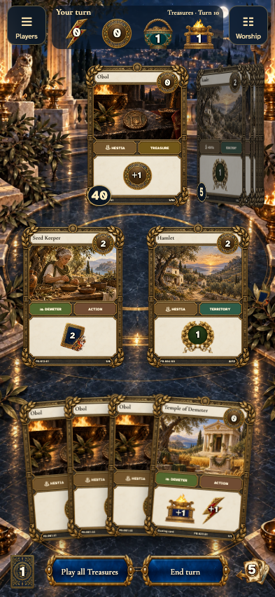</a></td>
</tr>
</table>

Tabletop · 3840 × 2160 — expand screenshot

<a href="../../screenshots/play-choose-optional-trash-reconnect-and-show-the-public-result/007-trash-result-tabletop-4k-darwin.png">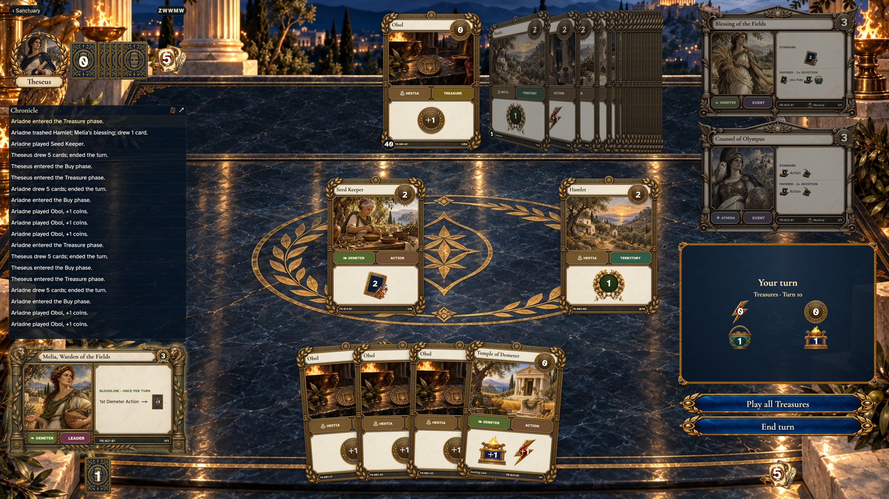</a>

- [x] The Hamlet enters the trash and Melia draws after the choice

## Theseus sees the public trash result without seeing Ariadne’s hand

Viewpoint: **Theseus**.

<table>
<tr><th>Desktop · 1440 × 1000</th><th>Phone · 393 × 852</th></tr>
<tr>
<td valign="top"><a href="../../screenshots/play-choose-optional-trash-reconnect-and-show-the-public-result/008-observer-desktop-darwin.png">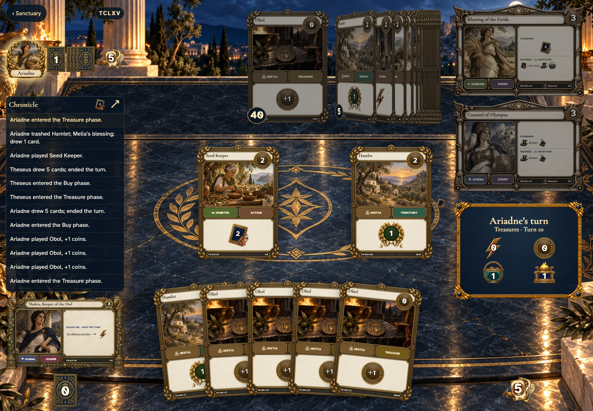</a></td>
<td valign="top"><a href="../../screenshots/play-choose-optional-trash-reconnect-and-show-the-public-result/008-observer-phone-darwin.png">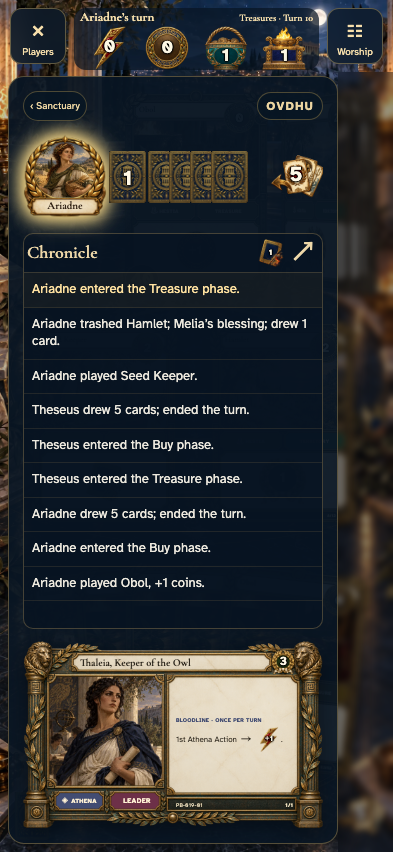</a></td>
</tr>
</table>

Tabletop · 3840 × 2160 — expand screenshot

<a href="../../screenshots/play-choose-optional-trash-reconnect-and-show-the-public-result/008-observer-tabletop-4k-darwin.png">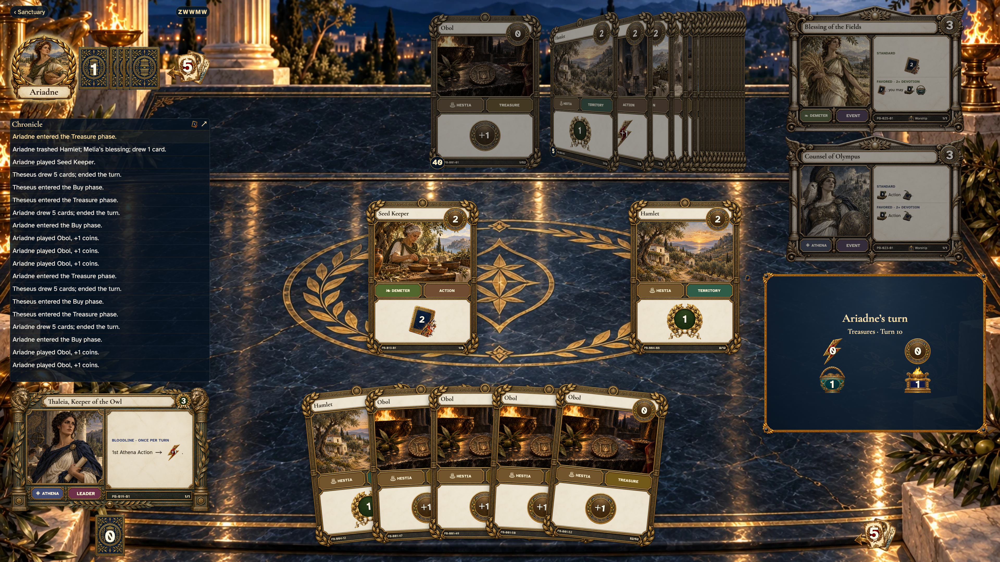</a>

- [x] The shared trash has one card and opponent hands contain no faces.

## Inspect the trashed Hamlet in the Chronicle

<table>
<tr><th>Desktop · 1440 × 1000</th><th>Phone · 393 × 852</th></tr>
<tr>
<td valign="top"><a href="../../screenshots/play-choose-optional-trash-reconnect-and-show-the-public-result/009-public-trash-desktop-darwin.png">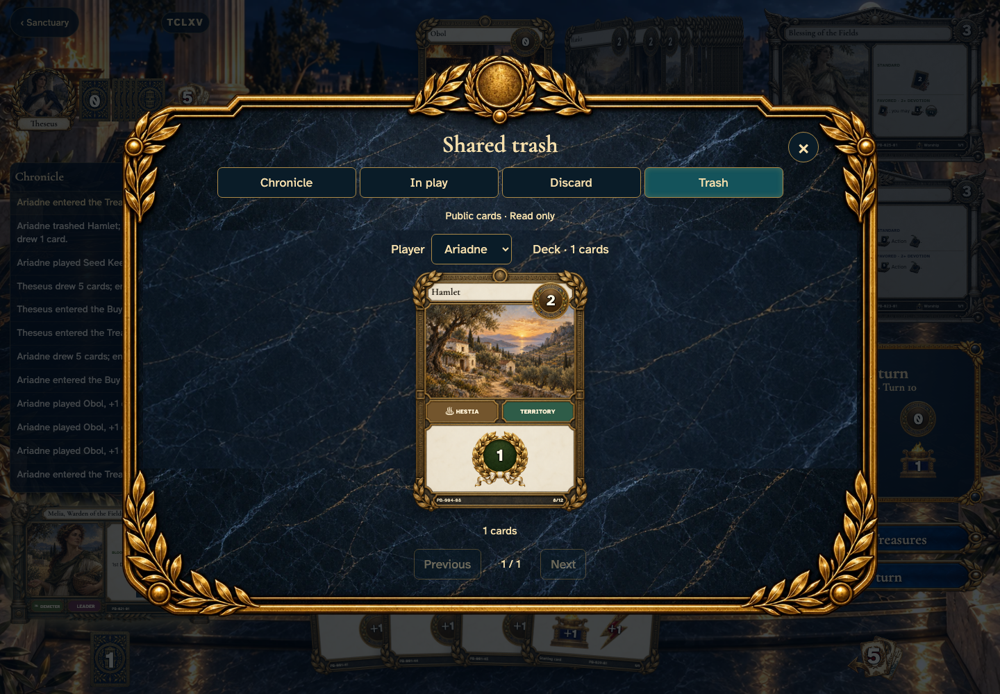</a></td>
<td valign="top"><a href="../../screenshots/play-choose-optional-trash-reconnect-and-show-the-public-result/009-public-trash-phone-darwin.png">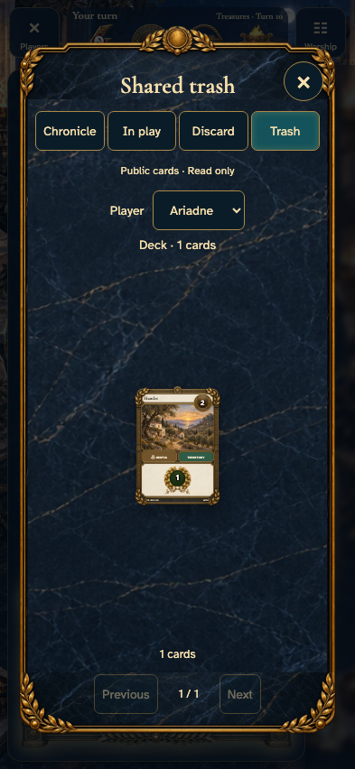</a></td>
</tr>
</table>

Tabletop · 3840 × 2160 — expand screenshot

<a href="../../screenshots/play-choose-optional-trash-reconnect-and-show-the-public-result/009-public-trash-tabletop-4k-darwin.png">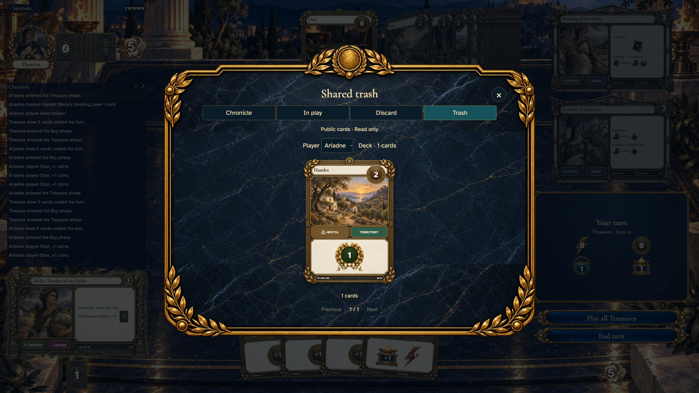</a>

- [x] Inspect the trashed Hamlet in the Chronicle
