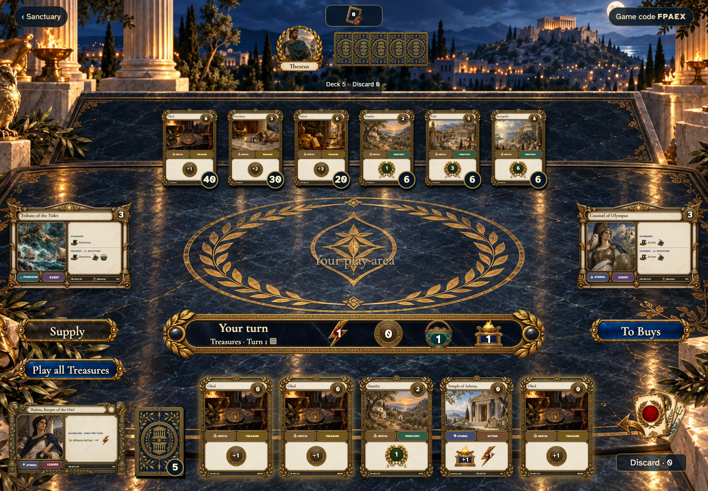
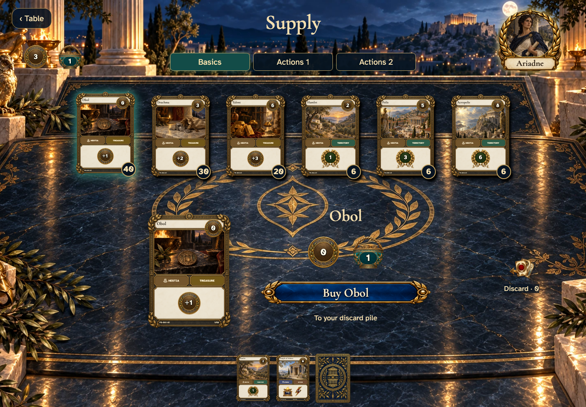
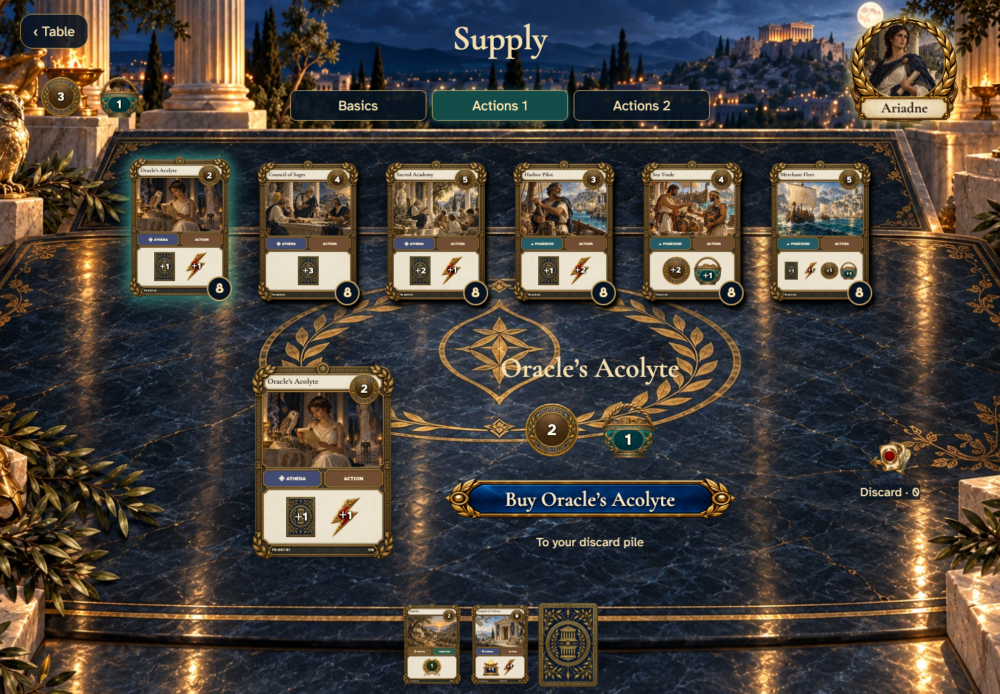
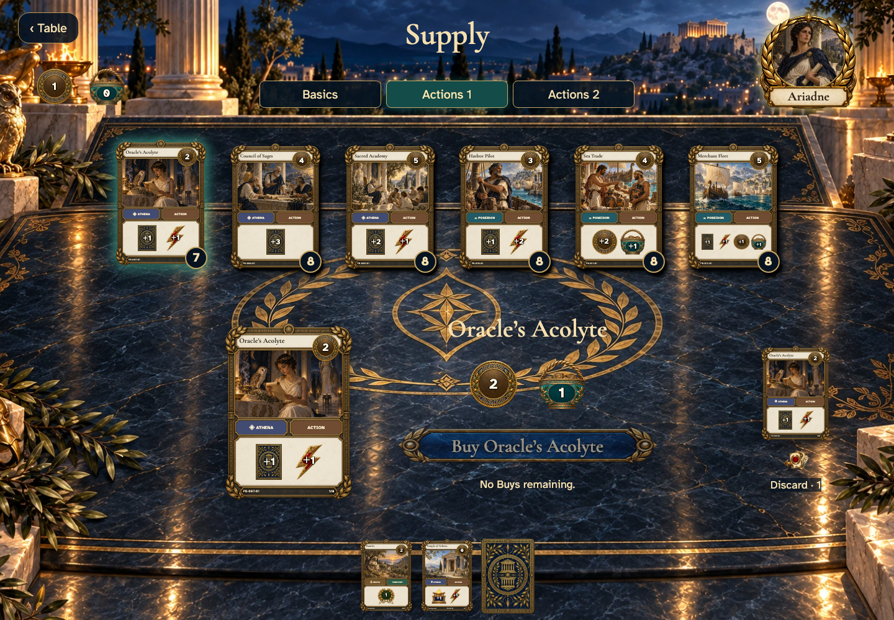
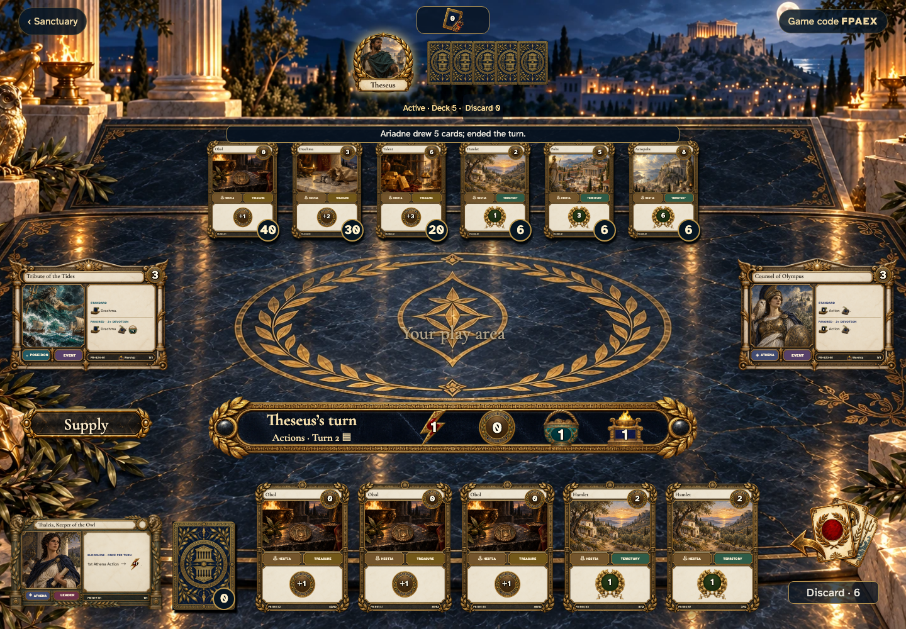
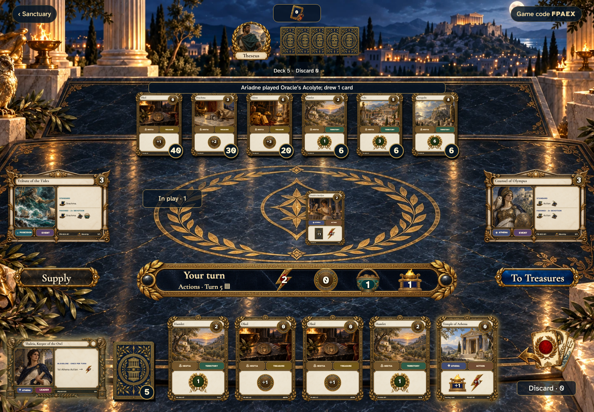

# Earn Coins, buy a card, and play it on a later turn

## Play wealth from your opening hand

- [x] The Treasure phase is reachable without playing an Action.

## Choose among actual supply piles

- [x] Stock, available Coins and Buys remain visible; buying is a separate action.

## Inspect the Action before buying

- [x] The selected Action shows its Coin cost, one Buy, and discard destination.

## The new copy goes to your discard

- [x] The pile loses one copy, one Buy is spent, and inspection retains its physical number.

## The next player receives the turn

- [x] Cleanup draws five and resets resources; only the active player can advance.

## Play the Action you bought

- [x] A real cleanup and seeded reshuffle brought the purchased copy into hand.
