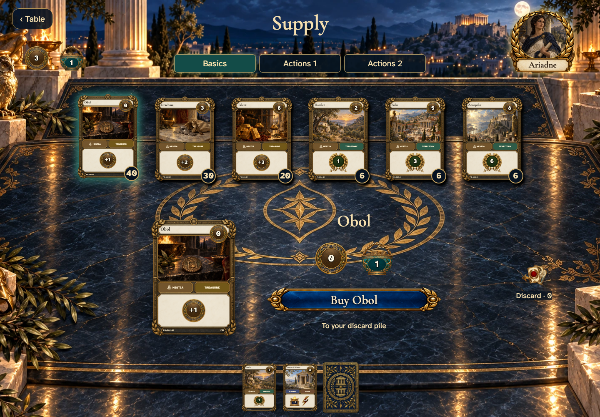
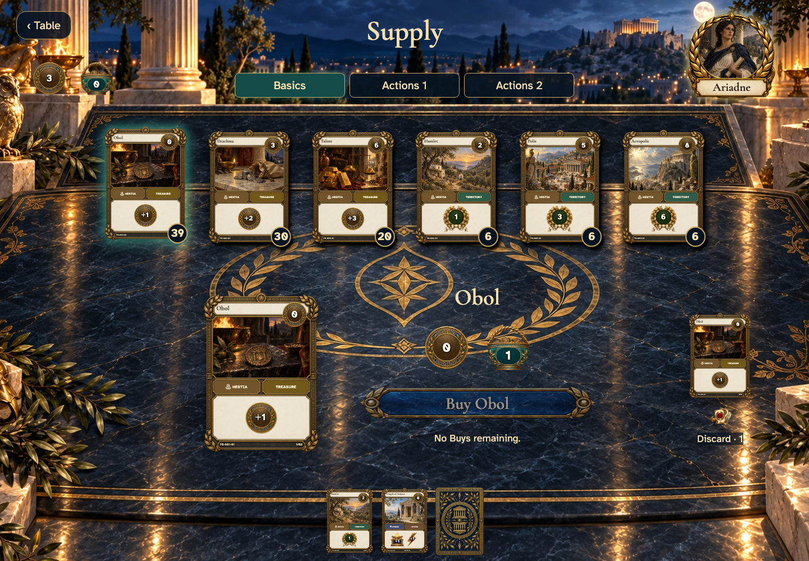
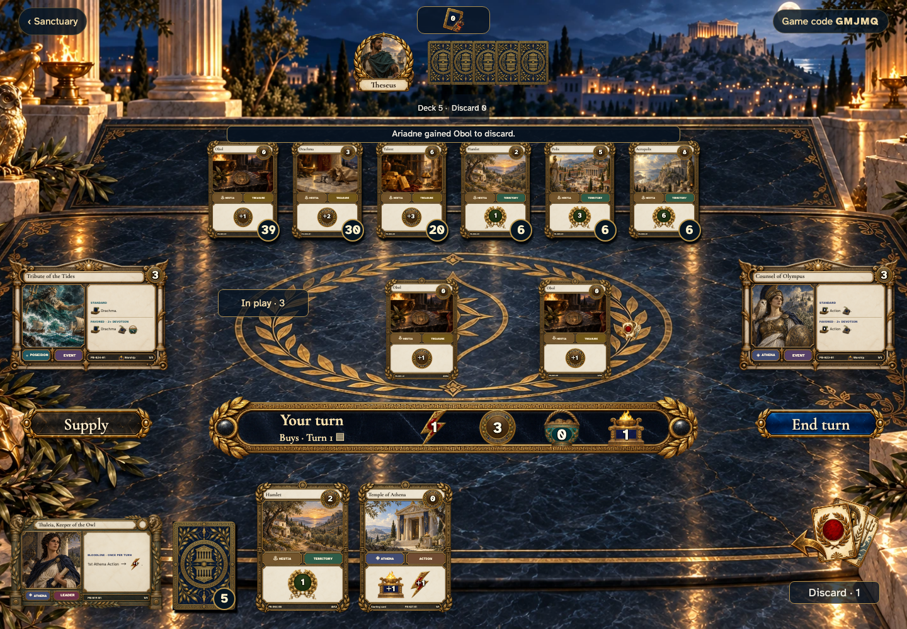

# a lost purchase acknowledgement does not duplicate the card or its animation

Recorded-history integration scenario. A legal event history prepares the starting position directly in the emulator. This verifies the illustrated effect from that position; it does not demonstrate the player journey to reach it.

## Choose a supply card

[phone](../../screenshots/a-lost-purchase-acknowledgement-does-not-duplicate-the-card-or-its-animation/000-before-purchase-phone-darwin.png) · [desktop](../../screenshots/a-lost-purchase-acknowledgement-does-not-duplicate-the-card-or-its-animation/000-before-purchase-desktop-darwin.png) · [tabletop-4k](../../screenshots/a-lost-purchase-acknowledgement-does-not-duplicate-the-card-or-its-animation/000-before-purchase-tabletop-4k-darwin.png)

- [x] Obol can be bought with one remaining Buy.

## Receive exactly one card after an interrupted acknowledgement

[phone](../../screenshots/a-lost-purchase-acknowledgement-does-not-duplicate-the-card-or-its-animation/001-purchase-recovered-phone-darwin.png) · [desktop](../../screenshots/a-lost-purchase-acknowledgement-does-not-duplicate-the-card-or-its-animation/001-purchase-recovered-desktop-darwin.png) · [tabletop-4k](../../screenshots/a-lost-purchase-acknowledgement-does-not-duplicate-the-card-or-its-animation/001-purchase-recovered-tabletop-4k-darwin.png)

- [x] Stock and Buy each decrease once and the destination remains discard.

## Return to the same turn with the purchased card kept

[phone](../../screenshots/a-lost-purchase-acknowledgement-does-not-duplicate-the-card-or-its-animation/002-purchase-restored-phone-darwin.png) · [desktop](../../screenshots/a-lost-purchase-acknowledgement-does-not-duplicate-the-card-or-its-animation/002-purchase-restored-desktop-darwin.png) · [tabletop-4k](../../screenshots/a-lost-purchase-acknowledgement-does-not-duplicate-the-card-or-its-animation/002-purchase-restored-tabletop-4k-darwin.png)

- [x] Returning does not spend another Buy.
