# buy an Action from an empty Action hand and play it on turn five

## Ariadne arrives at the sanctuary

Viewpoint: **Ariadne**.

[phone](../../screenshots/buy-an-action-from-an-empty-action-hand-and-play-it-on-turn-five/000-sanctuary-phone-darwin.png) · [desktop](../../screenshots/buy-an-action-from-an-empty-action-hand-and-play-it-on-turn-five/000-sanctuary-desktop-darwin.png) · [tabletop-4k](../../screenshots/buy-an-action-from-an-empty-action-hand-and-play-it-on-turn-five/000-sanctuary-tabletop-4k-darwin.png)

- [x] Ariadne arrives at the sanctuary

## Choose to create a table or join friends

Viewpoint: **Ariadne**.

[phone](../../screenshots/buy-an-action-from-an-empty-action-hand-and-play-it-on-turn-five/001-gathering-phone-darwin.png) · [desktop](../../screenshots/buy-an-action-from-an-empty-action-hand-and-play-it-on-turn-five/001-gathering-desktop-darwin.png) · [tabletop-4k](../../screenshots/buy-an-action-from-an-empty-action-hand-and-play-it-on-turn-five/001-gathering-tabletop-4k-darwin.png)

- [x] Choose to create a table or join friends

## Ariadne shares her five-letter game code

Viewpoint: **Ariadne**.

[phone](../../screenshots/buy-an-action-from-an-empty-action-hand-and-play-it-on-turn-five/002-created-phone-darwin.png) · [desktop](../../screenshots/buy-an-action-from-an-empty-action-hand-and-play-it-on-turn-five/002-created-desktop-darwin.png) · [tabletop-4k](../../screenshots/buy-an-action-from-an-empty-action-hand-and-play-it-on-turn-five/002-created-tabletop-4k-darwin.png)

- [x] Ariadne shares her five-letter game code

## Theseus can find the table using its code

Viewpoint: **Theseus**.

[phone](../../screenshots/buy-an-action-from-an-empty-action-hand-and-play-it-on-turn-five/003-join-code-phone-darwin.png) · [desktop](../../screenshots/buy-an-action-from-an-empty-action-hand-and-play-it-on-turn-five/003-join-code-desktop-darwin.png) · [tabletop-4k](../../screenshots/buy-an-action-from-an-empty-action-hand-and-play-it-on-turn-five/003-join-code-tabletop-4k-darwin.png)

- [x] Theseus can find the table using its code

## Theseus finds Ariadne’s table before taking a seat

Viewpoint: **Theseus**.

[phone](../../screenshots/buy-an-action-from-an-empty-action-hand-and-play-it-on-turn-five/004-found-phone-darwin.png) · [desktop](../../screenshots/buy-an-action-from-an-empty-action-hand-and-play-it-on-turn-five/004-found-desktop-darwin.png) · [tabletop-4k](../../screenshots/buy-an-action-from-an-empty-action-hand-and-play-it-on-turn-five/004-found-tabletop-4k-darwin.png)

- [x] Theseus finds Ariadne’s table before taking a seat

## Theseus joins and waits for the host

Viewpoint: **Theseus**.

[phone](../../screenshots/buy-an-action-from-an-empty-action-hand-and-play-it-on-turn-five/005-joined-guest-phone-darwin.png) · [desktop](../../screenshots/buy-an-action-from-an-empty-action-hand-and-play-it-on-turn-five/005-joined-guest-desktop-darwin.png) · [tabletop-4k](../../screenshots/buy-an-action-from-an-empty-action-hand-and-play-it-on-turn-five/005-joined-guest-tabletop-4k-darwin.png)

- [x] Theseus joins and waits for the host

## Ariadne sees both seats filled and can begin

Viewpoint: **Ariadne**.

[phone](../../screenshots/buy-an-action-from-an-empty-action-hand-and-play-it-on-turn-five/006-joined-host-phone-darwin.png) · [desktop](../../screenshots/buy-an-action-from-an-empty-action-hand-and-play-it-on-turn-five/006-joined-host-desktop-darwin.png) · [tabletop-4k](../../screenshots/buy-an-action-from-an-empty-action-hand-and-play-it-on-turn-five/006-joined-host-tabletop-4k-darwin.png)

- [x] Ariadne sees both seats filled and can begin

## Theseus chooses first in the reverse-order draft

Viewpoint: **Theseus**.

[phone](../../screenshots/buy-an-action-from-an-empty-action-hand-and-play-it-on-turn-five/007-draft-guest-phone-darwin.png) · [desktop](../../screenshots/buy-an-action-from-an-empty-action-hand-and-play-it-on-turn-five/007-draft-guest-desktop-darwin.png) · [tabletop-4k](../../screenshots/buy-an-action-from-an-empty-action-hand-and-play-it-on-turn-five/007-draft-guest-tabletop-4k-darwin.png)

- [x] Theseus chooses first in the reverse-order draft

## Theseus reads Nereon and his linked Temple and god

Viewpoint: **Theseus**.

[phone](../../screenshots/buy-an-action-from-an-empty-action-hand-and-play-it-on-turn-five/008-nereon-phone-darwin.png) · [desktop](../../screenshots/buy-an-action-from-an-empty-action-hand-and-play-it-on-turn-five/008-nereon-desktop-darwin.png) · [tabletop-4k](../../screenshots/buy-an-action-from-an-empty-action-hand-and-play-it-on-turn-five/008-nereon-tabletop-4k-darwin.png)

- [x] Theseus reads Nereon and his linked Temple and god

## Ariadne receives the next bloodline choice

Viewpoint: **Ariadne**.

[phone](../../screenshots/buy-an-action-from-an-empty-action-hand-and-play-it-on-turn-five/009-draft-host-phone-darwin.png) · [desktop](../../screenshots/buy-an-action-from-an-empty-action-hand-and-play-it-on-turn-five/009-draft-host-desktop-darwin.png) · [tabletop-4k](../../screenshots/buy-an-action-from-an-empty-action-hand-and-play-it-on-turn-five/009-draft-host-tabletop-4k-darwin.png)

- [x] Ariadne receives the next bloodline choice

## Ariadne reads Thaleia before claiming her bloodline

Viewpoint: **Ariadne**.

[phone](../../screenshots/buy-an-action-from-an-empty-action-hand-and-play-it-on-turn-five/010-thaleia-phone-darwin.png) · [desktop](../../screenshots/buy-an-action-from-an-empty-action-hand-and-play-it-on-turn-five/010-thaleia-desktop-darwin.png) · [tabletop-4k](../../screenshots/buy-an-action-from-an-empty-action-hand-and-play-it-on-turn-five/010-thaleia-tabletop-4k-darwin.png)

- [x] Ariadne reads Thaleia before claiming her bloodline

## Ariadne starts with two Obols, three Hamlets, and no Actions

Viewpoint: **Ariadne**.

[phone](../../screenshots/buy-an-action-from-an-empty-action-hand-and-play-it-on-turn-five/011-opening-hand-phone-darwin.png) · [desktop](../../screenshots/buy-an-action-from-an-empty-action-hand-and-play-it-on-turn-five/011-opening-hand-desktop-darwin.png) · [tabletop-4k](../../screenshots/buy-an-action-from-an-empty-action-hand-and-play-it-on-turn-five/011-opening-hand-tabletop-4k-darwin.png)

- [x] Ariadne starts with two Obols, three Hamlets, and no Actions

## Theseus sees Ariadne’s turn and five hidden cards

Viewpoint: **Theseus**.

[phone](../../screenshots/buy-an-action-from-an-empty-action-hand-and-play-it-on-turn-five/012-opening-observer-phone-darwin.png) · [desktop](../../screenshots/buy-an-action-from-an-empty-action-hand-and-play-it-on-turn-five/012-opening-observer-desktop-darwin.png) · [tabletop-4k](../../screenshots/buy-an-action-from-an-empty-action-hand-and-play-it-on-turn-five/012-opening-observer-tabletop-4k-darwin.png)

- [x] Theseus sees Ariadne’s turn and five hidden cards

## Ariadne advances without playing an Action

Viewpoint: **Ariadne**.

[phone](../../screenshots/buy-an-action-from-an-empty-action-hand-and-play-it-on-turn-five/013-treasures-phone-darwin.png) · [desktop](../../screenshots/buy-an-action-from-an-empty-action-hand-and-play-it-on-turn-five/013-treasures-desktop-darwin.png) · [tabletop-4k](../../screenshots/buy-an-action-from-an-empty-action-hand-and-play-it-on-turn-five/013-treasures-tabletop-4k-darwin.png)

- [x] Ariadne advances without playing an Action

## Read the Obol and its Play control

Viewpoint: **Ariadne**.

[phone](../../screenshots/buy-an-action-from-an-empty-action-hand-and-play-it-on-turn-five/014-obol-inspection-phone-darwin.png) · [desktop](../../screenshots/buy-an-action-from-an-empty-action-hand-and-play-it-on-turn-five/014-obol-inspection-desktop-darwin.png) · [tabletop-4k](../../screenshots/buy-an-action-from-an-empty-action-hand-and-play-it-on-turn-five/014-obol-inspection-tabletop-4k-darwin.png)

- [x] Read the Obol and its Play control

## One Obol leaves the hand and earns one Coin

Viewpoint: **Ariadne**.

[phone](../../screenshots/buy-an-action-from-an-empty-action-hand-and-play-it-on-turn-five/015-obol-played-phone-darwin.png) · [desktop](../../screenshots/buy-an-action-from-an-empty-action-hand-and-play-it-on-turn-five/015-obol-played-desktop-darwin.png) · [tabletop-4k](../../screenshots/buy-an-action-from-an-empty-action-hand-and-play-it-on-turn-five/015-obol-played-tabletop-4k-darwin.png)

- [x] One Obol leaves the hand and earns one Coin

## Theseus sees Ariadne play an Obol without revealing her hand

Viewpoint: **Theseus**.

[phone](../../screenshots/buy-an-action-from-an-empty-action-hand-and-play-it-on-turn-five/016-obol-observer-phone-darwin.png) · [desktop](../../screenshots/buy-an-action-from-an-empty-action-hand-and-play-it-on-turn-five/016-obol-observer-desktop-darwin.png) · [tabletop-4k](../../screenshots/buy-an-action-from-an-empty-action-hand-and-play-it-on-turn-five/016-obol-observer-tabletop-4k-darwin.png)

- [x] Theseus sees Ariadne play an Obol without revealing her hand

## The remaining Obol brings Ariadne to two Coins

Viewpoint: **Ariadne**.

[phone](../../screenshots/buy-an-action-from-an-empty-action-hand-and-play-it-on-turn-five/017-wealth-played-phone-darwin.png) · [desktop](../../screenshots/buy-an-action-from-an-empty-action-hand-and-play-it-on-turn-five/017-wealth-played-desktop-darwin.png) · [tabletop-4k](../../screenshots/buy-an-action-from-an-empty-action-hand-and-play-it-on-turn-five/017-wealth-played-tabletop-4k-darwin.png)

- [x] The remaining Obol brings Ariadne to two Coins

## Ariadne can spend two Coins and one Buy

Viewpoint: **Ariadne**.

[phone](../../screenshots/buy-an-action-from-an-empty-action-hand-and-play-it-on-turn-five/018-buys-phone-darwin.png) · [desktop](../../screenshots/buy-an-action-from-an-empty-action-hand-and-play-it-on-turn-five/018-buys-desktop-darwin.png) · [tabletop-4k](../../screenshots/buy-an-action-from-an-empty-action-hand-and-play-it-on-turn-five/018-buys-tabletop-4k-darwin.png)

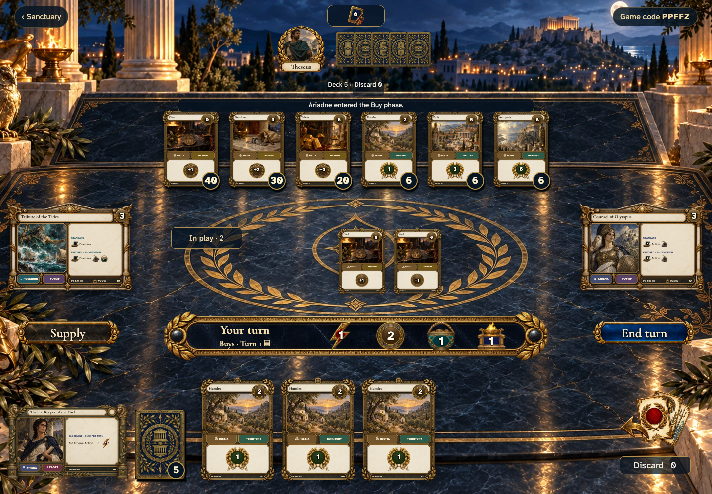

- [x] Ariadne can spend two Coins and one Buy

## Supply shows the available basic piles and their stock

Viewpoint: **Ariadne**.

[phone](../../screenshots/buy-an-action-from-an-empty-action-hand-and-play-it-on-turn-five/019-basics-phone-darwin.png) · [desktop](../../screenshots/buy-an-action-from-an-empty-action-hand-and-play-it-on-turn-five/019-basics-desktop-darwin.png) · [tabletop-4k](../../screenshots/buy-an-action-from-an-empty-action-hand-and-play-it-on-turn-five/019-basics-tabletop-4k-darwin.png)

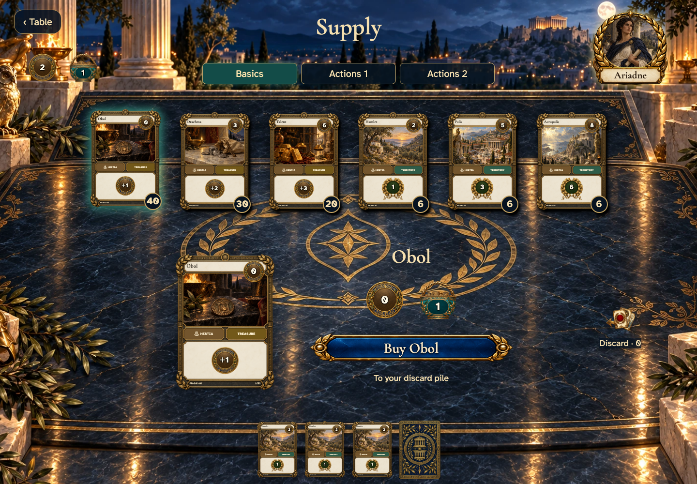

- [x] Supply shows the available basic piles and their stock

## Ariadne browses the Action piles

Viewpoint: **Ariadne**.

[phone](../../screenshots/buy-an-action-from-an-empty-action-hand-and-play-it-on-turn-five/020-action-piles-phone-darwin.png) · [desktop](../../screenshots/buy-an-action-from-an-empty-action-hand-and-play-it-on-turn-five/020-action-piles-desktop-darwin.png) · [tabletop-4k](../../screenshots/buy-an-action-from-an-empty-action-hand-and-play-it-on-turn-five/020-action-piles-tabletop-4k-darwin.png)

- [x] Ariadne browses the Action piles

## The selected Action costs two Coins and goes to discard

Viewpoint: **Ariadne**.

[phone](../../screenshots/buy-an-action-from-an-empty-action-hand-and-play-it-on-turn-five/021-selected-phone-darwin.png) · [desktop](../../screenshots/buy-an-action-from-an-empty-action-hand-and-play-it-on-turn-five/021-selected-desktop-darwin.png) · [tabletop-4k](../../screenshots/buy-an-action-from-an-empty-action-hand-and-play-it-on-turn-five/021-selected-tabletop-4k-darwin.png)

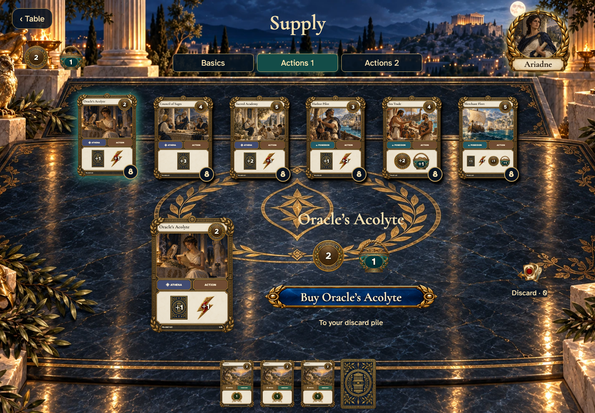

- [x] The selected Action costs two Coins and goes to discard

## Read the complete Action before spending anything

Viewpoint: **Ariadne**.

[phone](../../screenshots/buy-an-action-from-an-empty-action-hand-and-play-it-on-turn-five/022-action-inspector-phone-darwin.png) · [desktop](../../screenshots/buy-an-action-from-an-empty-action-hand-and-play-it-on-turn-five/022-action-inspector-desktop-darwin.png) · [tabletop-4k](../../screenshots/buy-an-action-from-an-empty-action-hand-and-play-it-on-turn-five/022-action-inspector-tabletop-4k-darwin.png)

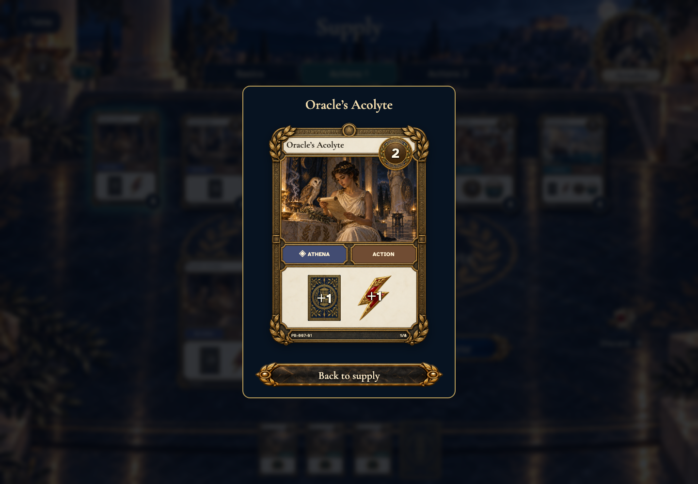

- [x] Read the complete Action before spending anything

## Returning from inspection preserves the purchase choice

Viewpoint: **Ariadne**.

[phone](../../screenshots/buy-an-action-from-an-empty-action-hand-and-play-it-on-turn-five/023-return-to-purchase-phone-darwin.png) · [desktop](../../screenshots/buy-an-action-from-an-empty-action-hand-and-play-it-on-turn-five/023-return-to-purchase-desktop-darwin.png) · [tabletop-4k](../../screenshots/buy-an-action-from-an-empty-action-hand-and-play-it-on-turn-five/023-return-to-purchase-tabletop-4k-darwin.png)

- [x] Returning from inspection preserves the purchase choice

## One purchased copy enters discard and spends both Coins and the Buy

Viewpoint: **Ariadne**.

[phone](../../screenshots/buy-an-action-from-an-empty-action-hand-and-play-it-on-turn-five/024-purchased-phone-darwin.png) · [desktop](../../screenshots/buy-an-action-from-an-empty-action-hand-and-play-it-on-turn-five/024-purchased-desktop-darwin.png) · [tabletop-4k](../../screenshots/buy-an-action-from-an-empty-action-hand-and-play-it-on-turn-five/024-purchased-tabletop-4k-darwin.png)

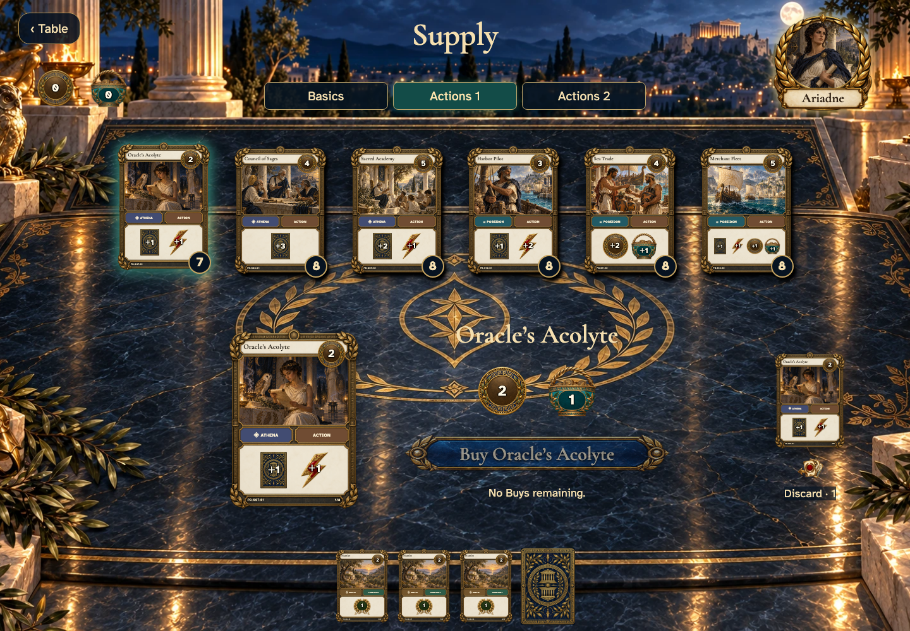

- [x] One purchased copy enters discard and spends both Coins and the Buy

## Theseus sees the purchased Action and its public destination

Viewpoint: **Theseus**.

[phone](../../screenshots/buy-an-action-from-an-empty-action-hand-and-play-it-on-turn-five/025-purchase-observer-phone-darwin.png) · [desktop](../../screenshots/buy-an-action-from-an-empty-action-hand-and-play-it-on-turn-five/025-purchase-observer-desktop-darwin.png) · [tabletop-4k](../../screenshots/buy-an-action-from-an-empty-action-hand-and-play-it-on-turn-five/025-purchase-observer-tabletop-4k-darwin.png)

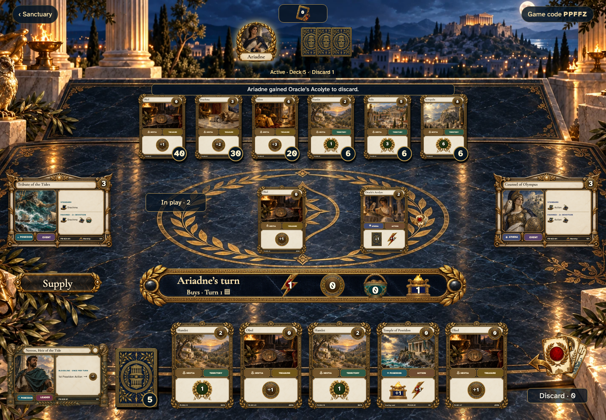

- [x] Theseus sees the purchased Action and its public destination

## Ariadne returns to finish her first turn

Viewpoint: **Ariadne**.

[phone](../../screenshots/buy-an-action-from-an-empty-action-hand-and-play-it-on-turn-five/026-return-to-table-phone-darwin.png) · [desktop](../../screenshots/buy-an-action-from-an-empty-action-hand-and-play-it-on-turn-five/026-return-to-table-desktop-darwin.png) · [tabletop-4k](../../screenshots/buy-an-action-from-an-empty-action-hand-and-play-it-on-turn-five/026-return-to-table-tabletop-4k-darwin.png)

- [x] Ariadne returns to finish her first turn

## Ariadne draws her next five cards and waits

Viewpoint: **Ariadne**.

[phone](../../screenshots/buy-an-action-from-an-empty-action-hand-and-play-it-on-turn-five/027-cleanup-phone-darwin.png) · [desktop](../../screenshots/buy-an-action-from-an-empty-action-hand-and-play-it-on-turn-five/027-cleanup-desktop-darwin.png) · [tabletop-4k](../../screenshots/buy-an-action-from-an-empty-action-hand-and-play-it-on-turn-five/027-cleanup-tabletop-4k-darwin.png)

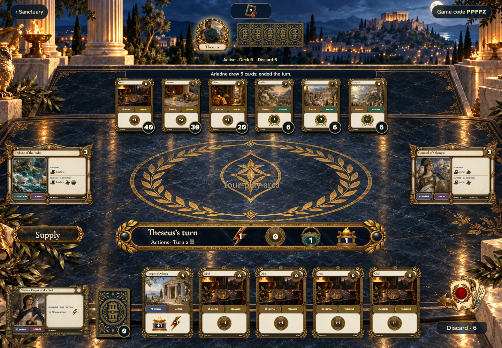

- [x] Ariadne draws her next five cards and waits

## Theseus receives turn 2

Viewpoint: **Theseus**.

[phone](../../screenshots/buy-an-action-from-an-empty-action-hand-and-play-it-on-turn-five/028-turn-2-phone-darwin.png) · [desktop](../../screenshots/buy-an-action-from-an-empty-action-hand-and-play-it-on-turn-five/028-turn-2-desktop-darwin.png) · [tabletop-4k](../../screenshots/buy-an-action-from-an-empty-action-hand-and-play-it-on-turn-five/028-turn-2-tabletop-4k-darwin.png)

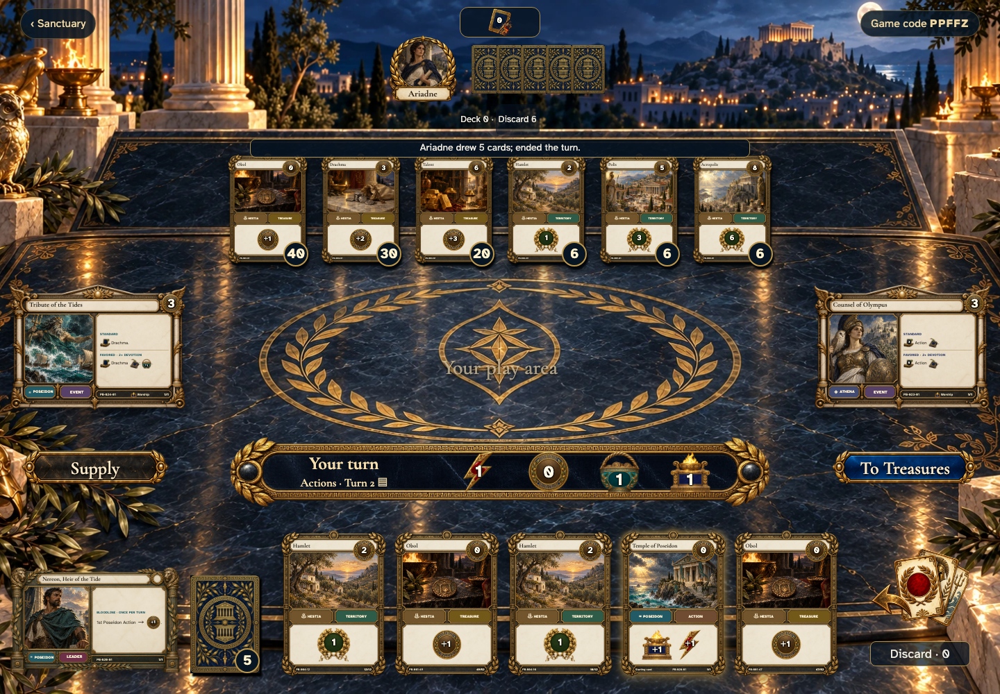

- [x] Theseus receives turn 2

## Theseus is asked before leaving a playable Temple

Viewpoint: **Theseus**.

[phone](../../screenshots/buy-an-action-from-an-empty-action-hand-and-play-it-on-turn-five/029-turn-2-leave-action-phone-darwin.png) · [desktop](../../screenshots/buy-an-action-from-an-empty-action-hand-and-play-it-on-turn-five/029-turn-2-leave-action-desktop-darwin.png) · [tabletop-4k](../../screenshots/buy-an-action-from-an-empty-action-hand-and-play-it-on-turn-five/029-turn-2-leave-action-tabletop-4k-darwin.png)

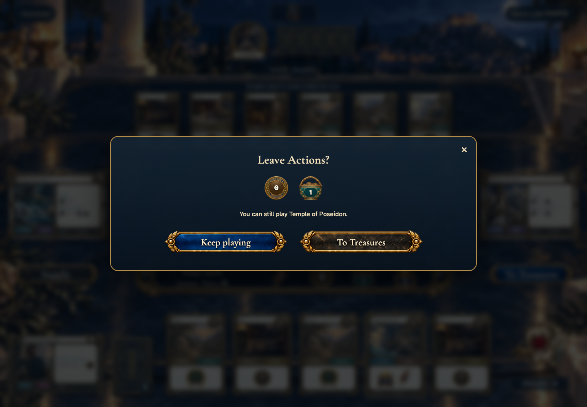

- [x] Theseus is asked before leaving a playable Temple

## Theseus chooses to play wealth on turn 2

Viewpoint: **Theseus**.

[phone](../../screenshots/buy-an-action-from-an-empty-action-hand-and-play-it-on-turn-five/030-turn-2-treasures-phone-darwin.png) · [desktop](../../screenshots/buy-an-action-from-an-empty-action-hand-and-play-it-on-turn-five/030-turn-2-treasures-desktop-darwin.png) · [tabletop-4k](../../screenshots/buy-an-action-from-an-empty-action-hand-and-play-it-on-turn-five/030-turn-2-treasures-tabletop-4k-darwin.png)

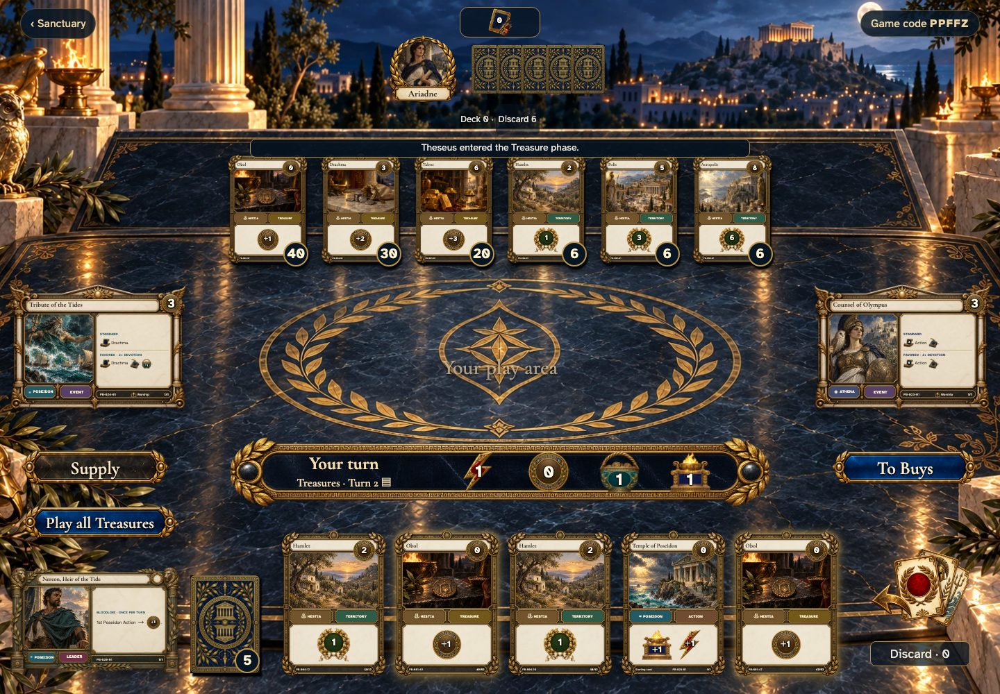

- [x] Theseus chooses to play wealth on turn 2

## Theseus earns 2 Coins

Viewpoint: **Theseus**.

[phone](../../screenshots/buy-an-action-from-an-empty-action-hand-and-play-it-on-turn-five/031-turn-2-wealth-phone-darwin.png) · [desktop](../../screenshots/buy-an-action-from-an-empty-action-hand-and-play-it-on-turn-five/031-turn-2-wealth-desktop-darwin.png) · [tabletop-4k](../../screenshots/buy-an-action-from-an-empty-action-hand-and-play-it-on-turn-five/031-turn-2-wealth-tabletop-4k-darwin.png)

- [x] Theseus earns 2 Coins

## Theseus reaches Buys on turn 2

Viewpoint: **Theseus**.

[phone](../../screenshots/buy-an-action-from-an-empty-action-hand-and-play-it-on-turn-five/032-turn-2-buys-phone-darwin.png) · [desktop](../../screenshots/buy-an-action-from-an-empty-action-hand-and-play-it-on-turn-five/032-turn-2-buys-desktop-darwin.png) · [tabletop-4k](../../screenshots/buy-an-action-from-an-empty-action-hand-and-play-it-on-turn-five/032-turn-2-buys-tabletop-4k-darwin.png)

- [x] Theseus reaches Buys on turn 2

## Theseus confirms leaving the available purchases

Viewpoint: **Theseus**.

[phone](../../screenshots/buy-an-action-from-an-empty-action-hand-and-play-it-on-turn-five/033-turn-2-confirm-phone-darwin.png) · [desktop](../../screenshots/buy-an-action-from-an-empty-action-hand-and-play-it-on-turn-five/033-turn-2-confirm-desktop-darwin.png) · [tabletop-4k](../../screenshots/buy-an-action-from-an-empty-action-hand-and-play-it-on-turn-five/033-turn-2-confirm-tabletop-4k-darwin.png)

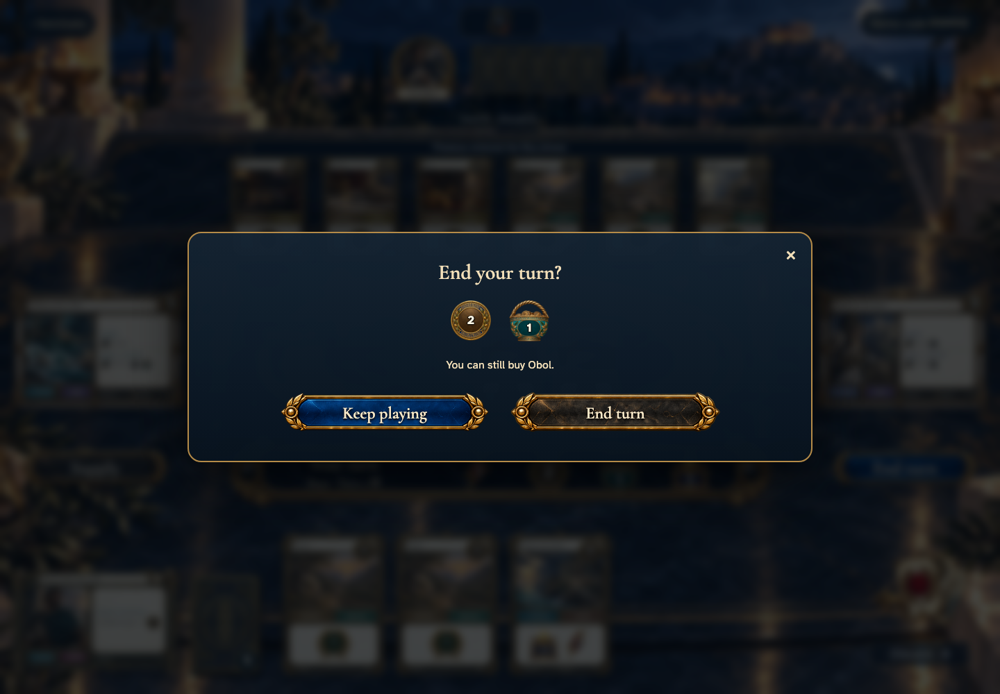

- [x] Theseus confirms leaving the available purchases

## Theseus draws five and hands off the turn

Viewpoint: **Theseus**.

[phone](../../screenshots/buy-an-action-from-an-empty-action-hand-and-play-it-on-turn-five/034-turn-2-finished-phone-darwin.png) · [desktop](../../screenshots/buy-an-action-from-an-empty-action-hand-and-play-it-on-turn-five/034-turn-2-finished-desktop-darwin.png) · [tabletop-4k](../../screenshots/buy-an-action-from-an-empty-action-hand-and-play-it-on-turn-five/034-turn-2-finished-tabletop-4k-darwin.png)

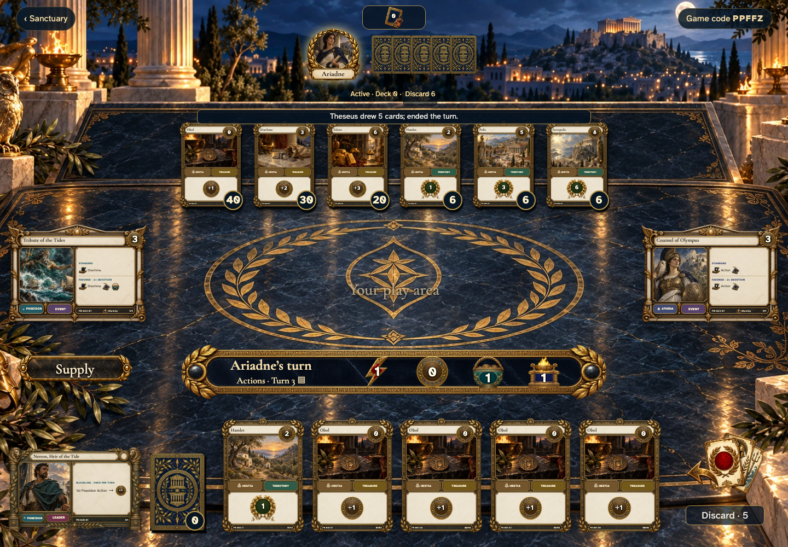

- [x] Theseus draws five and hands off the turn

## Ariadne receives turn 3

Viewpoint: **Ariadne**.

[phone](../../screenshots/buy-an-action-from-an-empty-action-hand-and-play-it-on-turn-five/035-turn-3-phone-darwin.png) · [desktop](../../screenshots/buy-an-action-from-an-empty-action-hand-and-play-it-on-turn-five/035-turn-3-desktop-darwin.png) · [tabletop-4k](../../screenshots/buy-an-action-from-an-empty-action-hand-and-play-it-on-turn-five/035-turn-3-tabletop-4k-darwin.png)

- [x] Ariadne receives turn 3

## Ariadne is asked before leaving a playable Temple

Viewpoint: **Ariadne**.

[phone](../../screenshots/buy-an-action-from-an-empty-action-hand-and-play-it-on-turn-five/036-turn-3-leave-action-phone-darwin.png) · [desktop](../../screenshots/buy-an-action-from-an-empty-action-hand-and-play-it-on-turn-five/036-turn-3-leave-action-desktop-darwin.png) · [tabletop-4k](../../screenshots/buy-an-action-from-an-empty-action-hand-and-play-it-on-turn-five/036-turn-3-leave-action-tabletop-4k-darwin.png)

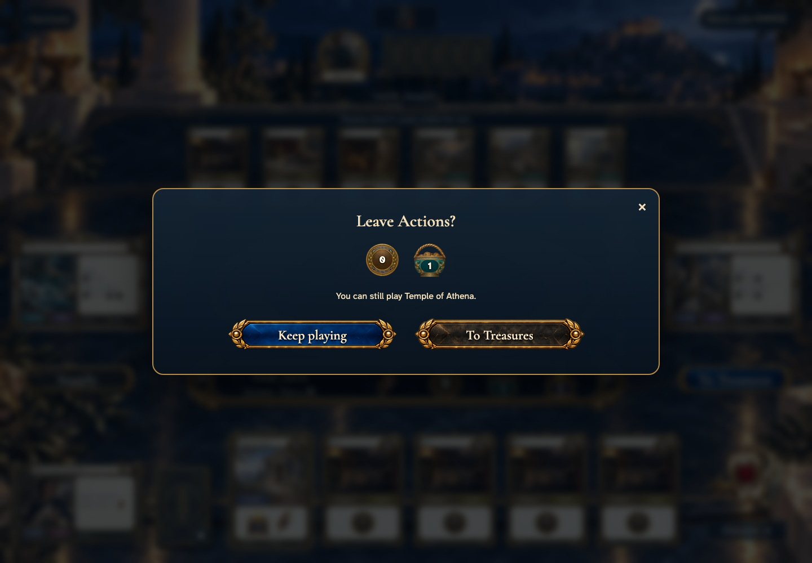

- [x] Ariadne is asked before leaving a playable Temple

## Ariadne chooses to play wealth on turn 3

Viewpoint: **Ariadne**.

[phone](../../screenshots/buy-an-action-from-an-empty-action-hand-and-play-it-on-turn-five/037-turn-3-treasures-phone-darwin.png) · [desktop](../../screenshots/buy-an-action-from-an-empty-action-hand-and-play-it-on-turn-five/037-turn-3-treasures-desktop-darwin.png) · [tabletop-4k](../../screenshots/buy-an-action-from-an-empty-action-hand-and-play-it-on-turn-five/037-turn-3-treasures-tabletop-4k-darwin.png)

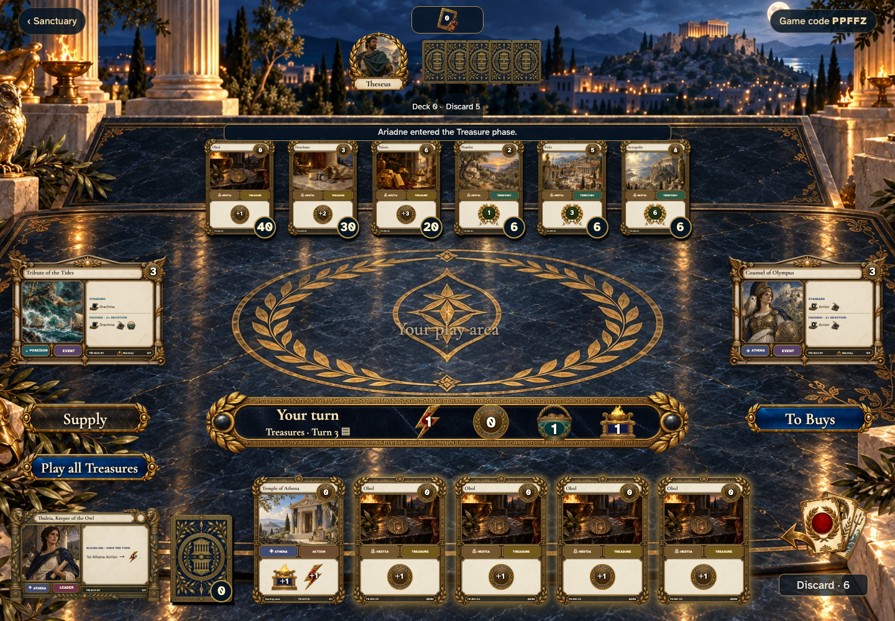

- [x] Ariadne chooses to play wealth on turn 3

## Ariadne earns 4 Coins

Viewpoint: **Ariadne**.

[phone](../../screenshots/buy-an-action-from-an-empty-action-hand-and-play-it-on-turn-five/038-turn-3-wealth-phone-darwin.png) · [desktop](../../screenshots/buy-an-action-from-an-empty-action-hand-and-play-it-on-turn-five/038-turn-3-wealth-desktop-darwin.png) · [tabletop-4k](../../screenshots/buy-an-action-from-an-empty-action-hand-and-play-it-on-turn-five/038-turn-3-wealth-tabletop-4k-darwin.png)

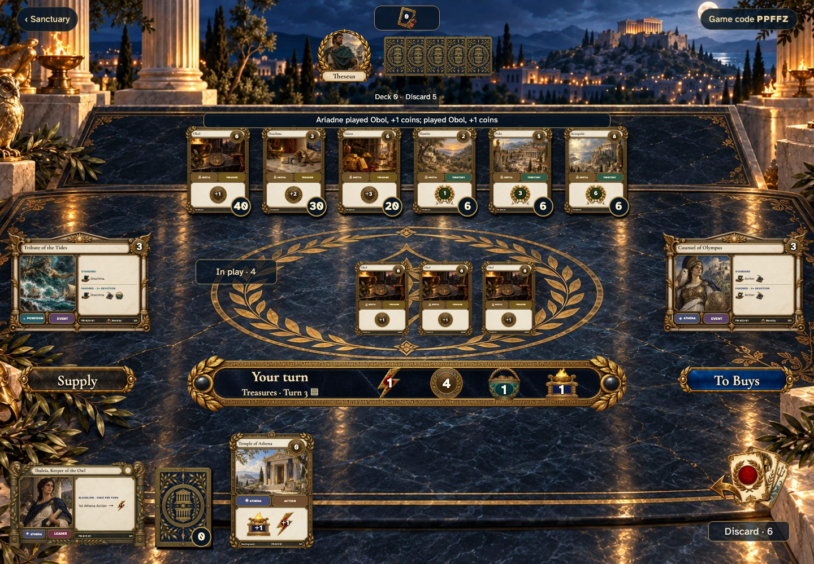

- [x] Ariadne earns 4 Coins

## Ariadne reaches Buys on turn 3

Viewpoint: **Ariadne**.

[phone](../../screenshots/buy-an-action-from-an-empty-action-hand-and-play-it-on-turn-five/039-turn-3-buys-phone-darwin.png) · [desktop](../../screenshots/buy-an-action-from-an-empty-action-hand-and-play-it-on-turn-five/039-turn-3-buys-desktop-darwin.png) · [tabletop-4k](../../screenshots/buy-an-action-from-an-empty-action-hand-and-play-it-on-turn-five/039-turn-3-buys-tabletop-4k-darwin.png)

- [x] Ariadne reaches Buys on turn 3

## Ariadne confirms leaving the available purchases

Viewpoint: **Ariadne**.

[phone](../../screenshots/buy-an-action-from-an-empty-action-hand-and-play-it-on-turn-five/040-turn-3-confirm-phone-darwin.png) · [desktop](../../screenshots/buy-an-action-from-an-empty-action-hand-and-play-it-on-turn-five/040-turn-3-confirm-desktop-darwin.png) · [tabletop-4k](../../screenshots/buy-an-action-from-an-empty-action-hand-and-play-it-on-turn-five/040-turn-3-confirm-tabletop-4k-darwin.png)

- [x] Ariadne confirms leaving the available purchases

## Ariadne draws five and hands off the turn

Viewpoint: **Ariadne**.

[phone](../../screenshots/buy-an-action-from-an-empty-action-hand-and-play-it-on-turn-five/041-turn-3-finished-phone-darwin.png) · [desktop](../../screenshots/buy-an-action-from-an-empty-action-hand-and-play-it-on-turn-five/041-turn-3-finished-desktop-darwin.png) · [tabletop-4k](../../screenshots/buy-an-action-from-an-empty-action-hand-and-play-it-on-turn-five/041-turn-3-finished-tabletop-4k-darwin.png)

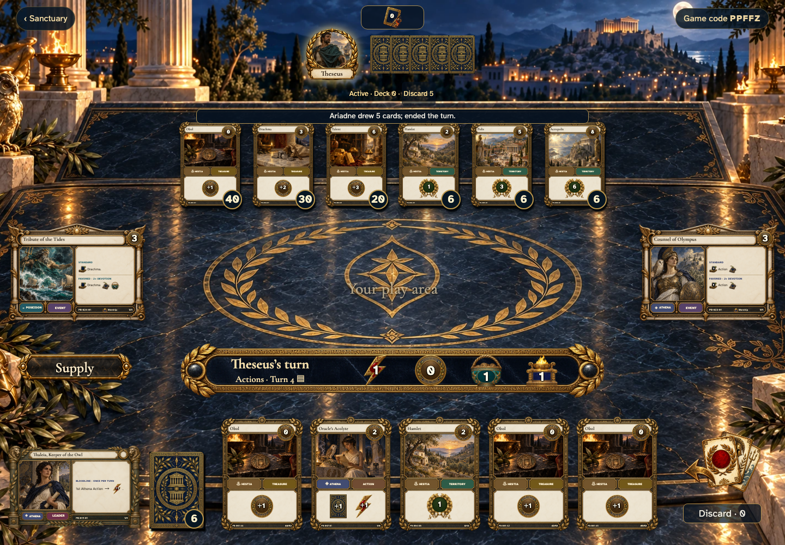

- [x] Ariadne draws five and hands off the turn

## Theseus receives turn 4

Viewpoint: **Theseus**.

[phone](../../screenshots/buy-an-action-from-an-empty-action-hand-and-play-it-on-turn-five/042-turn-4-phone-darwin.png) · [desktop](../../screenshots/buy-an-action-from-an-empty-action-hand-and-play-it-on-turn-five/042-turn-4-desktop-darwin.png) · [tabletop-4k](../../screenshots/buy-an-action-from-an-empty-action-hand-and-play-it-on-turn-five/042-turn-4-tabletop-4k-darwin.png)

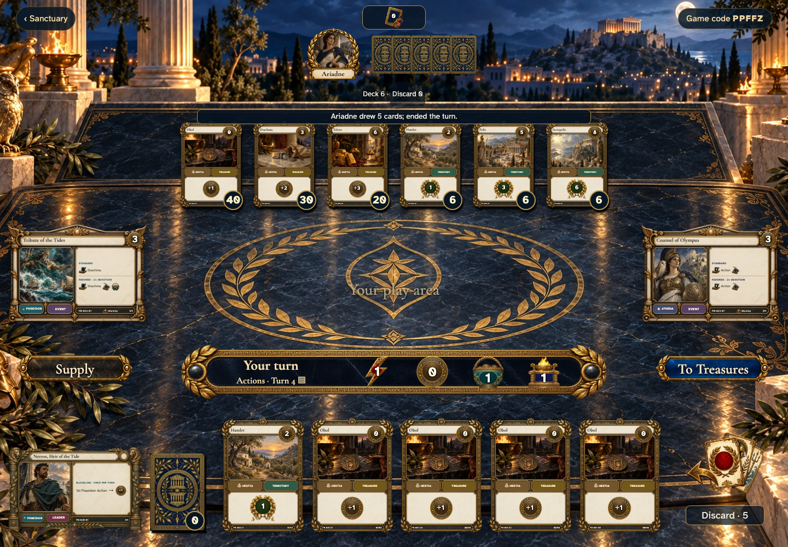

- [x] Theseus receives turn 4

## Theseus chooses to play wealth on turn 4

Viewpoint: **Theseus**.

[phone](../../screenshots/buy-an-action-from-an-empty-action-hand-and-play-it-on-turn-five/043-turn-4-treasures-phone-darwin.png) · [desktop](../../screenshots/buy-an-action-from-an-empty-action-hand-and-play-it-on-turn-five/043-turn-4-treasures-desktop-darwin.png) · [tabletop-4k](../../screenshots/buy-an-action-from-an-empty-action-hand-and-play-it-on-turn-five/043-turn-4-treasures-tabletop-4k-darwin.png)

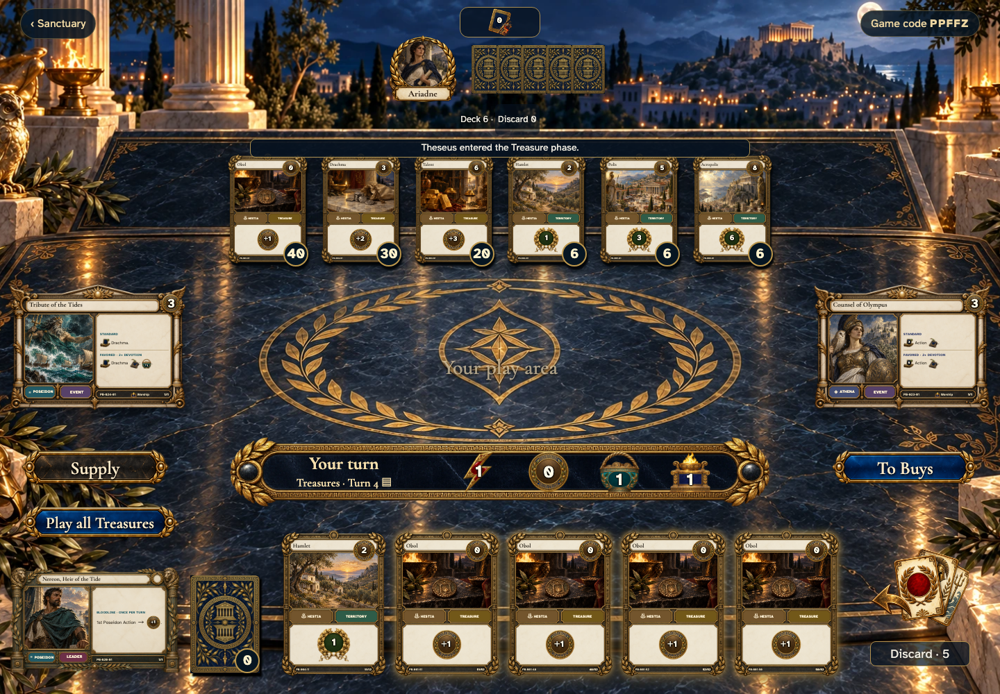

- [x] Theseus chooses to play wealth on turn 4

## Theseus earns 4 Coins

Viewpoint: **Theseus**.

[phone](../../screenshots/buy-an-action-from-an-empty-action-hand-and-play-it-on-turn-five/044-turn-4-wealth-phone-darwin.png) · [desktop](../../screenshots/buy-an-action-from-an-empty-action-hand-and-play-it-on-turn-five/044-turn-4-wealth-desktop-darwin.png) · [tabletop-4k](../../screenshots/buy-an-action-from-an-empty-action-hand-and-play-it-on-turn-five/044-turn-4-wealth-tabletop-4k-darwin.png)

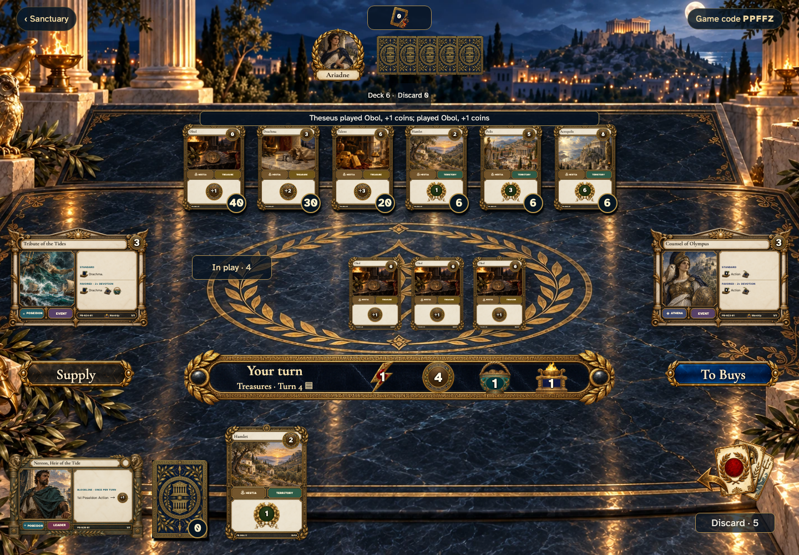

- [x] Theseus earns 4 Coins

## Theseus reaches Buys on turn 4

Viewpoint: **Theseus**.

[phone](../../screenshots/buy-an-action-from-an-empty-action-hand-and-play-it-on-turn-five/045-turn-4-buys-phone-darwin.png) · [desktop](../../screenshots/buy-an-action-from-an-empty-action-hand-and-play-it-on-turn-five/045-turn-4-buys-desktop-darwin.png) · [tabletop-4k](../../screenshots/buy-an-action-from-an-empty-action-hand-and-play-it-on-turn-five/045-turn-4-buys-tabletop-4k-darwin.png)

- [x] Theseus reaches Buys on turn 4

## Theseus confirms leaving the available purchases

Viewpoint: **Theseus**.

[phone](../../screenshots/buy-an-action-from-an-empty-action-hand-and-play-it-on-turn-five/046-turn-4-confirm-phone-darwin.png) · [desktop](../../screenshots/buy-an-action-from-an-empty-action-hand-and-play-it-on-turn-five/046-turn-4-confirm-desktop-darwin.png) · [tabletop-4k](../../screenshots/buy-an-action-from-an-empty-action-hand-and-play-it-on-turn-five/046-turn-4-confirm-tabletop-4k-darwin.png)

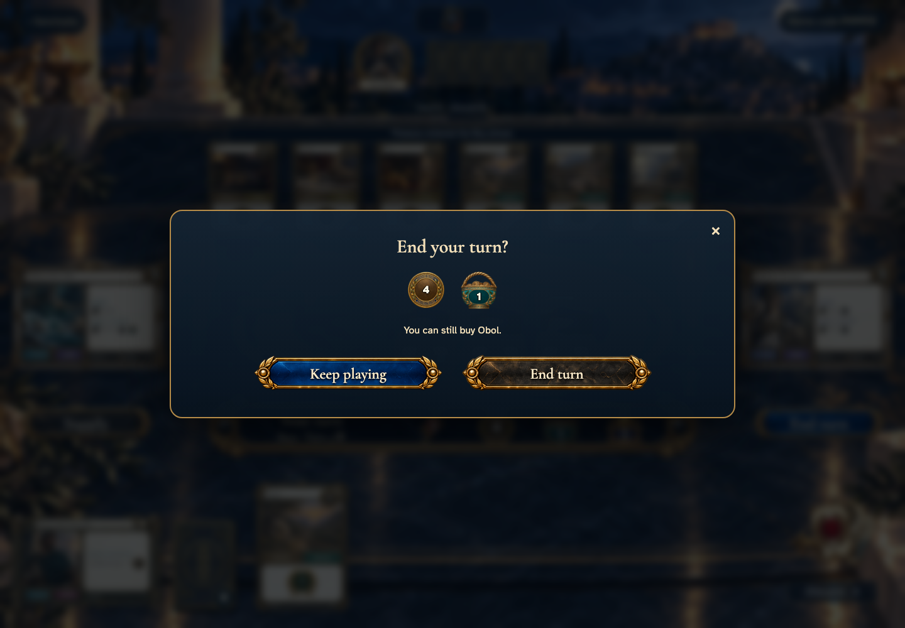

- [x] Theseus confirms leaving the available purchases

## Theseus draws five and hands off the turn

Viewpoint: **Theseus**.

[phone](../../screenshots/buy-an-action-from-an-empty-action-hand-and-play-it-on-turn-five/047-turn-4-finished-phone-darwin.png) · [desktop](../../screenshots/buy-an-action-from-an-empty-action-hand-and-play-it-on-turn-five/047-turn-4-finished-desktop-darwin.png) · [tabletop-4k](../../screenshots/buy-an-action-from-an-empty-action-hand-and-play-it-on-turn-five/047-turn-4-finished-tabletop-4k-darwin.png)

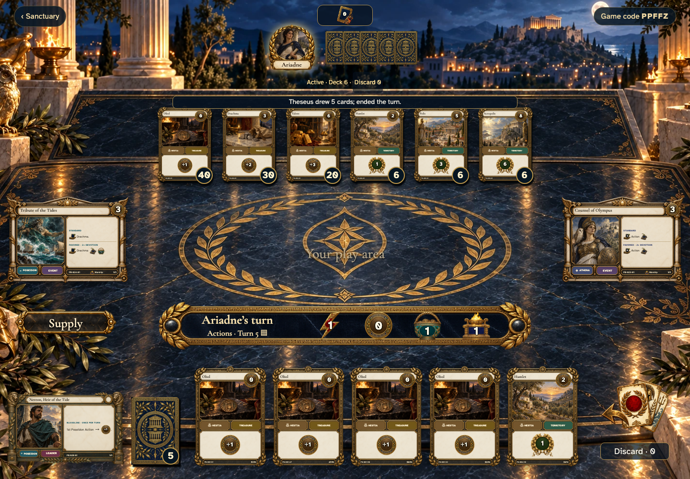

- [x] Theseus draws five and hands off the turn

## On turn five Ariadne holds the Action she bought

Viewpoint: **Ariadne**.

[phone](../../screenshots/buy-an-action-from-an-empty-action-hand-and-play-it-on-turn-five/048-purchased-in-hand-phone-darwin.png) · [desktop](../../screenshots/buy-an-action-from-an-empty-action-hand-and-play-it-on-turn-five/048-purchased-in-hand-desktop-darwin.png) · [tabletop-4k](../../screenshots/buy-an-action-from-an-empty-action-hand-and-play-it-on-turn-five/048-purchased-in-hand-tabletop-4k-darwin.png)

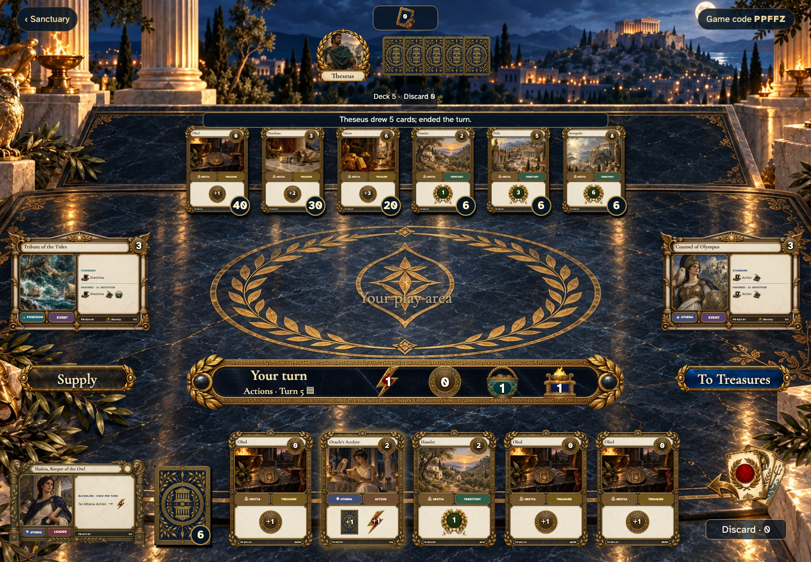

- [x] On turn five Ariadne holds the Action she bought

## Ariadne inspects the purchased physical copy

Viewpoint: **Ariadne**.

[phone](../../screenshots/buy-an-action-from-an-empty-action-hand-and-play-it-on-turn-five/049-purchased-inspector-phone-darwin.png) · [desktop](../../screenshots/buy-an-action-from-an-empty-action-hand-and-play-it-on-turn-five/049-purchased-inspector-desktop-darwin.png) · [tabletop-4k](../../screenshots/buy-an-action-from-an-empty-action-hand-and-play-it-on-turn-five/049-purchased-inspector-tabletop-4k-darwin.png)

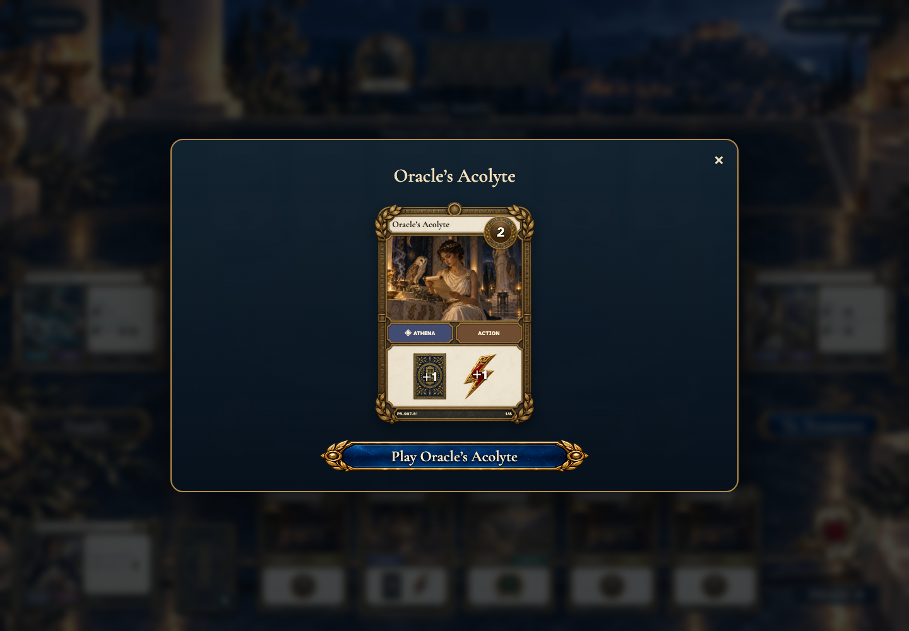

- [x] Ariadne inspects the purchased physical copy

## The Action draws a card and Thaleia adds her Action reward

Viewpoint: **Ariadne**.

[phone](../../screenshots/buy-an-action-from-an-empty-action-hand-and-play-it-on-turn-five/050-purchased-played-phone-darwin.png) · [desktop](../../screenshots/buy-an-action-from-an-empty-action-hand-and-play-it-on-turn-five/050-purchased-played-desktop-darwin.png) · [tabletop-4k](../../screenshots/buy-an-action-from-an-empty-action-hand-and-play-it-on-turn-five/050-purchased-played-tabletop-4k-darwin.png)

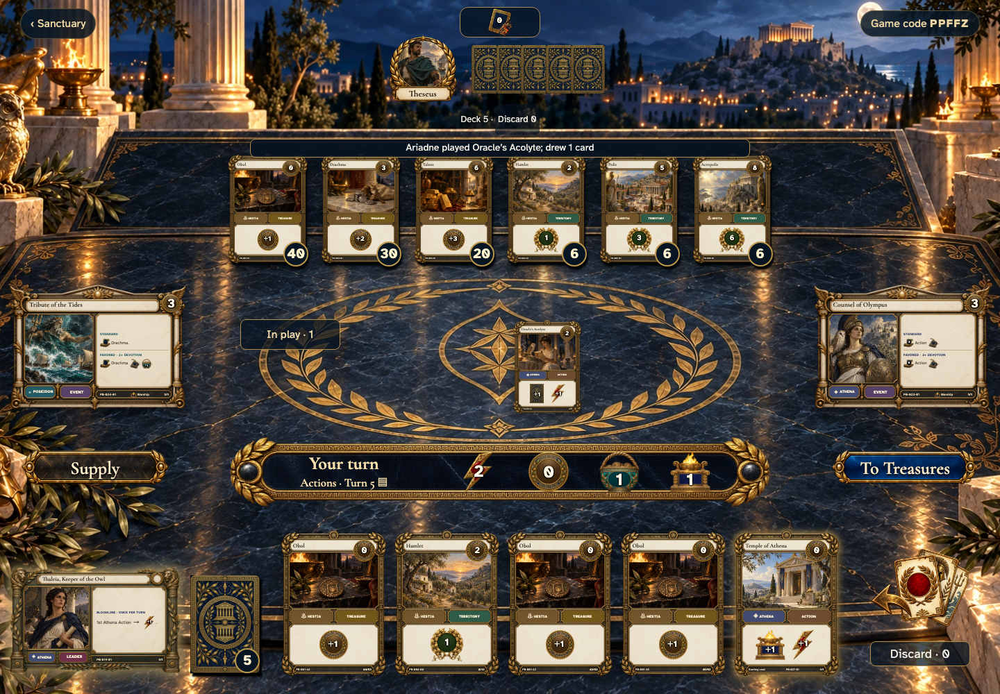

- [x] The Action draws a card and Thaleia adds her Action reward

## Theseus sees the Action and reward without seeing the private draw

Viewpoint: **Theseus**.

[phone](../../screenshots/buy-an-action-from-an-empty-action-hand-and-play-it-on-turn-five/051-played-observer-phone-darwin.png) · [desktop](../../screenshots/buy-an-action-from-an-empty-action-hand-and-play-it-on-turn-five/051-played-observer-desktop-darwin.png) · [tabletop-4k](../../screenshots/buy-an-action-from-an-empty-action-hand-and-play-it-on-turn-five/051-played-observer-tabletop-4k-darwin.png)

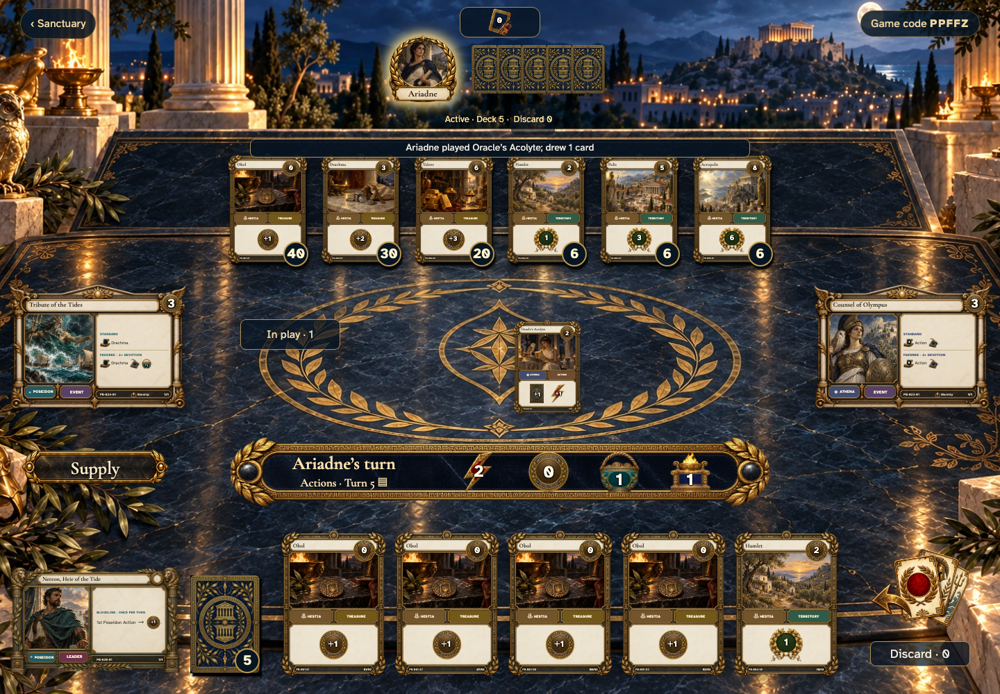

- [x] Theseus sees the Action and reward without seeing the private draw
