# departure reminders name the most valuable playable Action and Treasure

Recorded-history integration scenario. A legal event history prepares the starting position directly in the emulator. This verifies the illustrated effect from that position; it does not demonstrate the player journey to reach it.

## The reminder names Council of Sages instead of the cheaper Acolyte

<table>
<tr><th>Desktop · 1440 × 1000</th><th>Phone · 393 × 852</th></tr>
<tr>
<td valign="top"><a href="../../screenshots/departure-reminders-name-the-most-valuable-playable-action-and-treasure/000-valuable-action-desktop-darwin.png">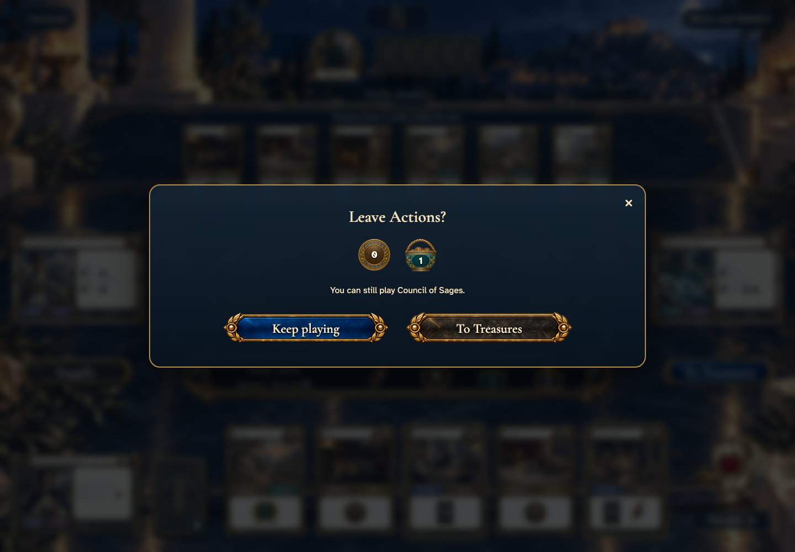</a></td>
<td valign="top"><a href="../../screenshots/departure-reminders-name-the-most-valuable-playable-action-and-treasure/000-valuable-action-phone-darwin.png">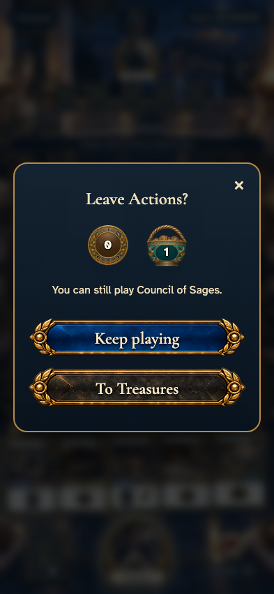</a></td>
</tr>
</table>

Tabletop · 3840 × 2160 — expand screenshot

<a href="../../screenshots/departure-reminders-name-the-most-valuable-playable-action-and-treasure/000-valuable-action-tabletop-4k-darwin.png">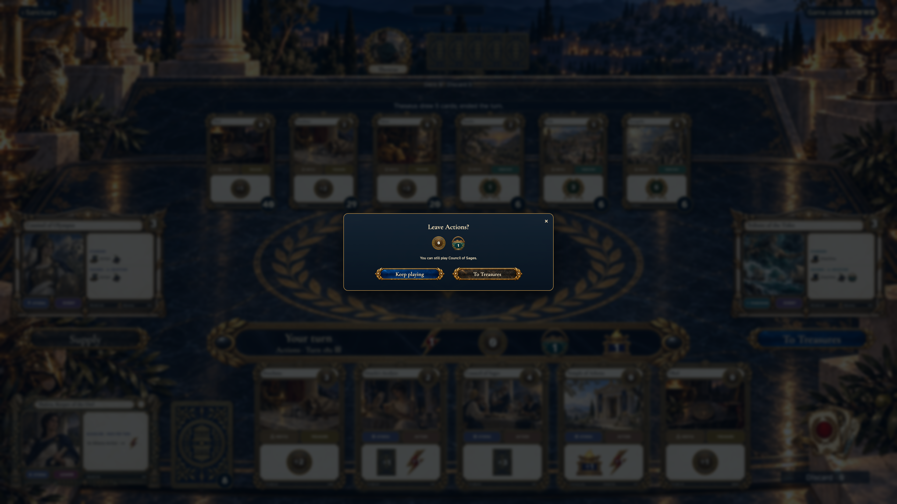</a>

- [x] The highest-cost playable Action is named.

## The reminder names the most valuable unplayed Treasure

<table>
<tr><th>Desktop · 1440 × 1000</th><th>Phone · 393 × 852</th></tr>
<tr>
<td valign="top"><a href="../../screenshots/departure-reminders-name-the-most-valuable-playable-action-and-treasure/001-valuable-treasure-desktop-darwin.png">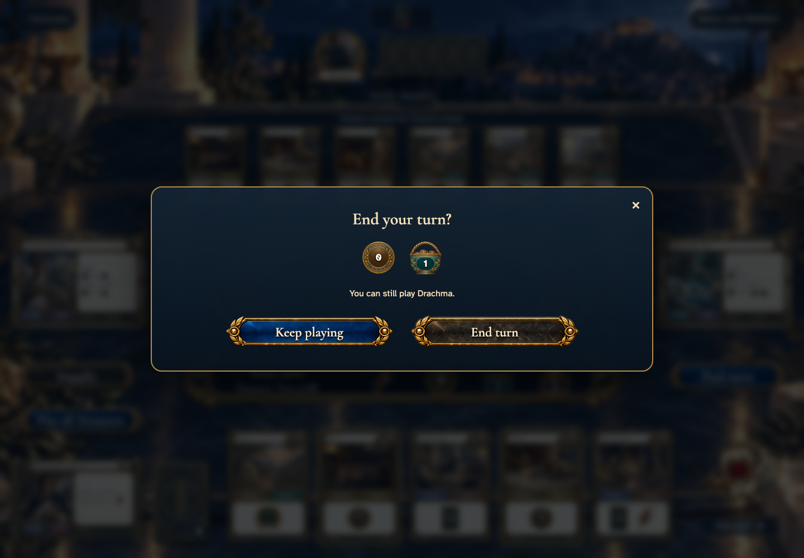</a></td>
<td valign="top"><a href="../../screenshots/departure-reminders-name-the-most-valuable-playable-action-and-treasure/001-valuable-treasure-phone-darwin.png">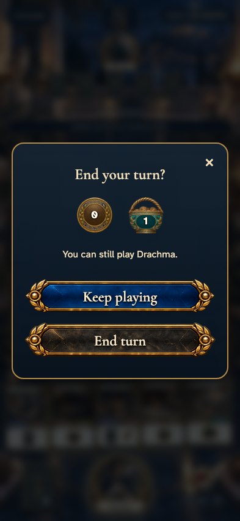</a></td>
</tr>
</table>

Tabletop · 3840 × 2160 — expand screenshot

<a href="../../screenshots/departure-reminders-name-the-most-valuable-playable-action-and-treasure/001-valuable-treasure-tabletop-4k-darwin.png">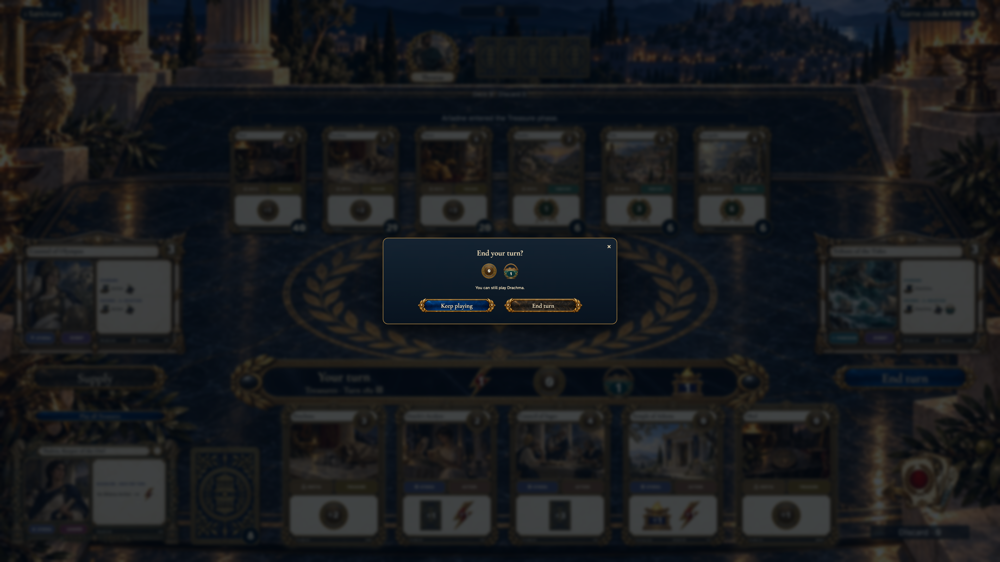</a>

- [x] Drachma is offered before ending the turn.

## Treasure play leads directly to an available purchase

<table>
<tr><th>Desktop · 1440 × 1000</th><th>Phone · 393 × 852</th></tr>
<tr>
<td valign="top"><a href="../../screenshots/departure-reminders-name-the-most-valuable-playable-action-and-treasure/002-direct-purchase-desktop-darwin.png">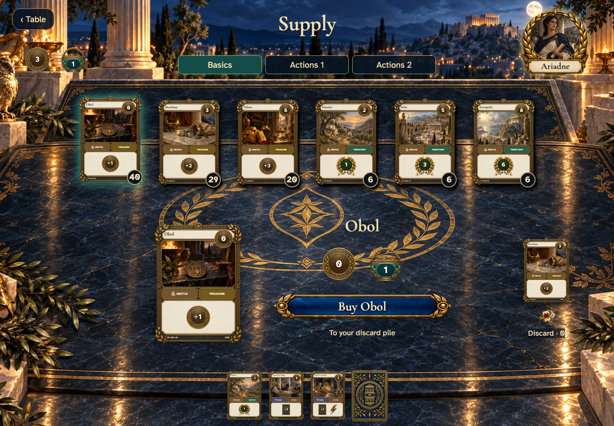</a></td>
<td valign="top"><a href="../../screenshots/departure-reminders-name-the-most-valuable-playable-action-and-treasure/002-direct-purchase-phone-darwin.png">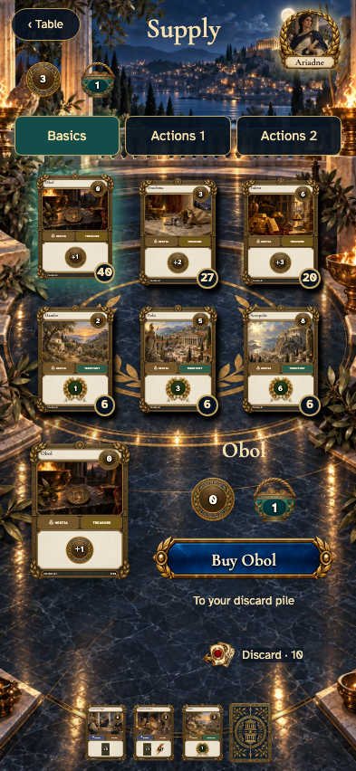</a></td>
</tr>
</table>

Tabletop · 3840 × 2160 — expand screenshot

<a href="../../screenshots/departure-reminders-name-the-most-valuable-playable-action-and-treasure/002-direct-purchase-tabletop-4k-darwin.png">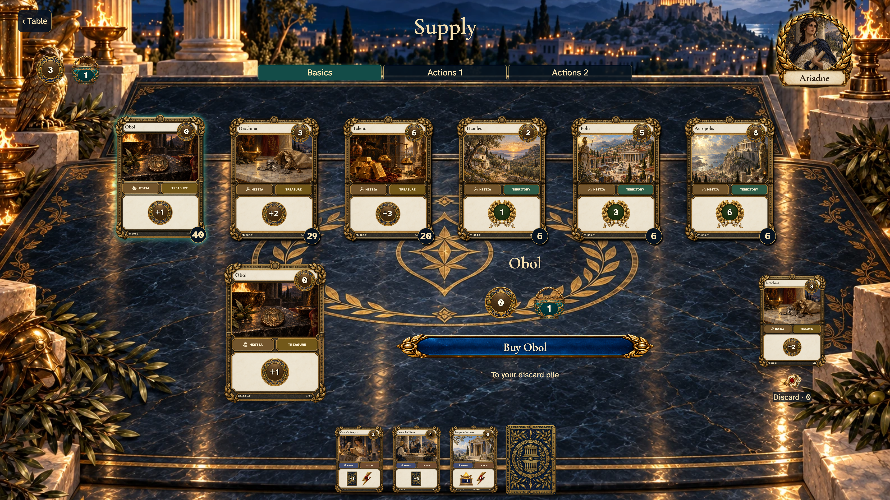</a>

- [x] Buy is enabled without a separate phase transition.

## The first purchase closes Treasure play automatically

<table>
<tr><th>Desktop · 1440 × 1000</th><th>Phone · 393 × 852</th></tr>
<tr>
<td valign="top"><a href="../../screenshots/departure-reminders-name-the-most-valuable-playable-action-and-treasure/003-purchase-closes-treasures-desktop-darwin.png">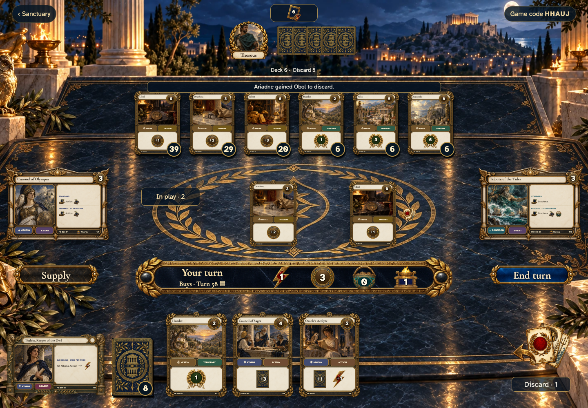</a></td>
<td valign="top"><a href="../../screenshots/departure-reminders-name-the-most-valuable-playable-action-and-treasure/003-purchase-closes-treasures-phone-darwin.png">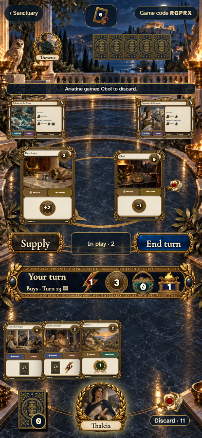</a></td>
</tr>
</table>

Tabletop · 3840 × 2160 — expand screenshot

<a href="../../screenshots/departure-reminders-name-the-most-valuable-playable-action-and-treasure/003-purchase-closes-treasures-tabletop-4k-darwin.png">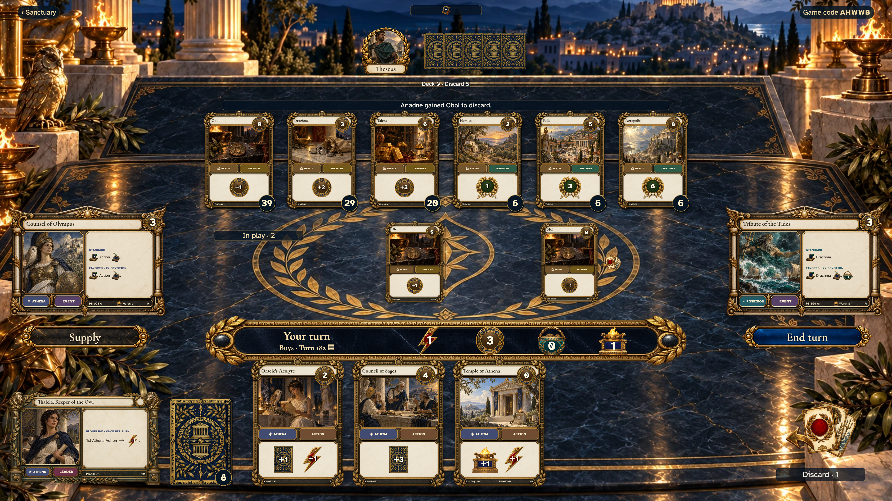</a>

- [x] The table shows Buys and no Treasure-play control.
