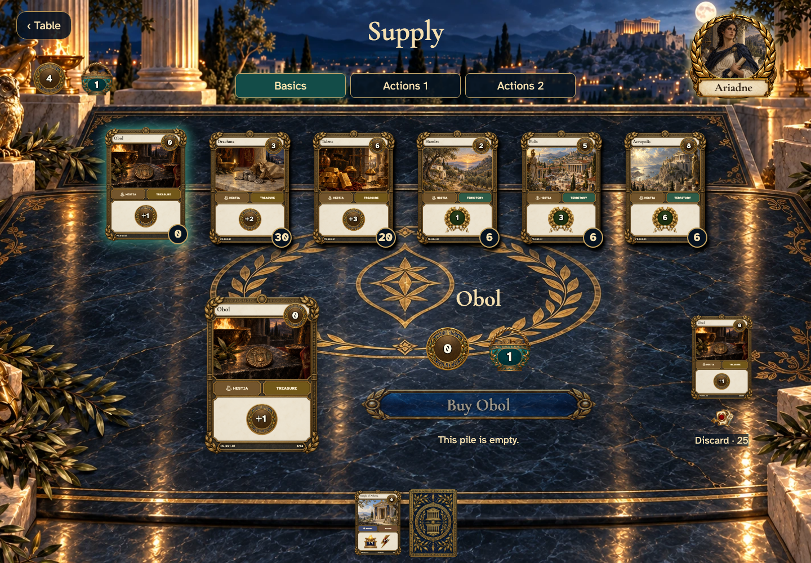

# empty piles stay inspectable and optional Action departure can be cancelled

Recorded-history integration scenario. A legal event history prepares the starting position directly in the emulator. This verifies the illustrated effect from that position; it does not demonstrate the player journey to reach it.

## An empty pile remains visible

[phone](../../screenshots/empty-piles-stay-inspectable-and-optional-action-departure-can-be-cancelled/000-empty-pile-phone-darwin.png) · [desktop](../../screenshots/empty-piles-stay-inspectable-and-optional-action-departure-can-be-cancelled/000-empty-pile-desktop-darwin.png) · [tabletop-4k](../../screenshots/empty-piles-stay-inspectable-and-optional-action-departure-can-be-cancelled/000-empty-pile-tabletop-4k-darwin.png)

- [x] The card is inspectable but its Buy control explains that the pile is empty.
