# finish choices before automatically entering Treasures and browse every supply cost

Recorded-history integration scenario. A legal event history prepares the starting position directly in the emulator. This verifies the illustrated effect from that position; it does not demonstrate the player journey to reach it.

## The last Action still completes its choice

<table>
<tr><th>Desktop · 1440 × 1000</th><th>Phone · 393 × 852</th></tr>
<tr>
<td valign="top"><a href="../../screenshots/finish-choices-before-automatically-entering-treasures-and-browse-every-supply-cost/000-choice-desktop-darwin.png">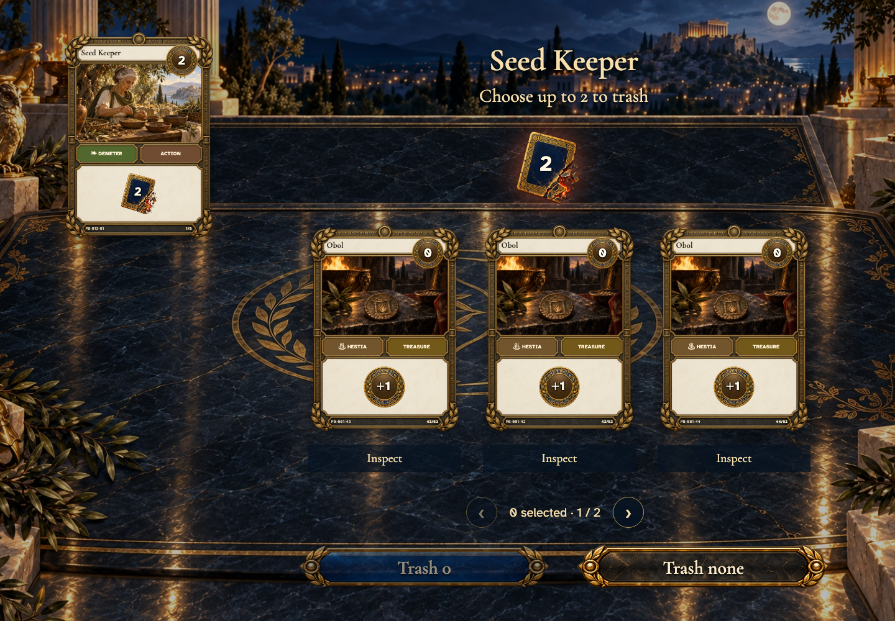</a></td>
<td valign="top"><a href="../../screenshots/finish-choices-before-automatically-entering-treasures-and-browse-every-supply-cost/000-choice-phone-darwin.png">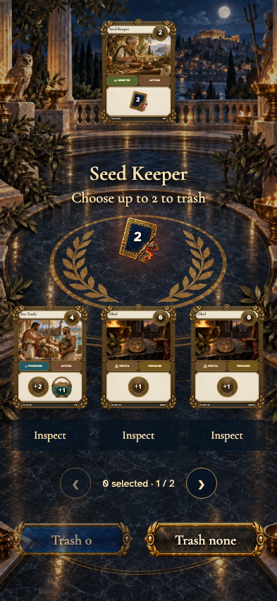</a></td>
</tr>
</table>

Tabletop · 3840 × 2160 — expand screenshot

<a href="../../screenshots/finish-choices-before-automatically-entering-treasures-and-browse-every-supply-cost/000-choice-tabletop-4k-darwin.png">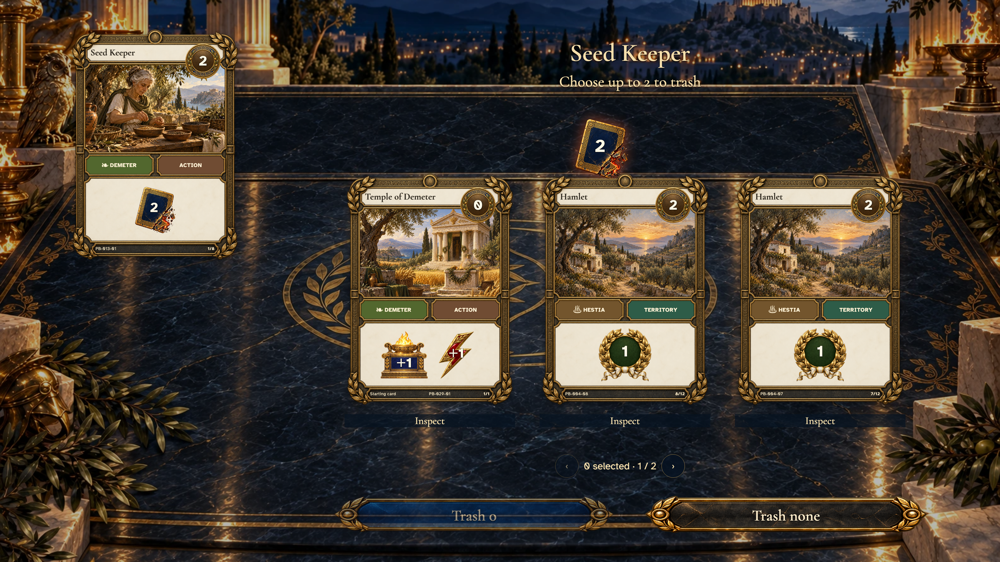</a>

- [x] The optional trash remains open before automatic advancement.

## The resolved Action automatically enters Treasures

<table>
<tr><th>Desktop · 1440 × 1000</th><th>Phone · 393 × 852</th></tr>
<tr>
<td valign="top"><a href="../../screenshots/finish-choices-before-automatically-entering-treasures-and-browse-every-supply-cost/001-treasures-desktop-darwin.png">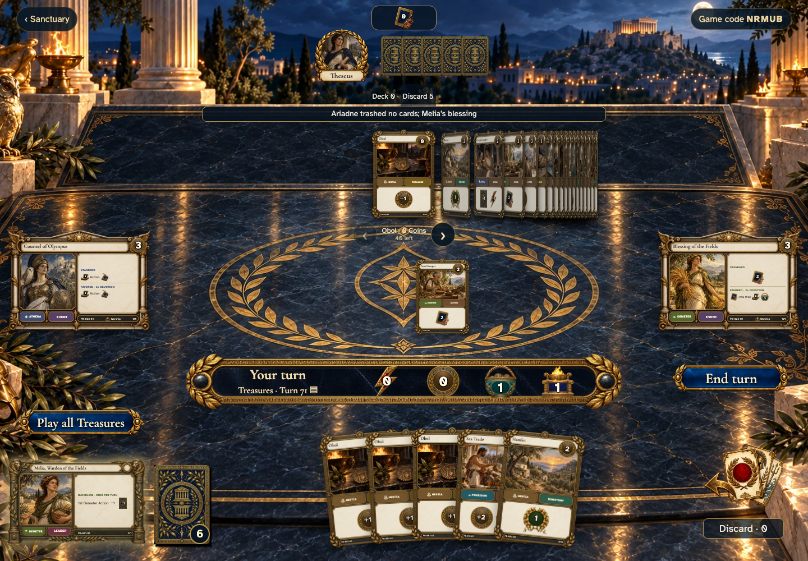</a></td>
<td valign="top"><a href="../../screenshots/finish-choices-before-automatically-entering-treasures-and-browse-every-supply-cost/001-treasures-phone-darwin.png">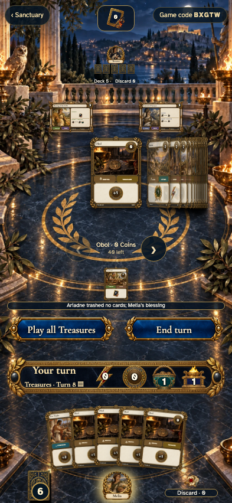</a></td>
</tr>
</table>

Tabletop · 3840 × 2160 — expand screenshot

<a href="../../screenshots/finish-choices-before-automatically-entering-treasures-and-browse-every-supply-cost/001-treasures-tabletop-4k-darwin.png">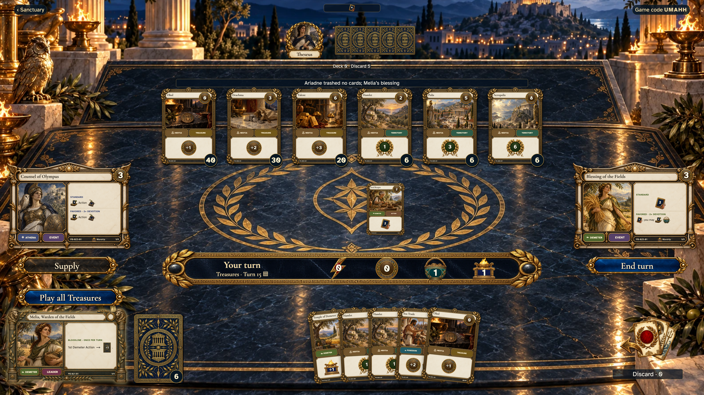</a>

- [x] No phase button or prompt is needed, and the transition is recorded once.

## The affordable boundary starts at the right face-up card

<table>
<tr><th>Desktop · 1440 × 1000</th><th>Phone · 393 × 852</th></tr>
<tr>
<td valign="top"><a href="../../screenshots/finish-choices-before-automatically-entering-treasures-and-browse-every-supply-cost/002-affordable-desktop-darwin.png">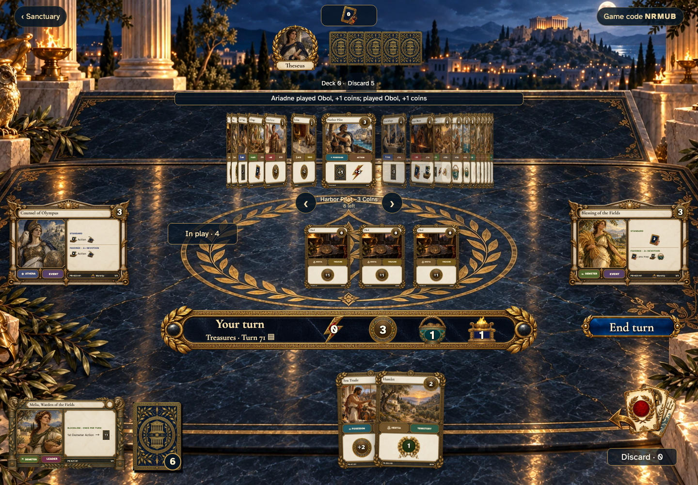</a></td>
<td valign="top"><a href="../../screenshots/finish-choices-before-automatically-entering-treasures-and-browse-every-supply-cost/002-affordable-phone-darwin.png">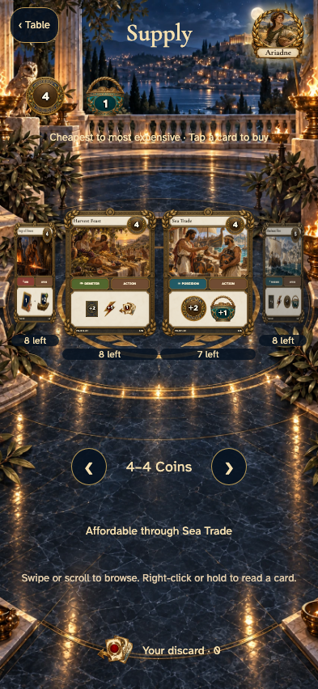</a></td>
</tr>
</table>

Tabletop · 3840 × 2160 — expand screenshot

<a href="../../screenshots/finish-choices-before-automatically-entering-treasures-and-browse-every-supply-cost/002-affordable-tabletop-4k-darwin.png">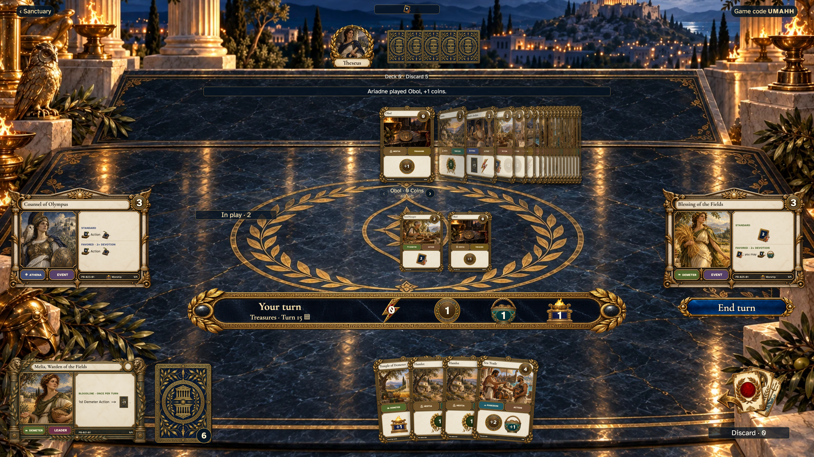</a>

- [x] The most expensive available purchase is the last face-up card.

## All piles remain reachable in the same display

<table>
<tr><th>Desktop · 1440 × 1000</th><th>Phone · 393 × 852</th></tr>
<tr>
<td valign="top"><a href="../../screenshots/finish-choices-before-automatically-entering-treasures-and-browse-every-supply-cost/003-expensive-desktop-darwin.png">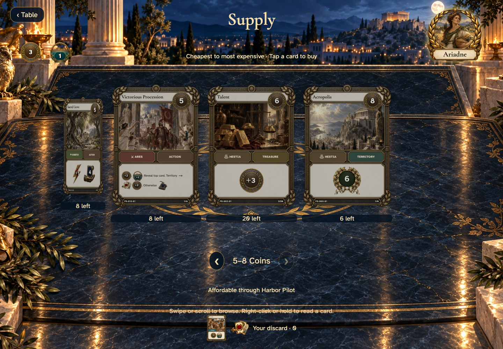</a></td>
<td valign="top"><a href="../../screenshots/finish-choices-before-automatically-entering-treasures-and-browse-every-supply-cost/003-expensive-phone-darwin.png">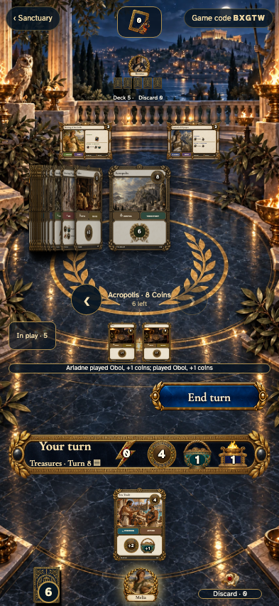</a></td>
</tr>
</table>

Tabletop · 3840 × 2160 — expand screenshot

<a href="../../screenshots/finish-choices-before-automatically-entering-treasures-and-browse-every-supply-cost/003-expensive-tabletop-4k-darwin.png">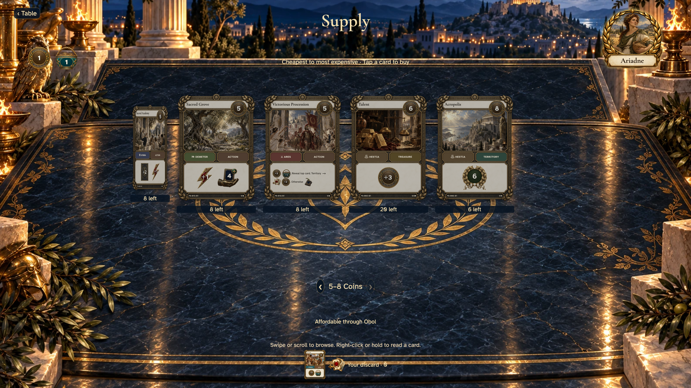</a>

- [x] The costliest Territory is visible without changing supply screens.
