# leaving Actions is immediate and ending the turn names the most valuable Treasure

Recorded-history integration scenario. A legal event history prepares the starting position directly in the emulator. This verifies the illustrated effect from that position; it does not demonstrate the player journey to reach it.

## Move directly to Treasures without a confirmation

<table>
<tr><th>Desktop · 1440 × 1000</th><th>Phone · 393 × 852</th></tr>
<tr>
<td valign="top"><a href="../../screenshots/leaving-actions-is-immediate-and-ending-the-turn-names-the-most-valuable-treasure/000-treasure-phase-desktop-darwin.png">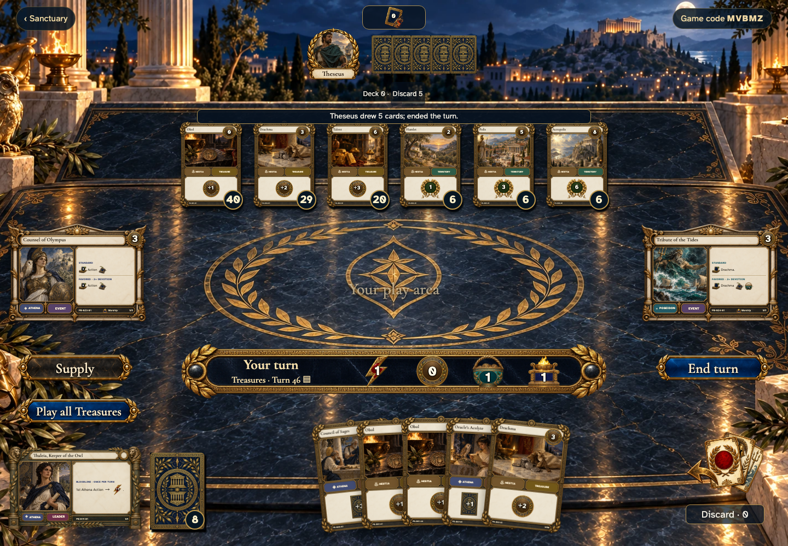</a></td>
<td valign="top"><a href="../../screenshots/leaving-actions-is-immediate-and-ending-the-turn-names-the-most-valuable-treasure/000-treasure-phase-phone-darwin.png">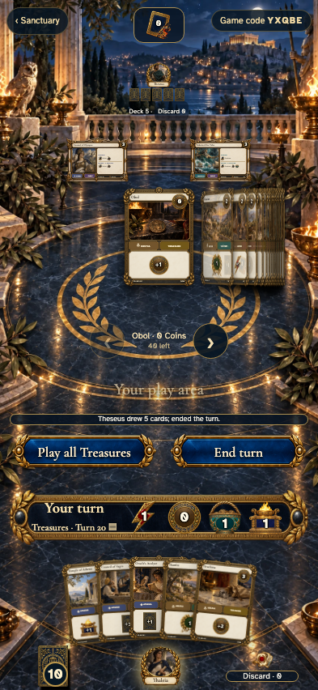</a></td>
</tr>
</table>

Tabletop · 3840 × 2160 — expand screenshot

<a href="../../screenshots/leaving-actions-is-immediate-and-ending-the-turn-names-the-most-valuable-treasure/000-treasure-phase-tabletop-4k-darwin.png">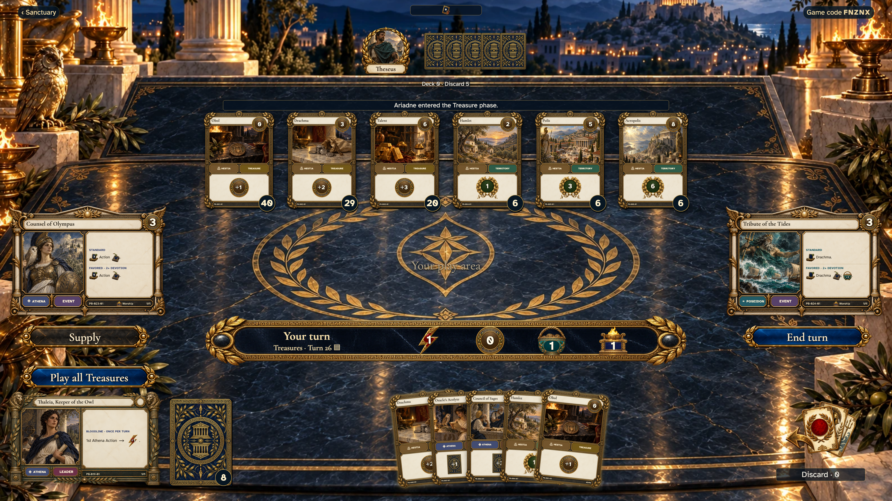</a>

- [x] The phase changes immediately and no modal opens.

## The reminder names the most valuable unplayed Treasure

<table>
<tr><th>Desktop · 1440 × 1000</th><th>Phone · 393 × 852</th></tr>
<tr>
<td valign="top"><a href="../../screenshots/leaving-actions-is-immediate-and-ending-the-turn-names-the-most-valuable-treasure/001-valuable-treasure-desktop-darwin.png">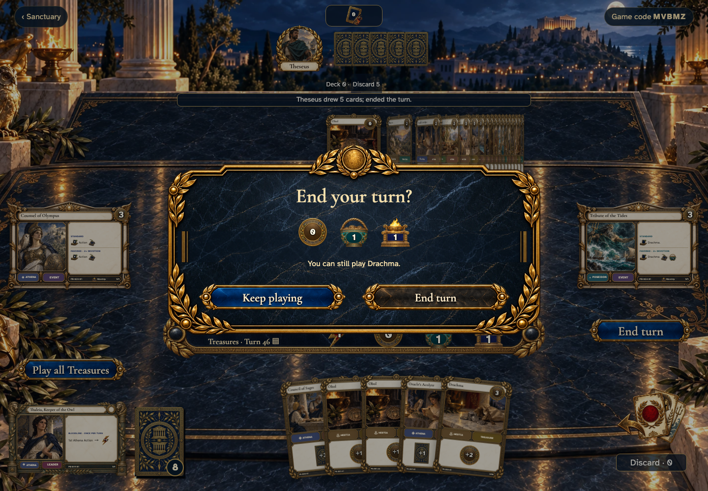</a></td>
<td valign="top"><a href="../../screenshots/leaving-actions-is-immediate-and-ending-the-turn-names-the-most-valuable-treasure/001-valuable-treasure-phone-darwin.png">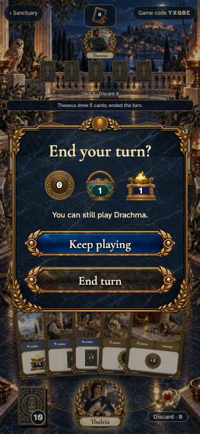</a></td>
</tr>
</table>

Tabletop · 3840 × 2160 — expand screenshot

<a href="../../screenshots/leaving-actions-is-immediate-and-ending-the-turn-names-the-most-valuable-treasure/001-valuable-treasure-tabletop-4k-darwin.png">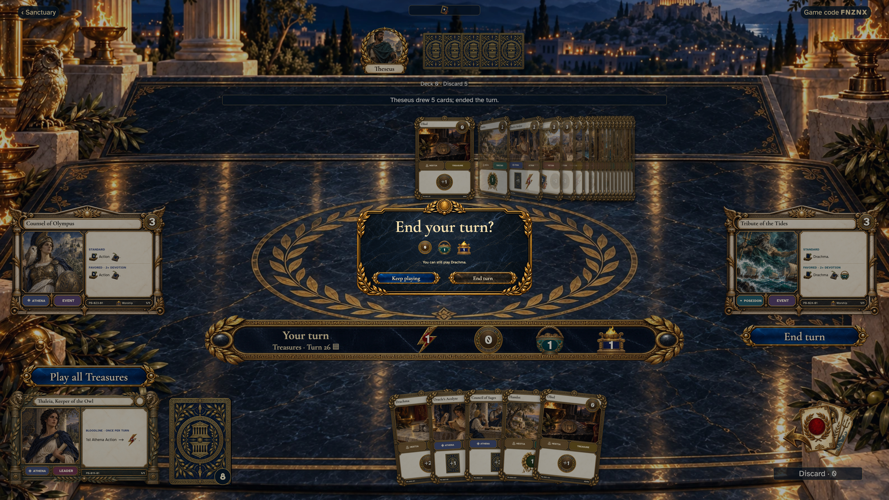</a>

- [x] Drachma is offered before ending the turn.

## Treasure play leads directly to an available purchase

<table>
<tr><th>Desktop · 1440 × 1000</th><th>Phone · 393 × 852</th></tr>
<tr>
<td valign="top"><a href="../../screenshots/leaving-actions-is-immediate-and-ending-the-turn-names-the-most-valuable-treasure/002-direct-purchase-desktop-darwin.png">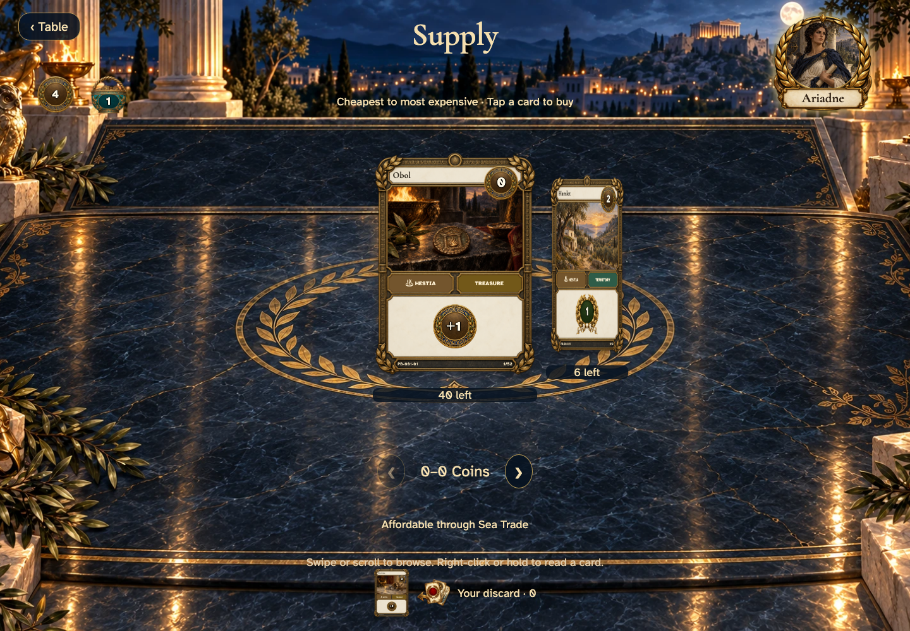</a></td>
<td valign="top"><a href="../../screenshots/leaving-actions-is-immediate-and-ending-the-turn-names-the-most-valuable-treasure/002-direct-purchase-phone-darwin.png">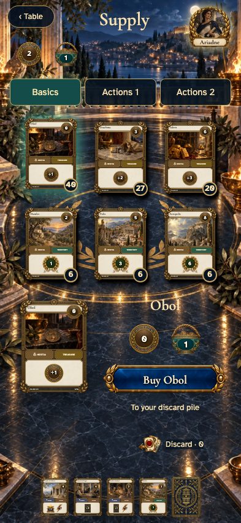</a></td>
</tr>
</table>

Tabletop · 3840 × 2160 — expand screenshot

<a href="../../screenshots/leaving-actions-is-immediate-and-ending-the-turn-names-the-most-valuable-treasure/002-direct-purchase-tabletop-4k-darwin.png">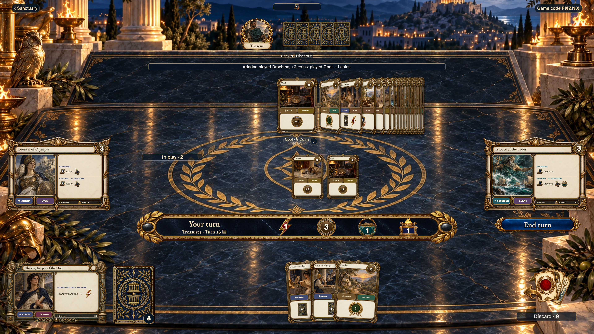</a>

- [x] Buy is enabled without a separate phase transition.

## The first purchase closes Treasure play automatically

<table>
<tr><th>Desktop · 1440 × 1000</th><th>Phone · 393 × 852</th></tr>
<tr>
<td valign="top"><a href="../../screenshots/leaving-actions-is-immediate-and-ending-the-turn-names-the-most-valuable-treasure/003-purchase-closes-treasures-desktop-darwin.png">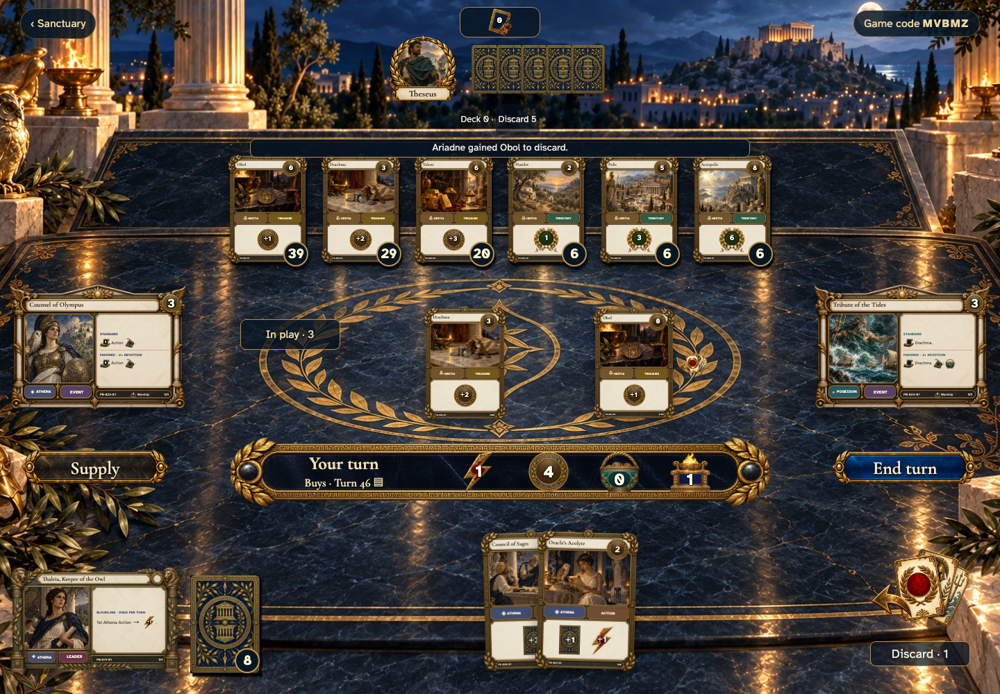</a></td>
<td valign="top"><a href="../../screenshots/leaving-actions-is-immediate-and-ending-the-turn-names-the-most-valuable-treasure/003-purchase-closes-treasures-phone-darwin.png">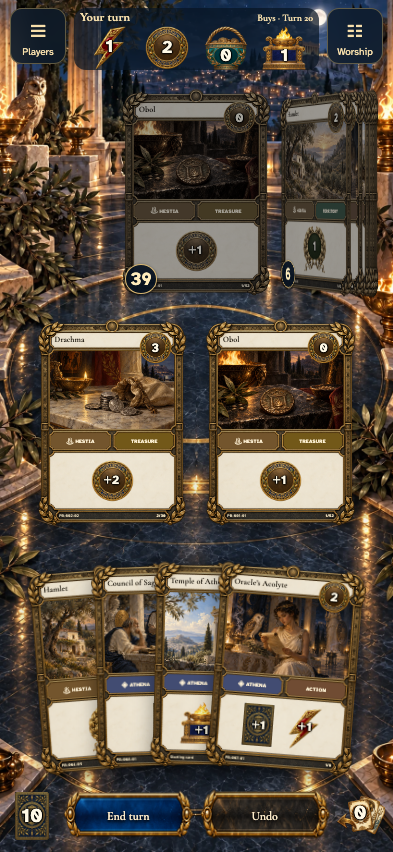</a></td>
</tr>
</table>

Tabletop · 3840 × 2160 — expand screenshot

<a href="../../screenshots/leaving-actions-is-immediate-and-ending-the-turn-names-the-most-valuable-treasure/003-purchase-closes-treasures-tabletop-4k-darwin.png">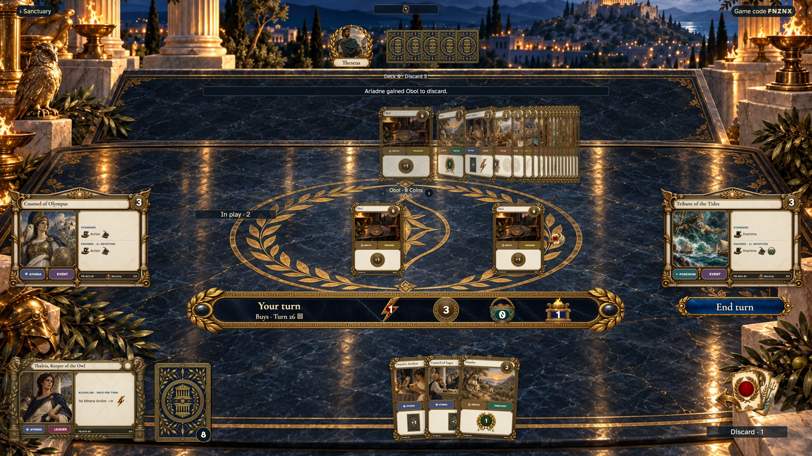</a>

- [x] The table shows Buys and no Treasure-play control.
