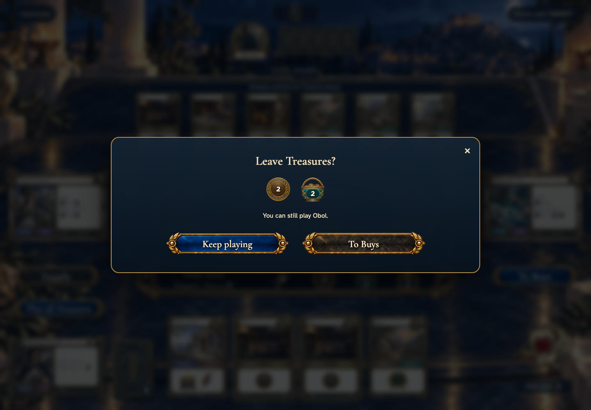

# retain Treasures deliberately and spend multiple Buys including a zero-cost card

Recorded-history integration scenario. A legal event history prepares the starting position directly in the emulator. This verifies the illustrated effect from that position; it does not demonstrate the player journey to reach it.

## Confirm leaving playable Treasures

[phone](../../screenshots/retain-treasures-deliberately-and-spend-multiple-buys-including-a-zero-cost-card/000-leave-treasures-phone-darwin.png) · [desktop](../../screenshots/retain-treasures-deliberately-and-spend-multiple-buys-including-a-zero-cost-card/000-leave-treasures-desktop-darwin.png) · [tabletop-4k](../../screenshots/retain-treasures-deliberately-and-spend-multiple-buys-including-a-zero-cost-card/000-leave-treasures-tabletop-4k-darwin.png)

- [x] Keep playing returns to the same hand without an event.
