# Ares Favored upgrades a trashed Hamlet by 3

Recorded-history integration scenario. A legal event history prepares the starting position directly in the emulator. This verifies the illustrated effect from that position; it does not demonstrate the player journey to reach it.

## Ariadne holds a Hamlet to offer Ares

<table>
<tr><th>Desktop · 1440 × 1000</th><th>Phone · 393 × 852</th></tr>
<tr>
<td valign="top"><a href="../../screenshots/ares-favored-upgrades-a-trashed-hamlet-by-3/000-opening-desktop-darwin.png">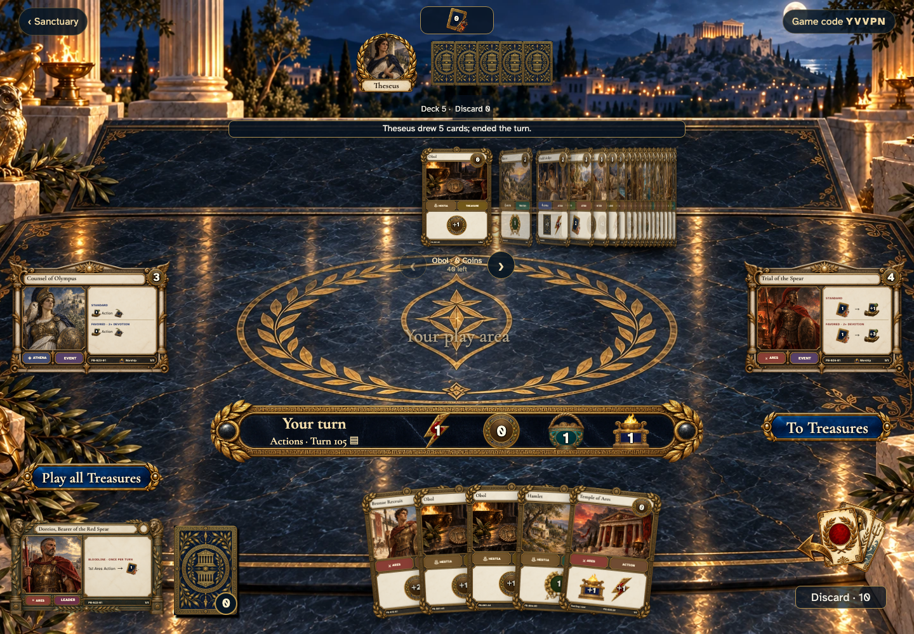</a></td>
<td valign="top"><a href="../../screenshots/ares-favored-upgrades-a-trashed-hamlet-by-3/000-opening-phone-darwin.png">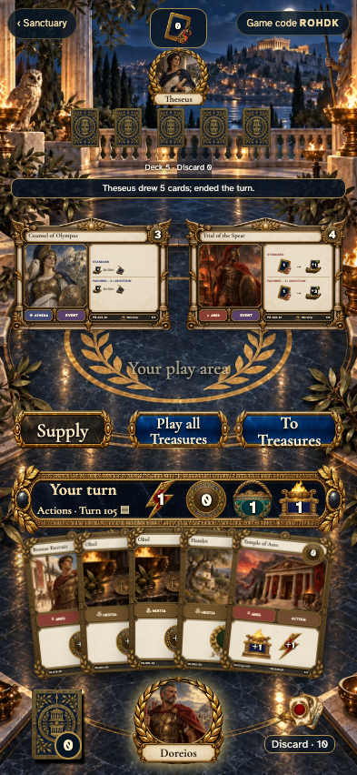</a></td>
</tr>
</table>

Tabletop · 3840 × 2160 — expand screenshot

<a href="../../screenshots/ares-favored-upgrades-a-trashed-hamlet-by-3/000-opening-tabletop-4k-darwin.png">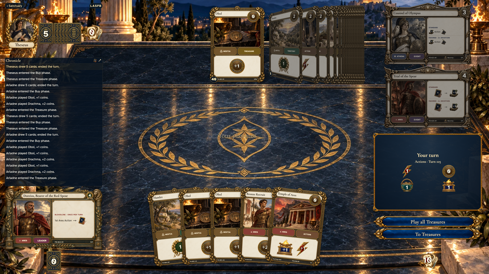</a>

- [x] Ariadne holds a Hamlet to offer Ares

## Doreios’s optional trash must finish before Worship

<table>
<tr><th>Desktop · 1440 × 1000</th><th>Phone · 393 × 852</th></tr>
<tr>
<td valign="top"><a href="../../screenshots/ares-favored-upgrades-a-trashed-hamlet-by-3/001-leader-choice-desktop-darwin.png">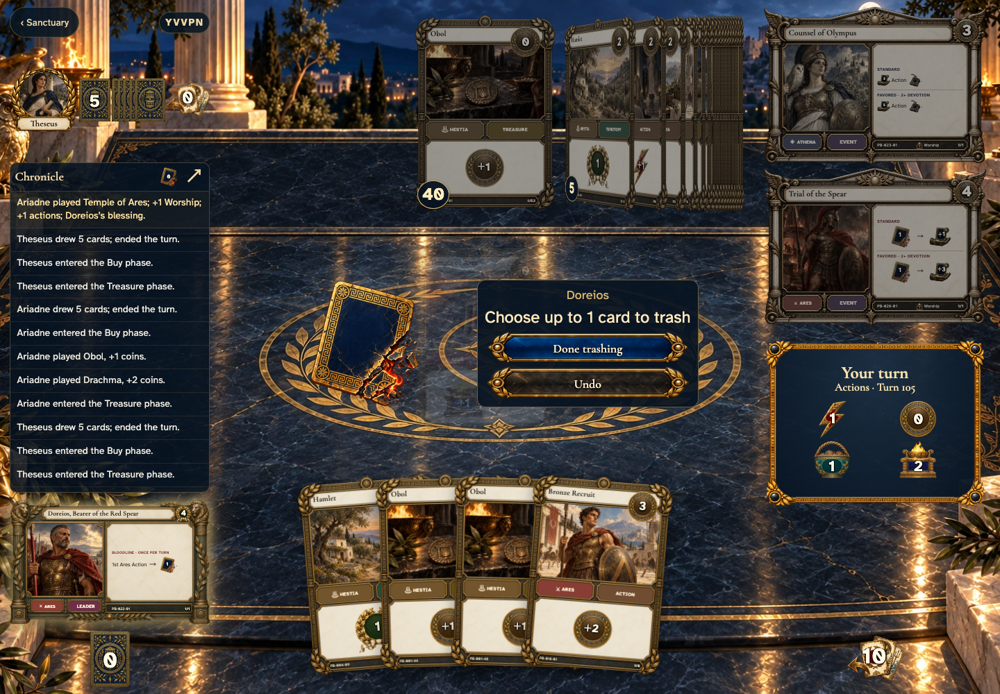</a></td>
<td valign="top"><a href="../../screenshots/ares-favored-upgrades-a-trashed-hamlet-by-3/001-leader-choice-phone-darwin.png">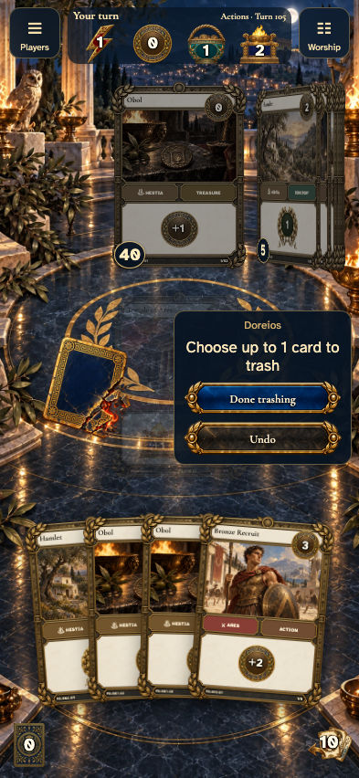</a></td>
</tr>
</table>

Tabletop · 3840 × 2160 — expand screenshot

<a href="../../screenshots/ares-favored-upgrades-a-trashed-hamlet-by-3/001-leader-choice-tabletop-4k-darwin.png">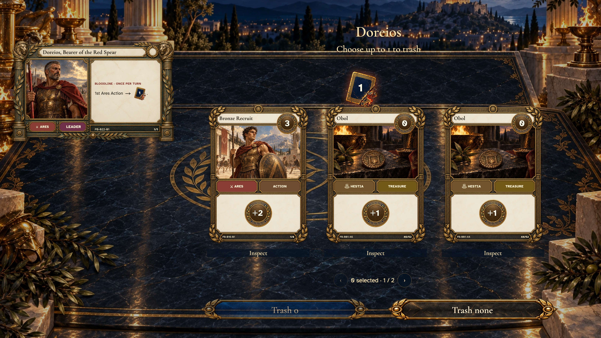</a>

- [x] Doreios’s optional trash must finish before Worship

## Ariadne keeps her Hamlet for Ares

<table>
<tr><th>Desktop · 1440 × 1000</th><th>Phone · 393 × 852</th></tr>
<tr>
<td valign="top"><a href="../../screenshots/ares-favored-upgrades-a-trashed-hamlet-by-3/002-leader-finished-desktop-darwin.png">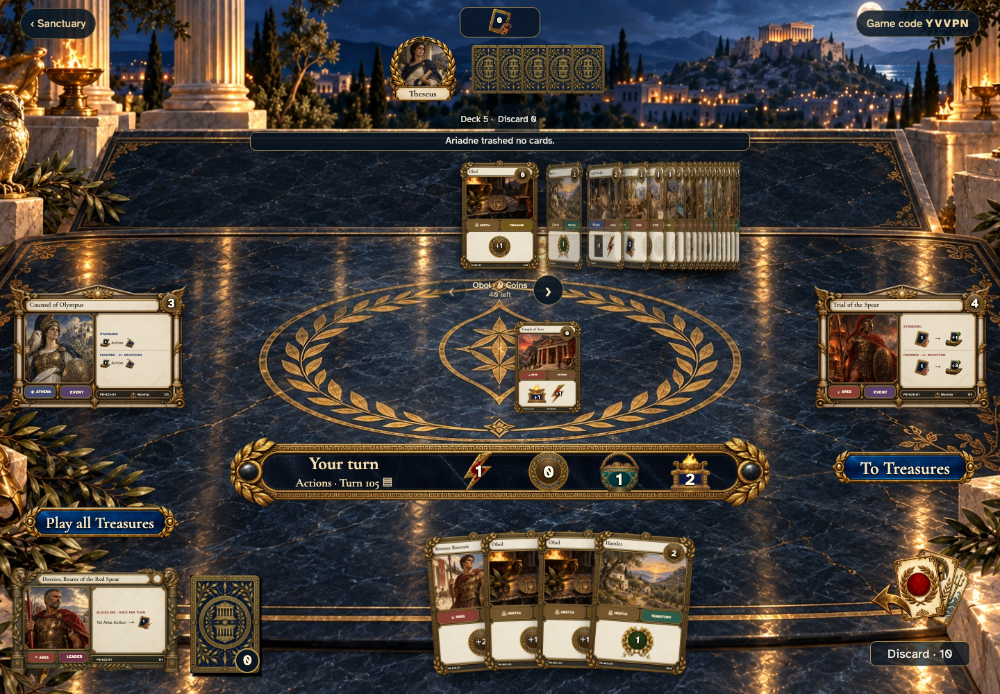</a></td>
<td valign="top"><a href="../../screenshots/ares-favored-upgrades-a-trashed-hamlet-by-3/002-leader-finished-phone-darwin.png">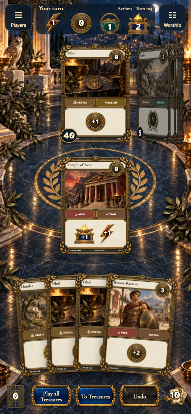</a></td>
</tr>
</table>

Tabletop · 3840 × 2160 — expand screenshot

<a href="../../screenshots/ares-favored-upgrades-a-trashed-hamlet-by-3/002-leader-finished-tabletop-4k-darwin.png">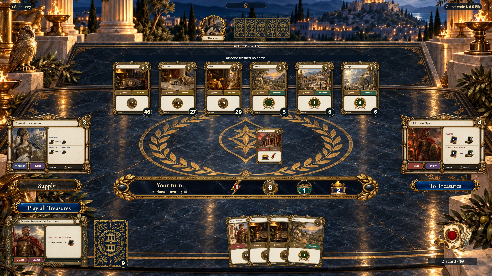</a>

- [x] Ariadne keeps her Hamlet for Ares

## Bronze Recruit adds two Coins and a second Devotion

<table>
<tr><th>Desktop · 1440 × 1000</th><th>Phone · 393 × 852</th></tr>
<tr>
<td valign="top"><a href="../../screenshots/ares-favored-upgrades-a-trashed-hamlet-by-3/003-recruit-desktop-darwin.png">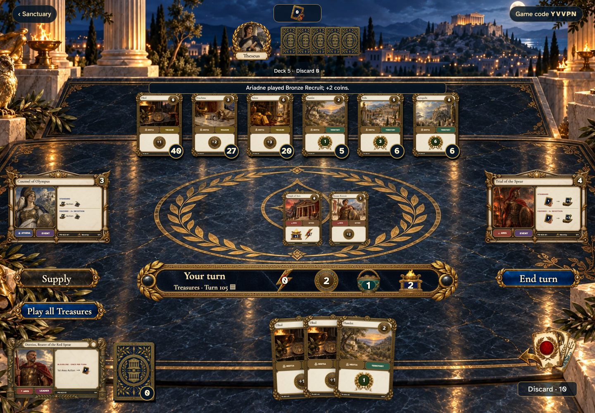</a></td>
<td valign="top"><a href="../../screenshots/ares-favored-upgrades-a-trashed-hamlet-by-3/003-recruit-phone-darwin.png">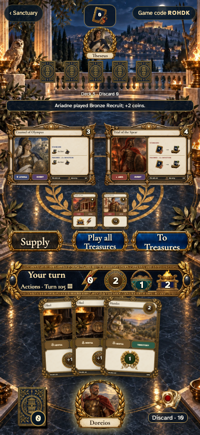</a></td>
</tr>
</table>

Tabletop · 3840 × 2160 — expand screenshot

<a href="../../screenshots/ares-favored-upgrades-a-trashed-hamlet-by-3/003-recruit-tabletop-4k-darwin.png">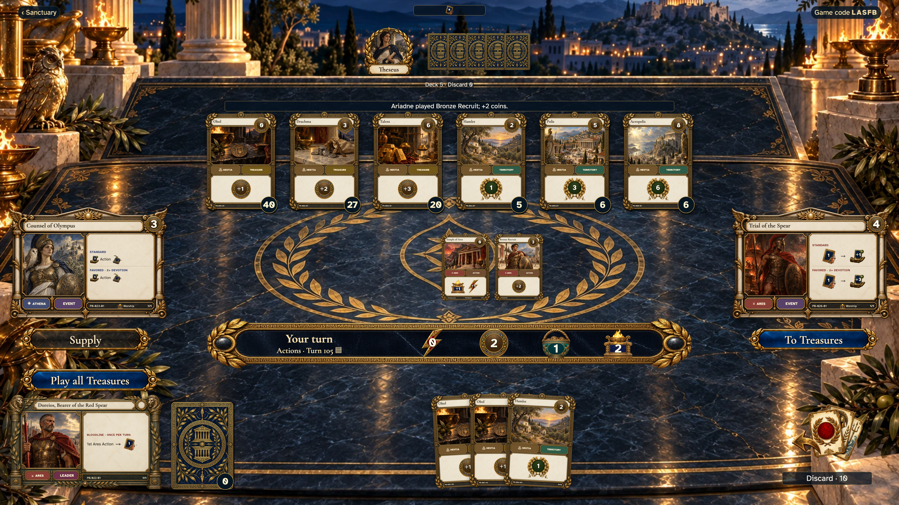</a>

- [x] Bronze Recruit adds two Coins and a second Devotion

## Ariadne has enough Coins for the Trial

<table>
<tr><th>Desktop · 1440 × 1000</th><th>Phone · 393 × 852</th></tr>
<tr>
<td valign="top"><a href="../../screenshots/ares-favored-upgrades-a-trashed-hamlet-by-3/004-wealth-desktop-darwin.png">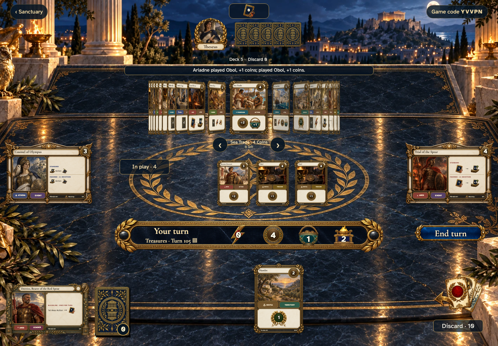</a></td>
<td valign="top"><a href="../../screenshots/ares-favored-upgrades-a-trashed-hamlet-by-3/004-wealth-phone-darwin.png">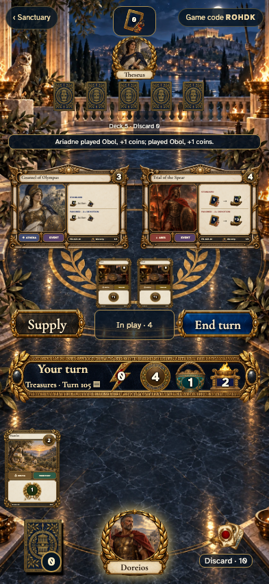</a></td>
</tr>
</table>

Tabletop · 3840 × 2160 — expand screenshot

<a href="../../screenshots/ares-favored-upgrades-a-trashed-hamlet-by-3/004-wealth-tabletop-4k-darwin.png">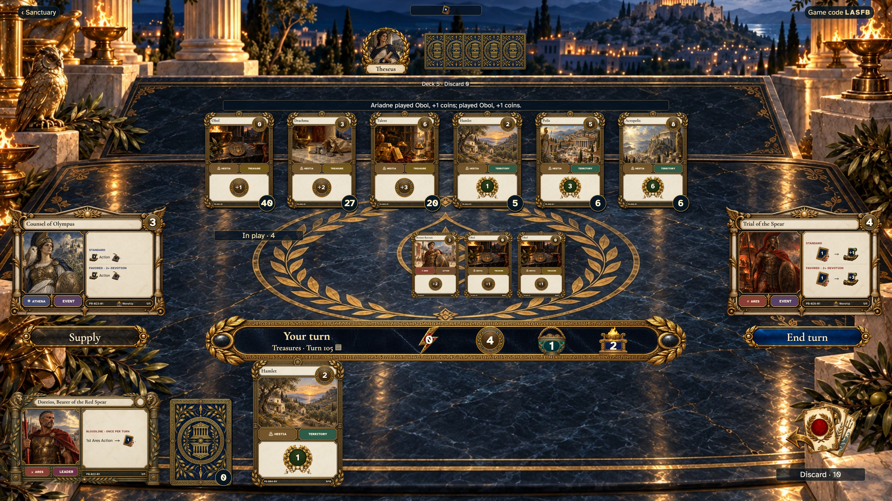</a>

- [x] Ariadne has enough Coins for the Trial

## The altar identifies which version of the Trial will resolve

<table>
<tr><th>Desktop · 1440 × 1000</th><th>Phone · 393 × 852</th></tr>
<tr>
<td valign="top"><a href="../../screenshots/ares-favored-upgrades-a-trashed-hamlet-by-3/005-trial-desktop-darwin.png">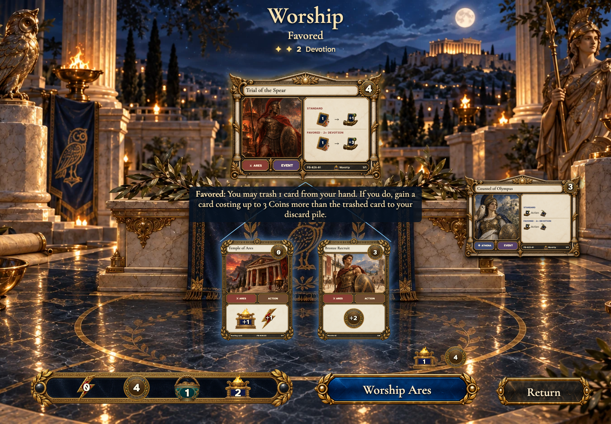</a></td>
<td valign="top"><a href="../../screenshots/ares-favored-upgrades-a-trashed-hamlet-by-3/005-trial-phone-darwin.png">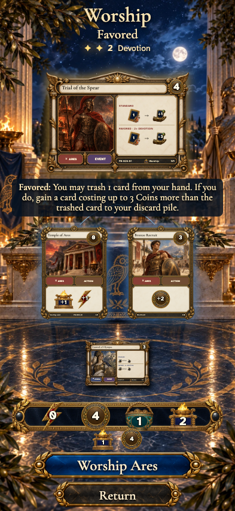</a></td>
</tr>
</table>

Tabletop · 3840 × 2160 — expand screenshot

<a href="../../screenshots/ares-favored-upgrades-a-trashed-hamlet-by-3/005-trial-tabletop-4k-darwin.png">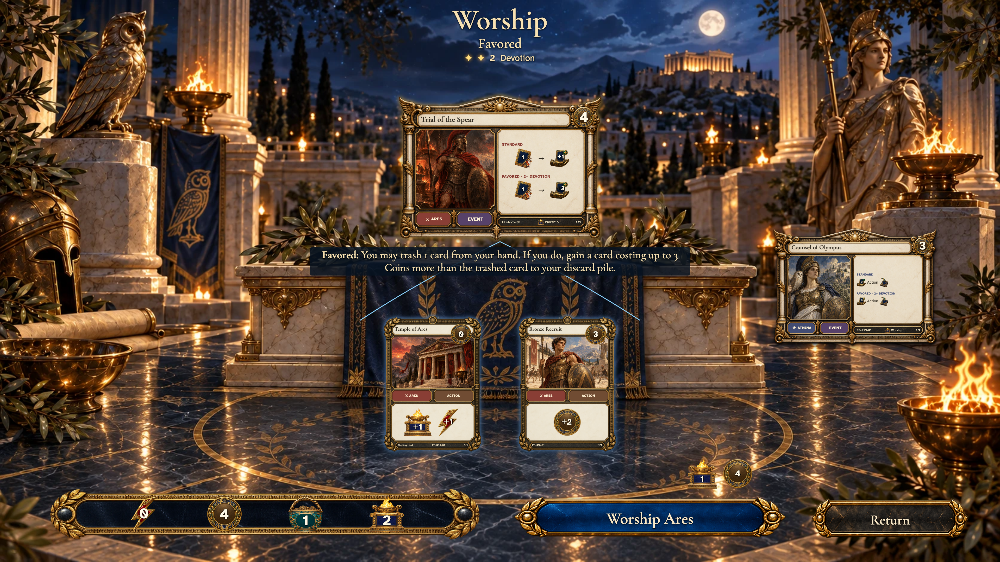</a>

- [x] The altar identifies which version of the Trial will resolve

## Ares permits one card from the hand to be trashed

<table>
<tr><th>Desktop · 1440 × 1000</th><th>Phone · 393 × 852</th></tr>
<tr>
<td valign="top"><a href="../../screenshots/ares-favored-upgrades-a-trashed-hamlet-by-3/006-offering-desktop-darwin.png">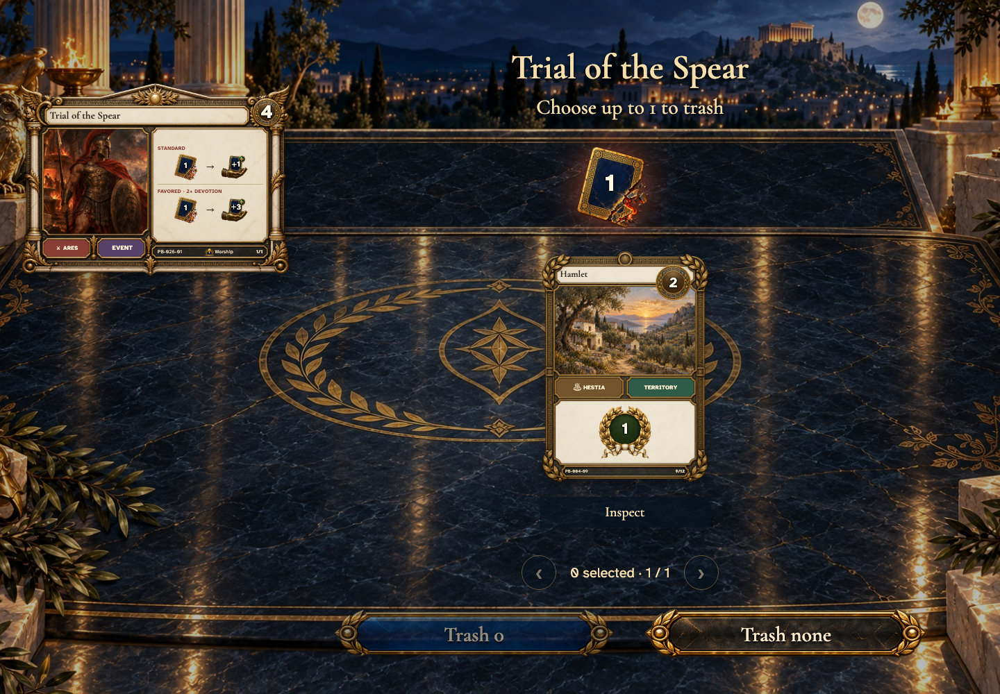</a></td>
<td valign="top"><a href="../../screenshots/ares-favored-upgrades-a-trashed-hamlet-by-3/006-offering-phone-darwin.png">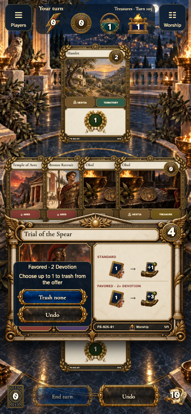</a></td>
</tr>
</table>

Tabletop · 3840 × 2160 — expand screenshot

<a href="../../screenshots/ares-favored-upgrades-a-trashed-hamlet-by-3/006-offering-tabletop-4k-darwin.png">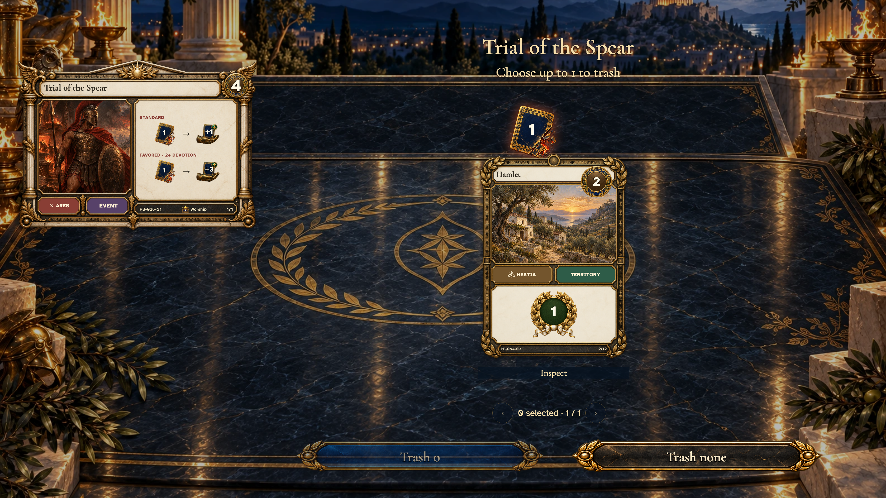</a>

- [x] Ares permits one card from the hand to be trashed

## Ariadne selects her Hamlet as the offering

<table>
<tr><th>Desktop · 1440 × 1000</th><th>Phone · 393 × 852</th></tr>
<tr>
<td valign="top"><a href="../../screenshots/ares-favored-upgrades-a-trashed-hamlet-by-3/007-selected-desktop-darwin.png">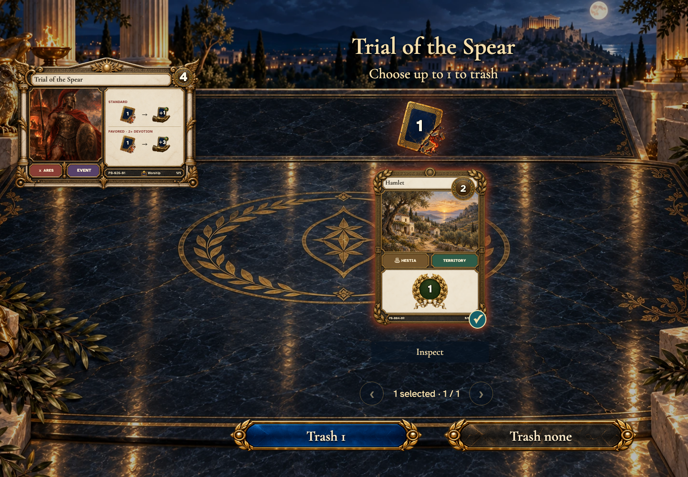</a></td>
<td valign="top"><a href="../../screenshots/ares-favored-upgrades-a-trashed-hamlet-by-3/007-selected-phone-darwin.png">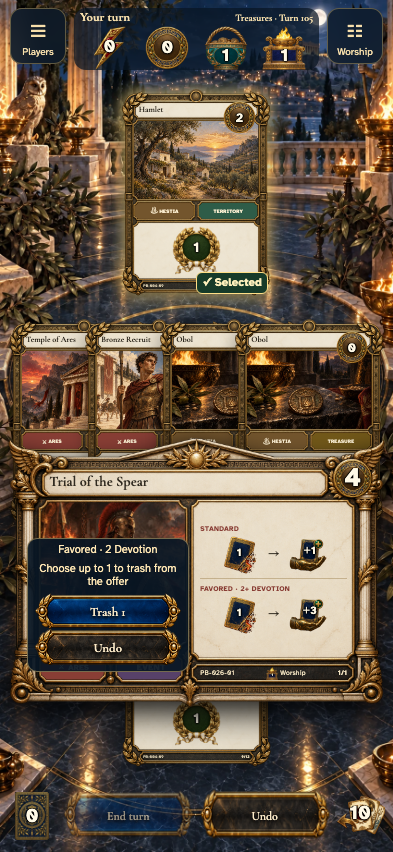</a></td>
</tr>
</table>

Tabletop · 3840 × 2160 — expand screenshot

<a href="../../screenshots/ares-favored-upgrades-a-trashed-hamlet-by-3/007-selected-tabletop-4k-darwin.png">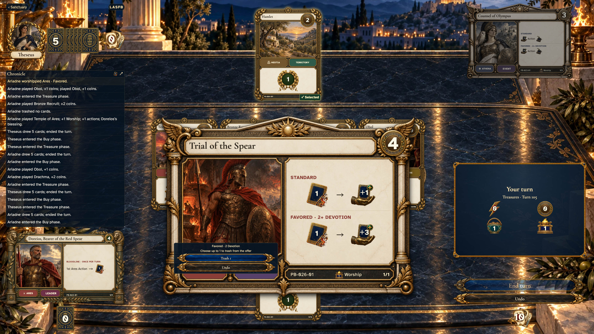</a>

- [x] Ariadne selects her Hamlet as the offering

## The trashed Hamlet sets the gain limit

<table>
<tr><th>Desktop · 1440 × 1000</th><th>Phone · 393 × 852</th></tr>
<tr>
<td valign="top"><a href="../../screenshots/ares-favored-upgrades-a-trashed-hamlet-by-3/008-upgrade-desktop-darwin.png">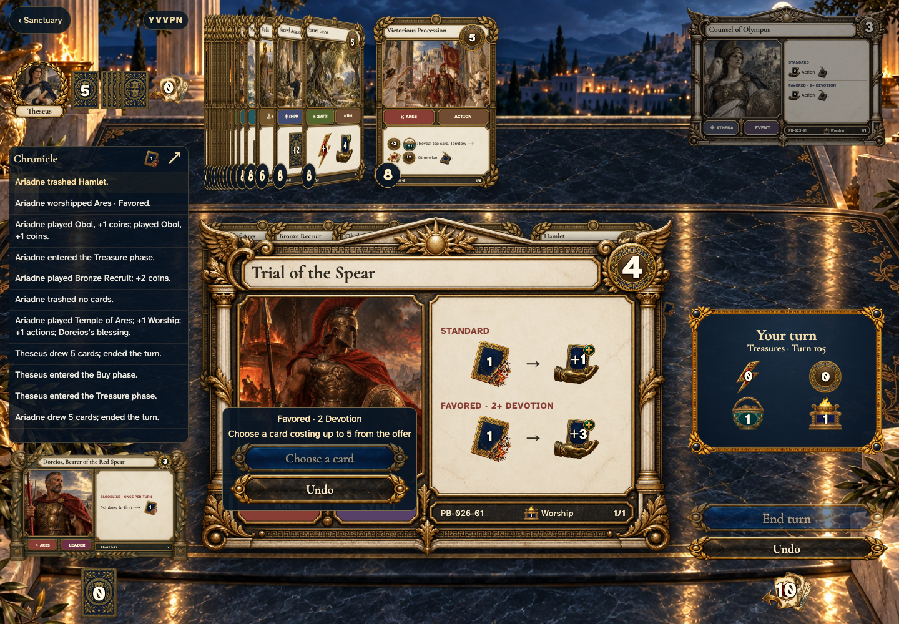</a></td>
<td valign="top"><a href="../../screenshots/ares-favored-upgrades-a-trashed-hamlet-by-3/008-upgrade-phone-darwin.png">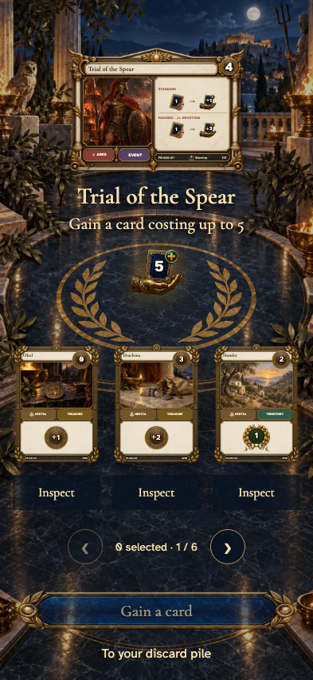</a></td>
</tr>
</table>

Tabletop · 3840 × 2160 — expand screenshot

<a href="../../screenshots/ares-favored-upgrades-a-trashed-hamlet-by-3/008-upgrade-tabletop-4k-darwin.png">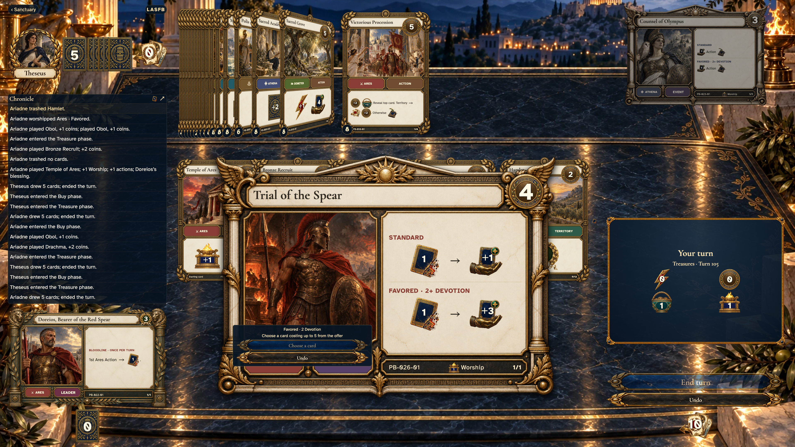</a>

- [x] The trashed Hamlet sets the gain limit

## Ariadne can choose a cheaper card than the limit

<table>
<tr><th>Desktop · 1440 × 1000</th><th>Phone · 393 × 852</th></tr>
<tr>
<td valign="top"><a href="../../screenshots/ares-favored-upgrades-a-trashed-hamlet-by-3/009-cheaper-desktop-darwin.png">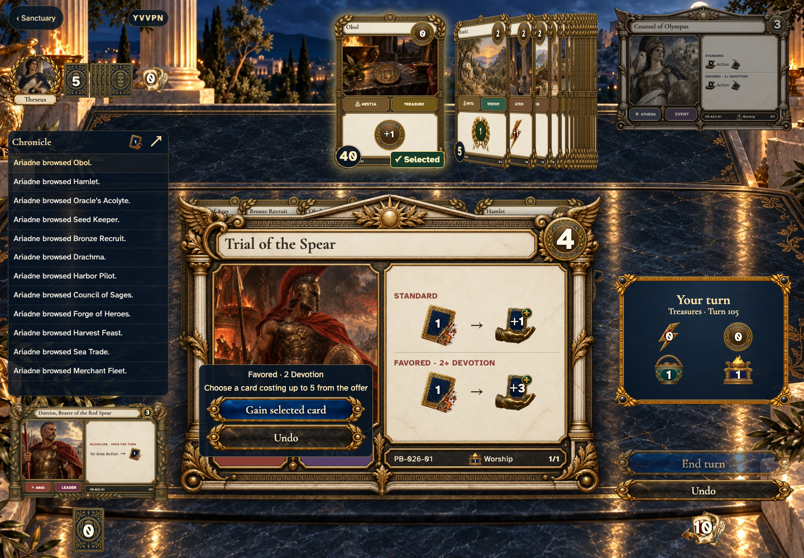</a></td>
<td valign="top"><a href="../../screenshots/ares-favored-upgrades-a-trashed-hamlet-by-3/009-cheaper-phone-darwin.png">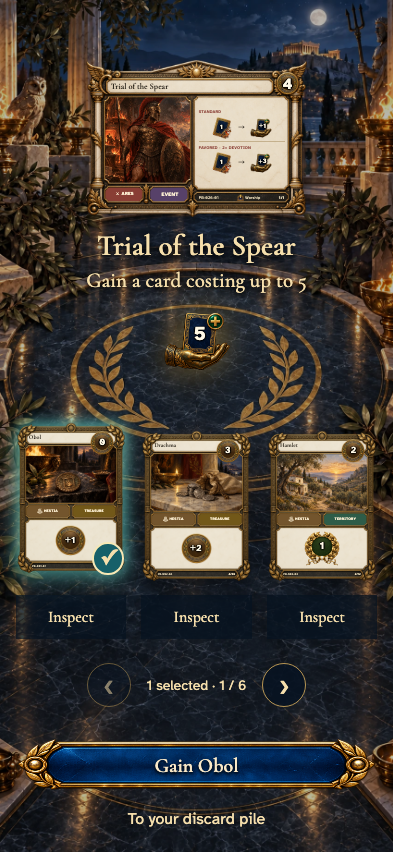</a></td>
</tr>
</table>

Tabletop · 3840 × 2160 — expand screenshot

<a href="../../screenshots/ares-favored-upgrades-a-trashed-hamlet-by-3/009-cheaper-tabletop-4k-darwin.png">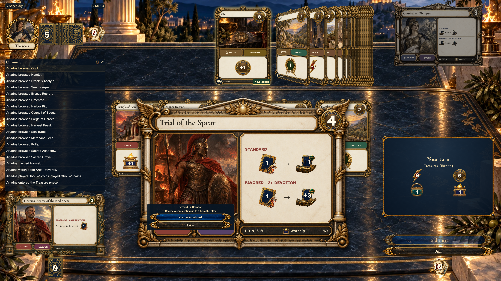</a>

- [x] Ariadne can choose a cheaper card than the limit

## The event finishes without triggering Doreios again

<table>
<tr><th>Desktop · 1440 × 1000</th><th>Phone · 393 × 852</th></tr>
<tr>
<td valign="top"><a href="../../screenshots/ares-favored-upgrades-a-trashed-hamlet-by-3/010-resolved-desktop-darwin.png">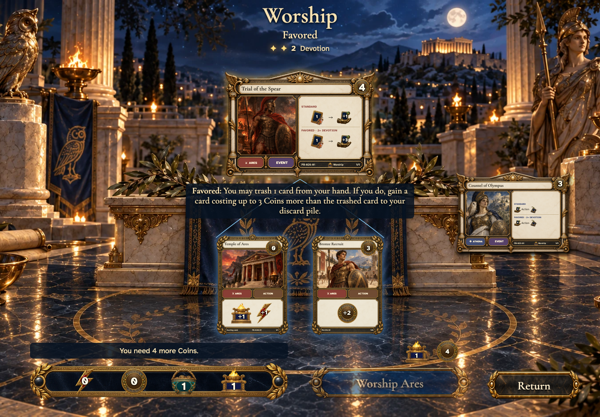</a></td>
<td valign="top"><a href="../../screenshots/ares-favored-upgrades-a-trashed-hamlet-by-3/010-resolved-phone-darwin.png">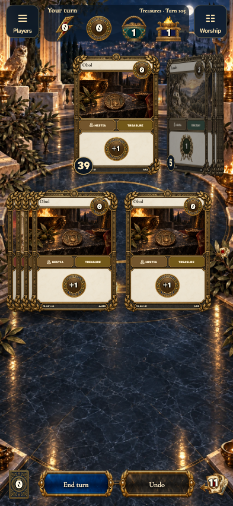</a></td>
</tr>
</table>

Tabletop · 3840 × 2160 — expand screenshot

<a href="../../screenshots/ares-favored-upgrades-a-trashed-hamlet-by-3/010-resolved-tabletop-4k-darwin.png">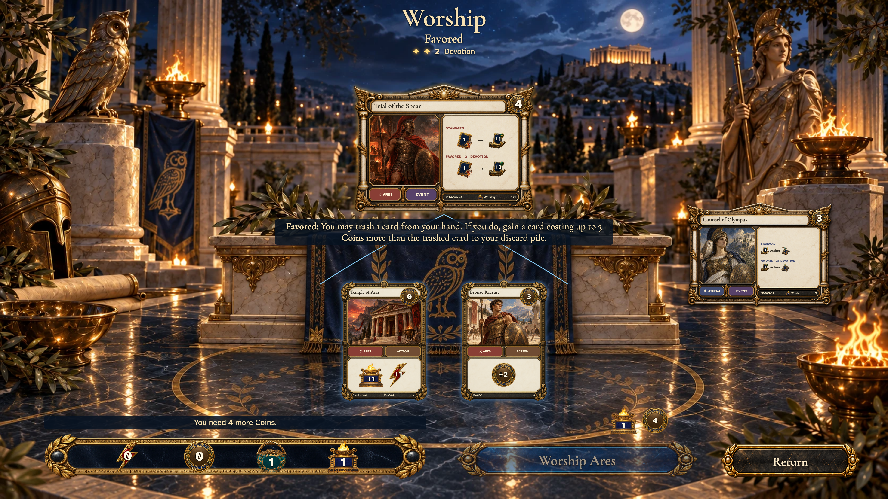</a>

- [x] The event finishes without triggering Doreios again
