# Athena rewards two matching Actions with a five-cost topdeck gain

Recorded-history integration scenario. A legal event history prepares the starting position directly in the emulator. This verifies the illustrated effect from that position; it does not demonstrate the player journey to reach it.

## Ariadne prepares to play her Temple and Acolyte

<table>
<tr><th>Desktop · 1440 × 1000</th><th>Phone · 393 × 852</th></tr>
<tr>
<td valign="top"><a href="../../screenshots/athena-rewards-two-matching-actions-with-a-five-cost-topdeck-gain/000-opening-desktop-darwin.png">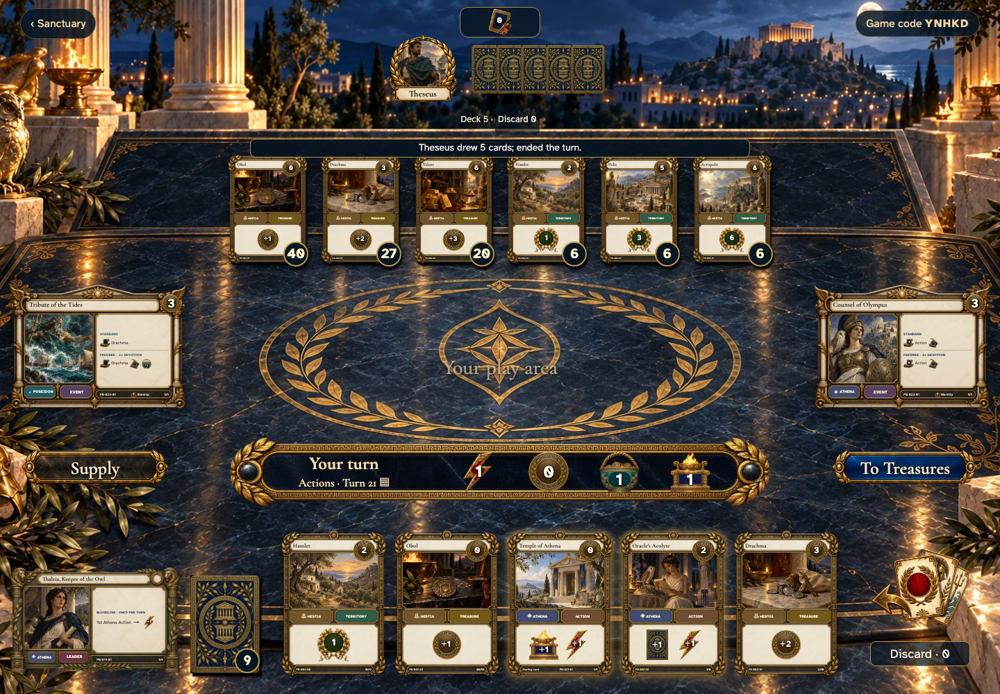</a></td>
<td valign="top"><a href="../../screenshots/athena-rewards-two-matching-actions-with-a-five-cost-topdeck-gain/000-opening-phone-darwin.png">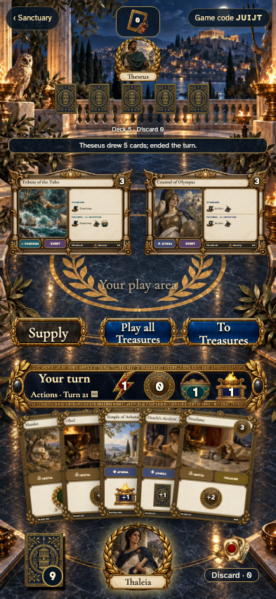</a></td>
</tr>
</table>

Tabletop · 3840 × 2160 — expand screenshot

<a href="../../screenshots/athena-rewards-two-matching-actions-with-a-five-cost-topdeck-gain/000-opening-tabletop-4k-darwin.png">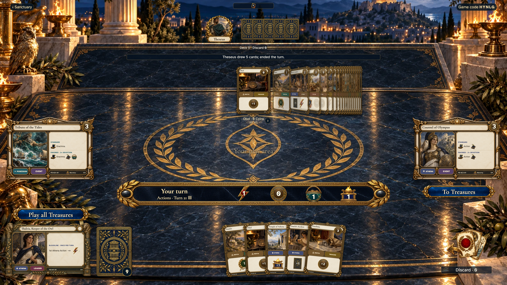</a>

- [x] Ariadne prepares to play her Temple and Acolyte

## The Temple grants another Worship

<table>
<tr><th>Desktop · 1440 × 1000</th><th>Phone · 393 × 852</th></tr>
<tr>
<td valign="top"><a href="../../screenshots/athena-rewards-two-matching-actions-with-a-five-cost-topdeck-gain/001-temple-desktop-darwin.png">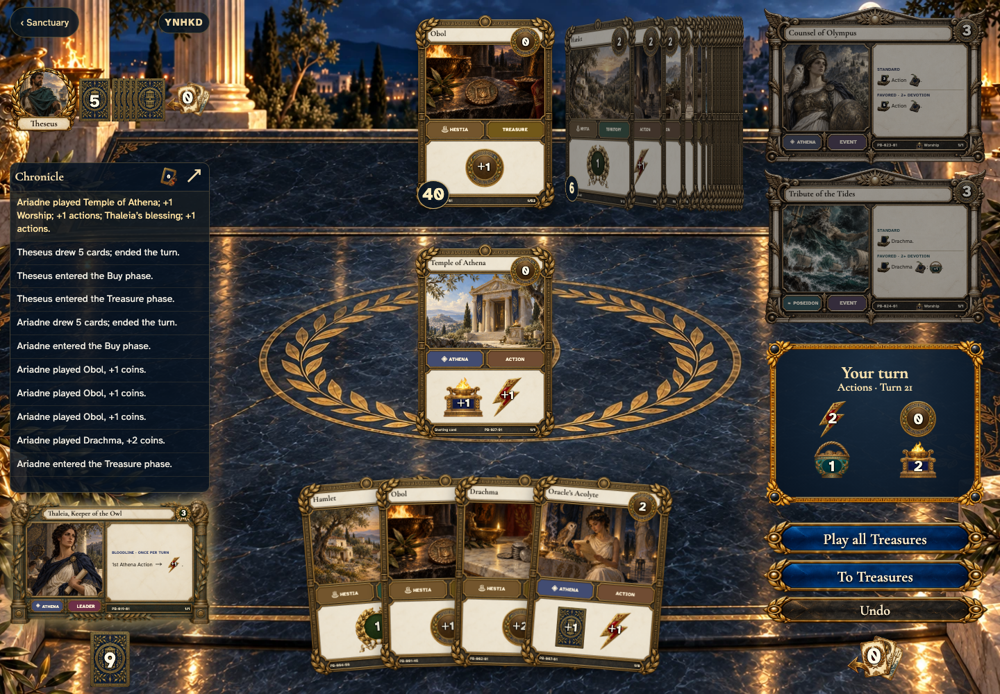</a></td>
<td valign="top"><a href="../../screenshots/athena-rewards-two-matching-actions-with-a-five-cost-topdeck-gain/001-temple-phone-darwin.png">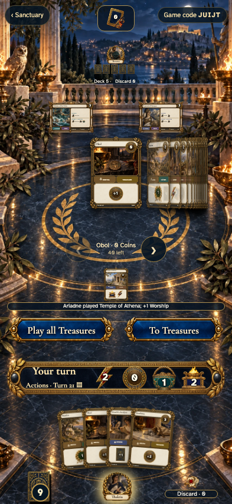</a></td>
</tr>
</table>

Tabletop · 3840 × 2160 — expand screenshot

<a href="../../screenshots/athena-rewards-two-matching-actions-with-a-five-cost-topdeck-gain/001-temple-tabletop-4k-darwin.png">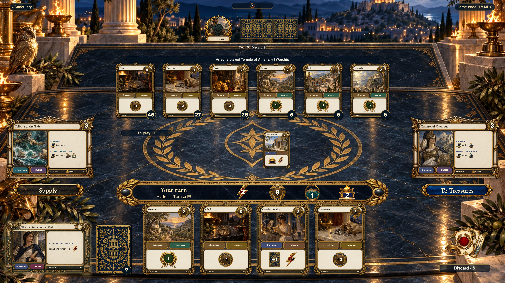</a>

- [x] The Temple grants another Worship

## The Acolyte joins the Temple in play

<table>
<tr><th>Desktop · 1440 × 1000</th><th>Phone · 393 × 852</th></tr>
<tr>
<td valign="top"><a href="../../screenshots/athena-rewards-two-matching-actions-with-a-five-cost-topdeck-gain/002-acolyte-desktop-darwin.png">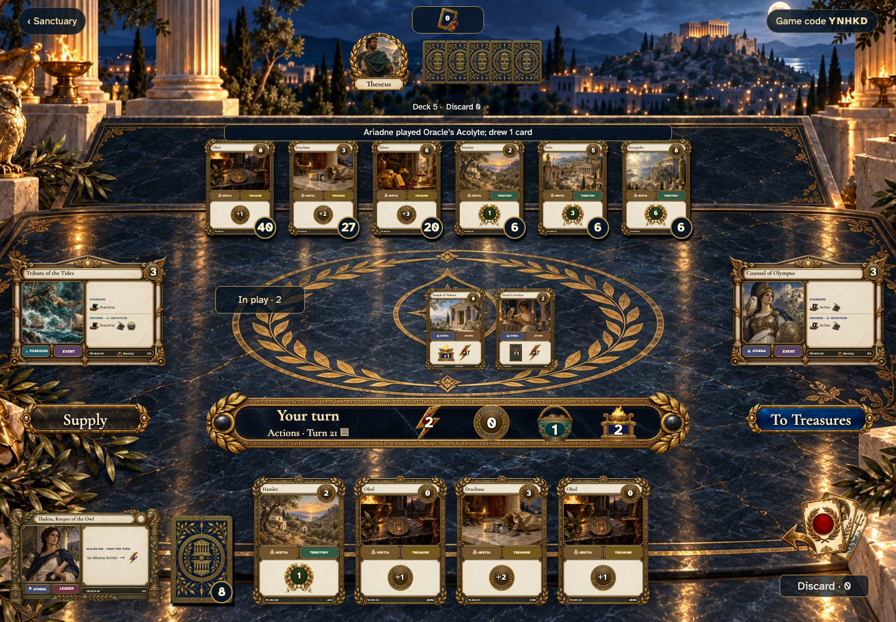</a></td>
<td valign="top"><a href="../../screenshots/athena-rewards-two-matching-actions-with-a-five-cost-topdeck-gain/002-acolyte-phone-darwin.png">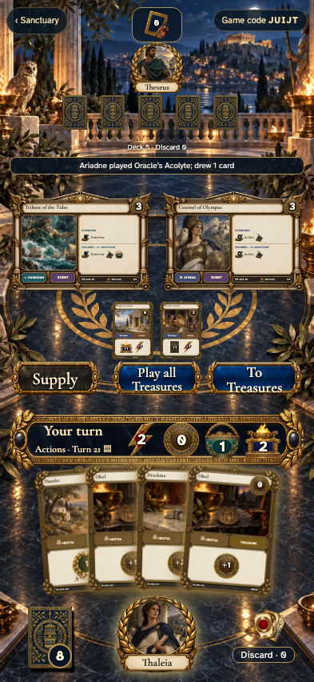</a></td>
</tr>
</table>

Tabletop · 3840 × 2160 — expand screenshot

<a href="../../screenshots/athena-rewards-two-matching-actions-with-a-five-cost-topdeck-gain/002-acolyte-tabletop-4k-darwin.png">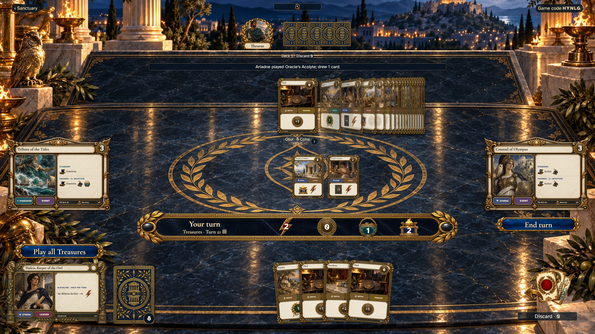</a>

- [x] The Acolyte joins the Temple in play

## Ariadne plays wealth to pay Athena

<table>
<tr><th>Desktop · 1440 × 1000</th><th>Phone · 393 × 852</th></tr>
<tr>
<td valign="top"><a href="../../screenshots/athena-rewards-two-matching-actions-with-a-five-cost-topdeck-gain/003-wealth-desktop-darwin.png">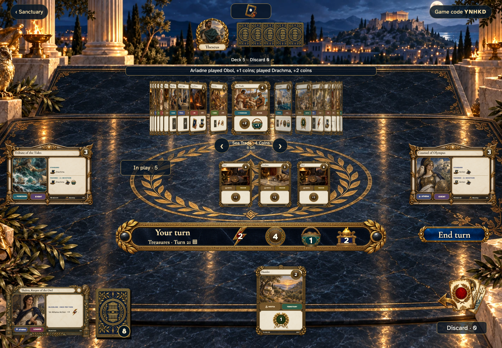</a></td>
<td valign="top"><a href="../../screenshots/athena-rewards-two-matching-actions-with-a-five-cost-topdeck-gain/003-wealth-phone-darwin.png">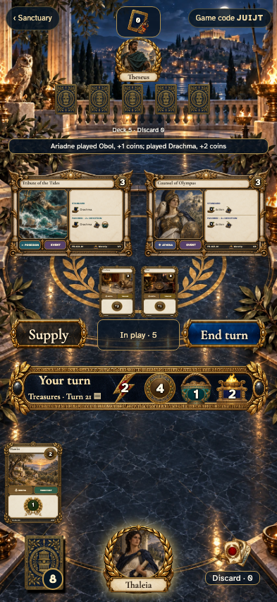</a></td>
</tr>
</table>

Tabletop · 3840 × 2160 — expand screenshot

<a href="../../screenshots/athena-rewards-two-matching-actions-with-a-five-cost-topdeck-gain/003-wealth-tabletop-4k-darwin.png">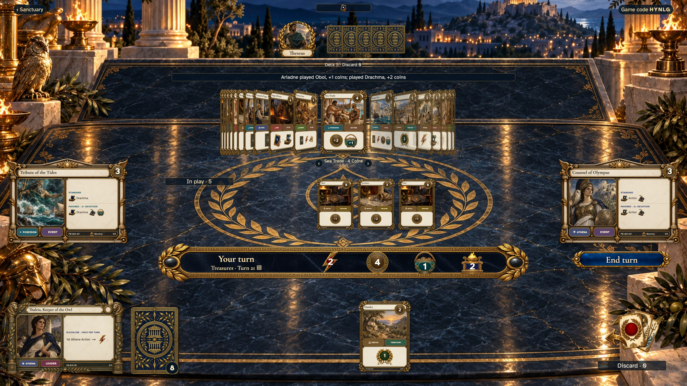</a>

- [x] Ariadne plays wealth to pay Athena

## Two matching Actions connect to Athena’s Favored effect

<table>
<tr><th>Desktop · 1440 × 1000</th><th>Phone · 393 × 852</th></tr>
<tr>
<td valign="top"><a href="../../screenshots/athena-rewards-two-matching-actions-with-a-five-cost-topdeck-gain/004-favored-desktop-darwin.png">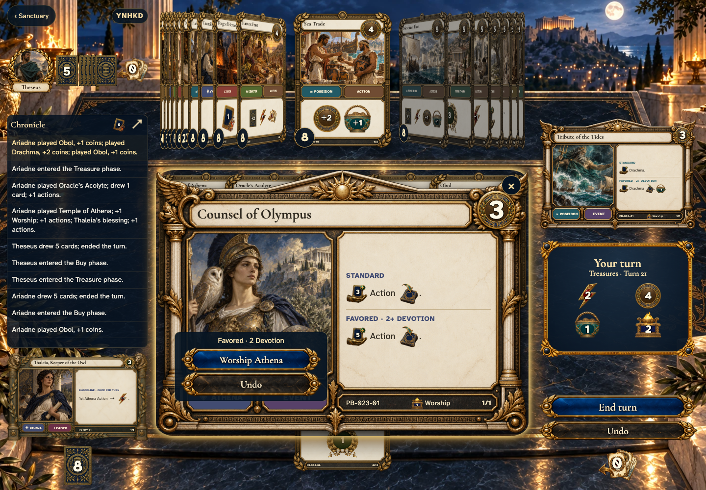</a></td>
<td valign="top"><a href="../../screenshots/athena-rewards-two-matching-actions-with-a-five-cost-topdeck-gain/004-favored-phone-darwin.png">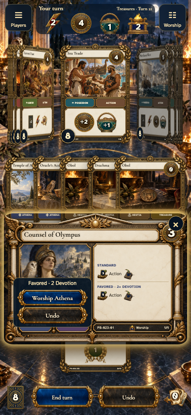</a></td>
</tr>
</table>

Tabletop · 3840 × 2160 — expand screenshot

<a href="../../screenshots/athena-rewards-two-matching-actions-with-a-five-cost-topdeck-gain/004-favored-tabletop-4k-darwin.png">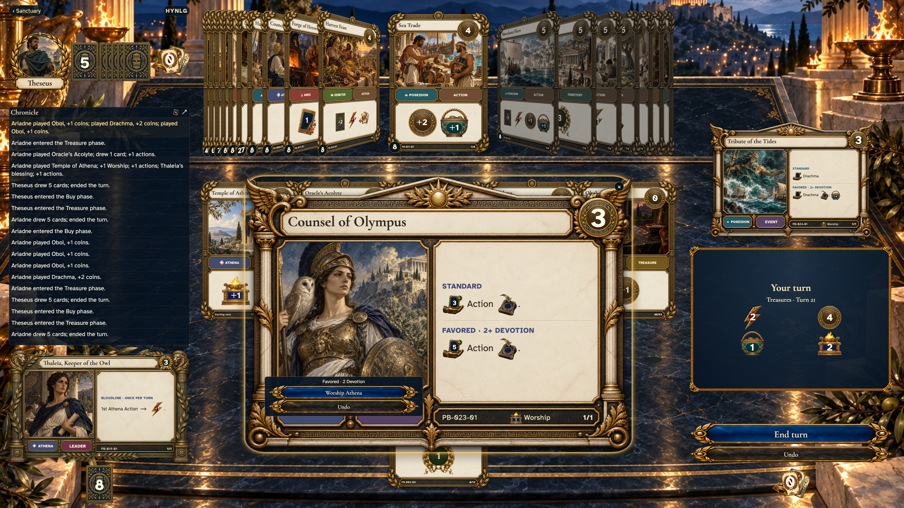</a>

- [x] Two matching Actions connect to Athena’s Favored effect

## Athena offers only Actions costing up to five

<table>
<tr><th>Desktop · 1440 × 1000</th><th>Phone · 393 × 852</th></tr>
<tr>
<td valign="top"><a href="../../screenshots/athena-rewards-two-matching-actions-with-a-five-cost-topdeck-gain/005-gain-desktop-darwin.png">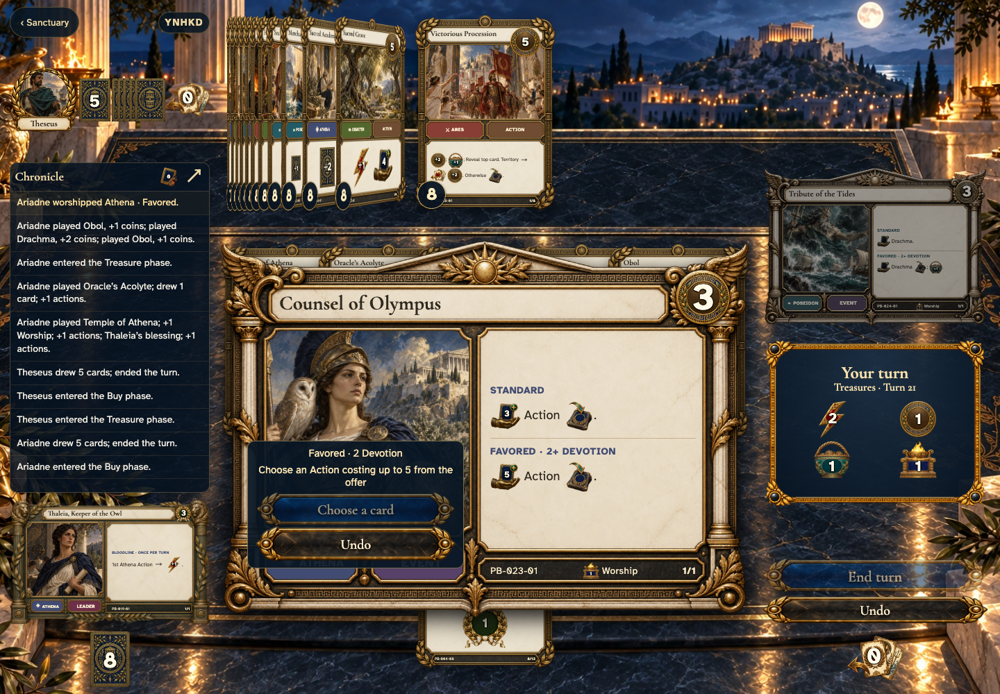</a></td>
<td valign="top"><a href="../../screenshots/athena-rewards-two-matching-actions-with-a-five-cost-topdeck-gain/005-gain-phone-darwin.png">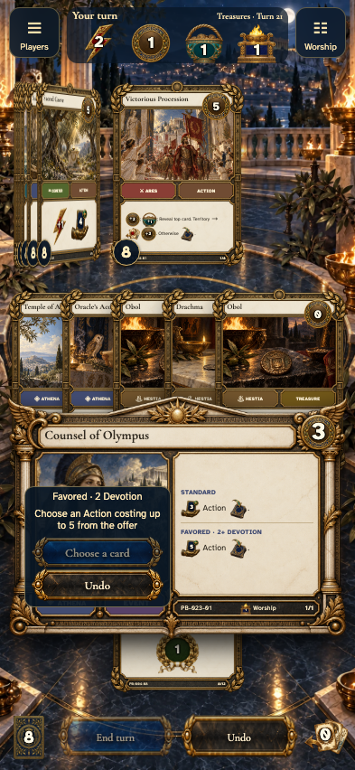</a></td>
</tr>
</table>

Tabletop · 3840 × 2160 — expand screenshot

<a href="../../screenshots/athena-rewards-two-matching-actions-with-a-five-cost-topdeck-gain/005-gain-tabletop-4k-darwin.png">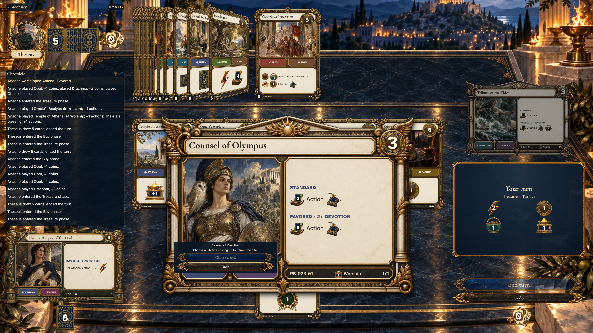</a>

- [x] Athena offers only Actions costing up to five

## Ariadne selects the five-cost Sacred Academy

<table>
<tr><th>Desktop · 1440 × 1000</th><th>Phone · 393 × 852</th></tr>
<tr>
<td valign="top"><a href="../../screenshots/athena-rewards-two-matching-actions-with-a-five-cost-topdeck-gain/006-selected-desktop-darwin.png">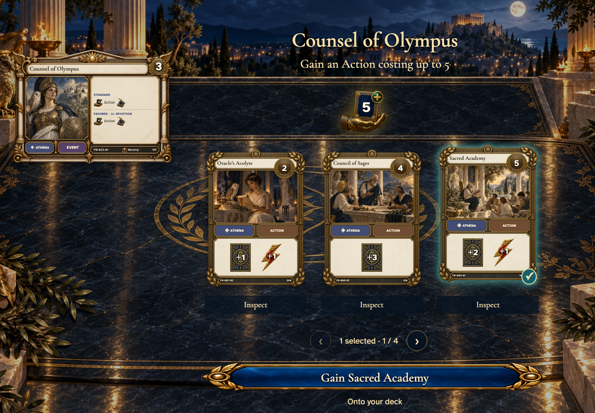</a></td>
<td valign="top"><a href="../../screenshots/athena-rewards-two-matching-actions-with-a-five-cost-topdeck-gain/006-selected-phone-darwin.png">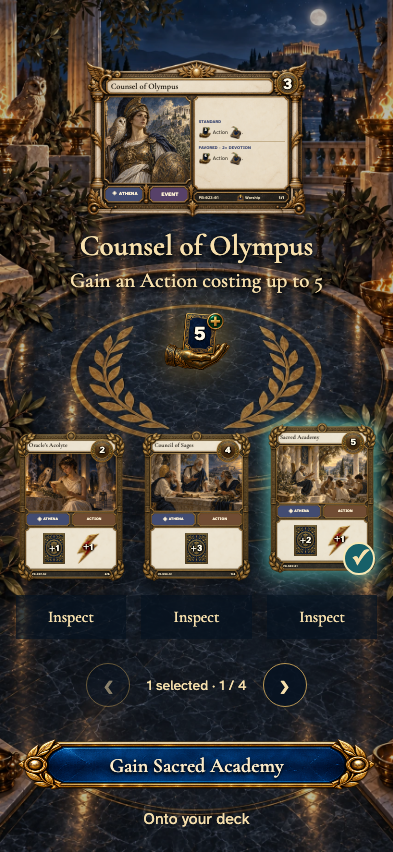</a></td>
</tr>
</table>

Tabletop · 3840 × 2160 — expand screenshot

<a href="../../screenshots/athena-rewards-two-matching-actions-with-a-five-cost-topdeck-gain/006-selected-tabletop-4k-darwin.png">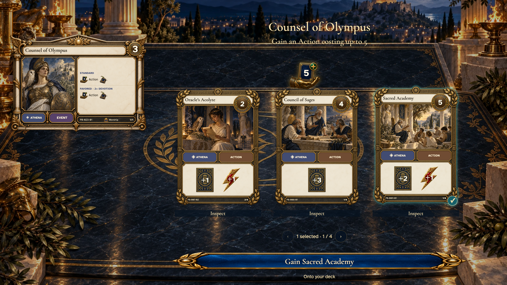</a>

- [x] Ariadne selects the five-cost Sacred Academy

## Ariadne returns to the altar with one Worship remaining

<table>
<tr><th>Desktop · 1440 × 1000</th><th>Phone · 393 × 852</th></tr>
<tr>
<td valign="top"><a href="../../screenshots/athena-rewards-two-matching-actions-with-a-five-cost-topdeck-gain/007-paid-desktop-darwin.png">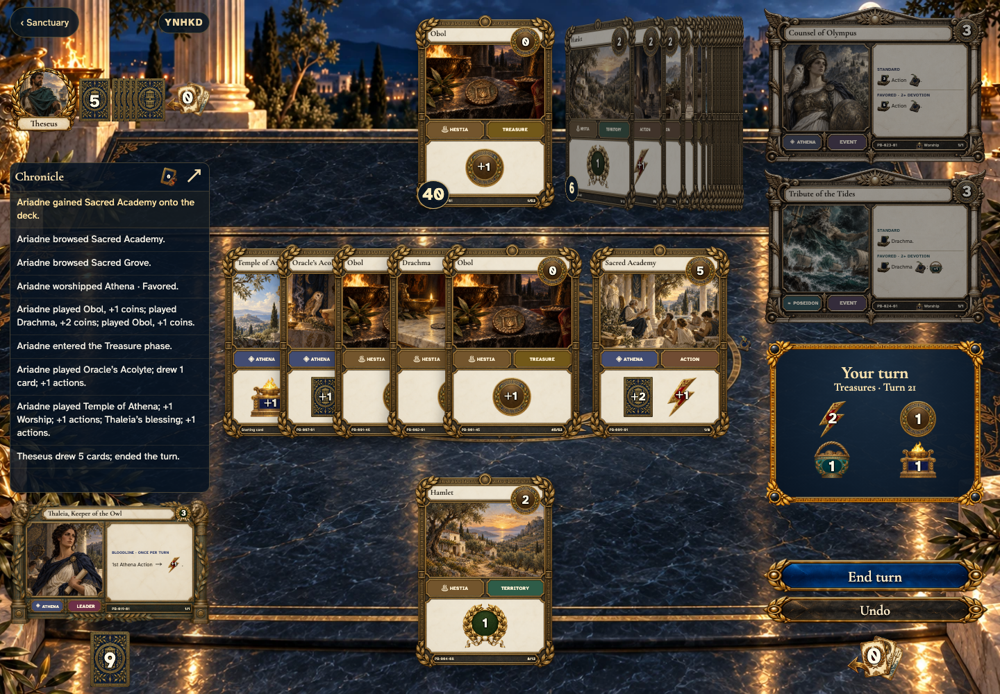</a></td>
<td valign="top"><a href="../../screenshots/athena-rewards-two-matching-actions-with-a-five-cost-topdeck-gain/007-paid-phone-darwin.png">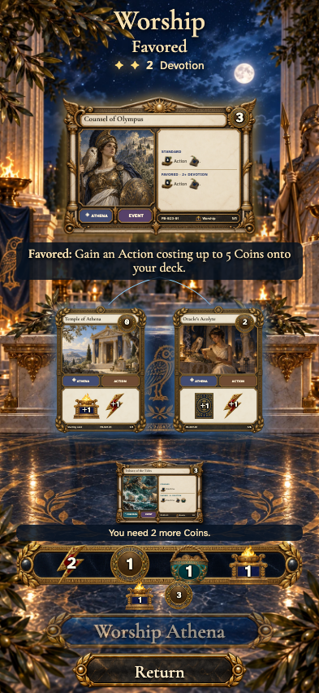</a></td>
</tr>
</table>

Tabletop · 3840 × 2160 — expand screenshot

<a href="../../screenshots/athena-rewards-two-matching-actions-with-a-five-cost-topdeck-gain/007-paid-tabletop-4k-darwin.png">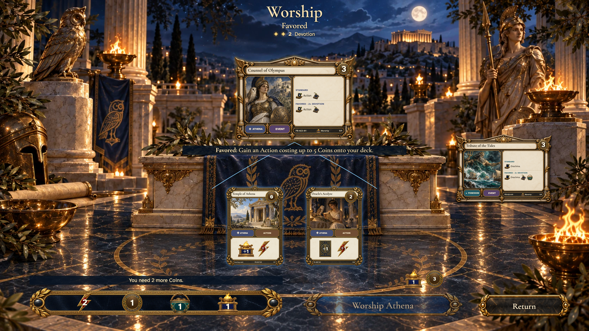</a>

- [x] Ariadne returns to the altar with one Worship remaining
