# Demeter allows no trash and a zero-cost gain while still granting a Buy

Recorded-history integration scenario. A legal event history prepares the starting position directly in the emulator. This verifies the illustrated effect from that position; it does not demonstrate the player journey to reach it.

## Ariadne prepares the Temple and Sacred Grove

<table>
<tr><th>Desktop · 1440 × 1000</th><th>Phone · 393 × 852</th></tr>
<tr>
<td valign="top"><a href="../../screenshots/demeter-allows-no-trash-and-a-zero-cost-gain-while-still-granting-a-buy/000-opening-desktop-darwin.png">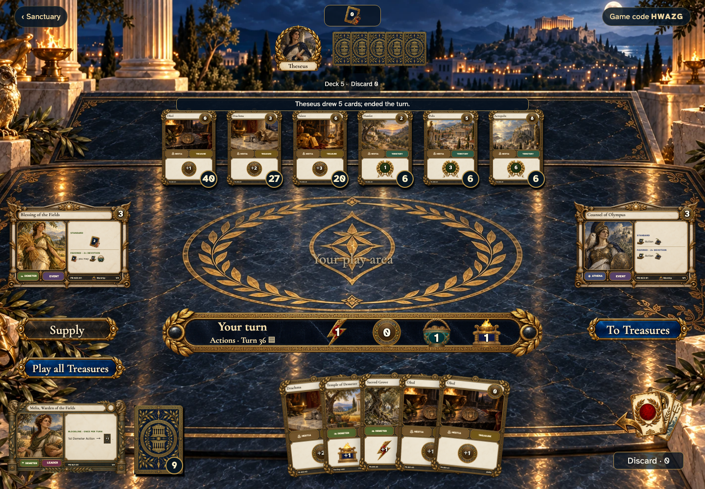</a></td>
<td valign="top"><a href="../../screenshots/demeter-allows-no-trash-and-a-zero-cost-gain-while-still-granting-a-buy/000-opening-phone-darwin.png">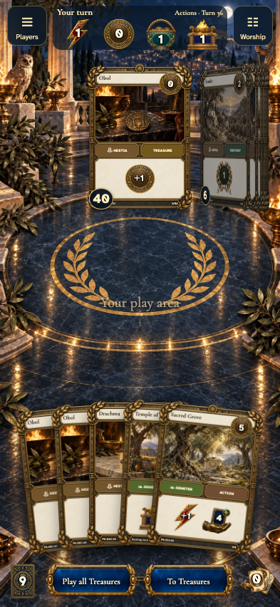</a></td>
</tr>
</table>

Tabletop · 3840 × 2160 — expand screenshot

<a href="../../screenshots/demeter-allows-no-trash-and-a-zero-cost-gain-while-still-granting-a-buy/000-opening-tabletop-4k-darwin.png">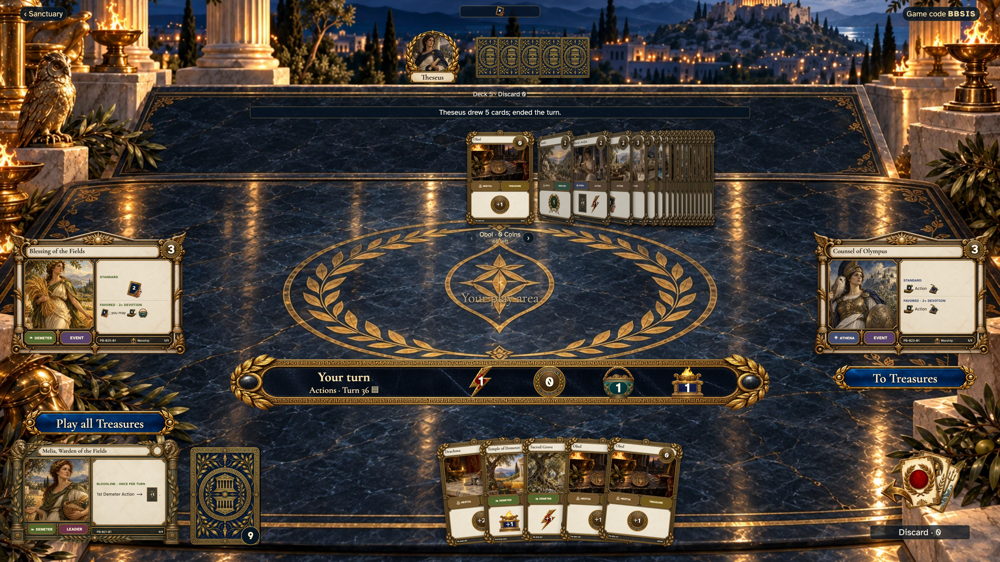</a>

- [x] Ariadne prepares the Temple and Sacred Grove

## Melia draws after the Temple finishes

<table>
<tr><th>Desktop · 1440 × 1000</th><th>Phone · 393 × 852</th></tr>
<tr>
<td valign="top"><a href="../../screenshots/demeter-allows-no-trash-and-a-zero-cost-gain-while-still-granting-a-buy/001-temple-desktop-darwin.png">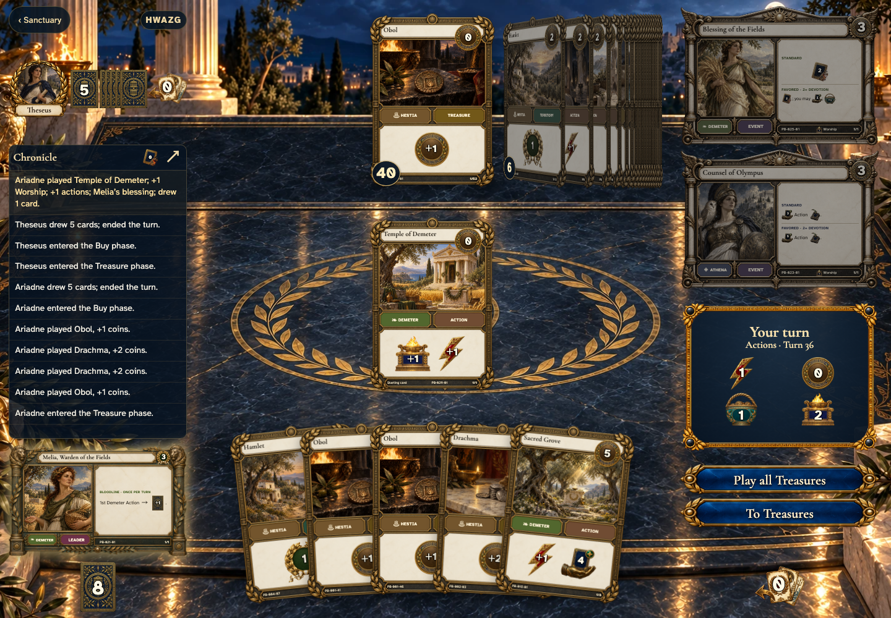</a></td>
<td valign="top"><a href="../../screenshots/demeter-allows-no-trash-and-a-zero-cost-gain-while-still-granting-a-buy/001-temple-phone-darwin.png">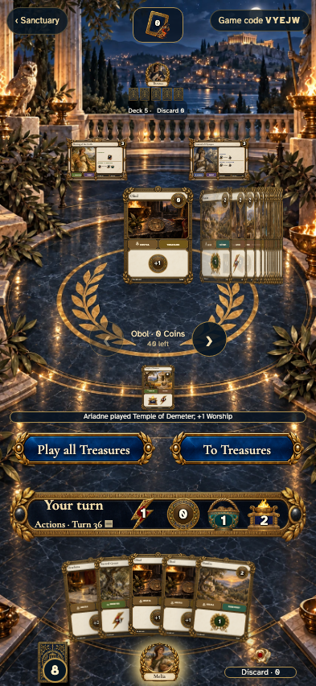</a></td>
</tr>
</table>

Tabletop · 3840 × 2160 — expand screenshot

<a href="../../screenshots/demeter-allows-no-trash-and-a-zero-cost-gain-while-still-granting-a-buy/001-temple-tabletop-4k-darwin.png">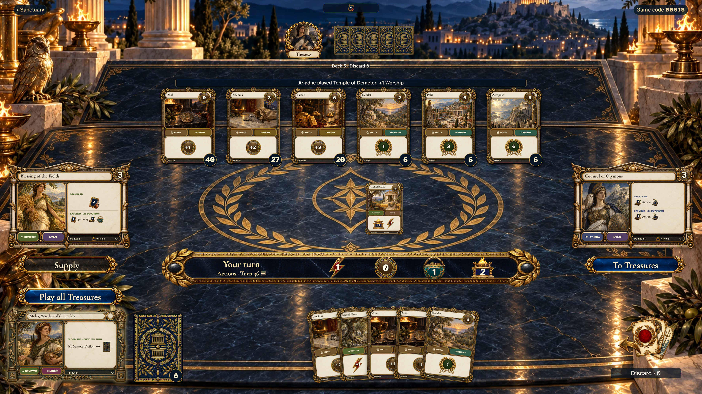</a>

- [x] Melia draws after the Temple finishes

## Sacred Grove first requires its own gain

<table>
<tr><th>Desktop · 1440 × 1000</th><th>Phone · 393 × 852</th></tr>
<tr>
<td valign="top"><a href="../../screenshots/demeter-allows-no-trash-and-a-zero-cost-gain-while-still-granting-a-buy/002-grove-choice-desktop-darwin.png">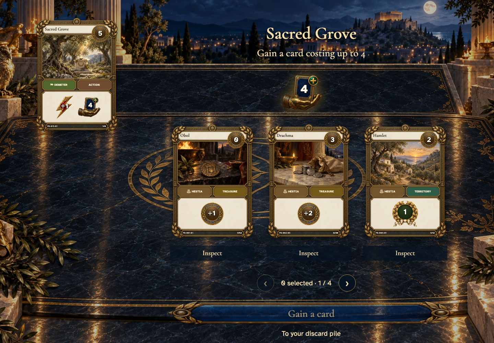</a></td>
<td valign="top"><a href="../../screenshots/demeter-allows-no-trash-and-a-zero-cost-gain-while-still-granting-a-buy/002-grove-choice-phone-darwin.png">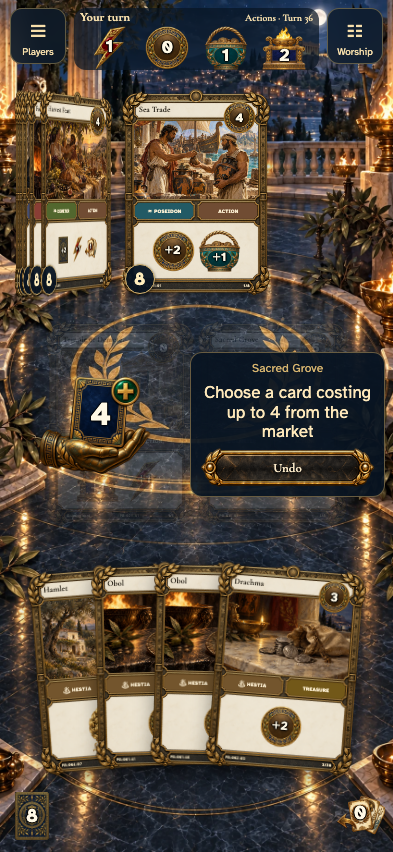</a></td>
</tr>
</table>

Tabletop · 3840 × 2160 — expand screenshot

<a href="../../screenshots/demeter-allows-no-trash-and-a-zero-cost-gain-while-still-granting-a-buy/002-grove-choice-tabletop-4k-darwin.png">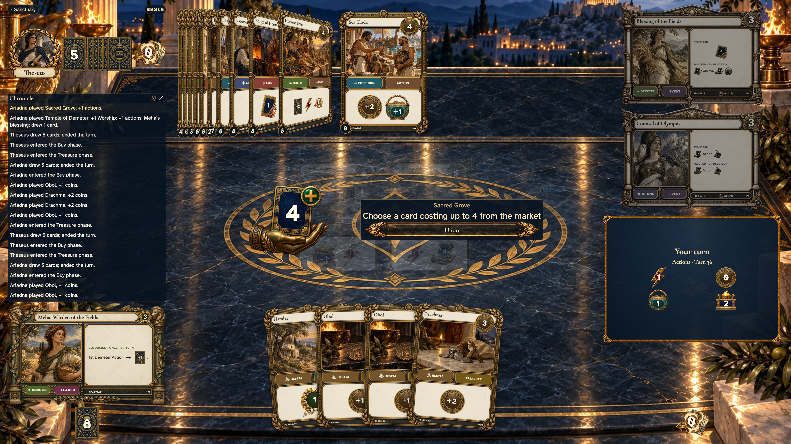</a>

- [x] Sacred Grove first requires its own gain

## Ariadne selects Obol for the Grove

<table>
<tr><th>Desktop · 1440 × 1000</th><th>Phone · 393 × 852</th></tr>
<tr>
<td valign="top"><a href="../../screenshots/demeter-allows-no-trash-and-a-zero-cost-gain-while-still-granting-a-buy/003-grove-selected-desktop-darwin.png">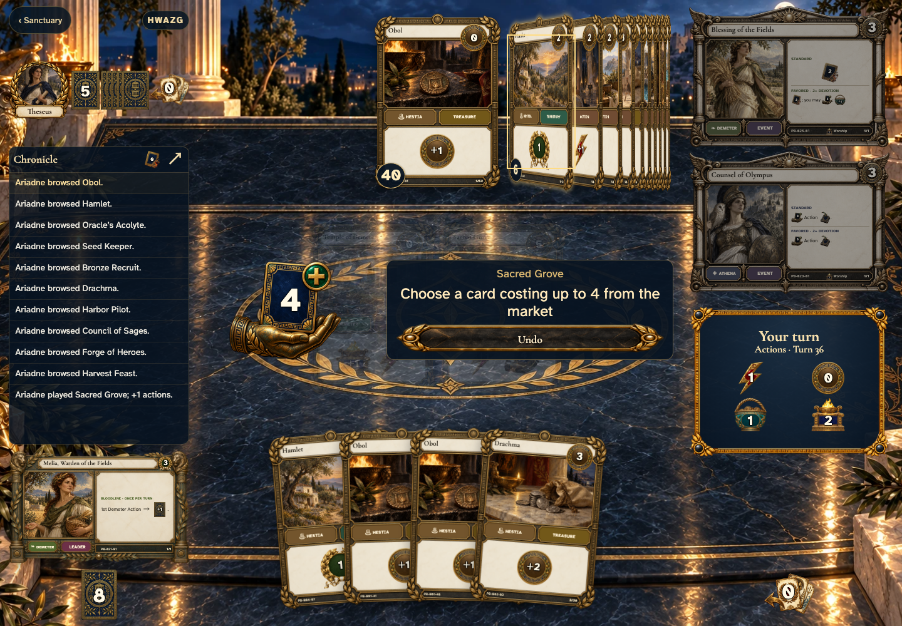</a></td>
<td valign="top"><a href="../../screenshots/demeter-allows-no-trash-and-a-zero-cost-gain-while-still-granting-a-buy/003-grove-selected-phone-darwin.png">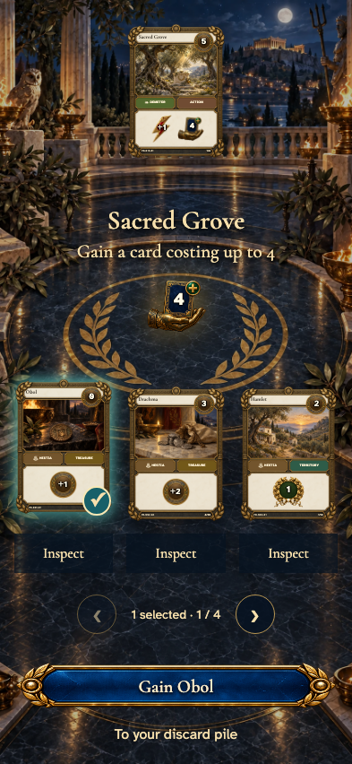</a></td>
</tr>
</table>

Tabletop · 3840 × 2160 — expand screenshot

<a href="../../screenshots/demeter-allows-no-trash-and-a-zero-cost-gain-while-still-granting-a-buy/003-grove-selected-tabletop-4k-darwin.png">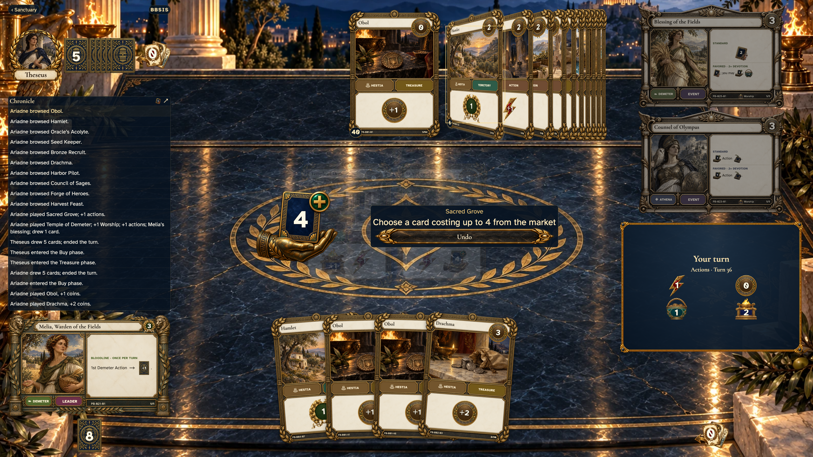</a>

- [x] Ariadne selects Obol for the Grove

## The Grove resolves fully before Worship is available

<table>
<tr><th>Desktop · 1440 × 1000</th><th>Phone · 393 × 852</th></tr>
<tr>
<td valign="top"><a href="../../screenshots/demeter-allows-no-trash-and-a-zero-cost-gain-while-still-granting-a-buy/004-grove-finished-desktop-darwin.png">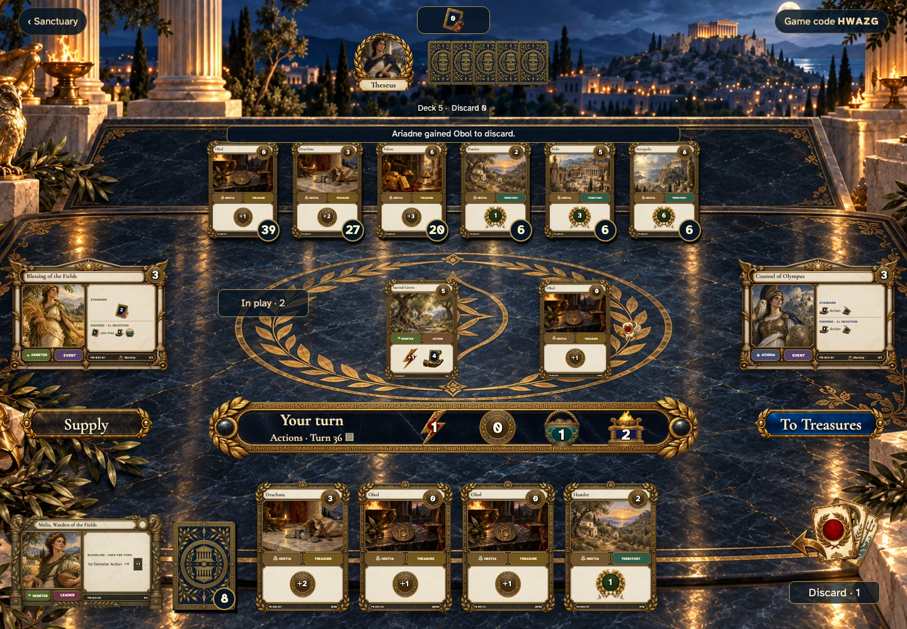</a></td>
<td valign="top"><a href="../../screenshots/demeter-allows-no-trash-and-a-zero-cost-gain-while-still-granting-a-buy/004-grove-finished-phone-darwin.png">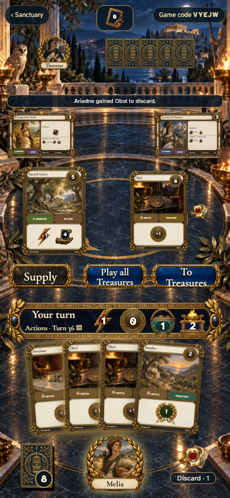</a></td>
</tr>
</table>

Tabletop · 3840 × 2160 — expand screenshot

<a href="../../screenshots/demeter-allows-no-trash-and-a-zero-cost-gain-while-still-granting-a-buy/004-grove-finished-tabletop-4k-darwin.png">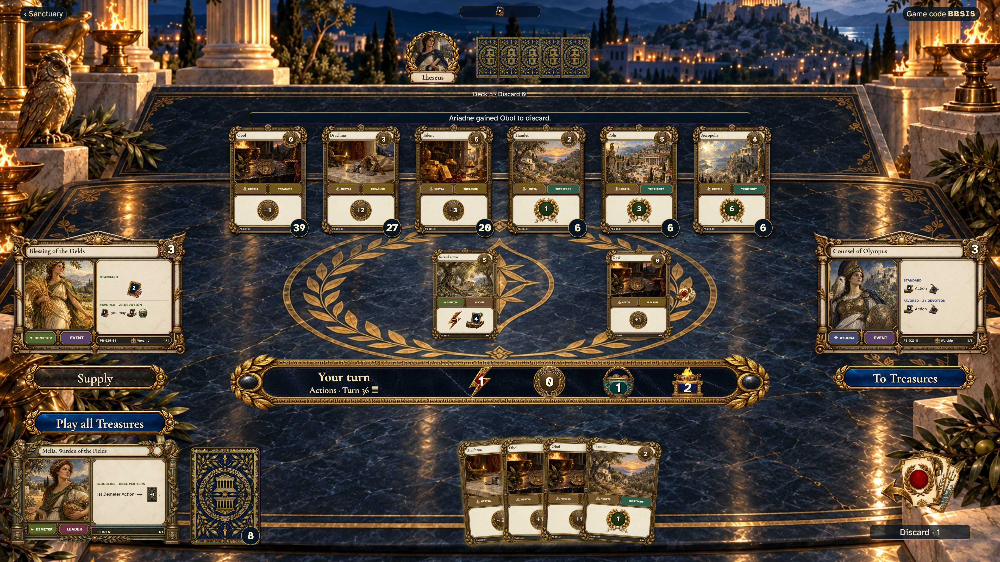</a>

- [x] The Grove resolves fully before Worship is available

## Ariadne pays for Worship using her Treasures

<table>
<tr><th>Desktop · 1440 × 1000</th><th>Phone · 393 × 852</th></tr>
<tr>
<td valign="top"><a href="../../screenshots/demeter-allows-no-trash-and-a-zero-cost-gain-while-still-granting-a-buy/005-wealth-desktop-darwin.png">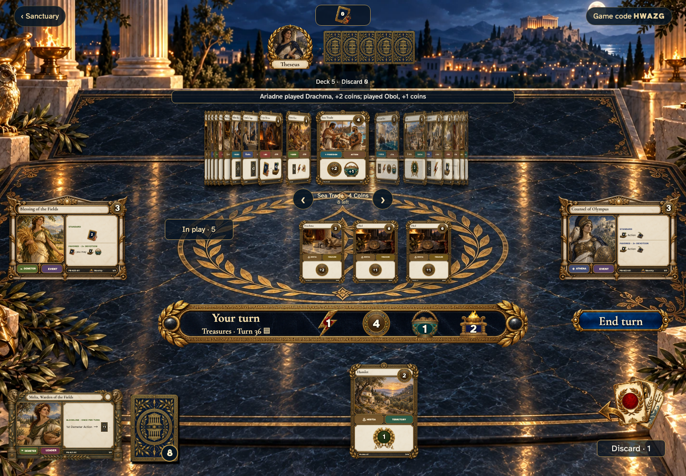</a></td>
<td valign="top"><a href="../../screenshots/demeter-allows-no-trash-and-a-zero-cost-gain-while-still-granting-a-buy/005-wealth-phone-darwin.png">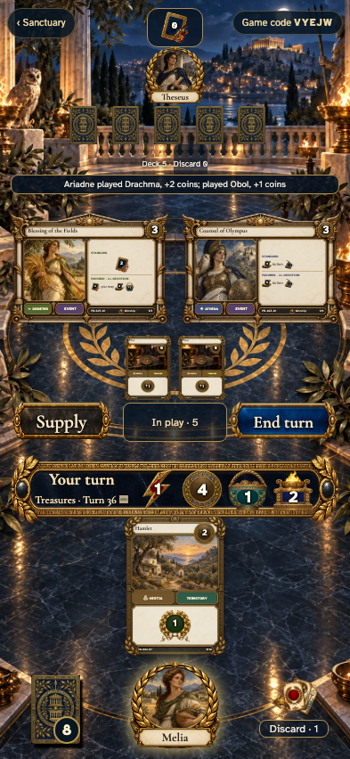</a></td>
</tr>
</table>

Tabletop · 3840 × 2160 — expand screenshot

<a href="../../screenshots/demeter-allows-no-trash-and-a-zero-cost-gain-while-still-granting-a-buy/005-wealth-tabletop-4k-darwin.png">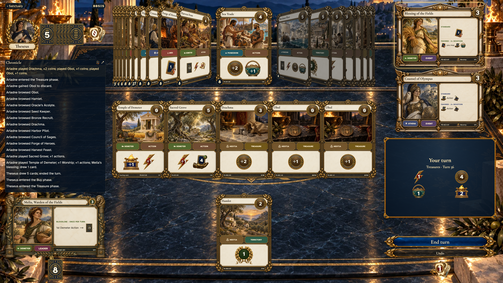</a>

- [x] Ariadne pays for Worship using her Treasures

## Demeter offers optional trash and gain plus an unconditional Buy

<table>
<tr><th>Desktop · 1440 × 1000</th><th>Phone · 393 × 852</th></tr>
<tr>
<td valign="top"><a href="../../screenshots/demeter-allows-no-trash-and-a-zero-cost-gain-while-still-granting-a-buy/006-favored-desktop-darwin.png">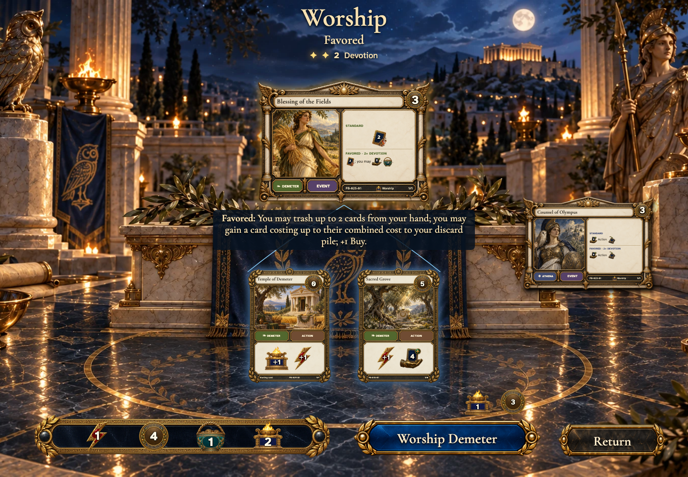</a></td>
<td valign="top"><a href="../../screenshots/demeter-allows-no-trash-and-a-zero-cost-gain-while-still-granting-a-buy/006-favored-phone-darwin.png">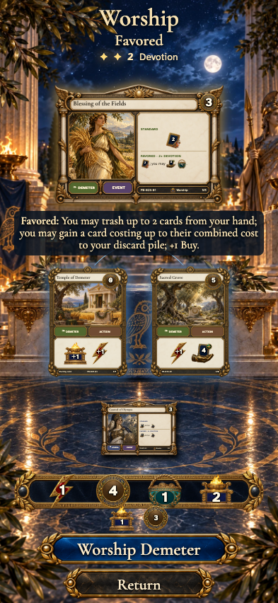</a></td>
</tr>
</table>

Tabletop · 3840 × 2160 — expand screenshot

<a href="../../screenshots/demeter-allows-no-trash-and-a-zero-cost-gain-while-still-granting-a-buy/006-favored-tabletop-4k-darwin.png">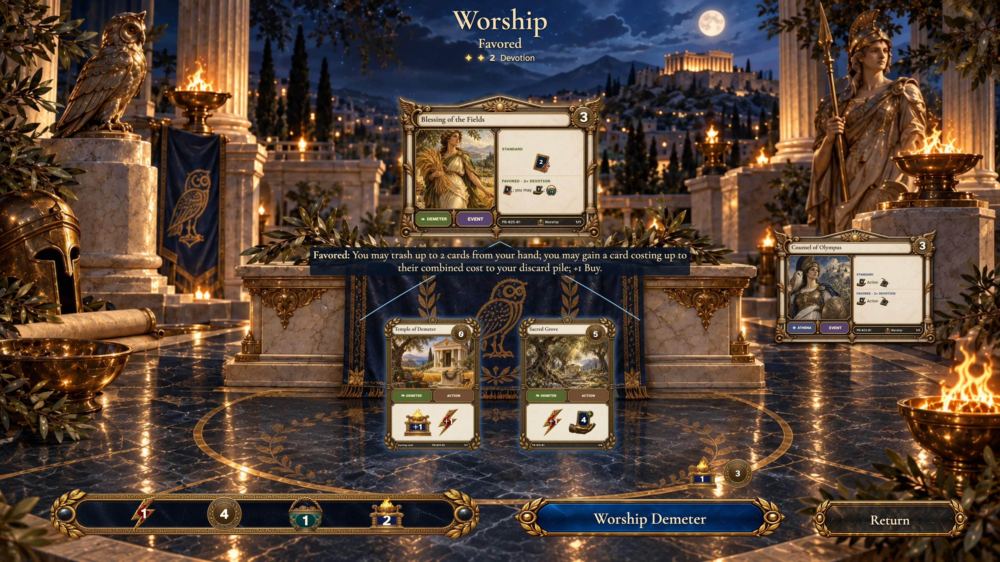</a>

- [x] Demeter offers optional trash and gain plus an unconditional Buy

## Ariadne can choose up to two cards or trash none

<table>
<tr><th>Desktop · 1440 × 1000</th><th>Phone · 393 × 852</th></tr>
<tr>
<td valign="top"><a href="../../screenshots/demeter-allows-no-trash-and-a-zero-cost-gain-while-still-granting-a-buy/007-trash-desktop-darwin.png">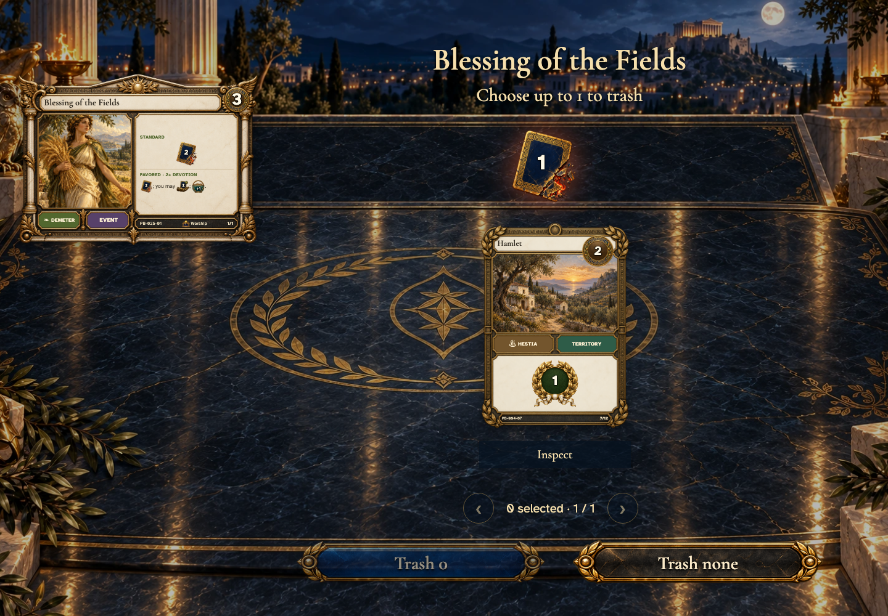</a></td>
<td valign="top"><a href="../../screenshots/demeter-allows-no-trash-and-a-zero-cost-gain-while-still-granting-a-buy/007-trash-phone-darwin.png">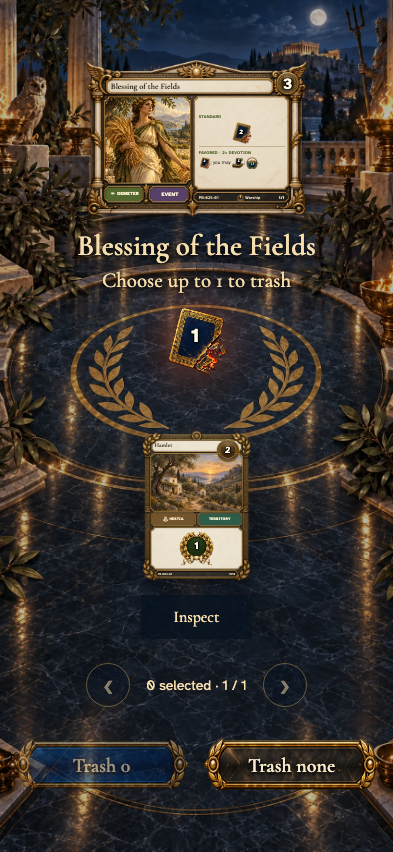</a></td>
</tr>
</table>

Tabletop · 3840 × 2160 — expand screenshot

<a href="../../screenshots/demeter-allows-no-trash-and-a-zero-cost-gain-while-still-granting-a-buy/007-trash-tabletop-4k-darwin.png">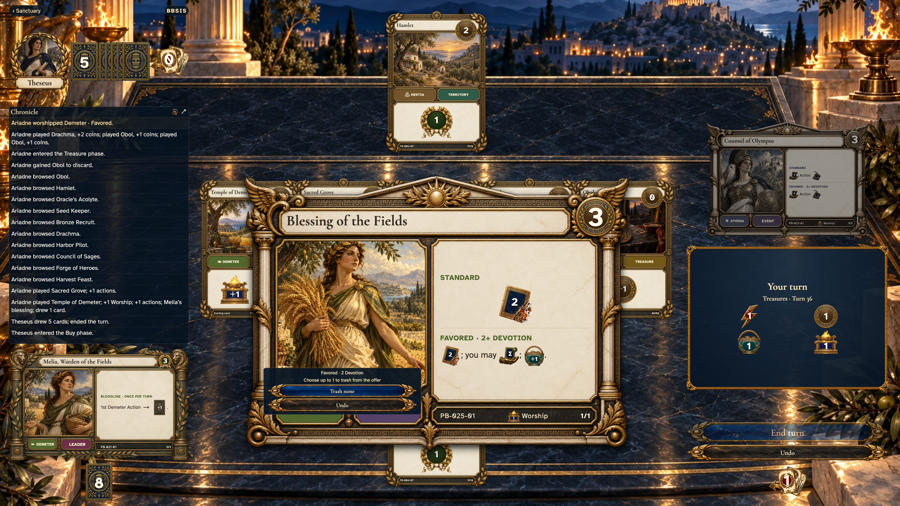</a>

- [x] Ariadne can choose up to two cards or trash none

## Trashing nothing still offers an optional cost-zero gain

<table>
<tr><th>Desktop · 1440 × 1000</th><th>Phone · 393 × 852</th></tr>
<tr>
<td valign="top"><a href="../../screenshots/demeter-allows-no-trash-and-a-zero-cost-gain-while-still-granting-a-buy/008-zero-limit-desktop-darwin.png">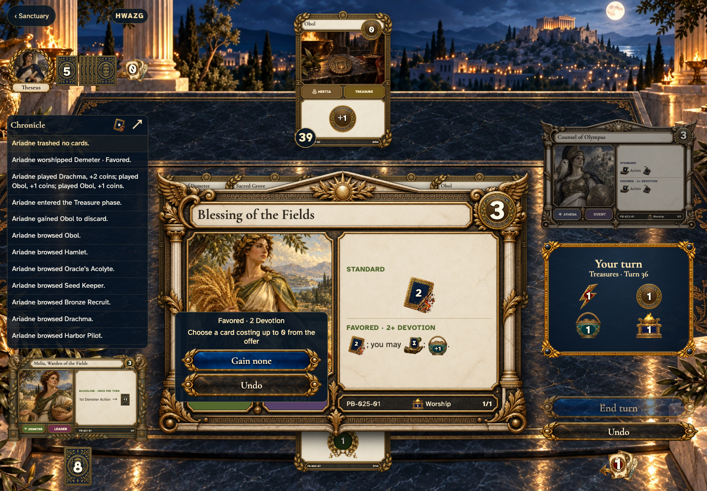</a></td>
<td valign="top"><a href="../../screenshots/demeter-allows-no-trash-and-a-zero-cost-gain-while-still-granting-a-buy/008-zero-limit-phone-darwin.png">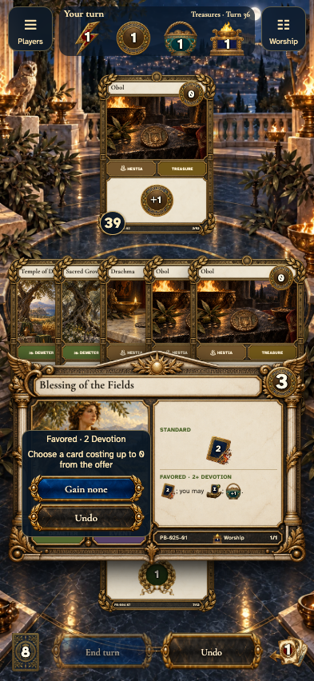</a></td>
</tr>
</table>

Tabletop · 3840 × 2160 — expand screenshot

<a href="../../screenshots/demeter-allows-no-trash-and-a-zero-cost-gain-while-still-granting-a-buy/008-zero-limit-tabletop-4k-darwin.png">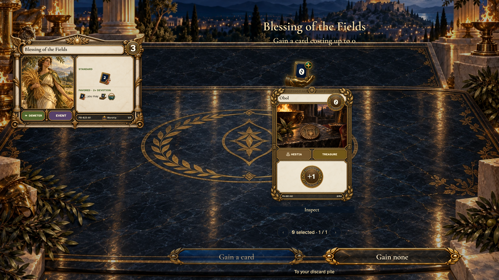</a>

- [x] Trashing nothing still offers an optional cost-zero gain

## Ariadne chooses the free Obol

<table>
<tr><th>Desktop · 1440 × 1000</th><th>Phone · 393 × 852</th></tr>
<tr>
<td valign="top"><a href="../../screenshots/demeter-allows-no-trash-and-a-zero-cost-gain-while-still-granting-a-buy/009-selected-desktop-darwin.png">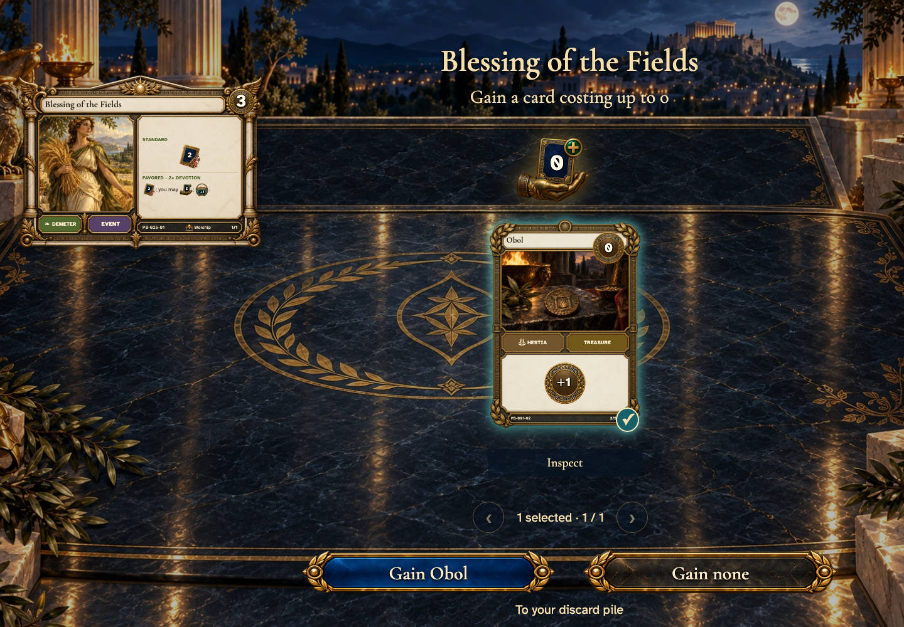</a></td>
<td valign="top"><a href="../../screenshots/demeter-allows-no-trash-and-a-zero-cost-gain-while-still-granting-a-buy/009-selected-phone-darwin.png">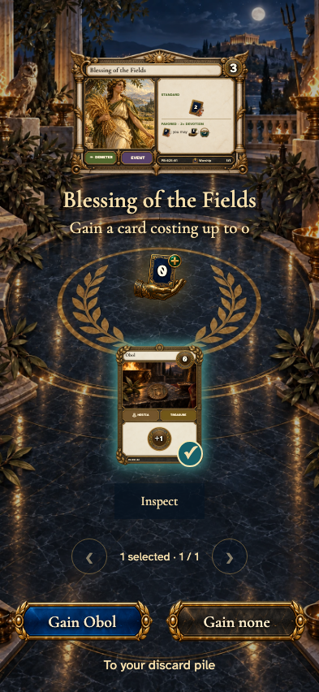</a></td>
</tr>
</table>

Tabletop · 3840 × 2160 — expand screenshot

<a href="../../screenshots/demeter-allows-no-trash-and-a-zero-cost-gain-while-still-granting-a-buy/009-selected-tabletop-4k-darwin.png">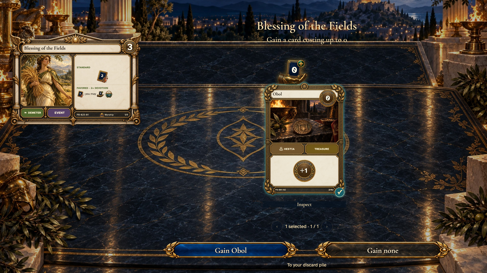</a>

- [x] Ariadne chooses the free Obol

## Demeter grants the extra Buy after the optional choices

<table>
<tr><th>Desktop · 1440 × 1000</th><th>Phone · 393 × 852</th></tr>
<tr>
<td valign="top"><a href="../../screenshots/demeter-allows-no-trash-and-a-zero-cost-gain-while-still-granting-a-buy/010-buy-granted-desktop-darwin.png">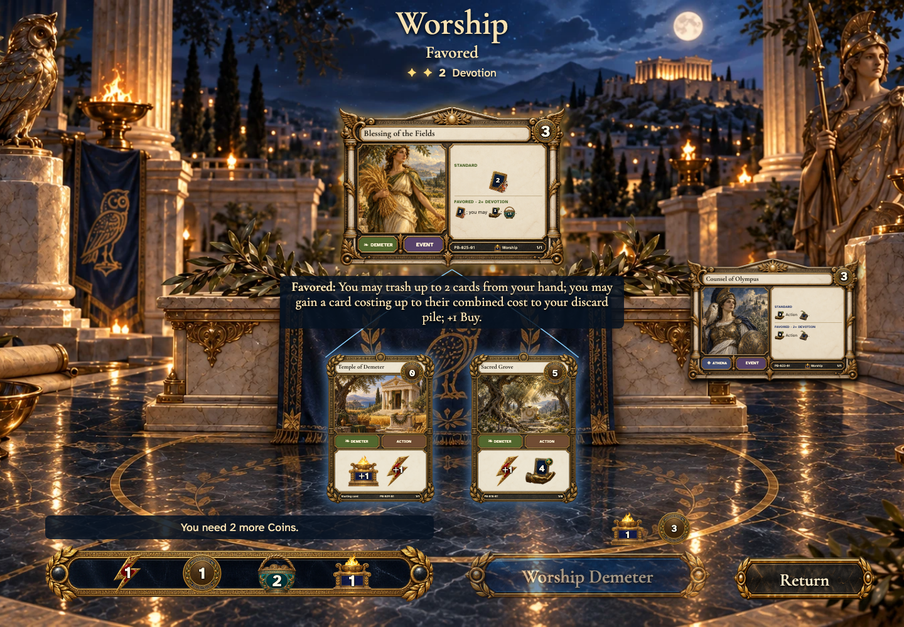</a></td>
<td valign="top"><a href="../../screenshots/demeter-allows-no-trash-and-a-zero-cost-gain-while-still-granting-a-buy/010-buy-granted-phone-darwin.png">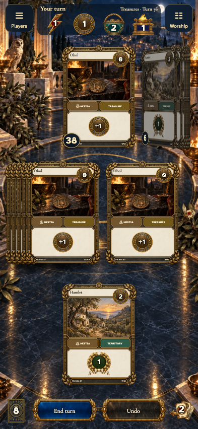</a></td>
</tr>
</table>

Tabletop · 3840 × 2160 — expand screenshot

<a href="../../screenshots/demeter-allows-no-trash-and-a-zero-cost-gain-while-still-granting-a-buy/010-buy-granted-tabletop-4k-darwin.png">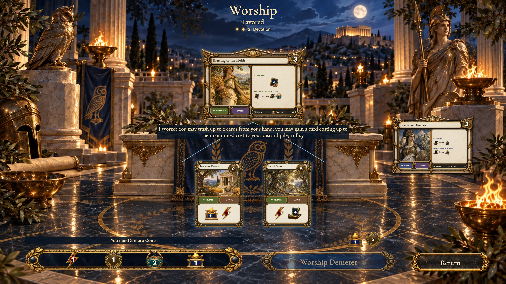</a>

- [x] Demeter grants the extra Buy after the optional choices
