# Demeter combines the costs of two offerings to gain a Territory

Recorded-history integration scenario. A legal event history prepares the starting position directly in the emulator. This verifies the illustrated effect from that position; it does not demonstrate the player journey to reach it.

## Ariadne holds her Temple, Grove, Hamlet, and wealth

<table>
<tr><th>Desktop · 1440 × 1000</th><th>Phone · 393 × 852</th></tr>
<tr>
<td valign="top"><a href="../../screenshots/demeter-combines-the-costs-of-two-offerings-to-gain-a-territory/000-opening-desktop-darwin.png">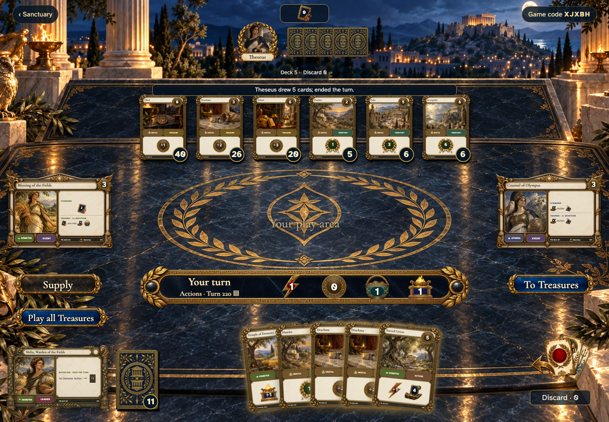</a></td>
<td valign="top"><a href="../../screenshots/demeter-combines-the-costs-of-two-offerings-to-gain-a-territory/000-opening-phone-darwin.png">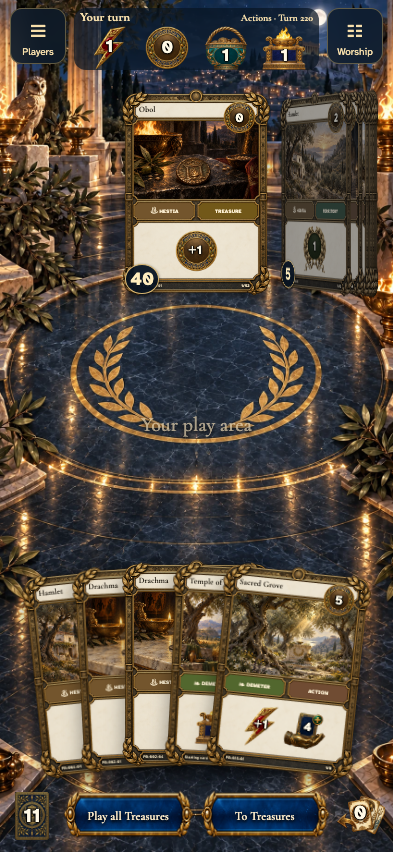</a></td>
</tr>
</table>

Tabletop · 3840 × 2160 — expand screenshot

<a href="../../screenshots/demeter-combines-the-costs-of-two-offerings-to-gain-a-territory/000-opening-tabletop-4k-darwin.png">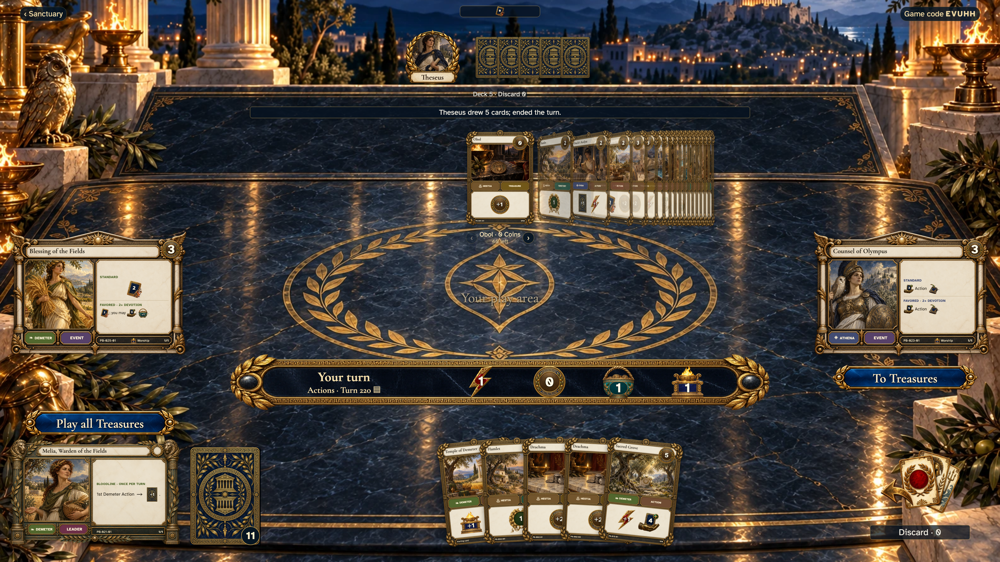</a>

- [x] Ariadne holds her Temple, Grove, Hamlet, and wealth

## Melia draws another Treasure after the Temple

<table>
<tr><th>Desktop · 1440 × 1000</th><th>Phone · 393 × 852</th></tr>
<tr>
<td valign="top"><a href="../../screenshots/demeter-combines-the-costs-of-two-offerings-to-gain-a-territory/001-temple-desktop-darwin.png">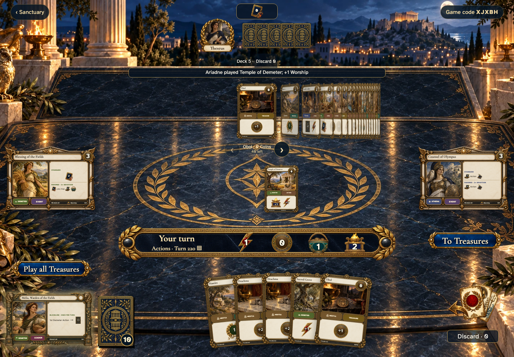</a></td>
<td valign="top"><a href="../../screenshots/demeter-combines-the-costs-of-two-offerings-to-gain-a-territory/001-temple-phone-darwin.png">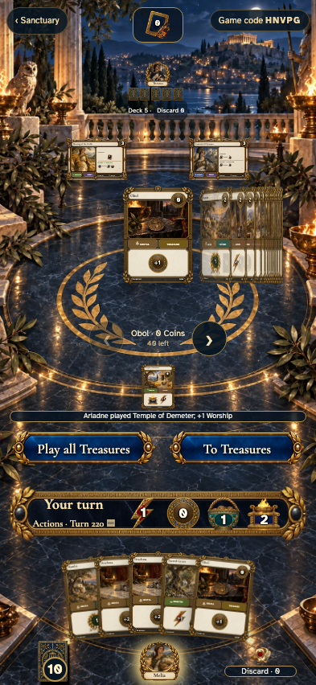</a></td>
</tr>
</table>

Tabletop · 3840 × 2160 — expand screenshot

<a href="../../screenshots/demeter-combines-the-costs-of-two-offerings-to-gain-a-territory/001-temple-tabletop-4k-darwin.png">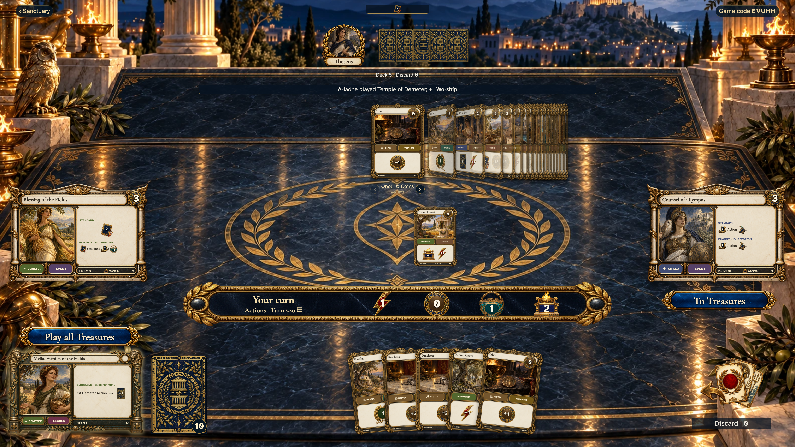</a>

- [x] Melia draws another Treasure after the Temple

## Resolve the Grove’s separate gain first

<table>
<tr><th>Desktop · 1440 × 1000</th><th>Phone · 393 × 852</th></tr>
<tr>
<td valign="top"><a href="../../screenshots/demeter-combines-the-costs-of-two-offerings-to-gain-a-territory/002-grove-desktop-darwin.png">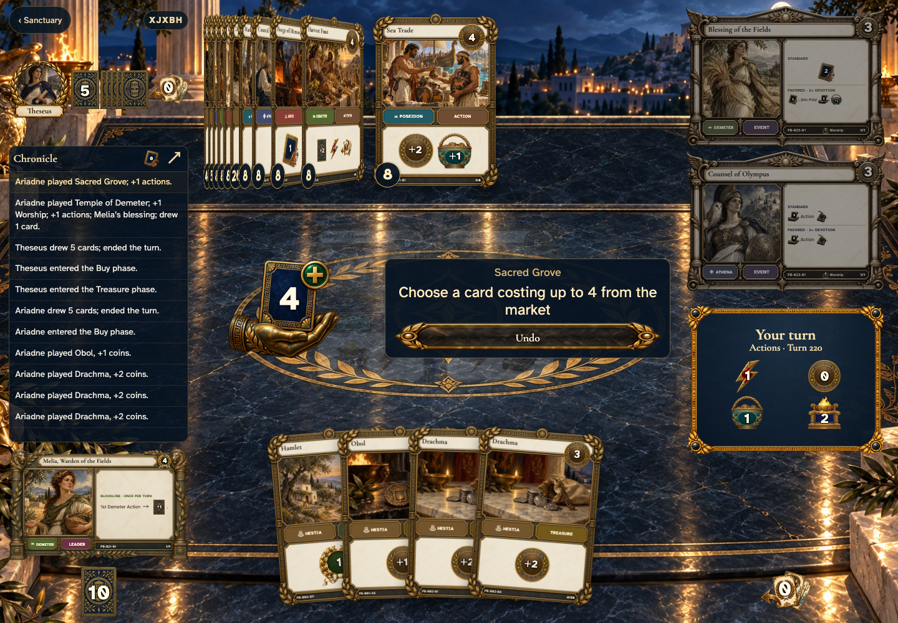</a></td>
<td valign="top"><a href="../../screenshots/demeter-combines-the-costs-of-two-offerings-to-gain-a-territory/002-grove-phone-darwin.png">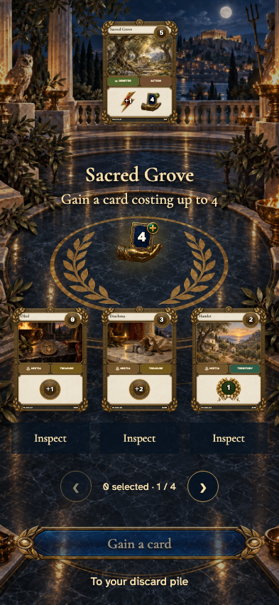</a></td>
</tr>
</table>

Tabletop · 3840 × 2160 — expand screenshot

<a href="../../screenshots/demeter-combines-the-costs-of-two-offerings-to-gain-a-territory/002-grove-tabletop-4k-darwin.png">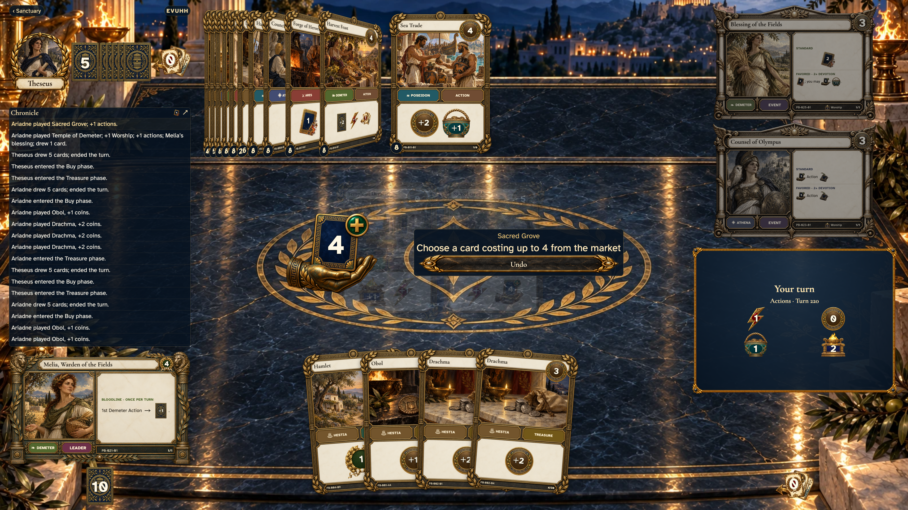</a>

- [x] Resolve the Grove’s separate gain first

## Choose Obol for the Grove

<table>
<tr><th>Desktop · 1440 × 1000</th><th>Phone · 393 × 852</th></tr>
<tr>
<td valign="top"><a href="../../screenshots/demeter-combines-the-costs-of-two-offerings-to-gain-a-territory/003-grove-selected-desktop-darwin.png">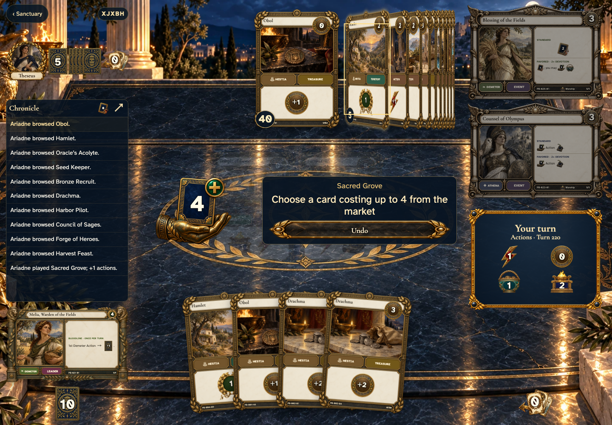</a></td>
<td valign="top"><a href="../../screenshots/demeter-combines-the-costs-of-two-offerings-to-gain-a-territory/003-grove-selected-phone-darwin.png">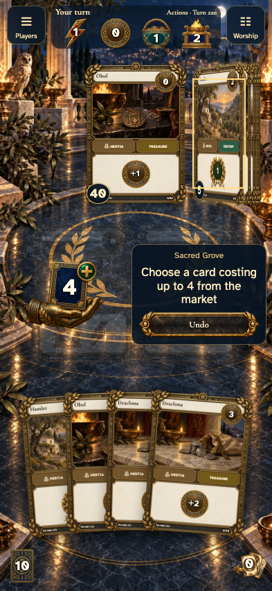</a></td>
</tr>
</table>

Tabletop · 3840 × 2160 — expand screenshot

<a href="../../screenshots/demeter-combines-the-costs-of-two-offerings-to-gain-a-territory/003-grove-selected-tabletop-4k-darwin.png">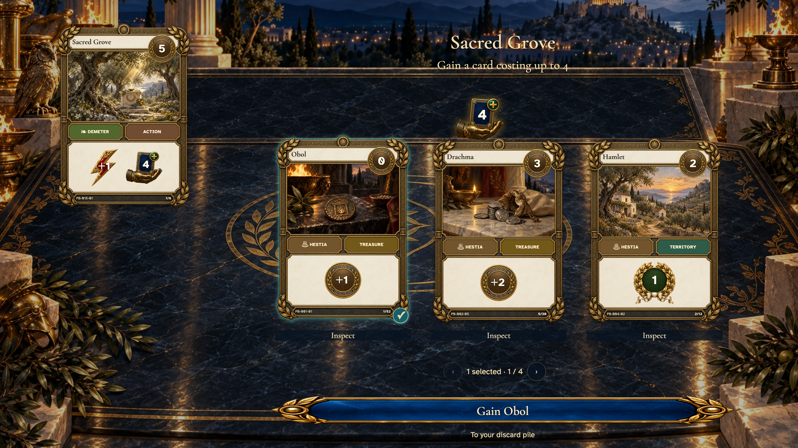</a>

- [x] Choose Obol for the Grove

## Ariadne keeps a Drachma and Hamlet in hand for the offering

<table>
<tr><th>Desktop · 1440 × 1000</th><th>Phone · 393 × 852</th></tr>
<tr>
<td valign="top"><a href="../../screenshots/demeter-combines-the-costs-of-two-offerings-to-gain-a-territory/004-treasures-desktop-darwin.png">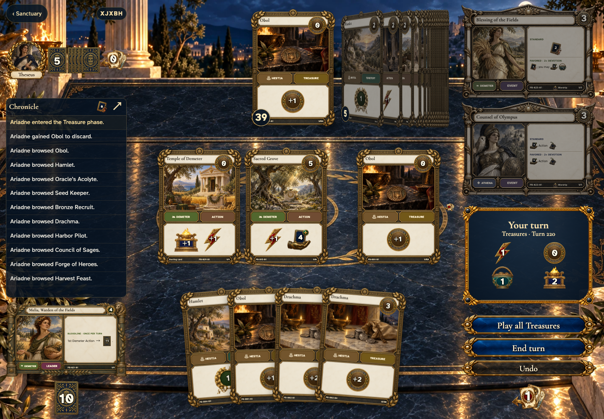</a></td>
<td valign="top"><a href="../../screenshots/demeter-combines-the-costs-of-two-offerings-to-gain-a-territory/004-treasures-phone-darwin.png">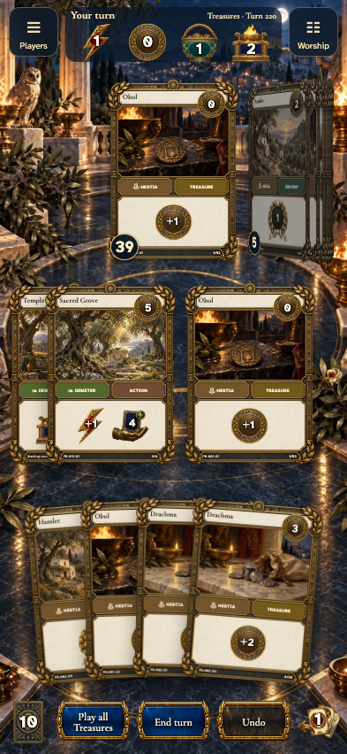</a></td>
</tr>
</table>

Tabletop · 3840 × 2160 — expand screenshot

- [x] Ariadne keeps a Drachma and Hamlet in hand for the offering

## One Drachma provides two Coins

<table>
<tr><th>Desktop · 1440 × 1000</th><th>Phone · 393 × 852</th></tr>
<tr>
<td valign="top"><a href="../../screenshots/demeter-combines-the-costs-of-two-offerings-to-gain-a-territory/005-drachma-desktop-darwin.png">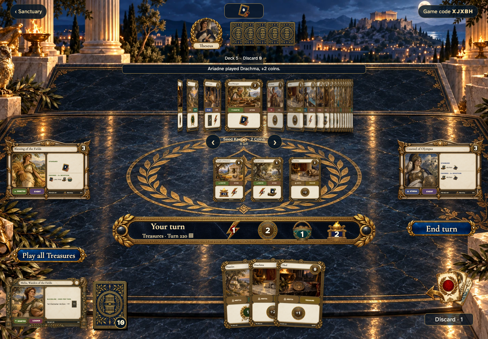</a></td>
<td valign="top"><a href="../../screenshots/demeter-combines-the-costs-of-two-offerings-to-gain-a-territory/005-drachma-phone-darwin.png">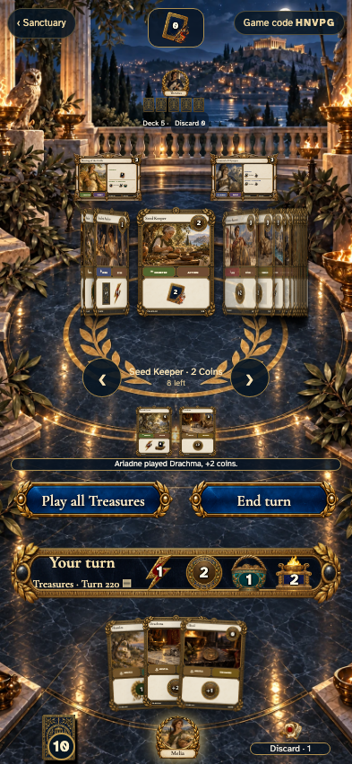</a></td>
</tr>
</table>

Tabletop · 3840 × 2160 — expand screenshot

<a href="../../screenshots/demeter-combines-the-costs-of-two-offerings-to-gain-a-territory/005-drachma-tabletop-4k-darwin.png">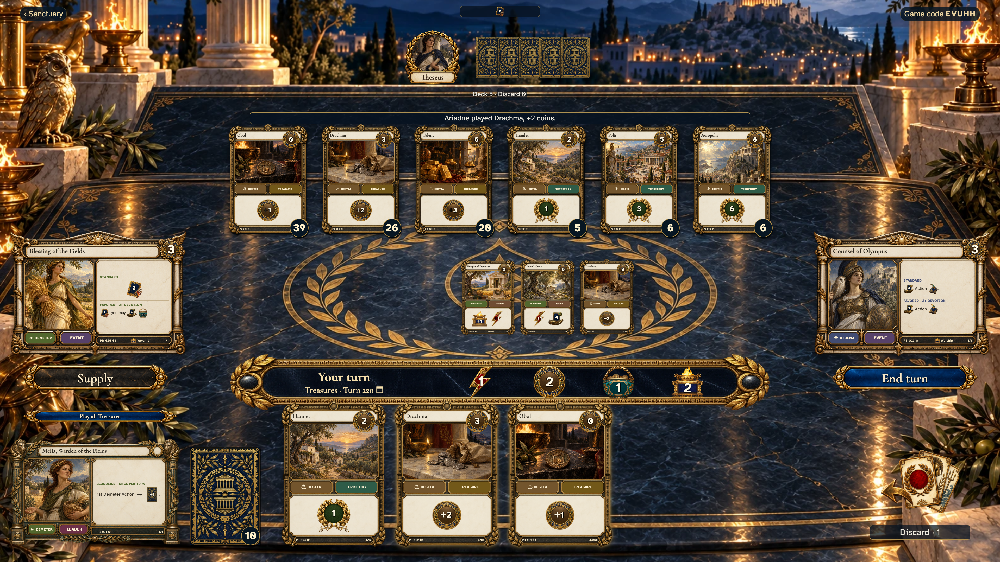</a>

- [x] One Drachma provides two Coins

## A second Treasure funds Worship while two offerings remain

<table>
<tr><th>Desktop · 1440 × 1000</th><th>Phone · 393 × 852</th></tr>
<tr>
<td valign="top"><a href="../../screenshots/demeter-combines-the-costs-of-two-offerings-to-gain-a-territory/006-funded-desktop-darwin.png">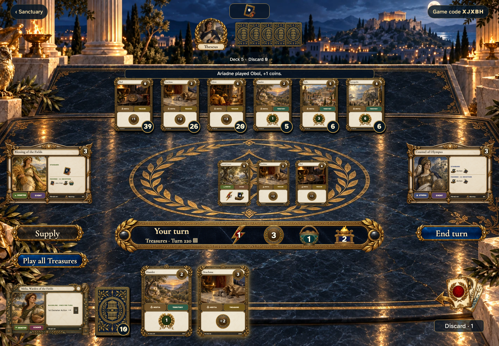</a></td>
<td valign="top"><a href="../../screenshots/demeter-combines-the-costs-of-two-offerings-to-gain-a-territory/006-funded-phone-darwin.png">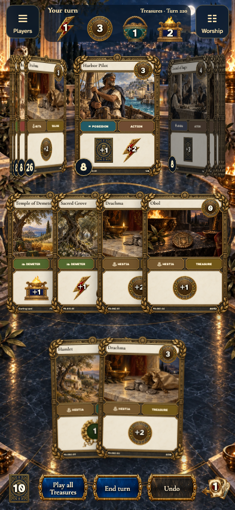</a></td>
</tr>
</table>

Tabletop · 3840 × 2160 — expand screenshot

<a href="../../screenshots/demeter-combines-the-costs-of-two-offerings-to-gain-a-territory/006-funded-tabletop-4k-darwin.png">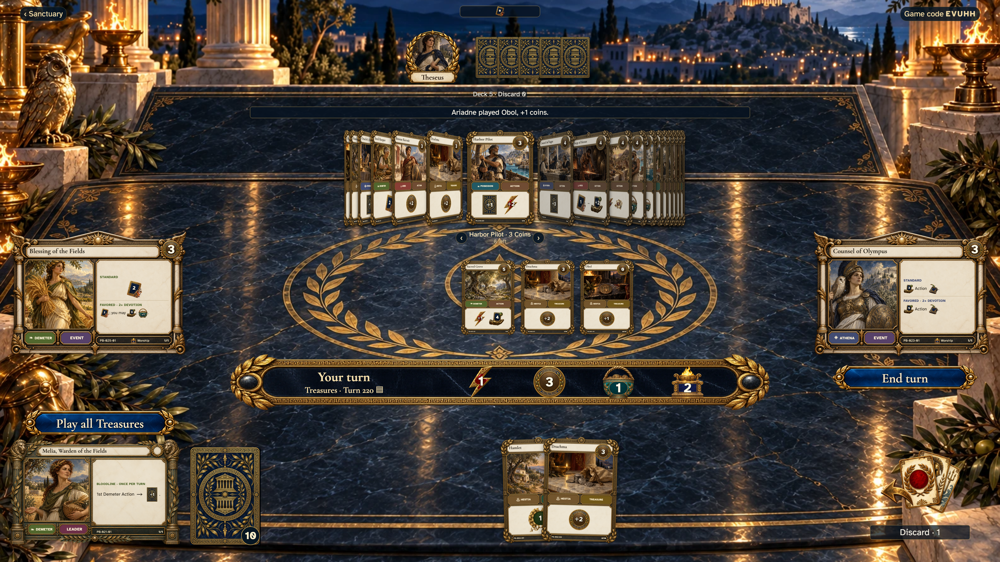</a>

- [x] A second Treasure funds Worship while two offerings remain

## Two Demeter Actions unlock the combined-cost gift

<table>
<tr><th>Desktop · 1440 × 1000</th><th>Phone · 393 × 852</th></tr>
<tr>
<td valign="top"><a href="../../screenshots/demeter-combines-the-costs-of-two-offerings-to-gain-a-territory/007-favored-desktop-darwin.png">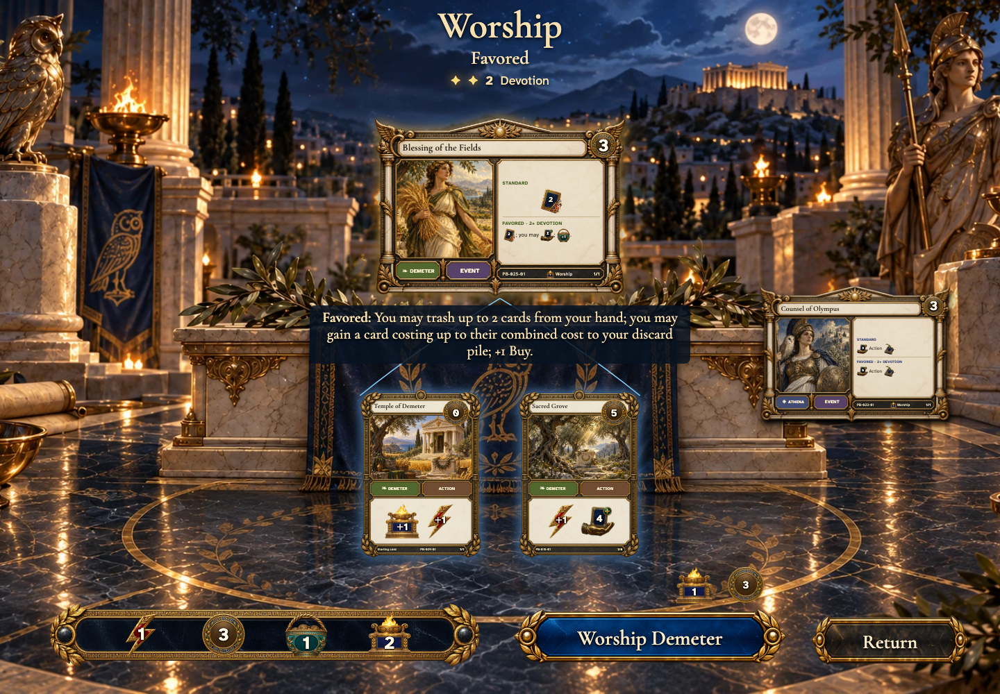</a></td>
<td valign="top"><a href="../../screenshots/demeter-combines-the-costs-of-two-offerings-to-gain-a-territory/007-favored-phone-darwin.png">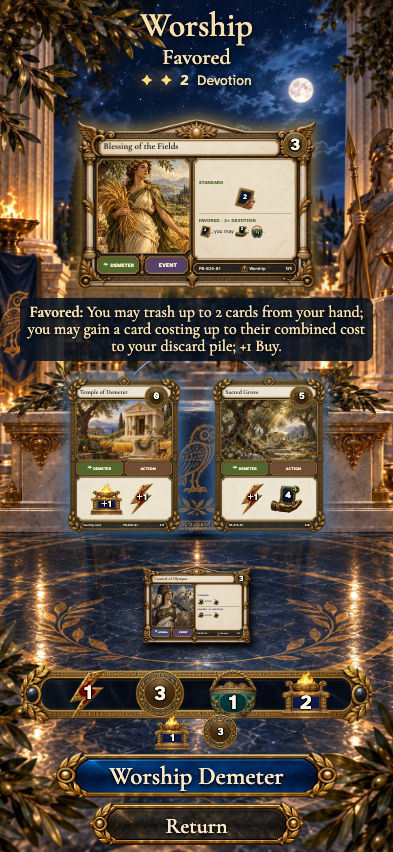</a></td>
</tr>
</table>

Tabletop · 3840 × 2160 — expand screenshot

<a href="../../screenshots/demeter-combines-the-costs-of-two-offerings-to-gain-a-territory/007-favored-tabletop-4k-darwin.png">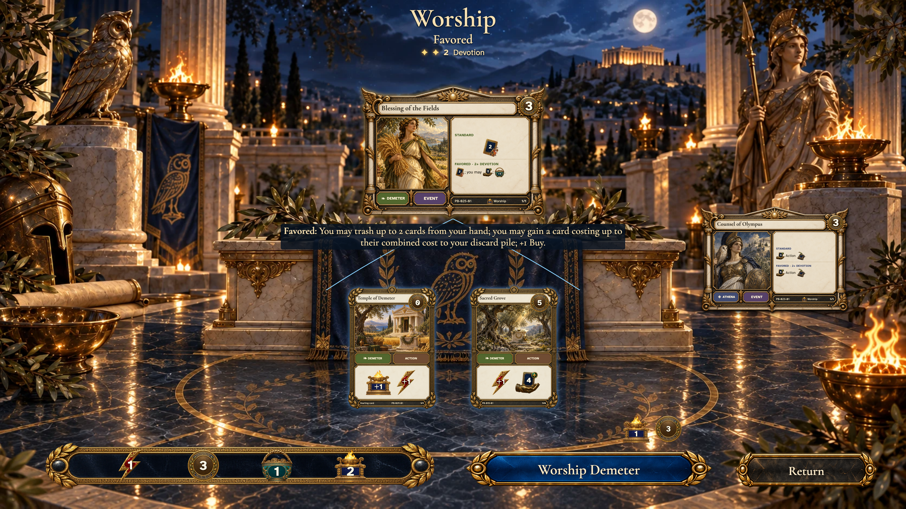</a>

- [x] Two Demeter Actions unlock the combined-cost gift

## Choose up to two cards from the retained hand

<table>
<tr><th>Desktop · 1440 × 1000</th><th>Phone · 393 × 852</th></tr>
<tr>
<td valign="top"><a href="../../screenshots/demeter-combines-the-costs-of-two-offerings-to-gain-a-territory/008-offerings-desktop-darwin.png">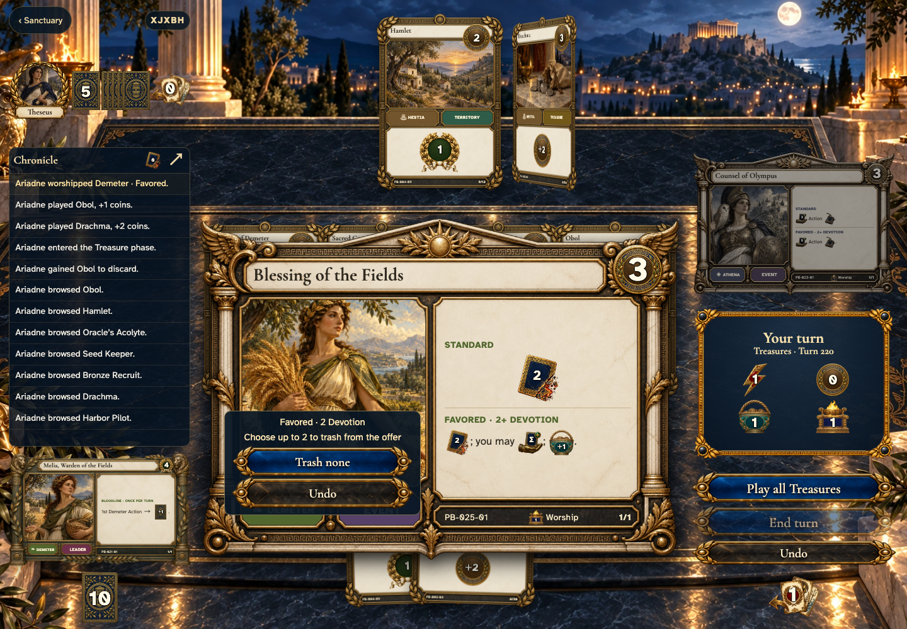</a></td>
<td valign="top"><a href="../../screenshots/demeter-combines-the-costs-of-two-offerings-to-gain-a-territory/008-offerings-phone-darwin.png">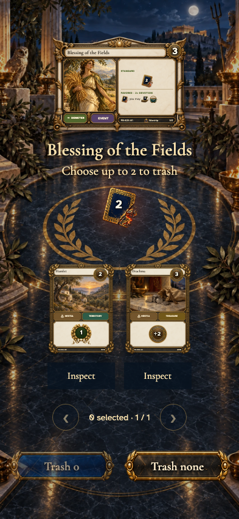</a></td>
</tr>
</table>

Tabletop · 3840 × 2160 — expand screenshot

<a href="../../screenshots/demeter-combines-the-costs-of-two-offerings-to-gain-a-territory/008-offerings-tabletop-4k-darwin.png">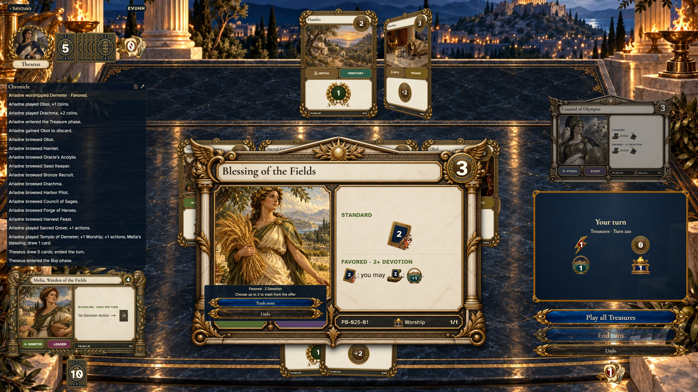</a>

- [x] Choose up to two cards from the retained hand

## The Hamlet and Drachma are selected together

<table>
<tr><th>Desktop · 1440 × 1000</th><th>Phone · 393 × 852</th></tr>
<tr>
<td valign="top"><a href="../../screenshots/demeter-combines-the-costs-of-two-offerings-to-gain-a-territory/009-selected-desktop-darwin.png">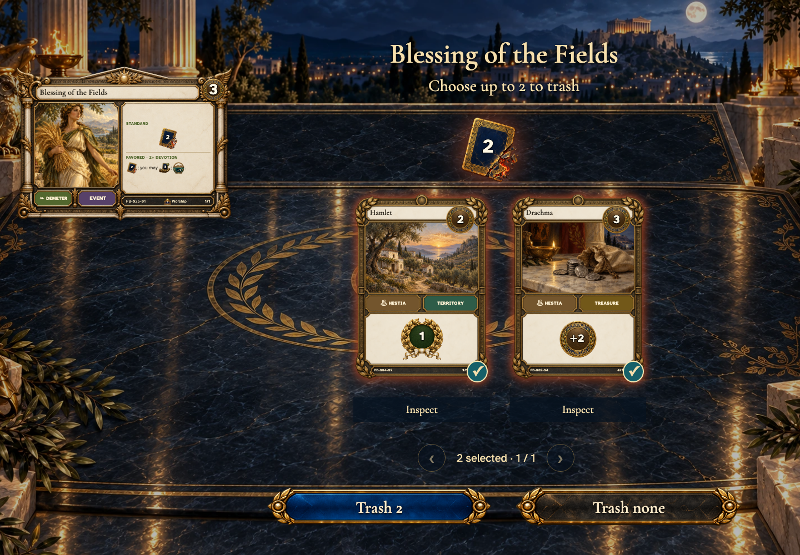</a></td>
<td valign="top"><a href="../../screenshots/demeter-combines-the-costs-of-two-offerings-to-gain-a-territory/009-selected-phone-darwin.png">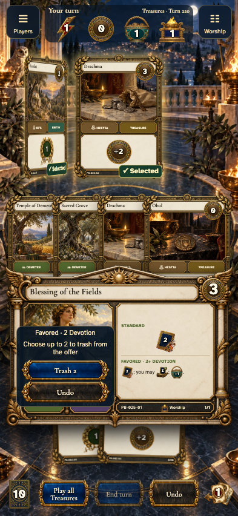</a></td>
</tr>
</table>

Tabletop · 3840 × 2160 — expand screenshot

<a href="../../screenshots/demeter-combines-the-costs-of-two-offerings-to-gain-a-territory/009-selected-tabletop-4k-darwin.png">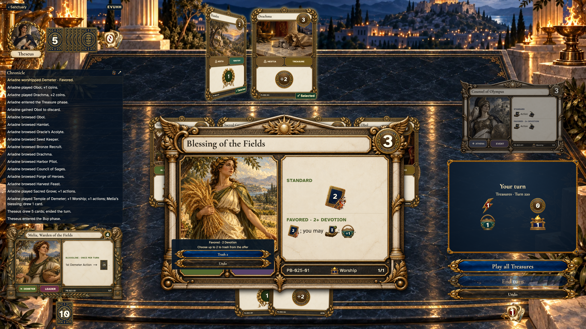</a>

- [x] The Hamlet and Drachma are selected together

## Two plus three permits any available card costing up to five

<table>
<tr><th>Desktop · 1440 × 1000</th><th>Phone · 393 × 852</th></tr>
<tr>
<td valign="top"><a href="../../screenshots/demeter-combines-the-costs-of-two-offerings-to-gain-a-territory/010-combined-desktop-darwin.png">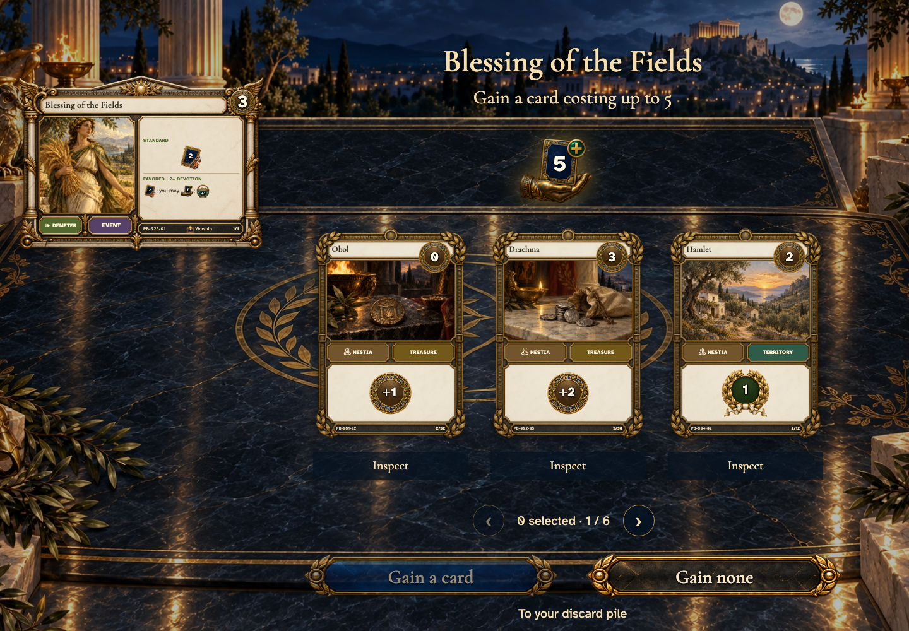</a></td>
<td valign="top"><a href="../../screenshots/demeter-combines-the-costs-of-two-offerings-to-gain-a-territory/010-combined-phone-darwin.png">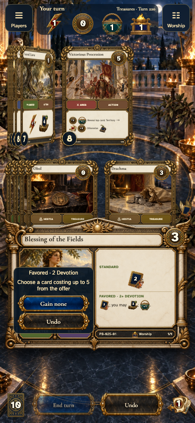</a></td>
</tr>
</table>

Tabletop · 3840 × 2160 — expand screenshot

<a href="../../screenshots/demeter-combines-the-costs-of-two-offerings-to-gain-a-territory/010-combined-tabletop-4k-darwin.png">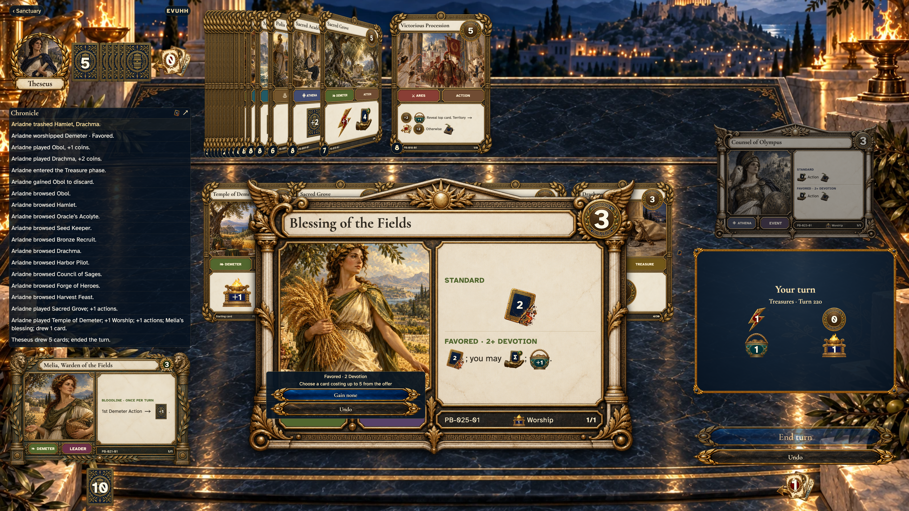</a>

- [x] Two plus three permits any available card costing up to five

## The market includes a Territory, not just Actions

<table>
<tr><th>Desktop · 1440 × 1000</th><th>Phone · 393 × 852</th></tr>
<tr>
<td valign="top"><a href="../../screenshots/demeter-combines-the-costs-of-two-offerings-to-gain-a-territory/011-territory-desktop-darwin.png">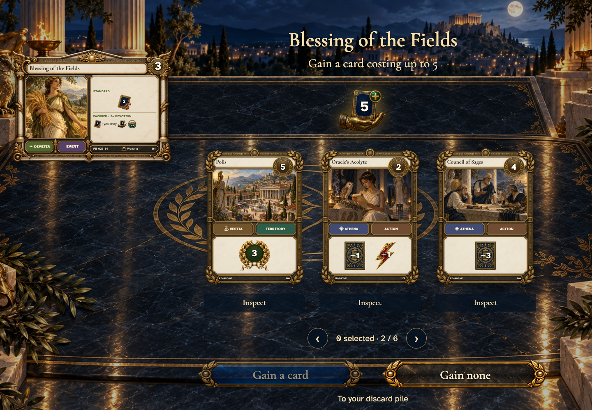</a></td>
<td valign="top"><a href="../../screenshots/demeter-combines-the-costs-of-two-offerings-to-gain-a-territory/011-territory-phone-darwin.png">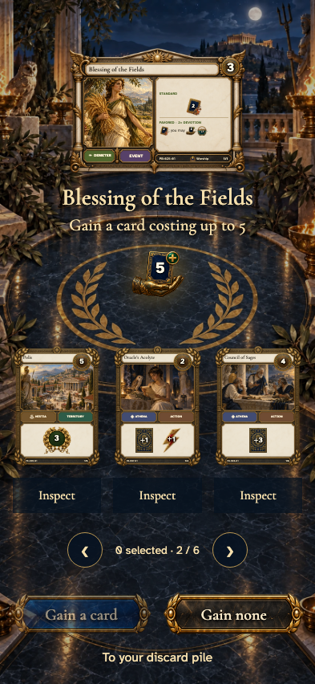</a></td>
</tr>
</table>

Tabletop · 3840 × 2160 — expand screenshot

<a href="../../screenshots/demeter-combines-the-costs-of-two-offerings-to-gain-a-territory/011-territory-tabletop-4k-darwin.png">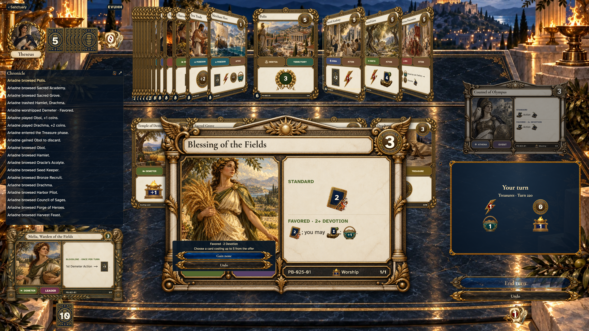</a>

- [x] The market includes a Territory, not just Actions

## Ariadne selects a Polis

<table>
<tr><th>Desktop · 1440 × 1000</th><th>Phone · 393 × 852</th></tr>
<tr>
<td valign="top"><a href="../../screenshots/demeter-combines-the-costs-of-two-offerings-to-gain-a-territory/012-polis-desktop-darwin.png">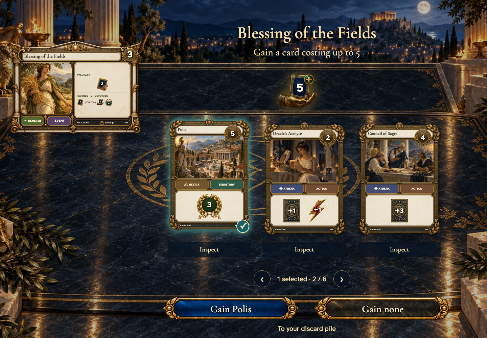</a></td>
<td valign="top"><a href="../../screenshots/demeter-combines-the-costs-of-two-offerings-to-gain-a-territory/012-polis-phone-darwin.png">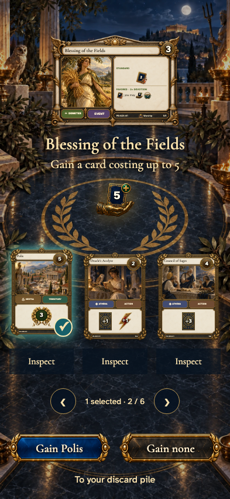</a></td>
</tr>
</table>

Tabletop · 3840 × 2160 — expand screenshot

<a href="../../screenshots/demeter-combines-the-costs-of-two-offerings-to-gain-a-territory/012-polis-tabletop-4k-darwin.png">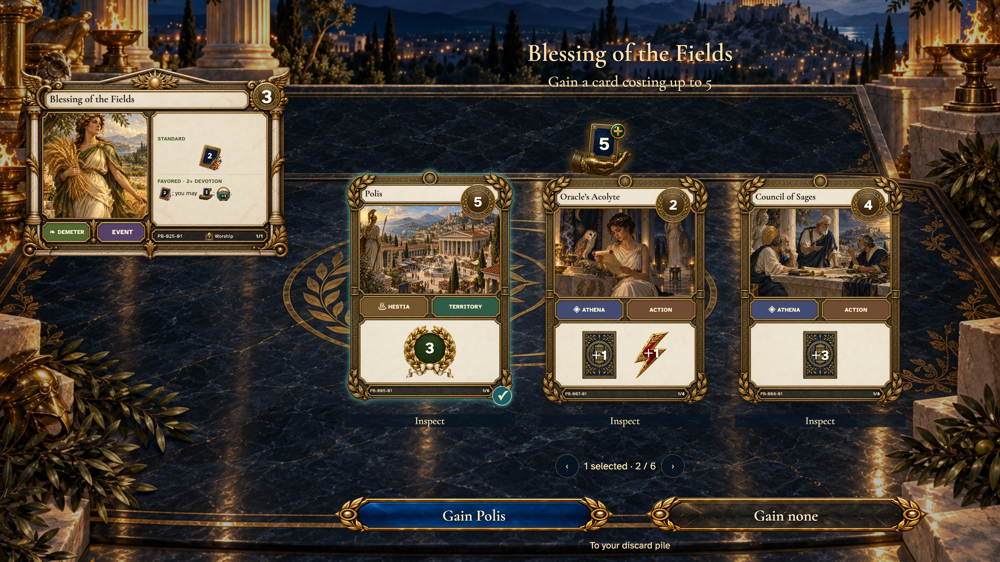</a>

- [x] Ariadne selects a Polis

## The Polis enters discard and the bonus Buy is granted

<table>
<tr><th>Desktop · 1440 × 1000</th><th>Phone · 393 × 852</th></tr>
<tr>
<td valign="top"><a href="../../screenshots/demeter-combines-the-costs-of-two-offerings-to-gain-a-territory/013-gift-desktop-darwin.png">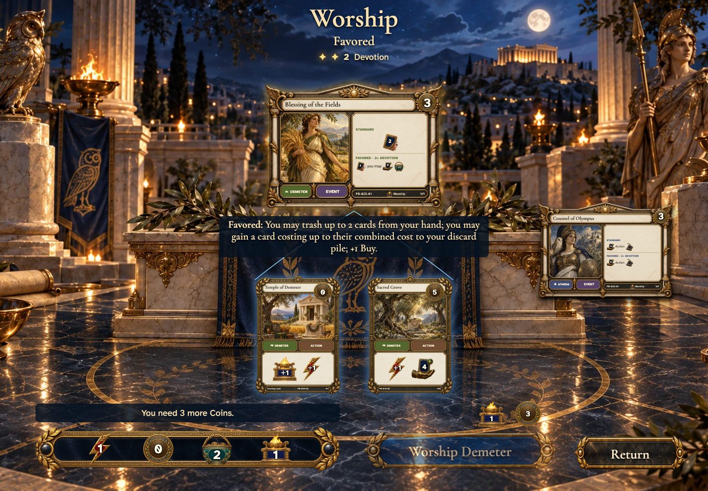</a></td>
<td valign="top"><a href="../../screenshots/demeter-combines-the-costs-of-two-offerings-to-gain-a-territory/013-gift-phone-darwin.png">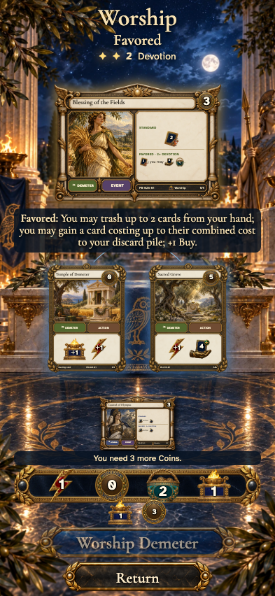</a></td>
</tr>
</table>

Tabletop · 3840 × 2160 — expand screenshot

<a href="../../screenshots/demeter-combines-the-costs-of-two-offerings-to-gain-a-territory/013-gift-tabletop-4k-darwin.png">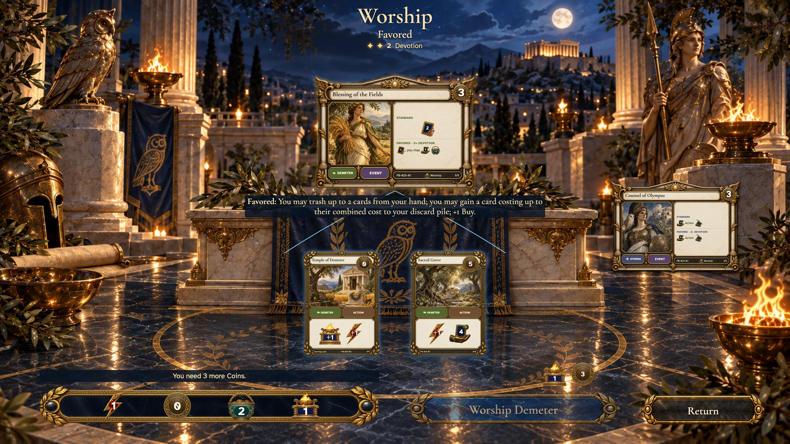</a>

- [x] The Polis enters discard and the bonus Buy is granted
