# four shared gods and three Devotion remain readable in the vertical coverflow

Recorded-history integration scenario. A legal event history prepares the starting position directly in the emulator. This verifies the illustrated effect from that position; it does not demonstrate the player journey to reach it.

## Four bloodlines share their gods

<table>
<tr><th>Desktop · 1440 × 1000</th><th>Phone · 393 × 852</th></tr>
<tr>
<td valign="top"><a href="../../screenshots/four-shared-gods-and-three-devotion-remain-readable-in-the-vertical-coverflow/000-opening-desktop-darwin.png">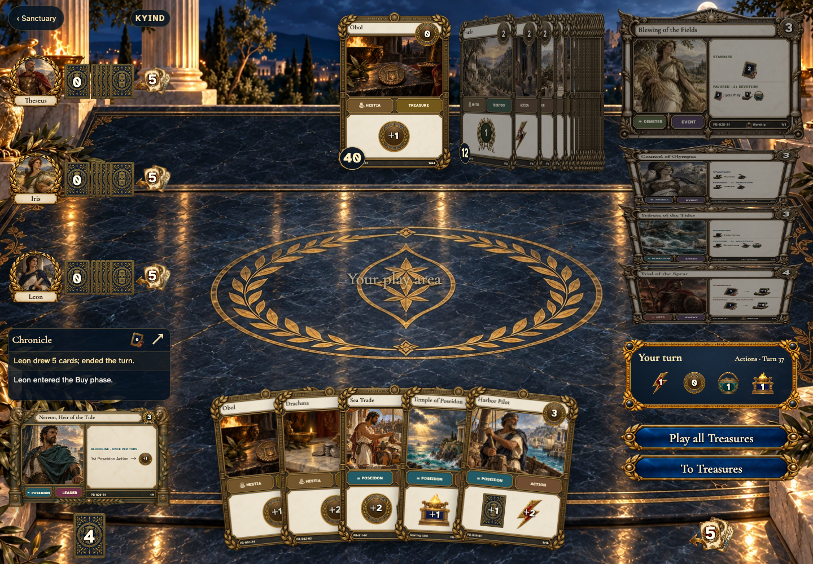</a></td>
<td valign="top"><a href="../../screenshots/four-shared-gods-and-three-devotion-remain-readable-in-the-vertical-coverflow/000-opening-phone-darwin.png">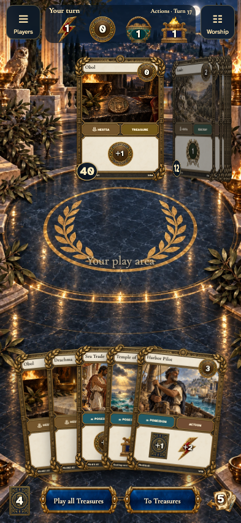</a></td>
</tr>
</table>

Tabletop · 3840 × 2160 — expand screenshot

<a href="../../screenshots/four-shared-gods-and-three-devotion-remain-readable-in-the-vertical-coverflow/000-opening-tabletop-4k-darwin.png">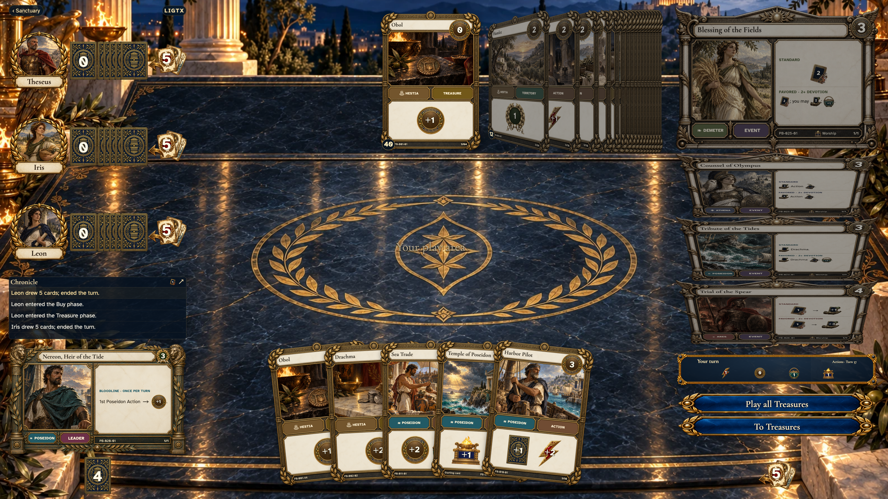</a>

- [x] Four bloodlines share their gods

## Temple contributes to Poseidon

<table>
<tr><th>Desktop · 1440 × 1000</th><th>Phone · 393 × 852</th></tr>
<tr>
<td valign="top"><a href="../../screenshots/four-shared-gods-and-three-devotion-remain-readable-in-the-vertical-coverflow/001-temple-of-poseidon-desktop-darwin.png">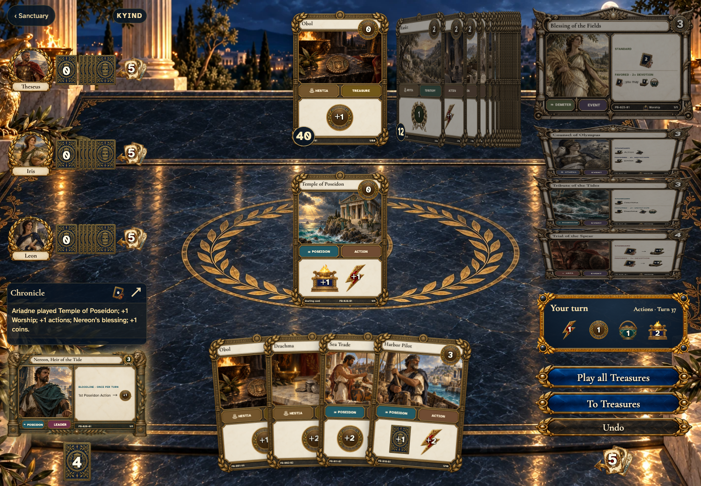</a></td>
<td valign="top"><a href="../../screenshots/four-shared-gods-and-three-devotion-remain-readable-in-the-vertical-coverflow/001-temple-of-poseidon-phone-darwin.png">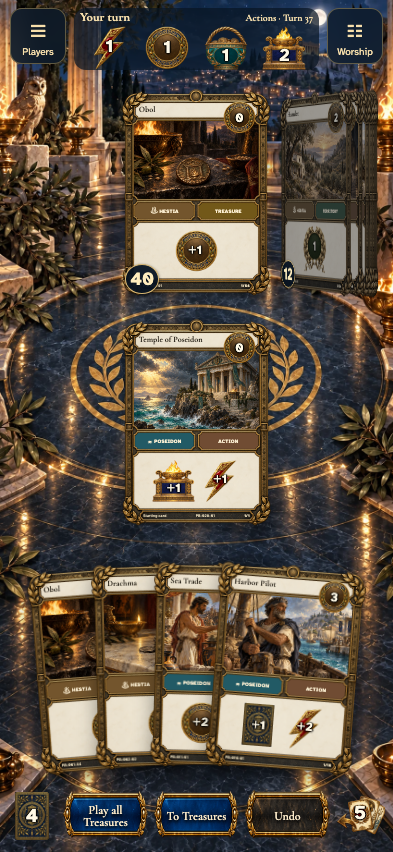</a></td>
</tr>
</table>

Tabletop · 3840 × 2160 — expand screenshot

<a href="../../screenshots/four-shared-gods-and-three-devotion-remain-readable-in-the-vertical-coverflow/001-temple-of-poseidon-tabletop-4k-darwin.png">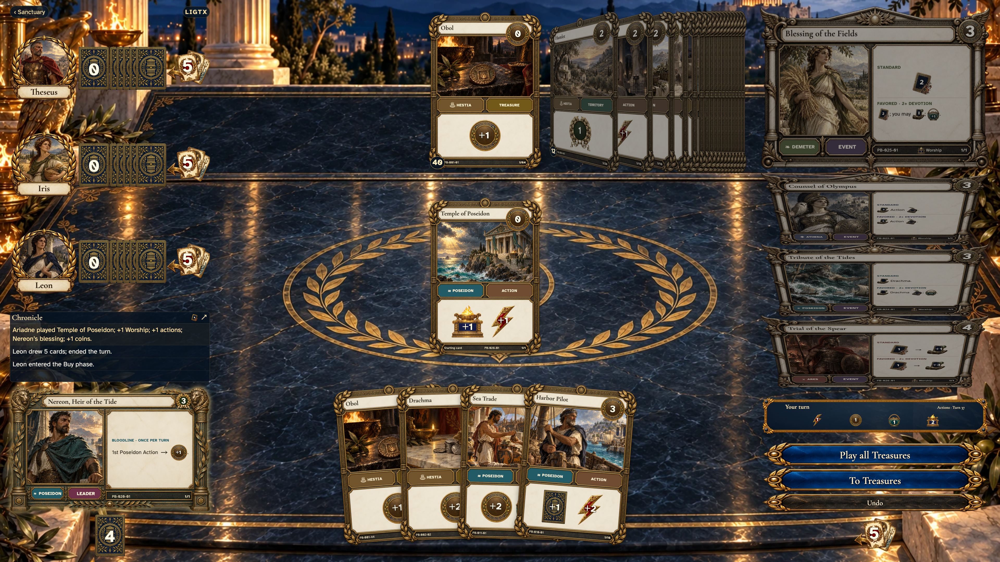</a>

- [x] Temple contributes to Poseidon

## Harbor Pilot contributes to Poseidon

<table>
<tr><th>Desktop · 1440 × 1000</th><th>Phone · 393 × 852</th></tr>
<tr>
<td valign="top"><a href="../../screenshots/four-shared-gods-and-three-devotion-remain-readable-in-the-vertical-coverflow/002-harbor-pilot-desktop-darwin.png">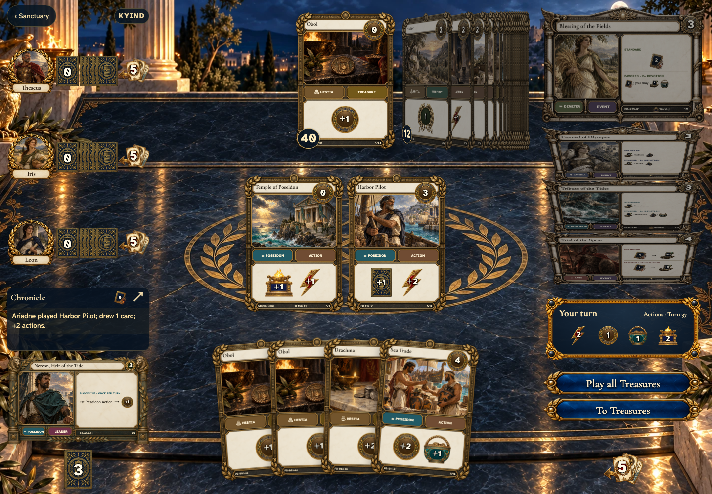</a></td>
<td valign="top"><a href="../../screenshots/four-shared-gods-and-three-devotion-remain-readable-in-the-vertical-coverflow/002-harbor-pilot-phone-darwin.png">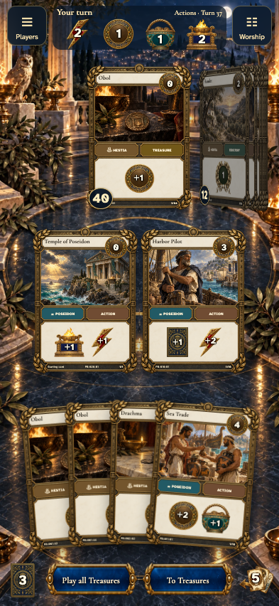</a></td>
</tr>
</table>

Tabletop · 3840 × 2160 — expand screenshot

<a href="../../screenshots/four-shared-gods-and-three-devotion-remain-readable-in-the-vertical-coverflow/002-harbor-pilot-tabletop-4k-darwin.png">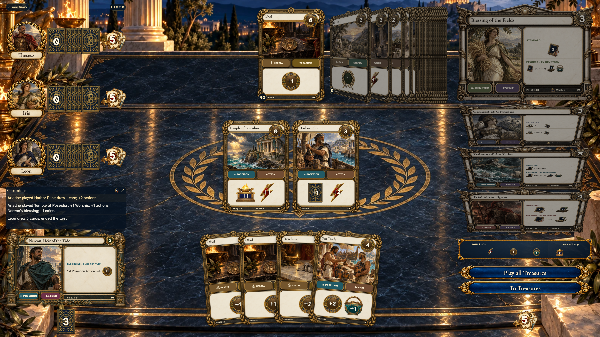</a>

- [x] Harbor Pilot contributes to Poseidon

## Sea Trade contributes to Poseidon

<table>
<tr><th>Desktop · 1440 × 1000</th><th>Phone · 393 × 852</th></tr>
<tr>
<td valign="top"><a href="../../screenshots/four-shared-gods-and-three-devotion-remain-readable-in-the-vertical-coverflow/003-sea-trade-desktop-darwin.png">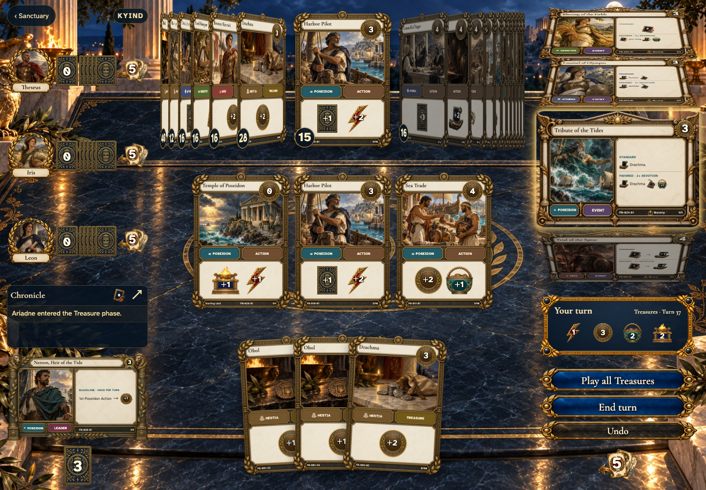</a></td>
<td valign="top"><a href="../../screenshots/four-shared-gods-and-three-devotion-remain-readable-in-the-vertical-coverflow/003-sea-trade-phone-darwin.png">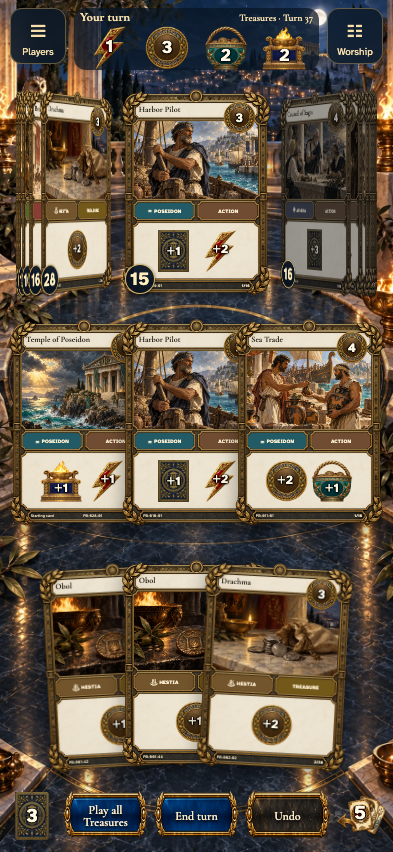</a></td>
</tr>
</table>

Tabletop · 3840 × 2160 — expand screenshot

<a href="../../screenshots/four-shared-gods-and-three-devotion-remain-readable-in-the-vertical-coverflow/003-sea-trade-tabletop-4k-darwin.png">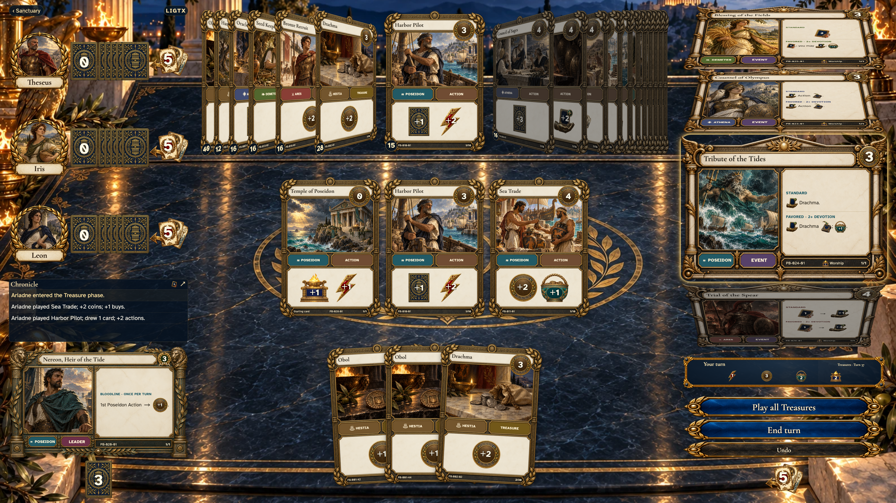</a>

- [x] Sea Trade contributes to Poseidon

## Three played Actions give Poseidon three Devotion

<table>
<tr><th>Desktop · 1440 × 1000</th><th>Phone · 393 × 852</th></tr>
<tr>
<td valign="top"><a href="../../screenshots/four-shared-gods-and-three-devotion-remain-readable-in-the-vertical-coverflow/004-three-devotion-desktop-darwin.png">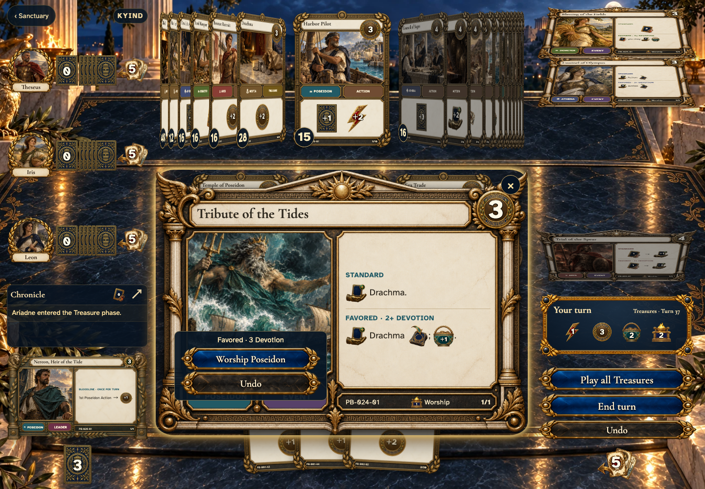</a></td>
<td valign="top"><a href="../../screenshots/four-shared-gods-and-three-devotion-remain-readable-in-the-vertical-coverflow/004-three-devotion-phone-darwin.png">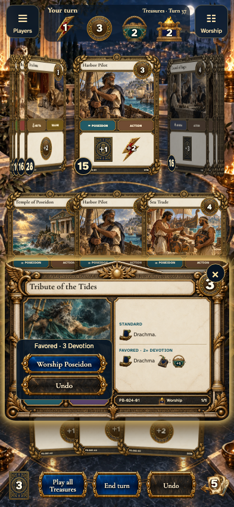</a></td>
</tr>
</table>

Tabletop · 3840 × 2160 — expand screenshot

<a href="../../screenshots/four-shared-gods-and-three-devotion-remain-readable-in-the-vertical-coverflow/004-three-devotion-tabletop-4k-darwin.png">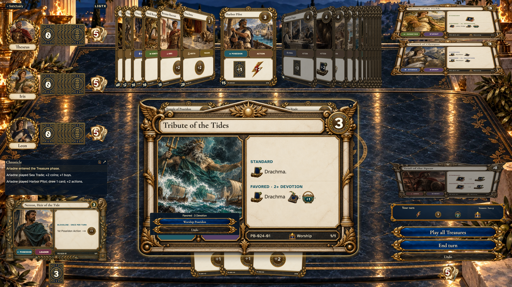</a>

- [x] Three played Actions give Poseidon three Devotion

## The worship card returns to the shared stack

<table>
<tr><th>Desktop · 1440 × 1000</th><th>Phone · 393 × 852</th></tr>
<tr>
<td valign="top"></td>
<td valign="top"></td>
</tr>
</table>

Tabletop · 3840 × 2160 — expand screenshot

- [x] The worship card returns to the shared stack

## Another shared god offers its Standard effect with zero Devotion

<table>
<tr><th>Desktop · 1440 × 1000</th><th>Phone · 393 × 852</th></tr>
<tr>
<td valign="top"><a href="../../screenshots/four-shared-gods-and-three-devotion-remain-readable-in-the-vertical-coverflow/006-another-god-desktop-darwin.png">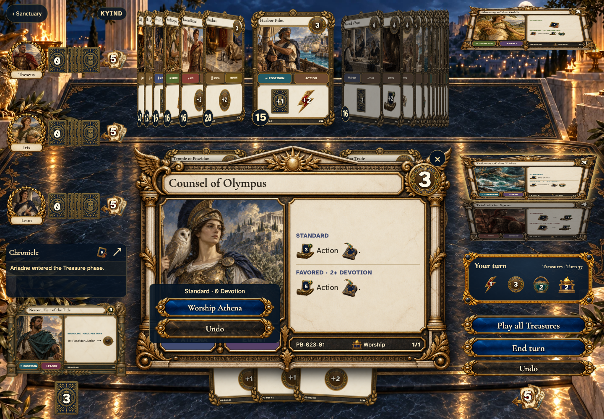</a></td>
<td valign="top"><a href="../../screenshots/four-shared-gods-and-three-devotion-remain-readable-in-the-vertical-coverflow/006-another-god-phone-darwin.png">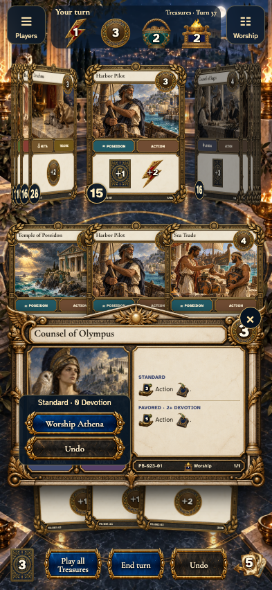</a></td>
</tr>
</table>

Tabletop · 3840 × 2160 — expand screenshot

<a href="../../screenshots/four-shared-gods-and-three-devotion-remain-readable-in-the-vertical-coverflow/006-another-god-tabletop-4k-darwin.png">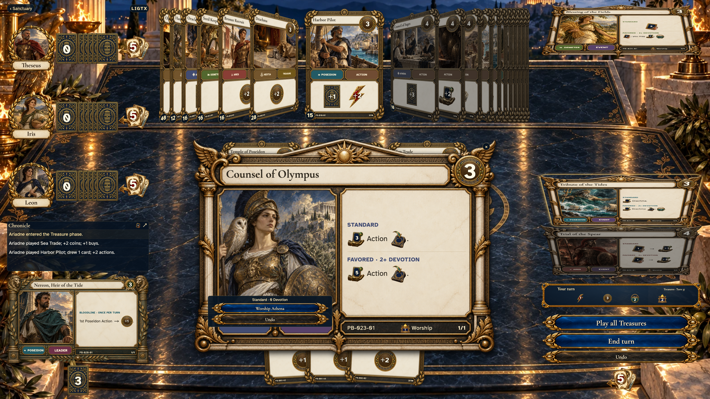</a>

- [x] Another shared god offers its Standard effect with zero Devotion
