# four shared gods and three Devotion remain readable with paged contributing cards

Recorded-history integration scenario. A legal event history prepares the starting position directly in the emulator. This verifies the illustrated effect from that position; it does not demonstrate the player journey to reach it.

## Four bloodlines share their gods

<table>
<tr><th>Desktop · 1440 × 1000</th><th>Phone · 393 × 852</th></tr>
<tr>
<td valign="top"><a href="../../screenshots/four-shared-gods-and-three-devotion-remain-readable-with-paged-contributing-cards/000-opening-desktop-darwin.png">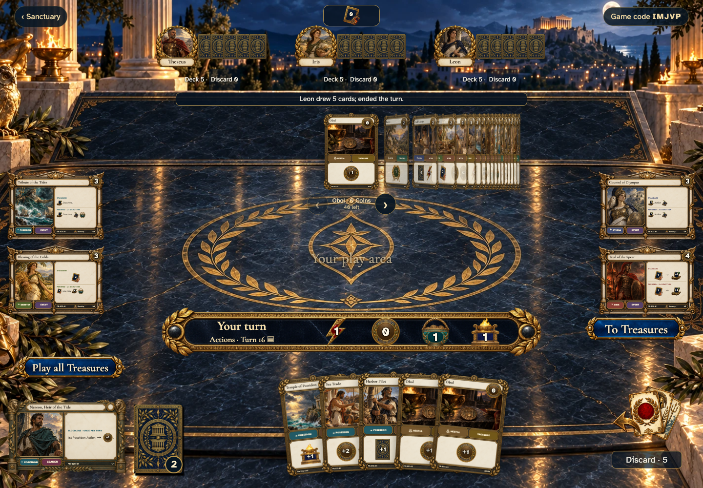</a></td>
<td valign="top"><a href="../../screenshots/four-shared-gods-and-three-devotion-remain-readable-with-paged-contributing-cards/000-opening-phone-darwin.png">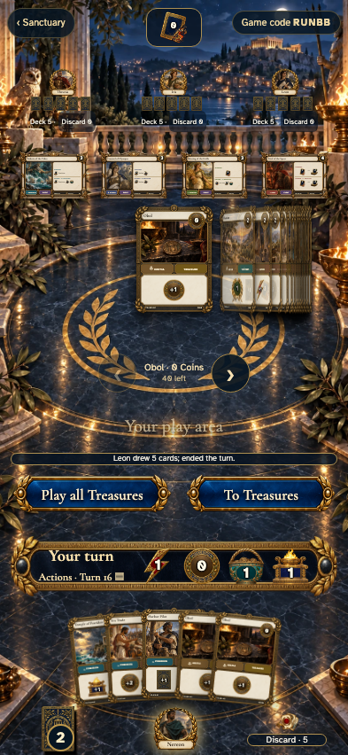</a></td>
</tr>
</table>

Tabletop · 3840 × 2160 — expand screenshot

<a href="../../screenshots/four-shared-gods-and-three-devotion-remain-readable-with-paged-contributing-cards/000-opening-tabletop-4k-darwin.png">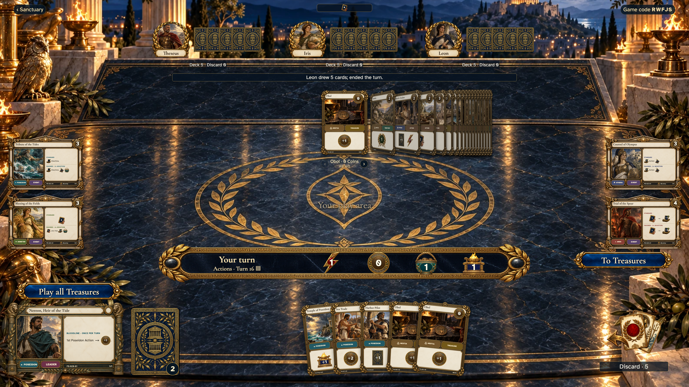</a>

- [x] Four bloodlines share their gods

## Temple contributes to Poseidon

<table>
<tr><th>Desktop · 1440 × 1000</th><th>Phone · 393 × 852</th></tr>
<tr>
<td valign="top"><a href="../../screenshots/four-shared-gods-and-three-devotion-remain-readable-with-paged-contributing-cards/001-temple-of-poseidon-desktop-darwin.png">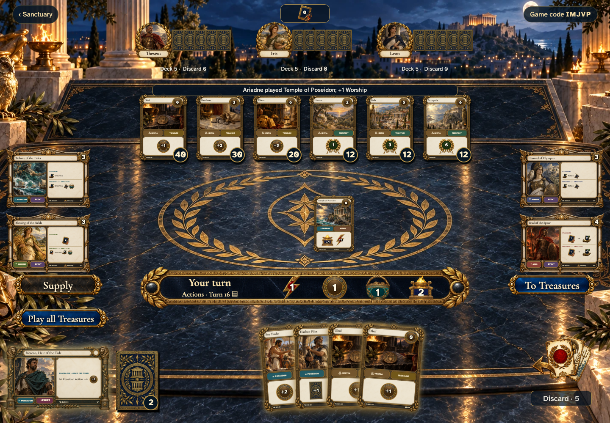</a></td>
<td valign="top"><a href="../../screenshots/four-shared-gods-and-three-devotion-remain-readable-with-paged-contributing-cards/001-temple-of-poseidon-phone-darwin.png">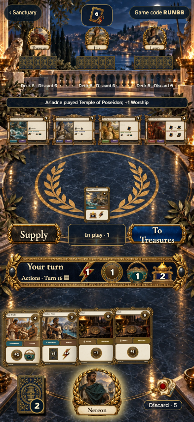</a></td>
</tr>
</table>

Tabletop · 3840 × 2160 — expand screenshot

<a href="../../screenshots/four-shared-gods-and-three-devotion-remain-readable-with-paged-contributing-cards/001-temple-of-poseidon-tabletop-4k-darwin.png">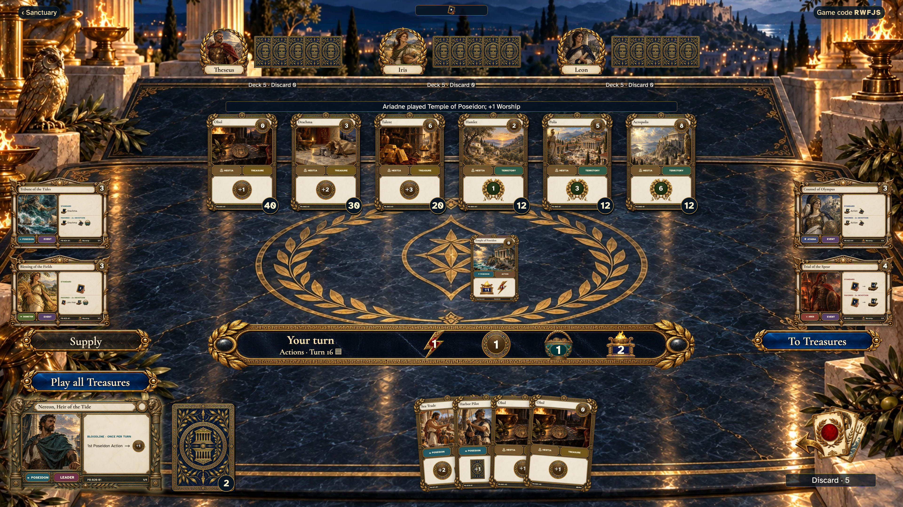</a>

- [x] Temple contributes to Poseidon

## Harbor Pilot contributes to Poseidon

<table>
<tr><th>Desktop · 1440 × 1000</th><th>Phone · 393 × 852</th></tr>
<tr>
<td valign="top"><a href="../../screenshots/four-shared-gods-and-three-devotion-remain-readable-with-paged-contributing-cards/002-harbor-pilot-desktop-darwin.png">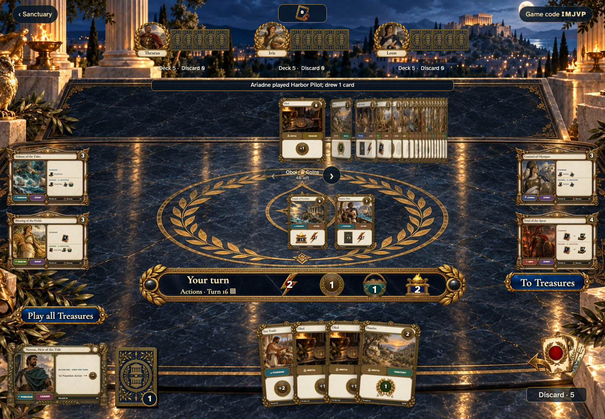</a></td>
<td valign="top"><a href="../../screenshots/four-shared-gods-and-three-devotion-remain-readable-with-paged-contributing-cards/002-harbor-pilot-phone-darwin.png">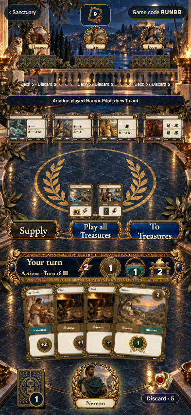</a></td>
</tr>
</table>

Tabletop · 3840 × 2160 — expand screenshot

<a href="../../screenshots/four-shared-gods-and-three-devotion-remain-readable-with-paged-contributing-cards/002-harbor-pilot-tabletop-4k-darwin.png">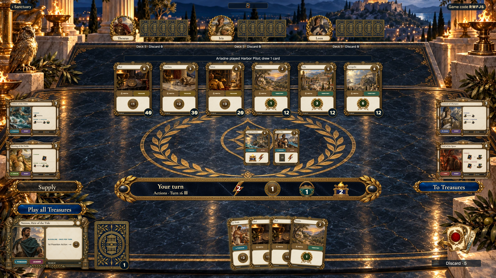</a>

- [x] Harbor Pilot contributes to Poseidon

## Sea Trade contributes to Poseidon

<table>
<tr><th>Desktop · 1440 × 1000</th><th>Phone · 393 × 852</th></tr>
<tr>
<td valign="top"><a href="../../screenshots/four-shared-gods-and-three-devotion-remain-readable-with-paged-contributing-cards/003-sea-trade-desktop-darwin.png">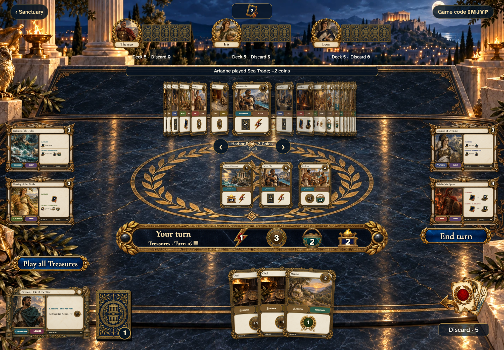</a></td>
<td valign="top"><a href="../../screenshots/four-shared-gods-and-three-devotion-remain-readable-with-paged-contributing-cards/003-sea-trade-phone-darwin.png">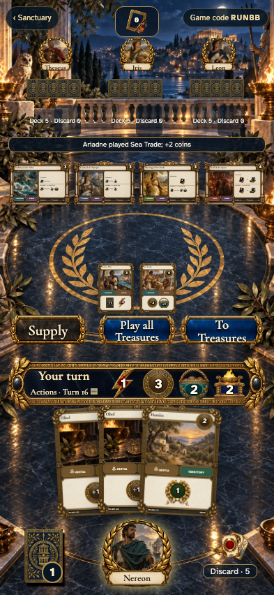</a></td>
</tr>
</table>

Tabletop · 3840 × 2160 — expand screenshot

<a href="../../screenshots/four-shared-gods-and-three-devotion-remain-readable-with-paged-contributing-cards/003-sea-trade-tabletop-4k-darwin.png">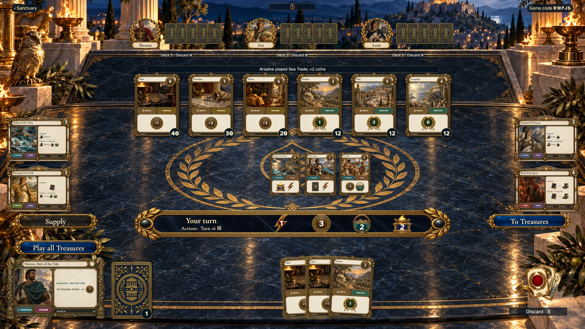</a>

- [x] Sea Trade contributes to Poseidon

## Three Actions give three Devotion, with two shown at a time

<table>
<tr><th>Desktop · 1440 × 1000</th><th>Phone · 393 × 852</th></tr>
<tr>
<td valign="top"><a href="../../screenshots/four-shared-gods-and-three-devotion-remain-readable-with-paged-contributing-cards/004-three-devotion-desktop-darwin.png">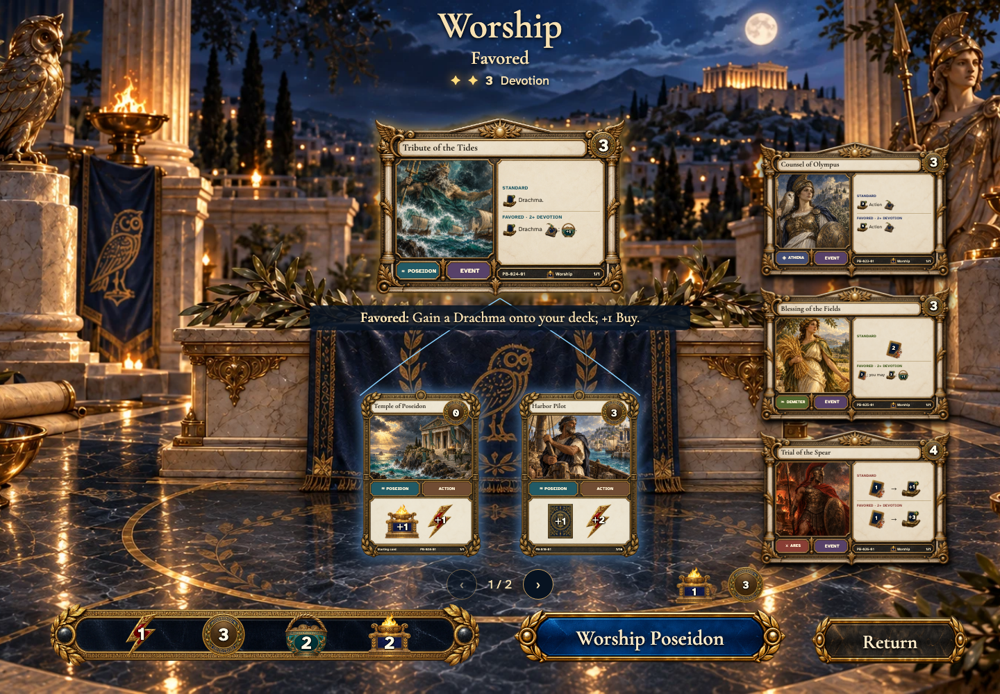</a></td>
<td valign="top"></td>
</tr>
</table>

Tabletop · 3840 × 2160 — expand screenshot

- [x] Three Actions give three Devotion, with two shown at a time

## The last contributing Action remains inspectable

<table>
<tr><th>Desktop · 1440 × 1000</th><th>Phone · 393 × 852</th></tr>
<tr>
<td valign="top"><a href="../../screenshots/four-shared-gods-and-three-devotion-remain-readable-with-paged-contributing-cards/005-last-contributor-desktop-darwin.png">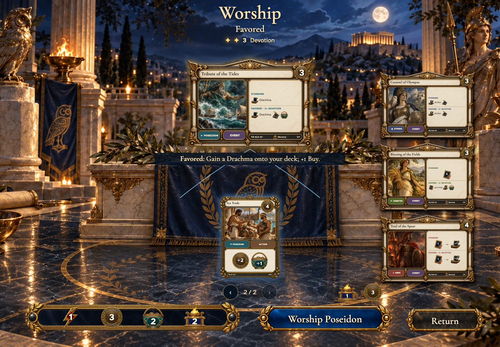</a></td>
<td valign="top"><a href="../../screenshots/four-shared-gods-and-three-devotion-remain-readable-with-paged-contributing-cards/005-last-contributor-phone-darwin.png">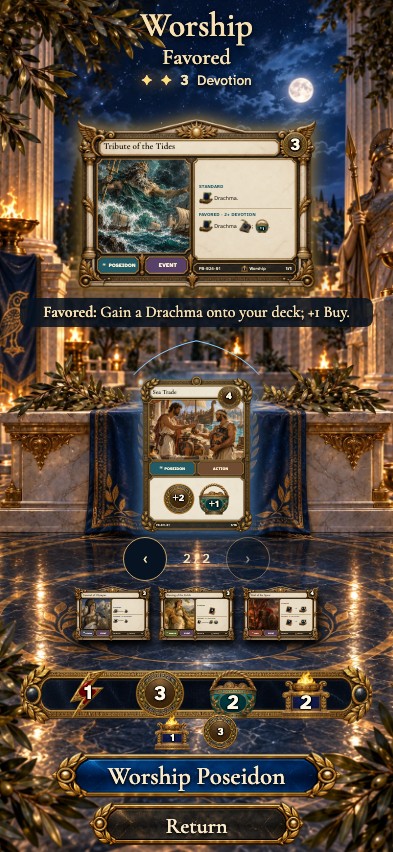</a></td>
</tr>
</table>

Tabletop · 3840 × 2160 — expand screenshot

<a href="../../screenshots/four-shared-gods-and-three-devotion-remain-readable-with-paged-contributing-cards/005-last-contributor-tabletop-4k-darwin.png">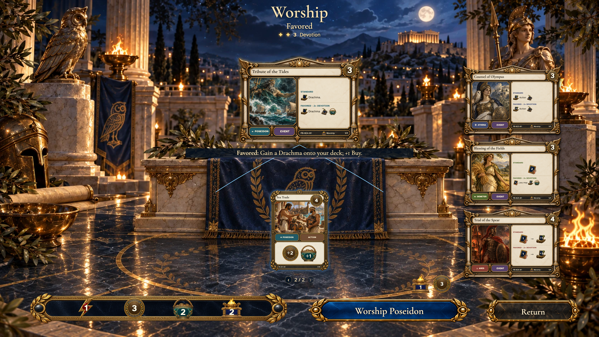</a>

- [x] The last contributing Action remains inspectable

## Return to the first pair without changing Devotion

<table>
<tr><th>Desktop · 1440 × 1000</th><th>Phone · 393 × 852</th></tr>
<tr>
<td valign="top"></td>
<td valign="top"><a href="../../screenshots/four-shared-gods-and-three-devotion-remain-readable-with-paged-contributing-cards/006-first-contributors-phone-darwin.png">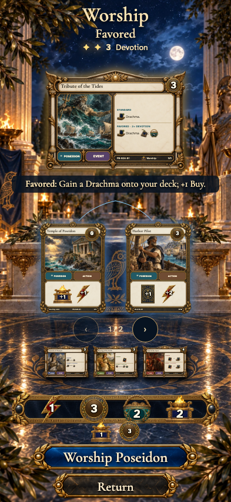</a></td>
</tr>
</table>

Tabletop · 3840 × 2160 — expand screenshot

<a href="../../screenshots/four-shared-gods-and-three-devotion-remain-readable-with-paged-contributing-cards/006-first-contributors-tabletop-4k-darwin.png">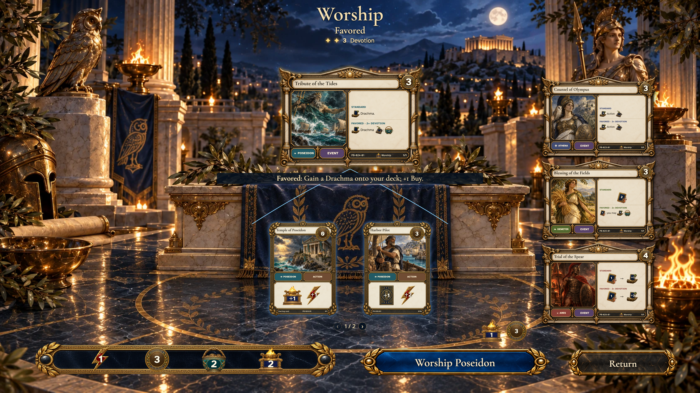</a>

- [x] Return to the first pair without changing Devotion

## Choosing another shared god recalculates Devotion without paying

<table>
<tr><th>Desktop · 1440 × 1000</th><th>Phone · 393 × 852</th></tr>
<tr>
<td valign="top"><a href="../../screenshots/four-shared-gods-and-three-devotion-remain-readable-with-paged-contributing-cards/007-another-god-desktop-darwin.png">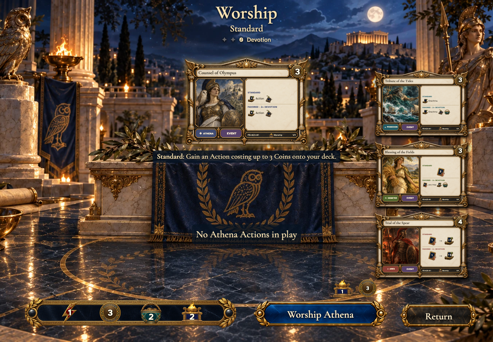</a></td>
<td valign="top"><a href="../../screenshots/four-shared-gods-and-three-devotion-remain-readable-with-paged-contributing-cards/007-another-god-phone-darwin.png">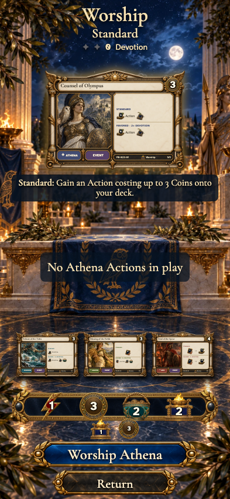</a></td>
</tr>
</table>

Tabletop · 3840 × 2160 — expand screenshot

<a href="../../screenshots/four-shared-gods-and-three-devotion-remain-readable-with-paged-contributing-cards/007-another-god-tabletop-4k-darwin.png">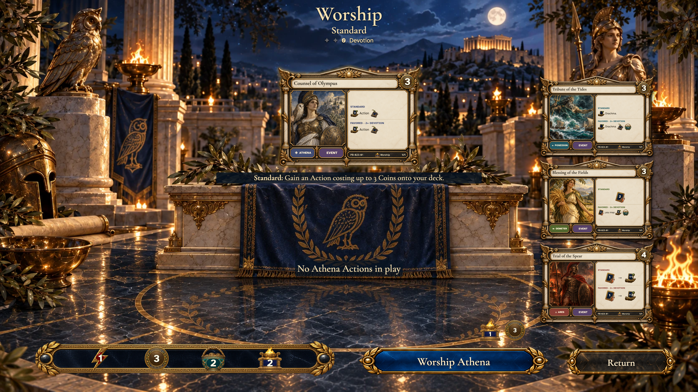</a>

- [x] Choosing another shared god recalculates Devotion without paying
