# Poseidon can be worshipped in Actions and again after a purchase without spending a Buy

Recorded-history integration scenario. A legal event history prepares the starting position directly in the emulator. This verifies the illustrated effect from that position; it does not demonstrate the player journey to reach it.

## Ariadne holds her Temple, Sea Trade, and enough wealth for later

<table>
<tr><th>Desktop · 1440 × 1000</th><th>Phone · 393 × 852</th></tr>
<tr>
<td valign="top"><a href="../../screenshots/poseidon-can-be-worshipped-in-actions-and-again-after-a-purchase-without-spending-a-buy/000-opening-desktop-darwin.png">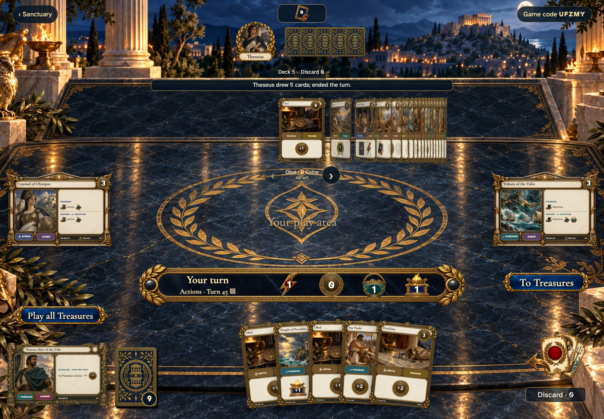</a></td>
<td valign="top"><a href="../../screenshots/poseidon-can-be-worshipped-in-actions-and-again-after-a-purchase-without-spending-a-buy/000-opening-phone-darwin.png">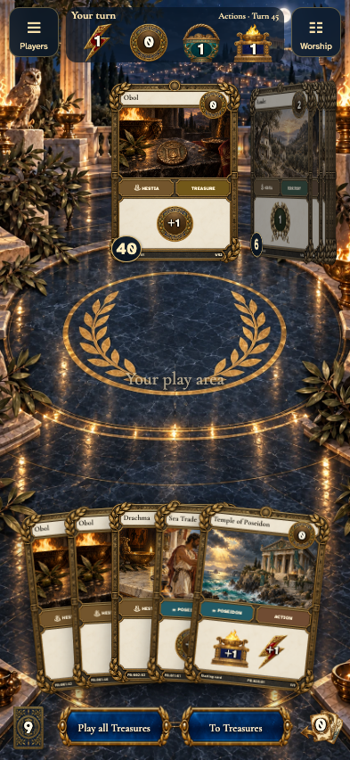</a></td>
</tr>
</table>

Tabletop · 3840 × 2160 — expand screenshot

<a href="../../screenshots/poseidon-can-be-worshipped-in-actions-and-again-after-a-purchase-without-spending-a-buy/000-opening-tabletop-4k-darwin.png">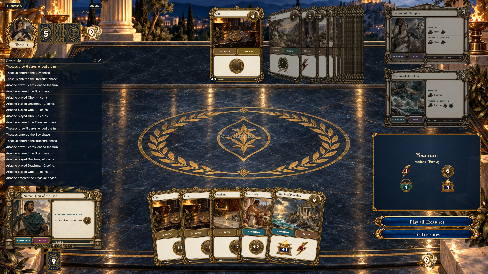</a>

- [x] Ariadne holds her Temple, Sea Trade, and enough wealth for later

## Nereon’s Temple adds Worship and a Coin

<table>
<tr><th>Desktop · 1440 × 1000</th><th>Phone · 393 × 852</th></tr>
<tr>
<td valign="top"><a href="../../screenshots/poseidon-can-be-worshipped-in-actions-and-again-after-a-purchase-without-spending-a-buy/001-temple-desktop-darwin.png">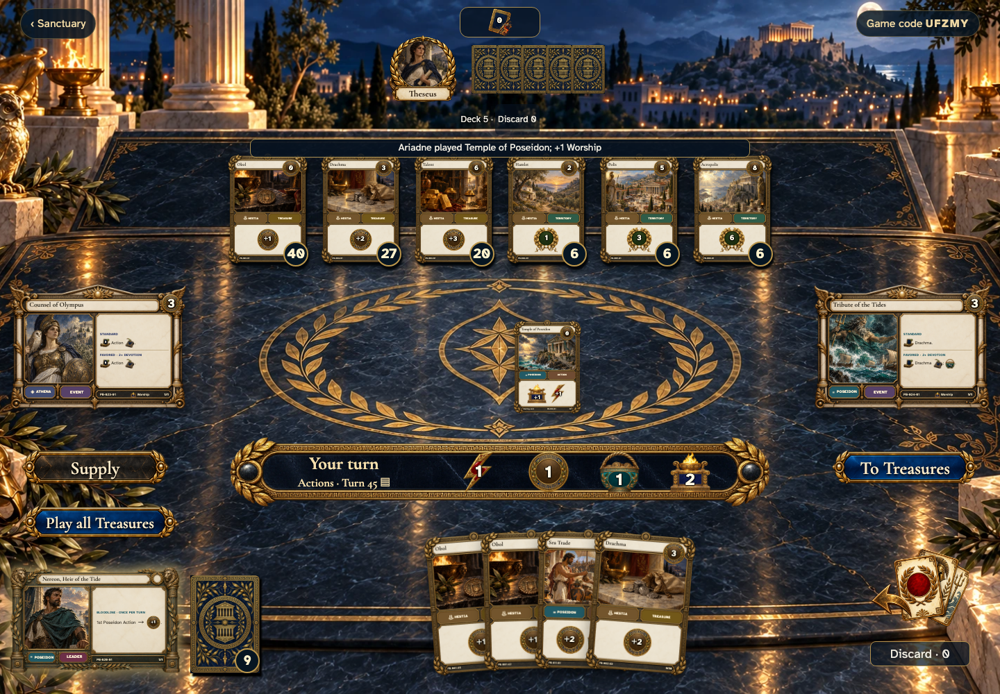</a></td>
<td valign="top"><a href="../../screenshots/poseidon-can-be-worshipped-in-actions-and-again-after-a-purchase-without-spending-a-buy/001-temple-phone-darwin.png">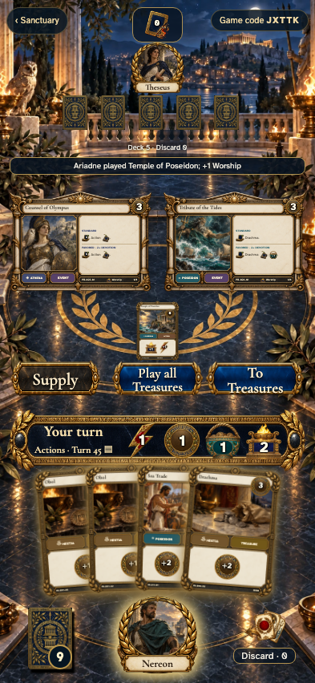</a></td>
</tr>
</table>

Tabletop · 3840 × 2160 — expand screenshot

<a href="../../screenshots/poseidon-can-be-worshipped-in-actions-and-again-after-a-purchase-without-spending-a-buy/001-temple-tabletop-4k-darwin.png">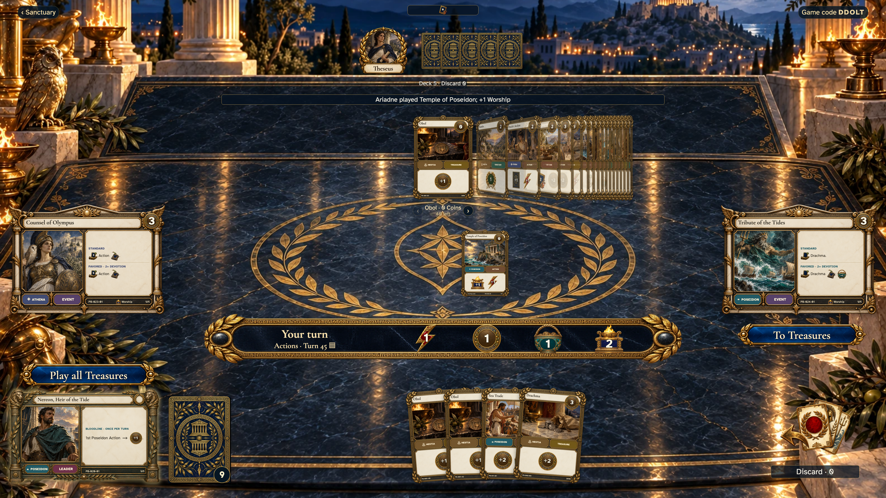</a>

- [x] Nereon’s Temple adds Worship and a Coin

## Sea Trade provides the third Coin before leaving Actions

<table>
<tr><th>Desktop · 1440 × 1000</th><th>Phone · 393 × 852</th></tr>
<tr>
<td valign="top"><a href="../../screenshots/poseidon-can-be-worshipped-in-actions-and-again-after-a-purchase-without-spending-a-buy/002-sea-trade-desktop-darwin.png">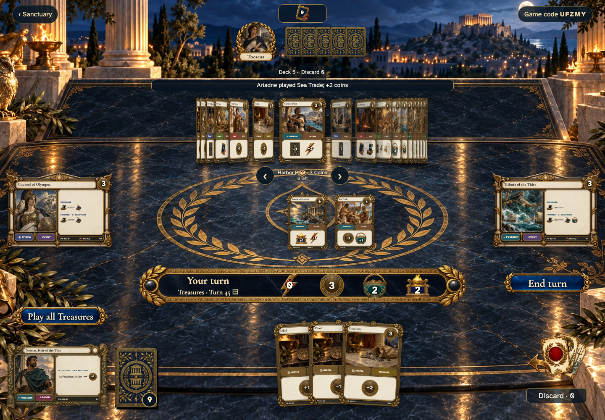</a></td>
<td valign="top"><a href="../../screenshots/poseidon-can-be-worshipped-in-actions-and-again-after-a-purchase-without-spending-a-buy/002-sea-trade-phone-darwin.png">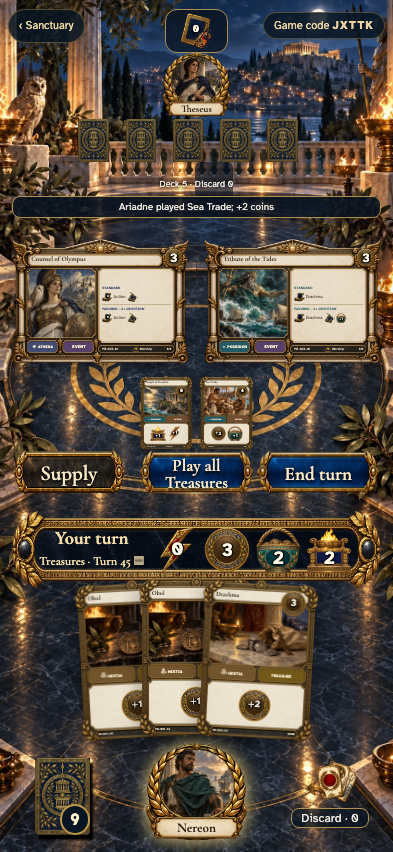</a></td>
</tr>
</table>

Tabletop · 3840 × 2160 — expand screenshot

<a href="../../screenshots/poseidon-can-be-worshipped-in-actions-and-again-after-a-purchase-without-spending-a-buy/002-sea-trade-tabletop-4k-darwin.png">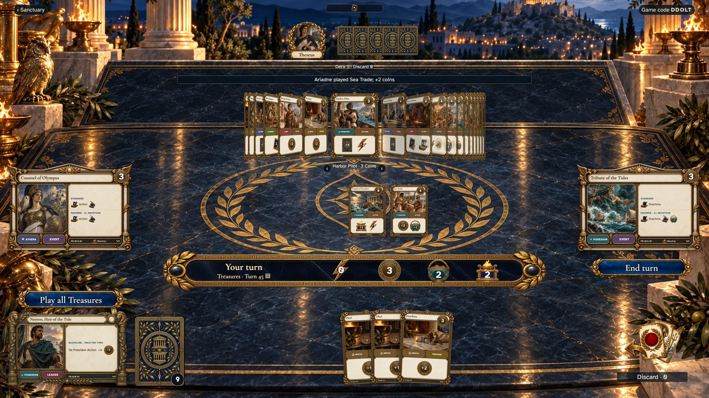</a>

- [x] Sea Trade provides the third Coin before leaving Actions

## Poseidon’s two contributing Actions unlock his Favored effect

<table>
<tr><th>Desktop · 1440 × 1000</th><th>Phone · 393 × 852</th></tr>
<tr>
<td valign="top"><a href="../../screenshots/poseidon-can-be-worshipped-in-actions-and-again-after-a-purchase-without-spending-a-buy/003-favored-desktop-darwin.png">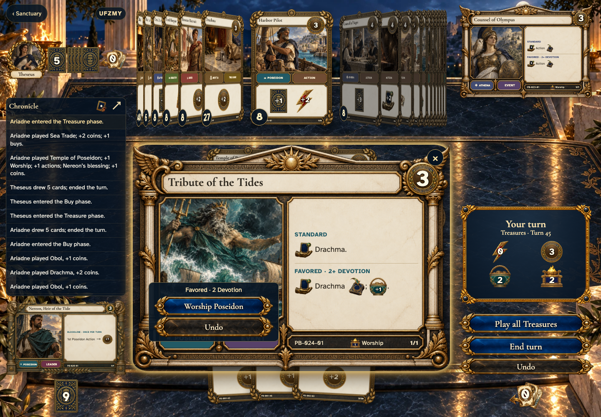</a></td>
<td valign="top"></td>
</tr>
</table>

Tabletop · 3840 × 2160 — expand screenshot

<a href="../../screenshots/poseidon-can-be-worshipped-in-actions-and-again-after-a-purchase-without-spending-a-buy/003-favored-tabletop-4k-darwin.png">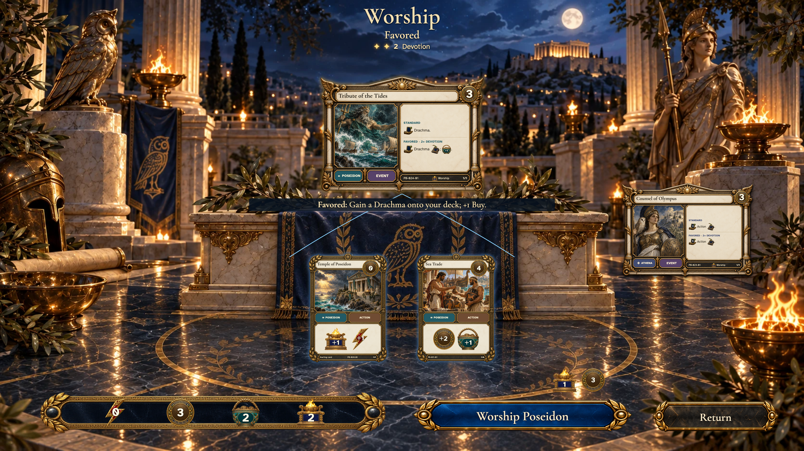</a>

- [x] Poseidon’s two contributing Actions unlock his Favored effect

## A Drachma goes onto the deck and an extra Buy is granted

<table>
<tr><th>Desktop · 1440 × 1000</th><th>Phone · 393 × 852</th></tr>
<tr>
<td valign="top"><a href="../../screenshots/poseidon-can-be-worshipped-in-actions-and-again-after-a-purchase-without-spending-a-buy/004-first-worship-desktop-darwin.png">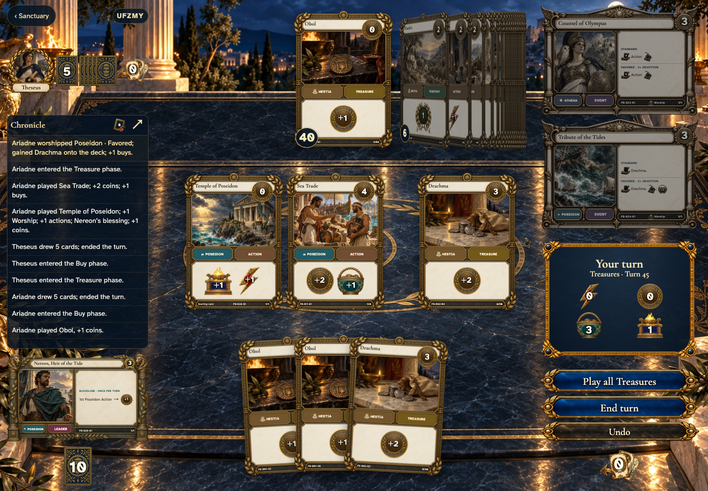</a></td>
<td valign="top"><a href="../../screenshots/poseidon-can-be-worshipped-in-actions-and-again-after-a-purchase-without-spending-a-buy/004-first-worship-phone-darwin.png">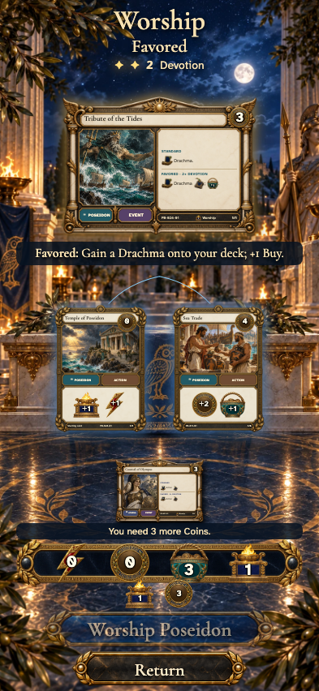</a></td>
</tr>
</table>

Tabletop · 3840 × 2160 — expand screenshot

- [x] A Drachma goes onto the deck and an extra Buy is granted

## Theseus sees the public Drachma and topdeck destination

Viewpoint: **Theseus**.

<table>
<tr><th>Desktop · 1440 × 1000</th><th>Phone · 393 × 852</th></tr>
<tr>
<td valign="top"><a href="../../screenshots/poseidon-can-be-worshipped-in-actions-and-again-after-a-purchase-without-spending-a-buy/005-observer-desktop-darwin.png">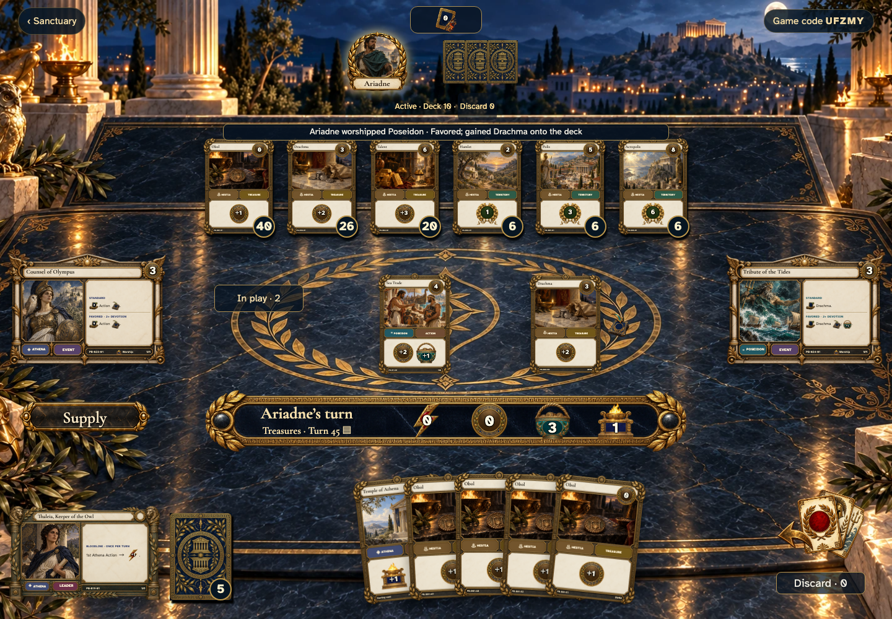</a></td>
<td valign="top"><a href="../../screenshots/poseidon-can-be-worshipped-in-actions-and-again-after-a-purchase-without-spending-a-buy/005-observer-phone-darwin.png">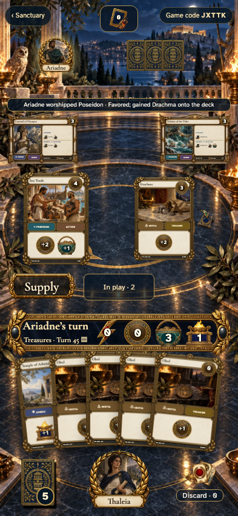</a></td>
</tr>
</table>

Tabletop · 3840 × 2160 — expand screenshot

<a href="../../screenshots/poseidon-can-be-worshipped-in-actions-and-again-after-a-purchase-without-spending-a-buy/005-observer-tabletop-4k-darwin.png">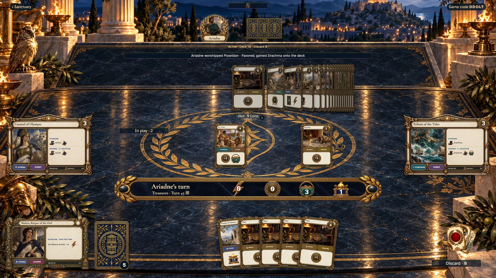</a>

- [x] The gained face is public while the remaining hand stays hidden.

## Worship leaves the Action phase open

<table>
<tr><th>Desktop · 1440 × 1000</th><th>Phone · 393 × 852</th></tr>
<tr>
<td valign="top"><a href="../../screenshots/poseidon-can-be-worshipped-in-actions-and-again-after-a-purchase-without-spending-a-buy/006-same-phase-desktop-darwin.png">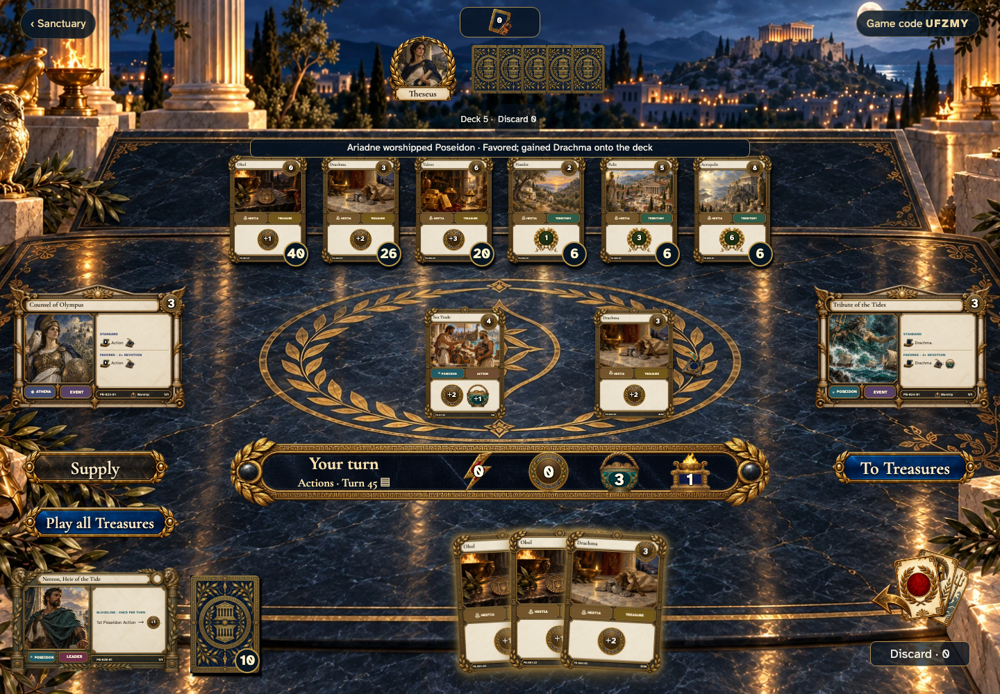</a></td>
<td valign="top"><a href="../../screenshots/poseidon-can-be-worshipped-in-actions-and-again-after-a-purchase-without-spending-a-buy/006-same-phase-phone-darwin.png">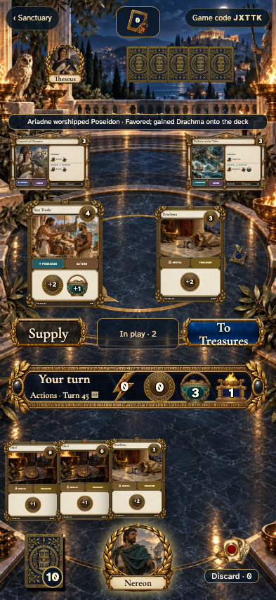</a></td>
</tr>
</table>

Tabletop · 3840 × 2160 — expand screenshot

<a href="../../screenshots/poseidon-can-be-worshipped-in-actions-and-again-after-a-purchase-without-spending-a-buy/006-same-phase-tabletop-4k-darwin.png">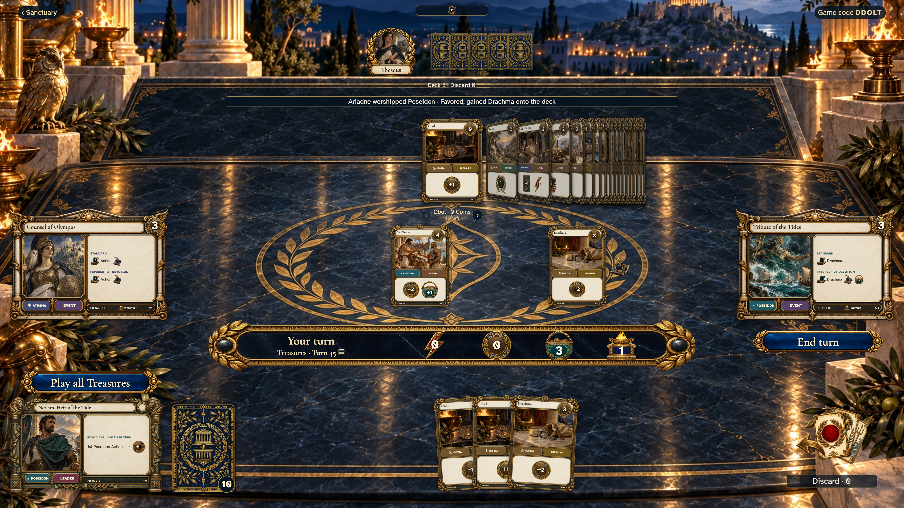</a>

- [x] Worship leaves the Action phase open

## Ariadne plays the Treasures she kept

<table>
<tr><th>Desktop · 1440 × 1000</th><th>Phone · 393 × 852</th></tr>
<tr>
<td valign="top"><a href="../../screenshots/poseidon-can-be-worshipped-in-actions-and-again-after-a-purchase-without-spending-a-buy/007-treasures-desktop-darwin.png">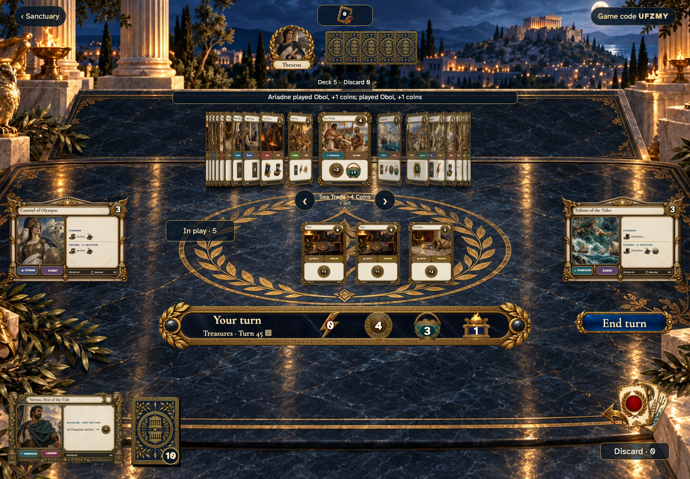</a></td>
<td valign="top"><a href="../../screenshots/poseidon-can-be-worshipped-in-actions-and-again-after-a-purchase-without-spending-a-buy/007-treasures-phone-darwin.png">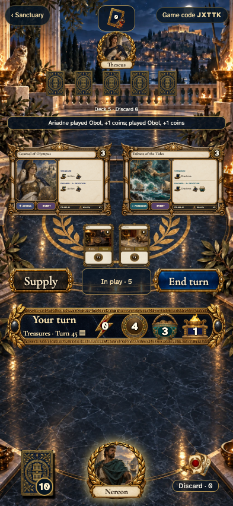</a></td>
</tr>
</table>

Tabletop · 3840 × 2160 — expand screenshot

<a href="../../screenshots/poseidon-can-be-worshipped-in-actions-and-again-after-a-purchase-without-spending-a-buy/007-treasures-tabletop-4k-darwin.png">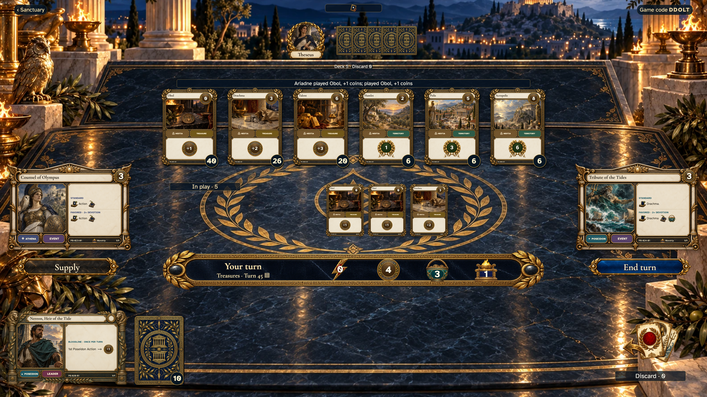</a>

- [x] Ariadne plays the Treasures she kept

## Obol is available for a zero-Coin purchase

<table>
<tr><th>Desktop · 1440 × 1000</th><th>Phone · 393 × 852</th></tr>
<tr>
<td valign="top"><a href="../../screenshots/poseidon-can-be-worshipped-in-actions-and-again-after-a-purchase-without-spending-a-buy/008-supply-desktop-darwin.png">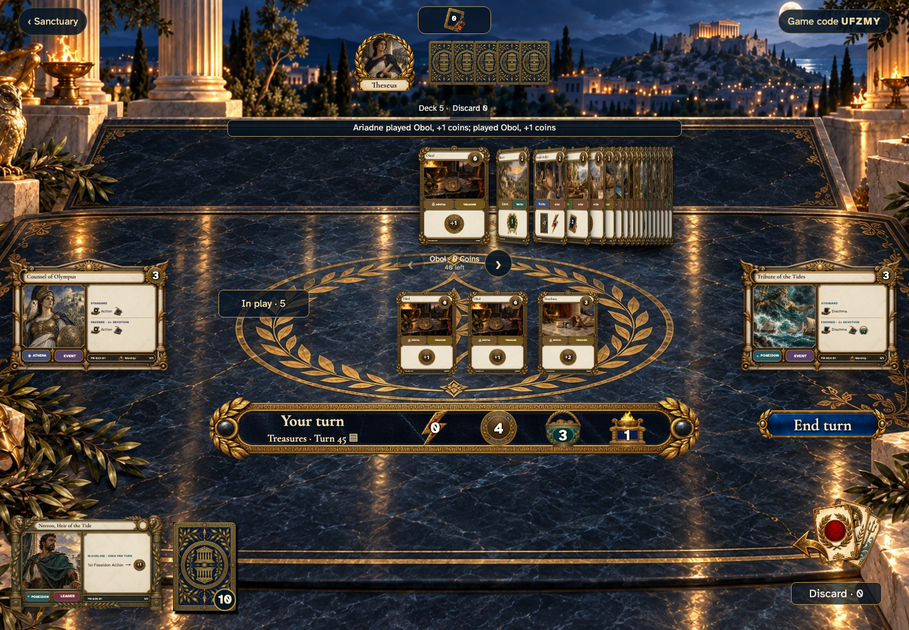</a></td>
<td valign="top"><a href="../../screenshots/poseidon-can-be-worshipped-in-actions-and-again-after-a-purchase-without-spending-a-buy/008-supply-phone-darwin.png">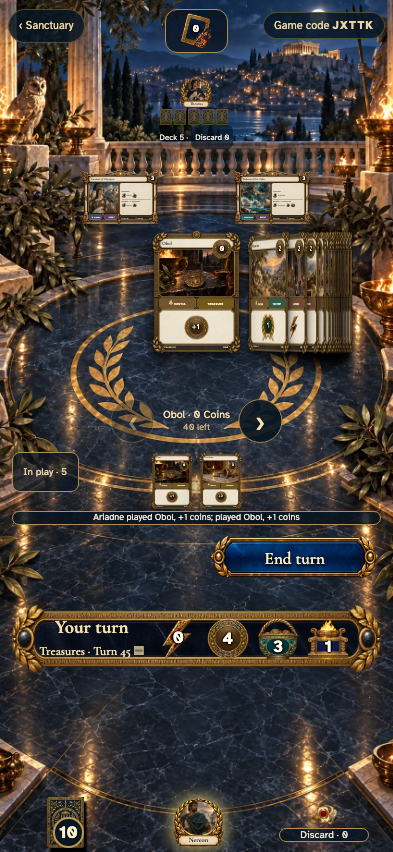</a></td>
</tr>
</table>

Tabletop · 3840 × 2160 — expand screenshot

<a href="../../screenshots/poseidon-can-be-worshipped-in-actions-and-again-after-a-purchase-without-spending-a-buy/008-supply-tabletop-4k-darwin.png">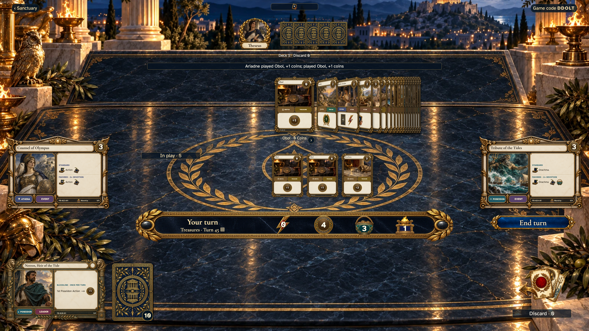</a>

- [x] Obol is available for a zero-Coin purchase

## Buying the Obol spends one Buy and starts Buys

<table>
<tr><th>Desktop · 1440 × 1000</th><th>Phone · 393 × 852</th></tr>
<tr>
<td valign="top"><a href="../../screenshots/poseidon-can-be-worshipped-in-actions-and-again-after-a-purchase-without-spending-a-buy/009-buy-desktop-darwin.png">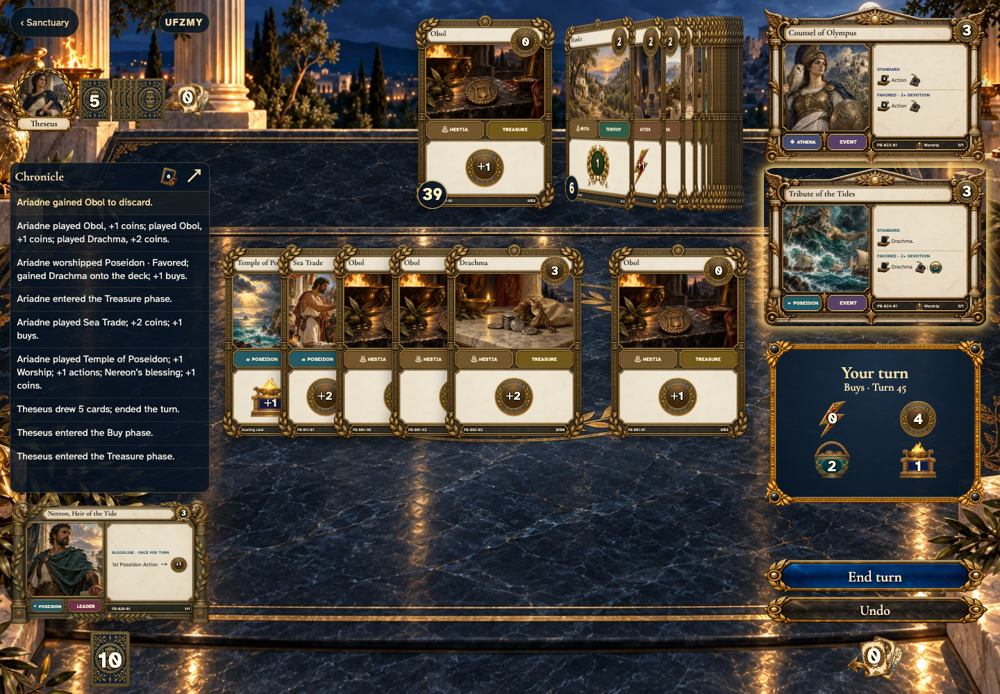</a></td>
<td valign="top"><a href="../../screenshots/poseidon-can-be-worshipped-in-actions-and-again-after-a-purchase-without-spending-a-buy/009-buy-phone-darwin.png">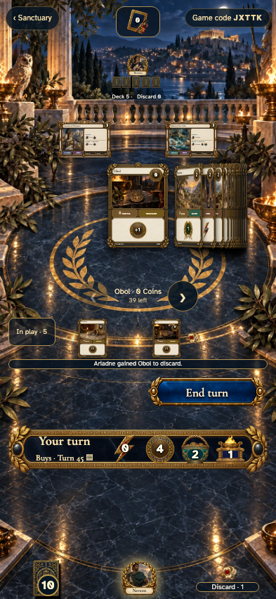</a></td>
</tr>
</table>

Tabletop · 3840 × 2160 — expand screenshot

<a href="../../screenshots/poseidon-can-be-worshipped-in-actions-and-again-after-a-purchase-without-spending-a-buy/009-buy-tabletop-4k-darwin.png">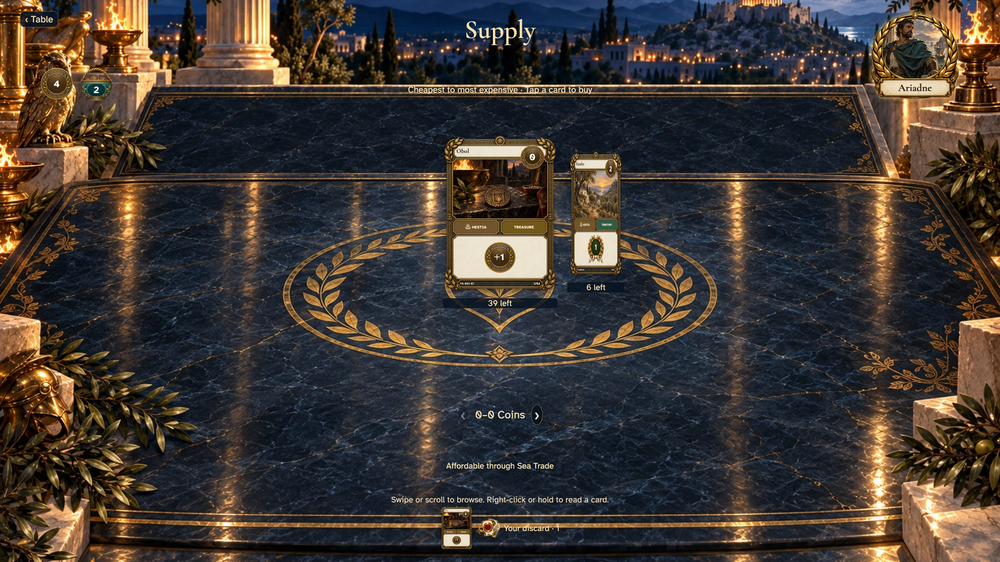</a>

- [x] Buying the Obol spends one Buy and starts Buys

## The same shared god can be worshipped again during Buys

<table>
<tr><th>Desktop · 1440 × 1000</th><th>Phone · 393 × 852</th></tr>
<tr>
<td valign="top"><a href="../../screenshots/poseidon-can-be-worshipped-in-actions-and-again-after-a-purchase-without-spending-a-buy/010-again-desktop-darwin.png">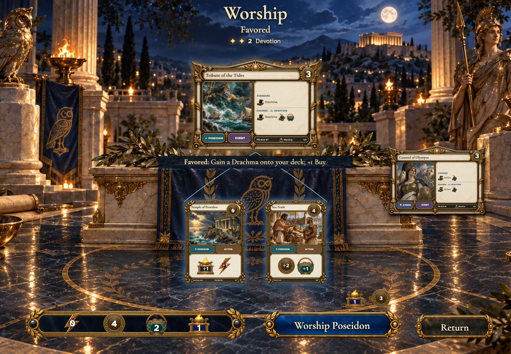</a></td>
<td valign="top"><a href="../../screenshots/poseidon-can-be-worshipped-in-actions-and-again-after-a-purchase-without-spending-a-buy/010-again-phone-darwin.png">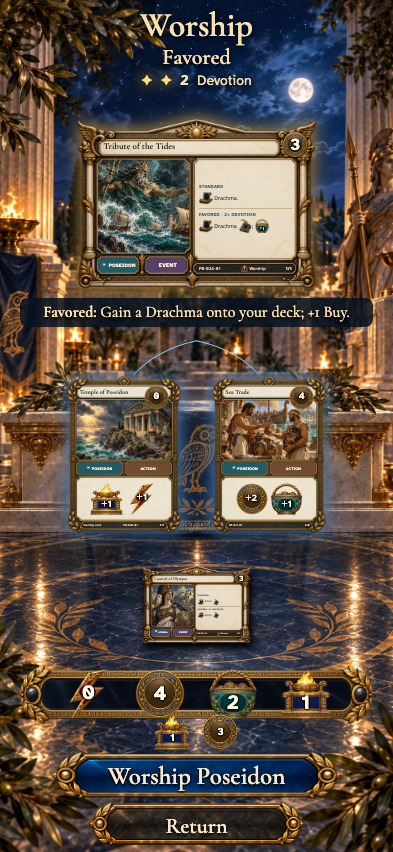</a></td>
</tr>
</table>

Tabletop · 3840 × 2160 — expand screenshot

<a href="../../screenshots/poseidon-can-be-worshipped-in-actions-and-again-after-a-purchase-without-spending-a-buy/010-again-tabletop-4k-darwin.png">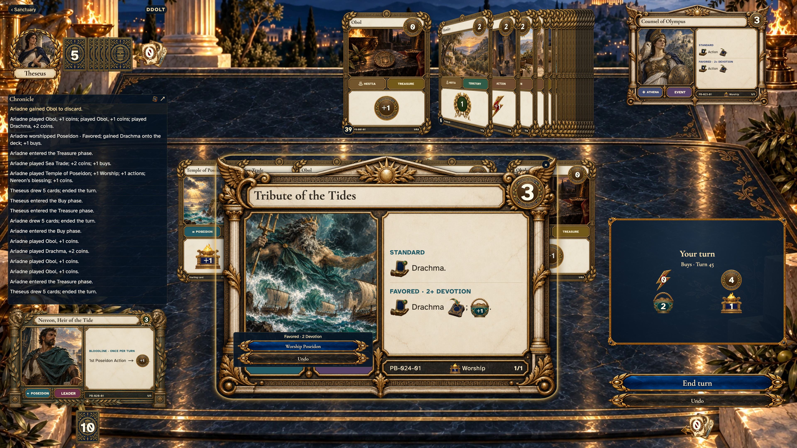</a>

- [x] The same shared god can be worshipped again during Buys

## The second Worship is paid once despite an interrupted acknowledgement

<table>
<tr><th>Desktop · 1440 × 1000</th><th>Phone · 393 × 852</th></tr>
<tr>
<td valign="top"><a href="../../screenshots/poseidon-can-be-worshipped-in-actions-and-again-after-a-purchase-without-spending-a-buy/011-second-worship-desktop-darwin.png">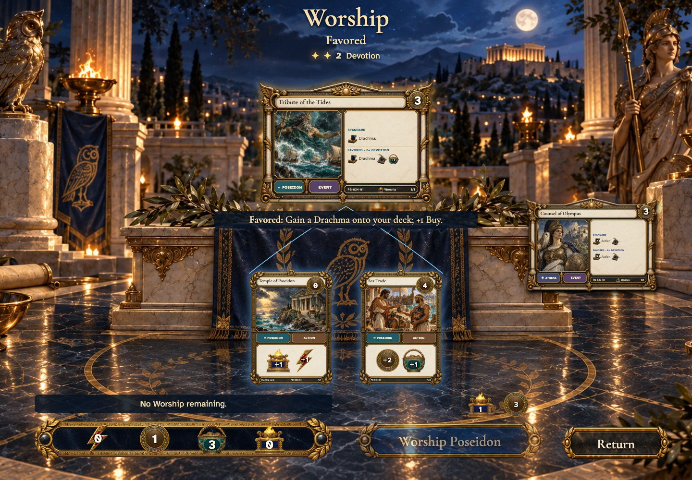</a></td>
<td valign="top"><a href="../../screenshots/poseidon-can-be-worshipped-in-actions-and-again-after-a-purchase-without-spending-a-buy/011-second-worship-phone-darwin.png">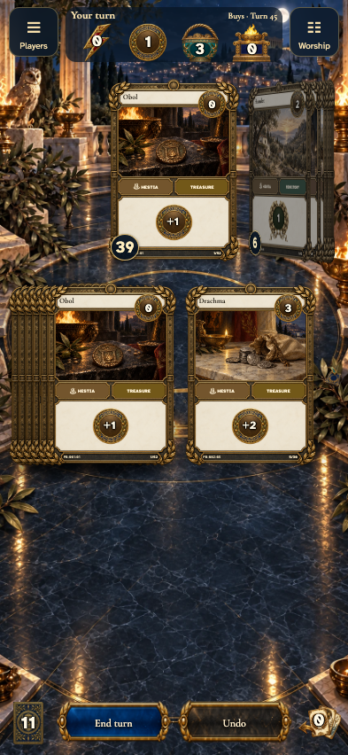</a></td>
</tr>
</table>

Tabletop · 3840 × 2160 — expand screenshot

<a href="../../screenshots/poseidon-can-be-worshipped-in-actions-and-again-after-a-purchase-without-spending-a-buy/011-second-worship-tabletop-4k-darwin.png">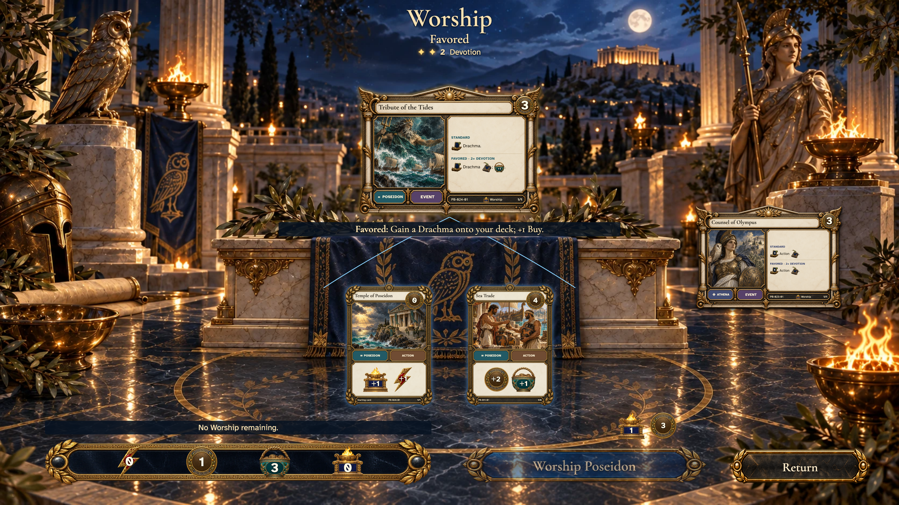</a>

- [x] The second Worship is paid once despite an interrupted acknowledgement

## Returning preserves both topdeck gains and the Buy phase

<table>
<tr><th>Desktop · 1440 × 1000</th><th>Phone · 393 × 852</th></tr>
<tr>
<td valign="top"><a href="../../screenshots/poseidon-can-be-worshipped-in-actions-and-again-after-a-purchase-without-spending-a-buy/012-restored-desktop-darwin.png">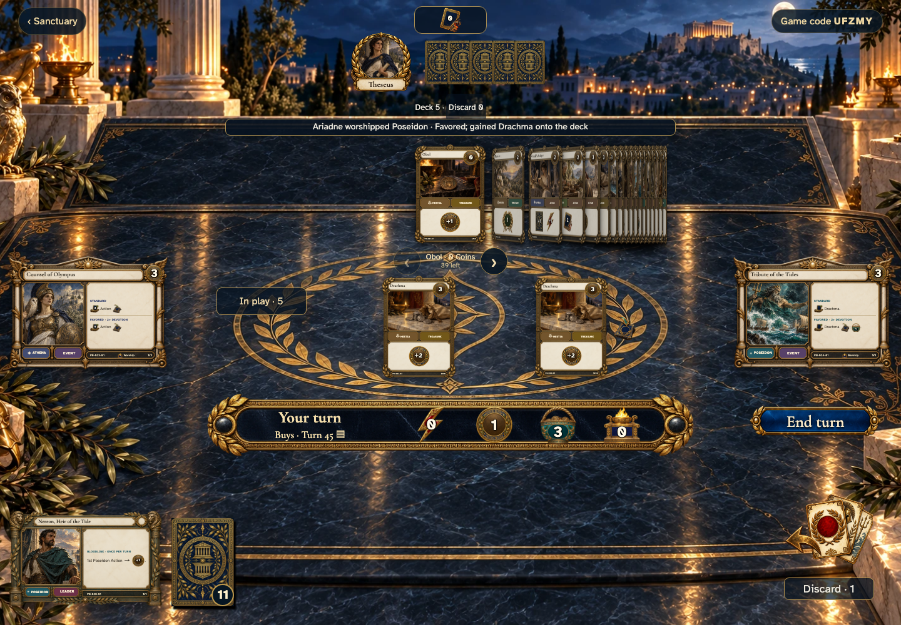</a></td>
<td valign="top"></td>
</tr>
</table>

Tabletop · 3840 × 2160 — expand screenshot

<a href="../../screenshots/poseidon-can-be-worshipped-in-actions-and-again-after-a-purchase-without-spending-a-buy/012-restored-tabletop-4k-darwin.png">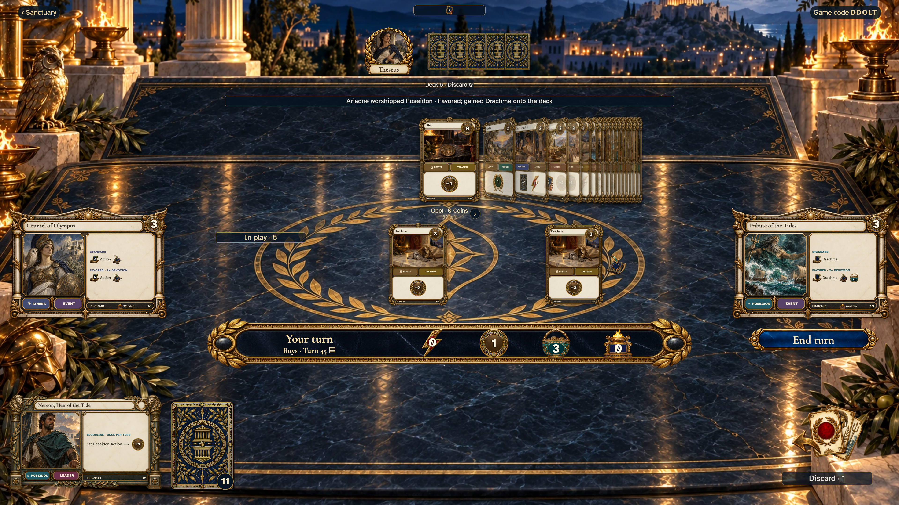</a>

- [x] Returning preserves both topdeck gains and the Buy phase
