# Poseidon keeps the payment and grants his Favored Buy when Drachmas are exhausted

Recorded-history integration scenario. A legal event history prepares the starting position directly in the emulator. This verifies the illustrated effect from that position; it does not demonstrate the player journey to reach it.

## The shared Drachma supply is exhausted

<table>
<tr><th>Desktop · 1440 × 1000</th><th>Phone · 393 × 852</th></tr>
<tr>
<td valign="top"><a href="../../screenshots/poseidon-keeps-the-payment-and-grants-his-favored-buy-when-drachmas-are-exhausted/000-opening-desktop-darwin.png">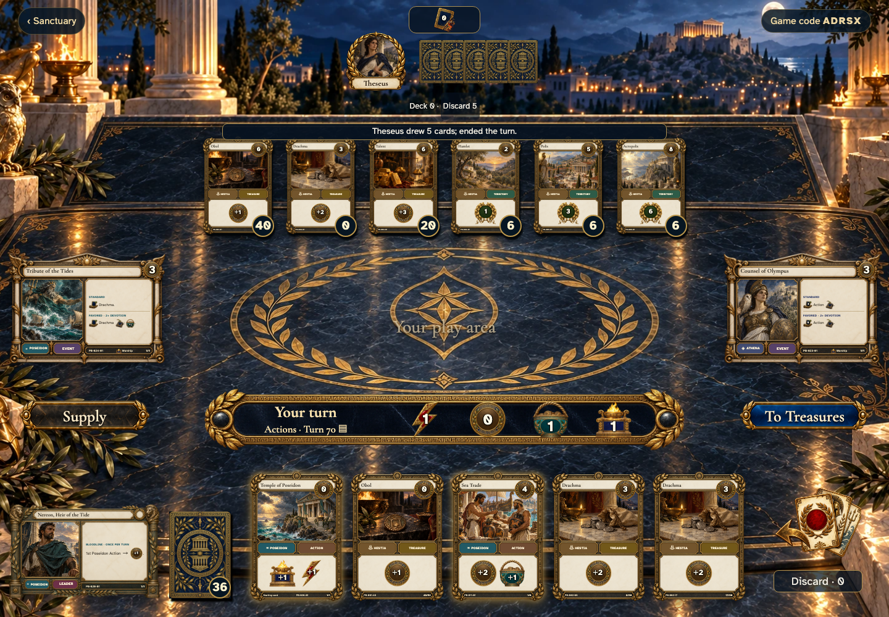</a></td>
<td valign="top"><a href="../../screenshots/poseidon-keeps-the-payment-and-grants-his-favored-buy-when-drachmas-are-exhausted/000-opening-phone-darwin.png">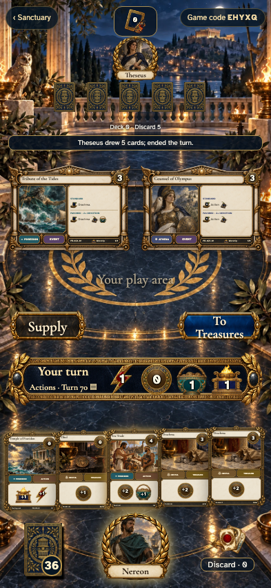</a></td>
</tr>
</table>

Tabletop · 3840 × 2160 — expand screenshot

<a href="../../screenshots/poseidon-keeps-the-payment-and-grants-his-favored-buy-when-drachmas-are-exhausted/000-opening-tabletop-4k-darwin.png">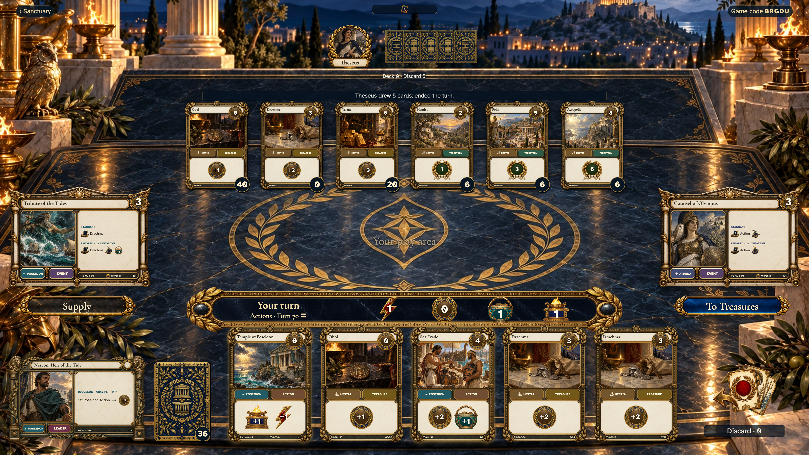</a>

- [x] The shared Drachma supply is exhausted

## Nereon’s Temple provides the first Coin

<table>
<tr><th>Desktop · 1440 × 1000</th><th>Phone · 393 × 852</th></tr>
<tr>
<td valign="top"><a href="../../screenshots/poseidon-keeps-the-payment-and-grants-his-favored-buy-when-drachmas-are-exhausted/001-temple-desktop-darwin.png">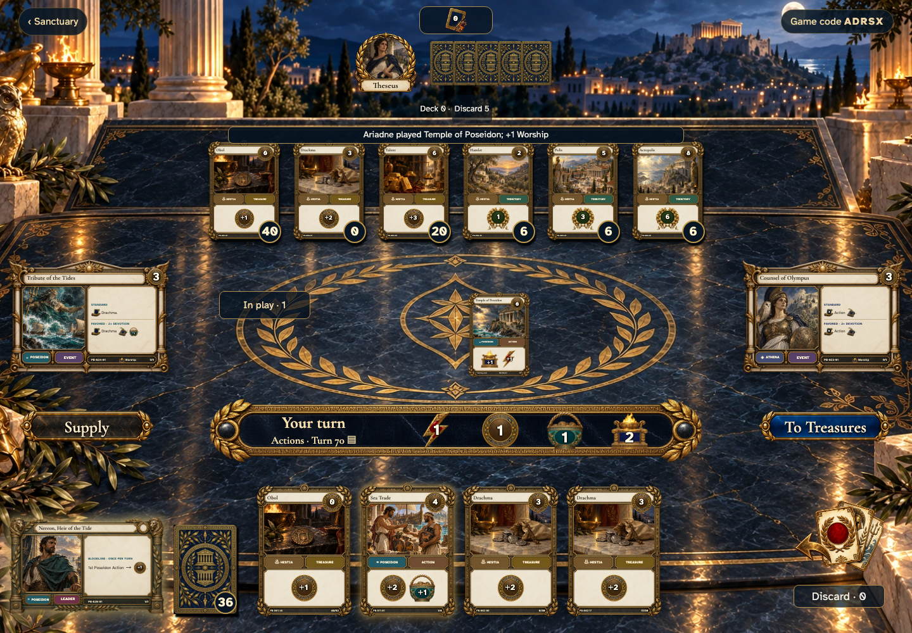</a></td>
<td valign="top"><a href="../../screenshots/poseidon-keeps-the-payment-and-grants-his-favored-buy-when-drachmas-are-exhausted/001-temple-phone-darwin.png">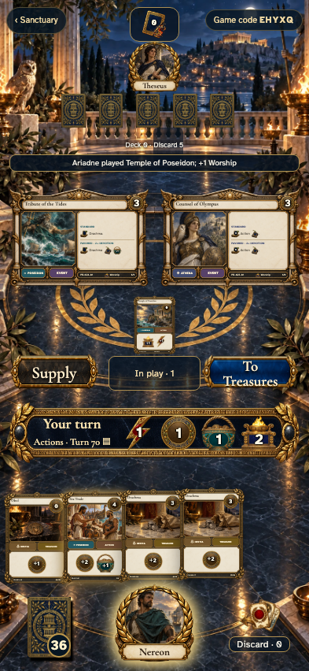</a></td>
</tr>
</table>

Tabletop · 3840 × 2160 — expand screenshot

<a href="../../screenshots/poseidon-keeps-the-payment-and-grants-his-favored-buy-when-drachmas-are-exhausted/001-temple-tabletop-4k-darwin.png">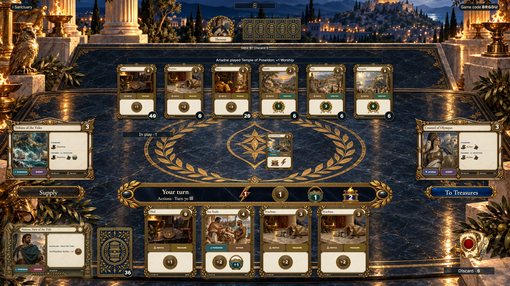</a>

- [x] Nereon’s Temple provides the first Coin

## Sea Trade funds Worship and provides the second Devotion

<table>
<tr><th>Desktop · 1440 × 1000</th><th>Phone · 393 × 852</th></tr>
<tr>
<td valign="top"><a href="../../screenshots/poseidon-keeps-the-payment-and-grants-his-favored-buy-when-drachmas-are-exhausted/002-trade-desktop-darwin.png">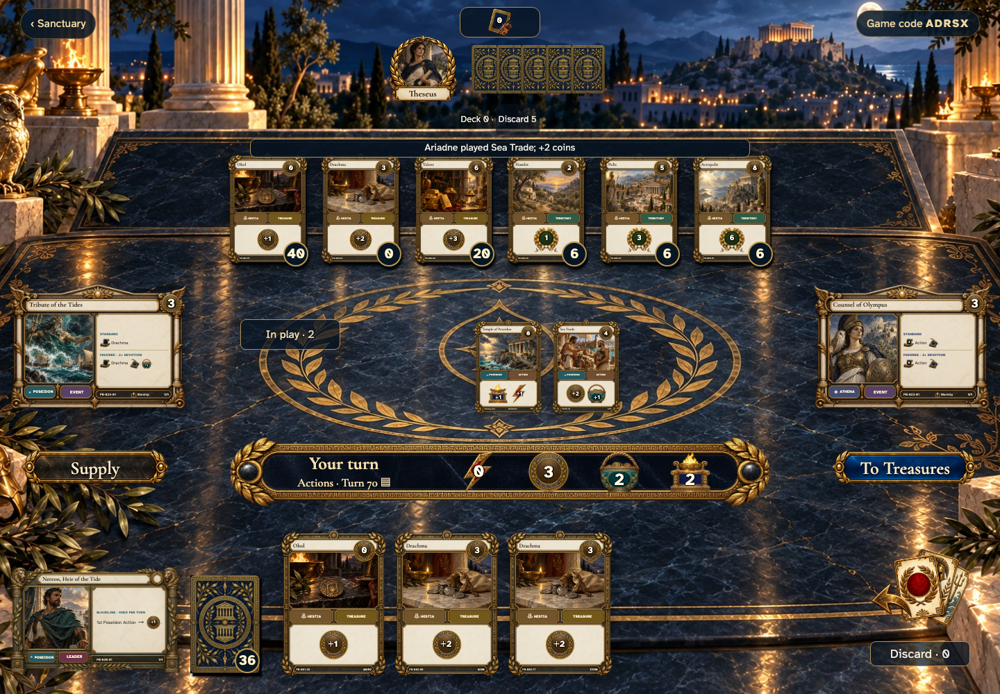</a></td>
<td valign="top"><a href="../../screenshots/poseidon-keeps-the-payment-and-grants-his-favored-buy-when-drachmas-are-exhausted/002-trade-phone-darwin.png">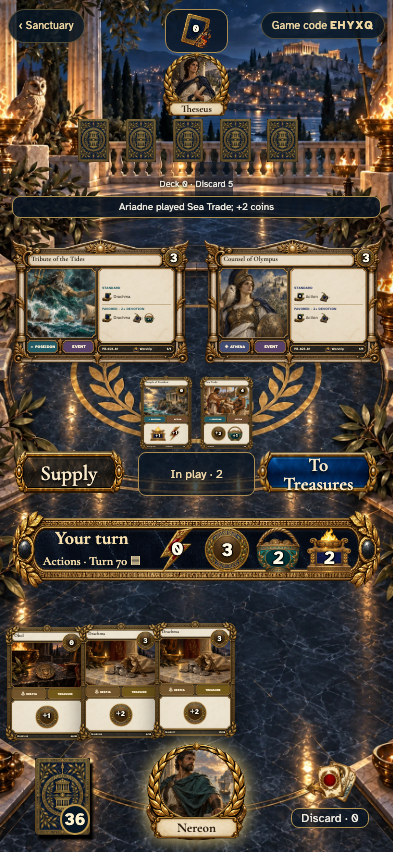</a></td>
</tr>
</table>

Tabletop · 3840 × 2160 — expand screenshot

<a href="../../screenshots/poseidon-keeps-the-payment-and-grants-his-favored-buy-when-drachmas-are-exhausted/002-trade-tabletop-4k-darwin.png">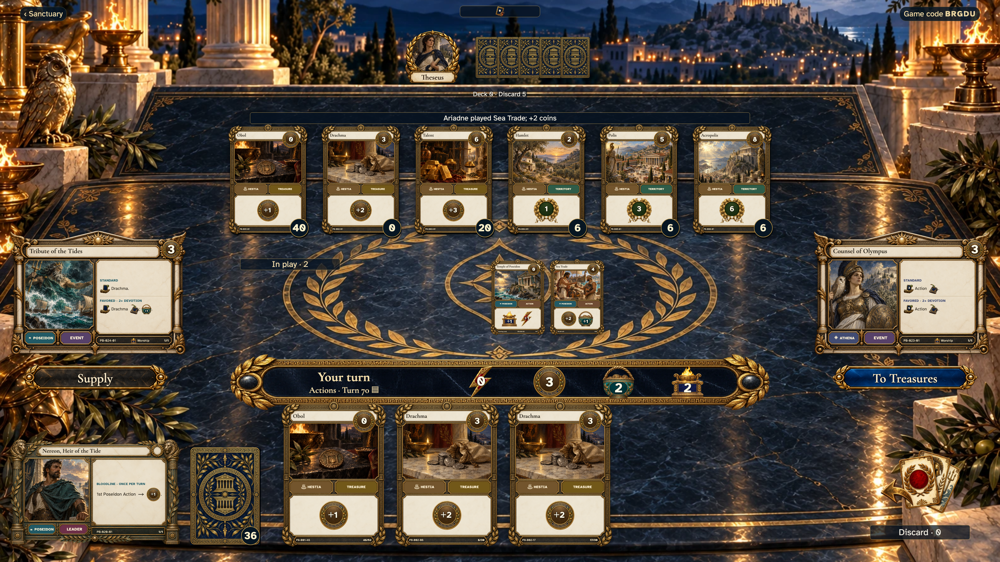</a>

- [x] Sea Trade funds Worship and provides the second Devotion

## The event remains available even though it cannot gain a Drachma

<table>
<tr><th>Desktop · 1440 × 1000</th><th>Phone · 393 × 852</th></tr>
<tr>
<td valign="top"><a href="../../screenshots/poseidon-keeps-the-payment-and-grants-his-favored-buy-when-drachmas-are-exhausted/003-altar-desktop-darwin.png">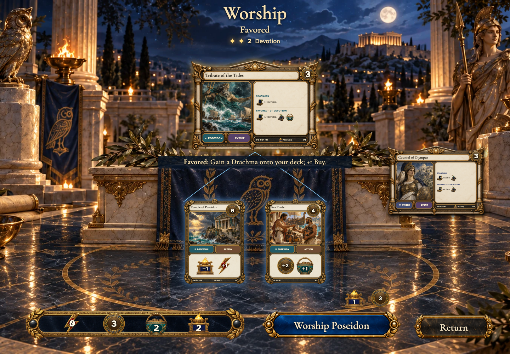</a></td>
<td valign="top"><a href="../../screenshots/poseidon-keeps-the-payment-and-grants-his-favored-buy-when-drachmas-are-exhausted/003-altar-phone-darwin.png">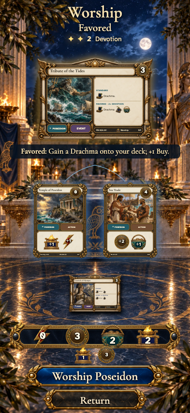</a></td>
</tr>
</table>

Tabletop · 3840 × 2160 — expand screenshot

<a href="../../screenshots/poseidon-keeps-the-payment-and-grants-his-favored-buy-when-drachmas-are-exhausted/003-altar-tabletop-4k-darwin.png">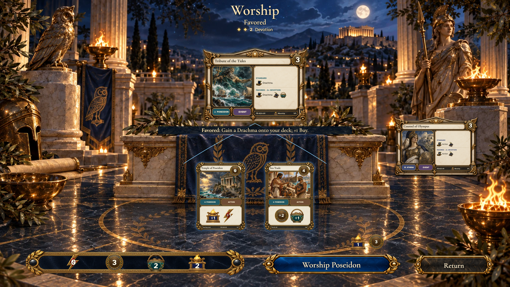</a>

- [x] The event remains available even though it cannot gain a Drachma

## The bonus Buy still arrives and the payment is not refunded

<table>
<tr><th>Desktop · 1440 × 1000</th><th>Phone · 393 × 852</th></tr>
<tr>
<td valign="top"><a href="../../screenshots/poseidon-keeps-the-payment-and-grants-his-favored-buy-when-drachmas-are-exhausted/004-gift-desktop-darwin.png">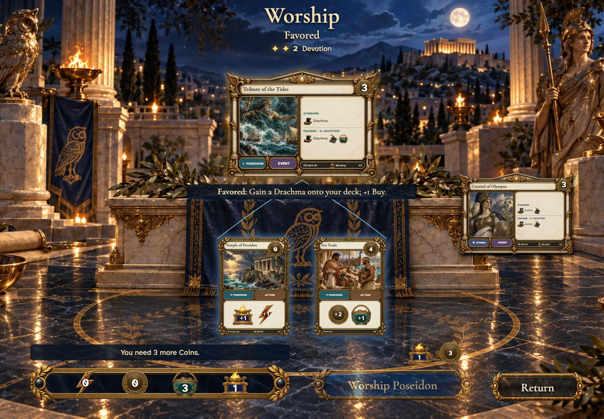</a></td>
<td valign="top"></td>
</tr>
</table>

Tabletop · 3840 × 2160 — expand screenshot

<a href="../../screenshots/poseidon-keeps-the-payment-and-grants-his-favored-buy-when-drachmas-are-exhausted/004-gift-tabletop-4k-darwin.png">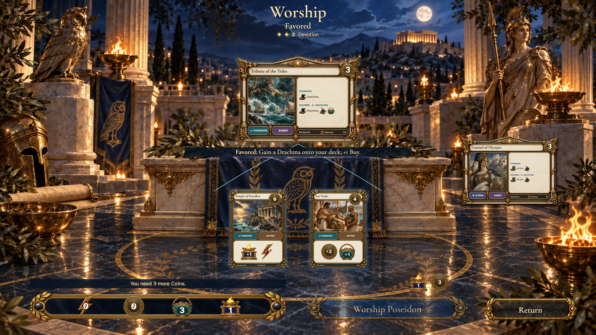</a>

- [x] The bonus Buy still arrives and the payment is not refunded
